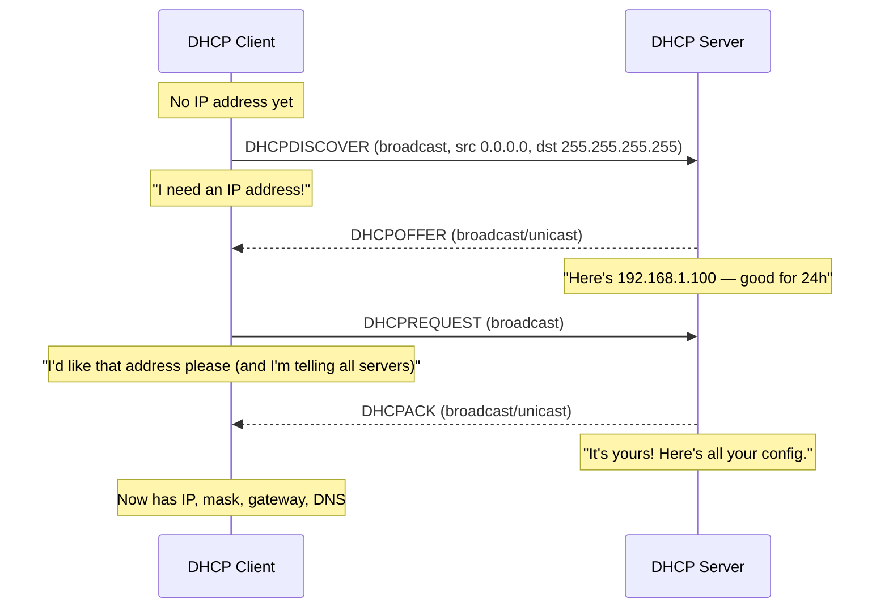
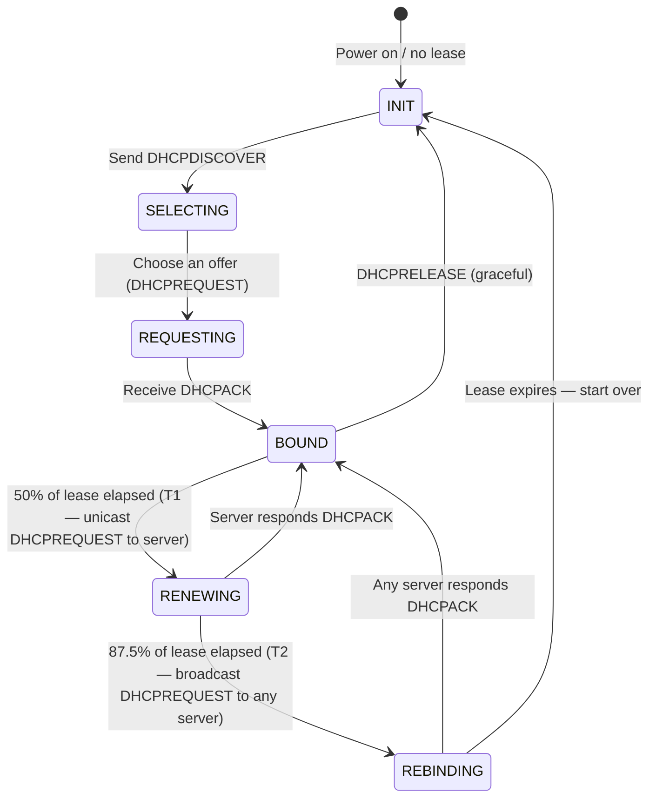
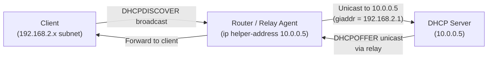
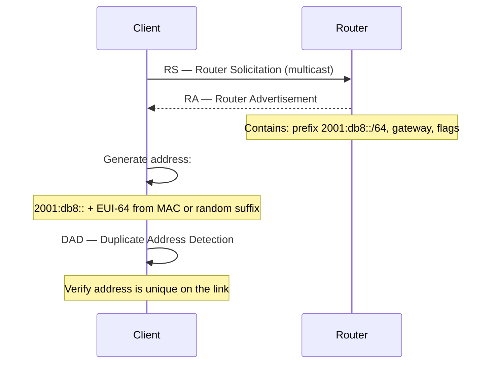

import \{ Tabs, TabItem \} from '@astrojs/starlight/components';
import \{ Aside, Card, CardGrid, Steps, Badge \} from '@astrojs/starlight/components';


DHCP (Dynamic Host Configuration Protocol) automatically assigns IP addresses and network configuration to hosts, eliminating manual configuration. Without DHCP, every device would require static IP configuration — an operational nightmare at scale.

## What DHCP Provides

A DHCP server can hand out all the information a host needs to communicate:

| Parameter | DHCP Option | Example |
|---|---|---|
| IP address | Core | 192.168.1.100 |
| Subnet mask | Option 1 | 255.255.255.0 (/24) |
| Default gateway | Option 3 | 192.168.1.1 |
| DNS server(s) | Option 6 | 8.8.8.8, 8.8.4.4 |
| Domain name | Option 15 | corp.example.com |
| NTP server | Option 42 | 192.168.1.1 |
| Lease time | Option 51 | 86400 seconds (24 h) |
| WINS server | Option 44 | (legacy Windows) |
| TFTP server | Option 66 | For PXE boot |
| Boot file | Option 67 | pxelinux.0 |

---

## The DORA Process

DHCP uses a four-message exchange called **DORA** (Discover, Offer, Request, Acknowledge):



### Why DHCPREQUEST is Broadcast

Even though the client has received an offer, the DHCPREQUEST is sent as a broadcast. This informs **all** DHCP servers that the client has chosen one offer — servers whose offer was not accepted can reclaim their reserved address.

---

## Lease Lifecycle

A DHCP lease is time-limited. The client must renew or it loses the address.



| Timer | Default | Action |
|---|---|---|
| T1 (renewal) | 50% of lease | Unicast DHCPREQUEST to the original server |
| T2 (rebinding) | 87.5% of lease | Broadcast DHCPREQUEST to any server |
| Expiry | 100% | Address released; host must restart DORA |

---

## DHCP Relay Agent

By default, DHCP uses broadcast, which routers do not forward between subnets. A **DHCP relay agent** (also called IP Helper) intercepts DHCP broadcasts on a subnet and forwards them as unicast to the DHCP server in a different subnet.



The `giaddr` (gateway IP address) field in the relayed packet tells the DHCP server which subnet the client is on, so it assigns an address from the correct pool.

**Cisco router relay configuration:**
```
interface GigabitEthernet0/1
 ip address 192.168.2.1 255.255.255.0
 ip helper-address 10.0.0.5
```

---

## DHCP Server Configuration

### ISC DHCP Server (Linux)

```
# /etc/dhcp/dhcpd.conf

default-lease-time 86400;       # 24 hours
max-lease-time 172800;          # 48 hours maximum

subnet 192.168.1.0 netmask 255.255.255.0 {
    range 192.168.1.100 192.168.1.200;

    option routers 192.168.1.1;
    option subnet-mask 255.255.255.0;
    option domain-name-servers 8.8.8.8, 8.8.4.4;
    option domain-name "home.local";
    option ntp-servers 192.168.1.1;
}

# Static assignment (reservation by MAC address)
host myserver {
    hardware ethernet aa:bb:cc:dd:ee:ff;
    fixed-address 192.168.1.10;
    option host-name "myserver";
}
```

### Windows DHCP Server

```powershell
# Add DHCP scope
Add-DhcpServerv4Scope -Name "Office LAN" `
    -StartRange 192.168.1.100 `
    -EndRange 192.168.1.200 `
    -SubnetMask 255.255.255.0

# Set scope options
Set-DhcpServerv4OptionValue -ScopeId 192.168.1.0 `
    -Router 192.168.1.1 `
    -DnsServer 8.8.8.8,8.8.4.4 `
    -DnsDomain "corp.example.com"

# Add reservation
Add-DhcpServerv4Reservation -ScopeId 192.168.1.0 `
    -IPAddress 192.168.1.10 `
    -ClientId "AA-BB-CC-DD-EE-FF" `
    -Description "Server A"
```

---

## DHCP Failover

Production networks use two DHCP servers in a **failover pair** so address assignment survives one server failing.

**How it works:** The two servers share the address pool. In Active/Passive mode, the standby takes over if the active fails. In Load Balancing mode, both servers handle requests simultaneously (typically 50/50 split).

| Mode | Description |
|---|---|
| **Active/Passive** (Hot Standby) | Passive monitors active; takes over on failure |
| **Load Balancing** | Both serve clients; pool is divided |

The servers communicate over TCP port 647 to sync lease state.

---

## DHCPv6 and SLAAC (IPv6)

IPv6 has two mechanisms for automatic address configuration:

### SLAAC — Stateless Address Autoconfiguration

The client generates its own IPv6 address from the network prefix announced by the router, without a DHCP server:



SLAAC provides the IP address but **not** DNS servers (unless the router includes them in the RA via RDNSS option, RFC 8106).

### DHCPv6

Similar to DHCPv4 but uses multicast and different message types:

| Message | Equivalent |
|---|---|
| SOLICIT | DHCPDISCOVER |
| ADVERTISE | DHCPOFFER |
| REQUEST | DHCPREQUEST |
| REPLY | DHCPACK |
| RELEASE | DHCPRELEASE |
| RENEW | DHCPREQUEST (renewal) |

**Stateful DHCPv6:** Assigns full IPv6 addresses (like DHCPv4).
**Stateless DHCPv6:** Client uses SLAAC for the address but queries DHCPv6 only for options like DNS.

The `M` and `O` flags in Router Advertisements tell clients which method to use:
- `M=1` → Use stateful DHCPv6 for address
- `O=1` → Use DHCPv6 for other info (DNS, NTP)
- `M=0, O=0` → Use SLAAC only

---

## Security Considerations

### DHCP Starvation Attack

An attacker sends thousands of DHCP DISCOVERs with spoofed MACs, exhausting the address pool. Legitimate clients cannot get addresses.

**Defence:** DHCP snooping on managed switches limits DHCP requests per port.

### Rogue DHCP Server

An attacker runs a DHCP server on the network and offers addresses with a malicious gateway or DNS server → man-in-the-middle.

**Defence:** DHCP snooping designates only specific switch ports as trusted (connected to real DHCP servers). DHCP offers on untrusted ports are dropped.

```
! Cisco switch — DHCP snooping
ip dhcp snooping
ip dhcp snooping vlan 10,20
no ip dhcp snooping information option   ! disable option 82 if causing issues

interface GigabitEthernet1/0/48
 description Uplink to DHCP server
 ip dhcp snooping trust

interface GigabitEthernet1/0/1
 description Client port — untrusted by default
 ip dhcp snooping limit rate 10         ! max 10 DHCP packets/second
```

### DHCP vs Static Assignment

| Scenario | Use Static | Use DHCP |
|---|---|---|
| Servers | ✓ (predictable, no server needed) | ✓ (DHCP reservation is equivalent) |
| Printers | ✓ or DHCP reservation | ✓ reservation |
| User workstations | | ✓ dynamic |
| IoT devices | | ✓ (or reservation if port-forwarding) |
| Routers / network infrastructure | ✓ | ✗ |

DHCP **reservations** (static DHCP) are the best of both worlds: the address is always the same for a given MAC, but configuration is centralised in the DHCP server.
