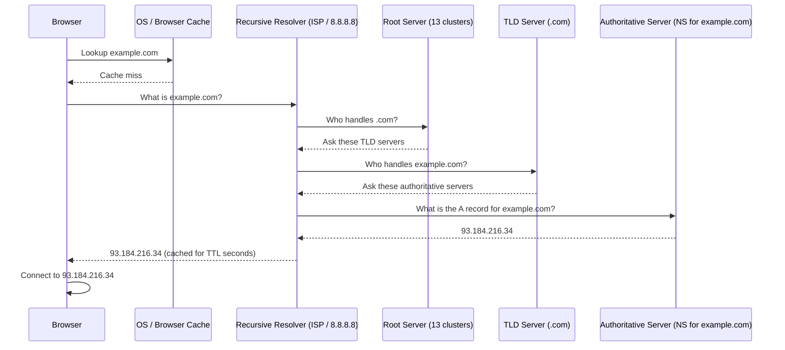
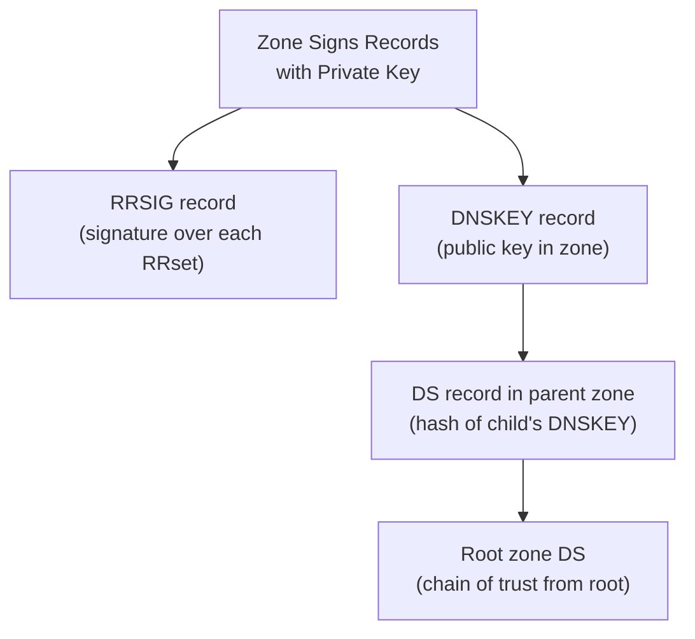

DNS is the internet's phone book — it translates human-readable domain names (like `example.com`) into IP addresses that routers can use to forward traffic. DNS is also used for email routing (MX records), service discovery (SRV), domain verification (TXT), and security extensions (DNSSEC, SPF, DKIM, DMARC).

## How DNS Resolution Works



This is a **recursive query** — the resolver does all the work on behalf of the client. The process is invisible to the user and typically takes < 50 ms.

### Caching at Each Level

| Level | Cache Location | Controlled By |
|---|---|---|
| Browser | Chrome/Firefox in-process cache | Browser TTL (often 60 s max) |
| OS | `nscd`, `systemd-resolved`, Windows DNS cache | TTL from record |
| Router | Some consumer routers cache DNS | TTL from record |
| Recursive resolver | ISP resolver, Google `8.8.8.8`, Cloudflare `1.1.1.1` | TTL from authoritative record |

**TTL (Time to Live):** The number of seconds a record can be cached. Low TTL (60–300 s) allows rapid changes but increases resolver load. High TTL (86400 s = 1 day) reduces load but slows propagation.

---

## DNS Record Types

### A — IPv4 Address

```
example.com.    3600    IN    A    93.184.216.34
```

Maps a hostname to an IPv4 address. The most fundamental DNS record.

### AAAA — IPv6 Address

```
example.com.    3600    IN    AAAA    2606:2800:220:1:248:1893:25c8:1946
```

Maps a hostname to an IPv6 address.

### CNAME — Canonical Name (Alias)

```
www.example.com.    3600    IN    CNAME    example.com.
```

Aliases one hostname to another. The client must resolve the target further. **A CNAME cannot coexist with other records at the same name** — this is why zone apex (`@`) cannot be a CNAME (use ALIAS or ANAME instead, or flatten at the DNS provider).

### MX — Mail Exchanger

```
example.com.    3600    IN    MX    10    mail1.example.com.
example.com.    3600    IN    MX    20    mail2.example.com.
```

Specifies which server accepts email for the domain. Lower priority number = higher preference (tried first). Multiple MX records provide failover.

### TXT — Text

Free-form text used for domain verification, email security, and other metadata:

```
; SPF — authorised mail senders
example.com.    IN    TXT    "v=spf1 include:_spf.google.com ~all"

; DKIM — public key for email signing
google._domainkey.example.com.    IN    TXT    "v=DKIM1; k=rsa; p=MIGfMA0GCSqGSIb3..."

; DMARC — email policy
_dmarc.example.com.    IN    TXT    "v=DMARC1; p=quarantine; rua=mailto:dmarc@example.com"

; Domain ownership verification (Google, GitHub, etc.)
example.com.    IN    TXT    "google-site-verification=abc123..."
```

### NS — Name Server

```
example.com.    86400    IN    NS    ns1.cloudflare.com.
example.com.    86400    IN    NS    ns2.cloudflare.com.
```

Delegates authority for a domain to the listed name servers. These must also be registered with the domain registrar.

### SOA — Start of Authority

Every zone has exactly one SOA record containing zone metadata:

```
example.com.    IN    SOA    ns1.example.com. admin.example.com. (
    2024031501    ; Serial (YYYYMMDDnn)
    3600          ; Refresh — how often secondaries poll
    900           ; Retry — how long secondaries wait after failed refresh
    604800        ; Expire — how long secondary serves data without refresh
    300           ; Minimum TTL / negative TTL
)
```

### PTR — Pointer (Reverse DNS)

Maps an IP address back to a hostname:

```
34.216.184.93.in-addr.arpa.    IN    PTR    example.com.
```

The IP is written in reverse and appended with `.in-addr.arpa.`. Used for email reputation checks and logging.

### SRV — Service Location

Specifies host and port for a specific service/protocol:

```
_xmpp-server._tcp.example.com.    IN    SRV    5 0 5269 xmpp.example.com.
; Format: priority weight port target
```

Used by SIP, XMPP, LDAP, Kubernetes service discovery.

### CAA — Certification Authority Authorization

Controls which CAs can issue TLS certificates for your domain:

```
example.com.    IN    CAA    0 issue "letsencrypt.org"
example.com.    IN    CAA    0 issuewild ";"           ; deny wildcard certs
example.com.    IN    CAA    0 iodef "mailto:security@example.com"
```

---

## Zones and Delegation

A **zone** is a portion of the DNS namespace managed by a specific set of name servers. The **zone file** contains all the records for that zone.

**Zone delegation** allows a parent zone to hand off a subdomain to different name servers:

```
; In example.com zone:
sub.example.com.    IN    NS    ns1.other-provider.com.
sub.example.com.    IN    NS    ns2.other-provider.com.
```

All queries for `*.sub.example.com` are now handled by `other-provider.com`'s servers.

### Zone Transfer

Secondaries replicate zone data from the primary via **AXFR** (full transfer) or **IXFR** (incremental). Zone transfers should be restricted to authorised secondary servers only — unrestricted AXFR exposes your entire zone.

```bash
# ✗ Vulnerable — full zone dump
dig @ns1.example.com example.com AXFR

# ✓ Restrict zone transfers in BIND
acl trusted-secondaries { 10.0.0.2; 10.0.0.3; };
zone "example.com" {
    allow-transfer { trusted-secondaries; };
};
```

---

## Resolver Types

| Type | Role |
|---|---|
| **Stub resolver** | OS resolver; asks a recursive resolver and caches answers |
| **Recursive / Caching resolver** | Does the full resolution on behalf of clients; caches results |
| **Authoritative** | Holds the actual zone data; answers with authority |
| **Forwarding resolver** | Forwards all queries to another resolver (often an internal policy server) |

### Public Resolvers

| Provider | Primary | Secondary | Features |
|---|---|---|---|
| Google | `8.8.8.8` | `8.8.4.4` | Fast, global, DNSSEC |
| Cloudflare | `1.1.1.1` | `1.0.0.1` | Privacy-focused, DNSSEC, fast |
| Quad9 | `9.9.9.9` | `149.112.112.112` | Blocks malicious domains |
| OpenDNS | `208.67.222.222` | `208.67.220.220` | Content filtering options |

---

## DNSSEC

DNS Security Extensions add cryptographic signatures to DNS records, allowing resolvers to verify records have not been tampered with. DNSSEC **does not encrypt DNS** — it only authenticates records.



**Key record types in DNSSEC:**

| Record | Purpose |
|---|---|
| `RRSIG` | Cryptographic signature over an RRset |
| `DNSKEY` | Public key used to verify RRSIGs |
| `DS` | Hash of a child zone's DNSKEY (in the parent zone) |
| `NSEC` / `NSEC3` | Proves non-existence of records (authenticated denial) |

---

## Common Tools

```bash
# Basic lookup
nslookup example.com
nslookup -type=MX example.com
nslookup example.com 8.8.8.8     # specify resolver

# dig — more detail
dig example.com                   # A record
dig example.com MX
dig example.com TXT
dig example.com NS
dig +trace example.com            # trace full resolution chain
dig @1.1.1.1 example.com          # query specific resolver
dig -x 93.184.216.34              # reverse DNS
dig example.com ANY               # all record types
dig +dnssec example.com           # include DNSSEC records

# host — simple
host example.com
host -t MX example.com

# Windows
Resolve-DnsName example.com
Resolve-DnsName -Type MX example.com

# Flush DNS cache
sudo systemd-resolve --flush-caches   # Linux (systemd)
sudo dscacheutil -flushcache          # macOS
ipconfig /flushdns                    # Windows
```

---

## DNS Security Issues

| Attack | Description | Mitigation |
|---|---|---|
| **DNS spoofing / Cache poisoning** | Inject fake records into resolver cache | DNSSEC, source port randomisation |
| **DNS hijacking** | Change resolver settings on the device/router | Encrypt DNS (DoH/DoT), verify resolver |
| **DNS exfiltration** | Encode data in DNS queries to bypass firewalls | DNS monitoring, restrict to authorised resolvers |
| **DDoS via amplification** | Send spoofed queries; resolver sends large responses to victim | BCP38 egress filtering, rate limiting on resolvers |
| **Zone transfer abuse** | Dump all records from a zone | Restrict `AXFR` to authorised secondaries |
| **Subdomain takeover** | CNAME pointing to deleted cloud resource | Monitor dangling CNAMEs |

### Encrypted DNS

| Protocol | Port | Description |
|---|---|---|
| **DNS over TLS (DoT)** | TCP 853 | Wraps DNS in TLS; identifiable by port |
| **DNS over HTTPS (DoH)** | TCP 443 | Wraps DNS in HTTPS; blends with web traffic |
| **DNS over QUIC (DoQ)** | UDP 853 | QUIC-based transport; lower latency |
