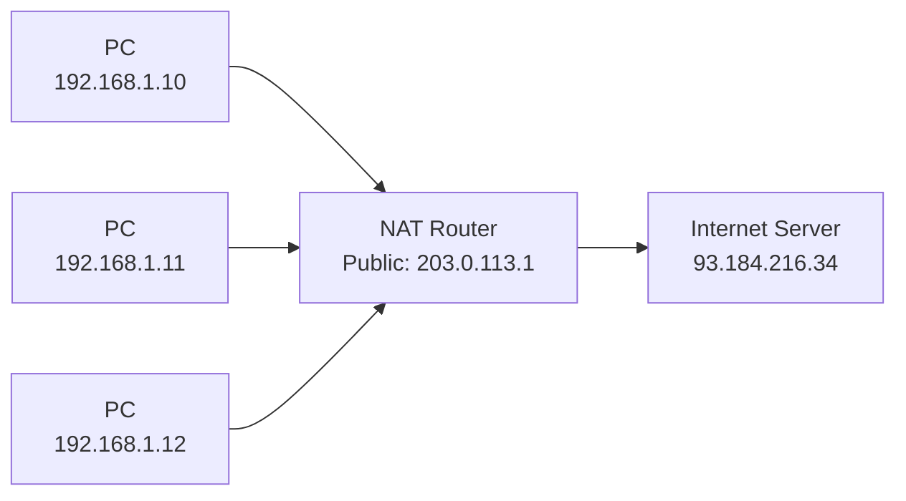

---
title: "IP Addressing & Subnetting"
description: "IPv4 structure, address classes, private ranges, CIDR notation, subnetting calculations, IPv6 addressing, NAT, and practical reference tables."
---

import { Tabs, TabItem } from '@astrojs/starlight/components';
import { Aside, Card, CardGrid, Steps, Badge } from '@astrojs/starlight/components';


IP addressing is the logical layer that makes global routing possible. Every device on a network needs a unique IP address within its scope. Understanding subnetting, CIDR, and NAT is a daily skill for anyone who configures or troubleshoots networks.

## IPv4 Addressing

An IPv4 address is a **32-bit number** written as four decimal octets separated by dots:

```
192   .   168   .    1    .   100
11000000 . 10101000 . 00000001 . 01100100
```

Each octet is 8 bits → 4 × 8 = 32 bits total → 2³² = ~4.3 billion possible addresses.

### Address Classes (Historical)

Before CIDR, addresses were divided into fixed classes. Modern networks use CIDR instead, but classes still appear in documentation and exams.

| Class | First Bits | Range | Default Mask | # of Networks | Hosts/Network | Use |
|---|---|---|---|---|---|---|
| A | 0xxx | 0.0.0.0 – 127.255.255.255 | /8 | 128 | 16,777,214 | Large organisations |
| B | 10xx | 128.0.0.0 – 191.255.255.255 | /16 | 16,384 | 65,534 | Medium orgs |
| C | 110x | 192.0.0.0 – 223.255.255.255 | /24 | 2,097,152 | 254 | Small orgs |
| D | 1110 | 224.0.0.0 – 239.255.255.255 | — | — | — | Multicast |
| E | 1111 | 240.0.0.0 – 255.255.255.255 | — | — | — | Reserved/experimental |

### Special IPv4 Ranges

| Range | Purpose |
|---|---|
| `0.0.0.0/8` | "This" network — used as source before address assignment |
| `10.0.0.0/8` | Private (Class A) |
| `127.0.0.0/8` | Loopback — `127.0.0.1` is always "this machine" |
| `169.254.0.0/16` | Link-local — APIPA (auto-assigned when DHCP fails) |
| `172.16.0.0/12` | Private (Class B range — 172.16.x.x to 172.31.x.x) |
| `192.168.0.0/16` | Private (Class C — most common home/office range) |
| `224.0.0.0/4` | Multicast |
| `255.255.255.255` | Limited broadcast |

---

## CIDR — Classless Inter-Domain Routing

CIDR replaced the rigid class system. A CIDR prefix specifies how many bits are the **network portion**; the rest are **host bits**.

```
192.168.1.0/24
              └─ prefix length: 24 bits are the network, 8 bits are hosts
```

### Subnet Mask

A **subnet mask** is a 32-bit number with the network bits set to 1 and host bits set to 0:

```
/24 → 255.255.255.0  → 11111111.11111111.11111111.00000000
/25 → 255.255.255.128 → 11111111.11111111.11111111.10000000
/16 → 255.255.0.0    → 11111111.11111111.00000000.00000000
```

### Calculating Network, Broadcast, and Host Range

For `192.168.1.130/25`:

```
Subnet mask:     255.255.255.128  (/25)
IP address:      192.168.1.130
                 11000000.10101000.00000001.10000010

Network address: 192.168.1.128    (host bits all 0)
Broadcast:       192.168.1.255    (host bits all 1)
Host range:      192.168.1.129 – 192.168.1.254
Usable hosts:    126  (2⁷ - 2 = 128 - 2)
```

### CIDR Reference Table

| CIDR | Subnet Mask | # Hosts | # Subnets from /24 | Use |
|---|---|---|---|---|
| /30 | 255.255.255.252 | 2 | 64 | Point-to-point links |
| /29 | 255.255.255.248 | 6 | 32 | Small segments |
| /28 | 255.255.255.240 | 14 | 16 | Small departments |
| /27 | 255.255.255.224 | 30 | 8 | Small offices |
| /26 | 255.255.255.192 | 62 | 4 | Medium departments |
| /25 | 255.255.255.128 | 126 | 2 | Large department |
| /24 | 255.255.255.0 | 254 | 1 | Standard LAN |
| /23 | 255.255.254.0 | 510 | — | Two merged /24s |
| /22 | 255.255.252.0 | 1022 | — | Large LAN |
| /16 | 255.255.0.0 | 65,534 | — | Large campus |
| /8 | 255.0.0.0 | 16,777,214 | — | Entire Class A |

**Formula:** Usable hosts = 2^(32 - prefix) − 2 (subtract network and broadcast addresses).

### Subnetting Example

**Task:** Divide `10.0.0.0/24` into 4 equal subnets.

4 subnets requires 2 bits (2² = 4) → prefix becomes /26 (24 + 2):

| Subnet | Network | First Host | Last Host | Broadcast |
|---|---|---|---|---|
| 1 | 10.0.0.0/26 | 10.0.0.1 | 10.0.0.62 | 10.0.0.63 |
| 2 | 10.0.0.64/26 | 10.0.0.65 | 10.0.0.126 | 10.0.0.127 |
| 3 | 10.0.0.128/26 | 10.0.0.129 | 10.0.0.190 | 10.0.0.191 |
| 4 | 10.0.0.192/26 | 10.0.0.193 | 10.0.0.254 | 10.0.0.255 |

Each subnet has 62 usable host addresses.

---

## NAT — Network Address Translation

Private IPv4 addresses (RFC 1918) are not routable on the internet. NAT translates private IPs to a public IP at the router/firewall boundary, enabling thousands of devices to share one public IP.



### NAT Types

| Type | Description |
|---|---|
| **Static NAT** | One-to-one mapping; private IP → fixed public IP (hosting servers) |
| **Dynamic NAT** | Pool of public IPs; assigned from pool as needed |
| **PAT / Overload / NAPT** | Many private IPs → one public IP, differentiated by source port. Used in virtually all home/office routers. |

PAT example:
```
192.168.1.10:52001  → 203.0.113.1:52001  (to 93.184.216.34:443)
192.168.1.11:49302  → 203.0.113.1:49302  (to 93.184.216.34:443)
```

The NAT table tracks source port mappings to reverse-translate return traffic.

---

## IPv6

IPv4 exhaustion (the last /8 blocks were allocated in 2011) makes IPv6 essential. IPv6 uses **128-bit addresses** — 340 undecillion possible addresses.

### Address Format

Written as eight groups of four hexadecimal digits, separated by colons:
```
2001:0db8:85a3:0000:0000:8a2e:0370:7334
```

**Shortening rules:**
1. Leading zeros within a group can be omitted: `0db8` → `db8`
2. One contiguous sequence of all-zero groups can be replaced with `::` (only once):
```
2001:0db8:0000:0000:0000:0000:0370:7334
→ 2001:db8::370:7334
```

### IPv6 Address Types

| Type | Prefix | Scope |
|---|---|---|
| **Unicast — Global** | `2000::/3` | Internet-routable (equivalent to public IPv4) |
| **Unicast — Link-local** | `fe80::/10` | Single link only; auto-configured by every IPv6 host |
| **Unicast — Unique local** | `fc00::/7` | Private (RFC 1918 equivalent) |
| **Multicast** | `ff00::/8` | Group delivery (replaces broadcast) |
| **Loopback** | `::1/128` | Self (like 127.0.0.1) |
| **Unspecified** | `::/128` | "No address" (like 0.0.0.0) |

### IPv6 Subnetting

ISPs typically assign a `/48` to an organisation, which can be split into 65,536 `/64` subnets. A `/64` subnet gives each host 2⁶⁴ addresses — enabling SLAAC (Stateless Address Autoconfiguration).

```
Organisation prefix:  2001:db8:1234::/48
Subnet 1:             2001:db8:1234:0001::/64
Subnet 2:             2001:db8:1234:0002::/64
...
Subnet 65536:         2001:db8:1234:FFFF::/64
```

### Key IPv6 Differences from IPv4

| Feature | IPv4 | IPv6 |
|---|---|---|
| Address size | 32-bit | 128-bit |
| Address assignment | DHCP or manual | SLAAC (auto), DHCPv6, or manual |
| Broadcast | ✓ | ✗ (replaced by multicast) |
| NAT | Common | Not needed (every device gets a public IP) |
| Fragmentation | Routers and hosts | End hosts only |
| Header size | Variable (20–60 bytes) | Fixed 40 bytes (+ extension headers) |
| IPsec | Optional | Built-in (mandatory in spec, optional in practice) |
| ARP | ✓ | ✗ (replaced by NDP — Neighbour Discovery Protocol) |

---

## Practical Commands

```bash
# Show IP configuration
ip addr show                # Linux
ipconfig /all               # Windows
ifconfig                    # macOS / older Linux

# Show routing table
ip route show               # Linux
route print                 # Windows
netstat -rn                 # macOS

# Add a static route (Linux)
ip route add 10.10.0.0/16 via 192.168.1.1 dev eth0

# Check if an IP is reachable
ping 192.168.1.1
ping -c 4 8.8.8.8           # Linux (4 packets)

# Trace route to destination
traceroute 8.8.8.8          # Linux/macOS
tracert 8.8.8.8             # Windows

# Show ARP cache (IP → MAC mappings)
arp -a
ip neigh show               # Linux

# DNS lookup
nslookup example.com
dig example.com A
dig -x 93.184.216.34        # reverse lookup
```
