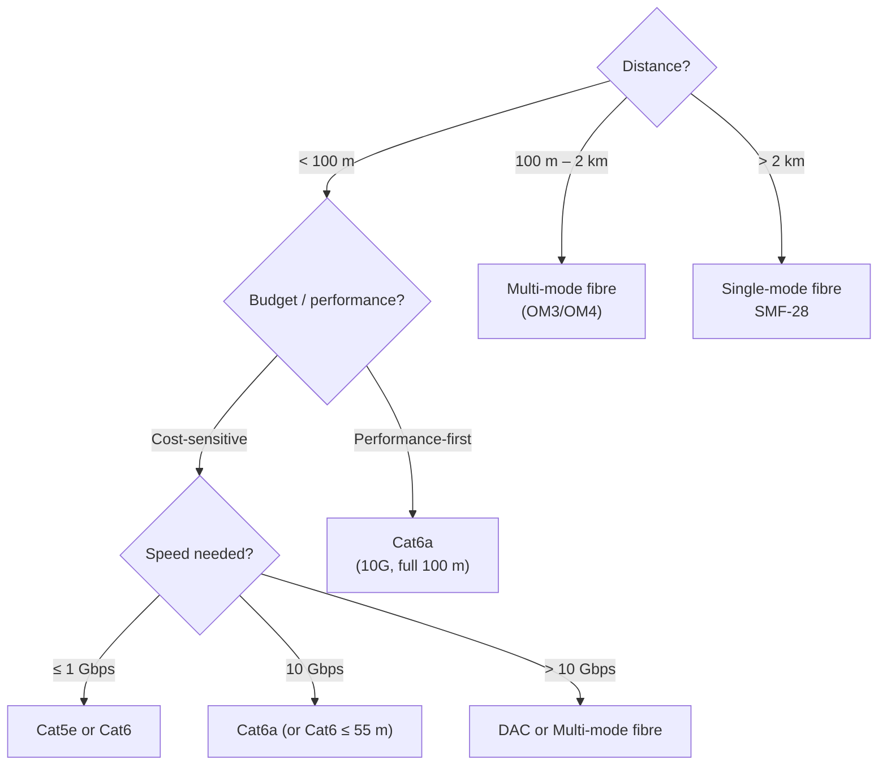

The physical layer is the foundation of every network. The medium determines maximum speed, distance, noise immunity, and cost. This page covers every physical transmission technology you'll encounter in real deployments.

## Ethernet Copper (Twisted Pair)

Copper Ethernet cables use four twisted wire pairs inside an insulating jacket. Twisting the pairs reduces **electromagnetic interference (EMI)** — each twist cancels out interference from its neighbour.

### Cable Categories

| Category | Max Speed | Max Distance | Frequency | Use Case |
|---|---|---|---|---|
| **Cat5** | 100 Mbps | 100 m | 100 MHz | Legacy — obsolete |
| **Cat5e** | 1 Gbps | 100 m | 100 MHz | Home/small office — still common |
| **Cat6** | 1 Gbps (10G up to 55 m) | 100 m | 250 MHz | Office standard today |
| **Cat6a** (Augmented) | 10 Gbps | 100 m | 500 MHz | Data centre, 10G to desktops |
| **Cat7** | 10 Gbps | 100 m | 600 MHz | Industrial, rarely used in IT |
| **Cat8** | 25/40 Gbps | 30 m | 2000 MHz | Data centre top-of-rack links |

**Key rule:** All categories top out at **100 metres** for standard Ethernet (the spec is 90 m + 10 m patch cables). Beyond that, you need a switch or a repeater.

### Shielding Nomenclature

| Code | Meaning |
|---|---|
| **UTP** | Unshielded Twisted Pair — no shielding |
| **FTP / STP** | Foil around all pairs |
| **SFTP / S/FTP** | Overall braid shield + foil per pair |
| **SSTP** | Double shielding — extreme EMI environments |

Shielded cables require **grounded connectors and patch panels** — floating shield ground makes interference worse, not better.

### Connectors

**RJ-45** — the ubiquitous 8P8C modular connector used for Ethernet.

Wiring standards:
- **T568A** and **T568B** — the two pinout standards. T568B is more common in the US.
- Use the **same standard on both ends** for a straight-through cable (device to switch).
- Use **T568A on one end and T568B on the other** for a crossover cable (device to device — now largely obsolete due to Auto-MDIX).

```
T568B pinout (most common):
Pin 1: White/Orange
Pin 2: Orange
Pin 3: White/Green
Pin 4: Blue
Pin 5: White/Blue
Pin 6: Green
Pin 7: White/Brown
Pin 8: Brown
```

**Auto-MDIX:** Modern switches and NICs detect cable type automatically — crossover cables are essentially obsolete for Ethernet.

### Power over Ethernet (PoE)

PoE delivers DC power alongside data over standard Ethernet cables, eliminating the need for separate power supplies.

| Standard | Power (at PSE) | Common Use |
|---|---|---|
| IEEE 802.3af (PoE) | 15.4 W | IP phones, basic APs |
| IEEE 802.3at (PoE+) | 30 W | APs, PTZ cameras, thin clients |
| IEEE 802.3bt (PoE++) Type 3 | 60 W | High-power APs, monitors |
| IEEE 802.3bt (PoE++) Type 4 | 100 W | Laptops, video conferencing equipment |

**PSE** = Power Sourcing Equipment (switch, injector); **PD** = Powered Device (AP, camera).

---

## Fibre Optic

Fibre uses **light pulses** through a glass or plastic core. No electrical signal — immune to EMI and ground loops, longer distances, higher bandwidth.

### Single-Mode vs Multi-Mode

| Property | Single-Mode (SMF) | Multi-Mode (MMF) |
|---|---|---|
| Core diameter | 8–10 µm | 50–62.5 µm |
| Light source | Laser (1310 nm / 1550 nm) | LED or VCSEL (850 nm) |
| Distance | 10 km – 80+ km | 100 m – 2 km (depends on grade) |
| Bandwidth | Virtually unlimited | Limited by modal dispersion |
| Cost | Higher (transceiver cost) | Lower |
| Jacket colour (common) | Yellow | Aqua (OM3/OM4) or Orange (OM1/OM2) |
| Use case | WAN, long campus runs, ISP backbone | Data centre, campus backbone, short runs |

### Multi-Mode Grades

| Grade | Core | Max Distance at 10G | Max Distance at 100G |
|---|---|---|---|
| OM1 | 62.5 µm | 33 m | — |
| OM2 | 50 µm | 82 m | — |
| OM3 | 50 µm | 300 m | 100 m |
| OM4 | 50 µm | 400 m | 150 m |
| OM5 | 50 µm | 400 m | 150 m (supports SWDM4) |

### Fibre Connectors

| Connector | Shape | Common Use |
|---|---|---|
| **LC** (Lucent Connector) | Small, push-pull latch | Data centre — most common today |
| **SC** (Subscriber Connector) | Square, push-pull | Older data centre, ISP |
| **ST** (Straight Tip) | Round, bayonet | Legacy |
| **MPO/MTP** | Multi-fibre (12 or 24) | High-density data centre, 40G/100G |
| **FC** (Ferrule Connector) | Round, screw-on | Telco, test equipment |

### SFP Transceivers

SFP (Small Form-factor Pluggable) modules convert between fibre/DAC and the switch's electrical interface:

| Module | Speed | Distance | Medium |
|---|---|---|---|
| SFP (mini-GBIC) | 1 Gbps | — | Fibre / copper |
| SFP+ | 10 Gbps | — | Fibre / copper |
| QSFP+ | 40 Gbps | — | Fibre / DAC |
| QSFP28 | 100 Gbps | — | Fibre / DAC |
| QSFP-DD / OSFP | 400 Gbps | — | Fibre |

**DAC (Direct Attach Cable):** Copper twinax cable with SFP+ or QSFP connectors fixed on each end. Cost-effective for very short runs (1–7 m) in data centres.

---

## Coaxial Cable

Coaxial ("coax") cable has a central copper conductor surrounded by insulation, a braided shield, and an outer jacket. The shield is coaxial (same axis) with the inner conductor.

| Type | Standard | Use |
|---|---|---|
| **RG-6** | 75 Ω | Cable TV (DOCSIS), satellite |
| **RG-11** | 75 Ω | Longer cable TV runs |
| **RG-58** | 50 Ω | 10BASE-2 (legacy Ethernet), RF |
| **RG-8** | 50 Ω | 10BASE-5 (legacy thicknet), RF |
| **LMR-400** | 50 Ω | High-power RF, antenna feeds |

**Connectors:**
- **F-type** — home cable TV, DOCSIS modems
- **BNC** — lab/test equipment, legacy 10BASE-2 Ethernet, CCTV
- **N-type** — outdoor RF, high-power applications
- **TNC** — threaded BNC, more secure

Coax is no longer used for LAN Ethernet (replaced by Cat5e+ in the 1990s) but remains universal for cable TV broadband.

---

## Wireless as Physical Medium

Wi-Fi is a **Layer 1/2 technology** — radio waves carry the bits. Different frequencies and modulation schemes determine speed and range.

| Band | Frequency | Range | Penetration | Use |
|---|---|---|---|---|
| 2.4 GHz | 2.4–2.4835 GHz | Long | Good (walls, floors) | IoT, legacy, long range |
| 5 GHz | 5.15–5.85 GHz | Medium | Fair | Modern Wi-Fi, throughput |
| 6 GHz | 5.925–7.125 GHz | Short | Poor | Wi-Fi 6E / 7, high density |
| 60 GHz | 57–71 GHz | Very short | Very poor (line-of-sight only) | WiGig, point-to-point |

See [Wi-Fi (802.11)](/network/wireless/wifi) for full 802.11 standards, security, and channel planning.

---

## Choosing the Right Medium



---

## Cable Testing & Troubleshooting

| Tool | What it Tests |
|---|---|
| **Cable tester** (basic) | Continuity, correct pinout, shorts, opens |
| **Fluke MicroScanner / DSX** | Certification testing (TDR, attenuation, return loss) |
| **OTDR** (Optical Time Domain Reflectometer) | Fibre — measures distance, finds breaks and splice quality |
| **Power meter + light source** | Fibre — measures insertion loss |
| **Wi-Fi analyser** | Signal strength, channel utilisation, interference |

**Common cable faults:**
- **Open** — broken conductor (often from sharp bend or physical damage)
- **Short** — two conductors touching (crimping error)
- **Wrong pinout / miswire** — pairs swapped during termination
- **Split pair** — electrically continuous but wrong pairs twisted together — causes alien crosstalk
- **High attenuation** — cable too long, damaged insulation, poor connector termination
