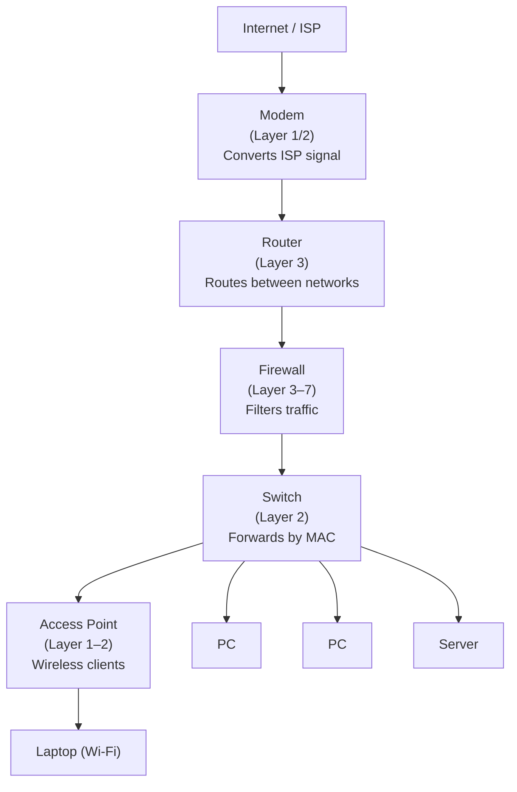
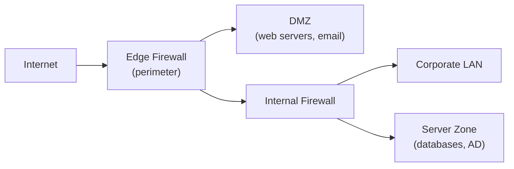

---
title: "Network Devices"
description: "Detailed comparison of every network device — hub, switch, router, modem, access point, firewall, proxy, load balancer — with OSI layer, function, and when to use each."
---

import { Tabs, TabItem } from '@astrojs/starlight/components';
import { Aside, Card, CardGrid, Steps, Badge } from '@astrojs/starlight/components';


Network devices operate at different OSI layers and serve distinct purposes. Choosing the wrong device is one of the most common beginner mistakes — understanding what each one does (and doesn't do) is fundamental to building or troubleshooting any network.

## Device Overview



---

## Hub (Layer 1)

A hub is a legacy device that **repeats every incoming signal to all ports**. It has no concept of addresses — it simply broadcasts everything everywhere.

**OSI Layer:** Physical (Layer 1)

**How it works:**
- Device A sends a frame → hub broadcasts it to every port
- Only the intended recipient accepts it; everyone else discards it
- Creates a single **collision domain** — only one device can transmit at a time (CSMA/CD)

**Problems:**
- Massive bandwidth waste (everyone sees all traffic)
- Security risk — any device can sniff all traffic with a simple NIC in promiscuous mode
- Performance degrades badly as more devices are added
- Half-duplex only

**Status:** Obsolete. Replaced entirely by switches. Still useful in two contexts:
1. Network analysis with old hardware (intentional "hub tap")
2. Labs and teaching

---

## Switch (Layer 2)

A switch is the core of any local network. It **learns MAC addresses** and forwards frames only to the port where the destination device lives.

**OSI Layer:** Data Link (Layer 2) — Layer 3 switches also operate at Layer 3.

**How it works:**
1. Frame arrives on port X from device with MAC `AA:BB:CC:DD:EE:FF`
2. Switch records: `AA:BB:CC:DD:EE:FF → Port X` in its **MAC address table** (CAM table)
3. Frame destined for a known MAC is sent only to the correct port (**unicast forwarding**)
4. Frame destined for an unknown MAC is **flooded** to all ports (like a hub, temporarily)
5. Broadcasts (`FF:FF:FF:FF:FF:FF`) are always flooded within the VLAN

**Key advantages over hub:**
- Each port is its own collision domain → full duplex, no collisions
- Traffic isolation → devices only see their own traffic (unless ARP/broadcast)
- Bandwidth is not shared — each port gets dedicated capacity
- VLANs — logical network segmentation on a single physical switch

**Types:**

| Type | Feature |
|---|---|
| **Unmanaged** | Plug-and-play, no configuration interface, no VLANs |
| **Managed** | CLI/GUI, VLANs, STP, port security, SNMP monitoring |
| **Layer 3 (multilayer)** | Routing between VLANs built in — eliminates need for a separate router for inter-VLAN routing |
| **PoE (Power over Ethernet)** | Powers attached devices (APs, IP cameras, phones) over the Ethernet cable |

```bash
# View switch MAC address table (Cisco IOS)
show mac address-table
show mac address-table dynamic

# View ARP table (which IPs map to which MACs)
arp -a          # Windows / macOS / Linux
ip neigh show   # Linux (iproute2)
```

---

## Router (Layer 3)

A router connects **different networks** and decides the best path for packets based on IP addresses and routing tables.

**OSI Layer:** Network (Layer 3)

**How it works:**
1. Packet arrives from Network A destined for IP in Network B
2. Router strips the Layer 2 Ethernet frame (it's no longer needed)
3. Looks up the destination IP in its **routing table**
4. Wraps the packet in a new Ethernet frame addressed to the next hop's MAC
5. Sends it out the appropriate interface

**Routing table entry types:**
- **Connected routes** — directly attached networks (added automatically)
- **Static routes** — manually configured by an admin
- **Dynamic routes** — learned from other routers via OSPF, BGP, EIGRP

```bash
# View routing table
ip route show           # Linux
route print             # Windows
netstat -rn             # macOS

# Example routing table
# Destination     Gateway       Iface
# 0.0.0.0/0       192.168.1.1   eth0   ← default route ("route of last resort")
# 192.168.1.0/24  0.0.0.0       eth0   ← directly connected
# 10.0.0.0/8      10.1.1.1      eth1   ← static/dynamic route
```

**Key functions:**
- Inter-network routing
- NAT (Network Address Translation) — maps private IPs to a public IP
- DHCP server (home routers)
- Default gateway for hosts on the LAN
- ACLs (Access Control Lists) — basic packet filtering

---

## Modem

A **modulator-demodulator** converts between the digital signal of your LAN and the signal format used by your ISP's access technology.

**OSI Layer:** Physical / Data Link (Layer 1–2)

| ISP Technology | Modem Type | Signal |
|---|---|---|
| DSL (ADSL/VDSL) | DSL modem | Telephone copper pair |
| Cable (DOCSIS) | Cable modem | Coaxial cable (shared with TV) |
| Fibre (FTTH/GPON) | ONT (Optical Network Terminal) | Fibre optic light |
| Cellular (4G/5G) | Cellular modem / router | Radio frequency |

**Home gateway:** Most consumer devices are a modem + router + Wi-Fi AP + switch combined into one unit. ISPs often call this an "internet box" or "gateway". For better performance/control, many people use the ISP modem in bridge mode and add their own router and AP.

---

## Access Point (Layer 2)

An access point (AP) extends a wired network to wireless clients. It bridges Wi-Fi (IEEE 802.11) and Ethernet.

**OSI Layer:** Physical + Data Link (Layer 1–2)

**How it works:**
- Wireless clients associate with the AP using WPA2/WPA3 authentication
- The AP translates Wi-Fi frames to Ethernet frames and vice versa
- From the network's perspective, wireless clients are just hosts on the LAN (same subnet, same VLAN unless VLAN-tagged SSIDs are used)

**Modes:**

| Mode | Description |
|---|---|
| **Access Point** | Connects wireless clients to a wired network |
| **Client** | Connects the AP to another AP (wireless client mode) |
| **Repeater / Extender** | Boosts signal by retransmitting (halves throughput) |
| **Mesh Node** | Part of a mesh network with dedicated backhaul |
| **Bridge** | Connects two wired networks wirelessly |

**Controller types:**
- **Standalone / Fat AP** — configured individually; fine for 1–2 APs
- **Cloud-managed** — centralised management via cloud dashboard (Unifi, Meraki, Aruba Central)
- **Controller-based / Thin AP** — WLC (Wireless LAN Controller) on-premises

---

## Firewall (Layer 3–7)

A firewall enforces security policy by **inspecting and filtering traffic** based on rules. Operates at multiple OSI layers depending on type.

**OSI Layer:** 3 (packet filter) to 7 (NGFW / application layer)

| Type | Layer | How it works |
|---|---|---|
| **Packet filter** | 3–4 | Matches src/dst IP, port, protocol. Stateless — fast but limited. |
| **Stateful inspection** | 3–4 | Tracks connection state — only allows return traffic for established sessions |
| **Application layer (proxy)** | 7 | Deep packet inspection, understands HTTP/HTTPS/DNS |
| **NGFW (Next-Gen Firewall)** | 3–7 | App identification, IPS, TLS inspection, user identity |
| **WAF (Web App Firewall)** | 7 | HTTP-only — blocks SQLi, XSS, OWASP Top 10 |

**Placement:**



---

## Proxy Server (Layer 7)

A proxy sits **between clients and servers**, forwarding requests on their behalf.

**Forward Proxy:** Clients → Proxy → Internet
- Used for: content filtering, caching, anonymity, policy enforcement
- Examples: Squid, NGINX (forward proxy mode), corporate web proxies

**Reverse Proxy:** Internet → Proxy → Internal Servers
- Used for: load balancing, TLS termination, caching, WAF, rate limiting, A/B testing
- Examples: NGINX, HAProxy, Traefik, AWS ALB, Cloudflare

**Transparent Proxy:** Traffic is intercepted silently, clients don't know it exists (common on corporate networks for content filtering).

---

## Load Balancer (Layer 4 / 7)

Distributes traffic across multiple backend servers to improve availability and scalability.

| Type | Layer | Distributes by |
|---|---|---|
| L4 (Network LB) | Transport | IP + Port — fast, protocol-agnostic |
| L7 (Application LB) | Application | HTTP headers, URL path, cookies, host |

**Algorithms:**
- **Round Robin** — each request goes to the next server in sequence
- **Least Connections** — route to the server with fewest active connections
- **IP Hash** — same client always hits the same server (session affinity)
- **Weighted** — servers get traffic proportional to their weight (useful for heterogeneous capacity)

---

## IDS / IPS

| Device | Action |
|---|---|
| **IDS** (Intrusion Detection System) | Monitors and **alerts** — passive |
| **IPS** (Intrusion Prevention System) | Monitors and **blocks** — inline, active |

Both inspect traffic against signatures (known attacks) and anomaly baselines. See [Firewalls & IDS/IPS](/network/security/network-security) for detail.

---

## Device Comparison Summary

| Device | OSI Layer | Addresses | Key Function | Collision Domain | Broadcast Domain |
|---|---|---|---|---|---|
| Hub | 1 | None | Repeat all signals | 1 shared | 1 shared |
| Switch | 2 | MAC | Forward by MAC | Per port | Per VLAN |
| Router | 3 | IP + MAC | Route between networks | Per port | Per interface |
| Modem | 1–2 | None / MAC | Convert ISP signal | N/A | N/A |
| Access Point | 1–2 | MAC | Bridge wireless to wired | Per radio cell | Per SSID/VLAN |
| Firewall | 3–7 | IP + Port | Filter by policy | Per port | Per interface |
| Proxy | 7 | URL / App | Forward/reverse proxy | N/A | N/A |
| Load Balancer | 4 / 7 | IP / HTTP | Distribute to backends | N/A | N/A |
