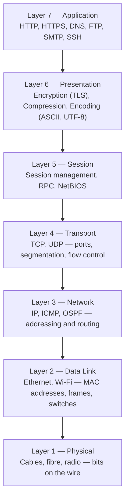
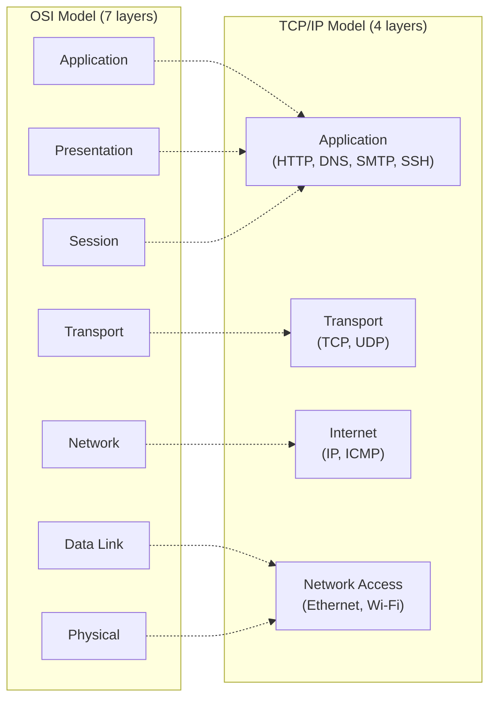

import \{ Tabs, TabItem \} from '@astrojs/starlight/components';
import \{ Aside, Card, CardGrid, Steps, Badge \} from '@astrojs/starlight/components';


The **OSI model** (Open Systems Interconnection) is a conceptual framework that standardises network communication into seven distinct layers. The **TCP/IP model** is the practical implementation used on the modern internet. Understanding both is essential for diagnosing network problems, designing systems, and understanding where security controls sit.

## The OSI Model



A popular mnemonic — **"Please Do Not Throw Sausage Pizza Away"** (Physical, Data Link, Network, Transport, Session, Presentation, Application) or reversed: **"All People Seem To Need Data Processing"**.

---

## Each Layer in Detail

### Layer 1 — Physical

Transmits raw bits (0s and 1s) over a physical medium. No addressing, no error checking — just signal.

**What it handles:** Electrical voltages, light pulses (fibre), radio waves (Wi-Fi), cable specifications, connectors, bit timing.

**Devices:** Cables, hubs, repeaters, NICs (physical layer), fibre transceivers.

**Problems at this layer:** Broken cable, loose connector, wrong cable type, EMI interference, signal attenuation over distance.

```
Troubleshoot: check link lights on NIC and switch port, test cable with cable tester, check SFP/transceiver.
```

### Layer 2 — Data Link

Packages bits into **frames** and handles hop-to-hop delivery within a local network segment. Uses **MAC addresses** (48-bit hardware addresses burned into NICs).

**Sub-layers:**
- **LLC** (Logical Link Control) — flow control, error notification
- **MAC** (Media Access Control) — addressing, CSMA/CD (Ethernet), CSMA/CA (Wi-Fi)

**What it handles:** Frame structure, MAC addressing, error detection (CRC), VLANs, ARP.

**PDU:** Frame

**Devices:** Switches, bridges, NICs (data link layer), APs.

**Protocols:** Ethernet (IEEE 802.3), Wi-Fi (IEEE 802.11), PPP, VLAN (802.1Q), STP (802.1D).

**Problems at this layer:** Duplicate MAC addresses, STP loop, VLAN misconfiguration, ARP spoofing.

| Ethernet Frame Structure | |
|---|---|
| Preamble (7 B) | Synchronisation |
| SFD (1 B) | Start Frame Delimiter |
| Destination MAC (6 B) | Target NIC address |
| Source MAC (6 B) | Sender NIC address |
| 802.1Q VLAN Tag (4 B, optional) | VLAN ID |
| EtherType (2 B) | Payload type (0x0800=IPv4, 0x86DD=IPv6) |
| Payload (46–1500 B) | Encapsulated Layer 3 data |
| FCS (4 B) | Frame Check Sequence (CRC error detection) |

### Layer 3 — Network

Routes **packets** between different networks using logical addressing (IP addresses). Makes path decisions independent of the physical topology.

**What it handles:** IP addressing, routing, fragmentation, TTL, ICMP.

**PDU:** Packet

**Devices:** Routers, Layer 3 switches, firewalls.

**Protocols:** IPv4, IPv6, ICMP, OSPF, BGP, EIGRP, ARP (technically L2/L3 boundary).

**Problems at this layer:** Wrong subnet mask, missing default gateway, routing table issues, MTU mismatch (causes fragmentation or PMTUD failures).

```bash
# Inspect routing table
ip route show             # Linux
route print               # Windows
netstat -rn               # macOS / Linux

# Test Layer 3 connectivity
ping 8.8.8.8
traceroute 8.8.8.8        # Linux/macOS
tracert 8.8.8.8           # Windows
```

### Layer 4 — Transport

Provides end-to-end communication between applications on different hosts. Adds **ports** (16-bit numbers) to identify the sending and receiving application.

**PDU:** Segment (TCP) / Datagram (UDP)

**Protocols:** TCP (connection-oriented, reliable), UDP (connectionless, fast).

**What it handles:** Port multiplexing, segmentation/reassembly, flow control (TCP), error recovery (TCP).

**Problems at this layer:** Port blocked by firewall, connection refused (nothing listening), RST packet injection.

```bash
# Check which ports are listening
ss -tlnp         # Linux (preferred)
netstat -tlnp    # Linux
netstat -ano     # Windows

# Test TCP port connectivity
nc -zv 192.168.1.1 443
telnet 192.168.1.1 80
```

### Layer 5 — Session

Manages sessions between applications — opening, maintaining, and closing communication dialogues. Often implemented within the application layer in modern protocols.

**What it handles:** Session establishment, synchronisation checkpoints (for resume after interruption), token management.

**Protocols:** RPC, NetBIOS, SMB session management, SIP (session initiation), NFS.

### Layer 6 — Presentation

Translates data between the format used by the application and the format used for network transmission. Handles encryption, compression, and character encoding.

**What it handles:** TLS/SSL encryption, data compression, character encoding (ASCII, UTF-8, Unicode), JPEG/MPEG compression.

**Note:** In modern implementations, TLS sits here — it encrypts the payload before handing it to TCP.

### Layer 7 — Application

The layer closest to the end user. Provides the protocols and services that applications use to communicate over the network.

**PDU:** Message / Data

**Protocols:** HTTP/HTTPS, DNS, FTP, SFTP, SMTP, IMAP, POP3, SSH, LDAP, SNMP, NTP, DHCP.

**Problems at this layer:** DNS resolution failure, HTTP 4xx/5xx errors, certificate errors, authentication failures, API bugs.

---

## TCP/IP Model

The practical 4-layer model that the modern internet runs on:



---

## Data Encapsulation

As data travels **down** the stack (sender), each layer wraps the data with its own header (and sometimes trailer). As it travels **up** the stack (receiver), each layer strips its header.

```
Sender Side (encapsulation):
─────────────────────────────────────────────────────────────────
L7  [HTTP Data]
L4  [TCP Header | HTTP Data]                        ← Segment
L3  [IP Header | TCP Header | HTTP Data]            ← Packet
L2  [ETH Header | IP Header | TCP Header | HTTP Data | FCS]  ← Frame
L1  101011001010... (bits on the wire)
─────────────────────────────────────────────────────────────────

Receiver Side (de-encapsulation) — reverse order:
L1 → L2 strips Ethernet header/FCS
L2 → L3 strips IP header
L3 → L4 strips TCP header
L4 → L7 delivers HTTP data to the application
```

---

## Protocol Data Units (PDUs)

| Layer | PDU Name | Key Fields |
|---|---|---|
| 7 — Application | Message / Data | Application-specific |
| 4 — Transport | Segment (TCP) / Datagram (UDP) | Src Port, Dst Port, Sequence No., Flags |
| 3 — Network | Packet | Src IP, Dst IP, TTL, Protocol |
| 2 — Data Link | Frame | Src MAC, Dst MAC, EtherType, FCS |
| 1 — Physical | Bit | Electrical / optical / radio signal |

---

## Troubleshooting by Layer

Work bottom-up — start at Layer 1 and move up until you find the failure:

| Layer | Tool | What to Check |
|---|---|---|
| 1 — Physical | NIC lights, cable tester | Cable connected? Link light on? |
| 2 — Data Link | `arp -a`, Wireshark | ARP resolving? Frame errors? |
| 3 — Network | `ping`, `traceroute`, `ip route` | Default gateway reachable? Route exists? |
| 4 — Transport | `nc`, `ss`, `telnet`, Wireshark | Port open? Firewall dropping? TCP SYN ACK? |
| 7 — Application | Browser dev tools, `curl -v` | DNS OK? HTTP 200? TLS cert valid? |

```bash
# Systematic top-down / bottom-up check
ping 127.0.0.1           # L3 local loopback — checks IP stack
ping <gateway>           # L3 to default gateway
ping 8.8.8.8             # L3 internet — bypasses DNS
ping google.com          # L7 DNS + L3 internet
curl -v https://google.com  # L7 full HTTP/TLS
```

---

## OSI Layer Quick Reference

| # | Name | Mnemonic | PDU | Devices | Protocols |
|---|---|---|---|---|---|
| 7 | Application | **A**ll | Data | Hosts | HTTP, DNS, SSH, SMTP |
| 6 | Presentation | **P**eople | Data | Hosts | TLS, JPEG, MPEG |
| 5 | Session | **S**eem | Data | Hosts | RPC, SIP, NetBIOS |
| 4 | Transport | **T**o | Segment/Datagram | Hosts | TCP, UDP |
| 3 | Network | **N**eed | Packet | Routers, L3 switches | IP, ICMP, OSPF, BGP |
| 2 | Data Link | **D**ata | Frame | Switches, APs, NICs | Ethernet, Wi-Fi, PPP |
| 1 | Physical | **P**rocessing | Bit | Cables, Hubs | DSL, 1000BASE-T |
