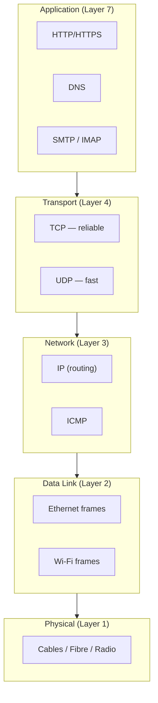
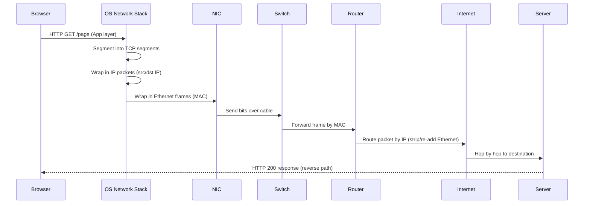
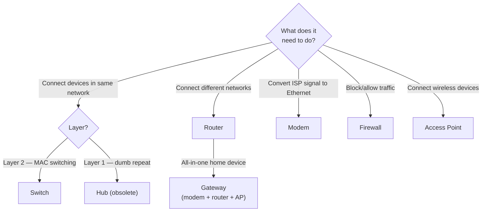

import \{ Tabs, TabItem \} from '@astrojs/starlight/components';
import \{ Aside, Card, CardGrid, Steps, Badge \} from '@astrojs/starlight/components';

This section covers computer networking from the physical layer up — how data moves across cables and air, how addresses are assigned and resolved, how protocols coordinate communication, and how to defend the network from attack.

## What's Covered

| Section | Topics |
|---|---|
| [OSI & TCP/IP Model](/network/fundamentals/osi-model) | 7 layers, encapsulation, PDUs, TCP/IP stack |
| [Network Devices](/network/fundamentals/network-devices) | Hub, switch, router, modem, AP, firewall, proxy |
| [Cables & Physical Media](/network/fundamentals/cables-media) | Ethernet categories, fibre optic, coax, wireless |
| [IP Addressing & Subnetting](/network/addressing/ip-addressing) | IPv4, IPv6, CIDR, subnetting, private ranges, NAT |
| [DNS](/network/addressing/dns) | Resolution process, record types, zones, DNSSEC |
| [DHCP](/network/addressing/dhcp) | DORA process, leases, options, relay, failover |
| [TCP & UDP](/network/protocols/tcp-udp) | Handshake, flow control, ports, UDP use cases |
| [HTTP & HTTPS](/network/protocols/http-https) | HTTP/1.1/2/3, TLS handshake, headers, caching |
| [Routing Protocols](/network/protocols/routing-protocols) | Static routes, OSPF, BGP, metrics |
| [Protocol Reference](/network/protocols/protocol-reference) | Port numbers, common protocols at a glance |
| [Traffic Analysis](/network/traffic/traffic-analysis) | Wireshark, tcpdump, packet structure, filters |
| [VLANs & Switching](/network/traffic/switching) | VLANs, STP, trunking, port security |
| [Wi-Fi (802.11)](/network/wireless/wifi) | Standards, bands, channels, WPA3, site survey |
| [Firewalls & IDS/IPS](/network/security/network-security) | Stateful/NGFW, IDS vs IPS, NAC, DMZ |
| [Attacks & Defenses](/network/security/attacks-defenses) | ARP spoofing, MITM, DDoS, port scanning |
| [VPN & Tunneling](/network/security/vpn-tunneling) | IPsec, WireGuard, SSL VPN, split tunnelling |
| [Zero Trust Networking](/network/security/zero-trust-network) | Microsegmentation, SDP, SASE, identity-based access |

## The Network Stack

![image] (https://computerguidehub.com/types-of-computer-network/)

## Data Flow: End-to-End

## Choosing a Device

## Quick Navigation

| I want to… | Go to |
|---|---|
| Understand the OSI model | [OSI & TCP/IP](/network/fundamentals/osi-model) |
| Know the difference between a router and switch | [Network Devices](/network/fundamentals/network-devices) |
| Calculate subnets | [IP Addressing](/network/addressing/ip-addressing) |
| Understand how DNS works | [DNS](/network/addressing/dns) |
| Analyse packets with Wireshark | [Traffic Analysis](/network/traffic/traffic-analysis) |
| Set up VLANs | [VLANs & Switching](/network/traffic/switching) |
| Secure a network | [Firewalls & IDS/IPS](/network/security/network-security) |
| Understand VPN options | [VPN & Tunneling](/network/security/vpn-tunneling) |
| Learn about Wi-Fi security | [Wi-Fi](/network/wireless/wifi) |
| Block common network attacks | [Attacks & Defenses](/network/security/attacks-defenses) |

## Learning Path

| Stage | Topics | Files |
|---|---|---|
| **Foundations** | OSI layers, physical media, devices | OSI Model → Devices → Cables |
| **Addressing** | IP, subnetting, DNS, DHCP | IP Addressing → DNS → DHCP |
| **Protocols** | TCP/UDP, HTTP, routing | TCP/UDP → HTTP/HTTPS → Routing |
| **Operations** | Traffic analysis, VLANs, Wi-Fi | Traffic Analysis → Switching → Wi-Fi |
| **Security** | Firewalls, attacks, VPN, Zero Trust | Network Security → Attacks → VPN → Zero Trust |

## Related Sections

- [Security / Web](/security/web/owasp-top-10) — application-layer attacks that travel over networks
- [Auth / Protocols](/auth/protocols/certificates-pki) — TLS, PKI, mTLS (used by HTTPS and VPNs)
- [Cloud / Security](/cloud/security/cloud-security) — VPC, security groups, cloud network controls
- [Cloud / Kubernetes Advanced](/cloud/orchestration/kubernetes-advanced) — Kubernetes NetworkPolicy, CNI

