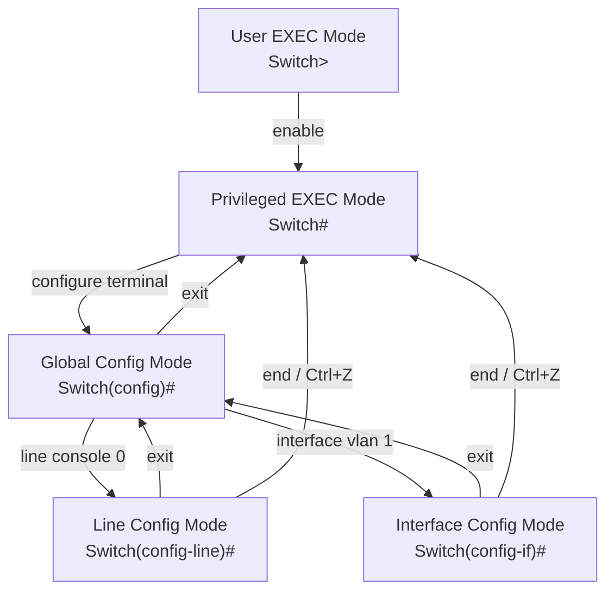
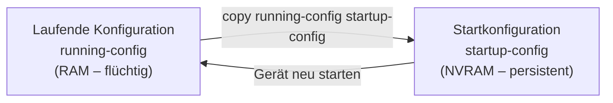
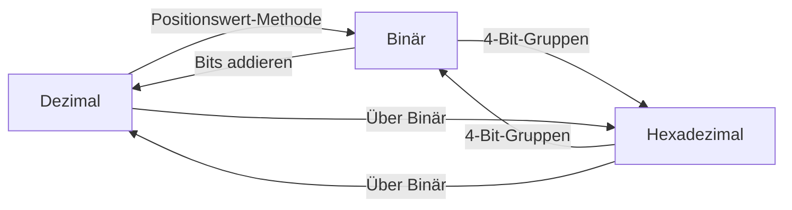

import Callout from '../../../../components/Callout.astro';
import BaseConverter from '../../../../components/BaseConverter.jsx';


## 1. Betriebssysteme in Netzwerkgeräten

Jedes elektronische Gerät – vom Laptop bis zum Router – benötigt ein **Betriebssystem (OS)**. Das OS ist das Bindeglied zwischen Hardware und dem Benutzer.

Ein Betriebssystem besteht aus drei Schichten:

- **Shell**: Die Benutzeroberfläche (CLI oder GUI), über die Befehle eingegeben werden.
- **Kernel**: Verwaltet die Hardware-Ressourcen und vermittelt zwischen Software und Hardware.
- **Hardware**: Die physische Komponente (Prozessor, Speicher, Netzwerkkarten etc.).

Für Netzwerkgeräte wie Switches, Router, Firewalls und Access Points verwendet Cisco das **Internetwork Operating System (IOS)**. Fun fact: „iOS" ist eigentlich eine eingetragene Marke von Cisco – Apple nutzt den Namen unter Lizenz.

### GUI vs. CLI

| Merkmal | GUI | CLI |
|---|---|---|
| Bedienung | Maus, Icons, Fenster | Tastatur, Texteingabe |
| Benutzerfreundlichkeit | Hoch | Niedriger (Lernkurve) |
| Stabilität | Kann abstürzen/hängen | Robuster, zuverlässiger |
| Netzwerkgeräte | Selten verwendet | Standard |

**Warum CLI?** GUIs können abstürzen oder sich unerwartet verhalten. Für kritische Netzwerkgeräte ist die CLI der Standard – sie ist deterministisch und immer verfügbar, auch wenn das Gerät nur minimal reagiert.

---

## 2. Zugriffsmethoden auf Cisco IOS

Es gibt drei Wege, auf ein Cisco-Gerät zuzugreifen:

### Console
- **Physischer** Managementport (RJ-45 oder USB)
- Wird für die **Erstkonfiguration** verwendet – bevor das Gerät eine IP-Adresse hat
- Direkte Verbindung vom PC zum Gerät mit Konsolenkabel
- Kein Netzwerk nötig

### Secure Shell (SSH)
- **Verschlüsselte** Remote-CLI-Verbindung über das Netzwerk
- **Best Practice**: SSH Version 2 verwenden
- Authentifizierung, Passwörter und Befehle sind verschlüsselt

### Telnet
- **Unverschlüsselte** Remote-CLI-Verbindung
- Alle Daten (inkl. Passwörter!) werden als **Klartext** übertragen
- Sicherheitsrisiko – sollte in Produktivumgebungen **nicht** verwendet werden

> **Merksatz**: Telnet = gefährlich. SSH = sicher. Immer SSH bevorzugen!

### Terminal-Emulationsprogramme
Zum Verbinden mit einem Gerät (über Console oder SSH/Telnet) werden Programme wie **PuTTY**, **Tera Term** oder **SecureCRT** eingesetzt.

---

## 3. IOS-Befehlsmodi – Die Hierarchie

Cisco IOS verwendet eine **hierarchische Befehlsstruktur**. Das bedeutet: Je nach Modus stehen unterschiedliche Befehle zur Verfügung. Man muss erst in den richtigen Modus wechseln, bevor ein Befehl funktioniert.



### User EXEC Mode (`Switch>`)
- Eingeschränkte Überwachungsbefehle (z.B. `ping`, `show version`)
- **Kein** Konfigurieren möglich
- Erkennbar am `>` Zeichen im Prompt

### Privileged EXEC Mode (`Switch#`)
- Zugriff auf **alle** Befehle und Funktionen
- Wechsel mit: `enable`
- Erkennbar am `#` Zeichen im Prompt

### Global Configuration Mode (`Switch(config)#`)
- Konfiguration des gesamten Geräts
- Wechsel mit: `configure terminal`
- Rückkehr mit: `exit`

### Subkonfigurationsmodi
Aus dem Global Config Mode gibt es weitere Modi:

- **Line Configuration Mode** (`Switch(config-line)#`): Konfiguration von Console, SSH, Telnet (VTY), AUX
- **Interface Configuration Mode** (`Switch(config-if)#`): Konfiguration von Switch-Ports oder Router-Interfaces

**Wichtige Navigation:**
- `exit` → eine Ebene zurück
- `end` oder `Ctrl+Z` → direkt zurück zu Privileged EXEC
- Man kann direkt von einem Subkonfigurationsmodus in einen anderen wechseln (z.B. von `config-line` direkt zu `config-if`)

---

## 4. Befehlsstruktur in Cisco IOS

Jeder IOS-Befehl folgt einer klaren Syntax:

```
Prompt  Befehl   Leerzeichen   Schlüsselwort/Argument
Switch> ping                   192.168.10.5
Switch> show                   ip protocols
```

- **Keyword (Schlüsselwort)**: Vordefinierter Parameter des OS (z.B. `ip protocols`)
- **Argument**: Vom Benutzer definierter Wert (z.B. `192.168.10.5`)

### Syntaxkonventionen

| Notation | Bedeutung |
|---|---|
| **fett** | Eingabe genau so wie dargestellt |
| *kursiv* | Benutzer gibt hier einen eigenen Wert an |
| `[x]` | Optionaler Parameter |
| `{x}` | Pflichtangabe |
| `[x {y \| z}]` | Pflicht-Auswahl innerhalb eines optionalen Elements |

### IOS-Hilfe-Funktionen

1. **Context-Sensitive Help** (`?`): Zeigt verfügbare Befehle im aktuellen Modus an
   - `?` alleine → alle Befehle auflisten
   - `sh?` → alle Befehle die mit „sh" beginnen
   - `show ?` → alle Argumente für `show`

2. **Command Syntax Check**: Wenn ein Befehl falsch eingegeben wird, gibt IOS Fehlermeldungen aus:
   - `% Ambiguous command` → zu wenige Zeichen, mehrere Befehle möglich
   - `% Incomplete command` → Befehl unvollständig
   - `% Invalid input detected at '^' marker` → Fehler an der Position `^`

### Hot Keys und Shortcuts

| Tastenkombination | Funktion |
|---|---|
| `Tab` | Befehl autovervollständigen |
| `Ctrl+A` | Zum Zeilenanfang springen |
| `Ctrl+E` | Zum Zeilenende springen |
| `↑` / `Ctrl+P` | Vorherigen Befehl aus History |
| `↓` | Nächsten Befehl aus History |
| `Ctrl+Z` | Zurück zu Privileged EXEC |
| `Ctrl+C` | Konfigurationsmodus beenden |
| `Ctrl+Shift+6` | Laufende Operation abbrechen (DNS, Ping, Traceroute) |

**Abkürzungen**: Befehle können abgekürzt werden, solange sie eindeutig sind. `conf t` statt `configure terminal` – funktioniert, weil nur `configure` mit `conf` beginnt.

---

## 5. Grundkonfiguration von Geräten

### Gerätename (Hostname)

Der erste Schritt nach dem Einschalten eines neuen Geräts: **Hostname setzen**. Damit ist das Gerät eindeutig identifizierbar.

```
Switch# configure terminal
Switch(config)# hostname Sw-Floor-1
Sw-Floor-1(config)#
```

**Regeln für Hostnamen:**
- Beginnt mit einem Buchstaben
- Keine Leerzeichen
- Endet mit Buchstabe oder Ziffer
- Nur Buchstaben, Ziffern und Bindestriche
- Maximal 64 Zeichen

Rückgängig machen: `no hostname`

### Passwörter konfigurieren

Passwörter sind der erste Verteidigungswall. Alle Zugangswege müssen abgesichert werden.

**Passwort-Richtlinien:**
- Mindestens 8 Zeichen
- Kombination aus Gross-/Kleinbuchstaben, Zahlen und Sonderzeichen
- Nicht dasselbe Passwort für alle Geräte
- Keine Wörterbuchwörter

#### Console-Zugang absichern
```
Sw-Floor-1(config)# line console 0
Sw-Floor-1(config-line)# password cisco
Sw-Floor-1(config-line)# login
Sw-Floor-1(config-line)# end
```

#### Privileged EXEC absichern
```
Sw-Floor-1(config)# enable secret class
```
> `enable secret` speichert das Passwort **verschlüsselt** (MD5). `enable password` speichert im Klartext – daher immer `enable secret` verwenden!

#### VTY-Leitungen (SSH/Telnet) absichern
```
Sw-Floor-1(config)# line vty 0 15
Sw-Floor-1(config-line)# password cisco
Sw-Floor-1(config-line)# login
Sw-Floor-1(config-line)# end
```
VTY-Leitungen (Virtual TeleType) ermöglichen Remote-Zugriff. Cisco Switches unterstützen bis zu 16 VTY-Leitungen (0–15).

### Passwörter verschlüsseln

Standardmässig sind viele Passwörter in der Konfigurationsdatei im **Klartext** gespeichert. Mit einem einzigen Befehl werden alle Klartextpasswörter verschlüsselt:

```
Sw-Floor-1(config)# service password-encryption
```

Überprüfung mit `show running-config` – Passwörter erscheinen nun als verschlüsselte Zeichenketten (z.B. `password 7 094F471A1A0A`).

### Banner-Meldungen

Bannermeldungen warnen unbefugte Personen vor einem Zugriff. Sie sind auch rechtlich wichtig – ohne Warnung kann ein unbefugter Zugriff schwerer geahndet werden.

```
Sw-Floor-1(config)# banner motd #Authorized Access Only!#
```

Das `#` ist das Trennzeichen (Delimiter) – es markiert Anfang und Ende der Nachricht.

---

## 6. Konfigurationen speichern

### Die zwei Konfigurationsdateien



| Datei | Speicherort | Eigenschaft |
|---|---|---|
| `running-config` | RAM | Aktuell aktiv; geht bei Neustart verloren |
| `startup-config` | NVRAM | Wird beim Booten geladen; bleibt erhalten |

**Konfiguration speichern:**
```
Switch# copy running-config startup-config
```

**Konfiguration zurücksetzen:**
```
Switch# erase startup-config
Switch# reload
```

**Unerwünschte Änderungen rückgängig machen** (ohne Speichern): `reload` – lädt die letzte gespeicherte `startup-config` neu.

### Konfiguration in Textdatei exportieren

Mit PuTTY oder Tera Term kann man die Ausgabe von `show running-config` in eine Textdatei loggen. Diese Datei dient als Backup und Dokumentation.

---

## 7. IP-Adressen und Netzwerkkonfiguration

### IPv4

IPv4-Adressen sind **32-Bit-Werte**, dargestellt in **Dotted Decimal Notation** (vier Dezimalzahlen, getrennt durch Punkte, je 0–255).

Für die Kommunikation benötigt ein Gerät:
- **IP-Adresse**: Eindeutige Identifikation im Netzwerk (z.B. `192.168.1.10`)
- **Subnetzmaske**: Trennt Netzwerk- und Hostteil (z.B. `255.255.255.0`)
- **Default Gateway**: IP-Adresse des Routers für Verbindungen ausserhalb des lokalen Netzes

### IPv6

IPv6-Adressen sind **128-Bit-Werte**, dargestellt in **Hexadezimalnotation** (acht Gruppen zu je vier Hex-Ziffern, getrennt durch Doppelpunkte):

```
2001:0db8:acad:0010:0000:0000:0000:0010
```

### IP-Adresse manuell konfigurieren (Windows)
- Systemsteuerung → Netzwerk → Adaptereinstellungen → Rechtsklick → Eigenschaften → TCP/IPv4

### DHCP (Automatische Konfiguration)
Geräte können ihre IP-Adresse automatisch von einem **DHCP-Server** beziehen (Dynamic Host Configuration Protocol). Standardmässig sind die meisten Endgeräte auf DHCP eingestellt.

Für IPv6 gibt es **DHCPv6** und **SLAAC** (Stateless Address Autoconfiguration).

### Switch Virtual Interface (SVI)

Ein Layer-2-Switch hat keine physische Ethernet-Schnittstelle, der man eine IP-Adresse geben kann. Um einen Switch remote verwalten zu können, wird ein **Switch Virtual Interface (SVI)** konfiguriert – standardmässig VLAN 1.

```
Switch# configure terminal
Switch(config)# interface vlan 1
Switch(config-if)# ip address 192.168.1.20 255.255.255.0
Switch(config-if)# no shutdown
```

> **Wichtig**: Die IP-Adresse des SVI dient **nur** der Fernverwaltung. Der Switch funktioniert auch ohne IP-Adresse – er leitet dann einfach nur Frames weiter.

---

## 8. Zahlensysteme

Netzwerktechniker müssen mit **drei Zahlensystemen** umgehen können: Dezimal (für Menschen), Binär (für Maschinen) und Hexadezimal (für IPv6 und MAC-Adressen).

### Binärsystem (Basis 2)

Computer und Netzwerkgeräte arbeiten intern nur mit **Bits** (0 und 1). IPv4-Adressen sind im Kern 32-Bit-Binärzahlen.

#### Positionale Notation

Das Binärsystem funktioniert wie das Dezimalsystem – jede Position hat einen Stellenwert, aber zur Basis 2 statt 10.

| Position | 7 | 6 | 5 | 4 | 3 | 2 | 1 | 0 |
|---|---|---|---|---|---|---|---|---|
| Stellenwert | 128 | 64 | 32 | 16 | 8 | 4 | 2 | 1 |

**Merkhilfe**: 128 – 64 – 32 – 16 – 8 – 4 – 2 – 1 (jeder Wert ist die Hälfte des vorherigen)

#### Binär → Dezimal

Jedes Bit mit seinem Stellenwert multiplizieren und addieren:

```
11000000 = 1×128 + 1×64 + 0×32 + 0×16 + 0×8 + 0×4 + 0×2 + 0×1
         = 128 + 64 = 192
```

**Beispiel: Vollständige IPv4-Adresse umrechnen**

```
11000000.10101000.00001011.00001010
→ 192    . 168    . 11     . 10
→ 192.168.11.10
```

#### Dezimal → Binär

Algorithmus: Beginne beim grössten Stellenwert (128).
- Ist die Zahl ≥ Stellenwert? → schreibe **1**, subtrahiere den Stellenwert
- Ist die Zahl < Stellenwert? → schreibe **0**, gehe weiter

**Beispiel: 168 in Binär**

```
168 ≥ 128? Ja → 1, Rest: 40
 40 ≥  64? Nein → 0
 40 ≥  32? Ja → 1, Rest: 8
  8 ≥  16? Nein → 0
  8 ≥   8? Ja → 1, Rest: 0
  0 ≥   4? Nein → 0
  0 ≥   2? Nein → 0
  0 ≥   1? Nein → 0

Ergebnis: 10101000
```

### Hexadezimalsystem (Basis 16)

Hexadezimal (Hex) verwendet 16 Symbole: **0–9** und **A–F**.

| Dezimal | Binär | Hex |
|---|---|---|
| 0 | 0000 | 0 |
| 9 | 1001 | 9 |
| 10 | 1010 | A |
| 11 | 1011 | B |
| 12 | 1100 | C |
| 13 | 1101 | D |
| 14 | 1110 | E |
| 15 | 1111 | F |

**Warum Hex?** Ein einzelnes Hex-Zeichen repräsentiert exakt **4 Bits**. Das macht Hex zur kompakten Darstellung von binären Werten – besonders für IPv6 und MAC-Adressen.

#### Hex und IPv6

IPv6-Adressen sind 128 Bit lang → 32 Hex-Zeichen, in 8 Gruppen (Hextets) zu je 4 Zeichen:

```
2001:0db8:acad:0010:0000:0000:0000:0010
```

#### Dezimal → Hexadezimal

1. Dezimalzahl → 8-Bit-Binär umwandeln
2. Binär in 4-Bit-Gruppen aufteilen (von rechts)
3. Jede 4-Bit-Gruppe → Hex-Zeichen

**Beispiel: 168 → Hex**
```
168 → 10101000 (Binär)
    → 1010 | 1000
    → A    | 8
    → A8
```

#### Hexadezimal → Dezimal

1. Jedes Hex-Zeichen → 4-Bit-Binärgruppe
2. Binärgruppen zusammensetzen → 8-Bit-Wert
3. 8-Bit-Binär → Dezimal

**Beispiel: D2 → Dezimal**
```
D = 1101, 2 = 0010
→ 11010010 (Binär)
→ 128+64+16+2 = 210
```

### Zusammenfassung: Umrechnungswege



---

## 9. Vollständige Erstkonfiguration eines Switches

```
Switch> enable
Switch# configure terminal
Switch(config)# hostname Sw-Floor-1
Sw-Floor-1(config)# enable secret class
Sw-Floor-1(config)# line console 0
Sw-Floor-1(config-line)# password cisco
Sw-Floor-1(config-line)# login
Sw-Floor-1(config-line)# exit
Sw-Floor-1(config)# line vty 0 15
Sw-Floor-1(config-line)# password cisco
Sw-Floor-1(config-line)# login
Sw-Floor-1(config-line)# exit
Sw-Floor-1(config)# service password-encryption
Sw-Floor-1(config)# banner motd #Authorized Access Only!#
Sw-Floor-1(config)# interface vlan 1
Sw-Floor-1(config-if)# ip address 192.168.1.1 255.255.255.0
Sw-Floor-1(config-if)# no shutdown
Sw-Floor-1(config-if)# end
Sw-Floor-1# copy running-config startup-config
```

---

## 10. Schlüsselbegriffe

| Begriff | Bedeutung |
|---|---|
| CLI | Command Line Interface – textbasierte Benutzeroberfläche |
| GUI | Graphical User Interface – grafische Benutzeroberfläche |
| IOS | Internetwork Operating System (Cisco) |
| SSH | Secure Shell – verschlüsselter Remote-Zugriff |
| Telnet | Unverschlüsselter Remote-Zugriff (unsicher!) |
| Console | Physischer Managementport |
| VTY | Virtual TeleType – virtuelle Leitungen für Remote-Zugriff |
| SVI | Switch Virtual Interface – virtuelles Interface für Switch-Management |
| DHCP | Dynamic Host Configuration Protocol – automatische IP-Vergabe |
| NVRAM | Non-Volatile RAM – speichert startup-config dauerhaft |
| Oktet | 8-Bit-Gruppe in einer IPv4-Adresse |
| Hextet | 16-Bit-Gruppe (4 Hex-Zeichen) in einer IPv6-Adresse |
| Positionale Notation | Stellenwert-basiertes Zahlensystem |


<Callout type="danger"> 
## Summary Module 2: Basic Switch and End Device Configuration
</Callout>

**IOS Access Methods**
- **Console** — Used for initial configurations and maintenance via a physical management port.
- **SSH (Secure Shell)** — Secure remote CLI connection through a virtual interface over a network (recommended).
- **Telnet** — Insecure remote CLI connection over the network (not recommended, transmits data in plaintext).

**IOS Primary Command Modes** — Hierarchical command structure where each mode has a distinctive prompt and is used to accomplish particular tasks.
- **User EXEC Mode** — Allows access to only a limited number of basic monitoring commands. Identified by the CLI prompt that ends with the `>` symbol.
- **Privileged EXEC Mode** — Allows access to all commands and features. Identified by the CLI prompt that ends with the `#` symbol.

**Configuration Mode and Subconfiguration Modes**
- **Global Configuration Mode** — `Switch(config)#` — Access configuration options on the device. Sub configuration modes can be accessed from here.
- **Line Configuration Mode** — `Switch(config-line)#` — Configure console, SSH, Telnet or AUX access.
- **Interface Configuration Mode** — `Switch(config-if)#` — Configure a switch port or router interface.

**Navigation Between IOS Modes**
- `enable` — Move from user EXEC mode to privileged EXEC mode.
- `configure terminal` — Move into global configuration mode / `exit` — Return to privileged EXEC mode.
- `line <line type>` — Move into line configuration mode / `exit` — Return to global configuration mode.
- `exit` — Get back to global configuration mode / `end` (or `Ctrl+Z`) — Return to privileged EXEC mode.
- To move directly from one subconfiguration mode to another, type in the desired subconfiguration mode command.
  - Example: `Switch(config-line)# interface FastEthernet 0/1` ➜ `Switch(config-if)#`

### The Command Structure

Prompt ➜ Command ➜ Space ➜ Keyword/Argument, e.g. `Switch> ping 192.168.10.5`

**Syntax Check**
- **bold** — commands and keywords entered literally as shown.
- *italic* — arguments to supply values.
- `[x]` — optional keyword or argument.
- `{x}` — required keyword or argument.
- `[x {y | z}]` — required choice within an optional element.
- Spaces are used to delineate parts of the command.

**Help Features** — `?` accesses context-sensitive help / Command syntax check verifies that a valid command was entered.

**Hot Keys**
- Keywords can be shortened to the minimum number of characters that identify unique selection, e.g. `configure` ➜ `conf`
- `Tab` — Completes a partial command name entry.
- `Backspace` — Erases character left of the cursor.
- `Left Arrow` or `Ctrl+B` — Moves cursor one character to the left.
- `Right Arrow` or `Ctrl+F` — Moves cursor one character to the right.
- `Up Arrow` or `Ctrl+P` — Recall commands in history buffer.
- `Ctrl+C` or `Ctrl+Z` — End configuration mode and return to privileged EXEC mode.
- `Ctrl+Shift+6` — All-purpose break sequence to abort DNS lookups, traceroutes, pings etc.

**`--More--` (Space on Terminal)**
- `Enter Key` — Display the next line.
- `Down Arrow` — Allows scrolling through command history.
- `Ctrl+A` — Go to the beginning of the line.
- `Ctrl+E` — Go to the end of the line.
- `Ctrl+R` — Redisplays a line.
- `Space Bar` — Display the next screen.
- Any other key — Ends the display string, return to privileged EXEC mode.

### Basic Device Configuration

**Hostname** — `no hostname` returns the switch to the default prompt.
- Naming Convention: Start with letter, no spaces, end with letter or digit, use only letters digits and dashes, less than 64 characters in length.

**Passwords** — Encrypted; all networking devices should limit administrative access by securing privileged EXEC, user EXEC, remote Telnet access with passwords. >8 characters, upper- and lowercase letters, numbers, special characters, not same password for multiple devices, no common words.

**Configure Passwords**
- Securing **user EXEC** mode: `line console 0` ➜ `password <password>` ➜ `login`
- Securing **privileged EXEC** mode: (in global config) `enable secret <password>`
- Securing **VTY** access: `line vty 0 15` ➜ `password <password>` ➜ `login`
- Encrypt passwords: `service password-encryption` — encrypts all passwords / `show running-config` — verify passwords are now encrypted.

**Banner Messages** — `banner motd # the message of the day #` — displayed on all attempts to access the device.

**Save Configurations**
- `startup-config` — Stored in NVRAM; used by device upon startup or reboot; persists when powered off.
- `running-config` — Stored in RAM (volatile); reflects current configuration; not saved on shutdown or reboot.
- `copy running-config startup-config` (privileged EXEC) — Save running config to startup config.

**Alter Running Configurations** (privileged EXEC mode)
- Running config **not saved**: `reload` — reloads device (brief downtime).
- Running config **was saved**: `erase startup-config` ➜ `reload` — clears all configurations.

### Ports and Addresses

**IPv4** — Dotted decimal notation, decimal numbers between 0–255. IPv4 subnet mask is a 32-bit value that differentiates the network portion from the host portion. Default gateway is the IP address of the router that the host uses to access remote networks.

**IPv6** — 128 bits in length, multiple strings of hex values, four bits represented by one hex digit, total 32 hex values, groups of four hex digits separated by a colon `:`, not case-sensitive.

**Interfaces and Ports** — Network communications depend on end user device interfaces, networking device interfaces, and the cables connecting them. Twisted-pair copper cables, fiber-optic cables, coaxial cables, or wireless.

### Configure IP Addressing

**Switch Virtual Interface (SVI)** — To remotely manage a switch, must be configured with IP configuration. A switch does not have a physical Ethernet interface; must configure the VLAN 1 SVI (IP address, subnet mask, `no shutdown` to enable it).

**Configure an SVI on a Switch:**
```
configure terminal
interface vlan 1
ip address <ip-address> <subnet-mask>
no shutdown
```

**Interfaces and Ports on Switch** — Cisco IOS Layer 2 switches have physical ports for devices to connect (ports do not support Layer 3 IP addresses). To remotely connect and manage a Layer 2 switch, must be configured with one or more SVIs. Each switch has a default VLAN 1 SVI. A Layer 2 switch does not need an IP address to operate; the SVI IP address is for remote management only.


---
---
---
<Callout type="danger"> 
## Summary Module 5: Number Systems
</Callout>

**Converting Binary to Decimal** — `(11000000.10101000.00001011.00001010)2` ➜ `(192.168.11.10)10`
- 255 is max dec value (subnet) ➜ Positions are 128 (27), 64 (26), 32 (25), 16 (24), 8 (23), 4 (22), 2 (21), 1 (20).
- `1 1 0 0 0 0 0 0` ➜ 1x128, 1x64, 0x32, 0x16, 0x8, 0x4, 0x2, 0x1 ➜ 128 + 64 + 0 + 0 + 0 + 0 + 0 + 0 ➜ **192**
- `1 0 1 0 1 0 0 0` ➜ 1x128, 0x64, 1x32, 0x16, 1x8, 0x4, 0x2, 0x1 ➜ 128 + 0 + 32 + 0 + 8 + 0 + 0 + 0 ➜ **168**
- `0 0 0 0 1 0 1 1` ➜ 0x128, 0x64, 0x32, 0x16, 1x8, 0x4, 1x2, 1x1 ➜ 0 + 0 + 0 + 0 + 8 + 0 + 2 + 1 ➜ **11**
- `0 0 0 0 1 0 1 0` ➜ 0x128, 0x64, 0x32, 0x16, 1x8, 0x4, 1x2, 0x1 ➜ 0 + 0 + 0 + 0 + 8 + 0 + 2 + 0 ➜ **10**

**Converting Decimal to Binary** — `(168)10` ➜ `(10101000)2`
- 168 > 128? ➜ Yes, enter 1 in 128 position and subtract 128 (168−128=40)
- 40 > 64? ➜ No, enter 0 in 64 position and move on
- 40 > 32? ➜ Yes, enter 1 in 32 position and subtract 32 (40−32=8)
- 8 > 16? ➜ No, enter 0 in 16 position and move on
- 8 > 8? ➜ Equal. Enter 1 in 8 position and subtract 8 (8−8=0)
- No values left ➜ Enter 0 in remaining binary positions

**Hexadecimal and IPv6** — Range: Digits 0–9, Letters A–F, 128 bits in length, 4 bits = single hex digit, total of 32 hex values, four hex characters = hextet.

**Converting Decimal to Hex** — `(168)10` ➜ `(A8)16`
- 168 in binary is `10101000`.
- `10101000` ➜ split into `1010` and `1000`.
- `(1010)2` ➜ `(A)16`
- `(1000)2` ➜ `(8)16`

**Converting Hexadecimal to Decimal** — `(D2)16` ➜ `(210)10`
- D2 in 4-bit binary strings is `1110` and `0010`.
- `1101` and `0010` is `11010010` in an 8-bit grouping.

### Reference Table
| 1 | 2 | 3 | 4 | 5  | 6  | 7  | 8   | 9   | 10  | 11   | 12   | 13   | 14   | 15    | 16    | 17    |
|---|---|---|---|----|----|----|-----|-----|-----|------|------|------|------|-------|-------|-------|
| 1 | 2 | 4 | 8 | 16 | 32 | 64 | 128 | 256 | 512 | 1024 | 2048 | 4096 | 8192 | 16384 | 32768 | 65536 | 


| Decimal | Hex | Binary || Decimal | Hex | Binary |
|---------|-----|-----------|---|---------|-----|-----------| 
| 0 | 00 | 0000 0000 |  | 10 | 0A | 0000 1010 |
| 1 | 01 | 0000 0001 |  | 11 | 0B | 0000 1011 |
| 2 | 02 | 0000 0010 |  | 12 | 0C | 0000 1100 |
| 3 | 03 | 0000 0011 |  | 13 | 0D | 0000 1101 |
| 4 | 04 | 0000 0100 |  | 14 | 0E | 0000 1110 |
| 5 | 05 | 0000 0101 |  | 15 | 0F | 0000 1111 |
| 6 | 06 | 0000 0110 |  | 16 | 10 | 0001 0000 |
| 7 | 07 | 0000 0111 |  | 17 | 11 | 0001 0001 |
| 8 | 08 | 0000 1000 |  | 18 | 12 | 0001 0010 |
| 9 | 09 | 0000 1001 |


<BaseConverter client:load />
