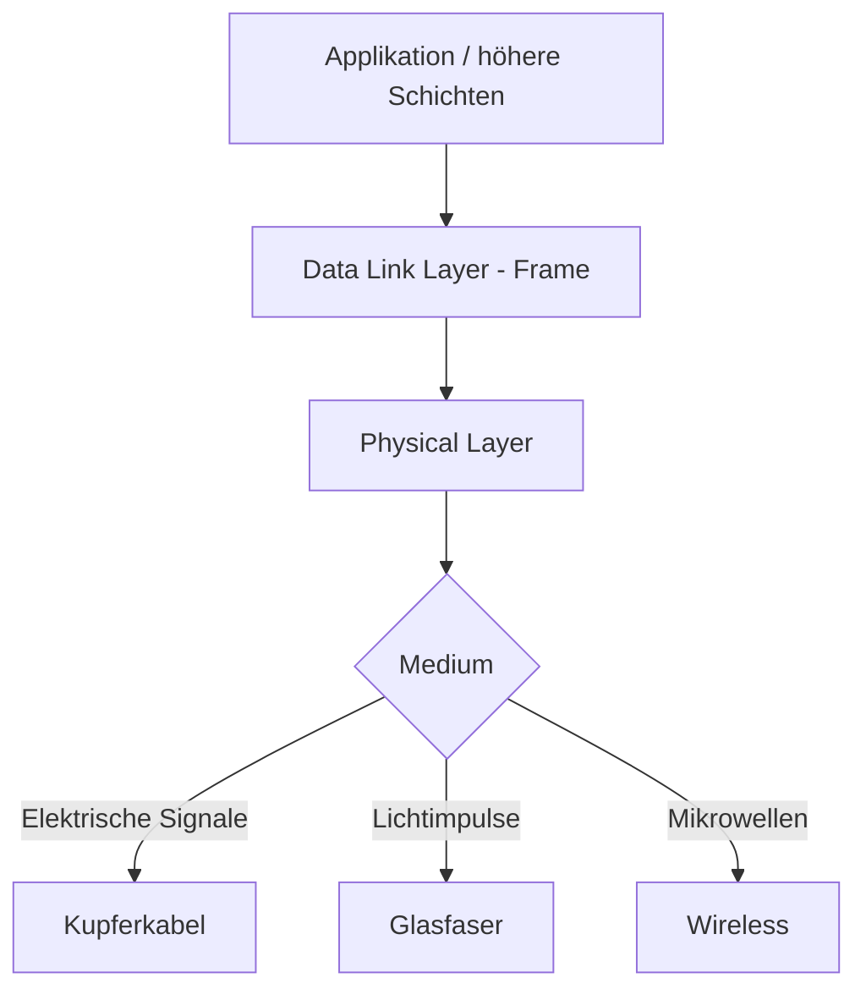
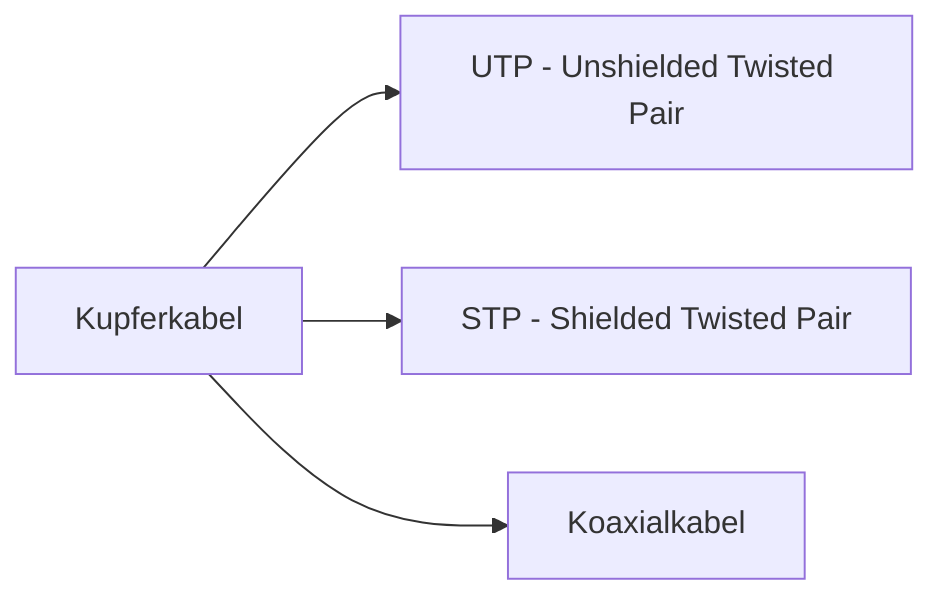
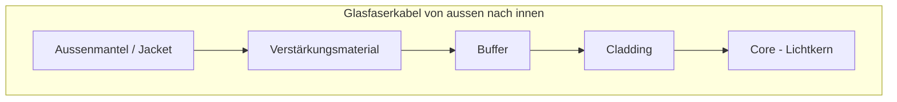
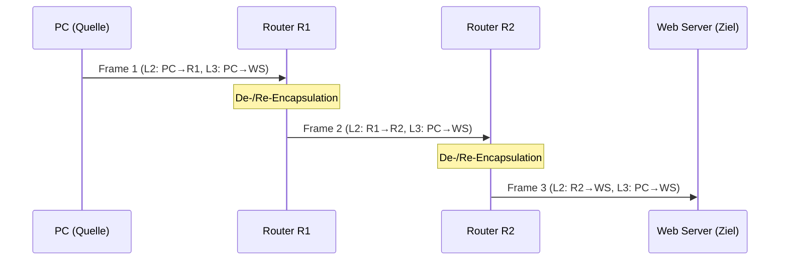
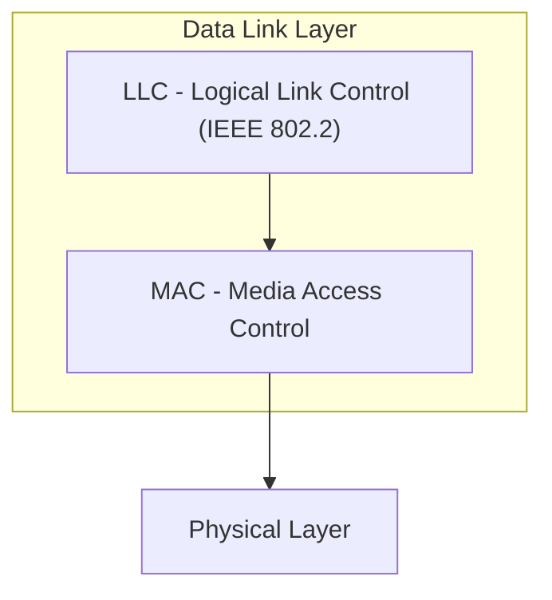
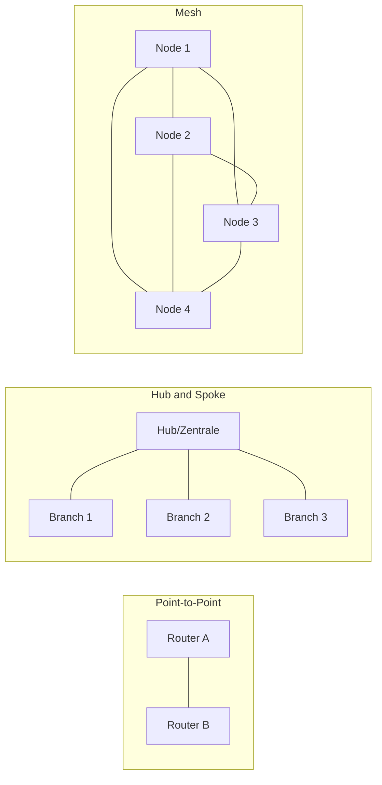
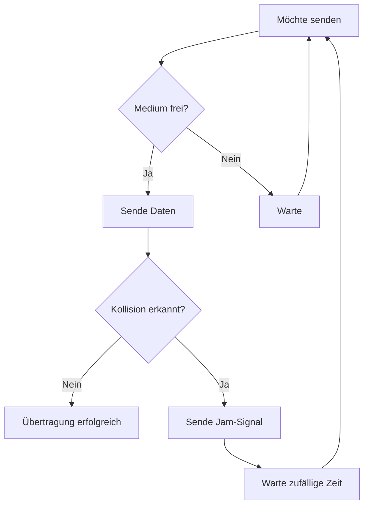
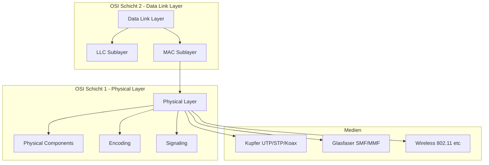

import Callout from '../../../../components/Callout.astro';


Diese Woche behandeln wir zwei fundamentale Schichten des OSI-Modells: die **Physical Layer (Schicht 1)** und die **Data Link Layer (Schicht 2)**. Zusammen bilden sie die Grundlage jeder Netzwerkkommunikation – sie definieren, *wie* Bits physisch übertragen werden und *wie* benachbarte Geräte miteinander kommunizieren.

---

## 1. Physical Layer (OSI-Schicht 1)

### Zweck und Aufgabe

Die Physical Layer ist die unterste Schicht des OSI-Modells. Ihre zentrale Aufgabe ist es, Bits als physische Signale über ein Medium zu transportieren. Sie empfängt vollständige **Frames** von der darüberliegenden Data Link Layer und kodiert diese als Signalfolge, die dann auf das physische Medium übertragen wird.

> **Wichtig:** Die Physical Layer "versteht" keine Adressen oder Protokolle – sie kümmert sich ausschliesslich um die rohe Bitübertragung von Punkt zu Punkt.

Bevor irgendeine Netzwerkkommunikation stattfinden kann, muss eine physische Verbindung zum lokalen Netzwerk bestehen – entweder kabelgebunden oder drahtlos. Diese Verbindung wird durch eine **Network Interface Card (NIC)** hergestellt.



### Physical Layer Standards

Die Physical Layer Standards werden in **Hardware** implementiert und von verschiedenen Organisationen definiert:

- **ISO** – International Standards Organization
- **EIA/TIA** – Electronic/Telecommunications Industry Association
- **ITU-T** – International Telecommunication Union
- **ANSI** – American National Standards Institute
- **IEEE** – Institute of Electrical and Electronics Engineers

Zum Vergleich: TCP/IP-Standards (höhere Schichten) werden in Software implementiert und vom IETF verwaltet.

### Die drei funktionalen Bereiche der Physical Layer

#### Physische Komponenten

Dazu gehören alle Hardware-Elemente, die Signale übertragen:
- NICs (Netzwerkkarten)
- Interfaces und Anschlüsse
- Kabelmaterialien und Kabeldesigns
- Stecker und Buchsen

#### Encoding (Kodierung)

Encoding ist der Prozess, bei dem ein Bitstrom in ein Format umgewandelt wird, das vom nächsten Gerät im Netzwerkpfad erkannt werden kann. Die Kodierung erzeugt vorhersehbare Muster.

Ein bekanntes Beispiel ist die **Manchester-Kodierung**: Hier wird ein Bit nicht durch einen statischen Pegel dargestellt, sondern durch einen Spannungsübergang (Flanke). Ein Übergang von niedrig nach hoch = 1, von hoch nach niedrig = 0. Dies ermöglicht die Synchronisation zwischen Sender und Empfänger, da bei jedem Bit mindestens ein Übergang auftritt.

#### Signalisierung

Die Signalisierung beschreibt, *wie* die Bitwerte „1" und „0" auf dem physischen Medium repräsentiert werden. Dies hängt vom verwendeten Medium ab:

| Medium | Signaltyp |
|---|---|
| Kupferkabel | Elektrische Signale (Spannungsänderungen) |
| Glasfaser | Lichtimpulse (Laser oder LED) |
| Wireless | Mikrowellensignale (AM, FM, PM) |

### Bandbreite und verwandte Begriffe

**Bandbreite** bezeichnet die Kapazität eines Mediums, Daten zu transportieren – also wie viele Bits pro Sekunde übertragen werden können. Sie wird von physikalischen Eigenschaften des Mediums, der Technologie und den Gesetzen der Physik beeinflusst.

| Einheit | Abkürzung | Entsprechung |
|---|---|---|
| Bits pro Sekunde | bps | Grundeinheit |
| Kilobits/s | Kbps | 10³ bps |
| Megabits/s | Mbps | 10⁶ bps |
| Gigabits/s | Gbps | 10⁹ bps |
| Terabits/s | Tbps | 10¹² bps |

Verwandte Begriffe, die oft verwechselt werden:

- **Latenz**: Die Zeit (inkl. Verzögerungen), die Daten benötigen, um von A nach B zu gelangen.
- **Throughput (Durchsatz)**: Die tatsächliche Menge an Bits, die über ein Medium in einem bestimmten Zeitraum übertragen wird.
- **Goodput**: Der *nutzbare* Datendurchsatz – also Throughput minus Overhead (z.B. Protokoll-Header, Steuerpakete). Formel: `Goodput = Throughput - Traffic Overhead`

> **Warum ist der Unterschied wichtig?** Ein Netzwerk kann eine hohe Bandbreite haben, aber wenn die Latenz hoch oder der Overhead gross ist, ist die effektive Nutzleistung (Goodput) viel geringer.

---

## 2. Kupferkabel (Copper Cabling)

### Eigenschaften und Einschränkungen

Kupferkabel ist das am weitesten verbreitete Netzwerkmedium. Es ist günstig, einfach zu installieren und hat einen niedrigen elektrischen Widerstand. Es gibt jedoch wichtige Einschränkungen:

**Dämpfung (Attenuation):** Je länger das Kabel, desto schwächer wird das elektrische Signal. Lösung: Einhaltung von Kabellängenlimits.

**Interferenz:** Elektrische Signale sind anfällig für:
- **EMI (Elektromagnetische Interferenz)** – z.B. durch Motoren
- **RFI (Hochfrequenzinterferenz)** – z.B. durch Funkgeräte
- **Crosstalk** – Übersprechen zwischen benachbarten Leitern im gleichen Kabel

**Gegenmassnahmen:**
- Metallische Abschirmung und Erdung gegen EMI/RFI
- Verdrillte Leitungspaare gegen Crosstalk

### Typen von Kupferkabeln



#### UTP – Unshielded Twisted Pair

UTP ist das am häufigsten verwendete Netzwerkmedium. Es besteht aus:
1. **Aussenmantel** – Schutz vor physischen Beschädigungen
2. **Verdrillte Paare** – Schützen das Signal vor Interferenz durch Auslöschung (Cancellation)
3. **Farbkodierte Kunststoffisolierung** – Elektrische Isolierung und Identifikation der Paare

**Wie funktioniert die Auslöschung?** Jedes Drahtpaar verwendet entgegengesetzte Polarität (ein Draht positiv, einer negativ). Die Magnetfelder heben sich gegenseitig auf und eliminieren externe EMI/RFI. Zusätzlich wird die Anzahl der Verdrillungen pro Meter variiert, um Crosstalk zwischen den Paaren zu reduzieren.

UTP wird mit **RJ-45-Steckern** abgeschlossen und verbindet Hosts mit intermediären Netzwerkgeräten (Switches, Router).

**UTP-Kategorien (IEEE-Standards):**

| Kategorie | Typische Verwendung |
|---|---|
| Cat 3 | Ältere Telefonie, 10 Mbps Ethernet |
| Cat 5 / Cat 5e | Fast Ethernet / Gigabit Ethernet |
| Cat 6 | 10 Gigabit Ethernet (kurze Distanzen) |
| Cat 7 | 10 Gigabit+ mit besserer Abschirmung |

Die Standards für UTP werden durch **TIA/EIA-568** festgelegt, welche Kabeltypen, Längen, Stecker, Terminierung und Testmethoden definiert.

**UTP-Kabeltypen nach Verdrahtungsstandard:**

| Kabeltyp | Standard | Anwendung |
|---|---|---|
| Ethernet Straight-through | Beide Enden T568A oder T568B | Host zu Netzwerkgerät (z.B. PC zu Switch) |
| Ethernet Crossover | Ein Ende T568A, anderes T568B | Gleichartige Geräte (PC zu PC, Switch zu Switch) |
| Rollover (Cisco) | Cisco proprietär | Host-Serienport zu Konsolen-Port |

> **Hinweis:** Crossover-Kabel gelten heute als veraltet, da moderne NICs **Auto-MDIX** verwenden und den Kabeltyp automatisch erkennen.

#### STP – Shielded Twisted Pair

STP bietet besseren Schutz gegen Rauschen als UTP, ist aber teurer und schwieriger zu installieren. Zusätzliche Eigenschaften:
- **Geflecht- oder Folienschirm** um alle Paare → Schutz gegen EMI/RFI
- **Einzelne Folienschirme** für jedes Drahtpaar → zusätzlicher Schutz

Ebenfalls mit RJ-45-Steckern terminiert.

#### Koaxialkabel

Koaxialkabel besteht aus vier Schichten (von innen nach aussen):
1. **Kupferleiter** – überträgt das elektrische Signal
2. **Flexible Kunststoffisolierung**
3. **Geflochtener Kupferschirm oder Metallfolie** – zweiter Leiter im Stromkreis und Abschirmung
4. **Aussenmantel** – Schutz vor physischen Beschädigungen

Koaxialkabel wird heute hauptsächlich verwendet für:
- Wireless-Installationen (Antennenkabel)
- Kabel-Internet-Installationen (Hausverkabelung)

Typische Steckertypen: BNC, N-Typ, F-Typ.

---

## 3. Glasfaserkabel (Fiber-Optic Cabling)

### Eigenschaften

Glasfaserkabel überträgt Daten als **Lichtimpulse** und bietet gegenüber Kupfer deutliche Vorteile:

- Höhere Bandbreite über grössere Distanzen
- Kaum Dämpfung (Attenuation)
- **Vollständig immun gegen EMI/RFI** (kein elektrisches Signal)
- Besteht aus extrem dünnen, flexiblen Glasfäden
- Verwendet Laser oder LED zur Lichterzeugung

Das Kabel fungiert als **Wellenleiter**: Das Licht wird im Glasfaserkern durch die Cladding-Schicht reflektiert und mit minimalen Verlusten übertragen.

### Aufbau eines Glasfaserkabels



| Schicht | Funktion |
|---|---|
| **Jacket** | Schutz gegen Abrieb, Feuchtigkeit und Verunreinigungen |
| **Verstärkungsmaterial** | Verhindert Dehnung beim Verlegen (oft Kevlar, wie in kugelsicheren Westen) |
| **Buffer** | Schützt Core und Cladding vor Beschädigungen |
| **Cladding** | Wirkt wie ein Spiegel: Reflektiert Licht zurück in den Kern |
| **Core** | Lichtwellenleiter aus Silizium oder Glas |

### Typen von Glasfaserkabeln

| Eigenschaft | Singlemode (SMF) | Multimode (MMF) |
|---|---|---|
| Kerngrösse | Sehr klein (9 µm) | Grösser (50/62.5 µm) |
| Lichtquelle | Teurer Laser | Günstigere LEDs |
| Lichtpfade | Einzelner gerader Pfad | Mehrere Pfade (verschiedene Winkel) |
| Distanz | Lange Distanzen | Bis ~550 m bei 10 Gbps |
| Anwendung | WAN, Langstrecke | LAN, Gebäudeverkabelung |

**Farbkodierung der Kabelmäntel:**
- **Gelb** = Singlemode
- **Orange oder Aqua** = Multimode

### Glasfaser-Steckverbinder

- **ST (Straight-Tip)** – Bajonett-Verriegelung
- **SC (Subscriber Connector)** – Push-Pull-Verriegelung
- **LC (Lucent Connector) Simplex** – Kleiner Formfaktor
- **LC Duplex Multimode** – Zwei LC-Stecker für Sende- und Empfangsleitung

### Einsatzgebiete von Glasfaser

- **Enterprise Networks** – Backbone-Verkabelung, Verbindung zwischen Gebäuden
- **FTTH (Fiber-to-the-Home)** – Breitbandanbindung für Privathaushalte
- **Long-Haul Networks** – Verbindung von Städten und Ländern
- **Unterseekabel** – Interkontinentale Verbindungen

### Glasfaser vs. Kupfer im Vergleich

| Kriterium | UTP | Glasfaser |
|---|---|---|
| Bandbreite | 10 Mbps – 10 Gbps | 10 Mbps – 100 Gbps |
| Distanz | 1 – 100 m | 1 – 100.000 m |
| EMI/RFI-Immunität | Niedrig | Vollständig immun |
| Kosten (Medien/Stecker) | Gering | Hoch |
| Installationsaufwand | Gering | Hoch |

---

## 4. Wireless Media

### Eigenschaften

Wireless-Medien übertragen elektromagnetische Signale, die Binärdaten als Radio- oder Mikrowellenfrequenzen darstellen. Sie bieten maximale Mobilität, haben aber spezifische Einschränkungen:

- **Reichweite (Coverage Area)**: Physikalische Gegebenheiten beeinflussen die effektive Abdeckung stark.
- **Interferenz**: Viele Alltagsgeräte (Mikrowellen, Bluetooth etc.) können stören.
- **Sicherheit**: Da keine physische Verbindung nötig ist, kann theoretisch jeder das Signal empfangen.
- **Geteiltes Medium**: WLANs arbeiten im **Half-Duplex-Modus** – nur ein Gerät kann gleichzeitig senden oder empfangen. Bei vielen Nutzern sinkt die effektive Bandbreite pro Nutzer.

### Wireless Standards

| Standard | Technologie | Beschreibung |
|---|---|---|
| IEEE 802.11 | Wi-Fi | WLAN-Technologie |
| IEEE 802.15 | Bluetooth | Wireless Personal Area Network (WPAN) |
| IEEE 802.16 | WiMAX | Breitband-Wireless, Point-to-Multipoint |
| IEEE 802.15.4 | Zigbee | Niedrige Datenrate, geringer Stromverbrauch (IoT) |

### WLAN-Infrastruktur

Für ein Wireless LAN (WLAN) werden benötigt:
- **Wireless Access Point (AP)**: Bündelt Wireless-Signale der Clients und verbindet sie mit der kabelgebundenen Netzwerkinfrastruktur.
- **Wireless NIC Adapter**: Ermöglicht Wireless-Kommunikation für Hosts.

---

## 5. Data Link Layer (OSI-Schicht 2)

### Zweck und Aufgabe

Die Data Link Layer ist für die Kommunikation zwischen **benachbarten Netzwerkgeräten** (NIC zu NIC) zuständig. Sie:

- Ermöglicht höheren Schichten den Zugriff auf das physische Medium
- **Kapselt** Layer-3-Pakete (IPv4/IPv6) in Layer-2-**Frames** ein
- Führt **Fehlererkennung** durch und verwirft fehlerhafte Frames

> **Warum ist diese Trennung sinnvoll?** Netzwerkpakete müssen auf dem Weg von Quelle zu Ziel durch viele verschiedene physische Medien (Ethernet, WLAN, Glasfaser etc.). Jede dieser Verbindungen hat unterschiedliche Eigenschaften. Die Data Link Layer abstrahiert diese Unterschiede für die höheren Schichten – ein IP-Paket muss nicht "wissen", ob es gerade über Kupfer oder Glasfaser reist.

An jedem Hop führt ein Router vier grundlegende Layer-2-Operationen durch:
1. Frame vom Medium empfangen
2. Frame dekapsulieren → Paket extrahieren
3. Paket in neuen Frame einkapseln
4. Neuen Frame auf das nächste Medium senden



**Wichtige Beobachtung:** Die Layer-3-Adressen (IP) bleiben über den gesamten Pfad gleich. Die Layer-2-Adressen (MAC) ändern sich an jedem Hop.

### IEEE 802 Sublayers

Die Data Link Layer besteht gemäss IEEE 802 aus zwei Unterschichten:



- **LLC (Logical Link Control)**: Kommunikationsschnittstelle zwischen Netzwerk-Software der höheren Schichten und der Hardware der unteren Schichten. Protokollunabhängig.
- **MAC (Media Access Control)**: Zuständig für Daten-Enkapsulation und Medienzugriffssteuerung. Protokollspezifisch (Ethernet, WLAN, etc.)

### Data Link Layer Standards

Definiert durch: IEEE, ITU, ISO, ANSI

---

## 6. Netzwerktopologien

### Physische vs. Logische Topologie

- **Physische Topologie**: Zeigt die physischen Verbindungen und wie Geräte miteinander verbunden sind (Kabel, Standorte).
- **Logische Topologie**: Zeigt die virtuellen Verbindungen zwischen Geräten anhand von Interfaces und IP-Adressierungsschemata.

### WAN-Topologien



| Topologie | Beschreibung | Vorteil | Nachteil |
|---|---|---|---|
| **Point-to-Point** | Direkte Verbindung zwischen zwei Endpunkten | Einfach, geringe Protokollkomplexität | Skaliert nicht |
| **Hub and Spoke** | Zentrale Site verbindet Branches über P2P-Links | Kostengünstig | Branches können nicht direkt kommunizieren |
| **Mesh** | Jeder Node mit jedem anderen verbunden | Hohe Verfügbarkeit | Sehr hohe Kosten |

### LAN-Topologien

Moderne LANs verwenden typischerweise:
- **Stern-Topologie (Star)**: Alle Geräte verbunden mit einem zentralen Switch. Einfach zu installieren, skalierbar und einfach troubleshootbar.
- **Erweiterte Stern-Topologie (Extended Star)**: Mehrere Sterne miteinander verbunden.

Ältere LAN-Topologien:
- **Bus**: Alle Geräte an einem gemeinsamen Kabel – veraltet
- **Ring**: Jedes Gerät mit seinen Nachbarn verbunden – verwendet in Legacy Token Ring

### Half-Duplex vs. Full-Duplex

| Modus | Beschreibung | Beispiel |
|---|---|---|
| **Half-Duplex** | Nur ein Gerät kann gleichzeitig senden oder empfangen | WLANs, Legacy Ethernet Hubs |
| **Full-Duplex** | Beide Geräte können gleichzeitig senden und empfangen | Ethernet Switches |

> **Warum ist Full-Duplex effizienter?** Bei Half-Duplex muss ein Gerät warten, bis das Medium frei ist. Bei Full-Duplex gibt es separate Sende- und Empfangswege, sodass keine Wartezeiten entstehen.

---

## 7. Medienzugriffsverfahren (Media Access Control)

Da in vielen Netzwerken mehrere Geräte ein gemeinsames Medium teilen, muss geregelt werden, wer wann senden darf.

### Contention-Based Access (Wettbewerbsbasierter Zugriff)

Alle Knoten im Half-Duplex konkurrieren um das Medium. Kein Gerät hat "reservierte" Sendezeit.

#### CSMA/CD – Carrier Sense Multiple Access with Collision Detection

Verwendet von: Legacy Ethernet LANs (Bus-Topologie)

**Ablauf:**
1. Gerät prüft, ob das Medium frei ist (Carrier Sense)
2. Wenn frei: Gerät sendet
3. Wenn zwei Geräte gleichzeitig senden → **Kollision**
4. Kollision wird erkannt
5. Beide Geräte warten eine **zufällige** Zeitspanne und senden erneut



#### CSMA/CA – Carrier Sense Multiple Access with Collision Avoidance

Verwendet von: IEEE 802.11 WLANs

**Unterschied zu CSMA/CD:** CSMA/CD *erkennt* Kollisionen nach dem Auftreten. CSMA/CA *vermeidet* Kollisionen präventiv, weil Kollisionserkennung im Wireless-Bereich schwieriger ist.

**Ablauf:**
1. Gerät prüft, ob das Medium frei ist
2. Beim Senden wird auch die **Dauer der Übertragung** im Frame mitgesendet
3. Andere Geräte lesen diese Dauer und wissen, wie lange das Medium belegt ist
4. Alle anderen Geräte warten diese Zeit ab, bevor sie selbst senden

### Controlled Access (Gesteuerter Zugriff)

Deterministisches Verfahren: Jeder Knoten erhält eine definierte Zeit auf dem Medium. Kein Wettbewerb, keine Kollisionen. Beispiele: Token Ring, ARCNET (heute veraltet).

---

## 8. Der Data Link Frame

### Struktur eines Frames

Ein Frame besteht aus drei Teilen:

```
┌──────────┬──────────────────────────────┬──────────┐
│  HEADER  │         DATA (Payload)       │ TRAILER  │
└──────────┴──────────────────────────────┴──────────┘
```

**Frame-Felder:**

| Feld | Beschreibung |
|---|---|
| **Frame Start/Stop** | Markiert Beginn und Ende des Frames |
| **Addressing** | Quell- und Ziel-MAC-Adressen |
| **Type** | Identifiziert das Layer-3-Protokoll (z.B. IPv4, IPv6) |
| **Control** | Flow-Control-Informationen |
| **Data** | Der eigentliche Inhalt (das eingekapselte Paket) |
| **Error Detection** | Fehlererkennung (z.B. CRC – Cyclic Redundancy Check) |

### Layer-2-Adressen (MAC-Adressen)

Layer-2-Adressen werden auch als **physische Adressen** bezeichnet. Sie sind:
- Im Frame-Header enthalten
- **Nur für die lokale Zustellung** eines Frames auf dem aktuellen Netzwerksegment gültig
- An jedem Router-Hop werden sie durch neue Adressen ersetzt

**Visualisierung der Adressänderung über mehrere Hops:**


Die **IP-Adressen (Layer 3)** bleiben konstant. Die **MAC-Adressen (Layer 2)** ändern sich an jedem Hop.

### Protokolle für LAN und WAN Frames

Das verwendete Data-Link-Protokoll hängt von der logischen Topologie und dem physischen Medium ab:

- **Ethernet** – Standard-LAN
- **802.11 Wireless** – WLAN
- **PPP (Point-to-Point Protocol)** – WAN
- **HDLC (High-Level Data Link Control)** – Legacy WAN
- **Frame Relay** – Legacy WAN

---

## Zusammenfassung



Die **Physical Layer** stellt sicher, dass Bits als physische Signale übertragen werden – unabhängig davon, ob es sich um elektrische Impulse, Licht oder Funkwellen handelt. Die **Data Link Layer** baut darauf auf und sorgt dafür, dass benachbarte Geräte fehlerfrei miteinander kommunizieren können, den Medienzugriff regeln und Frames korrekt adressieren. Zusammen bilden sie das Fundament, auf dem alle höheren Netzwerkprotokolle (IP, TCP, HTTP etc.) aufbauen.


<Callout type="danger"> 
## Summary Module 4: Physical Layer
</Callout>

**The Physical Connection** — A physical connection to a local network must be established, wired or wireless. Network Interface Card (NIC) connects a device to the network; devices may have just one NIC, while others may have multiple NICs (wired, wireless).

**The Purpose of the Physical Layer** — Transports bits across network media, accepts a complete frame from the data link layer and encodes it as a series of signals ➜ transmitted to local media. Last step in the encapsulation process.

**Physical Layer Standards** — Physical & Data Link layers → implemented in hardware, governed by ISO, EIA/TIA, ITU-T, ANSI, IEEE. Network through Application layers → implemented in software, governed by IETF.

**Physical Layer Components** — Physical components, encoding, signaling.
- **Encoding** — Converts the stream of bits into a format recognizable by the next device in the network path (e.g. Manchester).
- **Signaling** — How bit values "1" and "0" are represented on physical medium (e.g. electric signals over copper, light pulses over fibre-optic, microwave signals over wireless).

**Bandwidth** — Capacity at which a medium can carry data. Physical media properties, technology, and laws of physics determine available bandwidth.
- **Latency** — Data traveling time from A to B including delays.
- **Throughput** — Transfer of bits across media over a given period of time.
- **Goodput** — Usable data transferred over a given period of time. `Goodput = Throughput − Traffic Overhead`

| Unit | Value |
|------|-------|
| 1 bps | basis |
| 1 Kbps | 10³ bps |
| 1 Mbps | 10⁶ bps |
| 1 Gbps | 10⁹ bps |
| 1 Tbps | 10¹² bps |

### Copper Cabling

`+` Inexpensive, easy to install, low resistance to electrical current flow.  
`−` Attenuation, EMI/RFI interference, crosstalk.  
Mitigation: limiting cable length (attenuation), metallic shielding and grounding (interference), twisting opposing circuit pair wires together (crosstalk).

**UTP (Unshielded Twisted-Pair)** — Most common, terminated with RJ-45 connectors, interconnects hosts with intermediary network devices. Outer jacket protects copper wires, twisted pairs protect signal from interference, color-coded plastic insulation electrically isolates wires and identifies each pair.

**STP (Shielded Twisted-Pair)** — `+` Better noise protection than UTP. `−` More expensive, harder to install. Terminated with RJ-45 connectors. Braided or foil shield provides EMI/RFI protection.

**Coaxial Cable** — Mostly used in wireless and cable internet installations. Outer jacket, woven copper braid/metallic foil (second wire + shield), flexible plastic insulation, copper conductor. Connector types: BNC, N type, F type.

**UTP Cabling Standards** — Four pairs of color-coded copper wires twisted together, encased in flexible plastic sheath, no shielding. Standards by TIA/EIA (cable types, lengths, connectors, termination, testing). Electrical standards by IEEE (category 3, 5, 5e, 6, 7).
- **T568A (EU)** — Pair 1 = 4+5, Pair 2 = 3+6, Pair 3 = 1+2, Pair 4 = 7+8
- **T568B (USA)** — Pair 1 = 4+5, Pair 2 = 1+2, Pair 3 = 3+6, Pair 4 = 7+8

### Fibre Optic Cabling

Not as common as UTP, expensive, transmits data over longer distances at higher bandwidth, less susceptible to attenuation, immune to EMI/RFI. Extremely thin strands of very pure glass; laser or LED encodes bits as pulses of light. Made of: Jacket, Strengthening Material, Buffer, Cladding, Core.

- **Single-mode** — Very small core, expensive lasers, long-distance.
- **Multimode** — Larger core, less expensive LEDs, LEDs transmit at different angles, up to 10 Gbps over 550 meters.

**Fibre Cabling Usage** — Enterprise Networks (backbone cabling, interconnecting infrastructure devices), FTTH (always-on broadband for homes and small businesses), Long-Haul Networks (connecting countries and cities), Submarine Cable Networks (transoceanic, high-speed, high-capacity).

**Fibre-Optic Connectors** — ST, SC, LC Simplex, Duplex Multimode LC.

**Fibre Patch Cords** — SC-SC MM, LC-LC SM, ST-LC MM, ST-SC SM. Yellow jacket = single-mode, orange/aqua = multimode.

### Fibre vs. Copper

| | UTP | Fibre |
|-|-----|-------|
| Bandwidth | 10 Mb/s – 10 Gb/s | 10 Mb/s – 100 Gb/s |
| Distance | Short | Long |
| EMI/RFI Immunity | Low | High |
| Electrical hazard immunity | Low | High |
| Media & connector costs | Lowest | Highest |
| Installation skills required | Lowest | Highest |
| Safety precautions | Lowest | Highest |

### Wireless Media

Electromagnetic signals representing binary digits, radio or microwave frequencies.  
`+` Mobility. `−` Limited coverage area, interference, security, half-duplex (send or receive at a time).

| Standard | Protocol |
|----------|----------|
| IEEE 802.11 | Wi-Fi |
| IEEE 802.15 | Bluetooth |
| IEEE 802.16 | WiMAX |
| IEEE 802.15.4 | Zigbee |


<Callout type="danger"> 
## Summary Module 6: Data Link Layer
</Callout>

**Purpose of the Data Link Layer** — Responsible for communications between end-device NICs. Allows upper layer protocols to access physical layer media, encapsulates Layer 3 packets (IPv4 and IPv6) into Layer 2 frames, performs error detection, rejects corrupt frames.

**IEEE 802 LAN/MAN Data Link Sublayers** — Specific to the type of network (Ethernet, WLAN, WPAN, etc.).
- **LLC (Logical Link Control)** — Communicates between networking software at upper layers and device hardware at lower layers.
- **MAC (Media Access Control)** — Data encapsulation and media access control.

**Data Link Layer Standards** — IEEE, ITU, ISO, ANSI.

### Topologies

**Physical topology** — Physical connections and interconnection of devices.  
**Logical topology** — Virtual connections between devices, interfaces, and IP addressing schemes.

**WAN Topologies**
- **Point-to-Point** — Permanent link between two endpoints.
- **Hub and Spoke** — Central site interconnects branch sites through point-to-point links; branch sites cannot exchange data without going through the central site.
- **Mesh** — High availability; requires every end system to be connected to every other end system.

**LAN Topologies**
- **Star / Extended Star** — Easy to install, scalable, easy to troubleshoot.
- **Bus** — All end systems chained together, terminated on each end.
- **Ring** — Each end system connected to its respective neighbors.

**Half vs. Full Duplex**
- **Half Duplex** — One device sends or receives at a time (WLAN, legacy bus topologies with Ethernet hubs).
- **Full Duplex** — Both devices simultaneously transmit and receive (Ethernet switches).

**Access Control Methods**
- **Contention-based (half-duplex)** — Competing for use of the medium.
  - **CSMA/CD** — Devices wait a random period and retransmit; used in legacy bus-topology Ethernet.
  - **CSMA/CA** — Includes time duration needed for transmission; other devices know how long medium is unavailable; used in Wireless LAN.
- **Controlled access (deterministic)** — Each node has its own time on the medium (Token Ring, ARCNET).

### Data Link Frame

Frame consists of **Header**, **Data**, and **Trailer**.

**Frame Fields**
- Header → Frame start/stop, Addressing (source and destination nodes), Type (identifies encapsulated Layer 3 protocol), Control (flow control services).
- Data (Packet) → Frame payload.
- Trailer → Error Detection, Frame stop.

**Layer 2 Addresses** — Physical address contained in the frame header, used for local delivery of a frame on link, updated by each device that forwards the frame.

**LAN and WAN Frames** — Logical topology and physical media determine the data link protocol used: Ethernet, 802.11 Wireless, PPP (Point-to-Point), HDLC (High-Level Data Link Control), Frame-Relay.