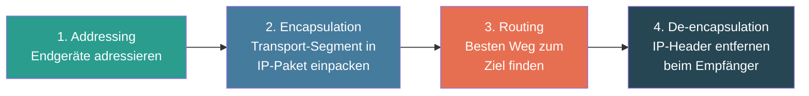
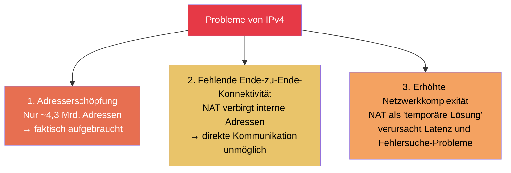
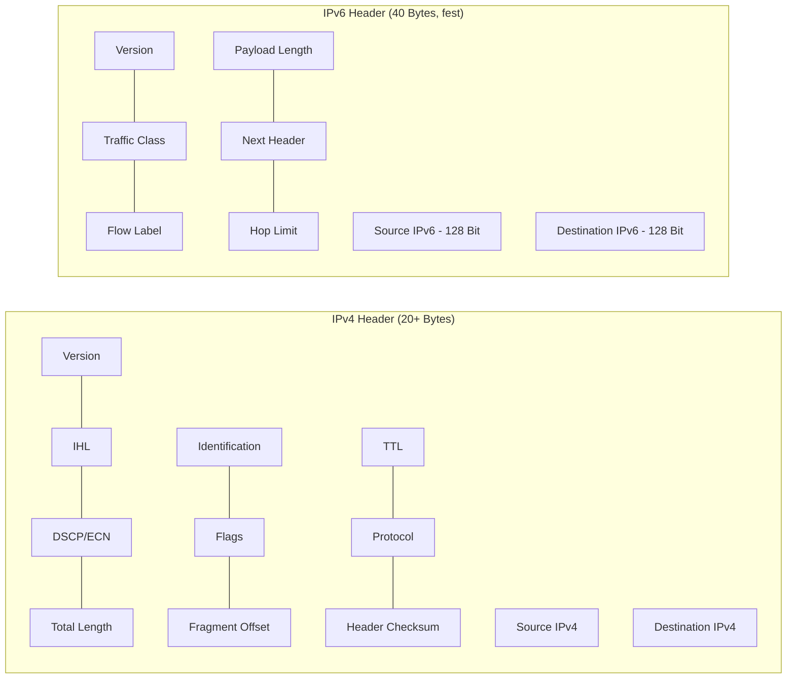
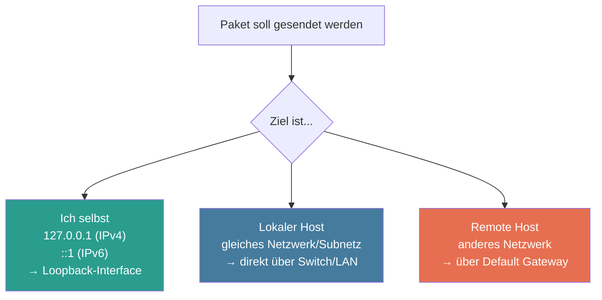
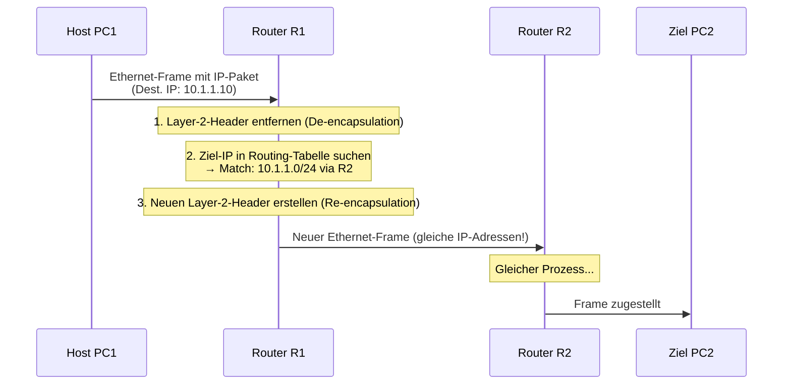
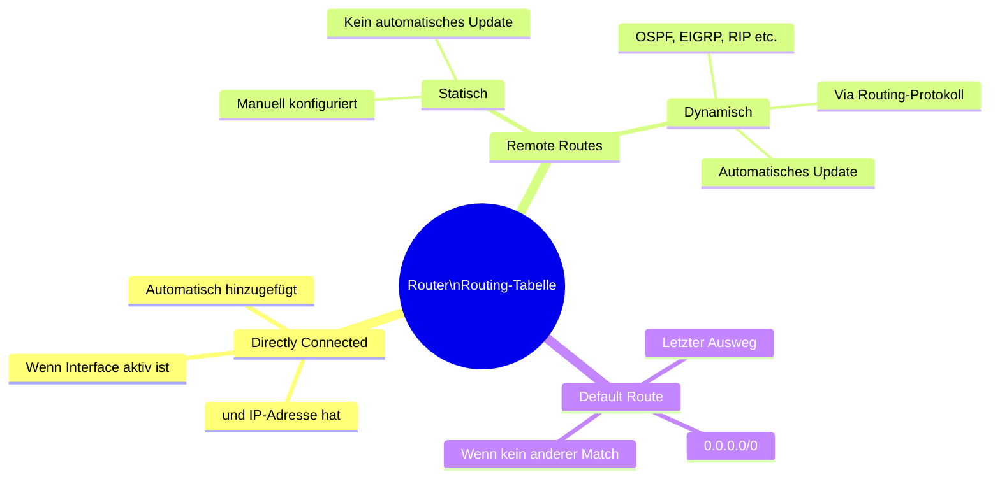
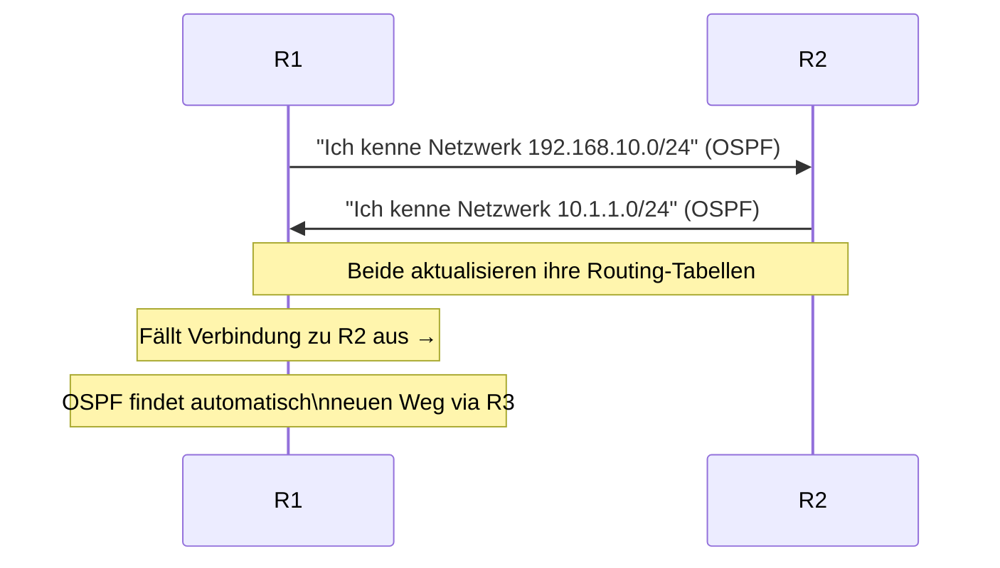
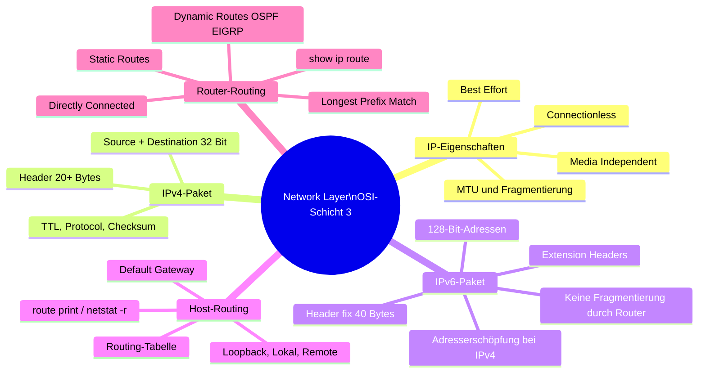

import Callout from '../../../../components/Callout.astro';


Der Network Layer ist die Schicht, die es ermöglicht, Daten **über mehrere Netzwerke hinweg** zu übertragen – also nicht nur innerhalb eines LANs, sondern quer durch das Internet. Er ist die Grundlage dafür, dass ein Paket von einem Rechner in Zürich einen Server in New York erreichen kann, obwohl die beiden Geräte nie direkt miteinander verbunden sind.

---

## 1. Eigenschaften des Network Layers

### Grundfunktionen

Der Network Layer erfüllt vier zentrale Aufgaben:



Die zwei Hauptprotokolle auf dieser Schicht sind **IPv4** und **IPv6**. Beide sind grundlegend unterschiedlich in der Adresslänge, haben aber dasselbe Ziel: Pakete von Quelle zu Ziel zu routen.

### IP-Kapselung

```
Transport Layer PDU:    [ Segment Header | Data         ]
                                 ↓ Encapsulation
Network Layer PDU:      [ IP Header      | Segment Header | Data ]
                                    = IP-Paket
```

Wichtig: Die **IP-Adresse ändert sich nicht** auf dem Weg vom Sender zum Empfänger (Ausnahme: NAT, wird später behandelt). Der IP-Header enthält die unveränderliche Quelle und das unveränderliche Ziel – jeder Router auf dem Weg liest diesen Header, um das Paket weiterzuleiten.

### Die drei Grundeigenschaften von IP

IP wurde bewusst schlank und einfach gehalten. Das hat Vor- und Nachteile:

| Eigenschaft | Bedeutung | Warum so designt? |
|---|---|---|
| **Connectionless** | Keine Verbindung wird vor dem Senden aufgebaut | Weniger Overhead – kein Handshake nötig |
| **Best Effort** | Keine Garantie auf Zustellung | Kein Retransmission-Mechanismus → schneller |
| **Media Independent** | IP läuft über Kupfer, Glasfaser oder Funk | Flexibilität und Unabhängigkeit vom Medium |

#### Connectionless (verbindungslos)

IP verhält sich wie ein Brief, der in den Briefkasten geworfen wird – es gibt keine Vorab-Ankündigung, kein Bestätigung, keinen "Handshake". Der Empfänger erfährt erst von der Nachricht, wenn das Paket ankommt.

> **Wo kommt die Zuverlässigkeit dann her?** Wenn Anwendungen eine zuverlässige Übertragung brauchen (z. B. eine Webseite oder ein Dateidownload), übernimmt **TCP auf Layer 4** die Aufgabe der Fehlerkorrektur und Reihenfolgegarantie. IP selbst bleibt schlank.

#### Best Effort (bestmögliche Zustellung)

IP **garantiert keine Paketzustellung**. Pakete können verloren gehen, in der falschen Reihenfolge ankommen oder dupliziert werden. IP kümmert sich nicht darum – es "versucht sein Bestes". Das reduziert den Overhead erheblich, da keine Quittungen auf Layer 3 notwendig sind.

#### Media Independent (medienunabhängig)

IP kümmert sich nicht darum, ob die Daten über ein Ethernet-Kabel, eine WLAN-Verbindung oder eine Glasfaserleitung transportiert werden. Es übergibt das Paket einfach an Layer 2 (Data Link) und lässt diesen die medienspezifische Übertragung erledigen.

**MTU (Maximum Transmission Unit):**
Jedes Medium hat eine maximale Rahmengrösse. Wenn ein IP-Paket grösser ist als die MTU des nächsten Netzwerksegments, muss es **fragmentiert** werden (nur bei IPv4):

- **Fragmentierung** = Aufteilen des IPv4-Pakets in kleinere Einheiten
- Fragmentierung verursacht **Latenz** und Overhead
- **IPv6 fragmentiert nicht** – wenn ein Paket zu gross ist, wird es verworfen und der Sender via ICMPv6 informiert, die Paketgrösse zu reduzieren (Path MTU Discovery)

---

## 2. IPv4-Paket

### Aufbau des IPv4-Headers

Der IPv4-Header hat eine **Mindestgrösse von 20 Bytes** und wird von links nach rechts, in 4-Byte-Zeilen gelesen:

```
 0                   1                   2                   3
 0 1 2 3 4 5 6 7 8 9 0 1 2 3 4 5 6 7 8 9 0 1 2 3 4 5 6 7 8 9 0 1
+-+-+-+-+-+-+-+-+-+-+-+-+-+-+-+-+-+-+-+-+-+-+-+-+-+-+-+-+-+-+-+-+
|Version|  IHL  |    DS / DSCP  |ECN|        Total Length       |
+-+-+-+-+-+-+-+-+-+-+-+-+-+-+-+-+-+-+-+-+-+-+-+-+-+-+-+-+-+-+-+-+
|         Identification        |Flags|      Fragment Offset    |
+-+-+-+-+-+-+-+-+-+-+-+-+-+-+-+-+-+-+-+-+-+-+-+-+-+-+-+-+-+-+-+-+
|  Time to Live |    Protocol   |         Header Checksum       |
+-+-+-+-+-+-+-+-+-+-+-+-+-+-+-+-+-+-+-+-+-+-+-+-+-+-+-+-+-+-+-+-+
|                       Source IP Address                       |
+-+-+-+-+-+-+-+-+-+-+-+-+-+-+-+-+-+-+-+-+-+-+-+-+-+-+-+-+-+-+-+-+
|                    Destination IP Address                     |
+-+-+-+-+-+-+-+-+-+-+-+-+-+-+-+-+-+-+-+-+-+-+-+-+-+-+-+-+-+-+-+-+
|                    Options (falls vorhanden)                  |
+-+-+-+-+-+-+-+-+-+-+-+-+-+-+-+-+-+-+-+-+-+-+-+-+-+-+-+-+-+-+-+-+
```

### Die wichtigsten Header-Felder im Detail

| Feld | Grösse | Funktion und Bedeutung |
|---|---|---|
| **Version** | 4 Bit | Protokollversion: `0100` = IPv4 |
| **IHL** (Internet Header Length) | 4 Bit | Länge des Headers in 32-Bit-Wörtern (min. 5 = 20 Bytes) |
| **DS / DSCP** (Differentiated Services) | 8 Bit | QoS-Kennzeichnung: Priorisierung von Traffic (z. B. VoIP vor HTTP) |
| **Total Length** | 16 Bit | Gesamtlänge des Pakets (Header + Daten) in Bytes |
| **Identification** | 16 Bit | Identifiziert zusammengehörige Fragmente |
| **Flags** | 3 Bit | Steuert Fragmentierung (z. B. "Don't Fragment") |
| **Fragment Offset** | 13 Bit | Position des Fragments im ursprünglichen Paket |
| **Time to Live (TTL)** | 8 Bit | Maximale Anzahl Hops (Router-Durchgänge); wird bei jedem Router um 1 dekrementiert; bei 0 wird das Paket verworfen |
| **Protocol** | 8 Bit | Gibt das Protokoll der Nutzlast an: `6` = TCP, `17` = UDP, `1` = ICMP |
| **Header Checksum** | 16 Bit | Prüfsumme nur für den Header – erkennt Übertragungsfehler im Header |
| **Source IP Address** | 32 Bit | IPv4-Adresse des Absenders |
| **Destination IP Address** | 32 Bit | IPv4-Adresse des Empfängers |

> **Warum TTL?** Ohne TTL könnten Pakete endlos im Netzwerk kreisen (Routing-Loops). TTL verhindert das: Nach maximal 255 Hops wird das Paket zwingend verworfen. Standard-TTL-Werte: Windows = 128, Linux/macOS = 64.

---

## 3. IPv6-Paket

### Warum IPv6? – Die Grenzen von IPv4

IPv4 war revolutionär, aber es wurde nicht für das Internet von heute entworfen. Es gibt drei fundamentale Probleme:



**IPv4 Adressraum:** 2³² = ca. 4,3 Milliarden Adressen – längst erschöpft.
**IPv6 Adressraum:** 2¹²⁸ = **340 Undezillionen** Adressen (340.000.000.000.000.000.000.000.000.000.000.000.000) – praktisch unerschöpflich.

### IPv6-Verbesserungen

- **Riesiger Adressraum:** 128-Bit-Adressen statt 32-Bit
- **Vereinfachter Header:** Weniger Felder → schnellere Router-Verarbeitung
- **NAT nicht mehr nötig:** Jedes Gerät kann eine globale, eindeutige Adresse erhalten
- **Keine Fragmentierung durch Router:** Effizienter, Sender passt Grösse selbst an
- **Integrierte Sicherheit:** IPsec ist nativ unterstützt

### Aufbau des IPv6-Headers

Der IPv6-Header ist **fest 40 Bytes** gross – grösser als der minimale IPv4-Header (20 Bytes), aber mit weniger Feldern und ohne optionale Felder im Basisheader:

```
 0                   1                   2                   3
 0 1 2 3 4 5 6 7 8 9 0 1 2 3 4 5 6 7 8 9 0 1 2 3 4 5 6 7 8 9 0 1
+-+-+-+-+-+-+-+-+-+-+-+-+-+-+-+-+-+-+-+-+-+-+-+-+-+-+-+-+-+-+-+-+
|Version| Traffic Class |           Flow Label                  |
+-+-+-+-+-+-+-+-+-+-+-+-+-+-+-+-+-+-+-+-+-+-+-+-+-+-+-+-+-+-+-+-+
|         Payload Length        |  Next Header  |   Hop Limit   |
+-+-+-+-+-+-+-+-+-+-+-+-+-+-+-+-+-+-+-+-+-+-+-+-+-+-+-+-+-+-+-+-+
|                                                               |
+                       Source Address                          +
|                       (128 Bit)                               |
+-+-+-+-+-+-+-+-+-+-+-+-+-+-+-+-+-+-+-+-+-+-+-+-+-+-+-+-+-+-+-+-+
|                                                               |
+                    Destination Address                        +
|                       (128 Bit)                               |
+-+-+-+-+-+-+-+-+-+-+-+-+-+-+-+-+-+-+-+-+-+-+-+-+-+-+-+-+-+-+-+-+
```

### IPv6 Header-Felder

| Feld | Grösse | Funktion |
|---|---|---|
| **Version** | 4 Bit | `0110` = IPv6 |
| **Traffic Class** | 8 Bit | QoS-Priorisierung (entspricht DSCP in IPv4) |
| **Flow Label** | 20 Bit | Identifiziert zusammengehörige Pakete (z. B. ein Video-Stream) für gleichbehandlung |
| **Payload Length** | 16 Bit | Länge der Nutzdaten (ohne den 40-Byte-Header) |
| **Next Header** | 8 Bit | Gibt das nächste Protokoll an: TCP, UDP, ICMPv6, oder ein Extension Header |
| **Hop Limit** | 8 Bit | Entspricht dem TTL bei IPv4 |
| **Source Address** | 128 Bit | IPv6-Quelladresse |
| **Destination Address** | 128 Bit | IPv6-Zieladresse |

### IPv4 vs. IPv6 Header – Vergleich



**Entfernte IPv4-Felder in IPv6:**
- `IHL` → nicht nötig, Header ist immer 40 Bytes
- `Identification`, `Flags`, `Fragment Offset` → keine Fragmentierung durch Router
- `Header Checksum` → wird von Layer 2 und Layer 4 bereits geprüft

### Extension Headers (Erweiterungs-Header)

IPv6 ersetzt die optionalen Felder aus IPv4 durch **optionale Extension Headers**, die zwischen dem Basis-Header und der Nutzlast eingefügt werden:

- Fragmentierung (wird vom Sender, nicht vom Router, durchgeführt)
- Sicherheit (IPsec AH / ESP)
- Routing-Informationen
- Mobilitäts-Unterstützung

> **Vorteil:** Router müssen Extension Headers nur verarbeiten, wenn sie relevant sind – das beschleunigt die normale Paketweiterleitung erheblich.

---

## 4. Wie ein Host routet

### Routing-Entscheidung am Endgerät

Viele vergessen: Nicht nur Router treffen Routing-Entscheidungen – **auch jeder Host (PC, Smartphone, Server) entscheidet selbst**, wohin er ein Paket schickt. Jedes Gerät pflegt eine eigene Routing-Tabelle.



**Wie bestimmt der Host, ob das Ziel lokal oder remote ist?**
- **IPv4:** Host vergleicht seine eigene IP-Adresse + Subnetzmaske mit der Ziel-IP. Liegen beide im gleichen Netzwerk → lokal, sonst → remote.
- **IPv6:** Host verwendet das Netzwerk-Präfix, das der lokale Router via Router Advertisement (RA) kommuniziert hat.

### Das Default Gateway

Das **Default Gateway** (DGW) ist die "Tür" aus dem lokalen Netzwerk heraus. Es ist typischerweise der Router, der an das LAN angeschlossen ist.

**Eigenschaften eines Default Gateways:**
- Hat eine IP-Adresse im **gleichen Subnetz** wie die lokalen Hosts
- Kann Traffic **ausserhalb des LANs weiterleiten**
- Kennt Routen zu anderen Netzwerken

**Wie lernt ein Host sein Default Gateway?**
- **IPv4:** Manuell konfiguriert oder automatisch via **DHCP** (Dynamic Host Configuration Protocol)
- **IPv6:** Via **Router Solicitation (RS)** – der Host fragt aktiv nach, der Router antwortet mit Router Advertisement (RA)

> **Was passiert ohne Default Gateway?** Der Host kann lokal kommunizieren, aber kein Paket verlässt das LAN. Webseiten, Cloud-Dienste, externe Server – alles unerreichbar.

In der Routing-Tabelle des Hosts erscheint das Default Gateway als **Default Route (0.0.0.0/0)** – die Route mit der niedrigsten Spezifizität, die als "last resort" für alles gilt, was sonst keine Übereinstimmung findet.

### Host-Routing-Tabelle anzeigen (Windows)

```cmd
C:\> route print
C:\> netstat -r
```

Diese Befehle zeigen drei Abschnitte:
1. **Interface List** – alle Netzwerkinterfaces mit MAC-Adressen
2. **IPv4 Route Table** – aktive IPv4-Routen
3. **IPv6 Route Table** – aktive IPv6-Routen

Beispiel einer IPv4-Routing-Tabelle eines Windows-Hosts:

```
Active Routes:
Network Destination    Netmask          Gateway       Interface   Metric
0.0.0.0                0.0.0.0          192.168.10.1  192.168.10.10   25   ← Default Route
127.0.0.0              255.0.0.0        On-link       127.0.0.1      306   ← Loopback
192.168.10.0           255.255.255.0    On-link       192.168.10.10  281   ← Lokales Netz
```

---

## 5. Router und Routing-Tabellen

### Wie ein Router ein Paket weiterleitet

Wenn ein Paket beim Router ankommt, läuft folgender Prozess ab:



**Schlüsselprinzip:** Bei jedem Hop werden die **Layer-2-Header neu erstellt**, aber die **Layer-3-IP-Adressen bleiben unverändert**.

### Arten von Routen in der Routing-Tabelle



### Statisches Routing

Statische Routen werden vom Administrator **manuell** konfiguriert:

```cisco
R1(config)# ip route 10.1.1.0 255.255.255.0 209.165.200.226
                      ↑                          ↑
              Zielnetzwerk               Next-Hop-Router (R2)
```

**Vorteile:**
- Einfach und vorhersehbar
- Kein Routing-Protokoll-Overhead
- Sicher (kein dynamischer Austausch von Routing-Infos)

**Nachteile:**
- Muss **manuell angepasst** werden, wenn sich die Topologie ändert
- Skaliert schlecht bei grossen Netzwerken
- Kein automatisches Failover

**Geeignet für:** Kleine, stabile Netzwerke; Default Route; Stub-Netzwerke (nur ein Ausgang)

### Dynamisches Routing

Dynamische Routing-Protokolle ermöglichen es Routern, **automatisch** Routen zu entdecken und auszutauschen:

- Routen werden **automatisch gelernt** und aktualisiert
- Bei Topologieänderungen (z. B. Ausfall einer Leitung) wird **automatisch ein neuer Pfad** berechnet
- Beispiel-Protokolle: **OSPF**, **EIGRP**, **RIP**, **BGP**



### Die Router-Routing-Tabelle lesen (`show ip route`)

```cisco
R1# show ip route

Codes: L - local, C - connected, S - static, O - OSPF, D - EIGRP, ...

Gateway of last resort is 209.165.200.226 to network 0.0.0.0

S*   0.0.0.0/0 [1/0] via 209.165.200.226          ← Default Route (statisch)
O    10.1.1.0/24 [110/2] via 209.165.200.226       ← Remote Route (OSPF gelernt)
C    192.168.10.0/24 is directly connected, G0/0/0 ← Direkt verbunden
L    192.168.10.1/32 is directly connected, G0/0/0 ← Lokale Interface-Adresse
C    209.165.200.224/30 is directly connected, G0/0/1
L    209.165.200.225/32 is directly connected, G0/0/1
```

**Bedeutung der Kürzel:**

| Kürzel | Bedeutung |
|---|---|
| `C` | Connected – direkt verbundenes Netzwerk |
| `L` | Local – IP-Adresse des Interfaces selbst |
| `S` | Static – manuell konfigurierte Route |
| `S*` | Static Default Route |
| `O` | OSPF – dynamisch via OSPF gelernt |
| `D` | EIGRP – dynamisch via EIGRP gelernt |

**Routing-Tabellen-Einträge verstehen:**

```
O    10.1.1.0/24 [110/2] via 209.165.200.226, GigabitEthernet0/0/1
     ↑    ↑       ↑  ↑       ↑                 ↑
  Quelle Netz   AD  Metric  Next-Hop          Ausgangs-Interface
```

- **AD (Administrative Distance):** Vertrauenswürdigkeit der Routenquelle (niedriger = vertrauenswürdiger; Connected = 0, Static = 1, OSPF = 110, EIGRP = 90)
- **Metric:** Kosten des Pfades (je nach Protokoll: Hopcount, Bandbreite, Verzögerung etc.)
- **Longest Prefix Match:** Bei mehreren Übereinstimmungen gewinnt die **spezifischste Route** (grösste Subnetzmaske)

---

## Zusammenfassung



### Schlüsselbegriffe

| Begriff | Bedeutung |
|---|---|
| **Connectionless** | Keine Verbindung vor dem Senden – IP schickt Pakete ohne Vorab-Handshake |
| **Best Effort** | Keine Zustellgarantie – Pakete können verloren gehen |
| **MTU** | Maximum Transmission Unit – maximale Paketgrösse eines Mediums |
| **Fragmentierung** | Aufteilen eines zu grossen IPv4-Pakets (IPv6 fragmentiert nicht) |
| **TTL / Hop Limit** | Schutzmechanismus gegen endlose Routing-Loops |
| **Default Gateway** | Router als "Ausgangstor" aus dem lokalen Netzwerk |
| **Default Route** | Route 0.0.0.0/0 – gilt für alle Ziele ohne spezifischeren Eintrag |
| **Administrative Distance** | Vertrauenswürdigkeit einer Route-Quelle (niedriger = besser) |
| **Longest Prefix Match** | Routing-Entscheidung: die spezifischste Route gewinnt |
| **OSPF / EIGRP** | Dynamische Routing-Protokolle zum automatischen Routenaustausch |


<Callout type="danger"> 
## Summary Module 8: Network Layer
</Callout>

**Network Layer Characteristics** — Provides services to allow devices to exchange data. IPv4 and IPv6 are the most principal protocols. Performs 4 basic operations: Addressing end devices, Encapsulation, Routing, De-encapsulation.

**IP Encapsulation** — Encapsulates transport layer segment. IP packet examined by all Layer 3 devices. IP addressing won't change from source to destination.

**Characteristics of IP** — Low overhead, connectionless (other protocols handle reliability e.g. TCP), best effort (no guarantee of delivery), media independent (copper, fibre, wireless). MTU received from data link layer; network layer establishes MTU size. Fragmentation (IPv4 only, IPv6 does not fragment) → causes latency e.g. when router goes from Ethernet to slow WAN with smaller MTU.

### IPv4 Packet

**IPv4 Packet Header** — Primary communication protocol; header information used by all Layer 3 devices. Formatted in binary, 4 rows × 20 columns of information in bytes. Most important fields are source and destination.

| Field | Description |
|-------|-------------|
| Version | 4-bit field = `0100`, value set to 4 |
| Differentiated Services | Used for QoS: DiffServ / DS field, or older IntServ / ToS (Type of Service) |
| Header Checksum | Detect corruption in IPv4 header |
| Time to Live (TTL) | Layer 3 hop count (= 0 → router discards packet) |
| Protocol | Identifies next level protocol: ICMP, TCP, UDP etc. |
| Source IPv4 Address | 32-bit source address |
| Destination IPv4 Address | 32-bit destination address |

**Limitations of IPv4** — Address depletion, lack of end-to-end connectivity (NAT maps private to public addresses as a temporary solution), NAT causes latency and troubleshooting issues → complex.

### IPv6 Packet

Developed by IETF to overcome IPv4 limitations. Increased address space, improved packet handling (simpler, fewer header fields), no need for NAT. Header is 40 bytes long. IPv4 fields removed: Flag, Fragment Offset, Header Checksum.

| Field | Description |
|-------|-------------|
| Version | 4-bit field = `0110`, value set to 6 |
| Traffic Class | Used for QoS: same as DiffServ / DS field |
| Flow Label | 20-bit field, informs device to handle identical flow labels the same way |
| Payload Length | 16-bit field, indicates length of data portion (payload) |
| Next Header | Identifies next level protocol: ICMP, TCP, UDP etc. |
| Hop Limit | Replaces TTL field, Layer 3 hop count |
| Source IPv6 Address | 128-bit source address |
| Destination IPv6 Address | 128-bit destination address |

**IPv6 Extension Headers (EH)** — Optional network layer information, placed between IPv6 header and payload. May be used for fragmentation, security, mobility support etc. Unlike IPv4, routers do not fragment IPv6 packets.

### How a Host Routes

**Host Forwarding Decision** — Packets always created at source; each host creates its own routing table. Host can send to itself (`127.0.0.1` IPv4, `::1` IPv6), local hosts (same LAN), or remote hosts (different LAN). Source determines if destination is local or remote: IPv4 uses own IP + subnet mask with destination IP; IPv6 uses network address and prefix provided by local router. Remote traffic forwarded to default gateway.

**Default Gateway** — Router or Layer 3 switch; must have an IP address in the same range as the LAN; accepts data from LAN and forwards it out. A device with no (or bad) default gateway cannot send traffic outside the LAN.

**Host Routes to Default Gateway** — Known statically or via DHCP (IPv4) or router solicitation (IPv6). Default gateway is the last resort in the routing table.

**Host Routing Tables** — `route print` or `netstat -r` (Windows) displays: Interface List + MAC addressing, IPv4 routing table, IPv6 routing table.

### Introduction to Routing

**Router Packet Forwarding Decision**
1. Packet arrives at interface X on router Y → router de-encapsulates the Layer 2 Ethernet header and trailer.
2. Router Y examines destination IPv4 address, searches for best match in its IPv4 routing table (e.g. Router Z).
3. Router Y encapsulates the packet into a new Ethernet header and trailer, forwards it to next hop Router Z.

**IP Router Routing Table**
- **Directly connected** — Added automatically by router.
- **Remote** — No direct connection; learned manually (static route) or dynamically (routing protocol).
- **Default route** — Forwards all traffic in a specific direction when there is no match in routing table.

**Static Routing** — Configured and adjusted manually when topology changes. Good for small non-redundant networks, often used in conjunction with a dynamic routing protocol.

**Dynamic Routing** — Discovers remote networks, configured and adjusted automatically, chooses best path to destination, automatically finds new paths when topology changes, can share static default routes with other routers.

**IPv4 Routing Table** — `show ip route` → displays route sources.
- `L` — Directly connected local interface IP address.
- `C` — Directly connected network.
- `S` — Static route.
- `O` — OSPF.
- `D` — EIGRP.
- `S*` — Default route.