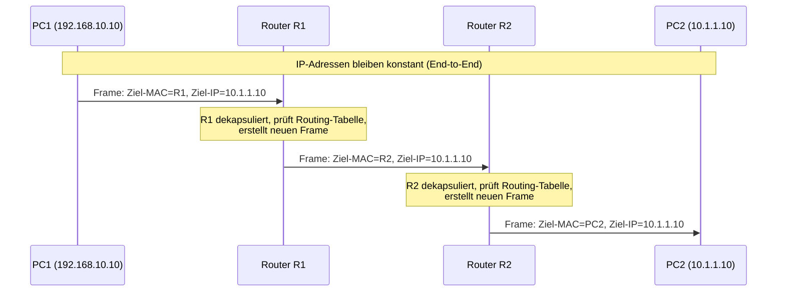
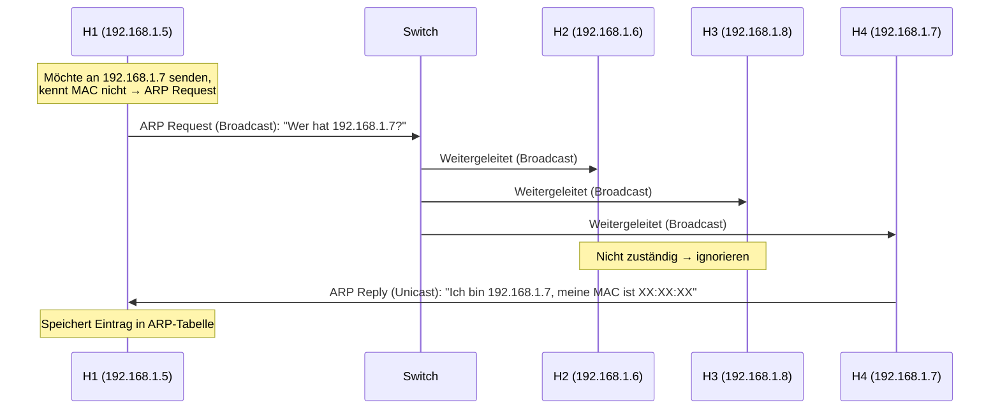
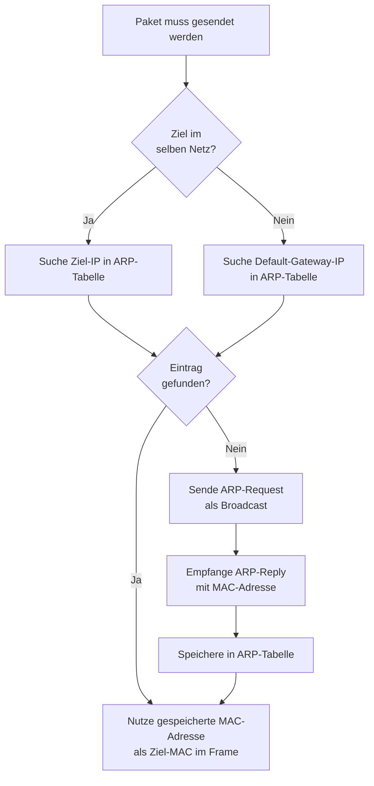
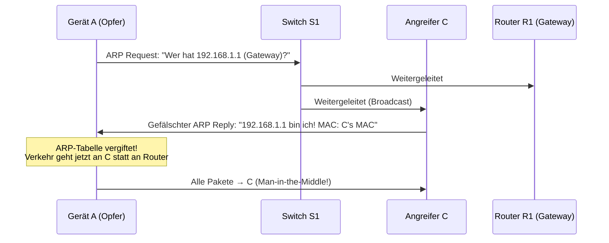
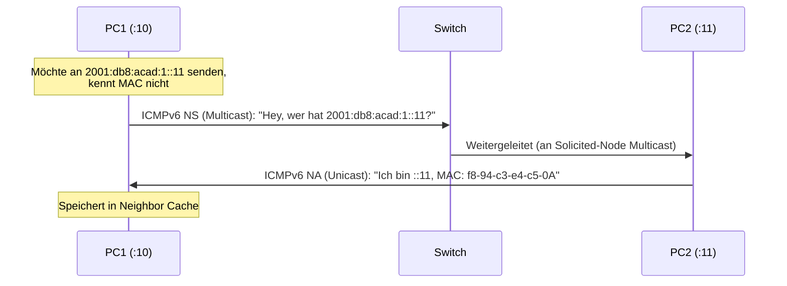
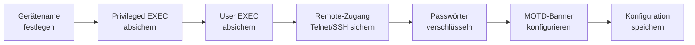
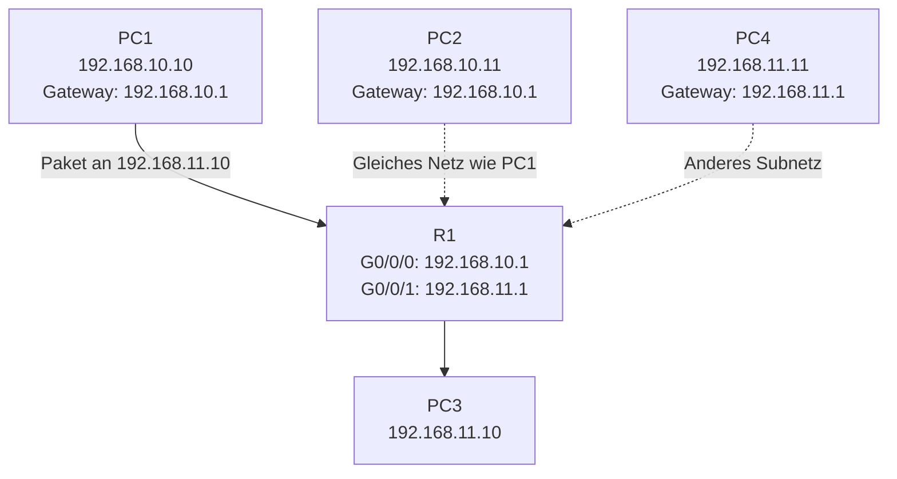
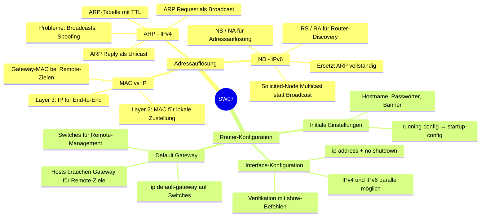

import Callout from '../../../../components/Callout.astro';


Diese Woche kombiniert zwei eng verwandte Themen: Erstens, wie Netzwerkgeräte herausfinden, welche MAC-Adresse zu einer bekannten IP-Adresse gehört (Adressauflösung), und zweitens, wie ein Cisco-Router grundlegend konfiguriert wird, damit er Pakete zwischen Netzwerken weiterleiten kann.

---

## 1. Adressauflösung

### MAC-Adresse vs. IP-Adresse

Auf einem Ethernet-LAN hat jedes Gerät zwei zentrale Adressen:

| Schicht | Adresstyp | Zweck |
|---------|-----------|-------|
| Layer 2 (Sicherungsschicht) | MAC-Adresse (physisch) | Kommunikation zwischen zwei NICs **im selben Netz** |
| Layer 3 (Netzwerkschicht) | IP-Adresse (logisch) | Ende-zu-Ende-Kommunikation **über Netzwerkgrenzen hinweg** |

**Warum brauchen wir beide?**

Die IP-Adresse bleibt auf dem gesamten Weg vom Quell- zum Zielgerät konstant – sie identifiziert das endgültige Ziel. Die MAC-Adresse hingegen wechselt an jedem Router-Hop: Sie adressiert nur den nächsten Schritt auf dem Weg. Man kann es sich vorstellen wie eine Paketzustellung: Die endgültige Zieladresse (IP) steht immer auf dem Paket, aber der Zusteller (Layer 2) nutzt lokale Kennungen für die Übergabe an die nächste Station.

#### Ziel im selben Netzwerk

Wenn PC1 (192.168.10.10) ein Paket an PC2 (192.168.10.11) schickt – beide im Netz 192.168.10.0/24 – sieht der Ethernet-Frame so aus:

```
| Ziel-MAC: MAC von PC2 | Quell-MAC: MAC von PC1 | Quell-IP: 192.168.10.10 | Ziel-IP: 192.168.10.11 |
```

Die Ziel-MAC-Adresse zeigt direkt auf PC2, weil er sich im selben Subnetz befindet.

#### Ziel in einem entfernten Netzwerk

Wenn PC1 (192.168.10.10) ein Paket an PC2 (10.1.1.10) in einem anderen Netzwerk schickt, ändert sich das Bild grundlegend:

```
| Ziel-MAC: MAC des Default-Gateways (R1) | Quell-MAC: MAC von PC1 | Quell-IP: 192.168.10.10 | Ziel-IP: 10.1.1.10 |
```

Die **IP-Zieladresse bleibt 10.1.1.10** (das endgültige Ziel), aber die **MAC-Zieladresse ist die des Routers (Default-Gateways)**. Der Router dekapsuliert den Frame, konsultiert seine Routing-Tabelle und erstellt einen neuen Frame mit neuen MAC-Adressen für das nächste Segment.



**Wichtige Erkenntnis:** MAC-Adressen haben nur **lokale Bedeutung** – sie gelten nur innerhalb eines Segments. Die IP-Adresse hat **globale Bedeutung** und bleibt über den gesamten Pfad erhalten.

---

### ARP – Address Resolution Protocol

#### Was ist ARP und warum brauchen wir es?

Wenn ein Gerät die IP-Adresse des Ziels kennt, aber nicht die zugehörige MAC-Adresse, steht es vor einem Problem: Ein Ethernet-Frame kann ohne MAC-Zieladresse nicht versandt werden. ARP (Address Resolution Protocol) löst genau dieses Problem für IPv4-Netzwerke.

ARP hat zwei Kernfunktionen:
1. **Auflösung** von IPv4-Adressen zu MAC-Adressen
2. **Pflege** einer lokalen ARP-Tabelle (Cache) mit bekannten IP-zu-MAC-Zuordnungen

#### ARP-Ablauf: Request und Reply



**ARP Request:** Wird als **Broadcast** (FF:FF:FF:FF:FF:FF) gesendet – alle Geräte im lokalen Netz empfangen ihn. Er enthält die gesuchte IP-Adresse und die eigene MAC/IP-Adresse des Fragenden.

**ARP Reply:** Wird als **Unicast** direkt an den Anfragenden zurückgesendet. Er enthält die Zuordnung: „Ich bin IP X.X.X.X und meine MAC-Adresse ist YY:YY:YY:YY:YY:YY."

#### Die ARP-Tabelle (ARP-Cache)

Nach dem Empfang des ARP-Replys speichert das Gerät die Zuordnung in seiner ARP-Tabelle:

```
# Auf einem Cisco-Router
R1# show ip arp
Protocol  Address        Age (min)  Hardware Addr   Type  Interface
Internet  192.168.10.1   -          a0e0.af0d.e140  ARPA  GigabitEthernet0/0/0

# Auf einem Windows-PC
C:\> arp -a
Interface: 192.168.1.124 --- 0x10
  Internet Address    Physical Address      Type
  192.168.1.1         c8-d7-19-cc-a0-86    dynamic
  192.168.1.101       08-3e-0c-f5-f7-77    dynamic
  192.168.1.255       ff-ff-ff-ff-ff-ff    static   ← Broadcast
  224.0.0.22          01-00-5e-00-00-16    static   ← Multicast
  255.255.255.255     ff-ff-ff-ff-ff-ff    static   ← Limited Broadcast
```

**Dynamic-Einträge** werden durch ARP-Anfragen erstellt und verfallen automatisch. **Static-Einträge** (wie Broadcast-Adressen) sind dauerhaft vorkonfiguriert.

#### Ablauf der ARP-Funktion (Entscheidungslogik)



#### ARP-Einträge löschen

ARP-Einträge sind **nicht permanent**. Sie werden gelöscht, wenn:
- Der **ARP-Cache-Timer** abläuft (typisch 15–45 Sekunden, abhängig vom Betriebssystem)
- Ein Administrator den Eintrag **manuell** entfernt

**Warum verfallen Einträge?** Netzwerke sind dynamisch – IP-Adressen können neu vergeben werden, Geräte wechseln (neue NIC → neue MAC). Veraltete Einträge würden zu Kommunikationsfehlern führen.

#### ARP-Probleme

**Problem 1: ARP-Broadcasting**

ARP-Requests werden als Broadcasts gesendet und von **jedem Gerät im lokalen Netz** empfangen und verarbeitet. In grossen Netzwerken oder wenn viele Geräte gleichzeitig hochfahren, kann dies zu einer erheblichen Netzlast führen – man spricht von einem **Broadcast-Sturm**.

**Problem 2: ARP-Spoofing (ARP-Poisoning)**

Da ARP zustandslos ist und keine Authentifizierung kennt, kann ein Angreifer gefälschte ARP-Replies senden:



**Gegenmassnahmen:** Enterprise-Switches können **Dynamic ARP Inspection (DAI)** einsetzen, das ARP-Pakete gegen eine DHCP-Snooping-Binding-Tabelle prüft.

---

### IPv6 Neighbor Discovery (ND)

IPv6 verwendet **kein ARP**. Stattdessen übernimmt das **Neighbor Discovery Protocol (ND)**, das auf ICMPv6 basiert, diese und weitere Aufgaben.

#### Was ND leistet

ND bietet drei Hauptfunktionen:
1. **Address Resolution** – MAC-Adresse zu einer IPv6-Adresse ermitteln (wie ARP bei IPv4)
2. **Router Discovery** – Router im Netz finden (via RS/RA-Nachrichten)
3. **Redirect** – Geräte auf bessere Next-Hops hinweisen

#### ND-Nachrichtentypen

| ICMPv6-Typ | Name | Funktion |
|---|---|---|
| 135 | Neighbor Solicitation (NS) | "Wer hat IPv6-Adresse X? Bitte antworte mit deiner MAC." |
| 136 | Neighbor Advertisement (NA) | "Ich habe IPv6-Adresse X, meine MAC ist Y." |
| 133 | Router Solicitation (RS) | "Gibt es Router in diesem Netz?" |
| 134 | Router Advertisement (RA) | "Ich bin ein Router, hier sind meine Parameter." |
| 137 | Redirect | "Nutze diesen besseren Next-Hop." |

#### Ablauf der MAC-Auflösung mit ND



**Wichtiger Unterschied zu ARP:** NS-Nachrichten werden nicht als reiner Broadcast gesendet, sondern an eine **Solicited-Node Multicast-Adresse** (FF02::1:FFxx:xxxx), die aus den letzten 24 Bit der Ziel-IPv6-Adresse abgeleitet wird. Dadurch werden nur die Geräte, die diese Multicast-Gruppe abonniert haben, unterbrochen – deutlich effizienter als ARP-Broadcasts.

**Vorteil gegenüber ARP:** Weniger Netzwerklast, keine Broadcasts, bessere Sicherheitsmöglichkeiten durch integrierte Kryptographie-Erweiterungen (SEND – Secure Neighbor Discovery).

---

## 2. Grundlegende Router-Konfiguration

### Initiale Router-Konfiguration

Ein frisch ausgepackter Cisco-Router hat keine Konfiguration. Bevor er produktiv eingesetzt werden kann, müssen grundlegende Sicherheits- und Betriebseinstellungen vorgenommen werden.

#### Konfigurationsschritte im Überblick



#### Vollständiges Konfigurationsbeispiel für R1

```bash
# 1. Hostname setzen
Router(config)# hostname R1

# 2. Privileged EXEC Modus absichern (enable password)
R1(config)# enable secret class

# 3. Konsolen-Zugang (User EXEC) absichern
R1(config)# line console 0
R1(config-line)# password cisco
R1(config-line)# login

# 4. Remote-Zugang (Telnet/SSH) absichern
R1(config-line)# line vty 0 4
R1(config-line)# password cisco
R1(config-line)# login
R1(config-line)# transport input ssh telnet

# 5. Alle Klartextpasswörter in der Konfiguration verschlüsseln
R1(config)# service password-encryption

# 6. Rechtlichen Hinweis (MOTD-Banner) setzen
R1(config)# banner motd #
***********************************************
WARNING: Unauthorized access is prohibited!
***********************************************
#

# 7. Konfiguration dauerhaft speichern (von RAM → NVRAM)
R1# copy running-config startup-config
```

**Warum `enable secret` statt `enable password`?** `enable secret` verwendet MD5-Hashing, während `enable password` den Wert als Klartext speichert (auch mit `service password-encryption` nur schwach verschlüsselt). `enable secret` hat immer Vorrang, falls beide gesetzt sind.

**Warum `copy running-config startup-config`?** Die aktive Konfiguration läuft im **RAM** (flüchtig). Beim Neustart wird die Konfiguration aus dem **NVRAM** (startup-config) geladen. Ohne diesen Schritt gehen alle Änderungen beim Neustart verloren.

---

### Interfaces konfigurieren

Router verbinden mehrere Netzwerke. Jedes Netzwerk wird über ein eigenes Interface (Schnittstelle) angebunden, das mit einer IP-Adresse konfiguriert werden muss.

#### Grundsyntax der Interface-Konfiguration

```bash
Router(config)# interface type-and-number
Router(config-if)# description beschreibungstext
Router(config-if)# ip address ipv4-adresse subnetzmaske
Router(config-if)# ipv6 address ipv6-adresse/präfixlänge
Router(config-if)# no shutdown
```

**Wichtig:** Interfaces sind auf Cisco-Routern standardmässig **administrativ deaktiviert** (shutdown). Der Befehl `no shutdown` aktiviert das Interface. Zusätzlich muss das Interface physisch verbunden sein (Kabel eingesteckt), damit auch der physische Layer aktiv wird.

#### Konfigurationsbeispiel: R1 mit zwei Interfaces

Das folgende Topologie-Beispiel wird für beide Interfaces verwendet:

```
PC1 (.10) ── [192.168.10.0/24] ── G0/0/0[R1]G0/0/1 ── [209.165.200.224/30] ── [R2] ── [10.1.1.0/24] ── PC2
```

**Interface G0/0/0 (LAN-Seite):**

```bash
R1(config)# interface gigabitEthernet 0/0/0
R1(config-if)# description Link to LAN
R1(config-if)# ip address 192.168.10.1 255.255.255.0
R1(config-if)# ipv6 address 2001:db8:acad:10::1/64
R1(config-if)# no shutdown
R1(config-if)# exit
```

**Interface G0/0/1 (WAN/Uplink-Seite):**

```bash
R1(config)# interface gigabitEthernet 0/0/1
R1(config-if)# description Link to R2
R1(config-if)# ip address 209.165.200.225 255.255.255.252
R1(config-if)# ipv6 address 2001:db8:feed:224::1/64
R1(config-if)# no shutdown
R1(config-if)# exit
```

**Warum /30 für WAN-Links?** Ein /30-Subnetz (255.255.255.252) bietet genau 2 nutzbare Host-Adressen – perfekt für eine Punkt-zu-Punkt-Verbindung zwischen zwei Routern. Es werden keine Adressen verschwendet.

#### Verifikationsbefehle

Nach der Konfiguration sollte man immer überprüfen, ob alles korrekt ist:

```bash
# Übersicht aller Interfaces (Status + IP-Adresse)
R1# show ip interface brief
Interface              IP-Address       OK? Method Status   Protocol
GigabitEthernet0/0/0   192.168.10.1     YES manual up       up
GigabitEthernet0/0/1   209.165.200.225  YES manual up       up
Vlan1                  unassigned       YES unset  admin down down

R1# show ipv6 interface brief
GigabitEthernet0/0/0   [up/up]
  FE80::201:C9FF:FE89:4501
  2001:DB8:ACAD:10::1
GigabitEthernet0/0/1   [up/up]
  FE80::201:C9FF:FE89:4502
  2001:DB8:FEED:224::1
```

**Status-Felder verstehen:**

| Status | Protocol | Bedeutung |
|--------|----------|-----------|
| up | up | Interface funktioniert korrekt ✅ |
| up | down | Layer-1 OK, aber Layer-2-Problem (z. B. Enkapsulierungs-Mismatch) |
| down | down | Kein Kabel / physisches Problem |
| administratively down | down | Mit `shutdown` deaktiviert |

```bash
# Routing-Tabelle anzeigen
R1# show ip route
C  192.168.10.0/24 is directly connected, GigabitEthernet0/0/0
L  192.168.10.1/32 is directly connected, GigabitEthernet0/0/0
C  209.165.200.224/30 is directly connected, GigabitEthernet0/0/1
L  209.165.200.225/32 is directly connected, GigabitEthernet0/0/1
```

**C** = Connected (direkt verbundenes Netz), **L** = Local (die IP-Adresse des Interfaces selbst, als /32)

```bash
# Detailstatistiken eines Interfaces
R1# show interfaces gig0/0/0

# IPv4-spezifische Informationen
R1# show ip interface g0/0/0

# IPv6-spezifische Informationen
R1# show ipv6 interface g0/0/0
```

#### Übersicht aller Verifikationsbefehle

| Befehl | Beschreibung |
|--------|-------------|
| `show ip interface brief` | Alle Interfaces mit IPv4-Adresse und Status |
| `show ipv6 interface brief` | Alle Interfaces mit IPv6-Adresse und Status |
| `show ip route` | IPv4-Routing-Tabelle |
| `show ipv6 route` | IPv6-Routing-Tabelle |
| `show interfaces` | Detaillierte Statistiken aller Interfaces |
| `show ip interface` | IPv4-Statistiken pro Interface |
| `show ipv6 interface` | IPv6-Statistiken pro Interface |

---

### Default Gateway konfigurieren

#### Default Gateway auf einem Host

Ein **Default Gateway** (Standardgateway) ist die IP-Adresse des Router-Interfaces, das mit dem lokalen Netzwerk verbunden ist. Wenn ein Host Pakete an ein Ziel ausserhalb seines eigenen Subnetzes senden möchte, schickt er das Paket an diesen Router – er kennt ja keinen besseren Weg.



**Wichtige Regel:** Die IP-Adresse des Hosts und die IP-Adresse des Router-Interfaces (Gateway) **müssen im selben Subnetz** liegen. Sonst kann der Host das Gateway nicht per ARP auflösen und damit auch keine Pakete weiterleiten.

Beispiel: PC1 mit 192.168.10.10/24 → Gateway muss 192.168.10.x sein (z. B. 192.168.10.1).

#### Default Gateway auf einem Switch

Ein Switch ist grundsätzlich ein Layer-2-Gerät und braucht kein Default Gateway, um Frames weiterzuleiten. **Für das Remote-Management** (z. B. SSH-Zugang aus einem anderen Netz) muss jedoch ein Default Gateway konfiguriert werden:

```bash
# Switch-Management-IP auf VLAN 1 konfigurieren
S1(config)# interface vlan 1
S1(config-if)# ip address 192.168.10.50 255.255.255.0
S1(config-if)# no shutdown
S1(config-if)# exit

# Default Gateway setzen (für Remote-Management aus anderen Netzen)
S1(config)# ip default-gateway 192.168.10.1
```

**Warum braucht ein Switch ein Gateway?** Wenn ein Administrator von einem anderen Netz aus per SSH auf den Switch zugreift, muss der Switch die Antwortpakete zurückschicken können. Ohne Default Gateway weiss er nicht, wohin Pakete für Ziele ausserhalb seines lokalen Netzes gesendet werden sollen.

---

## Zusammenfassung



### Wichtigste Merksätze

- **ARP** löst bei IPv4 die Frage: „Ich kenne die IP – aber welche MAC-Adresse hat dieses Gerät?"
- **ND (ICMPv6)** übernimmt bei IPv6 dieselbe Aufgabe, aber effizienter durch Multicast statt Broadcast.
- Der **Default Gateway** ist immer der Router, dessen Interface im **gleichen Subnetz** wie der Host liegt.
- Router-Interfaces sind standardmässig **deaktiviert** – `no shutdown` ist Pflicht.
- Konfigurationsänderungen gehen verloren, wenn nicht mit `copy running-config startup-config` gespeichert wird.

---

### Neue Befehle und Konzepte

#### Modul 9
- `show ip arp` – ARP-Tabelle auf einem Cisco-Router anzeigen
- `arp -a` – ARP-Tabelle auf einem Windows-PC anzeigen
- ARP (Address Resolution Protocol)
- ICMPv6 Neighbor Discovery (ND)
- ICMPv6 Neighbor Solicitation (NS) / Neighbor Advertisement (NA)
- ICMPv6 Router Solicitation (RS) / Router Advertisement (RA)
- ICMPv6 Redirect Message

#### Modul 10
- `hostname`, `enable secret`, `service password-encryption`, `banner motd`
- `line console 0`, `line vty 0 4`, `transport input ssh telnet`
- `interface`, `ip address`, `ipv6 address`, `no shutdown`, `description`
- `copy running-config startup-config`
- `show ip interface brief` / `show ipv6 interface brief`
- `show ip route` / `show ipv6 route`
- `show interfaces`, `show ip interface`, `show ipv6 interface`
- `ip default-gateway`


<Callout type="danger"> 
## Summary Module 9: Address Resolution
</Callout>

**Destination on Same Network** — Layer 2 physical address (MAC) for NIC to NIC communication on same network. Layer 3 logical address (IP) sends packet from source to destination device.

**Destination on Remote Network** — When destination IP is on a remote network, the destination MAC address is that of the default gateway.
- **ARP** (IPv4) — Associates IPv4 address of a device with MAC address of device NIC.
- **ICMPv6** (IPv6) — Associates IPv6 address of a device with MAC address of device NIC.

### ARP

Resolves IPv4 addresses to MAC addresses, maintains an ARP table of IPv4 to MAC address mappings.

**ARP Functions** — To send a frame, device searches own ARP table for destination IPv4 address and corresponding MAC address.
- Same network → searches ARP table for destination IPv4 address.
- Different network → searches ARP table for IPv4 address of default gateway.
- If found → corresponding MAC address used as destination MAC in the frame.
- If not found → device sends an ARP request.

**Removing ARP Entries** — Not permanent; removed when ARP cache timer expires (OS dependent) or manually.

**ARP Table Commands** — `show ip arp` or `arp -a` (Windows) displays the ARP table.

**ARP Issues**
- **ARP Broadcasting** — Excessive ARP broadcasts can cause performance reduction.
- **ARP Spoofing** — Threat actor performs ARP poisoning attack; enterprise level switches include mitigation techniques.

### IPv6 Neighbor Discovery

ND provides address resolution, router discovery, and redirection services.
- **NS / NA (Neighbor Solicitation / Advertisement)** — Device-to-device messaging, e.g. address resolution (similar to IPv4 ARP).
- **RS / RA (Router Solicitation / Advertisement)** — Messaging between devices and routers for router discovery.
- **ICMPv6 Redirect** — Used by routers for better next-hop selection.


<Callout type="danger"> 
## Summary Module 10: Basic Router Configuration
</Callout>

### Configure Initial Router Settings

| Task | Command |
|------|---------|
| Configure device name | `Router(config)# hostname <hostname>` |
| Secure privileged EXEC mode | `Router(config)# enable secret <password>` |
| Secure user EXEC mode | `Router(config)# line console 0` → `password <password>` → `login` |
| Secure remote Telnet / SSH access | `Router(config)# line vty 0 4` → `password <password>` → `login` → `transport input {ssh \| telnet}` |
| Encrypt all plaintext passwords | `Router(config)# service password-encryption` |
| Banner + save config | `Router(config)# banner motd # message #` → `end` → `Router# copy running-config startup-config` |

### Configure Interfaces

**Configure Router Interfaces** — `description` adds a user description to the interface, `no shutdown` activates the interface.

```
Router(config)# interface type-and-number
Router(config-if)# description description-text
Router(config-if)# ip address ipv4-address subnet-mask
Router(config-if)# ipv6 address ipv6-address/prefix-length
Router(config-if)# no shutdown
```

**Verification Commands**

| Command | Description |
|---------|-------------|
| `show ip interface brief` / `show ipv6 interface brief` | Displays all interfaces, their IP addresses, and current status. |
| `show ip route` / `show ipv6 route` | Displays contents of IP routing tables stored in RAM. |
| `show interfaces` | Displays statistics for all interfaces; only displays IPv4 addressing information. |
| `show ip interfaces` | Displays IPv4 statistics for all interfaces on a router. |
| `show ipv6 interfaces` | Displays IPv6 statistics for all interfaces on a router. |

### Configure the Default Gateway

**Default Gateway on a Host** — Used when host sends packet to a device on another network. Default gateway address is generally the router interface address attached to the local network of the host. IP address of host and router interface must be in the same network.

**Default Gateway on a Switch** — Must have a default gateway configured to remotely manage the switch from another network.
- `ip default-gateway <ip-address>` (global configuration) — Configure IPv4 default gateway on a switch.