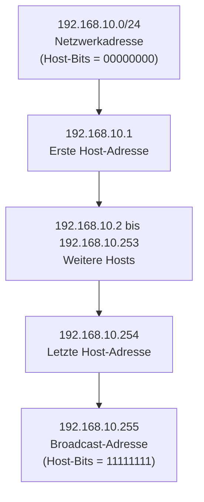
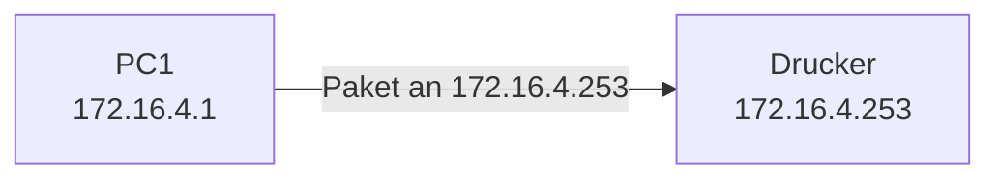
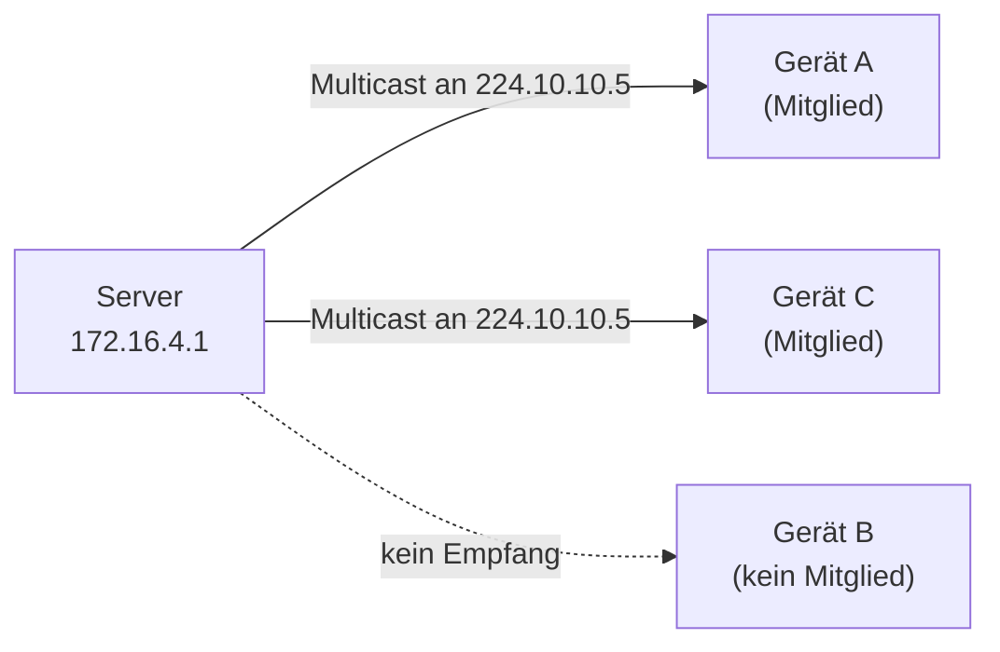
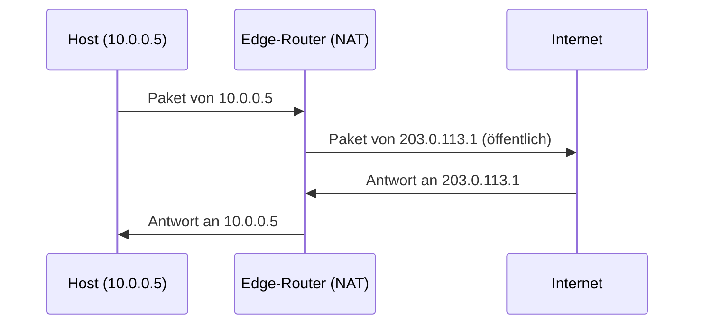
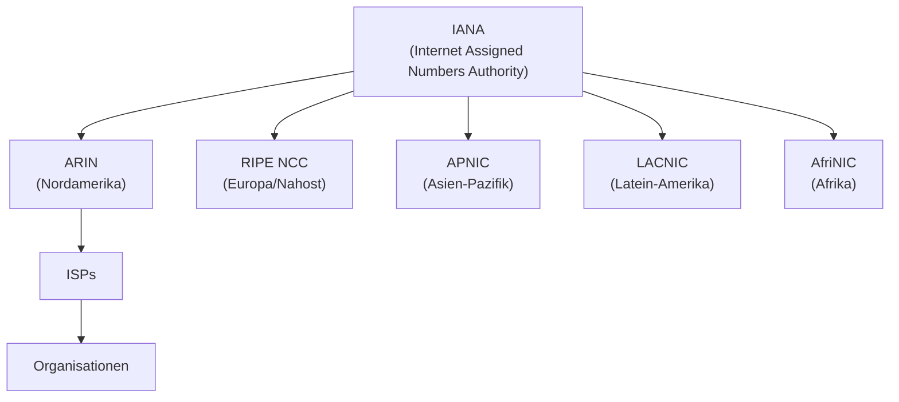
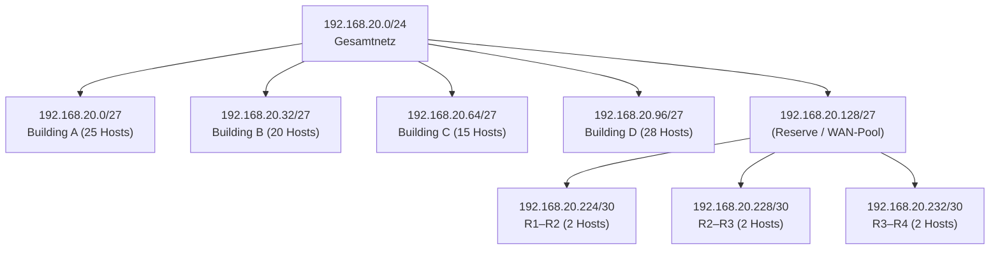
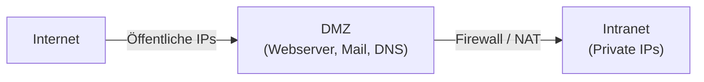
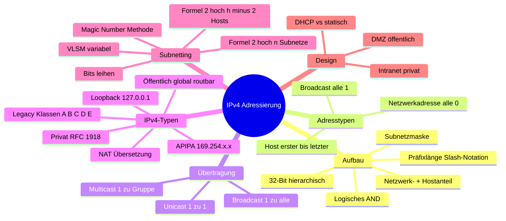

import Callout from '../../../../components/Callout.astro';

IPv4-Adressen sind das Fundament der Netzwerkkommunikation im Internet. Dieses Modul erklärt, wie IPv4-Adressen aufgebaut sind, wie man sie in Subnetze aufteilt und warum diese Aufteilung für effiziente Netzwerke unerlässlich ist.

---

## 1. Aufbau einer IPv4-Adresse

### Netzwerk- und Hostanteil

Eine IPv4-Adresse ist **32 Bits** lang und hierarchisch aufgebaut. Sie besteht aus zwei Teilen:

- **Netzwerkanteil**: Identifiziert das Netzwerk, zu dem ein Gerät gehört
- **Hostanteil**: Identifiziert das spezifische Gerät innerhalb dieses Netzwerks

```
Beispiel: 192.168.10.10 /24

Netzwerkanteil              | Hostanteil
192      .  168   .  10     |    10
11000000 10101000 00001010  | 00001010
```

Die **Subnetzmaske** legt fest, welche Bits zum Netzwerk- und welche zum Hostanteil gehören. Überall, wo die Subnetzmaske eine `1` hat, gehört das entsprechende Bit zum Netzwerkanteil – überall dort, wo eine `0` steht, zum Hostanteil.

### Die Subnetzmaske

Die Subnetzmaske wird **bitweise von links nach rechts** mit der IPv4-Adresse verglichen. Der eigentliche Prozess zur Bestimmung des Netzwerkanteils heisst **ANDing**.

```
IPv4-Adresse:  192  .  168  .  10  .  10
Subnetzmaske:  255  .  255  .  255 .   0
               11111111 11111111 11111111 00000000
                                         ↑
                               Host-Oktett = alles 0 → Netzwerkanteil
```

### Präfixlänge (Slash-Notation)

Statt die Subnetzmaske vollständig auszuschreiben, verwendet man die **Präfixlänge** (Slash-Notation). Sie gibt an, wie viele Bits der Subnetzmaske auf `1` gesetzt sind:

| Subnetzmaske     | Binär                                   | Präfixlänge |
|------------------|-----------------------------------------|-------------|
| 255.0.0.0        | 11111111.00000000.00000000.00000000     | /8          |
| 255.255.0.0      | 11111111.11111111.00000000.00000000     | /16         |
| 255.255.255.0    | 11111111.11111111.11111111.00000000     | /24         |
| 255.255.255.128  | 11111111.11111111.11111111.10000000     | /25         |
| 255.255.255.192  | 11111111.11111111.11111111.11000000     | /26         |
| 255.255.255.224  | 11111111.11111111.11111111.11100000     | /27         |
| 255.255.255.240  | 11111111.11111111.11111111.11110000     | /28         |
| 255.255.255.248  | 11111111.11111111.11111111.11111000     | /29         |
| 255.255.255.252  | 11111111.11111111.11111111.11111100     | /30         |

### Logisches AND – Netzwerkadresse ermitteln

Um die Netzwerkadresse aus einer Host-IP-Adresse zu berechnen, wird das **logische AND** (boolesche UND-Verknüpfung) angewendet. Die Regel ist einfach:

- `1 AND 1 = 1`
- `1 AND 0 = 0`
- `0 AND 1 = 0`
- `0 AND 0 = 0`

```
Host-IP:       192.168.10.10  →  11000000 10100000 00001010 00001010
Subnetzmaske:  255.255.255.0  →  11111111 11111111 11111111 00000000
                                 ──────────────────────────────────
Netzwerkadresse: 192.168.10.0 →  11000000 10100000 00001010 00000000
```

Warum? Weil überall, wo die Maske eine `0` hat, das Ergebnis automatisch `0` ist – unabhängig vom Host-Bit. So werden die Host-Bits „ausgeblendet", und die Netzwerkadresse bleibt übrig.

### Netzwerk-, Host- und Broadcast-Adressen

Innerhalb jedes Subnetzes gibt es drei spezielle Adressen:

| Adresstyp          | Host-Bits         | Beispiel (/24)    |
|--------------------|-------------------|-------------------|
| Netzwerkadresse    | alle 0            | 192.168.10.0      |
| Erste Host-Adresse | alle 0 + eine 1   | 192.168.10.1      |
| Letzte Host-Adresse| alle 1 + eine 0   | 192.168.10.254    |
| Broadcast-Adresse  | alle 1            | 192.168.10.255    |

> **Warum diese Einschränkung?** Die Netzwerkadresse identifiziert das Netz selbst (sie gehört keinem Gerät). Die Broadcast-Adresse wird verwendet, um alle Geräte im Netz gleichzeitig anzusprechen. Beide können also **nicht** an einzelne Hosts vergeben werden – daher: 2^n – 2 nutzbare Hostadressen.



---

## 2. IPv4-Übertragungsarten: Unicast, Broadcast, Multicast

IPv4-Pakete können auf drei verschiedene Arten übertragen werden, je nachdem, wie viele Empfänger angesprochen werden sollen:

### Unicast

**Unicast** = Ein Paket wird an **genau einen** Empfänger gesendet.

- Die häufigste Übertragungsart
- Beispiel: PC `172.16.4.1` sendet ein Paket an Drucker `172.16.4.253`
- Quelle und Ziel sind klar definiert



### Broadcast

**Broadcast** = Ein Paket wird an **alle Geräte** im Netzwerk gesendet.

- Zieladresse: `255.255.255.255` (Limited Broadcast) oder die Netzwerk-Broadcast-Adresse
- Switches leiten Broadcasts an **alle Ports** weiter (ausser den Eingangsport)
- **Router stoppen Broadcasts** – sie leiten sie nicht an andere Netzwerke weiter

> **Warum sind Broadcasts problematisch?** In grossen Netzwerken können übermässige Broadcasts die Bandbreite stark belasten. Jedes Gerät im Netzwerk muss jeden Broadcast verarbeiten, auch wenn das Paket nicht für es bestimmt ist.

### Multicast

**Multicast** = Ein Paket wird an eine **Gruppe** von Empfängern gesendet, die sich für diesen Traffic angemeldet haben.

- Zieladresse liegt im Bereich `224.0.0.0` bis `239.255.255.255`
- Nur Geräte, die der Multicast-Gruppe beigetreten sind, empfangen die Pakete
- Effizienter als Broadcast, da nicht alle Geräte das Paket verarbeiten müssen
- Typische Anwendung: Videostreaming, Routing-Protokolle (z. B. OSPF nutzt `224.0.0.5`)



---

## 3. IPv4-Adresstypen

### Öffentliche und private Adressen

IPv4-Adressen werden grundsätzlich in **öffentliche** (globale) und **private** Adressen unterteilt:

- **Öffentliche Adressen** sind weltweit eindeutig und im Internet routbar (werden von ISPs verwaltet)
- **Private Adressen** sind **nicht** im Internet routbar und können in beliebig vielen internen Netzen verwendet werden – sie sind also **nicht global eindeutig**

Die privaten Adressbereiche sind in **RFC 1918** definiert:

| Netzwerk          | Präfix | Bereich                           |
|-------------------|--------|-----------------------------------|
| 10.0.0.0          | /8     | 10.0.0.0 – 10.255.255.255         |
| 172.16.0.0        | /12    | 172.16.0.0 – 172.31.255.255       |
| 192.168.0.0       | /16    | 192.168.0.0 – 192.168.255.255     |

> **Warum private Adressen?** Der IPv4-Adressraum ist begrenzt (nur ~4,3 Milliarden Adressen). Private Adressen ermöglichen es Organisationen, intern beliebig viele Geräte zu adressieren, ohne öffentliche Adressen zu verbrauchen.

### Network Address Translation (NAT)

Da private Adressen nicht im Internet geroutet werden, benötigen Geräte mit privaten Adressen **NAT** (Network Address Translation), um auf das Internet zuzugreifen.

- NAT läuft typischerweise auf dem **Edge-Router** (dem Router, der das interne Netz mit dem Internet verbindet)
- NAT übersetzt die private interne Adresse in eine öffentliche globale Adresse (und zurück)



### Spezielle IPv4-Adressen

**Loopback-Adressen** (`127.0.0.0/8`, typisch `127.0.0.1`):
- Werden verwendet, um zu testen, ob der TCP/IP-Stack auf einem Gerät korrekt funktioniert
- Pakete an diese Adresse verlassen den Host nie

**Link-Local-Adressen (APIPA)** (`169.254.0.0/16`):
- Werden automatisch von Windows-Clients vergeben, wenn kein DHCP-Server erreichbar ist
- Auch bekannt als APIPA (Automatic Private IP Addressing)
- Nur innerhalb des lokalen Netzwerksegments kommunikationsfähig

### Legacy-Klassenadressen (Classful Addressing)

Früher (RFC 790, 1981) wurden IPv4-Adressen in feste Klassen eingeteilt – **Classful Addressing**:

| Klasse | Bereich                   | Netzwerke     | Hosts/Netz    |
|--------|---------------------------|---------------|---------------|
| A      | 0.0.0.0 – 127.0.0.0/8    | 128           | 16.777.214    |
| B      | 128.0.0.0 – 191.255.0.0/16| 16.384        | 65.534        |
| C      | 192.0.0.0 – 223.255.255.0/24| 2.097.152   | 254           |
| D      | 224.0.0.0 – 239.0.0.0     | (Multicast)   | –             |
| E      | 240.0.0.0 – 255.0.0.0     | (Reserviert)  | –             |

> **Problem:** Diese feste Einteilung führte zu enormer Adressverschwendung. Wer z. B. 300 Hosts brauchte, musste eine Klasse B mit 65.534 möglichen Hosts nehmen. Deshalb wurde Classful Addressing durch **Classless Addressing (CIDR)** ersetzt, das beliebige Präfixlängen erlaubt.

### Adressvergabe durch IANA und RIRs

Die globale Verwaltung der IPv4-Adressen erfolgt hierarchisch:



---

## 4. Netzwerksegmentierung (Subnetting)

### Warum Segmentierung?

In einem grossen, flachen Netzwerk (einem einzigen Broadcast-Domain) entstehen Probleme:

- **Übermässige Broadcasts**: Jedes Gerät muss jeden Broadcast verarbeiten → hohe CPU-Last, verschwendete Bandbreite
- **Sicherheit**: Kein Isolation zwischen Abteilungen
- **Performance**: Schwierige Fehlersuche, hohe Kollisionswahrscheinlichkeit

Die Lösung ist **Subnetting**: Das Aufteilen eines grossen Netzes in kleinere **Broadcast-Domains**.

> **Wichtig:** Nur **Router** stoppen Broadcasts. Switches leiten sie innerhalb eines Segments weiter. Jede Router-Schnittstelle grenzt eine eigene Broadcast-Domain ab.

### Gründe für Segmentierung

Subnetze werden typischerweise nach folgenden Kriterien gebildet:

- **Standort** (z. B. Stockwerk, Gebäude, Stadt)
- **Funktion/Abteilung** (z. B. HR, Buchhaltung, IT)
- **Gerätetyp** (z. B. alle Drucker, alle Server, alle Clients)

### Vorteile der Segmentierung

- Reduktion des Broadcast-Traffics
- Verbesserung der Netzwerk-Performance
- Implementierung von Sicherheitsrichtlinien zwischen Segmenten
- Weniger betroffene Geräte bei Broadcast-Stürmen

---

## 5. IPv4-Subnetting berechnen

### Grundformeln

Das Subnetting basiert auf zwei zentralen Formeln:

**Anzahl der Subnetze:**
$$2^n$$
wobei `n` = Anzahl der geliehenen Host-Bits (Bits, die vom Host-Anteil in den Netzwerkanteil übertragen werden)

**Anzahl der nutzbaren Hosts pro Subnetz:**
$$2^h - 2$$
wobei `h` = Anzahl der verbleibenden Host-Bits (`-2` für Netzwerk- und Broadcast-Adresse)

### Subnetting an Oktett-Grenzen

Am einfachsten ist das Subnetting an den Oktett-Grenzen `/8`, `/16` und `/24`:

| Präfix | Subnetzmaske  | Nutzbare Hosts |
|--------|---------------|----------------|
| /8     | 255.0.0.0     | 16.777.214     |
| /16    | 255.255.0.0   | 65.534         |
| /24    | 255.255.255.0 | 254            |

### Subnetting innerhalb einer Oktett-Grenze (/24-Netz)

Ein `/24`-Netz lässt sich durch Ausleihen von Bits aus dem letzten Oktett weiter unterteilen:

| Präfix | Subnetzmaske      | Subnetze | Hosts/Subnetz |
|--------|-------------------|----------|---------------|
| /25    | 255.255.255.128   | 2        | 126           |
| /26    | 255.255.255.192   | 4        | 62            |
| /27    | 255.255.255.224   | 8        | 30            |
| /28    | 255.255.255.240   | 16       | 14            |
| /29    | 255.255.255.248   | 32       | 6             |
| /30    | 255.255.255.252   | 64       | 2             |

### Die „Magic Number"-Methode

Eine praktische Schnellmethode: Die **Magic Number** ist der Stellenwert des letzten gesetzten Bits in der Subnetzmaske. Sie gibt den **Abstand zwischen den Subnetzen** an.

```
/25 → 11111111.11111111.11111111.10000000 → Magic Number = 128
/26 → 11111111.11111111.11111111.11000000 → Magic Number = 64
/27 → 11111111.11111111.11111111.11100000 → Magic Number = 32
```

**Beispiel: /26 – 4 Subnetze aus 192.168.1.0/24**

- Maske: `11111111.11111111.11111111.11000000`
- Magic Number = **64**
- Subnetze (immer 64 addieren):

| Subnetz            | Erste Host    | Letzte Host    | Broadcast      |
|--------------------|---------------|----------------|----------------|
| 192.168.1.0/26     | 192.168.1.1   | 192.168.1.62   | 192.168.1.63   |
| 192.168.1.64/26    | 192.168.1.65  | 192.168.1.126  | 192.168.1.127  |
| 192.168.1.128/26   | 192.168.1.129 | 192.168.1.190  | 192.168.1.191  |
| 192.168.1.192/26   | 192.168.1.193 | 192.168.1.254  | 192.168.1.255  |

**Beispiel: /27 – 8 Subnetze aus 192.168.1.0/24**

- Magic Number = **32**
- Subnetze: `192.168.1.0`, `192.168.1.32`, `192.168.1.64`, `192.168.1.96`, `192.168.1.128`, `192.168.1.160`, `192.168.1.192`, `192.168.1.224`

---

## 6. Subnetting von /16- und /8-Netzen

### /16-Netz subnetten

Ein `/16`-Netz hat 16 Host-Bits. Man kann daraus bis zu `/30`-Subnetze bilden. Beispiel für das Netz `172.16.0.0/16`:

| Präfix | Subnetze | Hosts/Subnetz |
|--------|----------|---------------|
| /17    | 2        | 32.766        |
| /18    | 4        | 16.382        |
| /19    | 8        | 8.190         |
| /20    | 16       | 4.094         |
| /21    | 32       | 2.046         |
| /22    | 64       | 1.022         |
| /23    | 128      | 510           |
| /24    | 256      | 254           |

**Praxisbeispiel:** Eine grosse Organisation braucht mindestens 100 Subnetze aus `172.16.0.0/16`.
- `2^7 = 128 ≥ 100` → 7 Bits leihen → Präfix wird `/16 + 7 = /23`
- Resultat: 128 Subnetze mit je 510 nutzbaren Hosts

### /8-Netz subnetten

Ein `/8`-Netz hat 24 Host-Bits. Ein ISP braucht 1000 Subnetze aus `10.0.0.0/8`:
- `2^10 = 1024 ≥ 1000` → 10 Bits leihen → Präfix `/18`
- Resultat: 1024 Subnetze

---

## 7. VLSM – Variable Length Subnet Mask

### Das Problem mit klassischem Subnetting

Beim klassischen Subnetting hat jedes Subnetz **dieselbe Grösse**, was zu Adressverschwendung führt. Typisches Beispiel:

- 4 LANs benötigen je ~25 Hosts → /27 (30 Hosts pro Subnetz, 4 Subnetze) passt
- 3 WAN-Links zwischen Routern benötigen nur je **2 Hosts** (eine IP pro Router-Interface)
- Mit /27 werden für jeden WAN-Link 28 Adressen **verschwendet** (30 – 2 = 28 × 3 = **84 verschwendete Adressen**)

### VLSM als Lösung

**VLSM (Variable Length Subnet Mask)** erlaubt es, ein Subnetz weiter zu unterteilen – also ein **Subnetz eines Subnetzes** zu erstellen. Verschiedene Teile des Netzes können unterschiedliche Masken haben.

> **Prinzip:** Beginne immer mit dem **grössten** Subnetz-Bedarf und arbeite dich hinunter zum kleinsten.

**Vorgehensweise am Beispiel (192.168.20.0/24):**

Anforderungen:
- Building A: 25 Hosts
- Building B: 20 Hosts
- Building C: 15 Hosts
- Building D: 28 Hosts
- R1–R2, R2–R3, R3–R4: je 2 Hosts (WAN-Links)

**Schritt 1:** Grösstes Subnetz zuerst (Building D: 28 Hosts → /27, 30 Hosts)

| Subnetz          | Verwendung      | Hosts |
|------------------|-----------------|-------|
| 192.168.20.0/27  | Building A      | 25    |
| 192.168.20.32/27 | Building B      | 20    |
| 192.168.20.64/27 | Building C      | 15    |
| 192.168.20.96/27 | Building D      | 28    |

**Schritt 2:** WAN-Links aus dem nächsten freien Subnetz (192.168.20.128/27) weiter aufteilen mit /30 (2 Hosts):

| Subnetz             | Verwendung | Hosts |
|---------------------|------------|-------|
| 192.168.20.224/30   | R1–R2 WAN  | 2     |
| 192.168.20.228/30   | R2–R3 WAN  | 2     |
| 192.168.20.232/30   | R3–R4 WAN  | 2     |



### Classless vs. Classful Subnet Masks

VLSM setzt **klassenloses Adressieren (CIDR)** voraus:

| Typ       | Beispiel              | Präfix |
|-----------|-----------------------|--------|
| Classful  | 255.255.255.0 (Kl. C) | /24    |
| Classful  | 255.255.0.0 (Kl. B)   | /16    |
| Classless | 255.255.255.128       | /25    |
| Classless | 255.255.192.0         | /18    |
| Classless | 255.240.0.0           | /12    |

---

## 8. Strukturiertes Netzwerkdesign

### Planung eines IPv4-Adressierungsschemas

Gute Netzwerkplanung ist entscheidend für Skalierbarkeit. Man muss vorab klären:

- Wie viele Subnetze werden benötigt?
- Wie viele Hosts braucht jedes Subnetz?
- Welche Geräte gehören zu welchem Subnetz?
- Was soll mit privaten, was mit öffentlichen Adressen adressiert werden?

### Intranet, DMZ und Internet

Unternehmensnetze haben typischerweise drei Zonen:



- **Intranet**: Interne Netzwerke mit privaten IPv4-Adressen (z. B. `10.0.0.0/8`)
- **DMZ (Demilitarisierte Zone)**: Internet-seitige Server mit **öffentlichen** IPv4-Adressen
- **Internet-Verbindung**: Über NAT vom Intranet erreichbar

### Adressvergabe nach Gerätetyp

| Gerätetyp                   | Zuweisung             |
|-----------------------------|-----------------------|
| Endgeräte (Clients)         | DHCP (dynamisch)      |
| Server & Peripherie         | Statisch (vorhersehbar)|
| Öffentlich erreichbare Server| Öffentliche IP via NAT|
| Netzwerkgeräte (Router, Switch)| Statisch (Management)|
| Gateways (Router, Firewall) | Statisch              |

---

## Zusammenfassung



### Wichtigste Formeln auf einen Blick

| Formel               | Bedeutung                                     |
|----------------------|-----------------------------------------------|
| `2^n`                | Anzahl Subnetze (n = geliehene Bits)          |
| `2^h – 2`            | Nutzbare Hosts (h = verbleibende Host-Bits)   |
| Magic Number         | Stellenwert des letzten 1-Bits in der Maske   |
| Subnetz-Abstand      | = Magic Number (addieren für nächstes Subnetz)|

### Wichtige Begriffe

- **Präfixlänge**: Anzahl der Netzwerk-Bits in Slash-Notation (z. B. /24)
- **ANDing**: Bitweise UND-Operation zur Ermittlung der Netzwerkadresse
- **Broadcast Domain**: Bereich, in dem Broadcasts weitergeleitet werden
- **Subnetting**: Aufteilen eines Netzes in kleinere Subnetze
- **VLSM**: Subnetting mit unterschiedlich grossen Subnetzen
- **NAT**: Übersetzung privater in öffentliche Adressen
- **APIPA**: Automatische Selbstzuweisung einer Link-Local-Adresse
- **IANA / RIR**: Globale und regionale Verwaltung von IP-Adressen


<Callout type="danger"> 
## Summary Module 11: IPv4 Addressing
</Callout>

**IPv4 Address Structure** — 32-bit, divided into network and host portions. Subnet mask used to determine each portion.

**The Subnet Mask** — Compared to the IPv4 address bit by bit, left to right. The process of identifying network and host portions is called AND-ing.

**Prefix Length** — Number of bits set to 1 in the subnet mask, written in slash notation (e.g. `/24`).

**Determining the Network** — Logical AND: `1 AND 1 = 1`, `0 AND 1 = 0`, `1 AND 0 = 0`, `0 AND 0 = 0`. IPv4 address AND Subnet Mask = Network address.

**Network, Host and Broadcast Addresses** — Every network has 3 types of IP addresses.

| Type | Host Portion | Example (x.x.x.?) |
|------|-------------|-------------------|
| Network Address | All 0s | `.00000000` |
| First Host Address | All 0s, ends with 1 | `.00000001` |
| Last Host Address | All 1s, ends with 0 | `.11111110` |
| Broadcast Address | All 1s | `.11111111` |

### IPv4 Unicast, Broadcast, and Multicast

- **Unicast** — One to one. e.g. PC at `172.16.4.1` to printer at `172.16.4.253`.
- **Broadcast** — One to all on network. e.g. PC at `172.16.4.1` sends broadcast to all IPv4 hosts.
- **Multicast** — One to many. e.g. PC at `172.16.4.1` sends to multicast group address `224.10.10.5`.

### Types of IPv4 Addresses

**Public and Private IPv4 Addresses** — Public addresses are globally routed (RFC 1918). Private addresses are not unique, used internally, and not globally routable.

| Range | Block |
|-------|-------|
| `10.0.0.0` – `10.255.255.255` | `10.0.0.0/8` |
| `172.16.0.0` – `172.31.255.255` | `172.16.0.0/12` |
| `192.168.0.0` – `192.168.255.255` | `192.168.0.0/16` |

**Routing to the Internet** — NAT translates private IPv4 addresses to public IPv4 addresses, typically enabled on the edge router connecting to the internet.

**Special Use IPv4 Addresses**
- **Loopback** — `127.0.0.0/8` (`127.0.0.1` to `127.255.255.254`), commonly `127.0.0.1`. Used on host to test if TCP/IP is operational.
- **Link-Local (APIPA)** — `169.254.0.0/16` (`169.254.0.1` to `169.254.255.254`). Used by Windows DHCP clients to self-configure when no DHCP server is available.

**Legacy Classful Addressing** — RFC 790 (1981), replaced with classless addressing.

| Class | Range |
|-------|-------|
| A | `0.0.0.0/8` – `127.0.0.0/8` |
| B | `128.0.0.0/16` – `191.255.0.0/16` |
| C | `192.0.0.0/24` – `223.255.255.0/24` |
| D | `224.0.0.0` – `239.0.0.0` |
| E | `240.0.0.0` – `255.0.0.0` |

**Assignment of IP Addresses** — IANA manages and allocates blocks to five Regional Internet Registries (RIRs). RIRs allocate to ISPs, who provide blocks to smaller ISPs and organizations.

### Network Segmentation

**Broadcast Domains and Segmentation** — Protocols like ARP use broadcasts to locate devices; hosts send DHCP discover broadcasts. Switches propagate broadcasts out all interfaces (except receiving). Routers stop broadcasts → each router interface connects to a broadcast domain.

**Problems with Large Broadcast Domains** — Excessive broadcasts negatively affect the network. Solution: create smaller broadcast domains via subnetting. e.g. `172.16.0.0/16` split into `172.16.0.0/24` and `172.16.1.0/24`.

**Reasons for Segmenting Networks** — Reduces traffic and improves performance, implement security policies between subnets, segment by location, group, function, or device type.

### Subnet an IPv4 Network

Most easily subnetted at octet boundaries `/8`, `/16`, `/24`. Longer prefix lengths decrease number of hosts per subnet.

- **Number of Subnets** — `2ⁿ` (n = bits borrowed)
- **Number of Hosts** — `2ⁿ − 2` (n = remaining bits in host field)

**VLSM** — Traditional subnetting can be inefficient; VLSM was invented to solve this. Always satisfy the biggest subnet requirement first.

### Structured Design

**IPv4 Network Address Planning** — Key questions:
- How many subnets are needed (and hosts per subnet)?
- How many hosts does a particular subnet require?
- What devices are part of the subnet?
- Which parts use private vs. public addresses?
- What are the DHCP address pools and Layer 2 VLAN pools?

**Device Address Assignment**

| Device Type | Assignment Method |
|-------------|------------------|
| End user clients | DHCP (IPv4); DHCPv6 or SLAAC (IPv6) |
| Servers and peripherals | Predictable static IP address |
| Internet-accessible servers | Public IPv4 address, most often via NAT |
| Intermediary devices | Static address for management, monitoring, security |
| Gateways (routers, firewalls) | Static address as gateway for hosts in network |