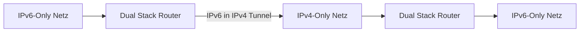
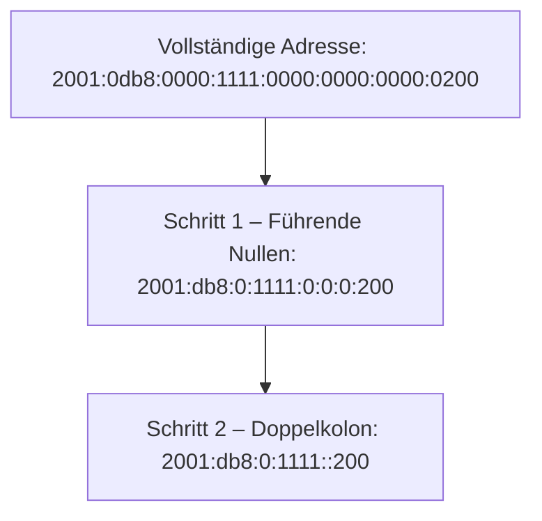
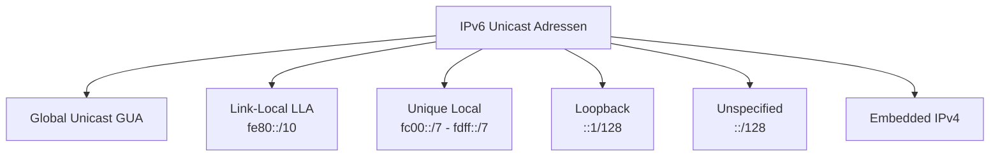
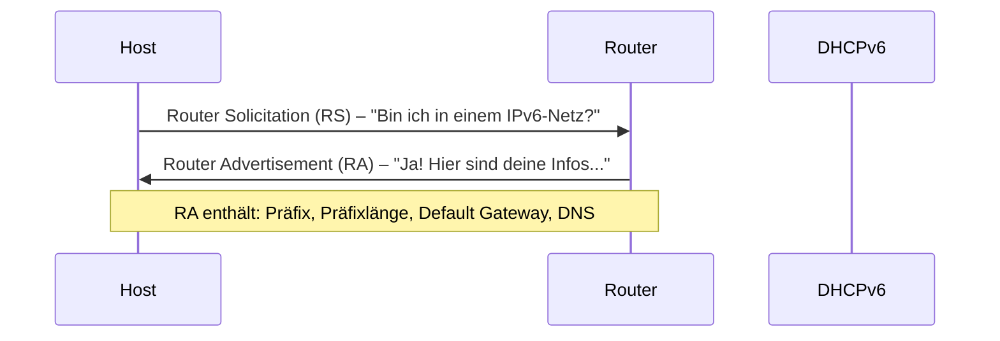
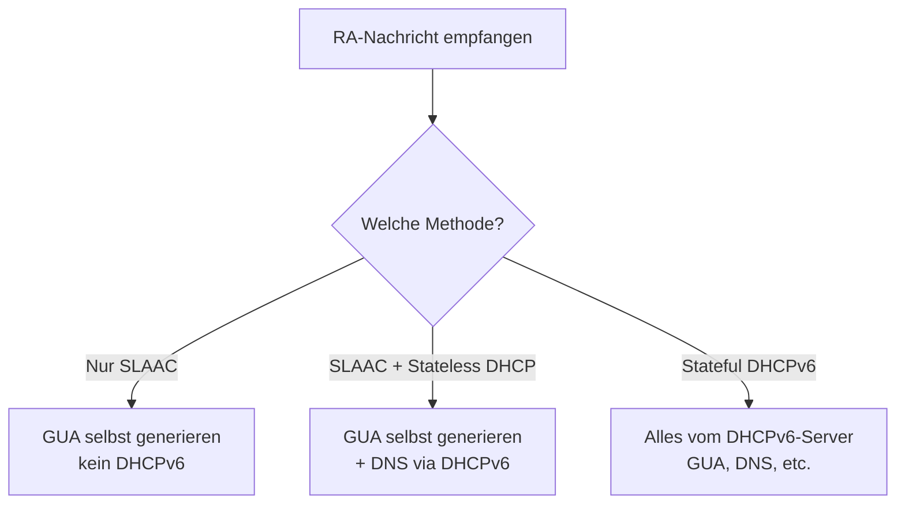
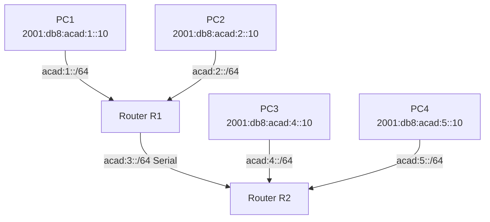

import Callout from '../../../../components/Callout.astro';


## 1. Warum IPv6? – Die Probleme von IPv4

IPv4 verwendet 32-Bit-Adressen, was theoretisch rund **4,3 Milliarden** eindeutige Adressen ermöglicht. Klingt viel – ist es aber nicht mehr. Durch die explosionsartige Verbreitung von Smartphones, IoT-Geräten (Internet of Things) und der weltweiten Vernetzung sind diese Adressen praktisch aufgebraucht. Die regionalen Vergabestellen (RIRs) haben ihre letzten IPv4-Blöcke bereits zwischen 2011 und 2015 verteilt.

Zusätzlich hat **NAT (Network Address Translation)** zwar die Lebensdauer von IPv4 verlängert, aber auf Kosten der Transparenz und Komplexität: Geräte hinter NAT sind nicht direkt erreichbar, was für viele moderne Anwendungen (z. B. Peer-to-Peer, VoIP) problematisch ist.

**IPv6** ist der Nachfolger von IPv4 und löst diese Probleme grundlegend:
- **128-Bit-Adressen** → ca. 3,4 × 10³⁸ mögliche Adressen (praktisch unerschöpflich)
- Kein NAT mehr notwendig
- Verbesserte Sicherheit, effizienteres Routing, eingebaute Autokonfiguration

---

## 2. Koexistenz von IPv4 und IPv6

Der Übergang zu IPv6 geschieht nicht über Nacht – beide Protokolle werden noch Jahre parallel betrieben. Die IETF hat dafür drei Migrationstechniken definiert:

### Dual Stack
Jedes Gerät betreibt **gleichzeitig** IPv4 und IPv6. Es kann mit beiden Protokollwelten kommunizieren. Dies ist die bevorzugte Methode, da sie keine Umwandlung erfordert.

```
[PC IPv4+IPv6] ←→ [Router Dual Stack] ←→ [Server IPv4+IPv6]
```

### Tunneling
IPv6-Pakete werden in IPv4-Pakete **eingepackt (encapsulated)** und über ein IPv4-Netz transportiert. Am Zielort wird das IPv6-Paket wieder ausgepackt. Dies ermöglicht IPv6-Kommunikation über bestehende IPv4-Infrastruktur.



### Translation (NAT64)
**NAT64** erlaubt IPv6-Geräten, mit reinen IPv4-Geräten zu kommunizieren, indem Adressen übersetzt werden – ähnlich wie NAT bei IPv4. Dies ist jedoch die unerwünschteste Lösung und sollte nur eingesetzt werden, wenn es unbedingt nötig ist.

> **Merke:** Das Ziel ist immer native IPv6-Kommunikation von Quelle zu Ziel. Tunneling und Translation sind nur Übergangslösungen.

---

## 3. IPv6-Adressdarstellung

### Aufbau

IPv6-Adressen sind **128 Bit** lang und werden als **8 Gruppen von je 4 Hexadezimalziffern** geschrieben, getrennt durch Doppelpunkte:

```
2001:0db8:0000:1111:0000:0000:0000:0200
```

Jede dieser Gruppen nennt man **Hextet** (inoffiziell, 16 Bit = 4 Hexziffern).

IPv6-Adressen sind **nicht case-sensitive** – Groß- und Kleinschreibung ist gleichwertig.

### Regel 1: Führende Nullen weglassen

Führende Nullen innerhalb eines Hextets dürfen weggelassen werden:

| Original | Verkürzt |
|----------|----------|
| `01ab`   | `1ab`    |
| `09f0`   | `9f0`    |
| `0a00`   | `a00`    |
| `00ab`   | `ab`     |

> **Achtung:** Nur führende Nullen dürfen weggelassen werden, **keine** abschließenden! `0100` → `100`, aber **nicht** `1`.

### Regel 2: Doppelter Doppelpunkt (::)

Ein **doppelter Doppelpunkt** `::` kann eine zusammenhängende Folge von Hextets ersetzen, die **alle null** sind:

```
2001:0db8:0000:1111:0000:0000:0000:0200
→ 2001:db8:0:1111::200
```

> **Wichtig:** `::` darf in einer Adresse **nur einmal** vorkommen, sonst wäre die Adresse mehrdeutig (man könnte nicht wissen, wie viele Nullgruppen ersetzt wurden).



---

## 4. IPv6-Adresstypen

IPv6 kennt drei grundlegende Adresstypen:

| Typ | Beschreibung |
|-----|-------------|
| **Unicast** | Identifiziert genau eine Schnittstelle |
| **Multicast** | Sendet an eine Gruppe von Empfängern |
| **Anycast** | Wird mehreren Geräten zugewiesen; das Paket geht an das nächstgelegene |

> **Kein Broadcast bei IPv6!** IPv6 hat keine Broadcast-Adresse. Stattdessen gibt es eine *All-Nodes Multicast*-Adresse (`ff02::1`), die ähnliche Funktionen übernimmt.

### IPv6-Präfixlänge

Wie bei IPv4 (Subnetzmaske) gibt die **Präfixlänge** den Netzanteil der Adresse an, in Slash-Notation:

```
2001:db8:acad:1::1/64
```

- Die Präfixlänge kann von `/0` bis `/128` gehen.
- Für LANs und die meisten Netze wird **`/64`** empfohlen, da SLAAC (automatische Adresskonfiguration) 64 Bit für die Interface-ID benötigt.

### Unicast-Adresstypen im Detail

Im Gegensatz zu IPv4-Geräten (meist eine Adresse) haben IPv6-Geräte typischerweise **mehrere** Unicast-Adressen:



#### Global Unicast Address (GUA)
- Weltweit eindeutig und im Internet routbar
- Vergleichbar mit öffentlichen IPv4-Adressen
- Beginnen aktuell mit **2 oder 3** (Bereich `2000::/3`)

**Aufbau einer GUA:**

```
| 48 Bit               | 16 Bit    | 64 Bit       |
| Global Routing Prefix | Subnet ID | Interface ID |
```

- **Global Routing Prefix:** Vom ISP zugewiesener Netzanteil
- **Subnet ID:** Vom Unternehmen für interne Unterteilung verwendet
- **Interface ID:** Entspricht dem Hostanteil bei IPv4 (64 Bit)

#### Link-Local Address (LLA)
- Nur auf dem **lokalen Link** gültig, nicht routbar
- Jede IPv6-Schnittstelle **muss** eine LLA haben
- Bereich: `fe80::/10`
- Wird automatisch erzeugt, wenn keine manuell konfiguriert ist
- Verwendung: Router senden Routing-Updates über LLAs; Hosts verwenden die LLA des Routers als Default Gateway

#### Unique Local Address (ULA)
- Bereich: `fc00::/7` bis `fdff::/7`
- Ähnlich den privaten IPv4-Adressen (RFC 1918), aber mit wichtigen Unterschieden:
  - **Nicht global routbar**
  - Für lokale Kommunikation innerhalb einer Organisation
  - **Kein Sicherheitsmechanismus** – ULAs wurden nie als Schutz vor Angreifern konzipiert

---

## 5. Statische Konfiguration von GUA und LLA

### GUA auf einem Cisco Router konfigurieren

```bash
R1(config)# interface gigabitethernet 0/0/0
R1(config-if)# ipv6 address 2001:db8:acad:1::1/64
R1(config-if)# no shutdown
R1(config-if)# exit
```

Der Befehl lautet `ipv6 address` statt `ip address` – ansonsten ist die Syntax identisch zu IPv4.

### LLA manuell konfigurieren

Manuell konfigurierte LLAs sind leichter zu merken und erleichtern das Troubleshooting:

```bash
R1(config)# interface gigabitethernet 0/0/0
R1(config-if)# ipv6 address fe80::1:1 link-local
R1(config-if)# no shutdown
R1(config-if)# exit
```

> **Praxis-Tipp:** Üblicherweise vergibt man pro Router-Interface eine eigene LLA (z. B. `fe80::1` auf G0/0/0, `fe80::2` auf G0/0/1), damit man beim Troubleshooting sofort erkennt, welches Interface gemeint ist.

### GUA auf einem Windows-Host konfigurieren

Unter Windows geschieht die IPv6-Konfiguration analog zu IPv4 über die Netzwerkeigenschaften. Als Default Gateway kann die GUA oder LLA des Routers verwendet werden – **Best Practice ist die LLA**.

---

## 6. Dynamische Adresskonfiguration für GUAs

Geräte können ihre IPv6-GUA automatisch über **ICMPv6-Nachrichten** beziehen:

### RS und RA Nachrichten



- **Router Solicitation (RS):** Hosts senden diese Nachricht, um Router zu finden
- **Router Advertisement (RA):** Router senden diese Nachrichten (alle 200 Sek. oder auf RS hin), um Konfigurationsinformationen zu verteilen

### Die drei Methoden

#### Methode 1: SLAAC (Stateless Address Autoconfiguration)
- Gerät konfiguriert sich **vollständig selbst** ohne DHCPv6
- Präfix kommt aus der RA-Nachricht
- Interface-ID wird per **EUI-64** oder **Zufallsgenerator** erstellt
- Kein zentraler Server notwendig

#### Methode 2: SLAAC + Stateless DHCPv6
- GUA wird per SLAAC selbst erstellt
- Zusätzliche Infos (DNS-Server, Domain-Name) kommen von einem **stateless DHCPv6-Server**
- Der Server speichert keine Zuweisungen (stateless)

#### Methode 3: Stateful DHCPv6
- Wie DHCP bei IPv4: Ein Server weist die **gesamte** Konfiguration zu (GUA, Präfixlänge, DNS, ...)
- Der Server speichert alle Zuweisungen (stateful)
- Default Gateway kommt trotzdem aus der RA (LLA des Routers)



### EUI-64 Prozess

Der **Extended Unique Identifier (EUI-64)** erzeugt eine 64-Bit Interface-ID aus der 48-Bit MAC-Adresse:

1. MAC-Adresse in zwei 24-Bit-Hälften teilen
2. `fffe` (16 Bit) in die Mitte einfügen → 64 Bit
3. Das **7. Bit** (Universal/Local-Bit) der MAC-Adresse **invertieren**

**Beispiel:**
```
MAC-Adresse:         fc:99:47:75:ce:e0
EUI-64 Interface ID: fe:99:47:ff:fe:75:ce:e0
                           ↑↑↑↑
                           fffe eingefügt
fc = 1111'1100 → fe = 1111'1110  (7. Bit invertiert: 0→1)
```

> **Warum das 7. Bit?** Dieses Bit signalisiert, ob die Adresse global eindeutig (herstellervergeben) ist. Durch Invertierung zeigt EUI-64 an, dass die Adresse aus einer MAC-Adresse abgeleitet wurde.

### Zufällig generierte Interface-IDs

Ab Windows Vista verwendet Windows standardmäßig **zufällig generierte** Interface-IDs statt EUI-64 – aus Datenschutzgründen (EUI-64 würde die MAC-Adresse des Geräts preisgeben).

```
IPv6 Address: 2001:db8:acad:1:50a5:8a35:a5bb:66e1
Link-local:   fe80::50a5:8a35:a5bb:66e1
```

### Duplicate Address Detection (DAD)

Bevor eine IPv6-Adresse genutzt wird, prüft das Gerät per **DAD**, ob die Adresse bereits vergeben ist:

- Das Gerät sendet eine **ICMPv6 Neighbor Solicitation** an die eigene Adresse
- Kommt keine Antwort → Adresse ist eindeutig und darf verwendet werden
- Kommt eine Antwort → Adresskonflikt!

---

## 7. Dynamische Konfiguration von LLAs

Alle IPv6-Schnittstellen **müssen** eine LLA haben. Diese kann:
- **Manuell** konfiguriert werden (empfohlen für Router, leichter erkennbar)
- **Automatisch** generiert werden (per EUI-64 oder Zufall), mit dem Präfix `fe80::/10`

Cisco IOS-Router erzeugen die LLA **automatisch per EUI-64**, sobald eine GUA auf der Schnittstelle konfiguriert wird.

```bash
R1# show ipv6 interface brief
GigabitEthernet0/0/0 [up/up]
  FE80::7279:B3FF:FE92:3640     ← automatisch generierte LLA (EUI-64)
  2001:DB8:ACAD:1::1            ← manuell konfigurierte GUA
```

---

## 8. IPv6 Multicast-Adressen

Multicast-Adressen beginnen immer mit **`ff00::/8`**.

> **Wichtig:** Multicast-Adressen können nur als **Zieladresse** verwendet werden, nie als Quelladresse.

### Well-Known Multicast-Adressen

| Adresse   | Gruppe | Beschreibung |
|-----------|--------|-------------|
| `ff02::1` | All-Nodes | Alle IPv6-fähigen Geräte im Segment empfangen diese Pakete |
| `ff02::2` | All-Routers | Alle IPv6-Router; ein Router tritt dieser Gruppe bei, wenn `ipv6 unicast-routing` aktiviert ist |

### Solicited-Node Multicast

- Wird aus den letzten 24 Bit der Unicast-Adresse abgeleitet
- Präfix: `ff02::1:ff00:0/104`
- **Vorteil:** Wird auf eine spezielle Ethernet-Multicast-Adresse gemappt → die Netzwerkkarte (NIC) kann das Paket schon auf Layer-2-Ebene filtern, ohne den IPv6-Stack zu belasten

**Verwendung:** Duplicate Address Detection (DAD) und Neighbor Discovery (ND – Ersatz für ARP bei IPv6)

---

## 9. Subnetting im IPv6-Netz

IPv6 wurde von Grund auf mit Subnetting im Hinterkopf entworfen. Das macht die Unterteilung viel einfacher als bei IPv4.

### Die Subnet-ID

In einer typischen GUA mit /48-Präfix steht ein **16-Bit Subnet-ID-Feld** zur Verfügung:

```
| 48 Bit               | 16 Bit    | 64 Bit       |
| Global Routing Prefix | Subnet ID | Interface ID |
```

Mit 16 Bit lassen sich **2¹⁶ = 65.536 Subnetze** mit je `/64`-Präfix erstellen – jedes mit 2⁶⁴ möglichen Hostadressen!

### Subnetting-Beispiel

Gegeben: `2001:db8:acad::/48`

Die Subnetz-Nummerierung erfolgt einfach durch Hochzählen der Subnet-ID in Hexadezimal:

```
Subnetz 0:  2001:db8:acad:0000::/64
Subnetz 1:  2001:db8:acad:0001::/64
Subnetz 2:  2001:db8:acad:0002::/64
...
Subnetz F:  2001:db8:acad:000f::/64
...
Letztes:    2001:db8:acad:ffff::/64
```

> **Vergleich zu IPv4:** Bei IPv4 muss man mühsam Bits borgen und Subnetzmasken berechnen. Bei IPv6 zählt man einfach das Subnet-ID-Hextet hoch – keine binären Berechnungen nötig!

### Praxisbeispiel: 5 Subnetze für eine Topologie



Router-Konfiguration:
```bash
R1(config)# interface gigabitethernet 0/0/0
R1(config-if)# ipv6 address 2001:db8:acad:1::1/64
R1(config-if)# no shutdown

R1(config)# interface gigabitethernet 0/0/1
R1(config-if)# ipv6 address 2001:db8:acad:2::1/64
R1(config-if)# no shutdown

R1(config)# interface serial 0/1/0
R1(config-if)# ipv6 address 2001:db8:acad:3::1/64
R1(config-if)# no shutdown
```

---

## 10. Zusammenfassung

| Thema | Kernaussage |
|-------|------------|
| Warum IPv6? | IPv4-Adressen erschöpft; IPv6 bietet 128-Bit-Adressraum |
| Darstellung | 8 Hextets à 4 Hex-Ziffern; Kurzformen: führende Nullen weglassen, `::` für Nullblöcke |
| Adresstypen | GUA (global), LLA (link-local), Unique Local; kein Broadcast |
| Präfixlänge | /64 empfohlen für LANs |
| Statische Konfig | `ipv6 address adresse/präfix` auf Interface |
| Dynamisch | SLAAC, SLAAC+DHCPv6, Stateful DHCPv6 – via ICMPv6 RA/RS |
| Interface-ID | EUI-64 (aus MAC) oder zufällig generiert |
| DAD | Prüft Adress-Eindeutigkeit per Neighbor Solicitation |
| Multicast | `ff00::/8`; All-Nodes `ff02::1`, All-Routers `ff02::2` |
| Subnetting | 16-Bit Subnet-ID erlaubt 65.536 /64-Subnetze pro /48-Präfix |

---

### Neue Begriffe und Befehle

| Begriff/Befehl | Bedeutung |
|----------------|-----------|
| `Hextet` | Inoffizielle Bezeichnung für eine 16-Bit-Gruppe einer IPv6-Adresse |
| `LLA` | Link-Local Address – nur auf dem lokalen Segment gültig |
| `GUA` | Global Unicast Address – weltweit eindeutig und routbar |
| `ipv6 address` | Cisco IOS-Befehl zur Konfiguration einer IPv6-Adresse |
| `show ipv6 interface brief` | Zeigt IPv6-Adressen aller Interfaces |
| `SLAAC` | Stateless Address Autoconfiguration |
| `RA / RS` | Router Advertisement / Router Solicitation (ICMPv6) |
| `EUI-64` | Verfahren zur Ableitung der Interface-ID aus der MAC-Adresse |
| `Solicited-Node Multicast` | Spezieller Multicast für Neighbor Discovery und DAD |
| `DAD` | Duplicate Address Detection |


<Callout type="danger"> 
## Summary Module 12: IPv6 Addressing
</Callout>

**IPv4 Issues** — Running out of addresses. IPv6 has a much larger 128-bit address space.

**IPv4 and IPv6 Coexistence**
- **Dual Stack** — Devices run both IPv4 and IPv6 protocol stacks simultaneously.
- **Tunneling** — IPv6 packet encapsulated inside an IPv4 packet to transport over IPv4 network.
- **Translation (NAT64)** — Allows communication between IPv6-enabled and IPv4-enabled devices.

### IPv6 Address Representation

**Format** — 128-bit, hexadecimal, not case-sensitive. 1 hextet = 16 bits = 4 hex values.

**Rule 1 – Omit Leading Zeros** — Applies only to leading zeros, not trailing.
- `2001:0db8:0000:1111:0000:0000:0000:0200` ➜ `2001:db8:0:1111:0:0:0:200`

**Rule 2 – Double Colon** — `::` replaces any single contiguous string of all-zero hextets. Can only be used once per address.
- `2001:0db8:0000:1111:0000:0000:0000:0200` ➜ `2001:db8:0:1111::200`

### IPv6 Address Types

| Type | Description |
|------|-------------|
| **Global Unicast (GUA)** | Globally unique, internet routable. Begins with decimal 2 or 3. |
| **Link-Local (LLA)** | Communication on same local link only. Range `fe80::/10`. |
| **Unique Local** | Local addressing within a site. Range `fc00::/7` – `fdff::/7`. |
| **Multicast** | Single packet sent to multiple destinations. Prefix `ff00::/8`. |
| **Anycast** | Unicast address assigned to multiple devices; packet routed to nearest device. |

No broadcast address in IPv6 → all-nodes multicast address used as alternative.

**IPv6 Prefix Length** — Slash notation, range 0–128, recommended `/64`.

**GUA Structure**
- **Global Routing Prefix** — Network portion, assigned by ISP.
- **Subnet ID** — Between Global Routing Prefix and Interface ID; used by organization to identify subnets.
- **Interface ID** — Equivalent to host portion of IPv4 address. Strongly recommended `/64` (64-bit).

**GUA and LLA Static Configuration**
- `ipv6 address <ipv6-address>/<prefix-length>` — Configure an IPv6 GUA on an interface.
- `ipv6 address <ipv6-link-local-address> link-local` — Manually configure an LLA.

### Dynamic Addressing for IPv6 GUAs

Devices obtain GUA addresses dynamically via ICMPv6:
1. **RS (Router Solicitation)** — Sent by host devices to discover IPv6 routers.
2. **RA (Router Advertisement)** — Sent by routers; provides network prefix and length, default gateway, DNS addresses, domain name.

**Router Advertisement Methods**

| Method | Description |
|--------|-------------|
| **SLAAC** | Device configures own GUA without DHCPv6. Prefix from RA, Interface ID via EUI-64 or random generation. |
| **SLAAC + Stateless DHCPv6** | SLAAC for GUA, router LLA as default gateway, stateless DHCPv6 for DNS server + domain name. |
| **Stateful DHCPv6 (no SLAAC)** | DHCPv6 provides GUA, DNS, domain name. Router LLA as default gateway via RA. |

**EUI-64 Process** — A 16-bit value of `fffe` is inserted into the middle of the 48-bit Ethernet MAC address. The 7th bit of the client MAC address is reversed (binary 0 to 1).

**EUI-64 vs. Random — Windows Example**

| | EUI-64 | Random |
|-|--------|--------|
| IPv6 Address | `2001:db8:acad:1:fc99:47ff:fe75:cee0` | `2001:db8:acad:1:50a5:8a35:a5bb:66e1` |
| Link-Local | `fe80::fc99:47ff:fe75:cee0` | `fe80::50a5:8a35:a5bb:66e1` |
| Default Gateway | `fe80::1` | `fe80::1` |

Cisco routers automatically create an IPv6 LLA (default EUI-64) when a GUA is assigned to an interface.

### IPv6 Multicast Addresses

Prefix `ff00::/8`. Can only be used as a destination address. Two types: well-known and solicited-node.

- **All-nodes multicast (`ff02::1`)** — All IPv6-enabled devices join; packet received and processed by all IPv6 interfaces on link.
- **All-routers multicast (`ff02::2`)** — All IPv6 routers join; router becomes member via `ipv6 unicast-routing` (global config).
- **Solicited-Node Multicast** — Mapped to a special Ethernet multicast address; NIC can filter frame by examining destination MAC without sending to IPv6 process.

### Subnet an IPv6 Network

The Subnet ID field in the IPv6 GUA (between Global Routing Prefix and Interface ID) is used to create subnets.

**Example** — `2001:db8:acad::/48` with 16-bit Subnet ID ➜ allows 65,536 `/64` subnets. Global routing prefix stays the same; only the Subnet ID hextet is incremented in hexadecimal.

**Router Configured with IPv6 Subnets**

```
R1(config)# interface gigabitethernet 0/0/0
R1(config-if)# ipv6 address 2001:db8:acad:1::1/64
R1(config-if)# no shutdown

R1(config)# interface gigabitethernet 0/0/1
R1(config-if)# ipv6 address 2001:db8:acad:2::1/64
R1(config-if)# no shutdown

R1(config)# interface serial 0/1/0
R1(config-if)# ipv6 address 2001:db8:acad:3::1/64
R1(config-if)# no shutdown
```