import Callout from '../../../../components/Callout.astro';

## 1: Applikationsschicht (Modul 15)

### Applikations-, Präsentations- und Sitzungsschicht

Die oberen drei Schichten des OSI-Modells (Schicht 5–7) werden im TCP/IP-Modell zusammen als **Applikationsschicht** bezeichnet. Jede dieser Schichten hat eine eigene Aufgabe – gemeinsam sorgen sie dafür, dass Anwendungen sinnvoll miteinander kommunizieren können.

#### OSI vs. TCP/IP – Überblick

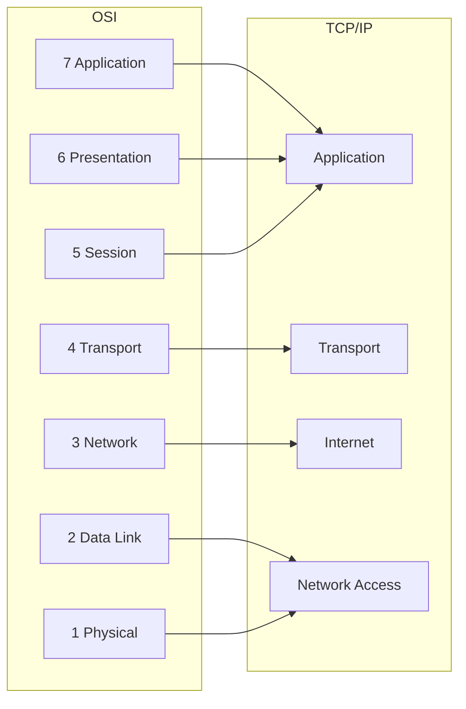

#### Die drei Schichten im Detail

**Applikationsschicht (OSI Layer 7)**
Die Applikationsschicht ist die dem Endbenutzer am nächsten liegende Schicht. Sie stellt die Schnittstelle zwischen den Anwendungen und dem darunterliegenden Netzwerk bereit. Hier werden Daten zwischen laufenden Programmen auf Quell- und Zielsystem ausgetauscht. Bekannte Protokolle: **HTTP, FTP, TFTP, IMAP, DNS**.

**Präsentationsschicht (OSI Layer 6)**
Die Präsentationsschicht übernimmt drei Hauptaufgaben:
1. **Formatierung/Darstellung**: Daten werden in ein für das Zielsystem lesbares Format gebracht (z. B. ASCII → EBCDIC).
2. **Komprimierung**: Daten werden für die Übertragung komprimiert und beim Empfang wieder dekomprimiert.
3. **Verschlüsselung/Entschlüsselung**: Daten werden für den sicheren Transport verschlüsselt.

Typische Formate auf dieser Ebene: MKV, MPG, MOV, GIF, JPG, PNG.

**Sitzungsschicht (OSI Layer 5)**
Die Sitzungsschicht ist für den **Aufbau, die Verwaltung und den Abbau** von Kommunikationssitzungen zwischen Anwendungen zuständig. Sie:
- Initiiert Dialoge zwischen Quell- und Zielanwendung
- Hält aktive Sitzungen am Leben
- Stellt unterbrochene oder inaktive Sitzungen wieder her

---

### Peer-to-Peer

#### Client-Server-Modell

Das gängigste Kommunikationsmodell im Internet: Ein **Client** stellt eine Anfrage, ein **Server** beantwortet sie. Beide arbeiten auf der Applikationsschicht. Applikationsschichtprotokolle definieren das Format der Anfragen und Antworten.

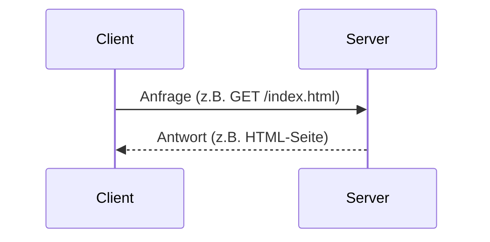

#### Peer-to-Peer-Netzwerk (P2P)

Bei P2P gibt es keinen dedizierten Server. Jedes Gerät (sog. **Peer**) kann gleichzeitig als Client *und* als Server agieren – je nach Anfrage. Typische P2P-Anwendungen:

- **BitTorrent** – Dateiübertragung in Teilen von vielen Quellen gleichzeitig
- **Direct Connect**
- **eDonkey**
- **Freenet**
- **Gnutella / LimeWire**

> **Warum P2P?** P2P ist dezentral und skaliert gut, da jeder Teilnehmer sowohl Ressourcen bezieht als auch anbietet. Allerdings entstehen Sicherheitsrisiken, da keine zentrale Kontrolle vorhanden ist.

---

### Web- und E-Mail-Protokolle

#### HTTP und HTML – Wie eine Webseite geladen wird

Wenn man eine URL in den Browser tippt, läuft folgender Prozess ab:

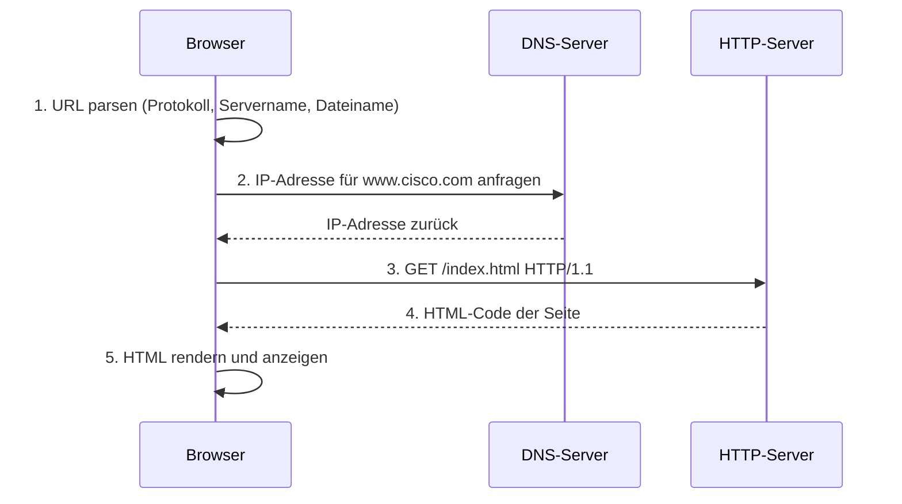

#### HTTP-Nachrichtentypen

| Typ | Beschreibung |
|-----|--------------|
| **GET** | Anfrage von Daten (z. B. eine HTML-Seite) |
| **POST** | Hochladen von Formulardaten zum Server |
| **PUT** | Hochladen von Ressourcen/Inhalten (z. B. Bilder) |

> **Wichtig:** HTTP ist **nicht sicher**. Für verschlüsselte Kommunikation muss **HTTPS** (TCP/UDP Port 443) verwendet werden, das TLS-Verschlüsselung und Authentifizierung einsetzt.

#### E-Mail-Protokolle

E-Mail funktioniert nach dem **Store-and-Forward**-Prinzip: Nachrichten werden auf Mailservern gespeichert, bis sie abgerufen werden.

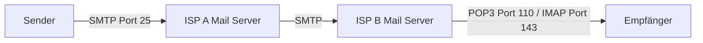

**SMTP (Simple Mail Transfer Protocol) – Port 25**
- Wird zum *Senden* von E-Mails verwendet
- Client verbindet sich mit Server auf Port 25
- Server leitet Nachricht an Zielserver weiter oder legt sie lokal ab
- Wenn Zielserver nicht erreichbar: SMTP stellt Nachrichten in eine Warteschlange

**POP3 (Post Office Protocol) – Port 110**
- Zum *Empfangen* von E-Mails
- Nachrichten werden vom Server auf den Client heruntergeladen und **danach auf dem Server gelöscht**
- Nachteil: Kein zentrales Backup; für Unternehmen mit Backup-Anforderungen ungeeignet

**IMAP (Internet Message Access Protocol) – Port 143**
- Zum *Empfangen* von E-Mails
- Kopien werden heruntergeladen, **Original verbleibt auf dem Server**
- Löschungen werden mit dem Server synchronisiert
- Vorteil: Zugriff von mehreren Geräten auf denselben Posteingang

---

### IP-Adressierungsdienste

#### DNS – Domain Name System

Menschen merken sich Domains wie `www.cisco.com` viel leichter als IP-Adressen wie `198.133.219.25`. Das DNS übernimmt die automatische Übersetzung (Namensauflösung).

**DNS-Ablauf:**

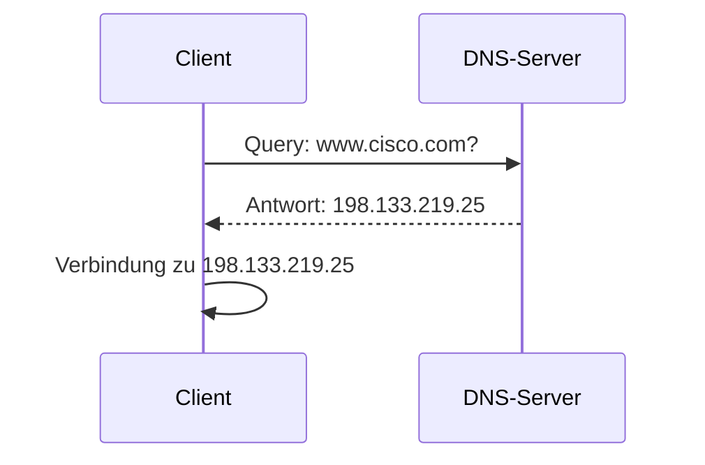

**DNS-Ressource-Record-Typen:**

| Typ | Bedeutung |
|-----|-----------|
| **A** | IPv4-Adresse eines Endgeräts |
| **AAAA** | IPv6-Adresse (Quad-A) |
| **NS** | Autoritativer Nameserver |
| **MX** | Mail Exchange Record |

**DNS-Hierarchie:**
DNS ist hierarchisch aufgebaut. Jeder Server verwaltet nur seinen Teil der Hierarchie (DNS-Zone). Kennt ein Server die Antwort nicht, leitet er die Anfrage an einen übergeordneten Server weiter.

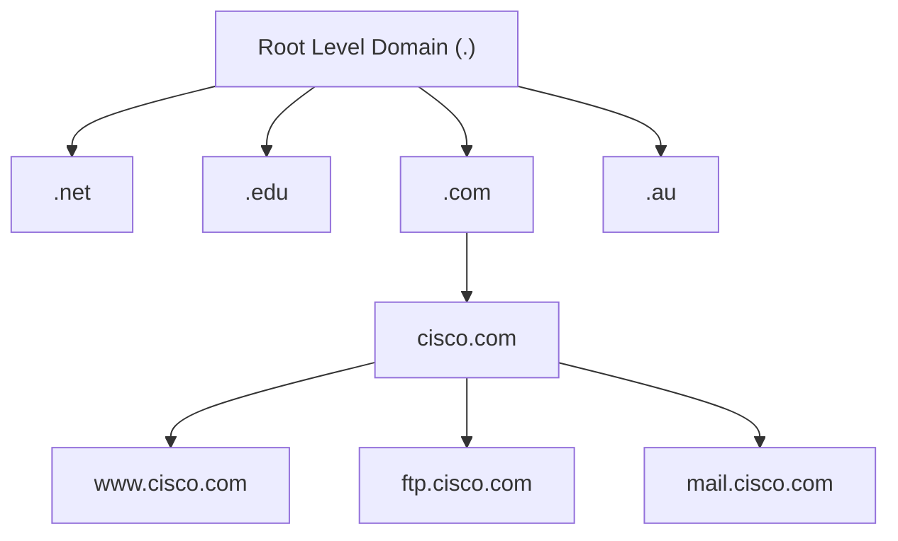

**Nützliche Befehle:**
- `nslookup` – Manuell DNS-Server abfragen, zur Fehlersuche
- `ipconfig /displaydns` – Alle gecachten DNS-Einträge auf einem Windows-PC anzeigen

#### DHCP – Dynamic Host Configuration Protocol

DHCP automatisiert die Zuweisung von IPv4-Adressen, Subnetzmasken, Standard-Gateways und weiteren Netzwerkparametern. Ohne DHCP müsste jedes Gerät manuell (statisch) konfiguriert werden.

**DHCP-Prozess (DORA):**

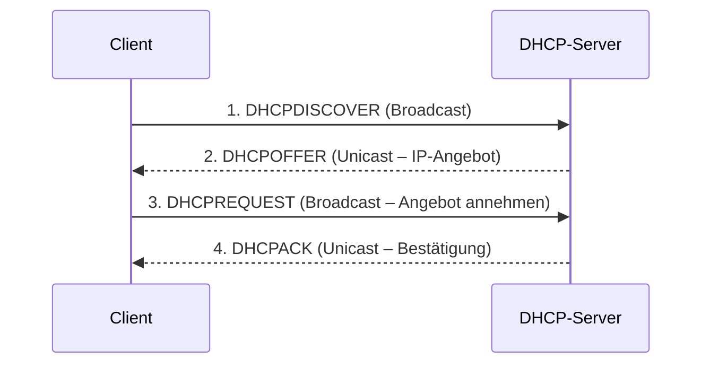

> **Warum Broadcast beim REQUEST?** Weil es mehrere DHCP-Server geben kann und alle informiert werden müssen, welches Angebot der Client angenommen hat (damit die anderen ihre angebotenen Adressen wieder freigeben).

**Hinweis DHCPv6:** Für IPv6 gibt es DHCPv6 mit den Nachrichten SOLICIT, ADVERTISE, INFORMATION REQUEST und REPLY. DHCPv6 liefert jedoch **kein Standard-Gateway** – das muss über Router Advertisements bezogen werden.

---

### Dateiübertragungsdienste

#### FTP – File Transfer Protocol (Port 20/21)

FTP ermöglicht den zuverlässigen Dateitransfer zwischen Client und Server über **zwei separate TCP-Verbindungen**:

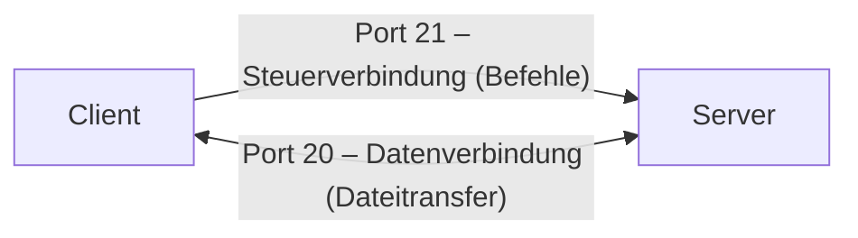

1. **Steuerverbindung (Port 21):** Wird zuerst aufgebaut. Über sie werden Befehle und Serverantworten ausgetauscht.
2. **Datenverbindung (Port 20):** Wird für jeden tatsächlichen Dateitransfer aufgebaut (bidirektional: Upload = Push, Download = Pull).

#### SMB – Server Message Block

SMB ist ein Client/Server-Protokoll zur gemeinsamen Nutzung von Ressourcen im Netzwerk (Dateisysteme, Drucker, APIs).

Im Gegensatz zu FTP stellt SMB eine **langfristige Verbindung** her – der Benutzer kann auf freigegebene Ressourcen zugreifen, als wären sie lokal auf seinem Gerät vorhanden.

**Drei Funktionen von SMB:**
1. Sitzungen starten, authentifizieren und beenden
2. Zugriff auf Dateien und Drucker steuern
3. Nachrichten zwischen Geräten senden/empfangen

---

### Übersicht: TCP/IP Applikationsprotokoll-Tabelle

| Protokoll | Transport | Port | Funktion |
|-----------|-----------|------|----------|
| DNS | TCP/UDP | 53 | Namensauflösung |
| DHCP | UDP | 67/68 | IP-Adressvergabe |
| SMTP | TCP | 25 | E-Mail senden |
| POP3 | TCP | 110 | E-Mail empfangen (löscht vom Server) |
| IMAP | TCP | 143 | E-Mail empfangen (bleibt auf Server) |
| FTP | TCP | 20/21 | Dateiübertragung |
| TFTP | UDP | 69 | Einfache Dateiübertragung (verbindungslos) |
| HTTP | TCP | 80/8080 | Webseiten |
| HTTPS | TCP/UDP | 443 | Webseiten verschlüsselt |

---

---

## 2: Netzwerksicherheit Grundlagen (Modul 16)

### Sicherheitsbedrohungen und Schwachstellen

#### Arten von Bedrohungen

Netzwerkangriffe können verheerend sein und zu Zeit- und Geldverlust durch Schäden oder Diebstahl führen. Eindringlinge (sog. **Threat Actors**) gelangen über Softwareschwachstellen, Hardware-Angriffe oder durch das Erraten von Zugangsdaten ins Netzwerk.

Nach einem erfolgreichen Eindringen entstehen vier Bedrohungstypen:

| Bedrohung | Beschreibung |
|-----------|--------------|
| **Informationsdiebstahl** | Unbefugter Zugriff auf vertrauliche Informationen |
| **Datenverlust/-manipulation** | Vernichtung oder Veränderung von Daten (z. B. Virus reformatiert Festplatte; Preis in Datenbank ändern) |
| **Identitätsdiebstahl** | Persönliche Daten werden gestohlen, um jemandes Identität zu missbrauchen |
| **Dienststörung (DoS)** | Legitime Nutzer werden am Zugriff auf Dienste gehindert |

#### Arten von Schwachstellen

Es gibt drei primäre Schwachstellenkategorien:

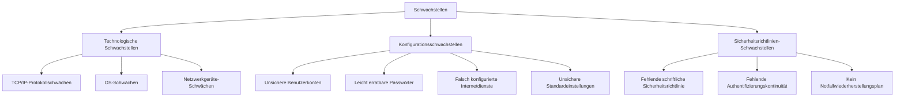

#### Physische Sicherheit

Wenn Netzwerkressourcen physisch kompromittiert werden können, kann ein Angreifer deren Nutzung verhindern. Vier Klassen physischer Bedrohungen:

| Klasse | Beispiele |
|--------|-----------|
| **Hardware** | Physischer Schaden an Servern, Routern, Switches, Verkabelung |
| **Umgebung** | Temperaturextreme, Feuchtigkeitsextreme |
| **Elektrisch** | Spannungsspitzen, Unterspannung, Stromausfall |
| **Wartung** | Elektrostatische Entladung, schlechte Verkabelung, fehlende Ersatzteile |

---

### Netzwerkangriffe

#### Schadsoftware (Malware)

Malware (= **Mal**icious Soft**ware**) ist Code, der gezielt Schaden verursacht, stört, stiehlt oder illegitime Aktionen auf Daten, Systemen oder Netzwerken ausführt.

| Typ | Eigenschaft |
|-----|-------------|
| **Viren** | Ausführbare Datei, die sich in andere Programme einschleust und sich von Computer zu Computer verbreitet |
| **Würmer** | Benötigen kein Wirtsprogramm; eigenständige Software, die Netzwerkfunktionen nutzt, um sich zu verbreiten |
| **Trojaner** | Benutzer werden getäuscht, das Programm auszuführen; erstellen meist Hintertüren; **vermehren sich nicht** wie Viren/Würmer |

> **Warum ist das relevant?** Würmer können in Minuten ganze Netzwerke lahmlegen, da sie sich selbstständig replizieren. Trojaner sind gefährlicher für gezielte Angriffe, da sie oft unbemerkt bleiben.

#### Netzwerkangriff-Kategorien

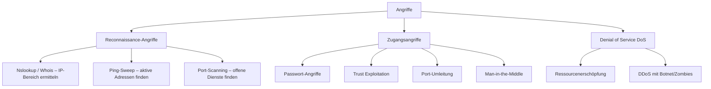

**Reconnaissance-Angriffe** dienen der Aufklärung: Welche Systeme gibt es? Welche Dienste laufen? Welche Schwachstellen existieren?

**Zugangsangriffe** nutzen bekannte Schwachstellen aus:
- **Passwort-Angriffe**: Brute-Force, Trojaner, Packet-Sniffing
- **Trust Exploitation**: Ausnutzen von Vertrauensbeziehungen zwischen Systemen
- **Port-Umleitung**: Angreifer installiert Software auf kompromittiertem Host, um über diesen auf andere Ports zuzugreifen
- **Man-in-the-Middle**: Angreifer schaltet sich in eine Kommunikation ein; häufig über Phishing-E-Mails

**Denial of Service (DoS / DDoS):**

DoS-Angriffe sind die am häufigsten publizierten Angriffsformen und schwer zu eliminieren. Sie erschöpfen Systemressourcen, sodass legitime Nutzer keinen Zugriff mehr erhalten.

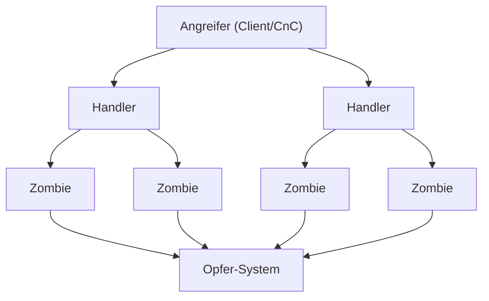

Ein **DDoS** (Distributed DoS) geht von vielen koordinierten Quellen gleichzeitig aus. Der Angreifer baut ein Netzwerk infizierter Hosts (**Botnet** aus sog. **Zombies**) auf und steuert diese über ein Command-and-Control-Programm (CnC).

> **Praxisbeispiel (November 2025):** Ein DDoS-Angriff gegen Microsofts Azure-Infrastruktur erreichte 15,72 Terabit/s von über 500.000 IP-Adressen – verursacht durch das **Aisuru-Botnet**, das kompromittierte Heim-Router und Netzwerkkameras ausnutzte.

---

### Gegenmassnahmen bei Netzwerkangriffen

#### Defense-in-Depth (mehrschichtige Sicherheit)

Keine einzelne Massnahme bietet vollständigen Schutz. Deshalb setzen Organisationen auf den **Defense-in-Depth**-Ansatz: mehrere Sicherheitsschichten, die zusammenarbeiten.

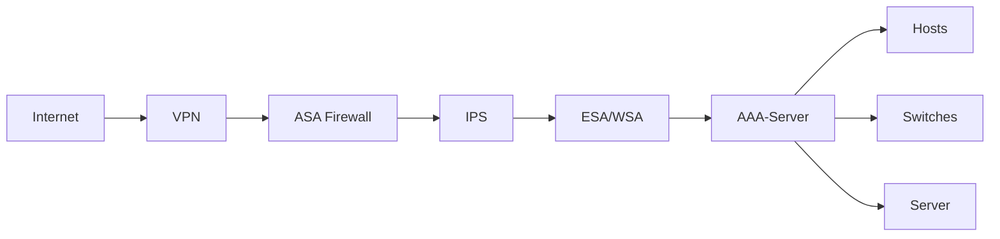

| Komponente | Funktion |
|------------|----------|
| **VPN** | Verschlüsselter Tunnel für Remote-Zugriff |
| **ASA Firewall** | Kontrolliert Datenverkehr zwischen Netzen |
| **IPS** | Erkennt und blockiert Angriffe in Echtzeit |
| **ESA** | E-Mail-Sicherheit (Spam, Malware in Anhängen) |
| **WSA** | Web-Sicherheit (URL-Filterung, Malware) |
| **AAA-Server** | Authentifizierung, Autorisierung, Abrechnung |

#### Datensicherungen

Backups sind eine der effektivsten Massnahmen gegen Datenverlust:

| Aspekt | Empfehlung |
|--------|------------|
| **Häufigkeit** | Regelmässig gemäss Sicherheitsrichtlinie; Vollbackup monatlich/wöchentlich + inkrementell täglich |
| **Speicherung** | Validierung der Backup-Integrität; Wiederherstellungsverfahren testen |
| **Sicherheit** | Offsite-Lagerung; Transport täglich/wöchentlich/monatlich je nach Richtlinie |
| **Schutz** | Backups mit starken Passwörtern schützen |

#### Updates und Patches

- Wichtigste Massnahme gegen Würmer: **Sicherheitsupdates vom OS-Anbieter herunterladen** und alle verwundbaren Systeme patchen
- Endgeräte sollten automatische Updates aktiviert haben

#### AAA – Authentifizierung, Autorisierung und Abrechnung

AAA ist der primäre Rahmen für die Zugangskontrolle auf Netzwerkgeräten:

| Begriff | Frage | Analogie (Kreditkarte) |
|---------|-------|------------------------|
| **Authentifizierung** | Wer bist du? | Wer darf die Karte nutzen? |
| **Autorisierung** | Was darfst du tun? | Wie viel darf ausgegeben werden? |
| **Abrechnung** | Was hast du getan? | Wofür wurde Geld ausgegeben? |

#### Firewalls

Firewalls sind eines der wirksamsten Sicherheitswerkzeuge zum Schutz vor externen Bedrohungen.

**Filterungstechniken:**

| Technik | Beschreibung |
|---------|--------------|
| **Paketfilterung** | Erlaubt/verbietet Zugriff basierend auf IP- oder MAC-Adressen |
| **Applikationsfilterung** | Basierend auf Portnummern |
| **URL-Filterung** | Basierend auf URLs oder Schlüsselwörtern |
| **Stateful Packet Inspection (SPI)** | Eingehende Pakete müssen legitime Antworten auf interne Anfragen sein |

**DMZ (Demilitarisierte Zone):**

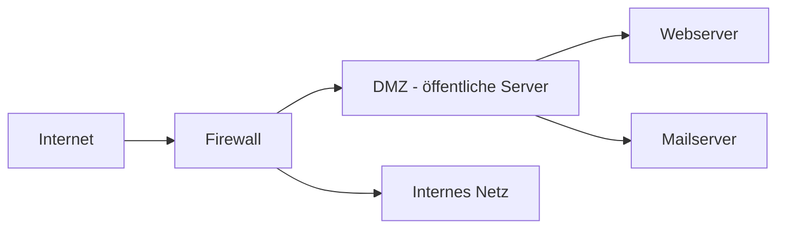

Die DMZ erlaubt externen Nutzern kontrollierten Zugriff auf bestimmte Server (z. B. Webserver), ohne direkten Zugang zum internen Netzwerk zu gewähren.

#### Endpunktsicherheit

Endpunkte (Laptops, Desktops, Server, Smartphones, Tablets) sind häufige Angriffsziele. Sicherung dieser Geräte ist eine der schwierigsten Aufgaben eines Netzwerkadministrators.

Massnahmen:
- Antivirus-Software
- Host-basierte Intrusion Prevention
- Gut dokumentierte und durchgesetzte Unternehmensrichtlinien

---

### Gerätesicherheit

#### Cisco AutoSecure

Bei neuen Geräten sind Standardeinstellungen oft unzureichend sicher. Der Befehl `auto secure` auf Cisco-Routern hilft, das Gerät automatisch abzusichern.

**Allgemeine Grundsätze für alle Betriebssysteme:**
1. Standard-Benutzernamen und -Passwörter **sofort** ändern
2. Zugriff auf Ressourcen auf autorisierte Nutzer beschränken
3. Unnötige Dienste und Anwendungen deaktivieren/deinstallieren
4. Software und Sicherheitspatches **vor** dem Einsatz aktualisieren

#### Passwortsicherheit

**Richtlinien für starke Passwörter:**
- Mindestens **8 Zeichen**, empfohlen 10+
- Mischung aus Gross-/Kleinbuchstaben, Zahlen, Sonderzeichen
- Keine Wörterbuchwörter, keine persönlichen Infos
- Bewusste Rechtschreibfehler einbauen (z. B. „Smyth" statt „Smith")
- Regelmässig ändern
- Nicht aufschreiben und sichtbar hinterlegen

**Passphrasen**: Eine Folge mehrerer Wörter (z. B. „MeinKatzenLiebtKaffee2024!") ist oft sicherer und leichter zu merken als ein kurzes komplexes Passwort.

#### Zusätzliche Passwortsicherheit auf Cisco-Geräten

```bash
! Alle Klartext-Passwörter verschlüsseln
Router(config)# service password-encryption

! Mindestlänge für Passwörter setzen
Router(config)# security passwords min-length 8

! Brute-Force-Schutz: Nach 3 Fehlversuchen in 60 Sek. → 120 Sek. sperren
Router(config)# login block-for 120 attempts 3 within 60

! Inaktive privilegierte EXEC-Sitzung nach 5 Min. 30 Sek. beenden
Router(config-line)# exec-timeout 5 30
```

#### SSH statt Telnet

Telnet überträgt Daten im Klartext – ein enormes Sicherheitsrisiko. **SSH** (Secure Shell) verschlüsselt die gesamte Kommunikation.

**SSH-Konfigurationsschritte:**

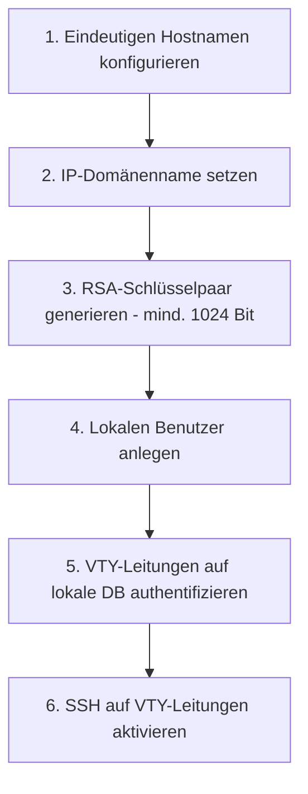

```bash
Router(config)# hostname MeinRouter
Router(config)# ip domain-name firma.ch
Router(config)# crypto key generate rsa general-keys modulus 2048
Router(config)# username admin secret sicheresPasswort
Router(config)# line vty 0 4
Router(config-line)# login local
Router(config-line)# transport input ssh
```

#### Ungenutzte Dienste deaktivieren

Aktive Dienste, die nicht benötigt werden, verbrauchen CPU/RAM und bieten Angriffsfläche. Überprüfung mit:

```bash
! IOS-XE
Router# show ip ports all

! Ältere IOS-Versionen
Router# show control-plane host open-ports
```

---

### Zusammenfassung

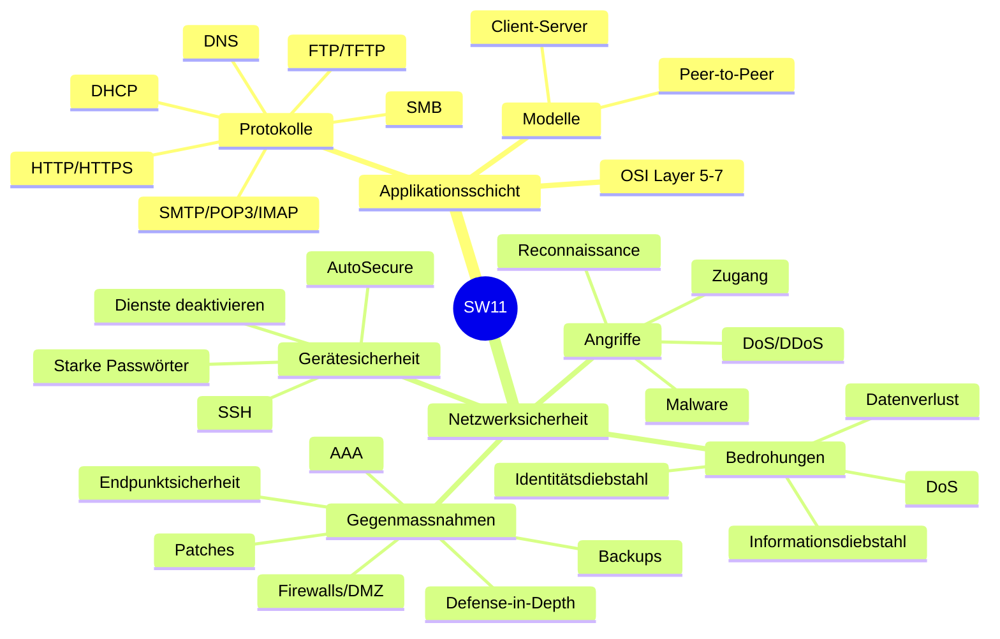

---
---
---
<Callout type="danger"> 
## Summary Module 15: Application Layer
</Callout>

**Application Layer** — Used to exchange data between programs on source and destination ports. Provides interface between applications and the underlying network (application, presentation, and session layers represent the TCP/IP application layer).

**Presentation Layer** — Formats data at source device into a compatible format for receipt, compresses/decompresses data, encrypts data for transmission and decrypts upon receipt.

**Session Layer** — Creates and maintains dialogs between source and destination applications.

**Peer-to-Peer** — Two or more computers connected via network sharing resources (printers, files) without a dedicated server. Every peer can function as both server and client. Roles set on a per-request basis. Example: BitTorrent.

### Web and Email Protocols

**HTTP and HTML** — Browser interprets URL in 3 parts: protocol + server name + filename requested. Browser checks DNS to convert server name to IP, client sends GET request to server, server returns HTML code, browser formats and renders the page.

**HTTP Methods**
- `GET` — Client requests data (e.g. web browser requests HTML pages).
- `POST` — Uploads data files to web server (e.g. form data).
- `PUT` — Uploads resources to web server.

**Email Protocols**

| Protocol | Port | Direction | Notes |
|----------|------|-----------|-------|
| SMTP | 25 (TCP) | Sending | Requires message header (recipient + sender address) and body |
| POP | 110 (TCP) | Receiving | Mail downloaded to client; messages deleted from server |
| IMAP | — | Receiving | Copies downloaded to client; originals kept on server until manually deleted; deletions synced |

### IP Addressing Services

**DNS (Domain Name Service)** — Converts domain names to IP addresses. Server first looks at own records; if unable to resolve, contacts other servers. Match is temporarily cached for future lookups.

**DNS Record Types**

| Record | Description |
|--------|-------------|
| `NS` | Authoritative name server |
| `A` | End device IPv4 address |
| `AAAA` | End device IPv6 address |
| `MX` | Mail exchange record |

**DNS Hierarchy** — Root Level Domain → Top-Level Domain (TLD: `.net`, `.edu`, `.com`, `.au`, `.co`) → Second Level Domain (e.g. `cisco.com`, `www.cisco.com`). Requests outside a DNS zone are forwarded to the appropriate DNS server.

**DNS Commands**
- `nslookup <domain>` (Windows) — Manually query DNS servers to resolve a host name.
- `ipconfig /displaydns` — Display all cached DNS entries on a Windows PC.

**DHCP (Dynamic Host Configuration Protocol)** — Automates assignment of IPv4 addresses, subnet masks, gateways, etc. When host connects, DHCP server is contacted, an address from the pool is leased. DHCPv6 provides similar services for IPv6 (does not provide default gateway → obtained via RA message).

**DHCP Operation (DORA)**
1. Client broadcasts **DHCPDISCOVER** to identify available DHCP servers.
2. Server replies with **DHCPOFFER** — offers a lease.
3. Client broadcasts **DHCPREQUEST** — identifies server and lease offer being accepted.
4. Server returns **DHCPACK** — lease finalized. If no longer valid → **DHCPNAK** → process restarts with new DHCPDISCOVER.
- IPv6 DHCPv6 messages: `SOLICIT`, `ADVERTISE`, `INFORMATION REQUEST`, `REPLY`.

### File Sharing Services

**FTP (File Transfer Protocol)**
- Connection 1 — TCP port 21: Client commands and server replies.
- Connection 2 — TCP port 20: Data transfer (created every time data is transferred, either direction).

**SMB (Server Message Block)** — Client/server request-response file sharing protocol. Servers make resources available to clients. Starts, authenticates, and terminates sessions; controls file and printer access; allows app-to-app messaging. Unlike FTP, the connection is long-term.

---
---
---
<Callout type="danger"> 
## Summary Module 16: Network Security Fundamentals
</Callout>

**Types of Threats** — Information Theft (stealing confidential information), Data Loss and Manipulation (destroy or alter records), Identity Theft (personal information stolen), Disruption of Service (preventing legitimate users from accessing services).

**Types of Vulnerabilities**
- **Technological** — TCP/IP protocol weaknesses, OS weaknesses, network equipment weaknesses.
- **Configuration** — Unsecured user accounts, easily guessed passwords, misconfigured internet services, unsecure default settings.
- **Security Policy** — Lack of written security policy, lack of authentication continuity, logical access controls not applied, no disaster recovery plan.

**Physical Threats** — Hardware (physical damage), Environmental (temperature/humidity extremes), Electrical (voltage spikes, brownouts, power loss), Maintenance (electrostatic discharge, poor cabling, poor labeling).

### Network Attacks

**Types of Malware**
- **Viruses** — Executable malware propagated by inserting a copy of itself into another program; spreads computer to computer.
- **Worms** — Similar to viruses but do not require a host program; standalone software that travels through the network.
- **Trojan Horses** — Users tricked into executing malware; creates backdoors for malicious users; does not reproduce.

**Reconnaissance Attacks** — Discovery and mapping of systems or vulnerabilities, e.g. `nslookup` or `whois` to determine IP address space, ping public IPs to identify active addresses.

**Access Attacks** — Unauthorized manipulation of data, system access, or user privileges.
- **Password Attacks** — Brute-force attacks, Trojan horse programs, packet sniffers.
- **Trust Exploitation** — Accessing a target by abusing a trust relationship with a compromised system.
- **Port Redirection** — Software installed on compromised host to access a target on a different port.
- **Man-in-the-Middle** — Attacker inserts himself into a conversation.

**Denial of Service** — Disabling or corrupting networks, systems, or services.

### Network Attack Mitigations

**Defense-in-Depth** — Secure all network devices; use specific devices for TCP/IP threat protection (VPN, ASA Firewall, IPS, ESA, WSA, AAA).

**Backups** — Frequency (regular full backups and snapshots), Storage (validate backup integrity), Security (offsite location), Validation (password protected).

**Upgrade, Update and Patch** — Keep all systems up to date.

**AAA (Authentication, Authorization and Accounting)** — Primary framework for setting up access control on network devices.

**Firewalls**
- **Packet Filtering** — Based on IP or MAC addresses.
- **Application Filtering** — Based on port numbers.
- **URL Filtering** — Based on specific URLs or keywords.
- **SPI (Stateful Packet Inspection)** — Inbound traffic must originate from inside the network unless specifically permitted.
- **DMZ (Demilitarized Zone)** — Servers accessible from outside are separated and located in the DMZ.

**Endpoint Security** — Companies must have a well-documented policy in place; securing endpoint devices is one of the most challenging jobs of a network administrator.

### Device Security

Security settings are set to default values when a new OS is installed — in most cases this level of security is inadequate.

**Simple Steps**
- Change default usernames and passwords.
- Restrict access to system resources.
- Turn off unnecessary services and applications.
- Update software and install security patches prior to implementation.
- Passwords: at least 8 characters, complex, avoid repetition, change often.

**Additional Password Security Commands**
- `service password-encryption` — Encrypt all plaintext passwords.
- `security passwords min-length <n>` — Set minimum acceptable password length.
- `login block-for # attempts # within #` — Deter brute-force password guessing.
- `exec-timeout` — Disable inactive privileged EXEC mode access after a specified time.

**Enable SSH**
```
hostname <name>
ip domain-name <domain>
crypto key generate rsa general-keys modulus <bits>
username <user>
login local
transport input [ssh|telnet]
```

**Disable Unused Services** — `show ip ports all` or `show control-plane host open-ports` (older IOS) — display enabled default services.