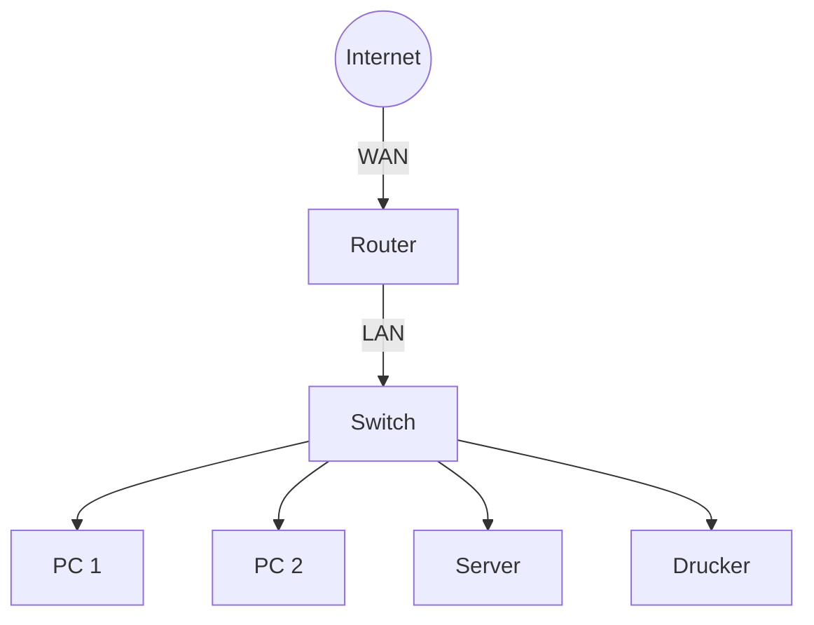
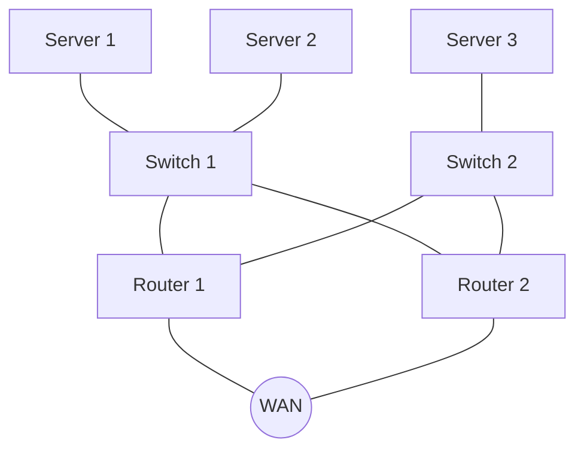
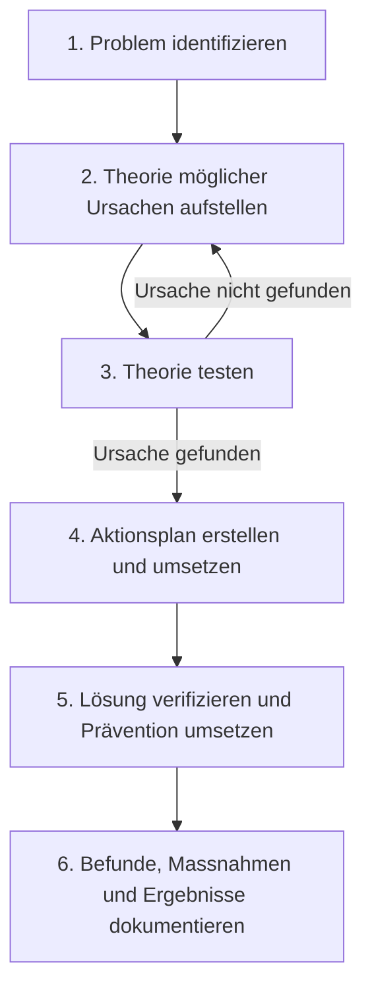

import Callout from '../../../../components/Callout.astro';


## 1. Geräte in einem kleinen Netzwerk

### Topologie kleiner Netzwerke

Die Mehrheit der Unternehmen weltweit sind Kleinbetriebe – und entsprechend klein sind auch ihre Netzwerke. Ein kleines Netzwerk hat in der Regel eine einfache Topologie mit wenigen Geräten und einer einzigen WAN-Anbindung (z. B. DSL, Kabel oder Ethernet). Im Gegensatz zu grossen Unternehmensnetzwerken, die eine eigene IT-Abteilung erfordern, werden kleine Netzwerke meist von einem lokalen IT-Techniker oder einem externen Dienstleister betreut.

**Typische Komponenten eines kleinen Netzwerks:**
- 1 Router (WAN-Anbindung + LAN-Gateway)
- 1–2 Switches (LAN-Segmentierung)
- Endgeräte (PCs, Laptops, Drucker, Server)
- WLAN Access Point (optional)



### Geräteauswahl für ein kleines Netzwerk

Auch kleine Netzwerke brauchen Planung. Bevor Geräte beschafft werden, müssen Anforderungen, Kosten und Deployment-Optionen sorgfältig analysiert werden. Die erste wichtige Designentscheidung ist die Wahl der richtigen **Intermediary Devices** (Vermittlungsgeräte).

**Auswahlkriterien für Netzwerkgeräte:**

| Kriterium | Beschreibung |
|---|---|
| **Kosten** | Anschaffungskosten vs. Funktionsumfang |
| **Ports/Interfaces** | Anzahl, Typ (Fast/Gigabit Ethernet), Kupfer vs. Fiber |
| **Erweiterbarkeit** | Modulare Bauweise, Steckplätze für Erweiterungen |
| **Betriebssystem-Features** | QoS, VLANs, ACLs, Routing-Protokolle |

> **Warum das wichtig ist:** Ein zu kleines Gerät wird schnell zum Engpass; ein überdimensioniertes Gerät verschwendet Budget. Die richtige Balance spart Geld und stellt sicher, dass das Netzwerk mit dem Unternehmen wachsen kann.

### IP-Adressierung im kleinen Netzwerk

Jedes Gerät in einem Netzwerk benötigt eine **eindeutige IP-Adresse**. Für ein kleines Netzwerk sollte ein durchdachtes IP-Adressierungsschema erstellt, dokumentiert und gepflegt werden.

**Gerätegruppen, die in die Adressplanung einfliessen:**
- **Endgeräte:** PCs, Laptops (kabelgebunden, WLAN, Remote Access)
- **Server & Peripherie:** Dateiserver, Drucker, Kameras
- **Intermediary Devices:** Switches, Access Points, Router

**Best Practice:** Adressen nach Gerätetyp aufteilen (z. B. Server im Bereich .1–.20, Drucker .21–.30, Clients .100–.200). Das erleichtert die Fehlersuche enorm – ein Blick auf die IP-Adresse genügt, um die Gerätekategorie zu erkennen.

**Beispiel-Adressschema (192.168.1.0/24):**

```
192.168.1.1       → Router (Default Gateway)
192.168.1.2–.10   → Server
192.168.1.11–.20  → Drucker / Peripherie
192.168.1.21–.29  → Switches / Access Points (Management)
192.168.1.100–.200→ Endgeräte (DHCP-Pool)
```

### Redundanz im kleinen Netzwerk

**Redundanz** bedeutet, dass kritische Komponenten mehrfach vorhanden sind, sodass beim Ausfall einer Komponente der Betrieb weiterläuft. Das Ziel ist die Elimination von **Single Points of Failure (SPOF)**.

**Redundanz kann realisiert werden durch:**
- **Doppelte Geräte:** z. B. zwei Router, zwei Switches, mehrere Server
- **Doppelte Netzwerkverbindungen:** Alternate Paths zwischen Switches



> **Hinweis:** In kleinen Netzwerken ist vollständige Redundanz oft zu teuer. Typischerweise wird zumindest die WAN-Verbindung oder der Router redundant ausgelegt, da deren Ausfall das gesamte Unternehmen lahmlegen würde.

### Traffic Management & Quality of Service (QoS)

Das Ziel eines guten Netzwerkdesigns ist es, die **Produktivität der Mitarbeiter zu maximieren** und **Ausfallzeiten zu minimieren**. Besonders wichtig ist das Management von Echtzeit-Traffic (Sprache, Video).

**Quality of Service (QoS)** ermöglicht es, Netzwerkpakete nach Priorität zu behandeln:

| Priorität | Verkehrstyp | Begründung |
|---|---|---|
| Hoch | Voice (VoIP) | Latenz- und Jitter-sensitiv |
| Mittel | SMTP (E-Mail) | Zeitnah, aber nicht kritisch |
| Normal | Instant Messaging | Interaktiv, aber tolerant |
| Niedrig | FTP (Dateiübertragung) | Bulk-Transfer, kann warten |

Das **Priority Queuing** stellt sicher, dass die Warteschlange mit hoher Priorität immer zuerst geleert wird, bevor Pakete aus niedriger priorisierten Warteschlangen gesendet werden.

---

## 2. Anwendungen und Protokolle im kleinen Netzwerk

### Netzwerkanwendungen vs. Application Layer Services

Ein Netzwerk ist nur so nützlich wie die Anwendungen, die darauf laufen. Es gibt zwei Arten von Softwareprogrammen, die Netzwerkzugang ermöglichen:

- **Network Applications:** Implementieren Protokolle der Anwendungsschicht direkt und kommunizieren mit den unteren Schichten des Protokollstacks (z. B. Browser, E-Mail-Client, FTP-Client).
- **Application Layer Services:** Zwischenprogramme für nicht-netzwerkfähige Applikationen, die Daten für den Transfer aufbereiten.

### Häufig verwendete Protokolle

| Protokoll | Funktion | Sicheres Äquivalent |
|---|---|---|
| **Telnet** | Remote-Zugriff auf Geräte (Klartext!) | SSH |
| **SSH** | Sicherer Remote-Zugriff | — |
| **HTTP** | Webkommunikation | HTTPS |
| **SMTP** | E-Mail senden | — |
| **POP3 / IMAP** | E-Mail empfangen | — |
| **FTP** | Dateiübertragung | SFTP |
| **DHCP** | Automatische IP-Vergabe | — |
| **DNS** | Namensauflösung (Domain → IP) | — |

> **Best Practice:** Viele Unternehmen schreiben vor, wann immer möglich die **sicheren Varianten** dieser Protokolle zu verwenden (SSH statt Telnet, SFTP statt FTP, HTTPS statt HTTP). Dies verhindert das Abfangen von Anmeldedaten und Daten im Klartext.

**Was Protokolle definieren:**
- Prozesse auf beiden Seiten einer Kommunikation
- Nachrichtentypen und deren Syntax
- Bedeutung der Informationsfelder
- Wie Nachrichten gesendet werden und welche Antwort erwartet wird
- Interaktion mit der nächst tieferen Schicht

### Voice- und Video-Applikationen

Unternehmen setzen zunehmend auf **IP-Telefonie und Streaming Media**. Dabei muss der Netzwerkadministrator sicherstellen, dass die Infrastruktur diese Echtzeitanforderungen erfüllen kann.

**Vergleich VoIP vs. IP-Telefonie:**

| Merkmal | VoIP | IP-Telefonie |
|---|---|---|
| **Kosten** | Günstiger | Teurer |
| **Qualität** | Geringer | Höher |
| **Infrastruktur** | Einfacher | Dedizierte Server |
| **Einsatz** | Kleine Netzwerke | Mittlere/grosse Netzwerke |

**Relevante Protokolle für Echtzeit-Anwendungen:**
- **RTP (Real-Time Transport Protocol):** Transport von Audio/Video-Daten
- **RTCP (Real-Time Transport Control Protocol):** Überwachung der Übertragungsqualität

---

## 3. Skalierung auf grössere Netzwerke

### Wachstum planen

Wachstum ist ein natürlicher Prozess. Der Netzwerkadministrator muss das Netzwerk proaktiv planen, **bevor** Kapazitätsgrenzen erreicht werden. Für die Skalierung werden folgende Elemente benötigt:

- **Netzwerkdokumentation:** Physische und logische Topologie-Diagramme
- **Geräteinventar:** Liste aller Netzwerkgeräte
- **Budget:** IT-Budget inkl. Investitionsplanung
- **Traffic-Analyse:** Welche Protokolle/Anwendungen erzeugen wieviel Traffic?

### Protokoll-Analyse

Bevor das Netzwerk skaliert wird, muss der aktuelle Traffic-Mix verstanden werden. Tools wie **Wireshark** können den Netzwerkverkehr aufzeichnen und analysieren.

**Vorgehen bei der Traffic-Analyse:**
1. Traffic während **Spitzenlastzeiten** aufzeichnen
2. Captures auf **verschiedenen Netzwerksegmenten** durchführen
3. Traffic nach **Quelle, Ziel und Protokolltyp** auswerten
4. Erkenntnisse für Optimierungsmassnahmen nutzen

### Employee Network Utilization

Betriebssysteme bieten eingebaute Tools zur Analyse der Netzwerknutzung (z. B. Windows Task-Manager). Relevante Metriken:

- OS und Version
- CPU-Auslastung
- RAM-Auslastung
- Festplattenauslastung
- Laufende Netzwerk- und Nicht-Netzwerk-Anwendungen

Das regelmässige Dokumentieren dieser Snapshots über Zeit hilft, **sich verändernde Protokollanforderungen** frühzeitig zu erkennen.

---

## 4. Konnektivität überprüfen

### Ping

Der **ping**-Befehl ist das wichtigste Werkzeug zur schnellen Überprüfung von **Layer-3-Konnektivität** zwischen zwei IP-Adressen.

**Funktionsweise:** ping nutzt das **Internet Control Message Protocol (ICMP)**:
- ICMP Echo Request (Typ 8) → wird vom Sender geschickt
- ICMP Echo Reply (Typ 0) → Antwort des Ziels

```
Windows: C:\> ping 10.1.1.10    (sendet 4 Pakete)
Cisco IOS: R1# ping 10.1.1.10   (sendet 5 Pakete)
```

**IOS Ping-Ausgabe Bedeutung:**

| Zeichen | Bedeutung |
|---|---|
| `!` | Echo Reply empfangen → Layer-3-Verbindung OK |
| `.` | Timeout – kein Reply → Verbindungsproblem |
| `U` | ICMP „Destination Unreachable" – Route nicht gefunden |

### Extended Ping (Cisco IOS)

Der erweiterte Ping in Cisco IOS ermöglicht das Anpassen von Parametern. Er wird im **Privileged EXEC Mode** durch Eingabe von `ping` (ohne Zieladresse) gestartet:

```
R1# ping
Protocol [ip]:
Target IP address: 10.1.1.10
Repeat count [5]: 100
Datagram size [100]:
Timeout in seconds [2]:
Extended commands [n]: y
Source address or interface: 192.168.10.1
...
```

> **Warum nützlich?** Mit der Option `Source address` kann getestet werden, ob eine bestimmte Schnittstelle Konnektivität hat – wichtig beim Troubleshooting von Routing-Problemen.

### Traceroute

Während `ping` nur prüft **ob** eine Verbindung besteht, zeigt `traceroute` **wo** ein Problem liegt – durch Auflisten aller Hops auf dem Pfad.

```
Windows:    C:\> tracert 10.1.1.10
Cisco IOS:  R1# traceroute 10.1.1.10
Linux:      $ traceroute 10.1.1.10
```

**Beispielausgabe (Fehlerfall):**
```
Tracing route to 10.1.10 over a maximum of 30 hops:
  1    2 ms    2 ms    2 ms  192.168.10.1   ← R1 antwortet
  2      *       *       *   Request timed out.  ← Problem hier!
  3      *       *       *   Request timed out.
```

Das bedeutet: Das Problem liegt zwischen Hop 1 (R1) und Hop 2 (R2).

> **Technischer Unterschied:** Windows `tracert` verwendet ICMP Echo Requests. Cisco IOS und Linux verwenden UDP mit einer ungültigen Portnummer. Das Ziel antwortet mit einer ICMP-„Port Unreachable"-Meldung.

**Unterbrechen:**
- Windows: `Ctrl-C`
- Cisco IOS: `Ctrl-Shift-6`

### Extended Traceroute (Cisco IOS)

Analog zum Extended Ping gibt es auch einen **Extended Traceroute**, der im Privileged EXEC Mode durch `traceroute` (ohne Ziel) gestartet wird und erweiterte Parameter ermöglicht.

### Network Baseline

Eine **Network Baseline** ist eine Referenzmessung des Netzwerks unter normalen Betriebsbedingungen. Sie ist unverzichtbar für:
- Erkennung von Leistungsabweichungen
- Nachweis von Netzwerkproblemen
- Kapazitätsplanung

**Methode:** Ping/Traceroute-Ergebnisse kopieren, mit Zeitstempel in Textdatei speichern, archivieren und regelmässig wiederholen. Professionelle Tools können dies automatisieren.

---

## 5. Host- und IOS-Befehle

### IP-Konfiguration auf Windows

```cmd
ipconfig                    # Grundlegende IP-Infos (IP, Maske, Gateway)
ipconfig /all               # Erweiterte Infos inkl. MAC-Adresse
ipconfig /release           # IP-Adresse freigeben (DHCP)
ipconfig /renew             # Neue IP-Adresse anfordern (DHCP)
ipconfig /displaydns        # DNS-Cache anzeigen
ipconfig /flushdns          # DNS-Cache leeren
```

### IP-Konfiguration auf Linux

```bash
ifconfig                    # Interface-Status und IP-Konfiguration anzeigen
ip address                  # Moderne Alternative zu ifconfig
ip address show eth0        # Bestimmtes Interface anzeigen
```

### IP-Konfiguration auf macOS

```bash
ifconfig                    # Interface-Status anzeigen
networksetup -listallnetworkservices    # Alle Netzwerkdienste auflisten
networksetup -getinfo Wi-Fi            # Infos zu einem Interface
```

### ARP-Befehl

Der **ARP-Cache** speichert die Zuordnung von IP-Adressen zu MAC-Adressen (Layer-3 zu Layer-2). Er wird auf allen Betriebssystemen mit `arp -a` angezeigt.

```cmd
arp -a                                # ARP-Cache anzeigen
netsh interface ip delete arpcache    # ARP-Cache leeren (Windows, Admin)
```

> **Hintergrund:** ARP (Address Resolution Protocol) ist notwendig, weil Ethernet-Frames MAC-Adressen verwenden, aber höhere Schichten mit IP-Adressen arbeiten. Wenn ein Host das erste Mal mit einem anderen kommuniziert, sendet er einen ARP-Broadcast: „Wer hat IP X.X.X.X? Bitte antworte mit deiner MAC." Die Antwort wird im ARP-Cache gecacht.

### Wichtige Cisco IOS show-Befehle

| Befehl | Beschreibung |
|---|---|
| `show running-config` | Aktuelle Konfiguration anzeigen |
| `show interfaces` | Interface-Status + Fehlermeldungen |
| `show ip interface` | Layer-3-Informationen der Interfaces |
| `show ip interface brief` | Kurzübersicht aller Interfaces mit Status |
| `show arp` | ARP-Tabelle des Routers |
| `show ip route` | Routing-Tabelle |
| `show protocols` | Aktive Protokolle |
| `show version` | IOS-Version, Speicher, Lizenzen |

### CDP (Cisco Discovery Protocol)

**CDP** ist ein Cisco-proprietäres Layer-2-Protokoll, das Informationen über direkt verbundene Cisco-Geräte sammelt.

```
R3# show cdp neighbors
R3# show cdp neighbors detail    # Zeigt auch IP-Adressen
```

**Informationen die CDP liefert:**
- **Device Identifier:** Hostname des Nachbargeräts
- **Address List:** Netzwerkschicht-Adresse
- **Port Identifier:** Lokaler und Remote-Port
- **Capabilities:** Layer-2-Switch oder Layer-3-Switch?
- **Platform:** Hardware-Modell

> **Anwendungsfall Troubleshooting:** Wenn ein Gerät eine falsche IP-Adresse hat, kann `show cdp neighbors detail` helfen, die tatsächliche Adresse des Nachbarn zu ermitteln.

### show ip interface brief

Einer der am häufigsten verwendeten Befehle – zeigt eine kompakte Übersicht aller Interfaces:

```
R1# show ip interface brief
Interface           IP-Address        OK? Method Status   Protocol
GigabitEthernet0/0  209.165.200.225   YES manual up       up
GigabitEthernet0/1  192.168.10.1      YES manual up       up
Serial0/1/0         unassigned        NO  unset  down     down
```

**Status-Kombinationen:**
- `up / up` → Interface funktioniert
- `up / down` → Layer-1 OK, aber Layer-2 Problem (z. B. Encapsulation)
- `down / down` → Kein physisches Signal (Kabel, Gerät aus)
- `administratively down / down` → Manuell deaktiviert (`shutdown`)

---

## 6. Troubleshooting-Methodik

### Strukturierter Troubleshooting-Prozess

Systematisches Troubleshooting folgt einem 6-Schritte-Prozess (angelehnt an die wissenschaftliche Methode):



**Schritt 1 – Problem identifizieren:**
Gespräch mit dem Benutzer, Fehlermeldungen sammeln, Symptome beschreiben. Wichtige Fragen: Was funktioniert nicht? Wann begann das Problem? Hat sich etwas geändert?

**Schritt 2 – Theorie aufstellen:**
Basierend auf den Symptomen mehrere mögliche Ursachen formulieren. Von der wahrscheinlichsten zur unwahrscheinlichsten.

**Schritt 3 – Theorie testen:**
Schnelle Tests durchführen. Wenn ein Quick-Fix das Problem löst, Ursache bestätigt. Sonst weiterforschen.

**Schritt 4 – Lösung implementieren:**
Nach Bestätigung der Ursache einen Plan zur Behebung erstellen und umsetzen.

**Schritt 5 – Verifizieren & Prävention:**
Sicherstellen, dass das Problem vollständig behoben ist und keine neuen Probleme entstanden sind. Präventivmassnahmen einleiten.

**Schritt 6 – Dokumentieren:**
Was war das Problem? Was wurde gemacht? Welches Ergebnis? → Wichtig für zukünftige Referenz und Wissenstransfer!

### Eskalation

Nicht jedes Problem kann oder soll vom ersten Techniker gelöst werden. **Eskalation** ist angebracht wenn:
- Eine Entscheidung durch das Management erforderlich ist
- Spezifisches Fachwissen fehlt
- Kein ausreichender Netzwerkzugang vorhanden ist

Die Unternehmensrichtlinie sollte klar regeln, **wann und wie** eskaliert wird.

### Der debug-Befehl (Cisco IOS)

Der `debug`-Befehl zeigt IOS-Prozesse, Protokolle und Events **in Echtzeit** an – sehr mächtig, aber mit Vorsicht zu verwenden.

```
R1# debug ip icmp          # ICMP-Debug aktivieren
R1# no debug ip icmp       # Spezifisches Debug deaktivieren
R1# undebug all            # ALLE Debugs deaktivieren
R1# debug ?                # Alle verfügbaren Debug-Optionen anzeigen
```

> **Warnung:** Debug-Befehle können enorme Mengen an Output erzeugen und einen Router so stark belasten, dass er seine eigentlichen Routing-Aufgaben nicht mehr erfüllen kann! Immer gezielt einsetzen und sofort deaktivieren, wenn nicht mehr benötigt.

### Der terminal monitor-Befehl

Wenn man per SSH/Telnet (VTY-Verbindung) auf einem Router eingeloggt ist, werden Debug-Meldungen und Log-Nachrichten standardmässig **nicht** angezeigt (nur auf der physischen Konsole).

```
R1# terminal monitor       # Log-Nachrichten auf VTY anzeigen
R1# terminal no monitor    # Anzeige stoppen
```

---

## 7. Troubleshooting-Szenarien

### Duplex-Mismatch

Ethernet-Interfaces müssen auf **beiden Seiten** im gleichen Duplex-Modus betrieben werden:
- **Full-Duplex:** Senden und Empfangen gleichzeitig möglich
- **Half-Duplex:** Nur eine Richtung gleichzeitig (wie Walkie-Talkie)

**Autonegotiation** soll das automatisch regeln, kann aber fehlschlagen. Ein Duplex-Mismatch führt zu:
- Sehr schlechter Performance
- Hoher Fehlerrate (Late Collisions)
- Verbindung besteht, aber ist extrem langsam

```
SW1# show interfaces GigabitEthernet0/1
  Full-duplex, 1000Mb/s   ← Gewünschter Zustand
```

### IP-Adressierungsprobleme auf IOS-Geräten

**Häufige Ursachen:**
- Manuelle Tippfehler bei der IP-Konfiguration
- DHCP-Probleme (Server nicht erreichbar)

**Diagnose:**
```
R1# show ip interface brief
R1# show ip interface GigabitEthernet0/1
```

### IP-Adressierungsprobleme auf Endgeräten

Wenn ein Windows-Client keinen DHCP-Server erreicht, vergibt Windows automatisch eine **APIPA-Adresse** (Automatic Private IP Addressing) aus dem Bereich **169.254.0.0/16**.

> Ein Gerät mit APIPA-Adresse kann nicht mit dem Rest des Netzwerks kommunizieren, da sich kein anderes Gerät in diesem /16-Netz befindet! Dies ist ein eindeutiges Diagnosezeichen für ein DHCP-Problem.

**Diagnose:**
```cmd
ipconfig    # 169.254.x.x bedeutet DHCP-Problem!
```

Linux und macOS verwenden APIPA nicht – dort bleibt das Interface ohne Adresse.

### Default Gateway Probleme

Fehlt oder ist falsch konfiguriert das **Default Gateway**, kann das Gerät zwar innerhalb des eigenen Subnetzes kommunizieren, aber **keine** Geräte in anderen Netzwerken (inkl. Internet) erreichen.

```cmd
ipconfig                  # Default Gateway prüfen (Windows)
R1# show ip route         # Default Route prüfen (IOS)
```

Eine Default Route sieht in der Routing-Tabelle so aus:
```
S*   0.0.0.0/0 [1/0] via 209.165.200.226
```

### DNS-Probleme

Benutzer verwechseln oft DNS-Probleme mit Internet-Ausfällen: Die Verbindung funktioniert, aber Webseiten sind nicht erreichbar, weil Domainnamen nicht aufgelöst werden können.

**Diagnose:**
```cmd
ipconfig /all              # DNS-Server-Adresse prüfen
nslookup www.example.com   # DNS-Auflösung testen
ping 8.8.8.8               # IP-Konnektivität testen (ohne DNS)
ping www.google.com        # Mit DNS testen
```

Wenn `ping 8.8.8.8` klappt, aber `ping www.google.com` nicht → DNS-Problem!

**Cisco OpenDNS als Alternative:**
- `208.67.222.222`
- `208.67.220.220`

---

## Zusammenfassung

| Thema | Kernaussage |
|---|---|
| Geräteauswahl | Kosten, Ports, Erweiterbarkeit, OS-Features abwägen |
| IP-Adressierung | Geplantes, dokumentiertes Schema verwenden |
| Redundanz | Duplicate Equipment + Duplicate Links = keine SPOFs |
| QoS | Voice/Video braucht Priorisierung (Priority Queuing) |
| Protokolle | Sichere Varianten bevorzugen (SSH, SFTP, HTTPS) |
| ping | Layer-3-Konnektivität schnell testen |
| traceroute | Problemstelle im Pfad lokalisieren |
| Baseline | Referenzmessung für spätere Vergleiche |
| Troubleshooting | 6-Schritte-Prozess: Identifizieren → Dokumentieren |
| APIPA | 169.254.x.x = DHCP-Problem auf Windows |
| DNS vs. Internet | ping auf IP funktioniert, aber DNS nicht → DNS-Problem |

---

### Neue Befehle und Begriffe dieses Moduls

- `ping` / Extended Ping
- `traceroute` / `tracert` / Extended Traceroute
- `ipconfig`, `ipconfig /all`, `ipconfig /release`, `ipconfig /renew`, `ipconfig /displaydns`
- `ifconfig`, `ip address` (Linux)
- `networksetup` (macOS)
- `arp -a`, `netsh interface ip delete arpcache`
- `show ip interface brief`, `show cdp neighbors detail`
- `debug`, `undebug all`
- `terminal monitor`, `terminal no monitor`
- **Network Baseline**
- **APIPA** (Automatic Private IP Addressing)
- **QoS** (Quality of Service)
- **RTP / RTCP**
- **CDP** (Cisco Discovery Protocol)


---
---
---
<Callout type="danger"> 
## Summary  Module 17: Build a Small Network
</Callout>

**Devices in a Small Network** — Typically have a single WAN connection (DSL, cable, or Ethernet), maintained by a local IT technician. First design consideration: type of intermediary devices to support the network. Factors: cost, speed, types of ports/interfaces, expandability, OS features and services.

- **IP Addressing** — Create a unique IP addressing scheme; plan, document, and maintain it based on device type.
- **Redundancy** — Eliminates single points of failure; install duplicate equipment and duplicate network links for critical areas.
- **Traffic Management** — Configure routers and switches to support real-time traffic with QoS and priority queuing.

| Application | Priority |
|-------------|----------|
| FTP | Low |
| Chats | Normal |
| SMTP | Medium |
| Voice | High |

### Small Network Applications and Protocols

**Common Applications**
- **Network Applications** — Implement application layer protocols and communicate directly with lower layers.
- **Application Layer Services** — Not network-aware; programs that interface with the network and prepare data for transfer.

**Common Protocols** — A server can provide multiple services (e.g. email, FTP, SSH simultaneously). Use secure versions whenever possible: SSH, Telnet, HTTP, HTTPS, SMTP, IMAP, POP3, SFTP, FTP, DHCP, DNS.

**Voice and Video Applications** — Consider infrastructure capacity, VoIP (cheaper, less quality), IP Telephony (dedicated servers needed), Real-Time Applications (must support QoS, RTP, RTCP).

### Scale to Larger Networks

Requirements: network documentation (physical + logical topology), device inventory, budget, traffic analysis.

- **Protocol Analysis** — Capture traffic regularly and during peak utilization times to identify type and current traffic flow.
- **Employee Network Utilization** — Document OS + version, CPU, RAM, drive utilization, non-network and network applications over time to identify evolving protocol requirements and traffic flows.

### Verify Connectivity

**Ping** — Most effective way to quickly test Layer 3 connectivity. Uses ICMP echo (Type 8) and echo reply (Type 0).

| Indicator | Meaning |
|-----------|---------|
| `!` | Successful echo reply; validates Layer 3 connection |
| `.` | Timeout waiting for echo reply; connectivity problem |
| `U` | Router returned ICMP Type 3 "destination unreachable" |

**Extended Ping** — `ping [ipv6]` without a destination IP address → presents several prompts to customize the ping.

**Traceroute**
- `tracert [IP]` (Windows) / `traceroute [IP]` (IOS)
- Identifies problems along the Layer 3 path, returns list of hops.
- `*` indicates no response.
- Interrupt with `Ctrl+C` (Windows) or `Ctrl+Shift+6` (IOS).
- Windows sends ICMP echo requests; Linux and IOS use UDP with an invalid port number.

**Extended Traceroute** — `tracert` / `traceroute` without destination IP address allows input of several parameters.

**Network Baseline** — Save output of commands (traceroute, ping) into text files for documentation. Record error messages and response times between hosts over time.

### Host and IOS Commands

**Windows**
- `ipconfig [/all]` — View MAC address and Layer 3 addressing details.
- `ipconfig [/release]` + `ipconfig [/renew]` — Renew DHCP IP address configuration.
- `ipconfig [/displaydns]` — Display all cached DNS entries.

**Linux**
- `ifconfig` — Display status of active interfaces and IP configuration.
- `ip address` — Display addresses and properties, add or delete IP addresses.

**macOS** — GUI via Network Preferences > Advanced / `ifconfig` / `networksetup -listallnetworkservices` / `networksetup -getinfo <network-service>`

**ARP Commands**
- Ping device first to populate ARP cache.
- `arp` (Windows, Linux, macOS) — Lists all devices in ARP cache.
- `arp [-a]` — Displays known IP-to-MAC bindings (recently accessed only).
- `netsh interface ip delete arpcache` — Clear ARP cache.

**CDP Commands**
- `show cdp neighbors` — Displays device identifiers, address list, port identifier, capabilities, platform.
- `show cdp neighbors detail` — Reveals IP address of neighboring device.

### Troubleshooting Methodology

1. Identify problem.
2. Establish a theory of probable causes.
3. Test the theory to determine cause.
4. Establish a plan of action and implement the solution.
5. Verify solution and implement preventive measures.
6. Document findings, actions, and outcomes.

**Debug Commands**
- `debug` (IOS, privileged EXEC) — Display OS process, protocol, mechanism and event messages in real-time.
- `terminal monitor` (privileged EXEC) — Display log messages. Add `no` in between to stop logging.

### Troubleshooting Scenarios

**Duplex Mismatch** — Interconnecting Ethernet interfaces must operate in the same duplex mode. Autonegotiation announces supported capabilities and selects the highest performance mode supported by both devices. If one device is full-duplex and the other is half-duplex, communication occurs but performance is very poor. Typically caused by a misconfigured interface or failed autonegotiation.

**IP Addressing Issues on IOS Devices** — Common causes: manual assignment mistakes or DHCP-related issues.

**IP Addressing Issues on End Devices** — Windows: if device cannot reach DHCP server, automatically assigns an address in the `169.254.0.0/16` range (APIPA).

**Default Gateway Issues** — `ipconfig` (Windows) / `show ip route` (router).

**DNS Issues** — Assigned manually or via DHCP. Verify with `ipconfig /all` (Windows) or `nslookup`.