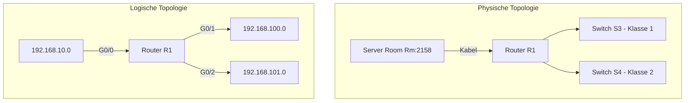
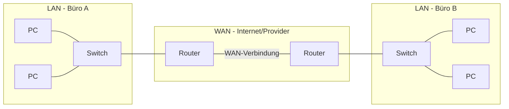
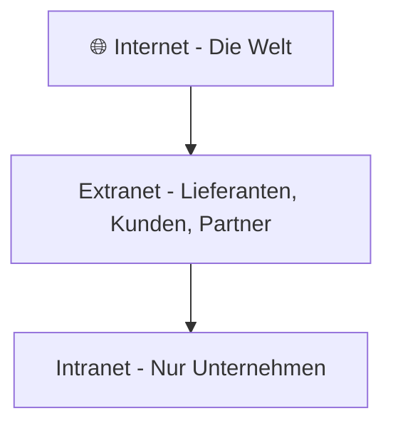
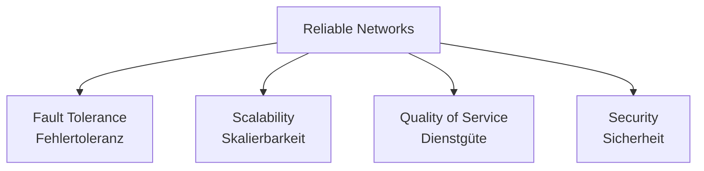
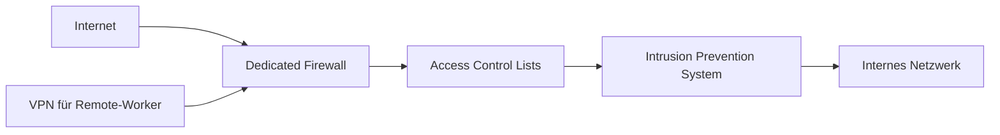
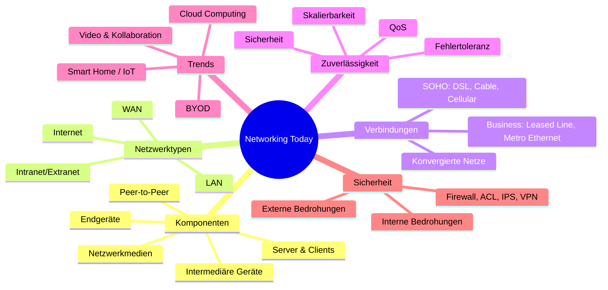

Kommunikation ist für den Menschen fast so grundlegend wie Nahrung, Wasser oder Unterkunft. In der heutigen Welt verbinden uns Netzwerke auf eine Art und Weise, die zuvor nie möglich war. Advancements in der Netzwerktechnologie schaffen eine Welt ohne Grenzen: Die Unmittelbarkeit der Internetkommunikation fördert globale Gemeinschaften und ermöglicht es, dass Menschen und Organisationen weltweit zusammenarbeiten.

Cisco bezeichnet den Einfluss des Internets und von Netzwerken auf Menschen als das **„Human Network"** – die Idee, dass Technologie nicht nur Maschinen, sondern vor allem Menschen miteinander verbindet.

---

## 2. Netzwerkkomponenten

### 2.1 Host-Rollen: Server und Clients

Jeder Computer in einem Netzwerk wird als **Host** oder **Endgerät** bezeichnet. Hosts können zwei Rollen einnehmen:

- **Server**: Stellen Informationen oder Dienste für andere Geräte bereit.
  - E-Mail-Server (verwalten und liefern E-Mails)
  - Webserver (liefern Webseiten)
  - Dateiserver (speichern und teilen Dateien)

- **Clients**: Senden Anfragen an Server, um Informationen zu empfangen.
  - Browser ruft eine Webseite vom Webserver ab
  - E-Mail-Programm ruft E-Mails vom E-Mail-Server ab

> **Warum diese Trennung?** Server sind optimiert für hohe Verfügbarkeit, Datensicherheit und die gleichzeitige Bedienung vieler Clients. Clients sind optimiert für die Benutzerschnittstelle. Diese Arbeitsteilung macht Netzwerke effizient und skalierbar.

### 2.2 Peer-to-Peer-Netzwerke

In einem **Peer-to-Peer (P2P) Netzwerk** kann ein Gerät gleichzeitig Client und Server sein. Dies eignet sich nur für sehr kleine Netzwerke.

| Vorteile | Nachteile |
|---|---|
| Einfach einzurichten | Keine zentrale Administration |
| Geringere Komplexität | Weniger sicher |
| Geringere Kosten | Nicht skalierbar |
| Geeignet für einfache Aufgaben (Datei- und Druckerfreigabe) | Langsamere Performance |

> **Warum kein P2P in großen Netzwerken?** Ohne zentrale Verwaltung ist es schwierig, Sicherheitsrichtlinien durchzusetzen, Backups zu koordinieren und die Leistung zu überwachen. Bei hunderten von Geräten wäre der Verwaltungsaufwand enorm.

### 2.3 Endgeräte (End Devices)

Ein **Endgerät** ist der Ursprung oder das Ziel einer Nachricht. Daten entstehen auf einem Endgerät, fließen durch das Netzwerk und kommen an einem anderen Endgerät an. Beispiele: PCs, Laptops, Smartphones, Drucker, IP-Telefone.

### 2.4 Intermediäre Netzwerkgeräte

**Intermediäre Geräte** verbinden Endgeräte miteinander und übernehmen die Datenverwaltung im Netzwerk:

- **Switch (LAN-Switch)**: Verbindet Geräte innerhalb eines lokalen Netzwerks
- **Router**: Verbindet verschiedene Netzwerke und leitet Datenpakete weiter
- **Wireless Router / Access Point**: Ermöglicht drahtlose Verbindungen
- **Firewall Appliance**: Schützt das Netzwerk vor unautorisierten Zugriffen
- **Multilayer Switch**: Kombiniert Switching- und Routing-Funktionen

Aufgaben intermediärer Geräte:
- Datensignale regenerieren und weiterübertragen
- Informationen über vorhandene Netzwerkpfade verwalten
- Andere Geräte über Fehler und Kommunikationsausfälle informieren

### 2.5 Netzwerkmedien (Network Media)

Kommunikation in einem Netzwerk wird durch ein **Medium** übertragen:

| Medientyp | Funktionsprinzip |
|---|---|
| Metalldrähte (Kupferkabel) | Elektrische Impulse |
| Glasfaser-/Plastikfaserkabel | Lichtimpulse |
| Drahtlose Übertragung | Modulation elektromagnetischer Wellen |

> **Warum verschiedene Medien?** Kupferkabel sind günstig und einfach zu installieren, aber anfällig für elektromagnetische Störungen und haben begrenzte Reichweite. Glasfaser überträgt Daten mit Lichtgeschwindigkeit über große Distanzen und ist immun gegen elektrische Störungen. Wireless ermöglicht Mobilität, ist aber störanfälliger und hat begrenzte Bandbreite.

---

## 3. Netzwerkdarstellungen und Topologien

### 3.1 Netzwerkdarstellungen (Network Representations)

Netzwerkdiagramme – auch **Topologiediagramme** genannt – verwenden standardisierte Symbole, um Geräte und Verbindungen darzustellen.

Wichtige Begriffe:
- **NIC (Network Interface Card)**: Die Netzwerkkarte, die ein Gerät mit dem Netzwerk verbindet
- **Physical Port**: Der physische Anschluss am Gerät (z. B. RJ-45-Buchse)
- **Interface**: Kann sich auf einen physischen Port oder eine logische Schnittstelle beziehen; die Begriffe werden oft synonym verwendet

### 3.2 Topologiediagramme

Es gibt zwei Arten:

**Physische Topologie:**
- Zeigt die physische Position der Geräte und die Kabelverlegung
- Wichtig für die Installation und Wartung der Hardware

**Logische Topologie:**
- Zeigt Geräte, Ports und das Adressierungsschema des Netzwerks
- Wichtig für die Konfiguration und Fehlersuche

---

## 4. Netzwerktypen

### 4.1 Netzwerke nach Größe

| Typ | Beschreibung |
|---|---|
| **Small Home Network** | Verbindet wenige Computer untereinander und mit dem Internet |
| **SOHO (Small Office/Home Office)** | Ermöglicht Verbindung zu einem Unternehmensnetzwerk von Zuhause/Büro |
| **Medium to Large Network** | Viele Standorte mit hunderten oder tausenden vernetzten Computern |
| **World Wide Network** | Verbindet hunderte Millionen Computer weltweit (Internet) |

### 4.2 LAN vs. WAN

Die zwei häufigsten Netzwerktypen:

**LAN (Local Area Network):**
- Überspannt ein kleines geografisches Gebiet (Haus, Schule, Bürogebäude, Campus)
- Wird typischerweise von einer einzelnen Organisation oder Person verwaltet
- Bietet hohe Bandbreite für Endgeräte und intermediäre Geräte

**WAN (Wide Area Network):**
- Verbindet LANs über große geografische Entfernungen (Städte, Länder)
- Wird typischerweise von mehreren Dienstanbietern verwaltet
- Bietet langsamere Verbindungsgeschwindigkeiten zwischen LANs

> **Warum ist die Unterscheidung wichtig?** LAN und WAN haben unterschiedliche Technologien, Kosten und Verwaltungsstrukturen. Ein Unternehmen mit mehreren Standorten muss WAN-Technologien einsetzen, um seine LANs zu verbinden – das ist teurer und komplexer als ein einzelnes LAN.

### 4.3 Das Internet

Das **Internet** ist eine weltweite Sammlung miteinander verbundener LANs und WANs. Es gehört niemandem – verschiedene Organisationen helfen, Struktur und Standards zu erhalten:

- **IETF** (Internet Engineering Task Force): Entwickelt technische Standards
- **ICANN** (Internet Corporation for Assigned Names and Numbers): Verwaltet Domainnamen und IP-Adressen
- **IAB** (Internet Architecture Board): Überwacht die technische und strategische Entwicklung

### 4.4 Intranet und Extranet

- **Intranet**: Privates Netzwerk (LANs und WANs) innerhalb einer Organisation, nur für autorisierte Mitglieder zugänglich
- **Extranet**: Ermöglicht externen Partnern (Lieferanten, Kunden) sicheren, kontrollierten Zugriff auf Teile des Unternehmensnetzwerks

---

## 5. Internetverbindungen

### 5.1 Heimanwender und kleine Büros (SOHO)

| Verbindungstyp | Beschreibung |
|---|---|
| **Cable (Kabel)** | Hohe Bandbreite, immer verfügbar, über Kabelfernsehinfrastruktur |
| **DSL (Digital Subscriber Line)** | Hohe Bandbreite, immer verfügbar, über Telefonleitung |
| **Cellular (Mobilfunk)** | Nutzung des Mobilfunknetzes |
| **Satellite** | Ideal für ländliche Gebiete ohne andere Anbieter |
| **Dial-up Telephone** | Günstig, aber sehr geringe Bandbreite, über Telefonmodem |

### 5.2 Geschäftliche Internetverbindungen

Unternehmen benötigen höhere Bandbreiten, dedizierte Verbindungen und verwaltete Dienste:

| Verbindungstyp | Beschreibung |
|---|---|
| **Dedicated Leased Line** | Reservierte Leitungen beim Provider für private Daten-/Sprachverbindungen zwischen Büros |
| **Ethernet WAN (Metro Ethernet)** | Erweiterung der LAN-Technologie ins WAN |
| **Business DSL (z. B. SDSL)** | Symmetrische DSL für Unternehmen |
| **Satellite** | Wenn keine kabelgebundene Lösung verfügbar ist |

### 5.3 Konvergierte Netzwerke

**Vor der Konvergenz** hatte eine Organisation getrennte Leitungsnetze für:
- Computerdaten
- Telefonie
- Video/Broadcast

Jedes Netz hatte eigene Technologien, Regeln und Standards.

**Konvergierte Netzwerke** tragen mehrere Dienste über eine einzige Infrastruktur:
- Daten, Sprache und Video über dasselbe Netz
- Eine einheitliche Regel- und Standardbasis

> **Warum Konvergenz?** Es ist wesentlich kostengünstiger, eine einzige Netzwerkinfrastruktur zu betreiben als drei separate. Außerdem vereinfacht es die Administration und ermöglicht neue integrierte Dienste (z. B. Unified Communications).

---

## 6. Zuverlässige Netzwerke (Reliable Networks)

### 6.1 Netzwerkarchitektur

**Netzwerkarchitektur** bezeichnet die Technologien, die die Infrastruktur unterstützen, die Daten über das Netzwerk bewegt. Vier grundlegende Eigenschaften müssen erfüllt sein:

### 6.2 Fehlertoleranz (Fault Tolerance)

Ein fehlertolerantes Netzwerk **begrenzt die Auswirkungen eines Ausfalls**, indem es die Anzahl der betroffenen Geräte minimiert. Dies wird durch **Redundanz** erreicht:

- **Paketvermittlung (Packet Switching)**: Daten werden in Pakete aufgeteilt, die unabhängig voneinander geroutet werden. Jedes Paket kann theoretisch einen anderen Pfad nehmen.
- **Redundante Pfade**: Wenn ein Pfad ausfällt, können Pakete über alternative Wege geleitet werden.

Im Gegensatz dazu steht die **Leitungsvermittlung (Circuit Switching)**, bei der dedizierte Verbindungen aufgebaut werden – fällt die Leitung aus, ist die gesamte Verbindung unterbrochen.

> **Warum Paketvermittlung?** Das Internet wurde ursprünglich für militärische Anwendungen entwickelt, bei denen das Netzwerk auch nach Teilausfällen funktionieren musste. Paketvermittlung ermöglicht genau das.

### 6.3 Skalierbarkeit (Scalability)

Ein **skalierbares Netzwerk** kann schnell und einfach wachsen, um neue Benutzer und Anwendungen zu unterstützen, **ohne die Leistung für bestehende Nutzer zu beeinträchtigen**.

Netzwerkdesigner folgen akzeptierten Standards und Protokollen, um Skalierbarkeit zu gewährleisten. Das bedeutet: Neue Geräte und Netzwerke können hinzugefügt werden, ohne das bestehende System zu destabilisieren.

### 6.4 Dienstgüte (Quality of Service – QoS)

**QoS** ist der primäre Mechanismus, der die zuverlässige Bereitstellung von Inhalten sicherstellt. Nicht alle Datenpakete sind gleich wichtig:

- **VoIP-Telefonate**: Erfordern geringe Latenz und jitter-freie Übertragung
- **Live-Video**: Benötigt garantierte Bandbreite
- **Webseiten**: Können kurze Verzögerungen tolerieren

Mit einer QoS-Richtlinie kann ein Router den Datenfluss priorisieren:
- Sprachpakete erhalten höhere Priorität
- Webdaten erhalten niedrigere Priorität

> **Warum QoS?** Ohne QoS behandelt das Netzwerk alle Pakete gleich. In Stoßzeiten können zeitkritische Anwendungen wie VoIP unterbrochen werden, während unkritische Downloads dieselbe Bandbreite beanspruchen.

### 6.5 Netzwerksicherheit (Network Security)

Zwei Hauptbereiche der Netzwerksicherheit:

**1. Infrastruktursicherheit:**
- Physische Sicherheit der Netzwerkgeräte
- Verhinderung unautorisierten Zugriffs auf die Geräte

**2. Informationssicherheit:**
- Schutz der über das Netzwerk übertragenen Daten

**Drei Sicherheitsziele (CIA-Triade):**
- **Confidentiality (Vertraulichkeit)**: Nur berechtigte Empfänger können Daten lesen
- **Integrity (Integrität)**: Sicherstellung, dass Daten während der Übertragung nicht verändert wurden
- **Availability (Verfügbarkeit)**: Sicherstellung des zuverlässigen und rechtzeitigen Zugriffs für autorisierte Benutzer

---

## 7. Netzwerktrends

### 7.1 BYOD (Bring Your Own Device)

**BYOD** erlaubt es Benutzern, ihre eigenen Geräte zu verwenden und gibt ihnen mehr Flexibilität. BYOD bedeutet: **jedes Gerät, jeder Eigentümer, überall**.

Unterstützte Geräte: Laptops, Netbooks, Tablets, Smartphones, E-Reader

> **Herausforderungen durch BYOD:** IT-Abteilungen müssen heterogene Geräte verwalten und sichern, ohne die vollständige Kontrolle über die Hardware zu haben. Dies erfordert neue Sicherheitskonzepte wie Mobile Device Management (MDM).

### 7.2 Online-Zusammenarbeit

Kollaborationstools ermöglichen das gemeinsame Arbeiten über Netzwerke hinweg:
- **Cisco WebEx**: Videokonferenzen, Bildschirmfreigabe
- **Cisco Webex Teams**: Nachrichten, Bilder, Videos, Links

Kollaboration hat höchste Priorität für Unternehmen und Bildungseinrichtungen.

### 7.3 Videokommunikation

- Videoanrufe sind ortsunabhängig möglich
- Video wird zur kritischen Anforderung für effektive Zusammenarbeit
- **Cisco TelePresence**: Hochwertige Videokonferenzlösung für Unternehmen

### 7.4 Cloud Computing

**Cloud Computing** ermöglicht die Speicherung von Dateien und das Ausführen von Anwendungen auf Servern im Internet.

**Vier Cloud-Typen:**

| Typ | Beschreibung |
|---|---|
| **Public Cloud** | Öffentlich zugänglich, pay-per-use oder kostenlos |
| **Private Cloud** | Für eine spezifische Organisation (z. B. Regierung) |
| **Hybrid Cloud** | Kombination aus Public und Private Cloud |
| **Custom Cloud** | Für spezifische Branchen (z. B. Gesundheitswesen, Medien) |

> **Warum Cloud?** Kleine Unternehmen können teure Infrastruktur meiden und trotzdem auf Enterprise-Dienste zugreifen. Große Unternehmen können ihre IT-Kapazitäten dynamisch skalieren.

### 7.5 Smart Home Technology

Technologie wird in Alltagsgeräte integriert, die dann miteinander kommunizieren können (Internet of Things – IoT). Beispiel: Ein Ofen kommuniziert mit dem Kalender und weiß, wann er mit dem Kochen beginnen soll.

### 7.6 Powerline Networking

**Powerline Networking** ermöglicht Netzwerkverbindungen über das Stromnetz – nützlich, wenn Netzwerkkabel oder WLAN nicht überall verfügbar sind. Ein Standard-Powerline-Adapter sendet Daten auf bestimmten Frequenzen über Steckdosen.

### 7.7 Wireless Broadband

Neben DSL und Kabel gibt es drahtlose Optionen:
- **WISP (Wireless Internet Service Provider)**: Verbindet Abonnenten mit Access Points/Hotspots, häufig in ländlichen Gebieten
- **Wireless Broadband**: Nutzt Mobilfunktechnologie; eine Außenantenne versorgt das Heimnetzwerk

---

## 8. Netzwerksicherheit (Bedrohungen & Lösungen)

### 8.1 Externe Bedrohungen

- Viren, Würmer, Trojanische Pferde
- Spyware und Adware
- Zero-Day-Angriffe
- Denial-of-Service (DoS) Angriffe
- Datenabfangung und -diebstahl
- Identitätsdiebstahl

### 8.2 Interne Bedrohungen

- Verlorene oder gestohlene Geräte
- Versehentlicher Missbrauch durch Mitarbeiter
- Böswillige Mitarbeiter

> **Wichtig:** Interne Nutzer verursachen die meisten Sicherheitsverletzungen! Oft nicht durch bösen Willen, sondern durch Unwissenheit oder Fahrlässigkeit.

### 8.3 Sicherheitslösungen

**Für Heimnetzwerke / kleine Büros:**
- Antiviren- und Antispyware-Software auf Endgeräten
- Firewall-Filterung zur Blockierung unautorisierten Zugriffs

**Für größere Netzwerke zusätzlich:**

| Lösung | Beschreibung |
|---|---|
| **Dedicated Firewall** | Fortgeschrittene Firewall-Funktionen |
| **ACL (Access Control Lists)** | Filtert Zugriff und Traffic-Weiterleitung |
| **IPS (Intrusion Prevention System)** | Erkennt schnell verbreitende Bedrohungen wie Zero-Day-Angriffe |
| **VPN (Virtual Private Network)** | Sicherer Zugriff für Remote-Mitarbeiter |

> **Sicherheitskonzept:** Sicherheit muss in **mehreren Schichten** implementiert werden – kein einzelnes System bietet vollständigen Schutz (Defense in Depth). Die Kombination aus Firewall, IPS, ACL und VPN schafft überlappende Schutzebenen.

---

## 9. Zusammenfassung

Die moderne Vernetzung ist weit mehr als das Verbinden von Kabeln. Es geht um den Aufbau zuverlässiger, sicherer und skalierbarer Infrastrukturen, die Kommunikation, Zusammenarbeit und Innovation ermöglichen. Von kleinen Heimnetzwerken bis hin zu weltweiten Internetverbindungen gelten dieselben Grundprinzipien: Daten müssen zuverlässig, sicher und effizient übertragen werden.
