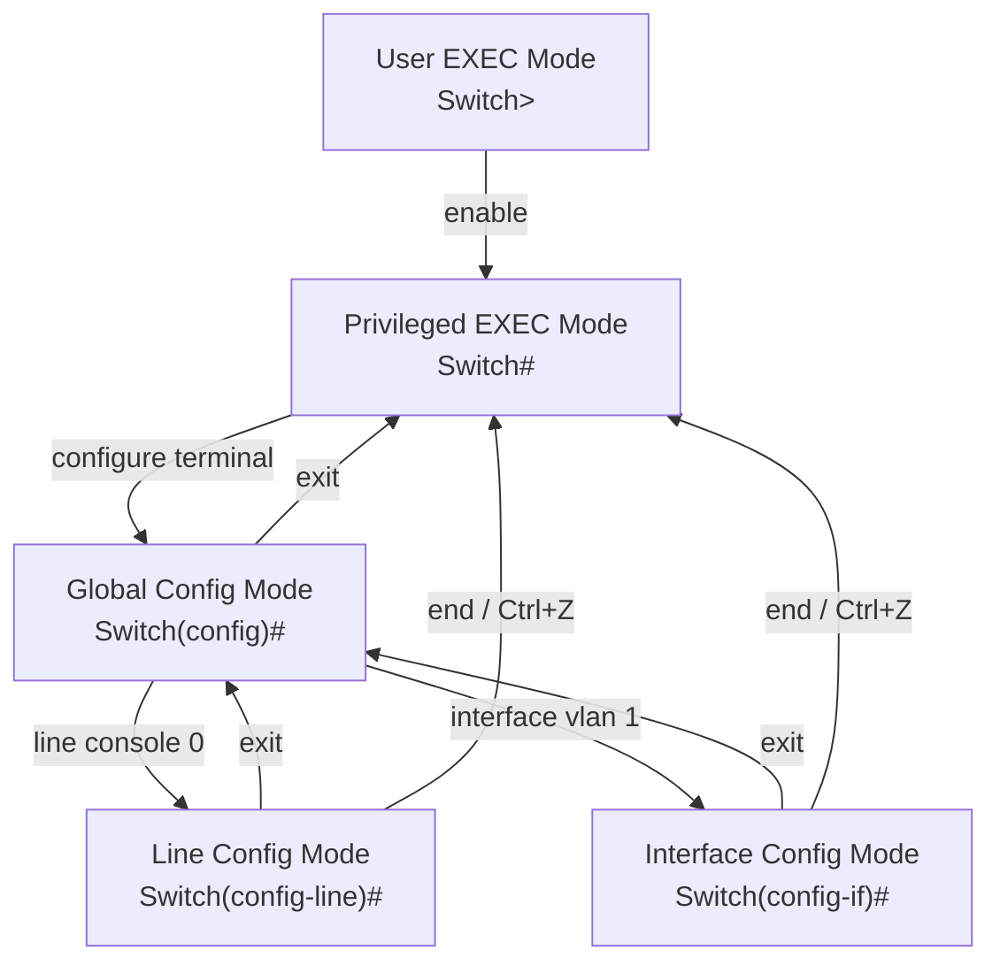
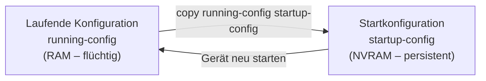
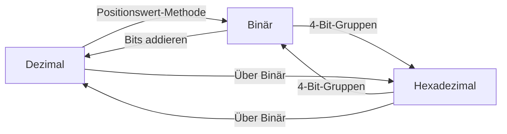

## 1. Betriebssysteme in Netzwerkgeräten

Jedes elektronische Gerät – vom Laptop bis zum Router – benötigt ein **Betriebssystem (OS)**. Das OS ist das Bindeglied zwischen Hardware und dem Benutzer.

Ein Betriebssystem besteht aus drei Schichten:

- **Shell**: Die Benutzeroberfläche (CLI oder GUI), über die Befehle eingegeben werden.
- **Kernel**: Verwaltet die Hardware-Ressourcen und vermittelt zwischen Software und Hardware.
- **Hardware**: Die physische Komponente (Prozessor, Speicher, Netzwerkkarten etc.).

Für Netzwerkgeräte wie Switches, Router, Firewalls und Access Points verwendet Cisco das **Internetwork Operating System (IOS)**. Fun fact: „iOS" ist eigentlich eine eingetragene Marke von Cisco – Apple nutzt den Namen unter Lizenz.

### GUI vs. CLI

| Merkmal | GUI | CLI |
|---|---|---|
| Bedienung | Maus, Icons, Fenster | Tastatur, Texteingabe |
| Benutzerfreundlichkeit | Hoch | Niedriger (Lernkurve) |
| Stabilität | Kann abstürzen/hängen | Robuster, zuverlässiger |
| Netzwerkgeräte | Selten verwendet | Standard |

**Warum CLI?** GUIs können abstürzen oder sich unerwartet verhalten. Für kritische Netzwerkgeräte ist die CLI der Standard – sie ist deterministisch und immer verfügbar, auch wenn das Gerät nur minimal reagiert.

---

## 2. Zugriffsmethoden auf Cisco IOS

Es gibt drei Wege, auf ein Cisco-Gerät zuzugreifen:

### Console
- **Physischer** Managementport (RJ-45 oder USB)
- Wird für die **Erstkonfiguration** verwendet – bevor das Gerät eine IP-Adresse hat
- Direkte Verbindung vom PC zum Gerät mit Konsolenkabel
- Kein Netzwerk nötig

### Secure Shell (SSH)
- **Verschlüsselte** Remote-CLI-Verbindung über das Netzwerk
- **Best Practice**: SSH Version 2 verwenden
- Authentifizierung, Passwörter und Befehle sind verschlüsselt

### Telnet
- **Unverschlüsselte** Remote-CLI-Verbindung
- Alle Daten (inkl. Passwörter!) werden als **Klartext** übertragen
- Sicherheitsrisiko – sollte in Produktivumgebungen **nicht** verwendet werden

> **Merksatz**: Telnet = gefährlich. SSH = sicher. Immer SSH bevorzugen!

### Terminal-Emulationsprogramme
Zum Verbinden mit einem Gerät (über Console oder SSH/Telnet) werden Programme wie **PuTTY**, **Tera Term** oder **SecureCRT** eingesetzt.

---

## 3. IOS-Befehlsmodi – Die Hierarchie

Cisco IOS verwendet eine **hierarchische Befehlsstruktur**. Das bedeutet: Je nach Modus stehen unterschiedliche Befehle zur Verfügung. Man muss erst in den richtigen Modus wechseln, bevor ein Befehl funktioniert.



### User EXEC Mode (`Switch>`)
- Eingeschränkte Überwachungsbefehle (z.B. `ping`, `show version`)
- **Kein** Konfigurieren möglich
- Erkennbar am `>` Zeichen im Prompt

### Privileged EXEC Mode (`Switch#`)
- Zugriff auf **alle** Befehle und Funktionen
- Wechsel mit: `enable`
- Erkennbar am `#` Zeichen im Prompt

### Global Configuration Mode (`Switch(config)#`)
- Konfiguration des gesamten Geräts
- Wechsel mit: `configure terminal`
- Rückkehr mit: `exit`

### Subkonfigurationsmodi
Aus dem Global Config Mode gibt es weitere Modi:

- **Line Configuration Mode** (`Switch(config-line)#`): Konfiguration von Console, SSH, Telnet (VTY), AUX
- **Interface Configuration Mode** (`Switch(config-if)#`): Konfiguration von Switch-Ports oder Router-Interfaces

**Wichtige Navigation:**
- `exit` → eine Ebene zurück
- `end` oder `Ctrl+Z` → direkt zurück zu Privileged EXEC
- Man kann direkt von einem Subkonfigurationsmodus in einen anderen wechseln (z.B. von `config-line` direkt zu `config-if`)

---

## 4. Befehlsstruktur in Cisco IOS

Jeder IOS-Befehl folgt einer klaren Syntax:

```
Prompt  Befehl   Leerzeichen   Schlüsselwort/Argument
Switch> ping                   192.168.10.5
Switch> show                   ip protocols
```

- **Keyword (Schlüsselwort)**: Vordefinierter Parameter des OS (z.B. `ip protocols`)
- **Argument**: Vom Benutzer definierter Wert (z.B. `192.168.10.5`)

### Syntaxkonventionen

| Notation | Bedeutung |
|---|---|
| **fett** | Eingabe genau so wie dargestellt |
| *kursiv* | Benutzer gibt hier einen eigenen Wert an |
| `[x]` | Optionaler Parameter |
| `{x}` | Pflichtangabe |
| `[x {y \| z}]` | Pflicht-Auswahl innerhalb eines optionalen Elements |

### IOS-Hilfe-Funktionen

1. **Context-Sensitive Help** (`?`): Zeigt verfügbare Befehle im aktuellen Modus an
   - `?` alleine → alle Befehle auflisten
   - `sh?` → alle Befehle die mit „sh" beginnen
   - `show ?` → alle Argumente für `show`

2. **Command Syntax Check**: Wenn ein Befehl falsch eingegeben wird, gibt IOS Fehlermeldungen aus:
   - `% Ambiguous command` → zu wenige Zeichen, mehrere Befehle möglich
   - `% Incomplete command` → Befehl unvollständig
   - `% Invalid input detected at '^' marker` → Fehler an der Position `^`

### Hot Keys und Shortcuts

| Tastenkombination | Funktion |
|---|---|
| `Tab` | Befehl autovervollständigen |
| `Ctrl+A` | Zum Zeilenanfang springen |
| `Ctrl+E` | Zum Zeilenende springen |
| `↑` / `Ctrl+P` | Vorherigen Befehl aus History |
| `↓` | Nächsten Befehl aus History |
| `Ctrl+Z` | Zurück zu Privileged EXEC |
| `Ctrl+C` | Konfigurationsmodus beenden |
| `Ctrl+Shift+6` | Laufende Operation abbrechen (DNS, Ping, Traceroute) |

**Abkürzungen**: Befehle können abgekürzt werden, solange sie eindeutig sind. `conf t` statt `configure terminal` – funktioniert, weil nur `configure` mit `conf` beginnt.

---

## 5. Grundkonfiguration von Geräten

### 5.1 Gerätename (Hostname)

Der erste Schritt nach dem Einschalten eines neuen Geräts: **Hostname setzen**. Damit ist das Gerät eindeutig identifizierbar.

```
Switch# configure terminal
Switch(config)# hostname Sw-Floor-1
Sw-Floor-1(config)#
```

**Regeln für Hostnamen:**
- Beginnt mit einem Buchstaben
- Keine Leerzeichen
- Endet mit Buchstabe oder Ziffer
- Nur Buchstaben, Ziffern und Bindestriche
- Maximal 64 Zeichen

Rückgängig machen: `no hostname`

### 5.2 Passwörter konfigurieren

Passwörter sind der erste Verteidigungswall. Alle Zugangswege müssen abgesichert werden.

**Passwort-Richtlinien:**
- Mindestens 8 Zeichen
- Kombination aus Groß-/Kleinbuchstaben, Zahlen und Sonderzeichen
- Nicht dasselbe Passwort für alle Geräte
- Keine Wörterbuchwörter

#### Console-Zugang absichern
```
Sw-Floor-1(config)# line console 0
Sw-Floor-1(config-line)# password cisco
Sw-Floor-1(config-line)# login
Sw-Floor-1(config-line)# end
```

#### Privileged EXEC absichern
```
Sw-Floor-1(config)# enable secret class
```
> `enable secret` speichert das Passwort **verschlüsselt** (MD5). `enable password` speichert im Klartext – daher immer `enable secret` verwenden!

#### VTY-Leitungen (SSH/Telnet) absichern
```
Sw-Floor-1(config)# line vty 0 15
Sw-Floor-1(config-line)# password cisco
Sw-Floor-1(config-line)# login
Sw-Floor-1(config-line)# end
```
VTY-Leitungen (Virtual TeleType) ermöglichen Remote-Zugriff. Cisco Switches unterstützen bis zu 16 VTY-Leitungen (0–15).

### 5.3 Passwörter verschlüsseln

Standardmäßig sind viele Passwörter in der Konfigurationsdatei im **Klartext** gespeichert. Mit einem einzigen Befehl werden alle Klartextpasswörter verschlüsselt:

```
Sw-Floor-1(config)# service password-encryption
```

Überprüfung mit `show running-config` – Passwörter erscheinen nun als verschlüsselte Zeichenketten (z.B. `password 7 094F471A1A0A`).

### 5.4 Banner-Meldungen

Bannermeldungen warnen unbefugte Personen vor einem Zugriff. Sie sind auch rechtlich wichtig – ohne Warnung kann ein unbefugter Zugriff schwerer geahndet werden.

```
Sw-Floor-1(config)# banner motd #Authorized Access Only!#
```

Das `#` ist das Trennzeichen (Delimiter) – es markiert Anfang und Ende der Nachricht.

---

## 6. Konfigurationen speichern

### Die zwei Konfigurationsdateien



| Datei | Speicherort | Eigenschaft |
|---|---|---|
| `running-config` | RAM | Aktuell aktiv; geht bei Neustart verloren |
| `startup-config` | NVRAM | Wird beim Booten geladen; bleibt erhalten |

**Konfiguration speichern:**
```
Switch# copy running-config startup-config
```

**Konfiguration zurücksetzen:**
```
Switch# erase startup-config
Switch# reload
```

**Unerwünschte Änderungen rückgängig machen** (ohne Speichern): `reload` – lädt die letzte gespeicherte `startup-config` neu.

### Konfiguration in Textdatei exportieren

Mit PuTTY oder Tera Term kann man die Ausgabe von `show running-config` in eine Textdatei loggen. Diese Datei dient als Backup und Dokumentation.

---

## 7. IP-Adressen und Netzwerkkonfiguration

### IPv4

IPv4-Adressen sind **32-Bit-Werte**, dargestellt in **Dotted Decimal Notation** (vier Dezimalzahlen, getrennt durch Punkte, je 0–255).

Für die Kommunikation benötigt ein Gerät:
- **IP-Adresse**: Eindeutige Identifikation im Netzwerk (z.B. `192.168.1.10`)
- **Subnetzmaske**: Trennt Netzwerk- und Hostteil (z.B. `255.255.255.0`)
- **Default Gateway**: IP-Adresse des Routers für Verbindungen außerhalb des lokalen Netzes

### IPv6

IPv6-Adressen sind **128-Bit-Werte**, dargestellt in **Hexadezimalnotation** (acht Gruppen zu je vier Hex-Ziffern, getrennt durch Doppelpunkte):

```
2001:0db8:acad:0010:0000:0000:0000:0010
```

### IP-Adresse manuell konfigurieren (Windows)
- Systemsteuerung → Netzwerk → Adaptereinstellungen → Rechtsklick → Eigenschaften → TCP/IPv4

### DHCP (Automatische Konfiguration)
Geräte können ihre IP-Adresse automatisch von einem **DHCP-Server** beziehen (Dynamic Host Configuration Protocol). Standardmäßig sind die meisten Endgeräte auf DHCP eingestellt.

Für IPv6 gibt es **DHCPv6** und **SLAAC** (Stateless Address Autoconfiguration).

### Switch Virtual Interface (SVI)

Ein Layer-2-Switch hat keine physische Ethernet-Schnittstelle, der man eine IP-Adresse geben kann. Um einen Switch remote verwalten zu können, wird ein **Switch Virtual Interface (SVI)** konfiguriert – standardmäßig VLAN 1.

```
Switch# configure terminal
Switch(config)# interface vlan 1
Switch(config-if)# ip address 192.168.1.20 255.255.255.0
Switch(config-if)# no shutdown
```

> **Wichtig**: Die IP-Adresse des SVI dient **nur** der Fernverwaltung. Der Switch funktioniert auch ohne IP-Adresse – er leitet dann einfach nur Frames weiter.

---

## 8. Zahlensysteme

Netzwerktechniker müssen mit **drei Zahlensystemen** umgehen können: Dezimal (für Menschen), Binär (für Maschinen) und Hexadezimal (für IPv6 und MAC-Adressen).

### 8.1 Binärsystem (Basis 2)

Computer und Netzwerkgeräte arbeiten intern nur mit **Bits** (0 und 1). IPv4-Adressen sind im Kern 32-Bit-Binärzahlen.

#### Positionale Notation

Das Binärsystem funktioniert wie das Dezimalsystem – jede Position hat einen Stellenwert, aber zur Basis 2 statt 10.

| Position | 7 | 6 | 5 | 4 | 3 | 2 | 1 | 0 |
|---|---|---|---|---|---|---|---|---|
| Stellenwert | 128 | 64 | 32 | 16 | 8 | 4 | 2 | 1 |

**Merkhilfe**: 128 – 64 – 32 – 16 – 8 – 4 – 2 – 1 (jeder Wert ist die Hälfte des vorherigen)

#### Binär → Dezimal

Jedes Bit mit seinem Stellenwert multiplizieren und addieren:

```
11000000 = 1×128 + 1×64 + 0×32 + 0×16 + 0×8 + 0×4 + 0×2 + 0×1
         = 128 + 64 = 192
```

**Beispiel: Vollständige IPv4-Adresse umrechnen**

```
11000000.10101000.00001011.00001010
→ 192    . 168    . 11     . 10
→ 192.168.11.10
```

#### Dezimal → Binär

Algorithmus: Beginne beim größten Stellenwert (128).
- Ist die Zahl ≥ Stellenwert? → schreibe **1**, subtrahiere den Stellenwert
- Ist die Zahl < Stellenwert? → schreibe **0**, gehe weiter

**Beispiel: 168 in Binär**

```
168 ≥ 128? Ja → 1, Rest: 40
 40 ≥  64? Nein → 0
 40 ≥  32? Ja → 1, Rest: 8
  8 ≥  16? Nein → 0
  8 ≥   8? Ja → 1, Rest: 0
  0 ≥   4? Nein → 0
  0 ≥   2? Nein → 0
  0 ≥   1? Nein → 0

Ergebnis: 10101000
```

### 8.2 Hexadezimalsystem (Basis 16)

Hexadezimal (Hex) verwendet 16 Symbole: **0–9** und **A–F**.

| Dezimal | Binär | Hex |
|---|---|---|
| 0 | 0000 | 0 |
| 9 | 1001 | 9 |
| 10 | 1010 | A |
| 11 | 1011 | B |
| 12 | 1100 | C |
| 13 | 1101 | D |
| 14 | 1110 | E |
| 15 | 1111 | F |

**Warum Hex?** Ein einzelnes Hex-Zeichen repräsentiert exakt **4 Bits**. Das macht Hex zur kompakten Darstellung von binären Werten – besonders für IPv6 und MAC-Adressen.

#### Hex und IPv6

IPv6-Adressen sind 128 Bit lang → 32 Hex-Zeichen, in 8 Gruppen (Hextets) zu je 4 Zeichen:

```
2001:0db8:acad:0010:0000:0000:0000:0010
```

#### Dezimal → Hexadezimal

1. Dezimalzahl → 8-Bit-Binär umwandeln
2. Binär in 4-Bit-Gruppen aufteilen (von rechts)
3. Jede 4-Bit-Gruppe → Hex-Zeichen

**Beispiel: 168 → Hex**
```
168 → 10101000 (Binär)
    → 1010 | 1000
    → A    | 8
    → A8
```

#### Hexadezimal → Dezimal

1. Jedes Hex-Zeichen → 4-Bit-Binärgruppe
2. Binärgruppen zusammensetzen → 8-Bit-Wert
3. 8-Bit-Binär → Dezimal

**Beispiel: D2 → Dezimal**
```
D = 1101, 2 = 0010
→ 11010010 (Binär)
→ 128+64+16+2 = 210
```

### 8.3 Zusammenfassung: Umrechnungswege



---

## 9. Vollständige Erstkonfiguration eines Switches (Zusammenfassung)

```
Switch> enable
Switch# configure terminal
Switch(config)# hostname Sw-Floor-1
Sw-Floor-1(config)# enable secret class
Sw-Floor-1(config)# line console 0
Sw-Floor-1(config-line)# password cisco
Sw-Floor-1(config-line)# login
Sw-Floor-1(config-line)# exit
Sw-Floor-1(config)# line vty 0 15
Sw-Floor-1(config-line)# password cisco
Sw-Floor-1(config-line)# login
Sw-Floor-1(config-line)# exit
Sw-Floor-1(config)# service password-encryption
Sw-Floor-1(config)# banner motd #Authorized Access Only!#
Sw-Floor-1(config)# interface vlan 1
Sw-Floor-1(config-if)# ip address 192.168.1.1 255.255.255.0
Sw-Floor-1(config-if)# no shutdown
Sw-Floor-1(config-if)# end
Sw-Floor-1# copy running-config startup-config
```

---

## 10. Schlüsselbegriffe

| Begriff | Bedeutung |
|---|---|
| CLI | Command Line Interface – textbasierte Benutzeroberfläche |
| GUI | Graphical User Interface – grafische Benutzeroberfläche |
| IOS | Internetwork Operating System (Cisco) |
| SSH | Secure Shell – verschlüsselter Remote-Zugriff |
| Telnet | Unverschlüsselter Remote-Zugriff (unsicher!) |
| Console | Physischer Managementport |
| VTY | Virtual TeleType – virtuelle Leitungen für Remote-Zugriff |
| SVI | Switch Virtual Interface – virtuelles Interface für Switch-Management |
| DHCP | Dynamic Host Configuration Protocol – automatische IP-Vergabe |
| NVRAM | Non-Volatile RAM – speichert startup-config dauerhaft |
| Oktet | 8-Bit-Gruppe in einer IPv4-Adresse |
| Hextet | 16-Bit-Gruppe (4 Hex-Zeichen) in einer IPv6-Adresse |
| Positionale Notation | Stellenwert-basiertes Zahlensystem |
