## Lernziele

Nach diesem Modul kannst du erklären:
- Welche Regeln für eine erfolgreiche Kommunikation notwendig sind
- Warum Protokolle in der Netzwerkkommunikation unverzichtbar sind
- Den Zweck einer Protokoll-Suite
- Die Rolle von Standardisierungsorganisationen
- Wie das TCP/IP- und das OSI-Modell zur Standardisierung beitragen
- Wie Datenkapselung den Datentransport über Netzwerke ermöglicht
- Wie lokale Hosts auf lokale Ressourcen zugreifen

---

## 3.1 Die Regeln (The Rules)

### Grundlagen der Kommunikation

Kommunikation – ob zwischen Menschen oder Computern – folgt immer demselben Grundprinzip. Es reicht nicht, einfach eine Verbindung herzustellen. Die beteiligten Parteien müssen sich auch darüber einigen, **wie** sie kommunizieren wollen.

Jede Kommunikation besteht aus drei Elementen:
- **Quelle (Sender):** Wer schickt die Nachricht?
- **Ziel (Empfänger):** Wer empfängt die Nachricht?
- **Kanal (Medium):** Über welchen Weg wird die Nachricht übertragen?

### Kommunikationsprotokoll

Ein **Protokoll** ist eine Menge von Regeln, die festlegen, wie die Kommunikation ablaufen soll. Ohne gemeinsame Protokolle würde die Kommunikation scheitern – ähnlich wie wenn zwei Menschen versuchen, sich zu unterhalten, aber verschiedene Sprachen sprechen und keine gemeinsamen Konventionen haben.

> **Analogie:** Stell dir vor, du bekommst einen Brief auf Portugiesisch, der ohne Absender, ohne Anrede und mit komplett durcheinander gewürfelten Sätzen geschrieben ist. Obwohl Buchstaben und Wörter vorhanden sind, ist die Nachricht kaum verständlich. Protokolle sorgen dafür, dass Nachrichten korrekt formatiert, adressiert und verständlich sind.

### Regelanforderungen

Damit eine Kommunikation gelingt, müssen Protokolle folgende Punkte berücksichtigen:

| Anforderung | Beschreibung |
|---|---|
| Identifizierter Sender und Empfänger | Wer schickt, wer empfängt |
| Gemeinsame Sprache und Grammatik | Ein gemeinsames Format |
| Geschwindigkeit und Timing | Wann und wie schnell wird gesendet |
| Bestätigung / Quittierung | Wurde die Nachricht empfangen? |

### Netzwerkprotokoll-Anforderungen

Für Computer-Netzwerke müssen Protokolle zusätzlich folgende Punkte definieren:

- **Message Encoding:** Wie wird die Information in übertragbare Signale umgewandelt?
- **Message Formatting & Encapsulation:** Welche Struktur hat die Nachricht?
- **Message Size:** Wie groß darf eine Nachricht sein?
- **Message Timing:** Wann und wie schnell darf gesendet werden?
- **Message Delivery Options:** Wie wird die Nachricht zugestellt?

### Message Encoding

**Encoding** (Kodierung) ist der Prozess, bei dem Information in eine für die Übertragung geeignete Form umgewandelt wird. Am Ziel wird dieser Prozess rückgängig gemacht (**Decoding / Dekodierung**).

```
Nachrichtenquelle → Encoder → Transmitter → Übertragungsmedium → Receiver → Decoder → Ziel
```

Beispiel: Ein Text wird in Binärdaten (Bits) umgewandelt, die dann als elektrische, optische oder Funksignale übertragen werden.

### Message Formatting und Kapselung (Encapsulation)

Jede Nachricht muss in einem bestimmten **Format** oder einer bestimmten **Struktur** gesendet werden. Das Format hängt vom Nachrichtentyp und dem verwendeten Kanal ab.

Beispiel: Ein Brief in einem Umschlag hat eine klare Struktur (Absender, Empfänger, Inhalt). Ein IP-Paket hat ebenfalls eine definierte Struktur mit Feldern für Versionsnummer, Quell-IP, Ziel-IP usw.

### Message Size

Nachrichten, die über ein Netzwerk gesendet werden, müssen in **Bits** umgewandelt werden. Diese Bits werden in Muster aus Licht, Ton oder elektrischen Impulsen kodiert. Das Zielsystem muss diese Signale dekodieren, um die ursprüngliche Nachricht zu rekonstruieren. Lange Nachrichten werden dazu in kleinere Pakete aufgeteilt.

### Message Timing

Das Timing von Nachrichten umfasst drei wichtige Aspekte:

- **Flow Control (Flusskontrolle):** Steuert die Datenübertragungsrate. Zu viele Daten auf einmal können einen Empfänger überlasten.
- **Response Timeout:** Definiert, wie lange ein Gerät auf eine Antwort wartet, bevor es erneut sendet oder abbricht.
- **Access Method (Zugriffsverfahren):** Regelt, wer wann senden darf – besonders wichtig bei gemeinsam genutzten Medien. Manche Protokolle verhindern Kollisionen proaktiv, andere lösen sie reaktiv nach dem Auftreten.

### Message Delivery Options

Es gibt drei grundlegende Zustellungsarten:

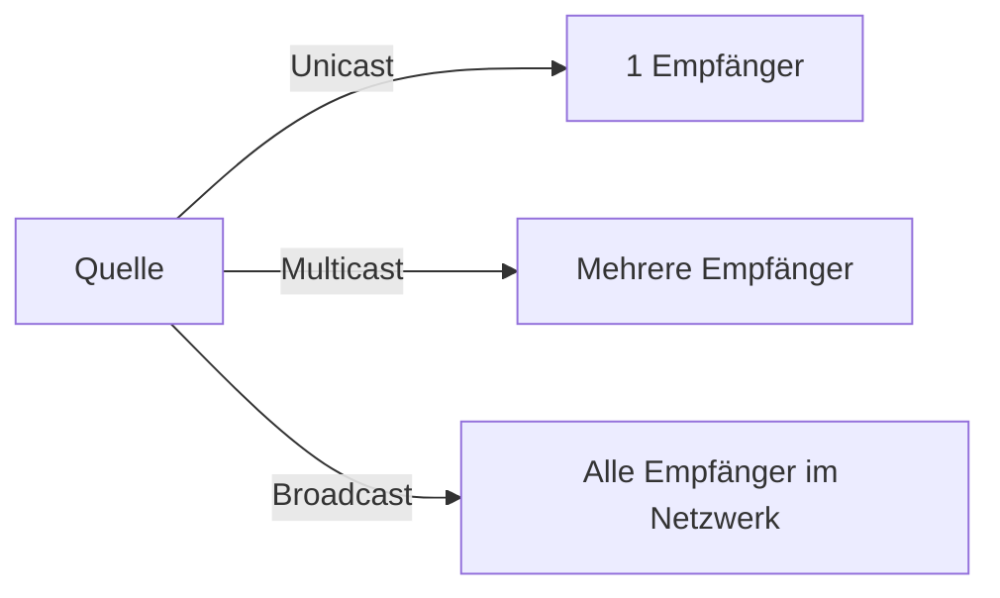

| Methode | Beschreibung | Einsatz |
|---|---|---|
| **Unicast** | Eins-zu-Eins | Normale Kommunikation zwischen zwei Geräten |
| **Multicast** | Eins-zu-Viele (nicht alle) | Streaming, Gruppenadressierung |
| **Broadcast** | Eins-zu-Alle | Nur in IPv4; z.B. ARP-Anfragen |

> **Hinweis:** In IPv6 gibt es keine Broadcasts mehr. Stattdessen wird **Anycast** verwendet, bei dem eine Nachricht an den nächstgelegenen von mehreren Empfängern zugestellt wird.

---

## 3.2 Protokolle

### Überblick über Netzwerkprotokolle

Netzwerkprotokolle definieren einen gemeinsamen Satz von Regeln. Sie können in Software, Hardware oder beidem implementiert werden. Jedes Protokoll hat seine eigene:
- **Funktion** (was es tut)
- **Format** (wie die Daten strukturiert sind)
- **Regeln** (wie es sich verhält)

| Protokolltyp | Beschreibung |
|---|---|
| **Netzwerkkommunikation** | Ermöglicht Kommunikation zwischen zwei oder mehr Geräten |
| **Netzwerksicherheit** | Authentifizierung, Integrität, Verschlüsselung |
| **Routing** | Routen austauschen, vergleichen, besten Weg wählen |
| **Service Discovery** | Automatische Erkennung von Geräten und Diensten |

### Protokoll-Interaktion

In der Realität arbeiten **mehrere Protokolle zusammen**, um eine Kommunikation zu ermöglichen. Beim Aufrufen einer Webseite sind z.B. gleichzeitig folgende Protokolle aktiv:

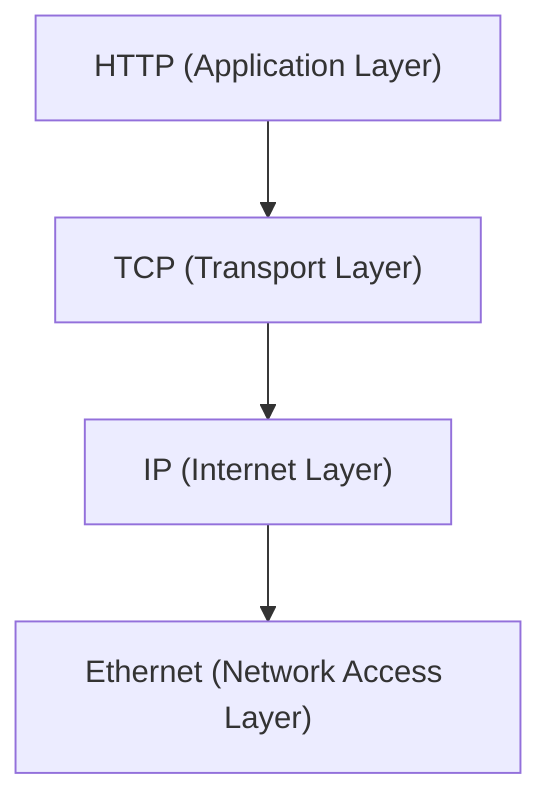

### Funktionen von Netzwerkprotokollen

| Funktion | Beschreibung |
|---|---|
| **Adressierung** | Identifiziert Sender und Empfänger |
| **Zuverlässigkeit** | Garantiert die Zustellung |
| **Flusskontrolle** | Sichert effizienten Datenfluss |
| **Sequenzierung** | Nummeriert übertragene Datensegmente |
| **Fehlererkennung** | Prüft auf Datenverfälschung |
| **Application Interface** | Prozess-zu-Prozess-Kommunikation |

#### Beispiel: HTTP-Anfrage mit TCP/IP

| Protokoll | Funktion |
|---|---|
| **HTTP** | Regelt die Interaktion zwischen Webclient und Webserver; definiert Inhalt und Format |
| **TCP** | Verwaltet einzelne Konversationen, garantiert Zustellung, steuert Fluss |
| **IP** | Transportiert Nachrichten global vom Sender zum Empfänger |
| **Ethernet** | Transportiert Nachrichten von NIC zu NIC im lokalen Netzwerk |

---

## 3.3 Protokoll-Suiten

### Was ist eine Protokoll-Suite?

Eine **Protokoll-Suite** (Protokollstapel) ist eine Gruppe miteinander verbundener Protokolle, die zusammenarbeiten, um eine Kommunikationsfunktion zu erfüllen. Die Protokolle sind in Schichten organisiert:

- **Obere Schichten:** Anwendungsnahe Protokolle (was wird kommuniziert?)
- **Untere Schichten:** Transportieren die Daten und stellen Dienste für obere Schichten bereit

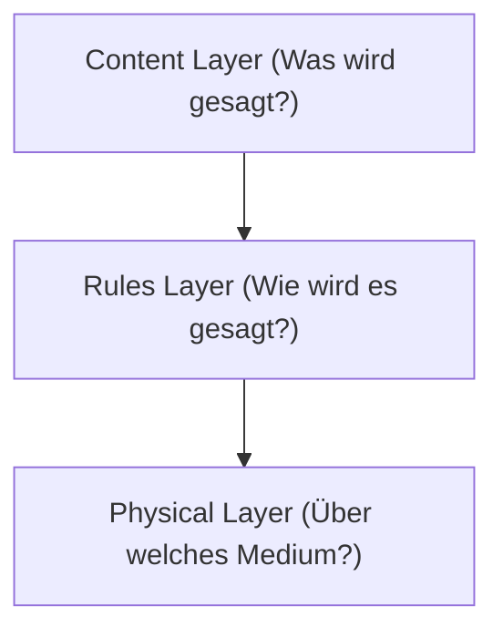

### Evolution der Protokoll-Suiten

Es gibt mehrere bekannte Protokoll-Suiten:

| Suite | Entwickler | Status |
|---|---|---|
| **TCP/IP** | IETF | Offen, weltweiter Standard, dominant |
| **OSI** | ISO / ITU | Referenzmodell, nicht vollständig implementiert |
| **AppleTalk** | Apple Inc. | Proprietär, veraltet |
| **Novell NetWare** | Novell Inc. | Proprietär, veraltet |

### TCP/IP – Die dominante Protokoll-Suite

TCP/IP ist **der** Standard des Internets. Er ist:
- **Offen:** Frei verfügbar, kann von jedem Hersteller verwendet werden
- **Standardbasiert:** Von Standardisierungsorganisationen anerkannt und für Interoperabilität zertifiziert

#### TCP/IP-Schichten und ihre Protokolle

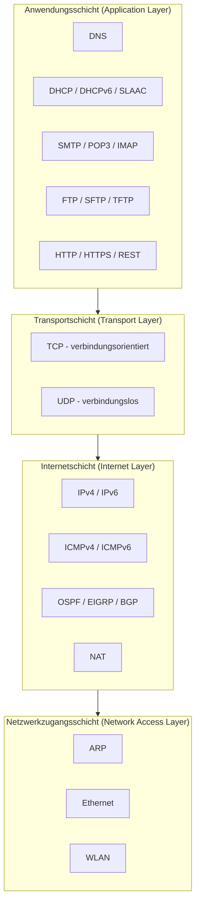

### TCP/IP Kommunikationsprozess

Wenn ein Webserver eine Seite sendet, durchläuft die Nachricht alle Schichten von oben nach unten (**Kapselung**). Beim Empfänger erfolgt der umgekehrte Prozess (**De-Kapselung**).

**Senderseite (Webserver):**
```
Anwendungsdaten → TCP Segment → IP Paket → Ethernet Frame → Bits
```

**Empfängerseite (Client):**
```
Bits → Ethernet Frame → IP Paket → TCP Segment → Anwendungsdaten
```

---

## 3.4 Standardisierungsorganisationen

### Warum offene Standards?

Offene Standards fördern:
- **Interoperabilität:** Produkte verschiedener Hersteller arbeiten zusammen
- **Wettbewerb:** Kein Hersteller hat ein Monopol
- **Innovation:** Alle können auf gemeinsamen Standards aufbauen

Standardisierungsorganisationen sind:
- Herstellerneutral
- Non-Profit-Organisationen
- Mit dem Ziel, offene Standards zu entwickeln und zu fördern

### Internetbezogene Organisationen

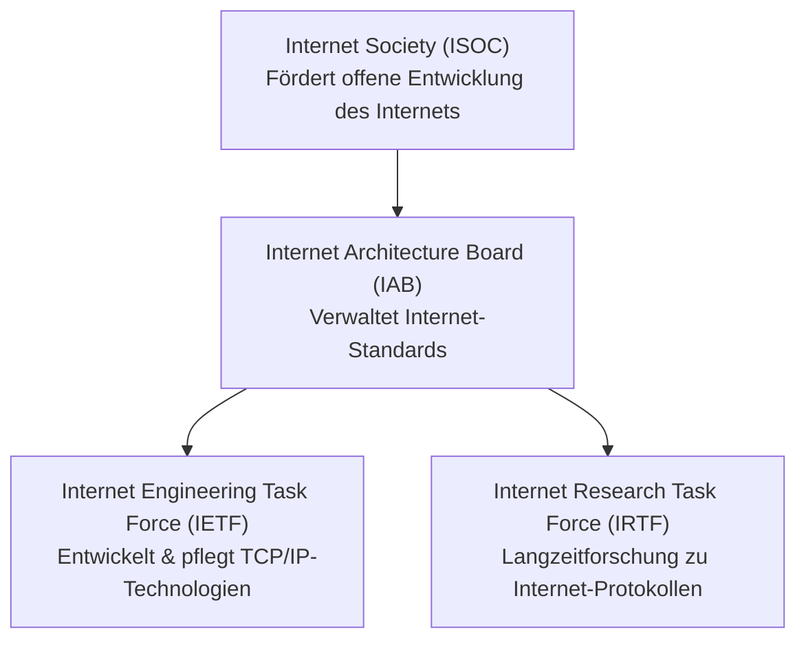

| Organisation | Aufgabe |
|---|---|
| **ISOC** | Fördert die offene Entwicklung und Evolution des Internets |
| **IAB** | Verantwortlich für Management und Entwicklung von Internetstandards |
| **IETF** | Entwickelt, aktualisiert und pflegt Internet- und TCP/IP-Technologien |
| **IRTF** | Langzeitforschung zu Internet- und TCP/IP-Protokollen |
| **ICANN** | Koordiniert IP-Adressvergabe und Domänennamen-Management |
| **IANA** | Überwacht und verwaltet IP-Adressen, Domänennamen und Protokoll-Identifikatoren für ICANN |

### Elektronik- und Kommunikationsstandards

| Organisation | Bereich |
|---|---|
| **IEEE** (I-triple-E) | Energie, Gesundheitswesen, Telekommunikation, **Netzwerke** (z.B. 802.3 Ethernet, 802.11 WLAN) |
| **EIA** | Elektrische Verkabelung, Steckverbinder, 19-Zoll-Racks |
| **TIA** | Funkkommunikation, Mobilfunkantennen, VoIP, Satellitenkommunikation |
| **ITU-T** | Videokompression, IPTV, DSL |

---

## 3.5 Referenzmodelle

### Warum Schichtmodelle?

Netzwerke sind komplex. Ein **Schichtmodell** hilft dabei:
- Komplexe Konzepte verständlich zu erklären
- Protokolldesign zu strukturieren (jede Schicht hat klare Aufgaben)
- Wettbewerb zu fördern (Produkte verschiedener Hersteller arbeiten zusammen)
- Technologieänderungen in einer Schicht von anderen Schichten zu isolieren
- Eine gemeinsame Sprache für Netzwerkfunktionen bereitzustellen

Es gibt zwei wichtige Referenzmodelle:

### OSI-Referenzmodell (Open Systems Interconnection)

Das OSI-Modell hat **7 Schichten** und dient primär als **konzeptuelles Referenzmodell**:

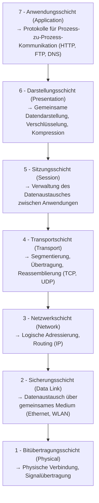

### TCP/IP-Referenzmodell

Das TCP/IP-Modell hat **4 Schichten** und ist das **praktische Implementierungsmodell** des Internets:

| Schicht | Beschreibung |
|---|---|
| **Anwendung (Application)** | Datendarstellung, Encoding, Dialogsteuerung |
| **Transport** | Kommunikation über diverse Netzwerke hinweg |
| **Internet** | Bestmöglichen Pfad durch das Netzwerk finden |
| **Netzwerkzugang (Network Access)** | Steuerung von Hardware und physischen Medien |

### Vergleich: OSI vs. TCP/IP

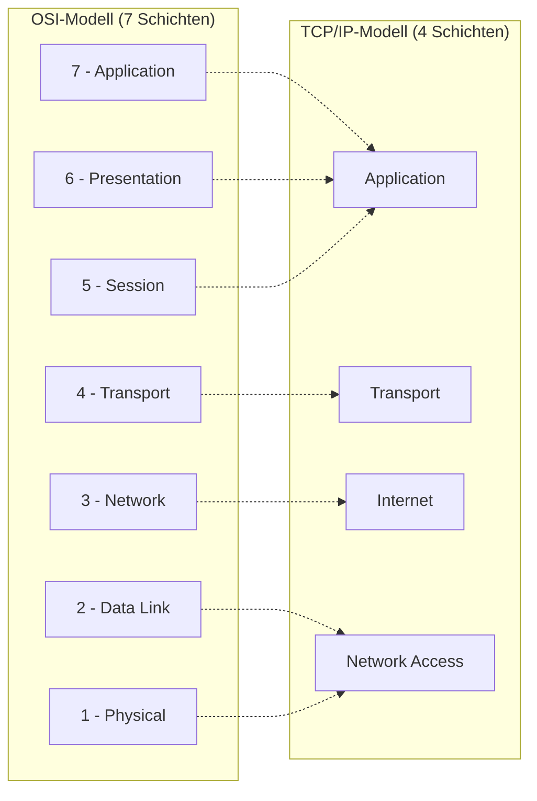

**Wichtige Unterschiede:**
- Das OSI-Modell unterteilt die Anwendungsschicht des TCP/IP-Modells in 3 Schichten (Application, Presentation, Session)
- Das OSI-Modell unterteilt die Netzwerkzugangsschicht in 2 Schichten (Data Link, Physical)
- TCP/IP definiert keine spezifischen Protokolle für die physische Übertragung (überlässt dies dem jeweiligen Medium)
- OSI Schichten 1 und 2 beschreiben die notwendigen Verfahren für den Medienzugriff und die physische Datenübertragung

---

## 3.6 Datenkapselung (Data Encapsulation)

### Segmentierung von Nachrichten

Große Datenmengen werden vor der Übertragung in kleinere **Segmente** aufgeteilt. Dies hat zwei Hauptvorteile:

1. **Erhöhte Geschwindigkeit:** Große Datenmenge können übertragen werden, ohne die Leitung vollständig zu blockieren. Andere Kommunikation kann dazwischen übertragen werden (**Multiplexing**).
2. **Erhöhte Effizienz:** Falls ein Segment verloren geht, muss nur dieses neu übertragen werden, nicht die gesamten Daten.

**Multiplexing** = das Verschachteln mehrerer Datenströme von Segmenten auf einem gemeinsamen Übertragungskanal.

### Sequenzierung

**Sequenzierung** ist der Prozess der Nummerierung von Segmenten, damit die Nachricht am Ziel in der richtigen Reihenfolge wieder zusammengesetzt werden kann. Dies wird vom **TCP-Protokoll** übernommen.

> Warum wichtig? Segmente können über unterschiedliche Routen zum Ziel gelangen und in der falschen Reihenfolge ankommen. TCP sorgt dafür, dass sie korrekt zusammengesetzt werden.

### Protocol Data Units (PDU)

**Kapselung** ist der Prozess, bei dem jede Protokollschicht eigene Steuerinformationen (Header/Trailer) zu den Daten hinzufügt.

Auf jeder Ebene des TCP/IP-Stapels erhält die Dateneinheit einen anderen Namen (**PDU – Protocol Data Unit**):

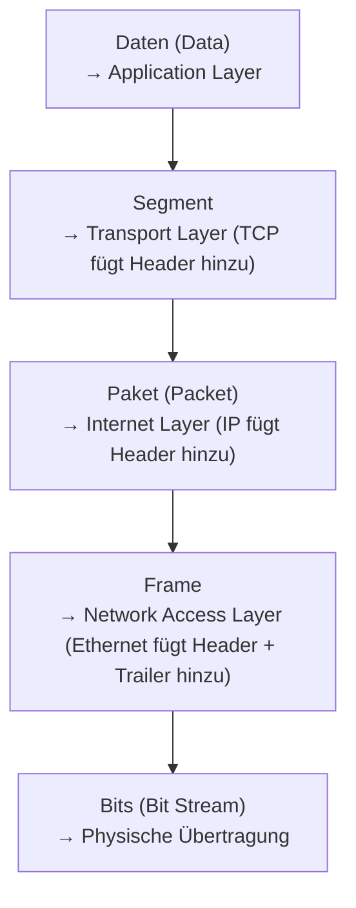

| PDU | Schicht | Enthält |
|---|---|---|
| **Daten** | Anwendung | Originaldaten der Anwendung |
| **Segment** | Transport | TCP/UDP Header + Daten |
| **Paket** | Internet | IP Header + Segment |
| **Frame** | Netzwerkzugang | Ethernet Header + Paket + Trailer |
| **Bits** | Physisch | Binäre Signale |

### Kapselungsprozess (Encapsulation)

Die Kapselung ist ein **Top-Down-Prozess**: Jede Schicht verarbeitet die Daten und gibt sie an die nächste tiefere Schicht weiter.

```
Anwendung:     [          Daten          ]
Transport:     [ TCP Hdr |     Daten     ]    → Segment
Internet:      [ IP Hdr | TCP Hdr | Dat ]    → Paket
Netzwerkzugang: [Eth Hdr | IP Hdr | TCP Hdr | Dat | Eth Trl] → Frame
Physisch:      10110101010010110...             → Bits
```

### De-Kapselungsprozess (De-encapsulation)

Am Empfänger läuft der Prozess umgekehrt ab (**Bottom-Up**): Jede Schicht entfernt ihren Header und gibt die Daten an die nächsthöhere Schicht weiter.

```
Empfangen:     10110101010010110...             ← Bits
Netzwerkzugang: [Eth Hdr | Paket | Eth Trl]    ← Frame (Ethernet-Header wird entfernt)
Internet:      [ IP Hdr | Segment ]             ← Paket (IP-Header wird entfernt)
Transport:     [ TCP Hdr | Daten ]              ← Segment (TCP-Header wird entfernt)
Anwendung:     [         Daten   ]              ← Originaldaten
```

---

## 3.7 Datenzugriff (Data Access)

### Adressen im Netzwerk

Für die Zustellung von Daten vom Sender zum Empfänger werden **zwei Arten von Adressen** verwendet:

| Schicht | Adresstyp | Zweck |
|---|---|---|
| **Netzwerkschicht (Layer 3)** | IP-Adresse (logisch) | Zustellung vom ursprünglichen Sender zum endgültigen Empfänger (global) |
| **Sicherungsschicht (Layer 2)** | MAC-Adresse (physisch) | Zustellung von einer NIC zur nächsten NIC **im selben Netzwerk** (lokal) |

### Layer 3 – Logische IP-Adresse

Ein IP-Paket enthält:
- **Quell-IP-Adresse:** IP des sendenden Geräts
- **Ziel-IP-Adresse:** IP des empfangenden Geräts (Endziel)

Diese Adressen bleiben auf dem gesamten Weg vom Sender zum Empfänger **unverändert** – egal wie viele Router dazwischen liegen.

Eine IP-Adresse besteht aus zwei Teilen:

```
IPv4-Beispiel: 192.168.1.110
               └──────────┘└──┘
               Netzwerkteil   Hostteil

IPv6-Beispiel: 2001:db8:acad::1
               └────────────┘└─┘
               Präfix           Interface ID
```

- **Netzwerkteil / Präfix:** Identifiziert das Netzwerk (gleich für alle Geräte im selben LAN/WAN)
- **Hostteil / Interface ID:** Identifiziert das spezifische Gerät (eindeutig pro Gerät)

### Kommunikation im selben Netzwerk

Wenn Quelle und Ziel **im selben Netzwerk** sind, haben beide die gleiche Netzwerkadresse:

```
PC1:        192.168.1.110  →  Netzwerk: 192.168.1
FTP-Server: 192.168.1.9    →  Netzwerk: 192.168.1
```

In diesem Fall sendet PC1 den Ethernet-Frame direkt mit der **MAC-Adresse des FTP-Servers** als Ziel.

### Kommunikation über verschiedene Netzwerke

Wenn Quelle und Ziel **in verschiedenen Netzwerken** sind:

```
PC1:         192.168.1.110  →  Netzwerk: 192.168.1
Web-Server:  172.16.1.99   →  Netzwerk: 172.16.1
```

Hier kann PC1 den Frame nicht direkt an den Webserver senden. Er muss die Nachricht an das **Default Gateway** (Standardgateway / Router) weiterleiten.

### Die Rolle des Default Gateway

Das **Default Gateway** ist die Router-Schnittstelle, die Teil des lokalen LANs ist und als "Tor" zu allen anderen (entfernten) Netzwerken fungiert. Alle Geräte im LAN müssen die Adresse des Default Gateways kennen.

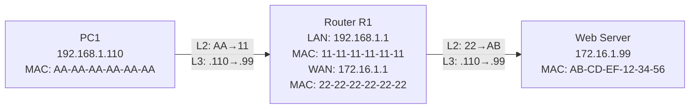

### MAC-Adressen ändern sich, IP-Adressen nicht

Dies ist ein zentrales Konzept: Auf dem Weg vom Sender zum Empfänger über mehrere Router hinweg:

- **L3 IP-Adresse:** Bleibt **konstant** – Quelle und Ziel sind immer PC1 und Webserver
- **L2 MAC-Adresse:** Ändert sich bei **jedem Hop** (Sprung) – immer lokal auf den nächsten Router oder das Ziel

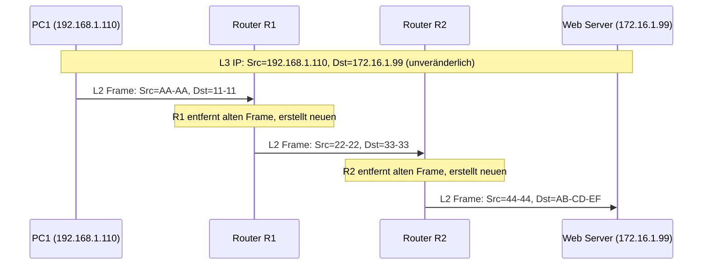

**Zusammenfassung:** L2-Adressierung ist **lokal** (hop-by-hop), L3-Adressierung ist **global** (end-to-end).

---

## Zusammenfassung

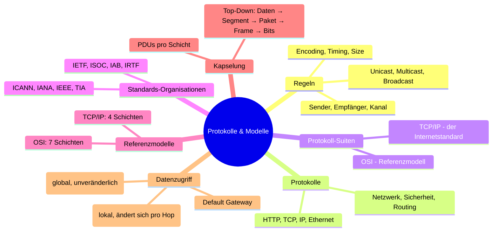

---

## Neue Begriffe

| Begriff | Erklärung |
|---|---|
| **Encoding** | Umwandlung von Information in übertragbare Form |
| **Protokoll** | Regeln für die Kommunikation |
| **Flow Control** | Steuerung der Datenübertragungsrate |
| **Unicast / Multicast / Broadcast** | Zustellungsoptionen für Nachrichten |
| **Protokoll-Suite** | Gruppe zusammenarbeitender Protokolle |
| **Segmentierung** | Aufteilen von Nachrichten in kleinere Einheiten |
| **PDU** | Protocol Data Unit – Datenenheit pro Schicht |
| **Kapselung** | Hinzufügen von Header-Informationen pro Schicht |
| **De-Kapselung** | Entfernen von Header-Informationen beim Empfänger |
| **Default Gateway** | Router-Schnittstelle als Tor zu anderen Netzwerken |
| **MAC-Adresse** | Physische Adresse der Netzwerkkarte (Layer 2) |
| **IP-Adresse** | Logische Netzwerkadresse (Layer 3) |
| **HTTP** | Hypertext Transfer Protocol |
| **TCP** | Transmission Control Protocol |
| **UDP** | User Datagram Protocol |
| **ARP** | Address Resolution Protocol |
| **DHCP** | Dynamic Host Configuration Protocol |
| **DNS** | Domain Name System |
