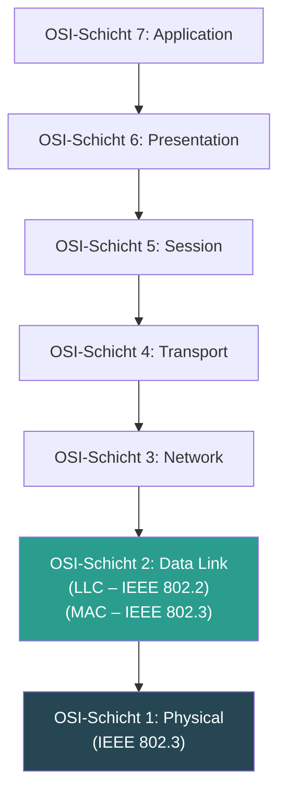
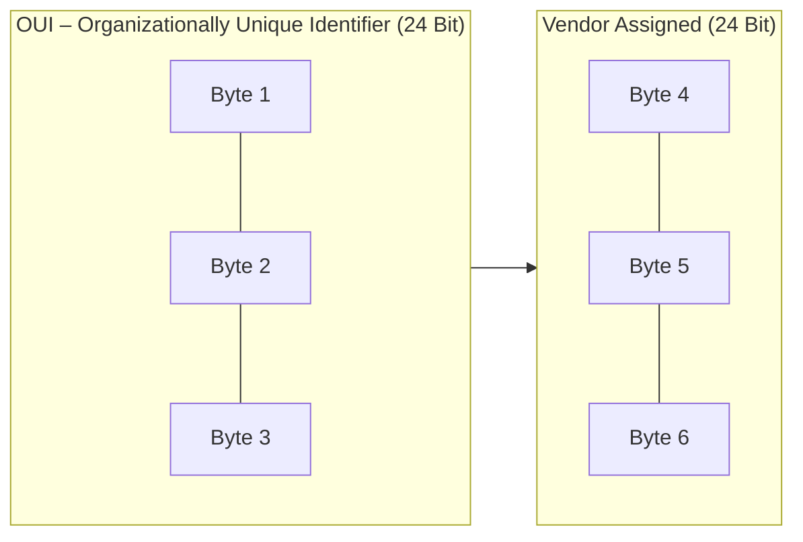
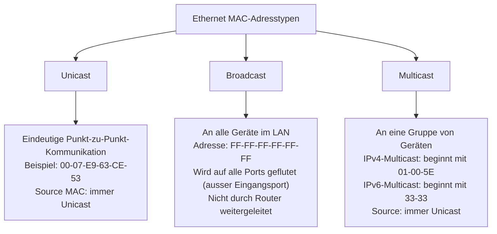
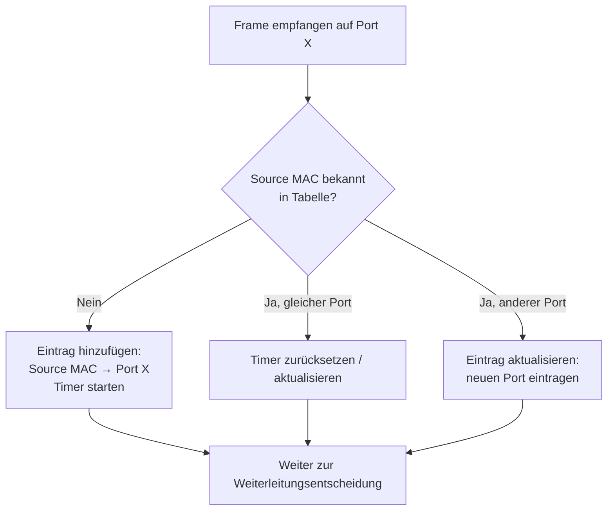
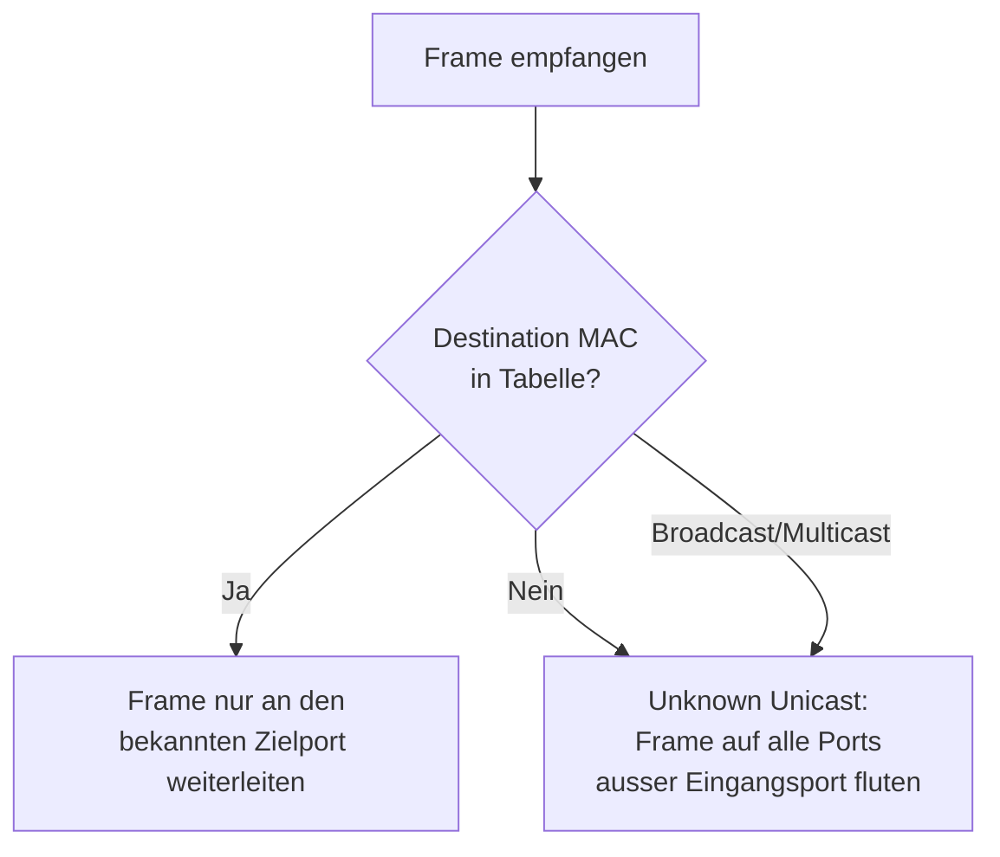
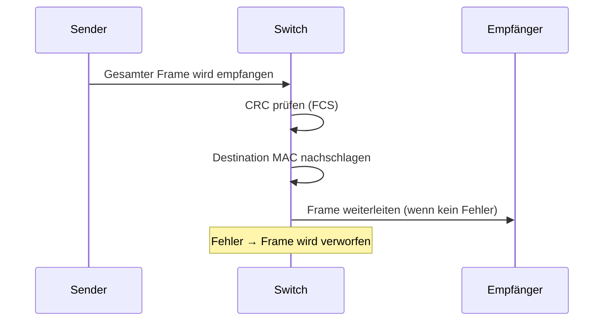
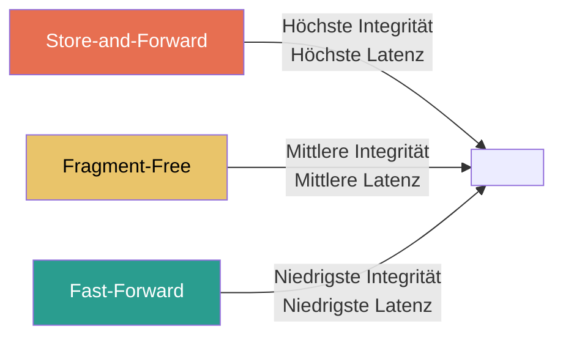
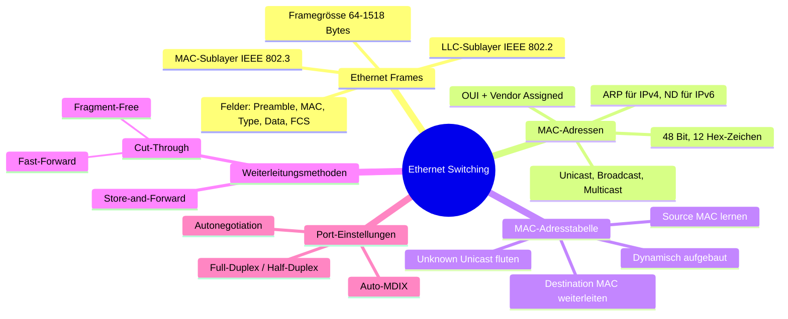

Ethernet ist die dominante Technologie in heutigen lokalen Netzwerken (LANs). Dieses Modul behandelt, wie Ethernet im Kern funktioniert – von der Struktur eines Frames über die Adressierung bis hin zur intelligenten Weiterleitung durch Switches.

---

## 7.1 Ethernet-Frames

### Einordnung im OSI-Modell

Ethernet arbeitet auf zwei Schichten des OSI-Modells gleichzeitig:
- **Schicht 1 (Physical Layer):** Signalübertragung über Kabel oder Glasfaser
- **Schicht 2 (Data Link Layer):** Rahmenbildung, Adressierung und Fehlererkennung

Die relevanten Standards sind **IEEE 802.2** (LLC) und **IEEE 802.3** (MAC/Physical). Ethernet ist also keine einzelne Technologie, sondern eine **Familie von Netzwerkstandards**.



### Die zwei Unterschichten des Data Link Layers

Der Data Link Layer ist in zwei Unterschichten aufgeteilt – dies ist wichtig, um die Aufgaben sauber zu trennen:

| Unterschicht | Standard | Aufgabe |
|---|---|---|
| **LLC (Logical Link Control)** | IEEE 802.2 | Identifiziert das Netzwerkschichtprotokoll im Frame (z. B. IPv4, IPv6) |
| **MAC (Media Access Control)** | IEEE 802.3 / 802.11 / 802.15 | Datenkapslung, Medienzugriffskontrolle, Data-Link-Adressierung |

**Warum diese Trennung?** Die LLC-Schicht ermöglicht es, dass der gleiche MAC-Mechanismus mit verschiedenen Netzwerkprotokollen (IPv4, IPv6, usw.) zusammenarbeiten kann. Die MAC-Schicht hingegen ist eng an das physische Medium gebunden.

### MAC-Sublayer: Datenkapslung

Die IEEE 802.3-Datenkapslung umfasst drei Aspekte:

1. **Ethernet-Frame:** Die interne Struktur, also das Format des Rahmens selbst
2. **Ethernet-Adressierung:** Quell- und Ziel-MAC-Adresse zur Identifikation der Geräte im LAN
3. **Fehlererkennung:** Ein Frame Check Sequence (FCS)-Trailer zur Erkennung von Übertragungsfehlern

### MAC-Sublayer: Medienzugriff

- **Legacy Ethernet** (Bus-Topologie, Hubs): Halbduplex, geteiltes Medium → braucht **CSMA/CD** (Carrier Sense Multiple Access / Collision Detection), um Kollisionen zu behandeln
- **Modernes Ethernet** (mit Switches): **Vollduplex** – jedes Gerät hat eine dedizierte Verbindung zum Switch, Kollisionen sind damit praktisch ausgeschlossen. CSMA/CD wird nicht mehr benötigt.

> **Warum ist das wichtig?** Vollduplex verdoppelt den effektiven Durchsatz, da gleichzeitig gesendet und empfangen werden kann.

### Ethernet-Frame-Felder

Ein Ethernet-Frame hat eine definierte Struktur:

```
+----------------+------------------+-----------------+---------------+---------------+-------+
| Preamble & SFD | Dest. MAC Addr.  | Source MAC Addr.| Type / Length |     Data      |  FCS  |
|    8 Bytes     |     6 Bytes      |     6 Bytes     |    2 Bytes    | 46–1500 Bytes | 4 Bytes|
+----------------+------------------+-----------------+---------------+---------------+-------+
                 |<----------------------- 64–1518 Bytes (ohne Preamble) ------------------>|
```

| Feld | Grösse | Funktion |
|---|---|---|
| **Preamble & SFD** | 8 Bytes | Synchronisierung; Start Frame Delimiter markiert Beginn des Frames |
| **Destination MAC** | 6 Bytes | MAC-Adresse des Empfängers |
| **Source MAC** | 6 Bytes | MAC-Adresse des Senders |
| **Type / Length** | 2 Bytes | Gibt das Protokoll der Nutzlast an (z. B. 0x0800 = IPv4) |
| **Data** | 46–1500 Bytes | Nutzdaten (ggf. mit Padding aufgefüllt auf mind. 46 Bytes) |
| **FCS** | 4 Bytes | Cyclic Redundancy Check (CRC) zur Fehlererkennung |

**Grössenregeln:**
- **Minimum:** 64 Bytes – Frames kleiner als 64 Bytes gelten als *Runt Frame* (Kollisionsfragment) und werden verworfen
- **Maximum:** 1518 Bytes – Frames darüber gelten als *Jumbo Frame* (oder *Baby Giant Frame*) und werden ebenfalls verworfen (sofern nicht explizit unterstützt)
- Die Preamble zählt bei der Grössenangabe **nicht** mit

---

## 7.2 Ethernet-MAC-Adressen

### Hexadezimal und MAC-Adressformat

Eine MAC-Adresse ist ein **48-Bit-Wert**, dargestellt als **12 Hexadezimalzeichen** (also 6 Bytes). Hexadezimal wird verwendet, weil es kompakter als Binär ist und genau ein Nibble (4 Bit) pro Zeichen darstellt.

Beispiele für Darstellungen:
- `00-50-56-C0-00-01` (Windows-Stil mit Bindestrichen)
- `00:50:56:C0:00:01` (Linux-Stil mit Doppelpunkten)
- `0050.56C0.0001` (Cisco-Stil)

Wichtig: Führende Nullen werden immer angezeigt. Binär `0000 1010` = Hexadezimal `0A` (nicht `A`).

### Aufbau der MAC-Adresse



- **OUI (Organizationally Unique Identifier):** Die ersten 3 Bytes (24 Bit) identifizieren den Hersteller. Dieser muss sich bei der IEEE registrieren, um einen eindeutigen OUI-Code zu erhalten.
- **Vendor-Assigned:** Die letzten 3 Bytes (24 Bit) werden vom Hersteller vergeben – eindeutig pro Gerät.

**Warum muss jede MAC-Adresse einzigartig sein?** Im Ethernet-LAN werden Frames anhand der MAC-Adresse direkt an das richtige Gerät zugestellt. Würden zwei Geräte die gleiche Adresse haben, käme es zu Konflikten.

### Frame-Verarbeitung auf dem NIC

Wenn eine Netzwerkkarte (NIC) einen Frame empfängt:
1. Sie liest die **Ziel-MAC-Adresse** des Frames
2. Stimmt sie mit der eigenen MAC-Adresse (gespeichert im ROM) überein → Frame wird nach oben (Richtung OSI-Layer 3) weitergegeben (De-Kapselung)
3. Kein Match → Frame wird **verworfen** (ignoriert)

**Ausnahme:** NICs akzeptieren auch Broadcast- und Multicast-Frames, wenn das Gerät Mitglied der entsprechenden Gruppe ist.

### Unicast, Broadcast und Multicast



#### Unicast MAC-Adresse
- Kommunikation von **einem Sender zu einem Empfänger**
- Zur Auflösung einer IP-Adresse in eine MAC-Adresse wird verwendet:
  - **ARP (Address Resolution Protocol)** bei IPv4
  - **ND (Neighbor Discovery)** bei IPv6

#### Broadcast MAC-Adresse
- Adresse: `FF-FF-FF-FF-FF-FF` (alle 48 Bits sind 1)
- Der Frame wird an **alle Geräte** im LAN gesendet
- Switches fluten den Frame auf **allen Ports ausser dem Eingangsport**
- Router **leiten Broadcasts nicht weiter** (begrenzen damit Broadcast-Domänen)

#### Multicast MAC-Adresse
- Kommunikation an eine **Gruppe von Geräten**
- IPv4-Multicast: Ziel-MAC beginnt mit `01-00-5E`
- IPv6-Multicast: Ziel-MAC beginnt mit `33-33`
- Multicast-Adressen können nur als **Zieladresse** verwendet werden (nie als Quelle)
- Wird ebenfalls geflutet, ausser der Router ist für Multicast-Routing konfiguriert

---

## 7.3 Die MAC-Adresstabelle

### Grundprinzip des Switches

Ein **Layer-2-Switch** trifft Weiterleitungsentscheidungen **ausschliesslich auf Basis von MAC-Adressen**. Er ist blind gegenüber dem Inhalt (IPv4, IPv6, ARP etc.) der Nutzlast. Diese Eigenschaft macht ihn sehr schnell, aber auch auf das lokale Netzwerk beschränkt.

Die MAC-Adresstabelle (auch **CAM-Tabelle** – Content Addressable Memory) verknüpft MAC-Adressen mit Switch-Ports.

**Beim Einschalten ist die Tabelle leer.** Der Switch muss sie erst dynamisch aufbauen.

### Lernprozess: Source MAC → Port



- Der Switch liest bei **jedem eingehenden Frame** die **Source MAC-Adresse**
- Wenn die Adresse neu ist → wird mit dem Eingangsport in die Tabelle eingetragen
- Standard-Timeout: **5 Minuten** (inaktive Einträge werden gelöscht)

### Weiterleitungsprozess: Destination MAC → Port



- **Bekannte Zieladresse:** Frame wird gezielt nur an den entsprechenden Port weitergeleitet (kein unnötiger Traffic)
- **Unbekannte Zieladresse (Unknown Unicast):** Frame wird auf **alle Ports ausser dem Eingangsport** geflutet – der Switch muss es so machen, weil er das Ziel noch nicht kennt
- **Broadcast/Multicast:** Immer fluten (ausser Eingangsport)

> **Warum ist das effizient?** Sobald die Tabelle gefüllt ist, sendet der Switch Frames nur noch gezielt – der Rest des Netzwerks wird nicht belastet. Das ist der fundamentale Vorteil gegenüber einem Hub, der immer alles auf alle Ports sendet.

---

## 7.4 Switch-Geschwindigkeiten und Weiterleitungsmethoden

### Store-and-Forward Switching



**Vorteile:**
- **Vollständige Fehlerprüfung** (CRC/FCS) vor der Weiterleitung
- Fehlerhafte Frames werden verworfen → spart Bandbreite
- Notwendig für **Quality of Service (QoS)** – z. B. priorisiert VoIP-Traffic über normalen Web-Traffic

**Nachteil:**
- Höhere **Latenz** (gesamter Frame muss erst empfangen werden)

### Cut-Through Switching

Der Switch beginnt mit der Weiterleitung, **bevor der gesamte Frame empfangen wurde**. Es genügt, die Ziel-MAC-Adresse zu lesen.

**Vorteil:** Sehr **niedrige Latenz**
**Nachteil:** **Keine Fehlerprüfung** – fehlerhafte Frames werden weitergeleitet (Fehler erst beim Empfänger erkannt)

#### Variante 1: Fast-Forward Switching
- Weiterleitung **sofort nach dem Lesen der Ziel-MAC**
- **Geringste Latenz** aller Methoden
- Typische Cut-Through-Methode
- Fehlerhafte Pakete möglich → Empfänger-NIC muss verwerfen

#### Variante 2: Fragment-Free Switching
- **Kompromiss** zwischen Store-and-Forward und Fast-Forward
- Switch puffert und prüft die **ersten 64 Bytes** des Frames
- Warum 64 Bytes? Die meisten Kollisionen und Netzwerkfehler treten innerhalb dieser ersten 64 Bytes auf (entspricht dem Minimum-Frame-Limit)
- Bietet bessere Fehlertoleranz als Fast-Forward, aber geringere Latenz als Store-and-Forward



### Memory Buffering

Wenn ein Zielport ausgelastet ist (Stau/Congestion), puffert der Switch Frames vorübergehend:

| Methode | Beschreibung | Eigenschaft |
|---|---|---|
| **Port-based Memory** | Jeder Port hat seine eigene Queue (Warteschlange) | Ein blockierter Port kann andere verzögern |
| **Shared Memory** | Alle Ports teilen einen gemeinsamen Speicherpool | Effizienter; besonders vorteilhaft bei **asymmetrischem Switching** (z. B. Uplink mit mehr Bandbreite) |

**Shared Memory** erlaubt grössere Frames mit weniger Verlusten und ist flexibler bei unterschiedlichen Portgeschwindigkeiten.

### Duplex und Geschwindigkeitseinstellungen

| Modus | Beschreibung |
|---|---|
| **Full-Duplex** | Gleichzeitiges Senden und Empfangen – keine Kollisionen möglich |
| **Half-Duplex** | Nur eine Richtung gleichzeitig aktiv – CSMA/CD erforderlich |

**Autonegotiation:** Funktion, die es zwei Geräten erlaubt, automatisch die beste gemeinsame Geschwindigkeit und den besten Duplex-Modus zu vereinbaren. Auf den meisten modernen NICs und Switch-Ports vorhanden.

> **Gigabit-Ethernet-Ports arbeiten ausschliesslich im Vollduplex-Modus.**

#### Duplex-Mismatch: Ein häufiges Problem

Ein **Duplex-Mismatch** entsteht, wenn ein Port auf Full-Duplex und der andere auf Half-Duplex konfiguriert ist. Dies führt zu:
- Vielen **Kollisionen** auf der Half-Duplex-Seite
- Starkem **Performance-Einbruch**
- Schwer zu diagnostizierenden Problemen

**Ursachen:**
- Autonegotiation schlägt fehl (z. B. nach Reset)
- Manuelle Fehlkonfiguration einer Seite

**Best Practice:** Beide Seiten auf Autonegotiation oder **beide explizit auf Full-Duplex** konfigurieren.

### Auto-MDIX

Früher musste man zwischen **Crossover-Kabel** (gleichartige Geräte, z. B. Switch–Switch) und **Straight-Through-Kabel** (ungleichartige Geräte, z. B. Switch–PC) unterscheiden.

**Auto-MDIX (Automatic Medium-Dependent Interface Crossover):**
- Erkennt automatisch den Kabeltyp und konfiguriert den Port entsprechend
- Aktiviert ab **Cisco IOS Release 12.2(18)SE** standardmässig
- Kann mit `mdix auto` (Interface-Konfigurationsbefehl) aktiviert werden
- **Empfehlung:** Trotzdem das richtige Kabel verwenden – nicht blind auf Auto-MDIX verlassen

---

## Zusammenfassung



### Schlüsselbegriffe

| Begriff | Bedeutung |
|---|---|
| **OUI** | Organizationally Unique Identifier – Hersteller-Teil der MAC-Adresse |
| **ARP** | Address Resolution Protocol – Auflösung IPv4 → MAC |
| **ND** | Neighbor Discovery – Auflösung IPv6 → MAC |
| **CAM-Tabelle** | Content Addressable Memory – anderer Name für MAC-Adresstabelle |
| **CSMA/CD** | Carrier Sense Multiple Access / Collision Detection – Zugriffsverfahren für Half-Duplex |
| **FCS** | Frame Check Sequence – CRC-basierte Fehlerprüfung im Ethernet-Frame |
| **Auto-MDIX** | Automatische Kabelerkennung am Switch-Port |
| **Unknown Unicast** | Frame mit unbekannter Ziel-MAC → wird geflutet |
| **Duplex-Mismatch** | Fehlkonfiguration: eine Seite Full-, andere Half-Duplex |
