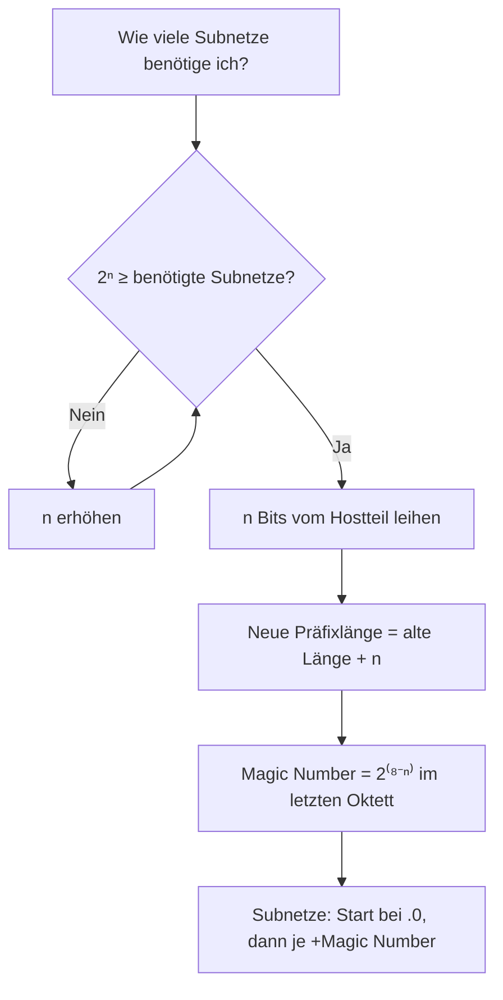
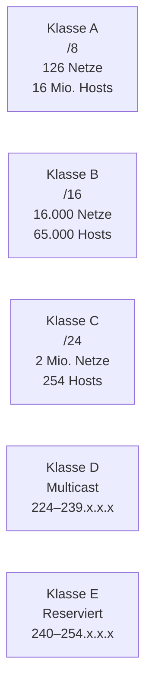
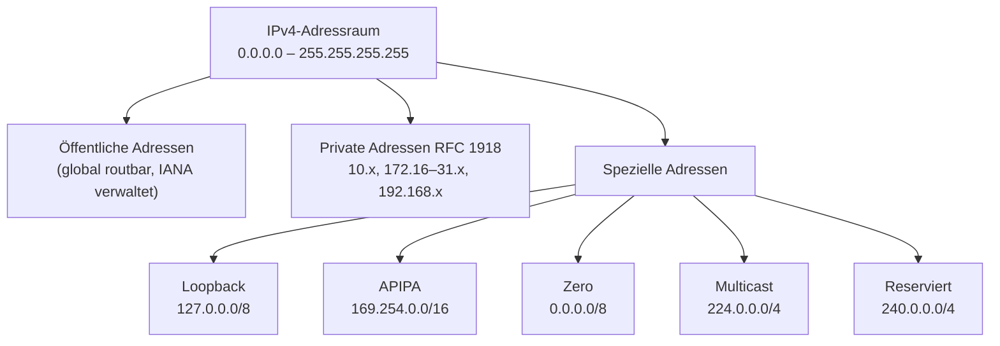
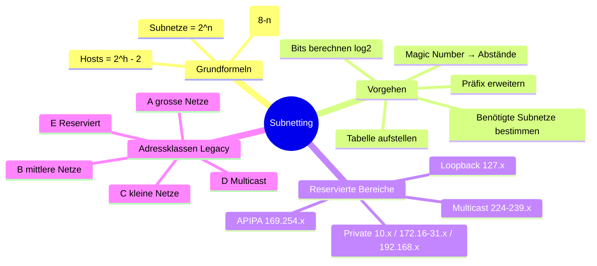

Dieses Modul vertieft das Subnetting durch praktische Übungen und Referenztabellen. Ziel ist es, Subnetze sicher und schnell berechnen zu können – ein unverzichtbares Handwerk für jeden Netzwerktechniker.

---

## 1. Subnetting – Schritt für Schritt

### Das Grundprinzip

Um ein Netzwerk in kleinere Subnetze aufzuteilen, muss der **Netzteil der IP-Adresse um eine bestimmte Anzahl Bits erweitert** werden. Diese Bits werden dem Hostteil „geliehen" und zu Netzbits umgewandelt.

**Ausgangslage (Beispiel):**
```
IP-Adresse:  192.168.168.0
Netzmaske:   255.255.255.0  (/24)

Netzanteil   → 192.168.168
Hostanteil   → .0  (8 Bits frei für Hosts)
```

### Schritt 1: Anzahl benötigter Bits berechnen

Die Anzahl der benötigten Bits hängt von der gewünschten Anzahl Subnetze ab:

| Bits geliehen (n) | Anzahl Subnetze (2ⁿ) |
|:-----------------:|:--------------------:|
| 1                 | 2                    |
| 2                 | 4                    |
| 3                 | 8                    |
| 4                 | 16                   |
| 5                 | 32                   |
| 6                 | 64                   |
| 7                 | 128                  |
| 8                 | 256                  |

> **Wichtig:** Die erste und letzte Adresse jedes Subnetzes sind **nicht** für Hosts nutzbar:
> - **Erste Adresse** = Netzwerkadresse
> - **Letzte Adresse** = Broadcast-Adresse
>
> Daher gilt: **Nutzbare Hosts = 2ʰ – 2** (wobei h = verbleibende Host-Bits)

**Beispiel:** Ich brauche 4 Subnetze.
- 2¹ = 2 → zu wenig
- 2² = 4 → passt! → **2 Bits leihen** → Netzmaske wird um 2 Bits erweitert: `/24 → /26`



---

## 2. Die Subnetzmasken-Referenztabelle

### Vollständige Tabelle für /24-Netz (letztes Oktett)

| Netzwerkbits (Präfix) | Subnetzmaske      | Bits geliehen | Subnetze | Hosts/Subnetz |
|:---------------------:|:-----------------:|:-------------:|:--------:|:-------------:|
| /24                   | 255.255.255.0     | 0             | 1        | 254           |
| /25                   | 255.255.255.128   | 1             | 2        | 126           |
| /26                   | 255.255.255.192   | 2             | 4        | 62            |
| /27                   | 255.255.255.224   | 3             | 8        | 30            |
| /28                   | 255.255.255.240   | 4             | 16       | 14            |
| /29                   | 255.255.255.248   | 5             | 32       | 6             |
| /30                   | 255.255.255.252   | 6             | 64       | 2             |

### Binäre Subnetzmasken-Tabelle (letztes Oktett)

| Bits gesetzt | Dezimalwert |
|:------------:|:-----------:|
| 1            | 128         |
| 11           | 192         |
| 111          | 224         |
| 1111         | 240         |
| 11111        | 248         |
| 111111       | 252         |
| 1111111      | 254         |
| 11111111     | 255         |

> **Merkhilfe:** Jedes neue gesetzte Bit addiert den halben Wert des vorherigen:
> 128 → +64=192 → +32=224 → +16=240 → +8=248 → +4=252 → +2=254 → +1=255

### Erweiterte Tabelle (/16 bis /30)

Diese Tabelle ist essenziell für die Arbeit mit grösseren Netzwerken:

| Präfix | Hosts (total) | Netmask          | Subnetze (aus /16) |
|:------:|:-------------:|:----------------:|:------------------:|
| /16    | 65.536        | 255.255.0.0      | 1                  |
| /17    | 32.768        | 255.255.128.0    | 2                  |
| /18    | 16.384        | 255.255.192.0    | 4                  |
| /19    | 8.192         | 255.255.224.0    | 8                  |
| /20    | 4.096         | 255.255.240.0    | 16                 |
| /21    | 2.048         | 255.255.248.0    | 32                 |
| /22    | 1.024         | 255.255.252.0    | 64                 |
| /23    | 512           | 255.255.254.0    | 128                |
| /24    | 256           | 255.255.255.0    | 256                |
| /25    | 128           | 255.255.255.128  | 512                |
| /26    | 64            | 255.255.255.192  | 1.024              |
| /27    | 32            | 255.255.255.224  | 2.048              |
| /28    | 16            | 255.255.255.240  | 4.096              |
| /29    | 8             | 255.255.255.248  | 8.192              |
| /30    | 4             | 255.255.255.252  | 16.384             |

> **Beachte:** Die Spalte „Hosts (total)" gibt die **totale Anzahl Adressen** an (inkl. Netzwerk- und Broadcast-Adresse). Nutzbare Hosts = Hosts total – 2.

### Praktisches Beispiel: /30 und 255.255.255.252

```
255.255.255.252 = 11111100 in Binär

Subnetz-Bits:  1 1 1 1 1 1 | 0 0
Werte:       128 64 32 16 8 4 | 2 1

Subnetze = 2⁶ = 64  (aber von /24 aus gerechnet)
Hosts    = 2² - 2 = 2 nutzbare Adressen
```

Dies ist das typische Subnetz für **Punkt-zu-Punkt-WAN-Verbindungen** zwischen zwei Routern – man braucht genau 2 nutzbare Adressen.

---

## 3. Die Zweierpotenzen – Das wichtigste Werkzeug

Alle Subnetting-Berechnungen basieren auf Zweierpotenzen. Diese Werte sollte man auswendig kennen:

| 2⁰ | 2¹ | 2² | 2³ | 2⁴ | 2⁵ | 2⁶ | 2⁷ | 2⁸  |
|:--:|:--:|:--:|:--:|:--:|:--:|:--:|:--:|:---:|
| 1  | 2  | 4  | 8  | 16 | 32 | 64 | 128| 256 |

Und die Stellenwerte eines Oktetts (von links nach rechts):

```
Bit-Position:  7    6    5    4    3    2    1    0
Stellenwert: 128   64   32   16    8    4    2    1
```

---

## 4. IP-Adressklassen (Legacy Classful Addressing)

Historisch wurden IPv4-Adressen in fünf Klassen eingeteilt. Obwohl heute CIDR (klassenloses Routing) verwendet wird, sind die Klassen für das Verständnis wichtig:

| Klasse  | Adressbereich                    | Unterstützte Umgebung                          |
|:-------:|:---------------------------------|:-----------------------------------------------|
| Class A | 1.0.0.1 – 126.255.255.254        | 16 Millionen Hosts auf je 127 Netzwerken        |
| Class B | 128.1.0.1 – 191.255.255.254      | 65.000 Hosts auf je 16.000 Netzwerken          |
| Class C | 192.0.1.1 – 223.255.254.254      | 254 Hosts auf je 2 Millionen Netzwerken        |
| Class D | 224.0.0.0 – 239.255.255.255      | Reserviert für **Multicast**-Gruppen            |
| Class E | 240.0.0.0 – 254.255.255.254      | Reserviert für Forschung & Entwicklung          |



> **Warum wurden Klassen abgelöst?** Ein Unternehmen mit 300 Hosts musste eine Klasse B nehmen (65.534 Hosts) – 65.234 Adressen wurden verschwendet. CIDR und VLSM lösen dieses Problem durch flexible Präfixlängen.

---

## 5. Reservierte IP-Adressbereiche

Nicht alle IPv4-Adressen sind für normale Host-Kommunikation nutzbar. Folgende Bereiche sind **reserviert**:

| Adressbereich                | Zweck                        | Klasse | Anzahl Adressen |
|:-----------------------------|:-----------------------------|:------:|:---------------:|
| 0.0.0.0 – 0.255.255.255      | Zero-Adressen (unzulässig)   | A      | 16.777.216      |
| **10.0.0.0 – 10.255.255.255**    | **Private IP-Adressen**          | A      | 16.777.216      |
| 127.0.0.0 – 127.255.255.255  | Localhost / Loopback         | A      | 16.777.216      |
| 169.254.0.0 – 169.254.255.255| Zeroconf / APIPA             | B      | 65.536          |
| **172.16.0.0 – 172.31.255.255**  | **Private IP-Adressen**          | B      | 1.048.576       |
| **192.168.0.0 – 192.168.255.255**| **Private IP-Adressen**          | C      | 65.536          |

### Erläuterungen zu den wichtigsten reservierten Bereichen

**Zero-Adressen (0.0.0.0/8):**
Werden als Quell-Adresse verwendet, wenn ein Gerät noch keine IP-Adresse hat (z. B. bei DHCP-Anfragen). Dürfen nicht als reguläre Host-Adresse vergeben werden.

**Private Adressen (RFC 1918):**
Diese drei Bereiche sind für den **internen Gebrauch** bestimmt und werden im Internet nicht geroutet. Jede Organisation kann sie in ihrem privaten Netz frei verwenden – sie sind nicht global eindeutig. Für den Internetzugang ist **NAT** erforderlich.

**Loopback (127.0.0.0/8):**
Pakete an diese Adressen verlassen den Host nie – sie werden intern verarbeitet. `127.0.0.1` ist der typisch verwendete Loopback-Wert und dient zum Testen des TCP/IP-Stacks.

**APIPA / Zeroconf (169.254.0.0/16):**
Wird automatisch von einem Host vergeben, wenn kein DHCP-Server erreichbar ist. Erlaubt lokale Kommunikation ohne manuelle Konfiguration, aber **kein** Internetzugang.



---

## 6. Schnell-Referenz: Private IP-Adressbereiche

| Von         | Bis                | Präfix |
|:------------|:-------------------|:------:|
| 10.0.0.0    | 10.255.255.255     | /8     |
| 172.16.0.0  | 172.31.255.255     | /12    |
| 192.168.0.0 | 192.168.255.255    | /16    |

---

## 7. Praktisches Subnetting – Schritt-für-Schritt Beispiel

**Aufgabe:** Teile `192.168.168.0/24` in **4 gleich grosse Subnetze** auf.

**Schritt 1 – Bits berechnen:**
- 4 Subnetze benötigt → 2² = 4 → **2 Bits leihen**
- Neues Präfix: `/24 + 2 = /26`
- Neue Maske: `255.255.255.192`

**Schritt 2 – Magic Number:**
- Letztes gesetzte Bit in `11000000` = Stelle 6 → Wert = **64**
- Magic Number = **64** (= Abstand zwischen den Subnetzen)

**Schritt 3 – Subnetze auflisten:**

| Subnetz | Netzadresse          | Erste Host-IP    | Letzte Host-IP   | Broadcast         |
|:-------:|:---------------------|:-----------------|:-----------------|:------------------|
| 0       | 192.168.168.0 /26    | 192.168.168.1    | 192.168.168.62   | 192.168.168.63    |
| 1       | 192.168.168.64 /26   | 192.168.168.65   | 192.168.168.126  | 192.168.168.127   |
| 2       | 192.168.168.128 /26  | 192.168.168.129  | 192.168.168.190  | 192.168.168.191   |
| 3       | 192.168.168.192 /26  | 192.168.168.193  | 192.168.168.254  | 192.168.168.255   |

**Probe:** 4 Subnetze × 64 Adressen = 256 = 2⁸ ✓ (deckt das gesamte /24-Netz ab)

---

## 8. Zusammenfassung & Merkhilfen



### Die wichtigsten Faustregeln

| Regel | Erklärung |
|:------|:----------|
| **Immer 2 Adressen reservieren** | Netzwerk- und Broadcast-Adresse nie an Hosts vergeben |
| **Magic Number = Subnetz-Abstand** | Magic Number addieren → nächstes Subnetz |
| **/30 für WAN-Links** | Nur 2 nutzbare Adressen – ideal für Router-zu-Router |
| **Private Adressen brauchen NAT** | Ohne NAT kein Internetzugang |
| **APIPA = kein DHCP erreichbar** | 169.254.x.x als Host-IP → DHCP-Problem prüfen |
