### Was ist ICMP und warum brauchen wir es?

IP ist ein verbindungsloses Protokoll – es liefert Pakete nach bestem Bemühen, garantiert aber weder Zustellung noch gibt es Feedback bei Problemen. Genau hier kommt **ICMP (Internet Control Message Protocol)** ins Spiel: Es ist ein Hilfsprotokoll auf Schicht 3, das Rückmeldungen über Probleme bei der IP-Paketverarbeitung liefert.

Ohne ICMP wäre ein Netzwerkadministrator blind – er könnte nicht wissen, ob ein Paket verlorenging, ein Zielhost nicht erreichbar ist oder ein Router überlastet ist. ICMP macht Netzwerke diagnostizierbar.

Es gibt zwei Versionen:
- **ICMPv4** – für IPv4-Netzwerke
- **ICMPv6** – für IPv6-Netzwerke, mit erweiterter Funktionalität (z. B. Neighbor Discovery)

> **Wichtig:** ICMPv4-Nachrichten sind in vielen Netzwerken aus Sicherheitsgründen deaktiviert oder gefiltert. Ein ausbleibender ICMP-Response bedeutet also nicht zwingend, dass ein Host nicht erreichbar ist.

---

### 1. ICMP-Nachrichten

Die drei wichtigsten ICMP-Nachrichtentypen, die sowohl in ICMPv4 als auch ICMPv6 existieren:

#### 1.1 Host Reachability (Erreichbarkeit eines Hosts)

Mit der **ICMP Echo Request / Echo Reply**-Nachricht kann geprüft werden, ob ein Host im Netzwerk erreichbar ist:

1. Der sendende Host schickt einen **Echo Request** an die Ziel-IP.
2. Ist der Zielhost verfügbar und antwortet er, sendet er einen **Echo Reply** zurück.

Dies ist die Grundlage des bekannten `ping`-Befehls.

```
Host A  --[Echo Request]--->  Host B
Host A  <--[Echo Reply]----   Host B
```

#### 1.2 Destination or Service Unreachable (Ziel nicht erreichbar)

Wenn ein Paket sein Ziel nicht erreichen kann, sendet ein Router oder der Zielhost eine **ICMP Destination Unreachable**-Nachricht zurück. Diese enthält einen **Code**, der den Grund beschreibt:

**ICMPv4-Codes:**
| Code | Bedeutung |
|------|-----------|
| 0 | Netz nicht erreichbar |
| 1 | Host nicht erreichbar |
| 2 | Protokoll nicht erreichbar |
| 3 | Port nicht erreichbar |

**ICMPv6-Codes:**
| Code | Bedeutung |
|------|-----------|
| 0 | Keine Route zum Ziel |
| 1 | Kommunikation administrativ verboten (z. B. Firewall) |
| 2 | Jenseits des Bereichs der Quelladresse |
| 3 | Adresse nicht erreichbar |
| 4 | Port nicht erreichbar |

#### 1.3 Time Exceeded (Zeit abgelaufen)

Jedes IPv4-Paket enthält ein **TTL-Feld (Time to Live)**. Jeder Router, der das Paket weiterleitet, dekrementiert diesen Wert um 1. Erreicht der TTL-Wert **0**, wird das Paket verworfen und der Router sendet eine **ICMPv4 Time Exceeded**-Nachricht an den Absender.

Bei IPv6 übernimmt das **Hop Limit-Feld** dieselbe Funktion.

> **Warum TTL?** Das TTL-Feld verhindert, dass Pakete endlos im Netzwerk kreisen, wenn z. B. eine Routing-Schleife vorliegt. Es ist eine Art "Verfallsdatum" für Pakete.

Das `traceroute`-Tool nutzt diesen Mechanismus gezielt aus (mehr dazu unten).

---

### 2. ICMPv6-Erweiterungen: Neighbor Discovery Protocol (NDP)

ICMPv6 ist deutlich mächtiger als ICMPv4. Es beinhaltet das **Neighbor Discovery Protocol (NDP)**, das vier neue Nachrichtentypen definiert:

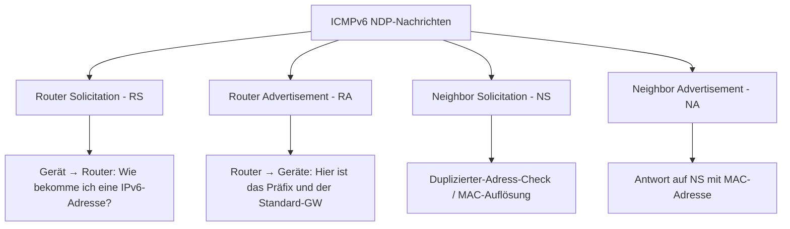

#### Router Solicitation (RS) & Router Advertisement (RA)

- IPv6-fähige Router senden **RA-Nachrichten alle 200 Sekunden** unaufgefordert aus.
- Ein RA enthält: IPv6-Präfix, Präfixlänge, DNS-Adresse, Domainname.
- Geräte, die **SLAAC (Stateless Address Autoconfiguration)** nutzen, konfigurieren ihre IPv6-Adresse selbst anhand dieser Informationen und setzen die link-lokale Adresse des Routers als Standard-Gateway.
- Ein Gerät kann auch aktiv einen **RS senden** ("Gibt es hier einen IPv6-Router?"), woraufhin der Router sofort mit einem RA antwortet.

**Ablauf SLAAC:**
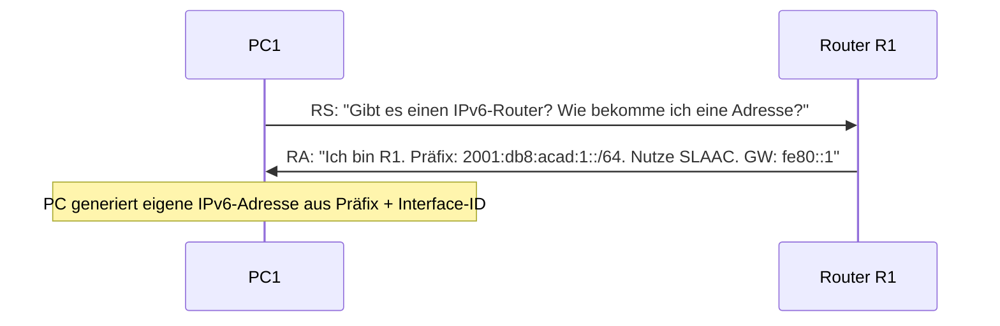

#### Neighbor Solicitation (NS) & Neighbor Advertisement (NA)

Diese werden für zwei Zwecke genutzt:

**1. Duplicate Address Detection (DAD):**
Bevor ein Gerät eine neue IPv6-Adresse nutzt, prüft es mittels NS, ob diese schon vergeben ist. Antwortet jemand mit einem NA, ist die Adresse bereits in Verwendung.

**2. Adressauflösung (Ersatz für ARP in IPv4):**
Um die MAC-Adresse zu einer bekannten IPv6-Adresse zu finden, sendet ein Gerät einen NS an die "Solicited-Node-Multicast-Adresse". Das Gerät mit dieser IPv6-Adresse antwortet mit einem NA, der seine MAC-Adresse enthält.

---

### 3. Ping und Traceroute

#### ping – Verbindungstest

`ping` ist das grundlegende Diagnosewerkzeug im Netzwerk. Es verwendet **ICMP Echo Request und Echo Reply**, um:
- die Erreichbarkeit eines Hosts zu testen
- die Roundtrip-Zeit (RTT) zu messen
- die Erfolgsrate von Paketen anzuzeigen

**Typische Anwendungsfälle:**

| Test | Befehl | Aussage |
|------|--------|---------|
| Loopback-Test | `ping 127.0.0.1` (IPv4) oder `ping ::1` (IPv6) | TCP/IP-Stack des lokalen Geräts funktioniert |
| Standard-Gateway | `ping 10.0.0.254` | Lokales Netzwerk und Router-Interface erreichbar |
| Remote Host | `ping 8.8.8.8` | Ende-zu-Ende-Verbindung über das Internet funktioniert |

> **Praxis-Hinweis:** Das erste Ping-Paket geht oft verloren, weil zuerst ARP (IPv4) oder Neighbor Discovery (IPv6) die MAC-Adresse auflösen muss. Das ist normal.

#### traceroute / tracert – Pfadverfolgung

`traceroute` (Linux/Mac) bzw. `tracert` (Windows) zeigt den **Weg eines Pakets durch das Netzwerk** – also alle Hops (Router) zwischen Quelle und Ziel – mit ihrer Roundtrip-Zeit.

**Wie funktioniert traceroute technisch?**

Es nutzt das TTL-Feld gezielt:

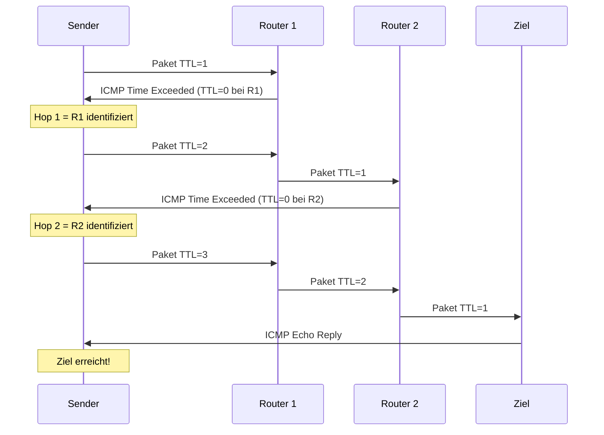

- Traceroute sendet zunächst Pakete mit **TTL=1**, dann TTL=2, TTL=3 usw.
- Jeder Router, bei dem TTL=0 wird, sendet eine **Time Exceeded**-Nachricht zurück – so wird seine IP-Adresse bekannt.
- Ein `*` in der Ausgabe bedeutet, dass kein Reply empfangen wurde (Router antwortet nicht auf ICMP, oder Paket verloren).

**Beispielausgabe:**
```
R1#traceroute 192.168.40.2
Tracing the route to 192.168.40.2

  1  192.168.10.2   1 msec   0 msec   0 msec
  2  192.168.20.2   2 msec   1 msec   0 msec
  3  192.168.30.2   1 msec   0 msec   0 msec
  4  192.168.40.2   0 msec   0 msec   0 msec
```

---

## Transportschicht (Transport Layer)

### Was macht die Transportschicht?

Die **Transportschicht (Schicht 4 im OSI-Modell)** ist das Bindeglied zwischen den Anwendungen (Schicht 7) und den unteren Netzwerkschichten. Sie stellt sicher, dass Daten zwischen den richtigen Anwendungen auf verschiedenen Hosts ausgetauscht werden.

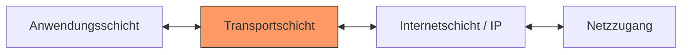

**Hauptaufgaben der Transportschicht:**
1. **Tracking einzelner Konversationen** – mehrere Anwendungen gleichzeitig verwalten
2. **Segmentierung und Reassemblierung** – grosse Datenmengen in handliche Stücke aufteilen und wieder zusammensetzen
3. **Header-Informationen hinzufügen** – Port-Nummern, Sequenznummern etc.
4. **Multiplexing** – mehrere Datenströme über dasselbe Netzwerk gleichzeitig übertragen

### Die zwei Transportprotokolle: TCP und UDP

Die Transportschicht kennt zwei grundlegend verschiedene Protokolle:

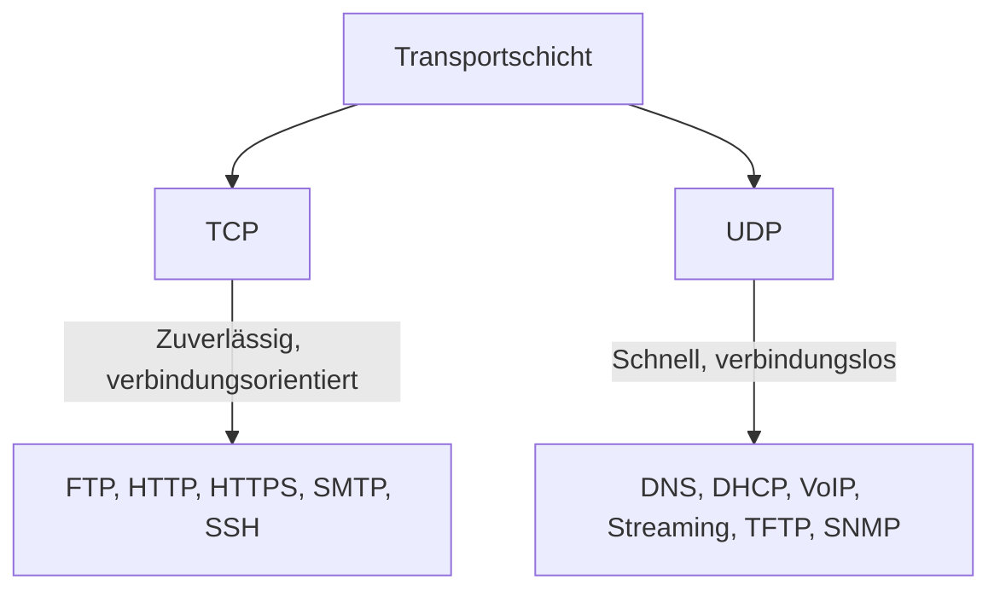

---

### 1. TCP – Transmission Control Protocol

#### Was ist TCP und warum ist es wichtig?

TCP ist das **zuverlässige** Transportprotokoll. Es stellt sicher, dass alle Daten vollständig, in der richtigen Reihenfolge und ohne Fehler beim Empfänger ankommen. Das klingt selbstverständlich, ist es aber nicht – das darunterliegende IP-Protokoll bietet diese Garantien nämlich nicht.

TCP ist wie ein Paketdienst mit Sendungsverfolgung: Jedes Paket wird nummeriert, der Empfang bestätigt, und fehlende Pakete werden erneut gesendet.

#### TCP-Eigenschaften im Überblick

| Eigenschaft | Beschreibung |
|-------------|--------------|
| **Verbindungsorientiert** | Verbindung wird vor der Datenübertragung aufgebaut (Three-Way Handshake) |
| **Zuverlässige Zustellung** | Verlorene Segmente werden erneut übertragen |
| **Reihenfolge-Garantie** | Segmente werden in der richtigen Reihenfolge zusammengesetzt |
| **Flusskontrolle** | Senderate wird angepasst, um Überlastung zu vermeiden |
| **Stateful** | TCP merkt sich den Zustand der Verbindung |

#### TCP-Header

Der TCP-Header ist **20 Bytes** gross (ohne Optionen) und enthält folgende wichtige Felder:

```
+------------------+------------------+
|   Source Port    | Destination Port |  ← je 16 Bit
+------------------------------------------+
|              Sequence Number (32 Bit)     |
+------------------------------------------+
|           Acknowledgment Number (32 Bit)  |
+--------+----------+---------+------------+
| Header | Reserved | Control |  Window    |
| Length | (6 Bit)  |  Bits   |  (16 Bit)  |
+------------------+------------------+
|   Checksum (16)  |   Urgent (16)    |
+------------------------------------------+
|          Options (0 oder 32 Bit)         |
+------------------------------------------+
|       Application Layer Data             |
+------------------------------------------+
```

**Wichtige Felder:**
- **Sequence Number**: Nummeriert die Bytes für die Reihenfolge-Garantie
- **Acknowledgment Number**: Bestätigt den Empfang; gibt an, welches Byte als nächstes erwartet wird
- **Control Bits (Flags)**: URG, ACK, PSH, RST, **SYN**, **FIN** – steuern den Verbindungsstatus
- **Window Size**: Anzahl der Bytes, die ohne Bestätigung gesendet werden dürfen (Flusskontrolle)

#### Control Bits / Flags im Detail

| Flag | Name | Bedeutung |
|------|------|-----------|
| **SYN** | Synchronize | Verbindungsaufbau; synchronisiert Sequenznummern |
| **ACK** | Acknowledge | Bestätigt empfangene Daten |
| **FIN** | Finish | Verbindungsabbau; keine weiteren Daten |
| **RST** | Reset | Verbindung sofort abbrechen (bei Fehler) |
| **PSH** | Push | Daten sofort an Anwendung weiterleiten |
| **URG** | Urgent | Dringliche Daten |

---

### 2. Der TCP Three-Way Handshake (Verbindungsaufbau)

Bevor TCP Daten überträgt, wird eine Verbindung mit dem **Drei-Wege-Handshake** etabliert. Dieser stellt sicher, dass beide Seiten bereit sind und synchronisiert die Sequenznummern.

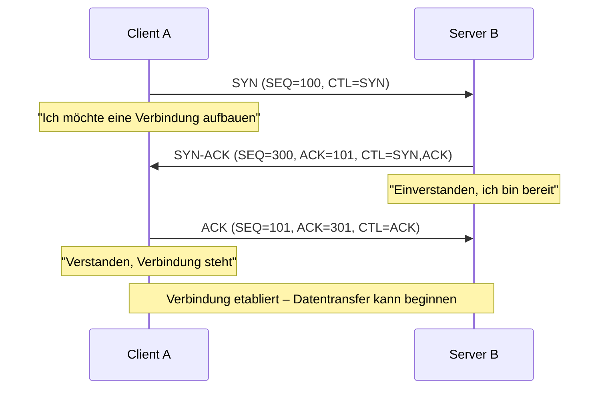

**Was wird dabei erreicht?**
1. Server ist im Netzwerk vorhanden und erreichbar
2. Server hat einen aktiven Dienst auf dem gewünschten Port
3. Beide Seiten kennen die Anfangs-Sequenznummern des anderen

#### TCP Verbindungsabbau (Session Termination)

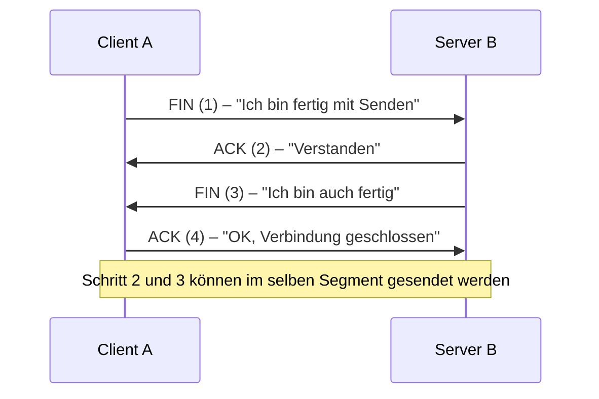

---

### 3. UDP – User Datagram Protocol

#### Was ist UDP und warum gibt es es?

UDP ist das **schnelle, aber unzuverlässige** Transportprotokoll. Es gibt keine Verbindung, keine Bestätigungen, keine Reihenfolge-Garantie. Klingt schlecht – aber für viele Anwendungen ist genau das ideal.

**Warum UDP für Streaming oder VoIP?**
Bei einem Live-Video-Stream ist ein kurz verlorenes Paket verschmerzbar – das Bild flackert kurz. Würde man TCP verwenden, würde das Protokoll auf die Bestätigung warten und dann das verlorene Paket nochmals senden – was zu Pufferaufbau und spürbaren Verzögerungen führt. UDP liefert die Daten einfach so schnell wie möglich, ohne Rücksicht auf Verluste.

```
UDP = Postkarte ohne Einschreiben
TCP = Einschreibebrief mit Rückschein
```

#### UDP-Eigenschaften

| Eigenschaft | Beschreibung |
|-------------|--------------|
| **Verbindungslos** | Kein Verbindungsaufbau nötig |
| **Best-Effort** | Keine Garantie für Zustellung |
| **Keine Reihenfolge** | Datagrams werden in Empfangsreihenfolge weitergegeben |
| **Kein Retransmit** | Verlorene Pakete werden nicht erneut gesendet |
| **Wenig Overhead** | Kleiner Header, schnell |

#### UDP-Header

Der UDP-Header ist nur **8 Bytes** gross – deutlich kleiner als TCP:

```
+------------------+------------------+
|   Source Port    | Destination Port |  ← je 16 Bit
+------------------+------------------+
|     Length       |    Checksum      |  ← je 16 Bit
+------------------------------------------+
|       Application Layer Data             |
+------------------------------------------+
```

**Vergleich TCP vs. UDP:**

| Merkmal | TCP | UDP |
|---------|-----|-----|
| Verbindung | Verbindungsorientiert | Verbindungslos |
| Zuverlässigkeit | Ja | Nein |
| Reihenfolge | Garantiert | Nicht garantiert |
| Flusskontrolle | Ja | Nein |
| Header-Grösse | 20 Bytes | 8 Bytes |
| Overhead | Hoch | Niedrig |
| Anwendungen | HTTP, FTP, SMTP, SSH | DNS, DHCP, VoIP, TFTP, SNMP |

---

### 4. Port-Nummern

#### Warum brauchen wir Port-Nummern?

Ein Gerät kann gleichzeitig einen Webbrowser, ein E-Mail-Programm und einen VoIP-Client betreiben. Alle Daten kommen über dieselbe IP-Adresse an – wie weiss das Betriebssystem, welche Daten wohin gehören? Über **Port-Nummern**.

Port-Nummern sind **16-Bit-Werte** (0–65535) und identifizieren spezifische Anwendungen oder Dienste.

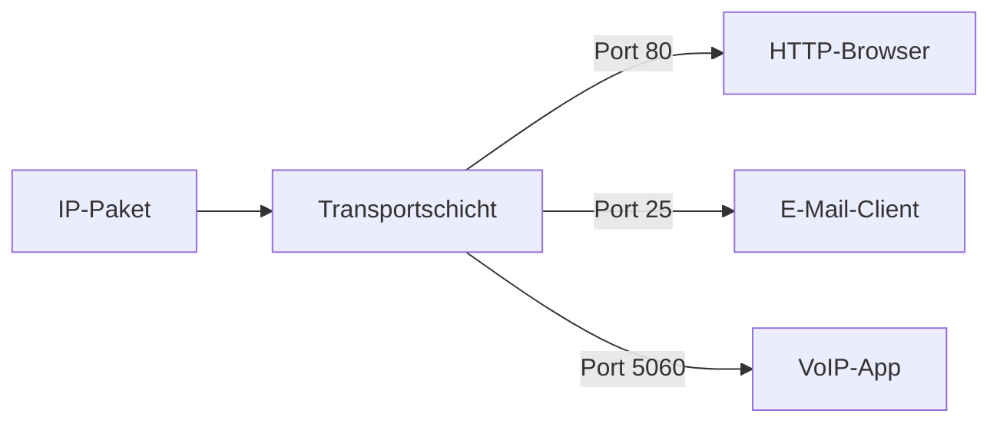

#### Port-Nummern-Bereiche

| Bereich | Name | Beschreibung |
|---------|------|--------------|
| **0–1023** | Well-Known Ports | Reserviert für Standard-Dienste (HTTP=80, HTTPS=443, FTP=21, SSH=22) |
| **1024–49151** | Registered Ports | Durch IANA zugewiesen für spezifische Anwendungen |
| **49152–65535** | Dynamic/Private Ports | Werden vom OS dynamisch für Client-Verbindungen vergeben (Ephemeral Ports) |

#### Wichtige Well-Known Ports

| Port | Protokoll | Dienst |
|------|-----------|--------|
| 20/21 | TCP | FTP (Daten/Steuerung) |
| 22 | TCP | SSH |
| 23 | TCP | Telnet |
| 25 | TCP | SMTP (E-Mail senden) |
| 53 | UDP/TCP | DNS |
| 67/68 | UDP | DHCP (Server/Client) |
| 69 | UDP | TFTP |
| 80 | TCP | HTTP |
| 110 | TCP | POP3 (E-Mail empfangen) |
| 143 | TCP | IMAP |
| 161 | UDP | SNMP |
| 443 | TCP | HTTPS |

#### Sockets

Die Kombination aus **IP-Adresse + Port-Nummer** ergibt einen **Socket**:

```
Socket = IP-Adresse : Port-Nummer
Beispiel: 192.168.1.5:49152  (Client-Socket)
          192.168.1.7:80     (Server-Socket)
```

Ein **Socket-Paar** (Quell-Socket + Ziel-Socket) identifiziert eine eindeutige Verbindung zwischen zwei Prozessen:

```
(192.168.1.5:49152, 192.168.1.7:80) → HTTP-Verbindung
(192.168.1.5:49153, 192.168.1.7:80) → zweite HTTP-Verbindung (z. B. zweiter Tab)
```

#### Der netstat-Befehl

`netstat` zeigt aktive Netzwerkverbindungen mit ihren Ports an:

```bash
# Verbindungen mit Namen anzeigen
netstat

# Verbindungen numerisch anzeigen (IP + Ports als Zahlen)
netstat -n
```

---

### 5. TCP-Kommunikationsprozess im Detail

#### TCP Server-Prozesse

Ein Server "lauscht" auf einem bestimmten Port. Wenn ein Client sich verbindet, werden die Ports folgendermassen zugewiesen:

- **Client → Server:** Quell-Port = dynamisch (z. B. 49152), Ziel-Port = Well-Known (z. B. 80 für HTTP)
- **Server → Client:** Quell-Port = Well-Known (80), Ziel-Port = dynamischer Client-Port (49152)

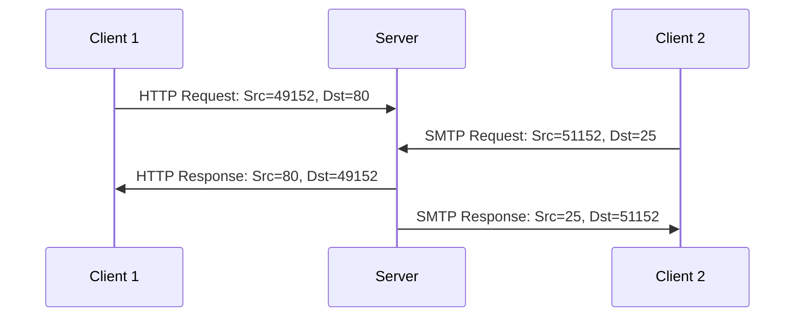

---

### 6. Zuverlässigkeit und Flusskontrolle bei TCP

#### Sequenznummern und Reihenfolge

Da Datenpakete im Internet verschiedene Wege nehmen können, kommen sie möglicherweise in der falschen Reihenfolge an. TCP nummeriert deshalb jedes Segment mit einer **Sequenznummer**. Der Empfänger kann die Segmente damit in die ursprüngliche Reihenfolge bringen.

```
Gesendet:  Seg1 → Seg2 → Seg3 → Seg4 → Seg5 → Seg6
Empfangen: Seg1, Seg2, Seg6, Seg5, Seg4, Seg3  ← falsche Reihenfolge
Reassembliert: Seg1, Seg2, Seg3, Seg4, Seg5, Seg6  ← TCP bringt Ordnung
```

#### Datenverlust und Retransmission

Wenn Segmente verloren gehen, sendet TCP sie erneut:

**Klassischer Ansatz:** Bei einem Verlust werden alle Segmente ab dem letzten ACK erneut gesendet → ineffizient, weil bereits empfangene Segmente doppelt gesendet werden.

**SACK (Selective Acknowledgment):** Moderner Ansatz – der Empfänger teilt dem Sender genau mit, welche Segmente angekommen sind (auch wenn es "Lücken" gibt). Nur die wirklich fehlenden Segmente werden erneut übertragen.

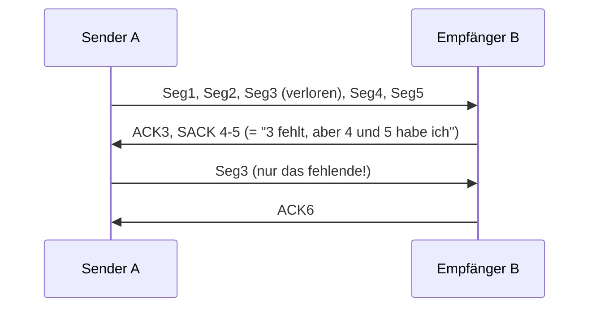

#### Flusskontrolle und Window Size

TCP verhindert, dass ein schneller Sender einen langsamen Empfänger überflutet:

- Im **TCP-Header** gibt es ein **Window Size**-Feld: Es gibt an, wie viele Bytes der Empfänger aktuell empfangen kann.
- Der Sender darf nur so viele Bytes senden, wie das Fenster erlaubt, und wartet dann auf eine Bestätigung.
- Der Empfänger kann die Fenstergrösse dynamisch anpassen (**Sliding Window**).

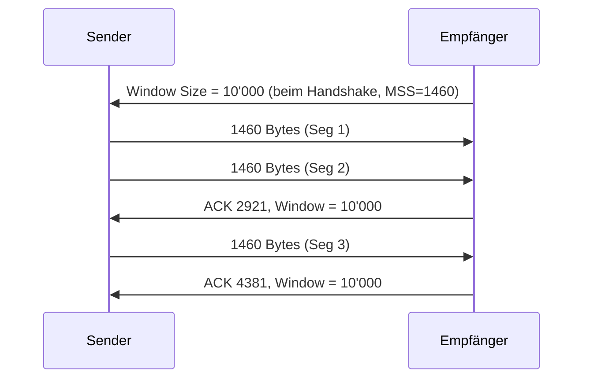

#### Maximum Segment Size (MSS)

MSS ist die maximale Datenmenge in einem TCP-Segment:

```
Ethernet MTU:  1500 Bytes
- IPv4 Header:   20 Bytes
- TCP Header:    20 Bytes
= TCP MSS:     1460 Bytes  (Standard bei IPv4)
```

#### Staukontrolle (Congestion Avoidance)

Wenn ein Router überlastet ist, werden Pakete verworfen. TCP erkennt dies daran, dass keine ACKs zurückkommen, und **reduziert die Senderate** automatisch. Sobald die ACKs wieder eintreffen, wird die Rate schrittweise wieder erhöht. Dies geschieht über verschiedene Algorithmen (Slow Start, Congestion Avoidance, Fast Retransmit).

---

### 7. UDP-Kommunikationsprozess

#### UDP Server und Client

Auch UDP nutzt Port-Nummern, aber ohne Verbindungsaufbau:

- UDP-Server-Anwendungen lauschen auf bekannten Ports (z. B. DNS auf Port 53)
- Der Client wählt einen zufälligen Quell-Port und sendet an den bekannten Ziel-Port
- Der Server antwortet an den Quell-Port des Clients

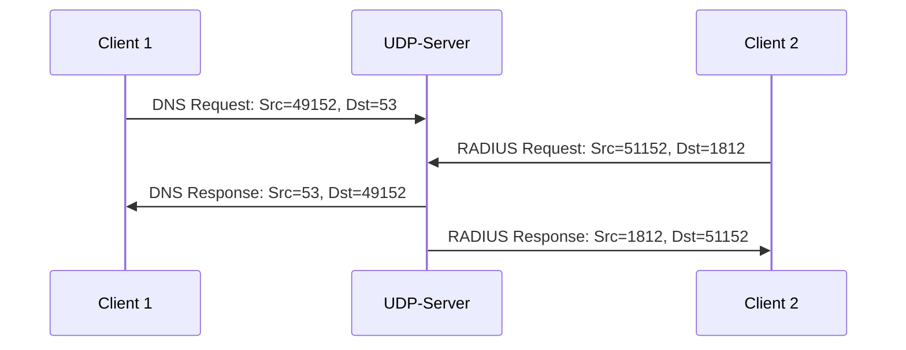

**Wichtig:** UDP hat keine Sitzung – der Server weiss nur durch den Port, wer was anfragt. Alle Datagrams eines Clients werden mit demselben Port-Paar gesendet.

#### UDP Datagram Reassemblierung

Im Gegensatz zu TCP nummeriert UDP seine Datagrams nicht. Wenn Datagrams in der falschen Reihenfolge ankommen:
- UDP liefert sie in der empfangenen Reihenfolge weiter
- Es gibt keine Reordering-Logik
- Verlorene Datagrams werden **nicht** erneut gesendet

Das ist für viele Echtzeitanwendungen akzeptabel – ein paar verlorene VoIP-Pakete führen zu kurzem Rauschen, aber kein Einfrieren des Streams.

---

### Zusammenfassung: TCP vs. UDP auf einen Blick

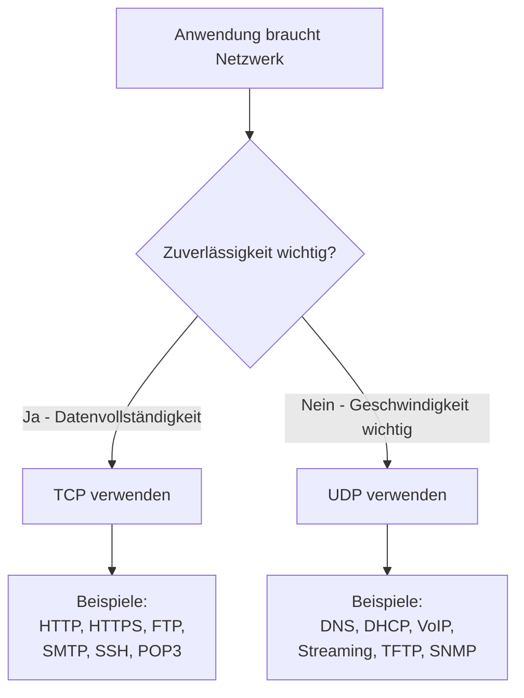

| Kriterium | TCP | UDP |
|-----------|-----|-----|
| Verbindung | Verbindungsorientiert (3-Way Handshake) | Verbindungslos |
| Zuverlässigkeit | Garantiert (ACK + Retransmit) | Best-Effort |
| Reihenfolge | Garantiert (Sequenznummern) | Nicht garantiert |
| Flusskontrolle | Sliding Window, MSS | Keine |
| Staukontrolle | Ja (verschiedene Algorithmen) | Keine |
| Header-Grösse | 20 Bytes | 8 Bytes |
| Overhead | Hoch | Niedrig |
| Latenz | Höher | Tiefer |
| Anwendungen | Dateiübertragung, Web, E-Mail | Echtzeit, kleine Anfragen |

---

### Glossar der wichtigsten Begriffe

| Begriff | Erklärung |
|---------|-----------|
| **ICMP** | Internet Control Message Protocol – Hilfsprotokoll für Netzwerkdiagnose |
| **TTL** | Time to Live – Lebensdauer eines Pakets in Hops |
| **Hop Limit** | IPv6-Äquivalent des TTL-Felds |
| **ping** | Tool zum Testen der Erreichbarkeit (ICMP Echo) |
| **traceroute** | Tool zur Pfadverfolgung (nutzt TTL-Manipulation) |
| **NDP** | Neighbor Discovery Protocol – IPv6-Protokoll für Adressauflösung und Router-Discovery |
| **SLAAC** | Stateless Address Autoconfiguration – automatische IPv6-Adresskonfiguration |
| **DAD** | Duplicate Address Detection – prüft ob IPv6-Adresse bereits vergeben |
| **TCP** | Transmission Control Protocol – zuverlässiges, verbindungsorientiertes Transportprotokoll |
| **UDP** | User Datagram Protocol – schnelles, verbindungsloses Transportprotokoll |
| **Port** | 16-Bit-Nummer zur Identifikation von Anwendungen/Diensten |
| **Socket** | Kombination aus IP-Adresse und Port-Nummer |
| **Three-Way Handshake** | TCP-Verbindungsaufbau in drei Schritten (SYN, SYN-ACK, ACK) |
| **MSS** | Maximum Segment Size – maximale TCP-Nutzdaten pro Segment (typisch 1460 Bytes) |
| **MTU** | Maximum Transmission Unit – maximale Rahmengrösse (Ethernet: 1500 Bytes) |
| **Sliding Window** | Dynamische Anpassung der Fenstergrösse bei TCP |
| **SACK** | Selective Acknowledgment – effizientere Bestätigung bei Paketverlusten |
| **Well-Known Ports** | Ports 0–1023, reserviert für Standarddienste |
| **Ephemeral Ports** | Dynamisch vom OS zugewiesene Ports für Client-Verbindungen (49152–65535) |
| **netstat** | Netzwerk-Diagnosetool zum Anzeigen aktiver Verbindungen und Ports |
