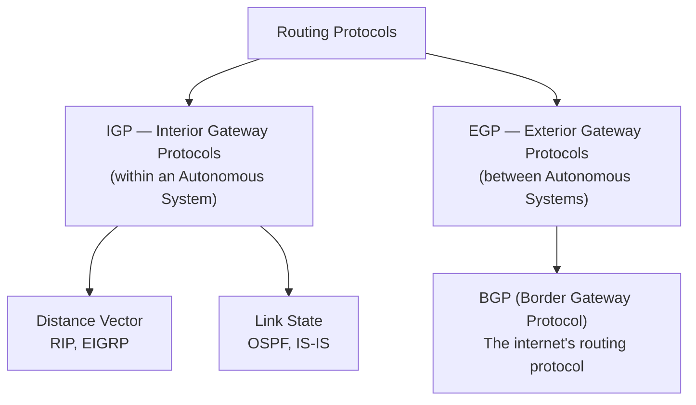
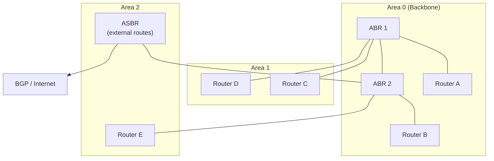
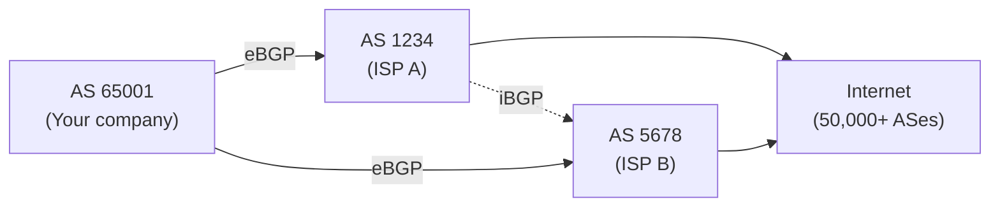

import \{ Tabs, TabItem \} from '@astrojs/starlight/components';
import \{ Aside, Card, CardGrid, Steps, Badge \} from '@astrojs/starlight/components';


Routing is the process of selecting paths for traffic across interconnected networks. Routers use a **routing table** to decide where to forward each packet. Routing tables are built from static configuration or learned dynamically via routing protocols.

## How Routing Decisions Are Made

When a packet arrives at a router:
1. Extract the destination IP from the packet header
2. Find the **longest prefix match** in the routing table
3. Forward the packet out the matching interface toward the next-hop

```
Destination: 10.0.1.45

Routing table:
  0.0.0.0/0  via 203.0.113.1 (default route — matches all)
  10.0.0.0/8 via 10.255.0.1   (matches — 8 bits)
  10.0.1.0/24 via 10.10.10.1  (matches — 24 bits ← LONGEST MATCH → used)
```

**Longest prefix match** always wins — more specific routes take priority.

---

## Administrative Distance (AD)

When multiple routing sources provide a route to the same destination, the router picks the one with the **lowest administrative distance** (higher trust = lower number):

| Source | Cisco AD | Meaning |
|---|---|---|
| Connected interface | 0 | Always preferred |
| Static route | 1 | Admin-configured, highly trusted |
| EIGRP summary | 5 | Cisco proprietary |
| External BGP (eBGP) | 20 | Inter-AS BGP |
| Internal EIGRP | 90 | Cisco proprietary |
| OSPF | 110 | Open standard IGP |
| IS-IS | 115 | Open standard IGP |
| RIP | 120 | Distance vector, old |
| Internal BGP (iBGP) | 200 | Within an AS |
| Unknown | 255 | Never used |

---

## Static Routes

Manually configured by an administrator. No protocol overhead, fully predictable, no automatic failover.

```bash
# Linux (iproute2)
ip route add 10.0.2.0/24 via 192.168.1.1          # via next-hop IP
ip route add 10.0.3.0/24 dev eth1                  # directly via interface
ip route add default via 192.168.1.1               # default gateway

# Persistent (add to /etc/network/interfaces or nmcli)
nmcli connection modify eth0 +ipv4.routes "10.0.2.0/24 192.168.1.1"

# Windows
route add 10.0.2.0 mask 255.255.255.0 192.168.1.1
route add 0.0.0.0 mask 0.0.0.0 192.168.1.1          # default gateway

# Cisco IOS
ip route 10.0.2.0 255.255.255.0 192.168.1.1          # via next-hop
ip route 0.0.0.0 0.0.0.0 203.0.113.1                 # default route
ip route 10.0.5.0 255.255.255.0 Null0                 # black hole route
```

**Floating static route:** High AD to use as backup if the primary dynamic route disappears:
```
ip route 0.0.0.0 0.0.0.0 203.0.113.2 200   ! AD=200 — only used if eBGP default (AD=20) is gone
```

---

## Routing Protocol Categories



**Autonomous System (AS):** A network or group of networks under a single administrative control, identified by an ASN (Autonomous System Number). Your ISP is an AS; large cloud providers are ASes.

---

## RIP — Routing Information Protocol

The original dynamic routing protocol. Uses **hop count** as the only metric. Maximum hop count: 15 (16 = unreachable). Slow convergence, sends full routing table every 30 seconds. **Legacy — do not use in new deployments.**

| Version | Standard | Transport |
|---|---|---|
| RIPv1 | RFC 1058 | UDP 520, broadcast, no auth, classful |
| RIPv2 | RFC 2453 | UDP 520, multicast 224.0.0.9, MD5 auth, CIDR |
| RIPng | RFC 2080 | IPv6 support |

---

## OSPF — Open Shortest Path First

The most common IGP in enterprise networks. Uses **Dijkstra's Shortest Path First (SPF)** algorithm on a complete map of the network topology. Fast convergence, no hop-count limit, supports CIDR and VLSM, MD5/SHA authentication.

**OSI Layer:** Network (Layer 3). Uses IP protocol 89 directly (not TCP/UDP).

### OSPF Concepts



| Term | Meaning |
|---|---|
| **Area** | OSPF logical grouping; reduces LSA flooding scope |
| **Area 0** | Backbone area — all areas must connect to it |
| **ABR** | Area Border Router — connects area to Area 0 |
| **ASBR** | Autonomous System Boundary Router — redistributes external routes |
| **LSA** | Link State Advertisement — the routing update packet |
| **LSDB** | Link State Database — the complete topology map |
| **DR / BDR** | Designated / Backup Designated Router on multi-access networks |
| **SPF** | Dijkstra algorithm run on LSDB to compute shortest paths |

### OSPF Neighbour States

```
Down → Init → 2-Way → Exstart → Exchange → Loading → Full
```

- **2-Way:** Neighbours have seen each other's Hellos
- **Full:** LSDB is fully synchronised — normal operating state

### OSPF Metric

OSPF uses **cost** as the metric — derived from interface bandwidth:

```
Cost = Reference bandwidth / Interface bandwidth
Default reference bandwidth: 100 Mbps

GigabitEthernet (1G): 100/1000 = 0.1 → rounded to 1
FastEthernet (100M): 100/100 = 1
Serial (1.544 Mbps T1): 100/1.544 ≈ 64
```

All Gigabit and faster interfaces get cost=1 unless the reference bandwidth is increased:
```
router ospf 1
 auto-cost reference-bandwidth 10000   ! 10 Gbps reference
```

### Basic OSPF Configuration (Cisco IOS)

```
router ospf 1
 router-id 1.1.1.1
 network 192.168.1.0 0.0.0.255 area 0
 network 10.0.0.0 0.255.255.255 area 1
 passive-interface GigabitEthernet0/2   ! don't send Hellos on user-facing interfaces
 area 1 stub                            ! stub area — no external routes
```

---

## BGP — Border Gateway Protocol

BGP (RFC 4271) is the routing protocol of the internet. It is a **path-vector** protocol — routes are selected based on policies and path attributes, not just metrics.

Every ISP, cloud provider, and large enterprise runs BGP. It carries the **global routing table** (~950,000+ IPv4 prefixes as of 2025).



### eBGP vs iBGP

| Type | Where | ASN | Default TTL |
|---|---|---|---|
| **eBGP** (external) | Between different ASes | Different | 1 (adjacent routers only) |
| **iBGP** (internal) | Within the same AS | Same | 255 |

### BGP Path Selection (Simplified)

BGP picks the best path using a priority-ordered list of attributes:

1. Highest **Weight** (Cisco-only, local to router)
2. Highest **LOCAL_PREF** (preferred exit for the AS)
3. **Locally originated** routes
4. Shortest **AS_PATH** (fewer ASes to traverse)
5. Lowest **ORIGIN** (IGP < EGP < Incomplete)
6. Lowest **MED** (Multi-Exit Discriminator — hint to neighbours)
7. **eBGP > iBGP**
8. Lowest IGP metric to next-hop
9. Oldest eBGP route (tie-break)
10. Lowest Router ID

### Basic BGP Configuration (Cisco IOS)

```
router bgp 65001
 bgp router-id 1.1.1.1
 neighbor 203.0.113.1 remote-as 1234           ! eBGP to ISP A
 neighbor 198.51.100.1 remote-as 5678          ! eBGP to ISP B
 neighbor 203.0.113.1 description ISP-A
 network 192.0.2.0 mask 255.255.255.0          ! advertise our prefix

! Policy: prefer ISP A for outbound
route-map PREFER-ISP-A permit 10
 set local-preference 200
neighbor 203.0.113.1 route-map PREFER-ISP-A in
```

### BGP Security: RPKI

**RPKI (Resource Public Key Infrastructure)** cryptographically validates that an AS is authorised to originate a prefix. Prevents **BGP hijacking** (where a rogue AS announces someone else's prefixes).

```bash
# Check if a route has a valid RPKI ROA
rpki-client -v
# Or check via web: https://rpki.cloudflare.com/
```

---

## Protocol Comparison

| Protocol | Type | Algorithm | Metric | Convergence | Use Case |
|---|---|---|---|---|---|
| **RIP** | Distance Vector | Bellman-Ford | Hop count | Slow (30 s updates) | Legacy, small labs |
| **OSPF** | Link State | Dijkstra (SPF) | Cost (bandwidth) | Fast (seconds) | Enterprise IGP |
| **IS-IS** | Link State | Dijkstra (SPF) | Cost | Fast | ISP core, large enterprise |
| **EIGRP** | Hybrid (Cisco) | DUAL | Composite | Very fast | Cisco-only enterprise |
| **BGP** | Path Vector | Policy-based | AS-PATH + attributes | Minutes | Internet, inter-AS |

---

## Route Redistribution

When multiple protocols run in the same network, routes can be redistributed between them:

```
! Redistribute OSPF into BGP
router bgp 65001
 redistribute ospf 1 route-map OSPF-TO-BGP

! Redistribute static routes into OSPF
router ospf 1
 redistribute static subnets
 default-information originate   ! advertise default route into OSPF
```

**Caution:** Redistribution can cause routing loops — always use route maps and filters to control what is redistributed.
