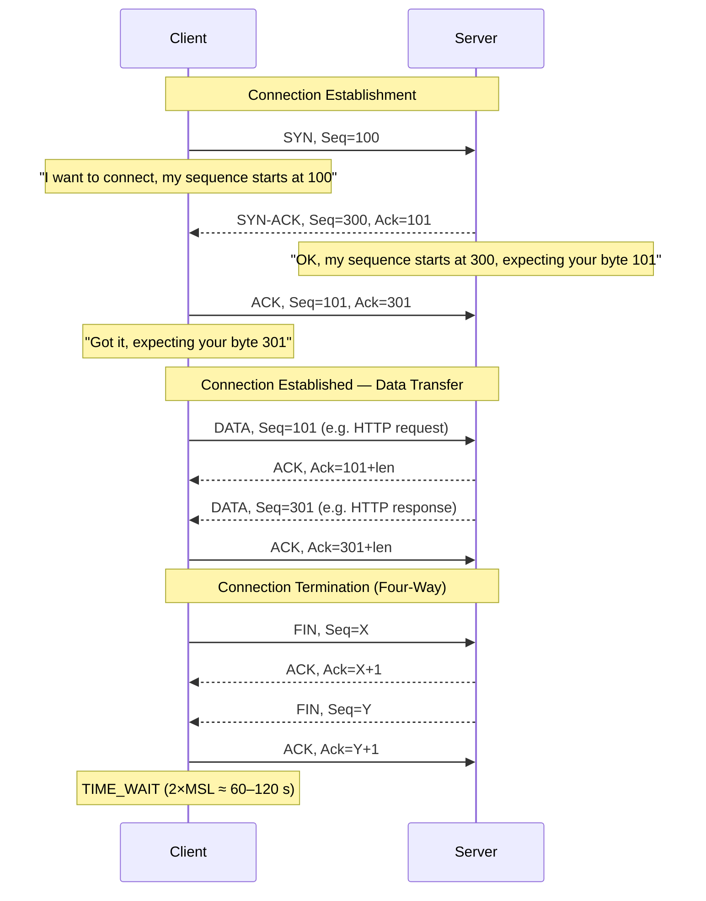
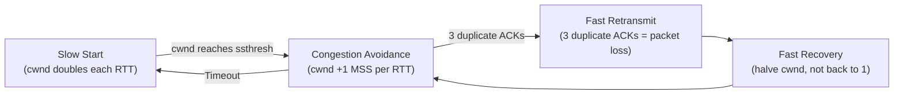

---
title: "TCP & UDP"
description: "TCP connection lifecycle, three-way handshake, flow control, congestion control, UDP characteristics, port numbers, and when to choose each transport protocol."
---

import { Tabs, TabItem } from '@astrojs/starlight/components';
import { Aside, Card, CardGrid, Steps, Badge } from '@astrojs/starlight/components';


TCP and UDP are the two dominant transport-layer protocols. TCP provides **reliable, ordered, connection-oriented** delivery. UDP provides **fast, connectionless, best-effort** delivery. Every network application chooses one based on its requirements.

## TCP — Transmission Control Protocol

TCP guarantees that data:
- Arrives at the destination (reliability via acknowledgement and retransmission)
- Arrives in the correct order (sequence numbers)
- Arrives without duplication (sequence numbers)
- Does not overwhelm the receiver (flow control)
- Does not overwhelm the network (congestion control)

### TCP Segment Structure

```
 0                   1                   2                   3
 0 1 2 3 4 5 6 7 8 9 0 1 2 3 4 5 6 7 8 9 0 1 2 3 4 5 6 7 8 9 0 1
+-+-+-+-+-+-+-+-+-+-+-+-+-+-+-+-+-+-+-+-+-+-+-+-+-+-+-+-+-+-+-+-+
|          Source Port          |       Destination Port        |
+-+-+-+-+-+-+-+-+-+-+-+-+-+-+-+-+-+-+-+-+-+-+-+-+-+-+-+-+-+-+-+-+
|                        Sequence Number                        |
+-+-+-+-+-+-+-+-+-+-+-+-+-+-+-+-+-+-+-+-+-+-+-+-+-+-+-+-+-+-+-+-+
|                    Acknowledgment Number                      |
+-+-+-+-+-+-+-+-+-+-+-+-+-+-+-+-+-+-+-+-+-+-+-+-+-+-+-+-+-+-+-+-+
|  Data |           |U|A|P|R|S|F|                               |
| Offset| Reserved  |R|C|S|S|Y|I|            Window             |
|       |           |G|K|H|T|N|N|                               |
+-+-+-+-+-+-+-+-+-+-+-+-+-+-+-+-+-+-+-+-+-+-+-+-+-+-+-+-+-+-+-+-+
|           Checksum            |         Urgent Pointer        |
+-+-+-+-+-+-+-+-+-+-+-+-+-+-+-+-+-+-+-+-+-+-+-+-+-+-+-+-+-+-+-+-+
|                    Options (if any)                           |
+-+-+-+-+-+-+-+-+-+-+-+-+-+-+-+-+-+-+-+-+-+-+-+-+-+-+-+-+-+-+-+-+
|                    Data                                       |
+-+-+-+-+-+-+-+-+-+-+-+-+-+-+-+-+-+-+-+-+-+-+-+-+-+-+-+-+-+-+-+-+
```

| Field | Size | Purpose |
|---|---|---|
| Source Port | 16 bit | Sending application's port |
| Destination Port | 16 bit | Receiving application's port |
| Sequence Number | 32 bit | Position of this segment's first byte in the byte stream |
| Acknowledgment Number | 32 bit | Next byte expected from the other side |
| Flags | 6 bit | SYN, ACK, FIN, RST, PSH, URG |
| Window | 16 bit | Receive buffer size — flow control |
| Checksum | 16 bit | Error detection |

### TCP Flags

| Flag | Hex | Meaning |
|---|---|---|
| **SYN** | 0x02 | Synchronise — initiate connection |
| **ACK** | 0x10 | Acknowledgment — confirms received data |
| **FIN** | 0x01 | Finish — initiate graceful close |
| **RST** | 0x04 | Reset — abort connection immediately |
| **PSH** | 0x08 | Push — deliver data to application immediately |
| **URG** | 0x20 | Urgent data pointer is valid |

---

## Three-Way Handshake (Connection Establishment)



### Why TIME_WAIT?

After the client sends the final ACK, it waits for 2 × Maximum Segment Lifetime (typically 60–120 seconds) before fully closing. This ensures:
1. The final ACK reaches the server (if lost, the server will resend its FIN)
2. Old duplicate packets from this connection expire before a new connection reuses the same 4-tuple (src IP, src port, dst IP, dst port)

TIME_WAIT on busy servers can exhaust ephemeral ports — tunable via `net.ipv4.tcp_tw_reuse` (Linux).

---

## Flow Control — Sliding Window

The receiver advertises a **window size** — how many bytes it can buffer. The sender cannot send more than the window size worth of unacknowledged data.

```
Sender:   [Sent+Acked][Sent, not Acked  ][Can Send     ][Cannot Send]
                      |<---- Window ----->|
```

If the receiver's buffer fills up, it shrinks the window (down to 0 = "stop sending"). The sender pauses and probes periodically.

Modern TCP uses **window scaling** (RFC 7323) to allow windows larger than 65,535 bytes (critical for high-bandwidth, high-latency links — BDP: Bandwidth × Delay Product).

---

## Congestion Control

Prevents a fast sender from overwhelming slow links in the network (distinct from flow control which prevents overwhelming the receiver).



| Phase | Behaviour |
|---|---|
| **Slow Start** | cwnd doubles each RTT — exponential growth |
| **Congestion Avoidance** | cwnd grows by 1 MSS per RTT — linear growth |
| **Fast Retransmit** | On 3 duplicate ACKs, retransmit immediately (don't wait for timeout) |
| **Fast Recovery** | Halve cwnd (CUBIC/Reno) instead of restarting from 1 |

**Modern algorithms:** TCP CUBIC (Linux default), BBR (Google, low-latency), QUIC (HTTP/3).

---

## UDP — User Datagram Protocol

UDP is a thin wrapper around IP packets — it adds source/destination ports and a checksum, nothing else. No connection, no ordering, no retransmission, no flow control.

### UDP Datagram Structure

```
 0      7 8     15 16    23 24    31
+--------+--------+--------+--------+
|     Source Port |  Destination Port|
+--------+--------+--------+--------+
|      Length     |    Checksum     |
+--------+--------+--------+--------+
|                Data               |
+-----------------------------------+
```

Only 8 bytes of header overhead (vs TCP's 20 bytes minimum).

### When to Use UDP

UDP is the right choice when:
- **Speed matters more than reliability** — real-time audio/video (packet loss causes a glitch, retransmission would be worse)
- **Low latency is critical** — online gaming, financial trading
- **The application does its own reliability** — QUIC (HTTP/3), DTLS
- **Small request/response** — DNS, NTP (a single UDP packet is fine; TCP handshake would be expensive)
- **Multicast / Broadcast** — TCP is inherently unicast; UDP supports multicast
- **Simple queries** — SNMP, DHCP

---

## Port Numbers

Ports are 16-bit numbers (0–65535) that identify the application endpoint within a host.

### Port Ranges

| Range | Name | Description |
|---|---|---|
| 0–1023 | Well-known / System | Reserved for standard protocols (requires root on Unix) |
| 1024–49151 | Registered | Registered with IANA for specific services |
| 49152–65535 | Dynamic / Ephemeral | Assigned temporarily to clients for outbound connections |

### Common Ports

| Port | Protocol | Service |
|---|---|---|
| 20 | TCP | FTP data |
| 21 | TCP | FTP control |
| 22 | TCP | SSH |
| 23 | TCP | Telnet (insecure) |
| 25 | TCP | SMTP (server-to-server) |
| 53 | TCP/UDP | DNS |
| 67/68 | UDP | DHCP (server/client) |
| 80 | TCP | HTTP |
| 110 | TCP | POP3 |
| 123 | UDP | NTP |
| 143 | TCP | IMAP |
| 161/162 | UDP | SNMP |
| 179 | TCP | BGP |
| 389 | TCP | LDAP |
| 443 | TCP | HTTPS |
| 445 | TCP | SMB |
| 465 | TCP | SMTPS (submission) |
| 514 | UDP | Syslog |
| 587 | TCP | SMTP submission (with STARTTLS) |
| 636 | TCP | LDAPS |
| 993 | TCP | IMAPS |
| 995 | TCP | POP3S |
| 1433 | TCP | MSSQL |
| 1521 | TCP | Oracle DB |
| 3306 | TCP | MySQL / MariaDB |
| 3389 | TCP | RDP |
| 5432 | TCP | PostgreSQL |
| 5900 | TCP | VNC |
| 6379 | TCP | Redis |
| 8080 | TCP | HTTP alternate |
| 8443 | TCP | HTTPS alternate |
| 9200 | TCP | Elasticsearch |
| 27017 | TCP | MongoDB |

---

## TCP vs UDP Comparison

| Feature | TCP | UDP |
|---|---|---|
| Connection | Connection-oriented (3-way handshake) | Connectionless |
| Reliability | Guaranteed delivery (ACK + retransmit) | Best-effort |
| Ordering | In-order delivery | No ordering guarantee |
| Flow control | Window-based | None |
| Congestion control | CUBIC, BBR, etc. | None (app responsibility) |
| Error detection | Checksum + recovery | Checksum only (detection, no correction) |
| Header size | 20–60 bytes | 8 bytes |
| Speed | Slower (overhead) | Faster (no overhead) |
| Use cases | HTTP, SSH, email, databases | DNS, VoIP, video streaming, gaming, DHCP |

---

## Practical Tools

```bash
# Show TCP/UDP connections and listening ports
ss -tlnp        # TCP listening
ss -ulnp        # UDP listening
ss -s           # summary statistics
netstat -an     # all connections (older)

# Test TCP connectivity
nc -zv host.example.com 443
telnet host.example.com 80

# Monitor TCP connections in real time
watch -n1 'ss -s'

# Inspect TCP retransmissions (Linux)
ss -t -o        # shows retransmit timers
cat /proc/net/tcp

# Capture TCP handshake
tcpdump -i eth0 'tcp[tcpflags] & (tcp-syn|tcp-ack|tcp-fin) != 0' -n

# Check ephemeral port range
cat /proc/sys/net/ipv4/ip_local_port_range
# Typical: 32768   60999
```
