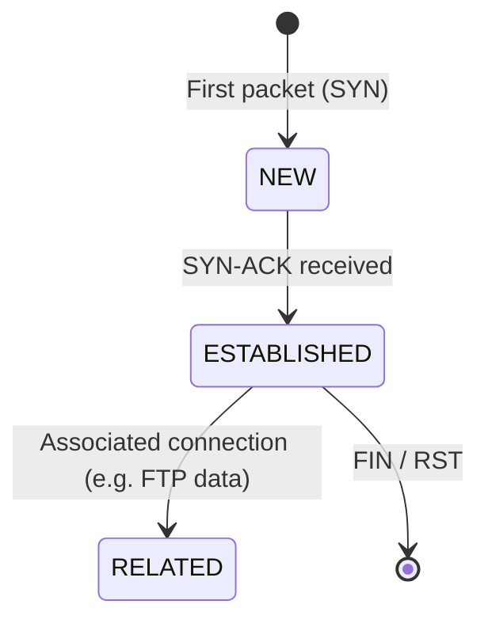
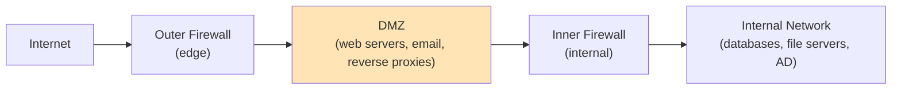
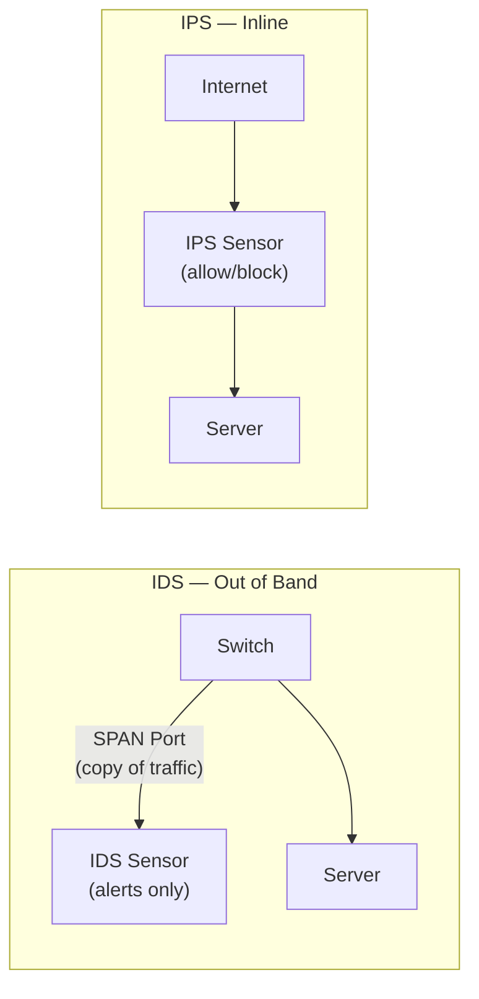
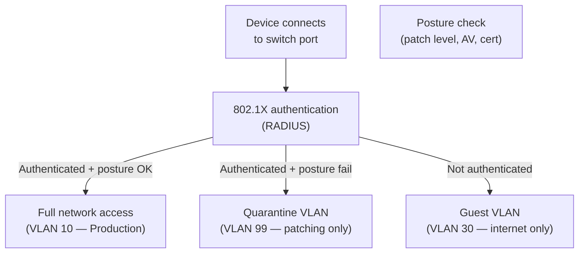

import \{ Tabs, TabItem \} from '@astrojs/starlight/components';
import \{ Aside, Card, CardGrid, Steps, Badge \} from '@astrojs/starlight/components';


Network security controls operate at the infrastructure level — filtering, monitoring, and enforcing policy on traffic before it reaches hosts or applications. Firewalls, IDS/IPS, and NAC are the core building blocks of any defended network.

## Firewall Types

### Packet Filter (Stateless)

Matches each packet independently against rules based on: src IP, dst IP, src port, dst port, protocol. Has no memory of previous packets — cannot distinguish a valid TCP response from an attack.

**Rules are evaluated top to bottom; first match wins.**

```
# iptables — simple stateless packet filter
iptables -A INPUT -p tcp --dport 22 -s 192.168.1.0/24 -j ACCEPT
iptables -A INPUT -p tcp --dport 22 -j DROP
iptables -A INPUT -p tcp --dport 443 -j ACCEPT
iptables -A INPUT -p tcp --dport 80 -j ACCEPT
iptables -A INPUT -j DROP    # default deny
```

**Weakness:** Must explicitly allow both directions of a connection — return traffic must be permitted by a separate rule. Vulnerable to IP spoofing.

### Stateful Inspection Firewall

Tracks the **state of each connection** in a state table. Automatically allows return traffic for established connections.



**Connection states in iptables/nftables:**
- `NEW` — first packet of a connection (SYN)
- `ESTABLISHED` — part of an ongoing connection
- `RELATED` — new connection related to existing one (FTP data, ICMP error)
- `INVALID` — doesn't match any known connection

```bash
# iptables stateful — only allow established/related return traffic
iptables -A INPUT -m conntrack --ctstate ESTABLISHED,RELATED -j ACCEPT
iptables -A INPUT -m conntrack --ctstate INVALID -j DROP
iptables -A INPUT -p tcp --dport 443 -m conntrack --ctstate NEW -j ACCEPT
iptables -A INPUT -j DROP
```

### NGFW — Next-Generation Firewall

NGFWs add Layer 7 application intelligence to stateful inspection:

| Feature | What it does |
|---|---|
| **App-ID** | Identifies applications by behaviour, not just port (e.g., block Facebook even on port 443) |
| **User-ID** | Applies policies per user/group (integrates with AD/LDAP) |
| **TLS inspection** | Decrypts and inspects encrypted HTTPS traffic for threats |
| **IPS engine** | Detects and blocks exploits inline |
| **Threat intelligence** | Blocks known malicious IPs/domains/hashes |
| **URL filtering** | Blocks categories (gambling, malware, streaming) |
| **Sandboxing** | Detonates files in isolated environment to detect zero-days |

**Vendors:** Palo Alto Networks, Fortinet FortiGate, Check Point, Cisco Firepower, pfSense + Suricata.

---

## Firewall Rule Design

### Rule Order and Best Practices

```
# Optimal rule order for performance and security:
1. Allow ESTABLISHED/RELATED (fast path for existing connections)
2. Drop INVALID
3. Allow management access (SSH, HTTPS) — source-restricted
4. Protocol-specific rules (ICMP ping, DNS, etc.)
5. Application rules (HTTPS, HTTP)
6. Default deny ALL
```

### Writing Good Rules

```
# ✗ Bad — too broad, no documentation
permit any any

# ✗ Bad — allows from any source
permit tcp any host 10.0.1.5 eq 3306

# ✓ Good — specific source, destination, and service; documented purpose
# Database access: app servers to primary DB only
permit tcp 10.0.2.0/24 host 10.0.1.5 eq 3306

# ✓ Good — time-restricted admin access
permit tcp 192.168.1.0/24 any eq 22 time-range BUSINESS_HOURS

# ✓ Always end with explicit deny and log
deny any any log
```

### Cloud Security Groups (AWS example)

```hcl
resource "aws_security_group" "app" {
  name   = "app-sg"
  vpc_id = aws_vpc.main.id

  # Allow HTTPS from ALB only
  ingress {
    from_port       = 3000
    to_port         = 3000
    protocol        = "tcp"
    security_groups = [aws_security_group.alb.id]
  }

  # Allow all egress (or restrict to known services)
  egress {
    from_port   = 0
    to_port     = 0
    protocol    = "-1"
    cidr_blocks = ["0.0.0.0/0"]
  }
}
```

---

## DMZ — Demilitarised Zone

A DMZ is a network segment that sits between the internet and the internal network. Public-facing servers live here — separate from internal systems.



**Rules:**
- Internet → DMZ: Allow HTTP/HTTPS, SMTP
- DMZ → Internet: Allow HTTPS (updates, APIs)
- DMZ → Internal: Allow only specific services (DB port, LDAP) to specific hosts
- Internal → DMZ: Allow management (SSH, monitoring)
- Internet → Internal: **Deny everything**

---

## IDS vs IPS

| Feature | IDS (Intrusion Detection) | IPS (Intrusion Prevention) |
|---|---|---|
| Deployment | Out-of-band (tap/mirror) | Inline (in the traffic path) |
| Action on detection | Alert only | Alert + block/reset/drop |
| Performance impact | None (passive) | Some latency (inline processing) |
| False positive risk | Low risk (only alerts) | Higher risk (can block legitimate traffic) |
| Bypass risk | No traffic impact | Can be bypassed if overloaded |



### Detection Methods

| Method | How it works | Strengths | Weaknesses |
|---|---|---|---|
| **Signature-based** | Match traffic against known-bad patterns | Low false positives for known threats | Misses zero-days; requires constant updates |
| **Anomaly-based** | Statistical model of normal traffic; alert on deviation | Can detect zero-days | High false positive rate |
| **Heuristic** | Rule-based logical analysis | Flexible | Requires tuning |
| **Behavioural** | Track sequences of actions over time | Detects slow/low attacks | Complex, resource-intensive |

### Common IDS/IPS Platforms

| Platform | Type | Notes |
|---|---|---|
| **Snort** | Open-source | Industry-standard; rule-based; NIDS/NIPS |
| **Suricata** | Open-source | Multi-threaded Snort-compatible; built-in Lua rules |
| **Zeek** (formerly Bro) | Open-source | Scripting-based; deep protocol analysis; traffic logging |
| **OSSEC / Wazuh** | Open-source HIDS | Host-based (log analysis, file integrity, rootkit detection) |
| **Cisco Firepower** | Commercial | NGFW with Snort-based IPS |
| **Palo Alto Threat Prevention** | Commercial | Integrated NGFW IPS |

---

## NAC — Network Access Control

NAC ensures only compliant, authorised devices connect to the network. It checks device posture (patch level, AV status, certificate) before granting access.



**Vendors:** Cisco ISE, Aruba ClearPass, FortiNAC, PacketFence (open-source).

**Key enforcement points:**
- 802.1X on wired switch ports
- 802.1X on wireless SSIDs
- VPN gateway post-authentication posture check

---

## Linux Firewall Tools

### nftables (Modern — Recommended)

```bash
# /etc/nftables.conf
table inet filter {
    chain input {
        type filter hook input priority 0; policy drop;

        ct state established,related accept
        ct state invalid drop
        iif lo accept

        # ICMP
        ip protocol icmp accept
        ip6 nexthdr icmpv6 accept

        # SSH — management only
        tcp dport 22 ip saddr 192.168.1.0/24 accept

        # Web
        tcp dport { 80, 443 } accept
    }

    chain forward {
        type filter hook forward priority 0; policy drop;
    }

    chain output {
        type filter hook output priority 0; policy accept;
    }
}
```

```bash
nft list ruleset
nft -f /etc/nftables.conf
systemctl enable --now nftables
```

### firewalld (RHEL / Fedora)

```bash
# Enable HTTPS
firewall-cmd --permanent --add-service=https
firewall-cmd --permanent --add-port=8080/tcp
firewall-cmd --permanent --remove-service=dhcpv6-client
firewall-cmd --reload
firewall-cmd --list-all
```

---

## Firewall Logging & Monitoring

Effective firewall management requires logging all dropped traffic and regularly reviewing rules.

```bash
# Log dropped packets in iptables
iptables -A INPUT -j LOG --log-prefix "FW-DROP: " --log-level 4
iptables -A INPUT -j DROP

# View firewall logs
journalctl -k | grep "FW-DROP"
grep "FW-DROP" /var/log/syslog

# Analyse top blocked sources
grep "FW-DROP" /var/log/syslog | awk '{for(i=1;i<=NF;i++) if($i~/SRC=/) print $i}' \
  | sort | uniq -c | sort -rn | head -20
```
