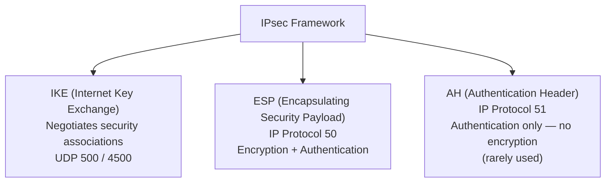
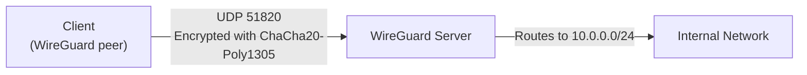

---
title: "VPN & Tunneling"
description: "VPN types, IPsec (IKEv2, ESP, AH), WireGuard, OpenVPN, SSL VPN, split tunnelling, GRE, and when to use each VPN technology."
---

import { Tabs, TabItem } from '@astrojs/starlight/components';
import { Aside, Card, CardGrid, Steps, Badge } from '@astrojs/starlight/components';


A VPN (Virtual Private Network) creates an encrypted tunnel over an untrusted network, allowing remote users or sites to communicate securely. Tunnelling protocols wrap one protocol's packets inside another, often adding encryption and authentication.

## VPN Use Cases

| Use Case | Description |
|---|---|
| **Remote access** | Individual user connects to corporate network from home/public Wi-Fi |
| **Site-to-site** | Two offices connected over the internet as if on the same LAN |
| **Cloud VPN** | Connect on-premises network to AWS VPC / Azure VNet / GCP VPC |
| **Always-on corporate** | Every device always routes through corporate firewall (ZTNA alternative) |
| **Privacy VPN** | Consumer service to mask IP from websites and ISPs |

---

## IPsec — Internet Protocol Security

IPsec is the foundational VPN framework operating at Layer 3. It is the standard for site-to-site VPNs, mobile access VPNs (IKEv2), and encrypted tunnels between routers.

### IPsec Components



### IKE Phase 1 — ISAKMP SA

Establishes a secure channel for IKE itself. Negotiates:
- Encryption algorithm (AES-256)
- Hash/integrity (SHA-384)
- Diffie-Hellman group (DH 19/20 — ECDH)
- Authentication method (PSK or certificates)
- Lifetime

**IKEv1 vs IKEv2:**
- IKEv2 is simpler, faster (fewer messages), supports MOBIKE (roaming), built-in EAP, and is required for modern deployments.

### IKE Phase 2 — IPsec SA

Negotiates the actual data channel:
- ESP encryption (AES-256-GCM)
- Hash (SHA-256)
- PFS (Perfect Forward Secrecy) — fresh DH exchange per session
- Traffic selectors (what traffic the tunnel carries)
- Lifetime

### IPsec Tunnel Modes

| Mode | What is encrypted | Header | Use |
|---|---|---|---|
| **Tunnel mode** | Original IP packet + payload | New IP header added | Site-to-site VPN, remote access |
| **Transport mode** | Payload only | Original IP header preserved | Host-to-host, L2TP inner transport |

```
Tunnel mode packet:
[New IP Header][ESP Header][Original IP Header + TCP + Data][ESP Trailer][ESP Auth]

Transport mode packet:
[Original IP Header][ESP Header][TCP + Data][ESP Trailer][ESP Auth]
```

### IPsec Configuration (strongSwan — Linux)

```
# /etc/ipsec.conf
conn site-to-site
    keyexchange=ikev2
    left=203.0.113.10           # our public IP
    leftsubnet=10.0.1.0/24      # our internal network
    right=198.51.100.20         # peer public IP
    rightsubnet=10.0.2.0/24     # peer internal network
    authby=psk                  # PSK or pubkey
    auto=start
    ike=aes256-sha384-ecp384!
    esp=aes256gcm128-sha384!
    dpdaction=restart
    dpddelay=30s
```

```
# /etc/ipsec.secrets
203.0.113.10 198.51.100.20 : PSK "my-very-secure-preshared-key"
```

---

## WireGuard

WireGuard is a modern, minimal VPN protocol built into the Linux kernel (5.6+). It is significantly simpler and faster than IPsec and OpenVPN, with a much smaller codebase (~4,000 lines vs ~100,000 for OpenVPN).



### Key Properties

- **Protocol:** UDP only (single port, configurable)
- **Encryption:** ChaCha20-Poly1305 (AEAD), Curve25519 (key exchange), BLAKE2s (hash)
- **Keys:** Ed25519 public/private key pairs — no certificates, no PKI required
- **Handshake:** 1-RTT (1 round trip to establish session)
- **Roaming:** Connection follows the client's IP automatically (MOBIKE-like)
- **Stealth:** Silent — no response to unauthenticated packets (no fingerprint)

### WireGuard Server Setup (Linux)

```bash
# Install
apt install wireguard

# Generate server keys
wg genkey | tee /etc/wireguard/server_private.key | wg pubkey > /etc/wireguard/server_public.key

# Generate client keys
wg genkey | tee /etc/wireguard/client_private.key | wg pubkey > /etc/wireguard/client_public.key
```

```ini
# /etc/wireguard/wg0.conf — Server
[Interface]
Address = 10.8.0.1/24
ListenPort = 51820
PrivateKey = <server_private_key>

# Enable NAT for internet access through VPN
PostUp = iptables -A FORWARD -i %i -j ACCEPT; iptables -t nat -A POSTROUTING -o eth0 -j MASQUERADE
PostDown = iptables -D FORWARD -i %i -j ACCEPT; iptables -t nat -D POSTROUTING -o eth0 -j MASQUERADE

[Peer]
# Client 1
PublicKey = <client_public_key>
AllowedIPs = 10.8.0.2/32
```

```ini
# /etc/wireguard/wg0.conf — Client
[Interface]
Address = 10.8.0.2/24
PrivateKey = <client_private_key>
DNS = 10.8.0.1

[Peer]
PublicKey = <server_public_key>
Endpoint = vpn.example.com:51820
AllowedIPs = 0.0.0.0/0, ::/0   # full tunnel (all traffic through VPN)
# For split tunnel: AllowedIPs = 10.0.0.0/8, 192.168.0.0/16
PersistentKeepalive = 25
```

```bash
# Start WireGuard
systemctl enable --now wg-quick@wg0
wg show
```

---

## OpenVPN

TLS-based VPN running at Layer 3 (tun mode) or Layer 2 (tap mode). Highly configurable, runs over TCP or UDP, traverses NAT and firewalls well (uses port 443/TCP if needed).

```
# /etc/openvpn/server.conf (simplified)
port 1194
proto udp
dev tun
ca ca.crt
cert server.crt
key server.key
dh dh2048.pem
tls-auth ta.key 0
cipher AES-256-GCM
auth SHA256
server 10.9.0.0 255.255.255.0
push "route 10.0.0.0 255.255.255.0"
push "dhcp-option DNS 8.8.8.8"
keepalive 10 120
persist-key
persist-tun
user nobody
group nobody
```

**Comparison with WireGuard:**
- OpenVPN is more mature with wider device support (all platforms, old hardware)
- WireGuard is faster, simpler, more modern — prefer WireGuard for new deployments

---

## SSL VPN / Clientless VPN

SSL VPNs operate over HTTPS (port 443), making them firewall-friendly. Many corporate SSL VPNs provide:
- **Clientless web portal:** Browser-based access to internal web apps (no client install)
- **Thin client:** Small plugin or app for RDP, SSH, file shares
- **Full tunnel:** Complete VPN client (similar to IPsec remote access)

**Vendors:** Cisco AnyConnect, Palo Alto GlobalProtect, Fortinet SSL VPN, Citrix Gateway, Pulse Connect Secure.

---

## GRE — Generic Routing Encapsulation

GRE (RFC 2784) tunnels Layer 3 packets inside IP. It has **no encryption** — used to carry multicast, routing protocol traffic, or non-IP protocols across an IP network. Always pair with IPsec for encryption.

```
GRE Tunnel packet:
[Outer IP Header (tunnel endpoints)][GRE Header][Inner IP Header][Payload]
```

```bash
# Linux GRE tunnel
ip tunnel add gre1 mode gre remote 198.51.100.1 local 203.0.113.1 ttl 64
ip addr add 10.255.0.1/30 dev gre1
ip link set gre1 up
ip route add 10.0.2.0/24 dev gre1
```

---

## Split Tunnelling

| Mode | Traffic routing | Privacy | Performance |
|---|---|---|---|
| **Full tunnel** | All traffic through VPN | High — ISP can't see traffic | Lower — all traffic adds VPN overhead |
| **Split tunnel** | Only corporate traffic through VPN; internet direct | Lower — internet traffic bypasses VPN | Higher — local internet stays fast |
| **Inverse split** | Only internet through VPN; corporate direct | Privacy from local network | Unusual — mainly for specific use cases |

```ini
# WireGuard — split tunnel (only route corporate IPs via VPN)
[Peer]
AllowedIPs = 10.0.0.0/8, 172.16.0.0/12, 192.168.100.0/24

# WireGuard — full tunnel (all traffic)
[Peer]
AllowedIPs = 0.0.0.0/0, ::/0
```

---

## VPN Protocol Comparison

| Protocol | Layer | Port | Encryption | Speed | Complexity | Use Case |
|---|---|---|---|---|---|---|
| **WireGuard** | 3 | UDP 51820 | ChaCha20-Poly1305 | Fastest | Low | Modern remote access, site-to-site |
| **IPsec/IKEv2** | 3 | UDP 500/4500 | AES-256-GCM | Fast | High | Enterprise, mobile (built into OS) |
| **OpenVPN** | 3 | UDP/TCP 1194 | AES-256-GCM | Good | Medium | Legacy support, firewall traversal |
| **L2TP/IPsec** | 2 | UDP 1701+500 | AES (via IPsec) | Good | High | Legacy Windows/macOS native |
| **SSTP** | 3 | TCP 443 | AES-256 | Good | Medium | Windows-native, firewall-friendly |
| **PPTP** | 2 | TCP 1723 | MPPE (broken) | Fast | Low | **Broken — do not use** |

---

## VPN Security Best Practices

| Practice | Why |
|---|---|
| Use IKEv2 or WireGuard, not IKEv1 | IKEv1 has known weaknesses and aggressive mode vulnerabilities |
| Require certificate auth, not PSK alone | PSK can be brute-forced or shared insecurely |
| Enable PFS (Perfect Forward Secrecy) | Compromise of long-term key doesn't decrypt past sessions |
| Restrict VPN users to needed resources | VPN access ≠ full network access — use firewall rules per VPN subnet |
| Enable MFA on VPN authentication | Credential theft doesn't immediately grant VPN access |
| Log all VPN connections | Who connected, from where, when — essential for incident response |
| Monitor for impossible travel | Login from two countries within minutes → compromised credentials |
| Rotate PSKs / revoke certificates | Certificate revocation on employee departure |
