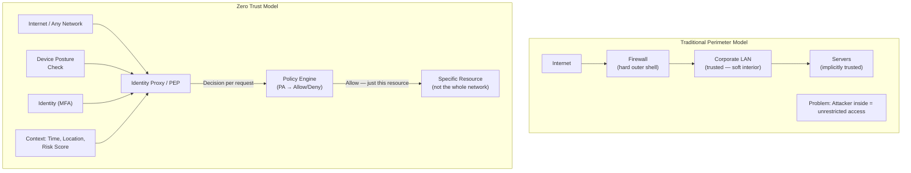
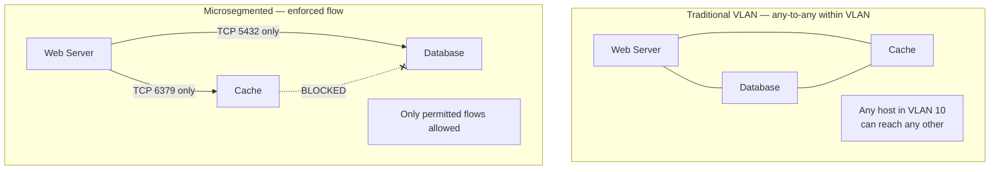
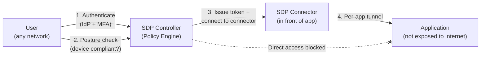
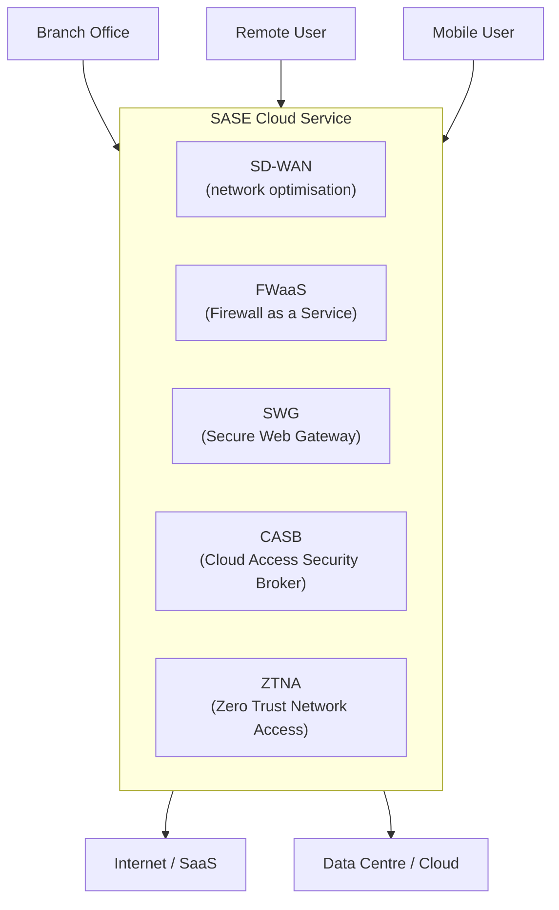
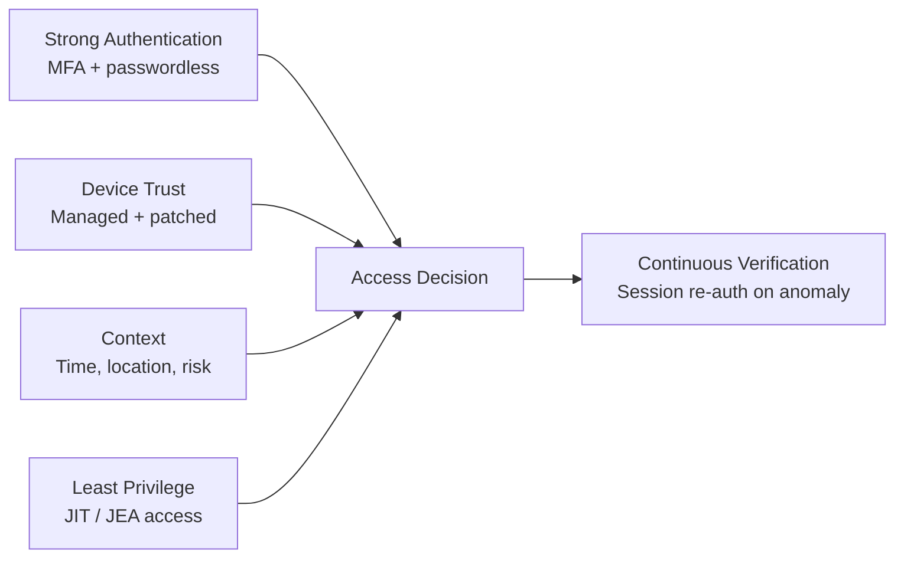

import \{ Tabs, TabItem \} from '@astrojs/starlight/components';
import \{ Aside, Card, CardGrid, Steps, Badge \} from '@astrojs/starlight/components';


Zero Trust is a security model based on the principle **"never trust, always verify"**. It assumes that the network perimeter has already been breached — threats can be internal or external. Every access request is verified based on identity, device posture, and context — regardless of whether it originates inside or outside the corporate network.

## Traditional vs Zero Trust Model



---

## Core Zero Trust Principles

| Principle | Implementation |
|---|---|
| **Verify explicitly** | Authenticate and authorise every request using identity, device posture, location, and behaviour |
| **Use least privilege access** | Limit access to only the specific resource needed, for only the time needed |
| **Assume breach** | Design as if the attacker is already inside; limit blast radius, encrypt all internal traffic, monitor everything |

---

## Microsegmentation

Traditional networks use coarse VLANs. Microsegmentation applies granular policy at the **workload level** — each workload only communicates with the specific services it needs.



### Microsegmentation Tools

| Layer | Tool | Approach |
|---|---|---|
| **Cloud** | AWS Security Groups, GCP VPC Firewall, Azure NSGs | Per-resource rules |
| **Kubernetes** | NetworkPolicy (via Calico, Cilium) | Pod-to-pod flow control |
| **VMware** | NSX-T Distributed Firewall | Hypervisor-level enforcement |
| **Host-based** | iptables/nftables, Windows Firewall, CrowdStrike | Per-host enforcement |
| **Dedicated platforms** | Illumio, Guardicore, Cisco Tetration | App-aware microsegmentation |

### Kubernetes NetworkPolicy (Zero Trust)

```yaml
# Default deny all — then explicitly allow
apiVersion: networking.k8s.io/v1
kind: NetworkPolicy
metadata:
  name: default-deny-all
  namespace: production
spec:
  podSelector: {}
  policyTypes:
    - Ingress
    - Egress

---
# Allow api → database only
apiVersion: networking.k8s.io/v1
kind: NetworkPolicy
metadata:
  name: allow-api-to-db
  namespace: production
spec:
  podSelector:
    matchLabels:
      app: database
  ingress:
    - from:
        - podSelector:
            matchLabels:
              app: api
      ports:
        - protocol: TCP
          port: 5432
```

---

## SDP — Software-Defined Perimeter

SDP (also called Zero Trust Network Access — ZTNA) replaces the VPN model. Instead of giving a user access to the whole network, SDP grants access to **specific applications**, authenticated per session.



**Key difference from VPN:**
- VPN: authenticate once → access entire network subnet
- SDP/ZTNA: authenticate per request → access specific app only; network not exposed

**Vendors:** Cloudflare Access, Zscaler Private Access (ZPA), Palo Alto Prisma Access, Tailscale, Google BeyondCorp, Cisco Duo Network Gateway.

### Tailscale (WireGuard-based Zero Trust)

Tailscale implements a mesh VPN using WireGuard, with centralised identity (Google/GitHub/OIDC SSO) and ACL-based access control:

```json
// Tailscale ACL policy (HuJSON)
{
  "acls": [
    // Developers can access development servers
    {
      "action": "accept",
      "src": ["group:developers"],
      "dst": ["tag:dev-servers:*"]
    },
    // Only ops can access production
    {
      "action": "accept",
      "src": ["group:ops"],
      "dst": ["tag:production:22,443,3000"]
    },
    // Block everything else
    {
      "action": "accept",
      "src": ["*"],
      "dst": ["*:0"]
    }
  ],
  "tagOwners": {
    "tag:production": ["group:ops"],
    "tag:dev-servers": ["group:developers"]
  }
}
```

---

## SASE — Secure Access Service Edge

SASE (pronounced "sassy") converges network and security functions into a cloud-delivered service — eliminating the need to backhaul traffic to a central data centre for inspection.



**SASE Components:**

| Component | Function |
|---|---|
| **SD-WAN** | Intelligently route traffic across multiple WAN links |
| **FWaaS** | Cloud-based firewall with NGFW capabilities |
| **SWG** | Web proxy — URL filtering, malware scanning |
| **CASB** | Visibility and control over SaaS application usage |
| **ZTNA** | App-specific access instead of network access |

**Vendors:** Cloudflare One, Zscaler, Palo Alto Prisma SASE, Cato Networks, Netskope.

---

## Identity as the New Perimeter

In Zero Trust, identity replaces the network location as the primary trust anchor:



### Just-in-Time (JIT) Access

Rather than permanent role assignments, JIT access grants elevated permissions only when needed, for a limited time, with approval workflow:

```bash
# Azure AD PIM — activate a role for 2 hours
az ad pim activation create \
  --role-id "b24988ac-6180-42a0-ab88-20f7382dd24c" \
  --resource-id <subscription-id> \
  --duration PT2H \
  --justification "Incident investigation #INC-1234"
```

### Privileged Access Workstations (PAW)

Dedicated hardened machines used exclusively for admin tasks. No email, no web browsing — only management tools. Admin connects to systems from the PAW, which connects through a jump host or PAM solution.

---

## Service Mesh (mTLS for Microservices)

Service meshes (Istio, Linkerd, Cilium) implement Zero Trust for microservices:
- Every service-to-service call uses **mTLS** (mutual TLS) — both sides authenticate with certificates
- The mesh issues short-lived certificates automatically
- Network policies are enforced at the sidecar/eBPF level, not the application level

```yaml
# Istio PeerAuthentication — require mTLS for all services in namespace
apiVersion: security.istio.io/v1beta1
kind: PeerAuthentication
metadata:
  name: default
  namespace: production
spec:
  mtls:
    mode: STRICT    # STRICT = mTLS required | PERMISSIVE = optional

---
# Istio AuthorizationPolicy — allow only specific service access
apiVersion: security.istio.io/v1beta1
kind: AuthorizationPolicy
metadata:
  name: allow-api-to-database
  namespace: production
spec:
  selector:
    matchLabels:
      app: database
  rules:
    - from:
        - source:
            principals: ["cluster.local/ns/production/sa/api-service"]
      to:
        - operation:
            ports: ["5432"]
```

---

## Zero Trust Maturity Model

| Stage | Characteristics |
|---|---|
| **Traditional** | Implicit trust; perimeter-based; VPN = full network access |
| **Initial ZT** | MFA enforced; some microsegmentation; basic device posture |
| **Advanced ZT** | Identity-based access; ZTNA replacing VPN; continuous monitoring |
| **Optimal ZT** | JIT access; full microsegmentation; automated policy; behaviour analytics |

---

## Zero Trust Implementation Checklist

| Area | Action |
|---|---|
| Identity | Enforce MFA everywhere; phishing-resistant (FIDO2/passkeys) for privileged access |
| Devices | Device compliance check before access; MDM enrolment; certificate-based auth |
| Network | Replace VPN with ZTNA; default-deny internal firewall rules; microsegment workloads |
| Applications | Authenticate every API call; OAuth 2.0 + OIDC; no implicit internal trust |
| Data | Classify data; encrypt in transit (mTLS) and at rest; DLP controls |
| Monitoring | Log all access decisions; SIEM correlation; anomaly detection; re-auth on suspicion |
