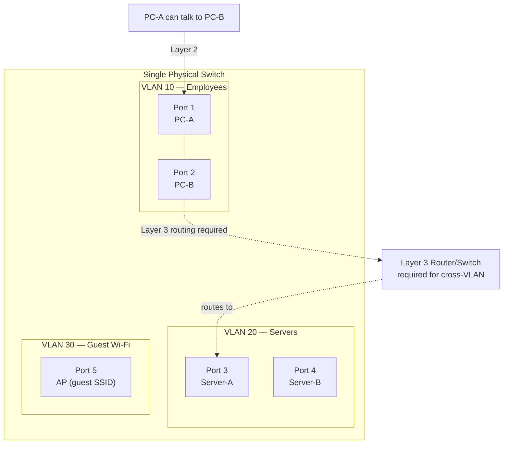
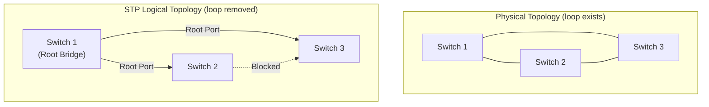

Switches are the backbone of local networks. Beyond basic MAC-address forwarding, managed switches provide VLANs for logical segmentation, STP to prevent loops, and security features to control what connects to each port.

## VLANs — Virtual Local Area Networks

A VLAN creates a logical broadcast domain within a physical switch. Devices in different VLANs cannot communicate at Layer 2 — they need a router or Layer 3 switch.



### Benefits of VLANs

- **Security:** HR, Finance, and Guest networks cannot see each other's Layer 2 traffic
- **Broadcast containment:** Broadcast storms and ARP floods are contained per VLAN
- **Flexibility:** Users on the same VLAN regardless of physical location
- **QoS:** Different QoS policies per VLAN (voice, video, data)

### VLAN Database

```bash
# Cisco IOS — create VLANs
vlan 10
 name Employees
vlan 20
 name Servers
vlan 30
 name Guest

show vlan brief
```

---

## 802.1Q Trunking

A **trunk port** carries traffic for multiple VLANs between switches (or from a switch to a router/server). Frames are tagged with a 4-byte **802.1Q header** to identify their VLAN.

```
Original Ethernet Frame:
[DST MAC][SRC MAC][EtherType][Payload][FCS]

802.1Q Tagged Frame:
[DST MAC][SRC MAC][0x8100][TCI: PCP(3)+DEI(1)+VID(12)][EtherType][Payload][FCS]
                    ↑ TPID   ↑ VLAN ID (12 bits = 4094 VLANs max, 0 and 4095 reserved)
```

The **VLAN ID (VID)** field is 12 bits → 4094 usable VLANs (1–4094).

### Access Port vs Trunk Port

| Port Type | What it carries | VLAN tag on wire? | Used for |
|---|---|---|---|
| **Access port** | Single VLAN | No — tag is added/stripped by switch | End devices (PCs, printers) |
| **Trunk port** | Multiple VLANs | Yes — 802.1Q tag preserved | Switch-to-switch, switch-to-router, switch-to-server |

```bash
# Cisco — configure access port (VLAN 10)
interface GigabitEthernet1/0/1
 switchport mode access
 switchport access vlan 10
 switchport nonegotiate   ! disable DTP

# Cisco — configure trunk port
interface GigabitEthernet1/0/48
 switchport mode trunk
 switchport trunk encapsulation dot1q
 switchport trunk allowed vlan 10,20,30
 switchport trunk native vlan 999    ! native VLAN (untagged) — not VLAN 1
 switchport nonegotiate              ! disable DTP

show interfaces trunk
show interfaces GigabitEthernet1/0/48 switchport
```

### Native VLAN

The **native VLAN** is the VLAN whose frames travel on a trunk port **without** an 802.1Q tag. By default this is VLAN 1. Change it to an unused VLAN to prevent native VLAN hopping attacks:

```bash
! ✗ Default — VLAN 1 native on all ports
! ✓ Change native VLAN to an unused VLAN
switchport trunk native vlan 999
vlan 999
 name NATIVE_UNUSED
```

---

## STP — Spanning Tree Protocol

Ethernet has no TTL mechanism. A loop in the topology causes a **broadcast storm** — frames circulate infinitely and crash the network within seconds. STP prevents loops by logically blocking redundant links.



### STP Port States

| State | Duration | Behaviour |
|---|---|---|
| Blocking | 20 s (Max Age) | Receives BPDUs, discards all other frames |
| Listening | 15 s (Forward Delay) | Participates in root/port election |
| Learning | 15 s (Forward Delay) | Learns MAC addresses, no forwarding |
| Forwarding | — | Normal operation |
| Disabled | — | Administratively shut down |

Total convergence time (original 802.1D): **20 + 15 + 15 = 50 seconds** — too slow for modern networks.

### STP Variants

| Protocol | Standard | Convergence | VLAN Support |
|---|---|---|---|
| **STP** (802.1D) | IEEE 1998 | ~50 s | Single instance |
| **RSTP** (802.1w) | IEEE 2004 | < 1 s | Single instance |
| **MSTP** (802.1s) | IEEE 2005 | < 1 s | Multiple instances (groups of VLANs) |
| **PVST+** | Cisco | ~50 s | Per-VLAN STP instance |
| **Rapid PVST+** | Cisco | < 1 s | Per-VLAN RSTP instance |

### Root Bridge Election

The switch with the **lowest Bridge ID** becomes the Root Bridge. Bridge ID = Priority (4 bits) + Extended System ID (12 bits, VLAN ID) + MAC address.

Default priority: 32768. Tune to control root bridge placement:

```bash
! Cisco — force this switch to be root for VLAN 10
spanning-tree vlan 10 root primary      ! sets priority to 24576
spanning-tree vlan 20 root secondary   ! sets priority to 28672

! Or manually
spanning-tree vlan 10 priority 4096    ! lower = more likely to win

show spanning-tree vlan 10
show spanning-tree summary
```

### PortFast and BPDU Guard

```bash
! PortFast — skip STP learning states on access ports (hosts connect immediately)
! BPDU Guard — shut the port if a BPDU is received (prevents rogue switches)
interface GigabitEthernet1/0/1
 spanning-tree portfast
 spanning-tree bpduguard enable

! Enable globally for all access ports
spanning-tree portfast default
spanning-tree portfast bpduguard default
```

---

## Inter-VLAN Routing

Devices in different VLANs need a Layer 3 device to communicate.

### Router-on-a-Stick

A single physical link carries multiple VLANs as a trunk; the router uses **sub-interfaces** for each VLAN:

```
interface GigabitEthernet0/0
 no ip address
 no shutdown

interface GigabitEthernet0/0.10
 encapsulation dot1Q 10
 ip address 192.168.10.1 255.255.255.0

interface GigabitEthernet0/0.20
 encapsulation dot1Q 20
 ip address 192.168.20.1 255.255.255.0

interface GigabitEthernet0/0.30
 encapsulation dot1Q 30
 ip address 192.168.30.1 255.255.255.0
```

Bottleneck: all traffic between VLANs flows through one physical link.

### Layer 3 Switch (SVIs)

A Layer 3 switch has routing built in — each VLAN has a **Switched Virtual Interface (SVI)**:

```bash
! Enable routing
ip routing

! Create SVIs for each VLAN
interface Vlan10
 ip address 192.168.10.1 255.255.255.0
 no shutdown

interface Vlan20
 ip address 192.168.20.1 255.255.255.0
 no shutdown

! Set default route to upstream router
ip route 0.0.0.0 0.0.0.0 203.0.113.1

show ip route
```

---

## Port Security

Port security limits which devices can connect to a switch port, preventing MAC flooding and unauthorised connections.

```bash
! Restrict a port to 2 MACs, shut it down if violated
interface GigabitEthernet1/0/5
 switchport mode access
 switchport access vlan 10
 switchport port-security maximum 2
 switchport port-security mac-address sticky        ! learn current MACs dynamically
 switchport port-security violation shutdown        ! shutdown | restrict | protect
 switchport port-security

show port-security
show port-security interface GigabitEthernet1/0/5

! Recovery after violation shutdown
interface GigabitEthernet1/0/5
 shutdown
 no shutdown
```

**Violation modes:**
- `shutdown` — puts port in err-disabled state, sends alert (**most common**)
- `restrict` — drop offending frames, increment violation counter, log
- `protect` — drop offending frames, no log (least visibility)

---

## Dynamic ARP Inspection (DAI)

DAI validates ARP packets against the DHCP snooping binding table, preventing ARP spoofing.

```bash
! Enable DHCP snooping (required for DAI)
ip dhcp snooping
ip dhcp snooping vlan 10,20

! Enable DAI on VLANs
ip arp inspection vlan 10,20

! Trust uplink port (switch or router)
interface GigabitEthernet1/0/48
 ip arp inspection trust

show ip arp inspection
show ip arp inspection statistics
```

---

## Common Switch Troubleshooting Commands

```bash
# MAC address table
show mac address-table                        # all entries
show mac address-table dynamic               # learned (not static)
show mac address-table vlan 10
show mac address-table address aa:bb:cc:dd:ee:ff

# Interface status
show interfaces GigabitEthernet1/0/1 status
show interfaces GigabitEthernet1/0/1 counters  # errors, drops

# VLAN info
show vlan brief
show vlan id 10

# Trunk info
show interfaces trunk
show interfaces GigabitEthernet1/0/48 trunk

# STP
show spanning-tree vlan 10
show spanning-tree summary

# CDP / LLDP (discover neighbours)
show cdp neighbors detail
show lldp neighbors detail
```
