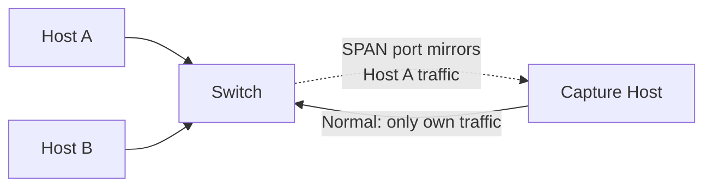

---
title: "Traffic Analysis"
description: "How to capture and analyse network traffic with Wireshark and tcpdump — packet structure, display filters, capture filters, common analysis workflows, and reading real traffic."
---

import { Tabs, TabItem } from '@astrojs/starlight/components';
import { Aside, Card, CardGrid, Steps, Badge } from '@astrojs/starlight/components';


Traffic analysis is the ability to inspect raw network packets — the single most powerful skill for network troubleshooting, security investigation, and protocol understanding. Wireshark provides a graphical interface; tcpdump provides command-line power for headless servers and scripting.

## Packet Capture Fundamentals

When you run a packet capture, the NIC is placed in **promiscuous mode** — it accepts all frames on the wire, not just those addressed to itself. On a switched network, you only see traffic to/from your own machine unless you mirror a switch port (SPAN) or tap the link.



**Capture points:**
- Your workstation: own traffic + broadcasts
- Switch SPAN/mirror port: designated traffic mirrored
- Network TAP: passive optical/copper tap — zero network impact, full-duplex capture
- Cloud (AWS VPC Traffic Mirroring, GCP Packet Mirroring): cloud-native TAP

---

## tcpdump

`tcpdump` is a command-line packet analyser available on every Unix/Linux system. It writes to a `.pcap` file that can be opened in Wireshark.

### Basic Capture

```bash
# List available interfaces
tcpdump -D

# Capture on all interfaces
tcpdump -i any

# Capture on a specific interface, write to file
tcpdump -i eth0 -w capture.pcap

# Read from a saved file
tcpdump -r capture.pcap

# Verbose output (show more detail)
tcpdump -i eth0 -vvv

# Don't resolve hostnames or ports (-n) — faster, avoids DNS delay
tcpdump -i eth0 -n
```

### Capture Filters (BPF Syntax)

Capture filters use Berkeley Packet Filter (BPF) syntax and are applied at the kernel level before data reaches the process — efficient for high-traffic captures.

```bash
# Filter by host
tcpdump -i eth0 host 192.168.1.100
tcpdump -i eth0 src host 192.168.1.100      # source only
tcpdump -i eth0 dst host 8.8.8.8            # destination only

# Filter by port
tcpdump -i eth0 port 443
tcpdump -i eth0 dst port 80
tcpdump -i eth0 portrange 8000-8100

# Filter by protocol
tcpdump -i eth0 tcp
tcpdump -i eth0 udp
tcpdump -i eth0 icmp
tcpdump -i eth0 arp

# Filter by network
tcpdump -i eth0 net 192.168.1.0/24
tcpdump -i eth0 src net 10.0.0.0/8

# Combine filters (and, or, not)
tcpdump -i eth0 'host 192.168.1.100 and port 443'
tcpdump -i eth0 'tcp and not port 22'
tcpdump -i eth0 '(src net 192.168.1.0/24) and dst port 80'

# TCP flags
tcpdump -i eth0 'tcp[tcpflags] & tcp-syn != 0'          # SYN packets
tcpdump -i eth0 'tcp[tcpflags] & (tcp-syn|tcp-ack) == tcp-syn'  # SYN only (no SYN-ACK)
tcpdump -i eth0 'tcp[tcpflags] & tcp-rst != 0'          # RST packets

# ICMP type
tcpdump -i eth0 'icmp[icmptype] = icmp-echo'            # ping requests
tcpdump -i eth0 'icmp[icmptype] = icmp-echoreply'       # ping replies

# Larger packet sizes (useful for payload inspection)
tcpdump -i eth0 -s 0 -w full.pcap     # -s 0 = capture full packet (default snaplen=262144)
```

### Useful One-Liners

```bash
# Top talkers (most packets from each source)
tcpdump -i eth0 -nn -c 10000 | awk '{print $3}' | sort | uniq -c | sort -rn | head

# Watch HTTP requests
tcpdump -i eth0 -A -s 0 'tcp port 80' | grep "^GET\|^POST\|^Host:"

# Capture DNS queries
tcpdump -i eth0 -n udp port 53

# Detect ARP traffic
tcpdump -i eth0 arp -e

# Capture and display in hex+ASCII
tcpdump -i eth0 -XX port 80

# Rotate capture files (100 MB each, keep 10)
tcpdump -i eth0 -w /tmp/cap-%Y%m%d-%H%M%S.pcap -G 3600 -C 100
```

---

## Wireshark

Wireshark is the industry-standard GUI packet analyser. It decodes 2,000+ protocols, colours packets, reconstructs streams, and supports advanced filtering.

### Display Filters

Display filters are applied after capture — they hide packets from view but don't delete them. Uses a different (more powerful) syntax than BPF.

```
# Filter by IP address
ip.addr == 192.168.1.100
ip.src == 10.0.0.1
ip.dst == 8.8.8.8

# Filter by subnet
ip.addr == 192.168.1.0/24

# Filter by protocol
tcp
udp
icmp
arp
dns
http
tls
dhcp
ospf
bgp

# Filter by port
tcp.port == 443
tcp.dstport == 80
udp.port == 53

# Filter by HTTP method / URI
http.request.method == "POST"
http.request.uri contains "/api/login"
http.response.code == 200

# DNS
dns.qry.name contains "example.com"
dns.flags.response == 1           # DNS responses

# TLS
tls.handshake.type == 1           # ClientHello
tls.record.content_type == 23    # Application data (encrypted)

# TCP flags
tcp.flags.syn == 1 && tcp.flags.ack == 0    # SYN only
tcp.flags.reset == 1                         # RST packets
tcp.analysis.retransmission                  # Retransmissions
tcp.analysis.duplicate_ack                   # Duplicate ACKs

# ICMP
icmp.type == 8      # Echo Request
icmp.type == 3      # Destination Unreachable

# Combine with and / or / not
ip.addr == 192.168.1.1 && tcp.port == 443
!(tcp.port == 22)   # exclude SSH
(dns || dhcp) && ip.src == 192.168.1.0/24

# String contains
frame contains "password"
http.request.full_uri contains "login"
```

### Colour Rules (Built-in)

| Colour | Meaning |
|---|---|
| Black / Red | TCP errors (bad checksum, malformed) |
| Red | TCP RST |
| Dark Red | Retransmission |
| Purple | ICMP errors |
| Light Blue | UDP |
| Light Green | HTTP |
| Cyan | TCP |
| Yellow | ARP |

### Follow Stream

Right-click a TCP packet → **Follow → TCP Stream** to reconstruct the entire conversation in human-readable form. Indispensable for:
- Reading unencrypted HTTP conversations
- Debugging API calls
- Viewing credentials sent in plaintext

### Statistics & Analysis Tools

| Tool | Location | Use |
|---|---|---|
| Conversations | Statistics → Conversations | Who is talking to whom, bytes/packets |
| Protocol Hierarchy | Statistics → Protocol Hierarchy | Breakdown of traffic by protocol |
| IO Graph | Statistics → IO Graph | Packet rate over time |
| Expert Information | Analyse → Expert Information | All warnings and errors |
| Flow Graph | Statistics → Flow Graph | Sequence diagram of a conversation |
| Endpoints | Statistics → Endpoints | Per-host traffic totals |

---

## Anatomy of a Packet (Reading Wireshark)

When you click on a packet in Wireshark, the bottom panel shows the decoded layers:

```
Frame 42: 1514 bytes on wire
  Arrival Time: 2025-05-21 12:00:00
  Frame Number: 42

Ethernet II
  Destination: aa:bb:cc:dd:ee:ff (Next-hop MAC)
  Source:      11:22:33:44:55:66 (Your NIC)
  Type: IPv4 (0x0800)

Internet Protocol Version 4
  Source: 192.168.1.10
  Destination: 93.184.216.34
  Protocol: TCP (6)
  TTL: 64
  Header Checksum: 0x1234 [correct]

Transmission Control Protocol
  Source Port: 51234
  Destination Port: 443
  Sequence Number: 1 (relative)
  Acknowledgment Number: 1
  Flags: 0x010 ACK
  Window: 65535

Transport Layer Security
  TLSv1.3 Record Layer: Application Data
  [Encrypted Data — cannot read without key]
```

---

## Common Analysis Workflows

### Diagnosing Slow Page Load

1. Capture traffic while loading the page
2. **Statistics → Flow Graph** — see the conversation timeline
3. Look for: high RTT between SYN and SYN-ACK, retransmissions, long server response times
4. Filter `tcp.analysis.retransmission` — are packets being dropped?
5. Check `tcp.analysis.zero_window` — is the receiver's buffer full?

### Finding the Cause of a Connection Failure

```
Filter: tcp.flags.reset == 1
```
- RST from the server port: port not listening (firewall or service down)
- RST from a firewall in the middle: firewall blocking

### Detecting ARP Spoofing

```
Filter: arp
```
Look for: two different MAC addresses claiming the same IP, or the gateway MAC changing suddenly.

### Decrypting HTTPS in Wireshark

If you have the TLS session keys (from an application), you can decrypt in Wireshark:
1. Set `SSLKEYLOGFILE=/tmp/keys.log` in the environment before launching the browser
2. In Wireshark: Edit → Preferences → Protocols → TLS → (Pre)-Master-Secret log filename
3. Load the log file → Wireshark decrypts all TLS traffic automatically

---

## Common Issues Visible in Captures

| Symptom | What to Look For |
|---|---|
| High latency | Large delta between SYN and SYN-ACK |
| Packet loss | `tcp.analysis.retransmission`, `tcp.analysis.fast_retransmission` |
| MTU problem | ICMP "fragmentation needed", TCP segments exactly 1500B then retransmit |
| DNS failure | DNS query with no response, or NXDOMAIN response |
| Reset connections | `tcp.flags.reset == 1` — who is sending the RST? |
| ARP not resolving | ARP request with no reply |
| Duplicate IPs | Two ARP replies for the same IP from different MACs |
| SSL error | TLS `alert` message (type 21) |
