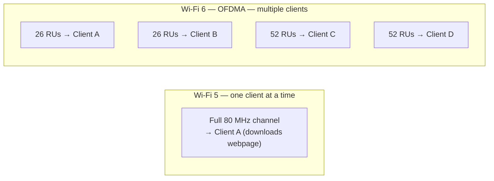
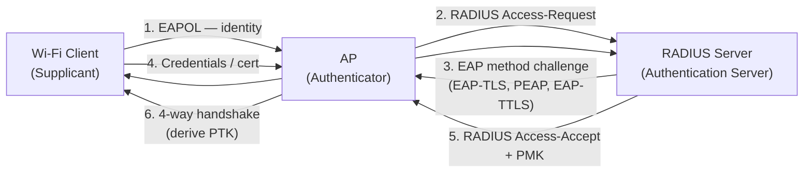

Wi-Fi (IEEE 802.11) is the dominant wireless LAN technology. It operates in the 2.4 GHz, 5 GHz, and 6 GHz bands, provides speeds up to multi-Gbps in ideal conditions, and is the primary access layer for mobile devices and laptops.

## 802.11 Standard Evolution

| Generation | Standard | Year | Max Speed | Bands | Key Technology |
|---|---|---|---|---|---|
| Wi-Fi 1 | 802.11b | 1999 | 11 Mbps | 2.4 GHz | DSSS |
| Wi-Fi 2 | 802.11a | 1999 | 54 Mbps | 5 GHz | OFDM |
| Wi-Fi 3 | 802.11g | 2003 | 54 Mbps | 2.4 GHz | OFDM |
| Wi-Fi 4 | 802.11n | 2009 | 600 Mbps | 2.4 + 5 GHz | MIMO, channel bonding |
| Wi-Fi 5 | 802.11ac | 2013 | 6.9 Gbps | 5 GHz only | MU-MIMO, 256-QAM |
| Wi-Fi 6 | 802.11ax | 2019 | 9.6 Gbps | 2.4 + 5 GHz | OFDMA, TWT, BSS Colouring |
| Wi-Fi 6E | 802.11ax ext. | 2021 | 9.6 Gbps | 2.4 + 5 + **6 GHz** | 6 GHz band added |
| Wi-Fi 7 | 802.11be | 2024 | 46 Gbps | 2.4 + 5 + 6 GHz | MLO, 4K-QAM, 320 MHz channels |

---

## Frequency Bands

### 2.4 GHz

- **Range:** Long — penetrates walls well
- **Channels:** 1–13 (EU) / 1–11 (US) — only 3 non-overlapping (1, 6, 11)
- **Congestion:** Very crowded — shared with Bluetooth, microwaves, baby monitors, ZigBee
- **Max channel width:** 40 MHz (but rarely used — too congested)
- **Use for:** IoT devices, long-range coverage, legacy clients

### 5 GHz

- **Range:** Medium — more attenuation through walls than 2.4 GHz
- **Channels:** 36–165 — up to 25 non-overlapping 20 MHz channels
- **Congestion:** Less crowded than 2.4 GHz
- **Max channel width:** 160 MHz (802.11ac/ax) — 80 MHz is practical maximum in dense deployments
- **Use for:** High-throughput clients, dense deployments

### 6 GHz (Wi-Fi 6E / 7)

- **Range:** Short — highest attenuation through walls
- **Channels:** 59 non-overlapping 20 MHz channels — enormous spectrum
- **Congestion:** Clean — no legacy devices, no other services
- **Max channel width:** 320 MHz (Wi-Fi 7)
- **Use for:** High-density enterprise, stadium deployments, latest devices

### 2.4 GHz Channel Plan (Non-overlapping)

```
Ch  1   2   3   4   5   6   7   8   9  10  11
   |--Ch1--|
               |--Ch6--|
                           |--Ch11--|
```

Channels 1, 6, and 11 are the only non-overlapping channels in the 2.4 GHz band. Using adjacent channels (e.g., 1 and 2) causes co-channel interference and degrades performance for everyone.

---

## MIMO and Spatial Streams

**MIMO (Multiple Input Multiple Output):** Multiple antennas transmit and receive simultaneously on different spatial streams, multiplying throughput.

Notation: `TxR:S` — T transmit chains, R receive chains, S spatial streams.

| Config | Example | Max streams |
|---|---|---|
| 1×1:1 | Basic IoT device | 1 |
| 2×2:2 | Most laptops (Wi-Fi 5) | 2 |
| 3×3:3 | Higher-end laptops | 3 |
| 4×4:4 | Enterprise APs | 4 |
| 8×8:8 | High-density enterprise AP | 8 |

**MU-MIMO (Multi-User MIMO):** The AP communicates with multiple clients simultaneously on different spatial streams — introduced in 802.11ac (downlink only), improved in 802.11ax (uplink and downlink).

---

## Key Wi-Fi 6 (802.11ax) Technologies

### OFDMA — Orthogonal Frequency Division Multiple Access

Wi-Fi 5 allocated an entire channel to one client per transmission. Wi-Fi 6 divides channels into **Resource Units (RUs)**, serving multiple clients simultaneously — huge improvement for dense environments with many small packets.



### TWT — Target Wake Time

Clients negotiate wake-up schedules with the AP, allowing IoT devices to sleep most of the time. Drastically improves battery life — especially for Wi-Fi 6 IoT devices.

### BSS Colouring

In dense environments, APs on the same channel interfere. BSS colouring tags frames with a colour identifier — if a frame has a different colour (different BSS), a client can ignore it without full CSMA/CA backoff, reducing overhead.

---

## Wi-Fi Security

### Security Protocol Evolution

| Protocol | Year | Encryption | Key Exchange | Status |
|---|---|---|---|---|
| **WEP** | 1999 | RC4 (broken) | Shared static key | **Broken — never use** |
| **WPA** | 2003 | TKIP (RC4-based) | 802.1X or PSK | **Deprecated** |
| **WPA2** | 2004 | AES-CCMP | 802.1X (Enterprise) or PSK (Personal) | Acceptable (minimum) |
| **WPA3** | 2018 | AES-CCMP / AES-GCMP | SAE (Personal) / 802.1X (Enterprise) | Recommended |

### WPA3 Improvements over WPA2

| Feature | WPA2 | WPA3 |
|---|---|---|
| Personal key exchange | 4-way handshake (vulnerable to offline dictionary attack) | SAE (Simultaneous Authentication of Equals — no offline attack) |
| Forward secrecy | ✗ (compromise PSK = decrypt all past traffic) | ✓ (SAE provides forward secrecy) |
| Offline password attacks | Possible (capture 4-way handshake, crack offline) | Not possible (SAE is interactive) |
| PMF (Protected Management Frames) | Optional | Mandatory |
| Enterprise encryption | CCMP-128 | GCMP-256 + HMAC-SHA-384 (WPA3-Enterprise 192-bit) |
| Open networks | Unencrypted | OWE (Opportunistic Wireless Encryption) — encrypted, no password |

### Enterprise Wi-Fi (802.1X / EAP)

Enterprise Wi-Fi uses **802.1X authentication** — each user authenticates with their own credentials via a RADIUS server. No shared password.



**EAP Methods:**

| Method | Auth | Server cert | Client cert | Security |
|---|---|---|---|---|
| **EAP-TLS** | Certificate | ✓ | ✓ | Strongest |
| **PEAP-MSCHAPv2** | Password (inside TLS tunnel) | ✓ | ✗ | Good |
| **EAP-TTLS** | Password (inside TLS tunnel) | ✓ | ✗ | Good |
| **LEAP** | Password | ✗ | ✗ | Broken |

**Certificate validation is critical:** Configure clients to validate the server certificate and pin the CA — otherwise clients will authenticate to rogue APs.

---

## Roaming

Fast roaming is critical for voice calls and real-time applications. Several standards improve roaming performance:

| Standard | Name | Improvement |
|---|---|---|
| 802.11r | Fast BSS Transition (FT) | Pre-negotiates keys before roaming — reduces handoff to < 50 ms |
| 802.11k | Radio Resource Management | Client requests neighbour AP reports to find better APs faster |
| 802.11v | BSS Transition Management | AP can suggest/push a client to roam to a better AP |

Together, r/k/v roaming is called **RKV** and is the standard for enterprise voice Wi-Fi.

---

## Channel Planning and Site Survey

### Reuse Pattern (5 GHz)

5 GHz has enough non-overlapping channels that APs can use the same channel only when far enough apart:

```
AP1: ch 36    AP2: ch 40    AP3: ch 44    AP4: ch 48
AP5: ch 36 (far from AP1)   AP6: ch 40 (far from AP2)
```

For 80 MHz channels: 36+40+44+48, 52+56+60+64, 100+104+108+112, 149+153+157+161.

### Common Design Mistakes

| Mistake | Problem | Fix |
|---|---|---|
| Too many overlapping 2.4 GHz channels | Co-channel interference, throughput collapse | Use only 1, 6, 11 — and reduce AP count |
| APs at max power | Clients connect to far AP but can't transmit back (coverage ≠ capacity) | Lower AP TX power to match client TX power |
| Not disabling slow data rates | Slower clients occupy the channel for longer | Minimum rate 12–24 Mbps |
| Mixing 2.4 and 5 GHz on same SSID | Sticky clients stay on 2.4 GHz | Enable band steering; consider separate SSIDs |
| No PMF | Clients vulnerable to deauthentication attacks | Enable PMF (required for WPA3) |

### RF Signal Metrics

| Metric | Good | Acceptable | Poor |
|---|---|---|---|
| RSSI (signal strength) | > -65 dBm | -65 to -75 dBm | < -75 dBm |
| SNR (signal-to-noise) | > 25 dB | 15–25 dB | < 15 dB |
| Noise floor | < -90 dBm | -85 to -90 dBm | > -85 dBm |

**Free channel survey tools:** NetSpot (macOS/Windows), WiFi Analyzer (Android), iPerf3 (throughput), Acrylic Wi-Fi (Windows).

---

## Common Commands

```bash
# Linux — scan for networks
sudo iwlist wlan0 scan
nmcli dev wifi list

# Linux — connect to WPA2
nmcli dev wifi connect "NetworkName" password "passphrase"

# Linux — show Wi-Fi interface info
iwconfig wlan0
iw dev wlan0 info
iw dev wlan0 station dump   # show associated client details

# Linux — current signal strength
watch -n1 "iwconfig wlan0 | grep -i quality"

# macOS — scan for networks
/System/Library/PrivateFrameworks/Apple80211.framework/Versions/Current/Resources/airport -s

# Windows — list networks
netsh wlan show networks mode=bssid

# Windows — show current connection
netsh wlan show interfaces

# Windows — export Wi-Fi profile (passwords visible in XML)
netsh wlan export profile name="NetworkName" key=clear folder=C:\Profiles
```
