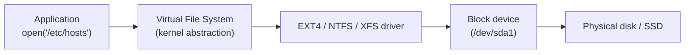

A file system is the layer the OS uses to organise data on disk — directories, files, metadata, and the on-disk structures that make it all work. Choosing the right file system and understanding its behaviour matters for performance, reliability, and recovery.

## How a File System Works



The **VFS (Virtual File System)** is a kernel abstraction so that `open()`, `read()`, `write()` work the same regardless of the underlying file system.

---

## Inodes (Linux/UNIX)

An **inode** stores all metadata about a file — except its name.

| Field | Example |
|---|---|
| File type | regular, directory, symlink, device |
| Permissions | `rwxr-xr--` |
| Owner UID / GID | 1000 / 1000 |
| Size | 4096 bytes |
| Timestamps | atime, mtime, ctime |
| Hard link count | 2 |
| Pointers to data blocks | block 12345, 12346... |

The **directory** is just a mapping from filename → inode number. That's why you can have multiple names (hard links) pointing to the same inode.

```bash
ls -i /etc/hosts      # show inode number
stat /etc/hosts       # show full inode metadata
df -i                 # show inode usage (can run out even with free disk space)
```

---

## EXT4 (Linux default)

The standard Linux file system, default on Ubuntu, Debian, and most distros.

| Feature | Detail |
|---|---|
| Journalling | Metadata journal (default) or full data journal |
| Max file size | 16 TiB |
| Max volume size | 1 EiB |
| Extents | Contiguous block ranges (reduces fragmentation) |
| Delayed allocation | Groups writes to reduce fragmentation |

```bash
# Create EXT4 filesystem
mkfs.ext4 /dev/sdb1

# Check and repair
fsck.ext4 /dev/sdb1   # must be unmounted

# Tune parameters
tune2fs -l /dev/sda1  # show filesystem info
```

---

## XFS

High-performance 64-bit file system, default on RHEL/CentOS/Rocky Linux.

| Feature | Detail |
|---|---|
| Journalling | Metadata journal |
| Max file size | 8 EiB |
| Max volume size | 8 EiB |
| Strengths | Large files, parallel I/O, NFS workloads |
| Limitation | Cannot shrink an XFS volume |

```bash
mkfs.xfs /dev/sdb1
xfs_repair /dev/sdb1   # check and repair (offline)
xfs_info /dev/sdb1     # show parameters
```

---

## NTFS (Windows)

Windows' primary file system since Windows NT. Used on all modern Windows installations.

| Feature | Detail |
|---|---|
| Journalling | Metadata journal (`$LogFile`) |
| Max file size | 16 EiB (theoretical) |
| Permissions | Per-file ACLs |
| Compression | Built-in transparent compression |
| Encryption | EFS (Encrypting File System) |
| Alternate Data Streams | Hidden data attached to files |

```powershell
# Check disk / NTFS health
chkdsk C: /f /r        # cmd — fix errors, recover bad sectors (requires reboot for C:)
Repair-Volume -DriveLetter C -Scan    # PowerShell

# Show NTFS permissions
icacls C:\Users\alice
```

### MFT (Master File Table)

NTFS stores all file and directory metadata in the **MFT** — a database of records. Every file has at least one MFT record containing attributes (name, size, timestamps, data location).

---

## Journalling

Journals protect against corruption on unclean shutdown by logging changes before committing them to disk.


On recovery after a crash, the OS replays the journal to complete or roll back partial writes. Without journalling (e.g. FAT32), a crash during a write can leave the FS in an inconsistent state.

---

## Mounting

Before using a filesystem you must **mount** it — attach it to a directory in the tree.

```bash
# Mount a device
mount /dev/sdb1 /mnt/data

# Mount with options
mount -o noexec,nosuid /dev/sdb1 /mnt/data

# Unmount
umount /mnt/data

# Persistent mounts — /etc/fstab
# <device>       <mountpoint>  <fstype>  <options>         <dump> <pass>
UUID=abc123...   /mnt/data     ext4      defaults,nofail   0      2
```

---

## Common File System Commands

```bash
# Disk usage
df -h                     # free space per filesystem
du -sh /var/log/*         # size of each item in a directory

# Partitioning
lsblk                     # block devices and partitions
fdisk /dev/sdb            # partition tool (MBR)
gdisk /dev/sdb            # partition tool (GPT)
parted /dev/sdb print

# LVM (Logical Volume Manager)
pvs / vgs / lvs           # show PVs, VGs, LVs
lvcreate -L 20G -n data vg0
lvextend -L +10G /dev/vg0/data && resize2fs /dev/vg0/data
```

---

## Next Steps

- [Linux Fundamentals](/os/linux/linux-fundamentals) — the Linux file hierarchy
- [Permissions & Access Control](/os/permissions/permissions-access-control) — file ownership and ACLs
- [Troubleshooting](/os/troubleshooting/troubleshooting) — diagnosing disk and filesystem problems
