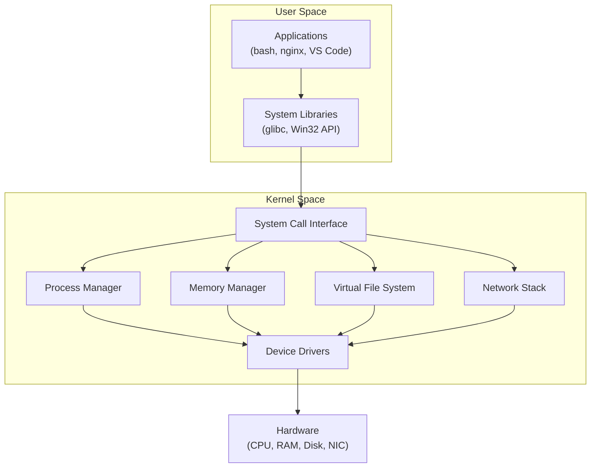

import { Aside, Card, CardGrid, Steps, Badge } from '@astrojs/starlight/components';

This section covers operating system fundamentals for IT professionals and developers — how the OS manages hardware, processes, memory, and files, with practical coverage of Linux and Windows.

## What's Covered

| Section | Topics |
|---|---|
| [Linux Fundamentals](/os/linux/linux-fundamentals) | Kernel, distributions, file hierarchy, essential commands |
| [Windows Fundamentals](/os/windows/windows-fundamentals) | NT kernel, Registry, Win32 subsystem, common tools |
| [Processes & Threads](/os/processes/processes-threads) | Process lifecycle, threads, scheduling, signals |
| [Memory Management](/os/memory/memory-management) | Virtual memory, paging, swap, memory maps |
| [File Systems](/os/filesystems/file-systems) | EXT4, NTFS, XFS — structure, permissions, journalling |
| [Services & Daemons](/os/services/services-daemons) | systemd, Windows Services, unit files, service management |
| [Permissions & Access Control](/os/permissions/permissions-access-control) | Unix permissions, ACLs, Windows NTFS permissions, UAC |
| [Bash](/os/shell/bash) | Variables, conditionals, loops, functions, scripts |
| [PowerShell](/os/shell/powershell) | Cmdlets, pipeline, objects, scripting basics |
| [System Monitoring](/os/monitoring/system-monitoring) | CPU, memory, disk, network — tools and metrics |
| [Troubleshooting](/os/troubleshooting/troubleshooting) | Logs, boot issues, performance, common fixes |

## OS Architecture Overview

## Quick Navigation

| I want to… | Go to |
|---|---|
| Learn Linux basics | [Linux Fundamentals](/os/linux/linux-fundamentals) |
| Understand Windows internals | [Windows Fundamentals](/os/windows/windows-fundamentals) |
| Understand how processes work | [Processes & Threads](/os/processes/processes-threads) |
| Write a Bash script | [Bash](/os/shell/bash) |
| Write a PowerShell script | [PowerShell](/os/shell/powershell) |
| Monitor CPU/memory/disk | [System Monitoring](/os/monitoring/system-monitoring) |
| Diagnose a slow or broken system | [Troubleshooting](/os/troubleshooting/troubleshooting) |
| Understand file permissions | [Permissions & Access Control](/os/permissions/permissions-access-control) |

## Learning Path

| Stage | Topics | Files |
|---|---|---|
| **Foundations** | Architecture, Linux basics, Windows basics | Linux → Windows |
| **Internals** | Processes, memory, file systems | Processes → Memory → File Systems |
| **Management** | Services, permissions, shell | Services → Permissions → Bash/PowerShell |
| **Operations** | Monitoring, troubleshooting | Monitoring → Troubleshooting |

## Related Sections

- [Cloud / Containers](/cloud/containers/docker) — containers share the host OS kernel
- [Security / Infrastructure](/security/infrastructure/secrets-management) — OS-level hardening and secrets
- [Auth / Authorization](/auth/authorization/rbac-abac) — OS permissions map to RBAC concepts
