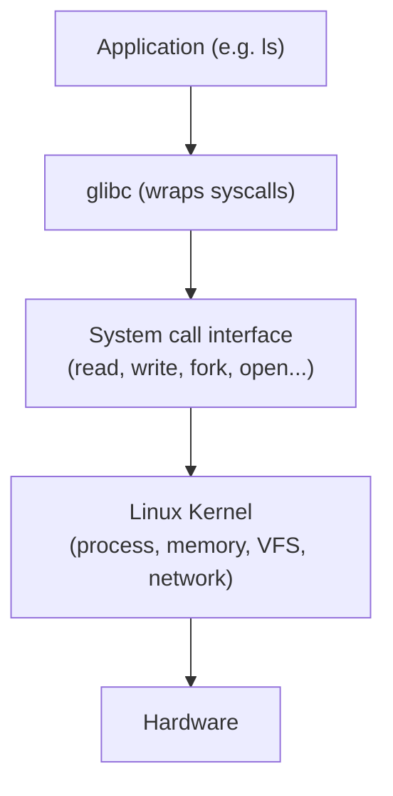
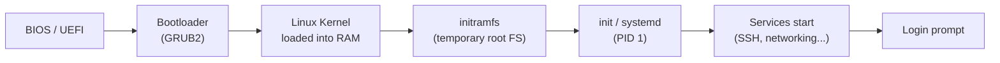

Linux is an open-source Unix-like operating system kernel. Combined with GNU tools and a package manager, it forms a complete OS used on servers, containers, embedded devices, and desktops.

## Kernel vs User Space

The kernel runs with full hardware access. Everything else (your shell, applications) runs in user space with limited privileges and communicates with the kernel via **system calls**.



A system call is how a program asks the kernel to do something privileged — open a file, allocate memory, create a process.

---

## Distributions

All Linux distributions use the same kernel. They differ in package manager, default tools, and target use case.

| Distro family | Examples | Package manager | Common use |
|---|---|---|---|
| Debian | Ubuntu, Debian, Kali | `apt` | Servers, desktops |
| Red Hat | RHEL, CentOS, Fedora, Rocky | `dnf` / `yum` | Enterprise servers |
| Arch | Arch, Manjaro | `pacman` | Rolling release, power users |
| SUSE | openSUSE, SLES | `zypper` | Enterprise |
| Alpine | Alpine Linux | `apk` | Containers (tiny footprint) |

---

## File System Hierarchy

Linux uses a single tree rooted at `/`. Everything is a file.

| Directory | Purpose |
|---|---|
| `/` | Root of the filesystem |
| `/bin` | Essential user binaries (`ls`, `cp`, `bash`) |
| `/etc` | System-wide configuration files |
| `/home` | User home directories (`/home/alice`) |
| `/var` | Variable data — logs (`/var/log`), spool, cache |
| `/tmp` | Temporary files (cleared on reboot) |
| `/proc` | Virtual FS — live kernel and process info |
| `/sys` | Virtual FS — hardware and driver info |
| `/dev` | Device files (`/dev/sda`, `/dev/null`) |
| `/usr` | User programs, libraries, docs |
| `/boot` | Kernel, initramfs, bootloader |

---

## Essential Commands

### Navigation & Files

```bash
pwd                    # print current directory
ls -lah                # list files (long, all, human-readable sizes)
cd /etc                # change directory
cp file.txt /tmp/      # copy
mv old.txt new.txt     # move / rename
rm -rf dir/            # delete recursively (careful!)
find /var/log -name "*.log" -mtime -7   # files modified in last 7 days
```

### Viewing Files

```bash
cat /etc/os-release    # print file contents
less /var/log/syslog   # page through a file (q to quit)
tail -f /var/log/syslog  # follow log in real time
grep -r "error" /var/log/  # search recursively
```

### Users & Permissions

```bash
whoami                 # current user
id                     # uid, gid, groups
sudo command           # run as root
su - alice             # switch to user alice
passwd                 # change password
```

### Process & System Info

```bash
ps aux                 # all running processes
top / htop             # live process view
kill -9 1234           # force-kill PID 1234
df -h                  # disk usage by filesystem
free -h                # RAM and swap usage
uname -r               # kernel version
uptime                 # how long the system has been running
```

---

## Boot Process



1. **BIOS/UEFI** finds the bootable disk.
2. **GRUB2** loads the kernel.
3. **Kernel** initialises hardware, mounts initramfs.
4. **systemd** (PID 1) starts all services in parallel.

---

## Package Management (apt / dnf)

```bash
# Debian / Ubuntu
apt update             # refresh package index
apt install nginx      # install
apt remove nginx       # uninstall
apt upgrade            # upgrade all packages

# RHEL / Fedora
dnf install nginx
dnf remove nginx
dnf update
```

---

## Next Steps

- [Processes & Threads](/os/processes/processes-threads) — how the kernel manages running programs
- [Permissions & Access Control](/os/permissions/permissions-access-control) — file permissions and ownership
- [Bash](/os/shell/bash) — automate tasks with shell scripts
- [Services & Daemons](/os/services/services-daemons) — managing systemd services
