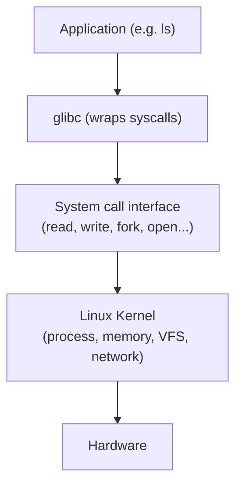
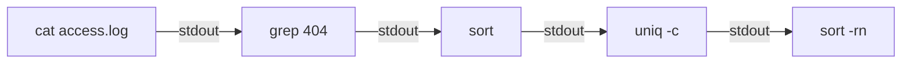
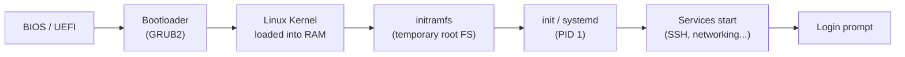

import { Aside, Steps } from '@astrojs/starlight/components';

Linux is an open-source Unix-like operating system kernel. Combined with GNU tools and a package manager, it forms a complete OS used on servers, containers, embedded devices, and desktops. "Linux" strictly refers only to the *kernel* — the userland tools (shell, `coreutils`, libraries) come mostly from the GNU project, which is why purists call the whole system "GNU/Linux."

## Kernel vs User Space

The kernel runs with full hardware access in a privileged CPU mode (**ring 0**). Everything else — your shell, applications — runs in **user space** with limited privileges (**ring 3**) and communicates with the kernel via **system calls**. This separation is the foundation of OS security: a crashing or malicious program can't directly touch hardware or another process's memory.



A system call is how a program asks the kernel to do something privileged — open a file, allocate memory, create a process. The switch from user space to kernel space (a **context switch**) is relatively expensive, which is why high-performance programs try to minimise syscalls.

<Aside type="note" title="Watching syscalls live">
You can see exactly which system calls a program makes with `strace`:
```bash
strace -e trace=open,read,write ls
```
This is invaluable for debugging "why can't this program find its config file?" — you'll see every `open()` it attempts and which ones fail.
</Aside>

---

## Distributions

All Linux distributions use the same kernel. They differ in package manager, default tools, release model, and target use case.

| Distro family | Examples | Package manager | Common use |
|---|---|---|---|
| Debian | Ubuntu, Debian, Kali | `apt` (`.deb`) | Servers, desktops |
| Red Hat | RHEL, CentOS, Fedora, Rocky | `dnf` / `yum` (`.rpm`) | Enterprise servers |
| Arch | Arch, Manjaro | `pacman` | Rolling release, power users |
| SUSE | openSUSE, SLES | `zypper` (`.rpm`) | Enterprise |
| Alpine | Alpine Linux | `apk` | Containers (tiny footprint) |

<Aside type="tip" title="Release models">
**Fixed/point release** (Debian, RHEL, Ubuntu LTS) ships a frozen snapshot you upgrade every few years — stable and predictable, ideal for servers. **Rolling release** (Arch) continuously ships the newest versions — always current, but you update more carefully. Alpine's tiny size (~5 MB base, using `musl` libc and `busybox` instead of GNU tools) makes it the default base image for most Docker containers.
</Aside>

---

## File System Hierarchy

Linux uses a single tree rooted at `/`. Unlike Windows there are no drive letters — additional disks are *mounted* into the tree at a directory. A core Unix philosophy is **"everything is a file"**: regular files, directories, devices, and even running processes are all exposed through the filesystem interface.

| Directory | Purpose |
|---|---|
| `/` | Root of the filesystem |
| `/bin` | Essential user binaries (`ls`, `cp`, `bash`) |
| `/sbin` | System binaries (usually root-only: `fdisk`, `ip`) |
| `/etc` | System-wide configuration files (text, editable) |
| `/home` | User home directories (`/home/alice`) |
| `/root` | The root user's home directory |
| `/var` | Variable data — logs (`/var/log`), spool, cache |
| `/tmp` | Temporary files (cleared on reboot) |
| `/proc` | Virtual FS — live kernel and process info |
| `/sys` | Virtual FS — hardware and driver info |
| `/dev` | Device files (`/dev/sda`, `/dev/null`) |
| `/usr` | User programs, libraries, docs |
| `/opt` | Optional / third-party software |
| `/boot` | Kernel, initramfs, bootloader |
| `/mnt`, `/media` | Mount points for external/removable storage |

<Aside type="note" title="The virtual filesystems">
`/proc` and `/sys` aren't real files on disk — the kernel generates them on the fly. Reading `/proc/cpuinfo` returns live CPU data; `cat /proc/<pid>/status` shows a running process's state. They're a window into the kernel exposed as plain text files.
</Aside>

---

## Permissions & Ownership

Every file has an **owner**, a **group**, and three permission sets: for the owner (**u**), the group (**g**), and everyone else (**o**). Each set has read (**r**), write (**w**), and execute (**x**) bits.

```
-rwxr-xr--   1  alice  developers  4096  Jun 2 10:00  script.sh
│└┬┘└┬┘└┬┘      └─┬─┘  └───┬────┘
│ │  │  │         │       └─ group
│ │  │  └─ other (r--)     └─ owner
│ │  └──── group (r-x)
│ └─────── owner (rwx)
└───────── file type (- file, d dir, l symlink)
```

Permissions are often written in **octal**, where r=4, w=2, x=1:

| Octal | Symbolic | Meaning |
|---|---|---|
| `755` | `rwxr-xr-x` | Owner full; others read+execute (typical for programs) |
| `644` | `rw-r--r--` | Owner read+write; others read (typical for files) |
| `600` | `rw-------` | Owner only (private keys, secrets) |
| `777` | `rwxrwxrwx` | Everyone full access — almost always a mistake |

```bash
chmod 644 file.txt        # set permissions (octal)
chmod u+x script.sh       # add execute for owner (symbolic)
chown alice:developers f  # change owner and group
```

<Aside type="caution" title="chmod 777 is not a fix">
When something doesn't work, `chmod 777` is a tempting "make it work" hammer — it makes the file world-writable, which is a security hole. The real fix is almost always setting the correct *owner* with `chown`, or adding the right *group*. Reserve `777` for throwaway debugging, never production.
</Aside>

---

## Essential Commands

### Navigation & Files

```bash
pwd                    # print current directory
ls -lah                # list files (long, all, human-readable sizes)
cd /etc                # change directory
cp file.txt /tmp/      # copy
mv old.txt new.txt     # move / rename
rm -rf dir/            # delete recursively (careful!)
mkdir -p a/b/c         # create nested directories
ln -s target linkname  # create a symbolic link
find /var/log -name "*.log" -mtime -7   # files modified in last 7 days
```

### Viewing & Searching Files

```bash
cat /etc/os-release    # print file contents
less /var/log/syslog   # page through a file (q to quit)
head -n 20 file        # first 20 lines
tail -f /var/log/syslog  # follow log in real time
grep -r "error" /var/log/  # search recursively
wc -l file             # count lines
```

### Users & Permissions

```bash
whoami                 # current user
id                     # uid, gid, groups
sudo command           # run as root
su - alice             # switch to user alice
passwd                 # change password
```

### Process & System Info

```bash
ps aux                 # all running processes
top / htop             # live process view
kill -9 1234           # force-kill PID 1234
df -h                  # disk usage by filesystem
du -sh dir/            # total size of a directory
free -h                # RAM and swap usage
uname -r               # kernel version
uptime                 # how long the system has been running
```

---

## I/O Redirection & Pipes

This is where the Unix philosophy — *small tools that do one thing well, combined together* — really shows. Every process gets three standard streams:

| Stream | Number | Default |
|---|---|---|
| stdin | 0 | keyboard |
| stdout | 1 | terminal |
| stderr | 2 | terminal |

You can redirect any of them, and **pipe** one command's stdout into the next command's stdin.

```bash
ls > files.txt         # redirect stdout to a file (overwrite)
ls >> files.txt        # append instead of overwrite
cmd 2> errors.txt      # redirect stderr
cmd > out.txt 2>&1     # both stdout and stderr to one file
cmd < input.txt        # feed a file as stdin

# Pipes: chain commands together
ps aux | grep nginx | wc -l        # count nginx processes
cat access.log | grep 404 | sort | uniq -c | sort -rn | head
```



<Aside type="tip">
That last pipeline is a classic log-analysis one-liner: extract all 404 errors, sort them, count duplicates with `uniq -c`, then sort numerically descending to find the most-requested missing pages. No script needed — just small tools composed with `|`.
</Aside>

---

## Processes & Signals

A **process** is a running instance of a program, identified by a **PID**. Every process (except `init`/PID 1) has a parent — new processes are created by `fork()` (clone the parent) followed by `exec()` (replace with a new program).

```bash
command &              # run in the background
jobs                   # list background jobs
fg %1                  # bring job 1 to foreground
nohup command &        # keep running after logout
```

You control processes by sending them **signals**:

| Signal | Number | Meaning | Catchable? |
|---|---|---|---|
| `SIGTERM` | 15 | Polite "please stop" (default `kill`) | Yes |
| `SIGKILL` | 9 | Forceful, immediate kill | No |
| `SIGHUP` | 1 | Hangup — often "reload config" | Yes |
| `SIGINT` | 2 | Interrupt (what `Ctrl+C` sends) | Yes |

```bash
kill 1234              # send SIGTERM (graceful)
kill -9 1234           # send SIGKILL (last resort)
```

<Aside type="caution" title="Reach for SIGTERM before SIGKILL">
`kill -9` (SIGKILL) can't be caught or ignored — the process dies instantly with no chance to flush data, close files, or clean up, which can corrupt state. Always try a plain `kill` (SIGTERM) first and give the process a moment to shut down cleanly.
</Aside>

---

## Boot Process



<Steps>
1. **BIOS/UEFI** runs power-on self-test and finds the bootable disk.
2. **GRUB2** loads the kernel and initramfs into memory.
3. **Kernel** initialises hardware and mounts the temporary initramfs root.
4. **systemd** (PID 1) mounts the real root filesystem and starts all services in parallel.
5. A **login prompt** (getty or display manager) appears.
</Steps>

---

## systemd & Services

Modern distributions use **systemd** as PID 1 — the first process started by the kernel and the ancestor of all others. It manages services (called **units**), logging, mounts, and more.

```bash
systemctl status nginx    # is it running? show recent logs
systemctl start nginx     # start now
systemctl stop nginx      # stop now
systemctl restart nginx   # restart
systemctl enable nginx    # start automatically at boot
systemctl disable nginx   # don't start at boot

journalctl -u nginx       # view a service's logs
journalctl -f             # follow all logs live (like tail -f)
```

<Aside type="note" title="enable vs start">
These are independent: `start` affects the service *right now*, `enable` affects whether it starts *at next boot*. A freshly installed service is often neither started nor enabled, so you typically run both: `systemctl enable --now nginx`.
</Aside>

---

## Package Management (apt / dnf)

```bash
# Debian / Ubuntu
apt update             # refresh package index (does NOT upgrade)
apt install nginx      # install
apt remove nginx       # uninstall
apt upgrade            # upgrade all installed packages

# RHEL / Fedora
dnf install nginx
dnf remove nginx
dnf update
```

<Aside type="tip">
A common confusion: `apt update` only refreshes the *list* of available packages — it doesn't install anything new. `apt upgrade` is what actually installs newer versions. The usual one-liner to fully patch a system is `apt update && apt upgrade`.
</Aside>

---

## Next Steps

- [Processes & Threads](/it/os/processes/processes-threads) — how the kernel manages running programs
- [Permissions & Access Control](/it/os/permissions/permissions-access-control) — file permissions and ownership
- [Bash](/it/os/shell/bash) — automate tasks with shell scripts
- [Services & Daemons](/it/os/services/services-daemons) — managing systemd services