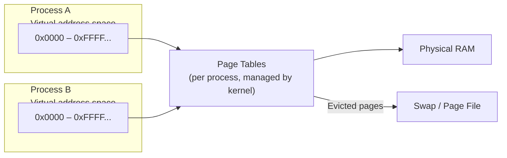

import { Aside, Steps } from '@astrojs/starlight/components';

The OS memory manager gives each process the illusion of having its own private memory space, handles running out of RAM via swap, and protects processes from accessing each other's memory.

## Physical vs Virtual Memory

Every process works with **virtual addresses** — addresses in a private address space that the OS maps to physical RAM via a **page table**.



**Key benefits:**
- Processes can't read each other's memory (isolation).
- Each process can use more virtual address space than physical RAM.
- The OS can transparently swap pages to disk and back.

---

## Pages and Paging

Memory is divided into fixed-size **pages** (typically 4 KB on x86). The CPU's Memory Management Unit (MMU) translates virtual page numbers to physical frames using page tables.

### Page Fault

When a process accesses a virtual address not currently mapped to physical RAM, the CPU raises a **page fault**. The kernel handles it:

1. If the page is on swap → load it back into RAM (**minor/major fault**).
2. If the address is invalid → `Segmentation fault` (SIGSEGV) — kills the process.

---

## Virtual Memory Layout (Linux Process)

```
High address  ┌─────────────────┐
              │  Kernel space   │  (invisible to process)
              ├─────────────────┤
              │  Stack          │  grows downward — local variables, call frames
              │        ↓        │
              │  (unmapped)     │
              │        ↑        │
              │  Heap           │  grows upward — malloc / new
              ├─────────────────┤
              │  BSS            │  uninitialised globals
              │  Data           │  initialised globals
              │  Text (code)    │  read-only executable
Low address   └─────────────────┘
```

---

## Swap / Page File

When RAM is full, the kernel writes **least recently used pages** to disk (swap partition on Linux, `pagefile.sys` on Windows) to free up RAM for active processes.

<Aside type="caution">**Swap is slow** — disk I/O is orders of magnitude slower than RAM. Heavy swapping ("thrashing") causes severe performance degradation.</Aside>

```bash
# Linux: check swap usage
free -h
swapon --show

# Add a swap file (temporary)
fallocate -l 2G /swapfile
chmod 600 /swapfile
mkswap /swapfile
swapon /swapfile
```

```powershell
# Windows: check page file
Get-WmiObject Win32_PageFileUsage | Select-Object Name, CurrentUsage, PeakUsage
```

---

## Memory Allocators

Applications request heap memory from the OS:

| Level | Linux | Windows |
|---|---|---|
| OS primitive | `mmap()` / `brk()` | `VirtualAlloc()` |
| C library | `malloc()` / `free()` | `HeapAlloc()` |
| Language runtime | `new` / `delete` (C++), GC (Java, Python) | same |

The kernel allocates memory in pages (4 KB chunks). The C library manages smaller allocations within those pages.

---

## Memory Metrics Explained

```bash
free -h
#               total   used    free    shared  buff/cache  available
# Mem:          16Gi    4.2Gi   7.8Gi   312Mi   4.0Gi       11Gi
# Swap:         2.0Gi   0B      2.0Gi
```

| Metric | Meaning |
|---|---|
| `total` | Total physical RAM |
| `used` | In use by processes |
| `free` | Completely unused |
| `buff/cache` | Used for disk cache (can be reclaimed) |
| `available` | Free + reclaimable cache — what you actually have |

<Aside type="tip">**Available** is the number to watch, not `free`.</Aside>

---

## Common Issues

| Symptom | Likely cause | Fix |
|---|---|---|
| High swap usage | Not enough RAM | Add RAM or reduce memory usage |
| OOM Killer fires | Process exceeded available memory | Find memory leak; add swap |
| `Segmentation fault` | Invalid memory access | Bug in application |
| Memory leak | Process grows without shrinking | Profile with `valgrind` / heap profiler |

```bash
# Find memory-hungry processes
ps aux --sort=-%mem | head -10

# Check OOM killer activity
dmesg | grep -i "oom"
grep -i "out of memory" /var/log/syslog
```

---

## Next Steps

- [Processes & Threads](/os/processes/processes-threads) — processes own virtual address spaces
- [System Monitoring](/os/monitoring/system-monitoring) — monitoring memory usage live
- [Troubleshooting](/os/troubleshooting/troubleshooting) — diagnosing memory-related issues
