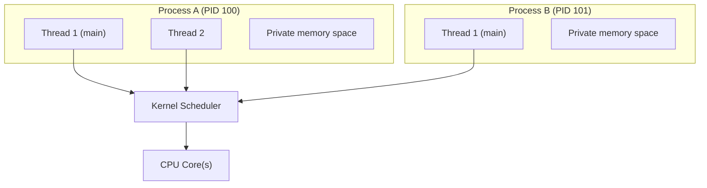
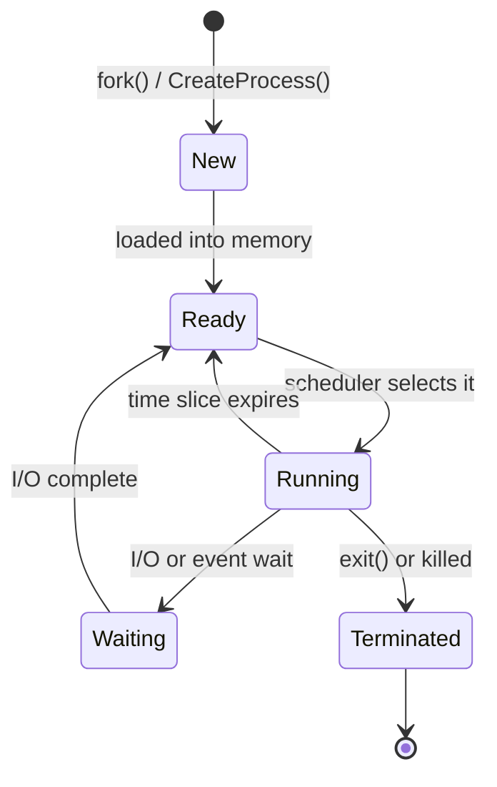

import { Tabs, TabItem } from '@astrojs/starlight/components';
import { Aside, Steps } from '@astrojs/starlight/components';

A **process** is a running instance of a program. It has its own memory space, file descriptors, and at least one thread of execution. The kernel's process manager tracks all running processes and decides which one gets the CPU at any moment.

## Process vs Thread

| | Process | Thread |
|---|---|---|
| Memory | Own address space | Shared within a process |
| Creation cost | High (clone entire address space) | Low |
| Crash isolation | Crash doesn't affect other processes | Crash can kill entire process |
| Communication | IPC (pipes, sockets, shared memory) | Shared memory directly |
| Example | Two separate Python scripts | Two functions running in parallel in the same script |



---

## Process Lifecycle



| State | Meaning |
|---|---|
| **New** | Process is being created |
| **Ready** | Waiting for CPU time |
| **Running** | Currently executing on a CPU |
| **Waiting** | Blocked on I/O or a lock |
| **Terminated** | Finished; waiting to be cleaned up |

### On Linux: fork() and exec()

```bash
# Every process except PID 1 was created by fork()
# The parent clones itself, then the child replaces itself with a new program via exec()

# Check process tree
pstree -p

# Show parent-child relationships
ps -ef --forest
```

Spawning a process from code:

<Tabs>
<TabItem label="Python">
```python
import subprocess
result = subprocess.run(['ls', '-la'], capture_output=True, text=True)
```
</TabItem>
<TabItem label="JavaScript">
```javascript
const {execSync} = require('child_process');
const output = execSync('ls -la', {encoding: 'utf8'});
```
</TabItem>
<TabItem label="C#">
```csharp
var proc = Process.Start(new ProcessStartInfo("ls", "-la") {RedirectStandardOutput=true});
string output = proc.StandardOutput.ReadToEnd();
```
</TabItem>
<TabItem label="Java">
```java
Process proc = new ProcessBuilder("ls", "-la").start();
String output = new String(proc.getInputStream().readAllBytes());
```
</TabItem>
</Tabs>

### Process IDs

- **PID** — unique process ID
- **PPID** — parent process ID
- **PID 1** — init / systemd on Linux; `System` on Windows — the ancestor of all processes

---

## Scheduling

The scheduler decides which ready process runs next. Common algorithms:

| Algorithm | How it works | Used by |
|---|---|---|
| Round Robin | Each process gets a fixed time slice in turn | Linux CFS (default) |
| Priority | Higher priority runs first | All OSes |
| CFS (Completely Fair Scheduler) | Tracks "virtual runtime" to share CPU fairly | Linux |
| MLFQ | Multiple queues with different priorities | Windows |

### Linux priorities

- **Nice value:** -20 (highest priority) to +19 (lowest). Default is 0.
- **Real-time:** SCHED_FIFO / SCHED_RR for time-critical tasks.

```bash
# Run a command at low priority
nice -n 19 tar czf backup.tar.gz /data

# Change priority of running process
renice -n 10 -p 1234
```

---

## Signals (Linux)

Signals are asynchronous notifications sent to processes.

| Signal | Number | Default action | Common use |
|---|---|---|---|
| `SIGTERM` | 15 | Terminate (graceful) | `kill 1234` — ask nicely |
| `SIGKILL` | 9 | Terminate (force) | `kill -9 1234` — cannot be caught |
| `SIGHUP` | 1 | Terminate / reload | Reload config in daemons |
| `SIGINT` | 2 | Terminate | `Ctrl+C` in terminal |
| `SIGSTOP` | 19 | Pause | `Ctrl+Z` |
| `SIGCONT` | 18 | Resume | `fg` / `bg` commands |

```bash
kill -SIGTERM 1234   # graceful stop
kill -9 1234         # force kill
pkill -f "python app.py"  # kill by name
```

---

## Inter-Process Communication (IPC)

| Mechanism | Description | Use case |
|---|---|---|
| Pipes (`\|`) | One-way byte stream | Chaining commands in shell |
| Named pipes (FIFOs) | Pipe with a filesystem path | Unrelated processes |
| Sockets | Bidirectional, can cross network | Web servers, IPC |
| Shared memory | Map same RAM region | High-throughput data sharing |
| Message queues | Structured messages via kernel | Decoupled producer/consumer |

Creating a thread in code:

<Tabs>
<TabItem label="Python">
```python
import threading
t = threading.Thread(target=my_func)
t.start()
t.join()
```
</TabItem>
<TabItem label="JavaScript">
```javascript
const { Worker } = require('worker_threads');
const w = new Worker('./worker.js');
```
</TabItem>
<TabItem label="C#">
```csharp
var t = new Thread(MyFunc);
t.Start();
t.Join();
```
</TabItem>
<TabItem label="Java">
```java
Thread t = new Thread(this::myFunc);
t.start();
t.join();
```
</TabItem>
</Tabs>

---

## Useful Commands

```bash
# Linux
ps aux                    # snapshot of all processes
top / htop                # live view
pgrep nginx               # find PIDs by name
lsof -p 1234              # files/sockets open by PID
strace -p 1234            # trace system calls of a running process
/proc/1234/               # live info about PID 1234 (status, maps, fd)
```

```powershell
# Windows
Get-Process
Stop-Process -Name notepad
Get-Process -Id 1234 | Select-Object *
(Get-Process -Id 1234).Threads.Count
```

---

## Next Steps

- [Memory Management](/os/memory/memory-management) — how processes get RAM
- [Services & Daemons](/os/services/services-daemons) — long-running background processes
- [System Monitoring](/os/monitoring/system-monitoring) — observing process behaviour
