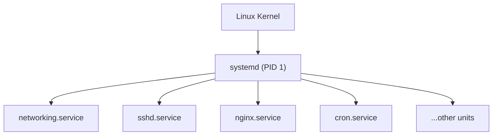

import { Aside } from '@astrojs/starlight/components';

A **daemon** (Linux) or **service** (Windows) is a background process that runs without a controlling terminal, typically started at boot and providing some ongoing function — a web server, SSH server, database, scheduled task runner.

## systemd (Linux)

systemd is the init system and service manager on virtually all modern Linux distributions. It is PID 1 — the first process the kernel starts, and the ancestor of all other processes.



### Units

Everything in systemd is a **unit**. Units have types:

| Type | Extension | Purpose |
|---|---|---|
| Service | `.service` | Background process |
| Timer | `.timer` | Scheduled task (cron replacement) |
| Socket | `.socket` | Socket activation |
| Mount | `.mount` | Filesystem mount point |
| Target | `.target` | Group of units (like a runlevel) |

---

### Essential systemctl Commands

```bash
# Status and info
systemctl status nginx
systemctl is-active nginx
systemctl is-enabled nginx

# Start / stop / restart
systemctl start nginx
systemctl stop nginx
systemctl restart nginx
systemctl reload nginx        # reload config without full restart

# Enable / disable at boot
systemctl enable nginx
systemctl disable nginx
systemctl enable --now nginx  # enable + start immediately

# List units
systemctl list-units --type=service
systemctl list-units --failed

# View logs for a service
journalctl -u nginx           # all logs
journalctl -u nginx -f        # follow live
journalctl -u nginx --since "1 hour ago"
```

---

### Writing a systemd Unit File

Unit files live in `/etc/systemd/system/` (your files) or `/lib/systemd/system/` (package-provided).

```ini
# /etc/systemd/system/myapp.service
[Unit]
Description=My Application
After=network.target          # start after networking is up
Requires=postgresql.service   # hard dependency

[Service]
Type=simple
User=myapp
WorkingDirectory=/opt/myapp
ExecStart=/usr/bin/node /opt/myapp/server.js
Restart=on-failure            # restart if it crashes
RestartSec=5
Environment=NODE_ENV=production
StandardOutput=journal
StandardError=journal

[Install]
WantedBy=multi-user.target    # start in normal multi-user mode
```

```bash
# After creating/editing a unit file:
systemctl daemon-reload       # reload unit files
systemctl enable --now myapp
```

---

### Targets (Runlevels)

| Target | Old runlevel | Meaning |
|---|---|---|
| `poweroff.target` | 0 | Shutdown |
| `rescue.target` | 1 | Single-user / recovery |
| `multi-user.target` | 3 | Normal multi-user, no GUI |
| `graphical.target` | 5 | Multi-user with desktop |
| `reboot.target` | 6 | Reboot |

```bash
systemctl get-default          # current default target
systemctl set-default multi-user.target
systemctl isolate rescue.target  # switch targets live
```

---

## Windows Services

Windows Services are background processes managed by the **Service Control Manager (SCM)**. They can run without a user logged in.

### Managing Services

```powershell
# List all services
Get-Service

# Filter
Get-Service | Where-Object Status -eq "Running"

# Start / stop
Start-Service "wuauserv"    # Windows Update
Stop-Service  "Spooler"     # Print Spooler

# Set startup type
Set-Service "wuauserv" -StartupType Automatic
Set-Service "Spooler"  -StartupType Manual
```

```
Startup types:
Automatic        — starts at boot
Automatic (Delayed Start) — starts a bit after boot (reduces boot time)
Manual           — started on demand
Disabled         — will not start
```

### GUI: services.msc

Run `services.msc` for a graphical view — right-click any service to see Properties, Dependencies, and Recovery options (what to do if the service crashes: restart, run a script, etc.).

---

## Comparing systemd vs Windows SCM

| Feature | systemd | Windows SCM |
|---|---|---|
| Config format | INI-style unit files | Registry + SCM API |
| Dependency management | `After=`, `Requires=`, `Wants=` | Dependency tab in services.msc |
| Logging | journald (structured) | Event Viewer / Application log |
| On-failure restart | `Restart=on-failure` | Recovery tab in Properties |
| Socket activation | Yes (`.socket` units) | No native equivalent |
| Timers/scheduling | `.timer` units | Task Scheduler |

---

## Next Steps

- [Linux Fundamentals](/os/linux/linux-fundamentals) — systemd fits into the Linux boot process
- [System Monitoring](/os/monitoring/system-monitoring) — watching service resource usage
- [Troubleshooting](/os/troubleshooting/troubleshooting) — diagnosing failed services
