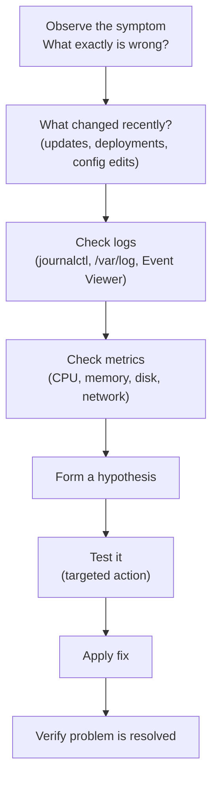

Troubleshooting is about systematic elimination. Start broad (is anything obviously wrong?), narrow down to the layer or component causing the problem, then fix and verify.

## General Approach



**First questions:**
1. When did it start?
2. What changed just before it started?
3. Is it affecting all users / all servers, or just some?
4. Are there error messages? (exact text matters)

---

## Slow System

```bash
# 1. Check CPU
top -b -n1 | head -20
uptime              # load average — if >> CPU count, you're saturated

# 2. Check memory / swap
free -h
vmstat 1 5          # si/so columns — swap in/out per second. Non-zero = trouble.

# 3. Check disk I/O
iostat -x 1 5       # %util > 90% and high await = disk bottleneck
iotop -a            # which processes are doing the I/O

# 4. Check network (if it's a web app)
ss -s               # connection summary
netstat -an | grep TIME_WAIT | wc -l   # many TIME_WAIT = connection exhaustion
```

```powershell
# Windows: quick health check
Get-Counter '\Processor(_Total)\% Processor Time', '\Memory\Available MBytes', '\PhysicalDisk(_Total)\% Disk Time'
```

---

## Service Won't Start

```bash
# Check service status and recent errors
systemctl status myservice
journalctl -u myservice -n 50 --no-pager

# Common causes shown in logs:
# - Port already in use
# - Missing file or directory
# - Permission denied
# - Configuration syntax error

# Check if port is already taken
ss -tulpn | grep :8080
lsof -i :8080

# Test config before starting
nginx -t
apache2ctl configtest

# Check file permissions
ls -la /opt/myapp/
ls -la /var/run/myapp/
```

---

## Disk Full

```bash
# 1. Find what's taking space
df -h                               # which filesystem is full
du -sh /var/* | sort -rh | head     # largest dirs in /var
du -sh /var/log/* | sort -rh | head # largest log files

# 2. Common culprits
find /var/log -name "*.log" -size +100M   # large log files
journalctl --disk-usage               # how much journal is using

# 3. Quick fixes
# Truncate a growing log (don't delete — the process still holds the fd)
> /var/log/bigapp.log          # truncate to zero
# Or rotate
logrotate -f /etc/logrotate.conf

# Vacuum old journal entries
journalctl --vacuum-time=7d

# Remove old docker images/volumes
docker system prune -f
```

---

## Permission Denied

```bash
# 1. Identify the denying permission
ls -la /path/to/file          # check owner and permissions
stat /path/to/file

# 2. Check if you need sudo
sudo cat /etc/shadow

# 3. Fix ownership
chown -R www-data:www-data /var/www/html

# 4. Fix permissions
chmod 644 /etc/myapp/config.txt
chmod 755 /opt/myapp/

# 5. SELinux / AppArmor (if enabled)
ausearch -m avc -ts recent        # SELinux denials
aa-status                         # AppArmor status
dmesg | grep -i denied
```

---

## System Won't Boot (Linux)

| Stage | Symptom | Likely cause |
|---|---|---|
| BIOS/UEFI | No OS found | Bootloader missing or wrong boot device |
| GRUB | `error: no such partition` | Disk UUID changed or partition deleted |
| Kernel | Kernel panic | Bad kernel update, hardware failure |
| initramfs | `ALERT! /dev/sda1 does not exist` | Drive not found; missing driver |
| systemd | Service failures, emergency shell | Failed mount, bad unit file |

```bash
# Boot into recovery / emergency mode from GRUB:
# Add to kernel line: systemd.unit=rescue.target
# Or:                 init=/bin/bash

# Check what failed
systemctl --failed
journalctl -b -1          # logs from last boot
journalctl -b -1 -p err   # only errors from last boot

# Force fsck on next boot
touch /forcefsck
```

---

## High Memory / OOM Events

```bash
# Check if OOM killer fired
dmesg | grep -i "oom\|killed process"
journalctl -k | grep -i oom

# Find memory leaks — watch a process grow
watch -n5 'ps aux --sort=-%mem | head -5'

# Check memory per process
smem -r -k | head
cat /proc/<PID>/status | grep -i vm

# Temporary: add swap space
fallocate -l 4G /swapfile && chmod 600 /swapfile && mkswap /swapfile && swapon /swapfile
```

---

## Network Connectivity Issues

```bash
# Systematic ping test
ping -c4 127.0.0.1        # local stack OK?
ping -c4 192.168.1.1      # gateway OK?
ping -c4 8.8.8.8          # internet OK?
ping -c4 google.com       # DNS OK?

# If internet ping works but DNS doesn't:
cat /etc/resolv.conf
nslookup google.com 8.8.8.8   # test with explicit DNS

# Check routes
ip route
ip route get 8.8.8.8

# Check firewall
iptables -L -n -v         # Linux (iptables)
ufw status                # Ubuntu firewall
firewall-cmd --list-all   # firewalld (RHEL)
```

```powershell
# Windows network troubleshooting
Test-NetConnection 8.8.8.8 -Port 53
Resolve-DnsName google.com
Get-NetRoute | Where-Object DestinationPrefix -eq "0.0.0.0/0"   # default gateway
netsh interface show interface
```

---

## Key Log Locations

| OS | File/Source | What's there |
|---|---|---|
| Linux | `/var/log/syslog` | General system events |
| Linux | `/var/log/auth.log` | Login, sudo, SSH |
| Linux | `journalctl` | All systemd unit logs |
| Linux | `dmesg` | Kernel ring buffer |
| Windows | Event Viewer → System | OS-level events |
| Windows | Event Viewer → Application | App crashes and errors |
| Windows | Event Viewer → Security | Login events, audit |
| Windows | `%TEMP%` | Application temp logs |

---

## Quick Reference

```bash
# "Something is wrong" starter kit
uptime && free -h && df -h && systemctl --failed
journalctl -xe -n 50
dmesg | tail -20
```

---

## Next Steps

- [System Monitoring](/os/monitoring/system-monitoring) — proactive monitoring to catch issues early
- [Services & Daemons](/os/services/services-daemons) — diagnosing failed services specifically
- [File Systems](/os/filesystems/file-systems) — disk and filesystem checks
