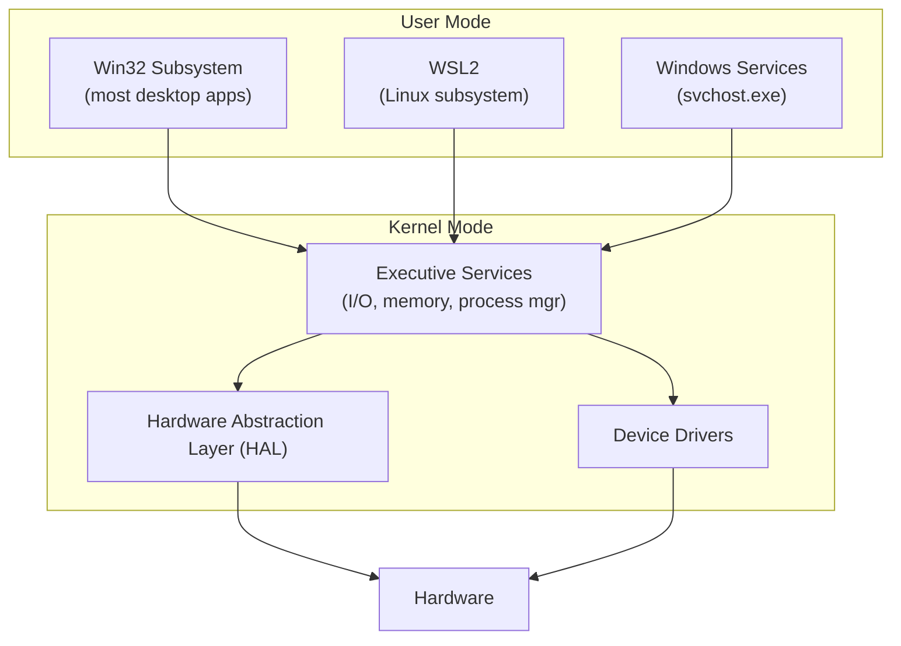
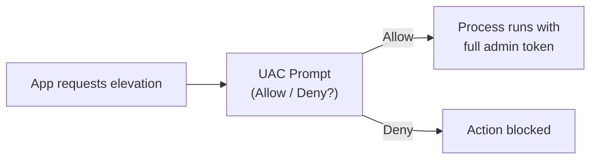

Windows is built on the NT kernel, first introduced in Windows NT 3.1 (1993). All modern Windows versions — 10, 11, Server 2019/2022 — share this kernel architecture.

## NT Architecture



**Key concept:** User-mode code cannot directly touch hardware. It calls into the kernel via the Windows API (Win32 / WinRT).

---

## The Registry

A hierarchical database storing system and application configuration. The equivalent of `/etc` on Linux, but centralised.

### Hives (top-level keys)

| Hive | Abbreviation | Contents |
|---|---|---|
| `HKEY_LOCAL_MACHINE` | `HKLM` | System-wide settings, hardware, installed software |
| `HKEY_CURRENT_USER` | `HKCU` | Settings for the currently logged-in user |
| `HKEY_CLASSES_ROOT` | `HKCR` | File associations, COM classes |
| `HKEY_USERS` | `HKU` | All user profiles |
| `HKEY_CURRENT_CONFIG` | `HKCC` | Current hardware profile |

```powershell
# Read a registry value
Get-ItemProperty "HKLM:\SOFTWARE\Microsoft\Windows NT\CurrentVersion" -Name ProductName

# Set a value
Set-ItemProperty "HKCU:\Software\MyApp" -Name "Theme" -Value "Dark"
```

Use `regedit.exe` for a GUI view. Always back up before editing.

---

## User Accounts & UAC

### Account Types

| Type | Description |
|---|---|
| Local Administrator | Full control of the local machine |
| Standard User | Cannot install software or change system settings |
| Built-in Administrator | Hidden super-admin; disabled by default on modern Windows |
| Domain User | Managed by Active Directory |

### UAC (User Account Control)

Even administrators run as standard users day-to-day. When an action requires elevation, UAC prompts for confirmation. This limits the blast radius of malware.



---

## File System Hierarchy

Windows uses drive letters (`C:\`, `D:\`) rather than a single root.

| Path | Purpose |
|---|---|
| `C:\Windows\System32` | Core system binaries and DLLs |
| `C:\Program Files` | 64-bit installed applications |
| `C:\Program Files (x86)` | 32-bit applications |
| `C:\Users\<name>` | User home directory |
| `C:\Users\<name>\AppData` | Per-user app config and data |
| `C:\ProgramData` | System-wide app data (all users) |
| `C:\Temp` or `%TEMP%` | Temporary files |

---

## Essential Administrative Tools

| Tool | How to open | Purpose |
|---|---|---|
| Task Manager | `Ctrl+Shift+Esc` | Processes, CPU/RAM, startup items |
| Event Viewer | `eventvwr.msc` | System, application, and security logs |
| Services | `services.msc` | Start/stop/configure Windows services |
| Registry Editor | `regedit` | Browse and edit the registry |
| Disk Management | `diskmgmt.msc` | Partitions, volumes, drive letters |
| Device Manager | `devmgmt.msc` | Hardware drivers and status |
| Resource Monitor | `resmon` | Detailed CPU, memory, disk, network usage |
| Group Policy Editor | `gpedit.msc` | System-wide policy settings (Pro/Enterprise) |
| `msconfig` | Run dialog | Startup, boot options |

---

## Common Command Prompt / PowerShell Commands

```powershell
# System info
Get-ComputerInfo | Select-Object WindowsVersion, TotalPhysicalMemory
systeminfo                        # detailed system info (cmd)

# Processes
Get-Process | Sort-Object CPU -Descending | Select-Object -First 10
tasklist                          # cmd equivalent

# Network
ipconfig /all                     # IP config
netstat -ano                      # open connections with PID
Test-NetConnection google.com -Port 443

# Disk
Get-PSDrive -PSProvider FileSystem   # drive usage
Get-ChildItem C:\ -Recurse | Measure-Object -Property Length -Sum

# Services
Get-Service | Where-Object Status -eq "Running"
Start-Service wuauserv
Stop-Service spooler
```

---

## Windows vs Linux: Key Differences

| Aspect | Windows | Linux |
|---|---|---|
| Kernel | NT (closed source) | Linux (open source) |
| Config store | Registry + NTFS files | Text files in `/etc` |
| Package manager | winget / Chocolatey / Store | apt, dnf, pacman |
| Default shell | PowerShell / cmd | bash / sh |
| Paths | `C:\Users\alice` (backslash) | `/home/alice` (forward slash) |
| Services | Windows Services (SCM) | systemd units |
| File permissions | NTFS ACLs | Unix rwx + ACLs |
| GUI | Always present (Explorer) | Optional (X11/Wayland) |

---

## Next Steps

- [Permissions & Access Control](/os/permissions/permissions-access-control) — NTFS permissions and ACLs
- [Services & Daemons](/os/services/services-daemons) — Windows Services and how they compare to systemd
- [PowerShell](/os/shell/powershell) — scripting on Windows
- [System Monitoring](/os/monitoring/system-monitoring) — monitoring tools on Windows
