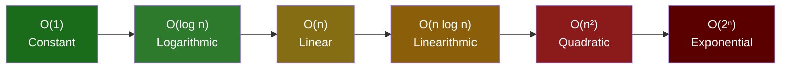
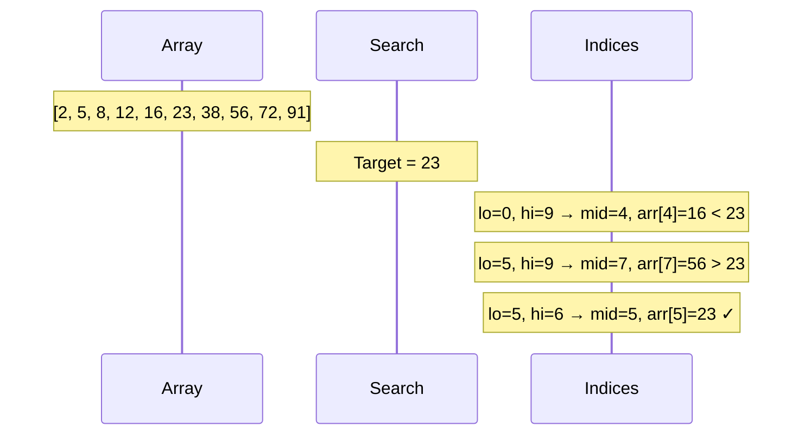
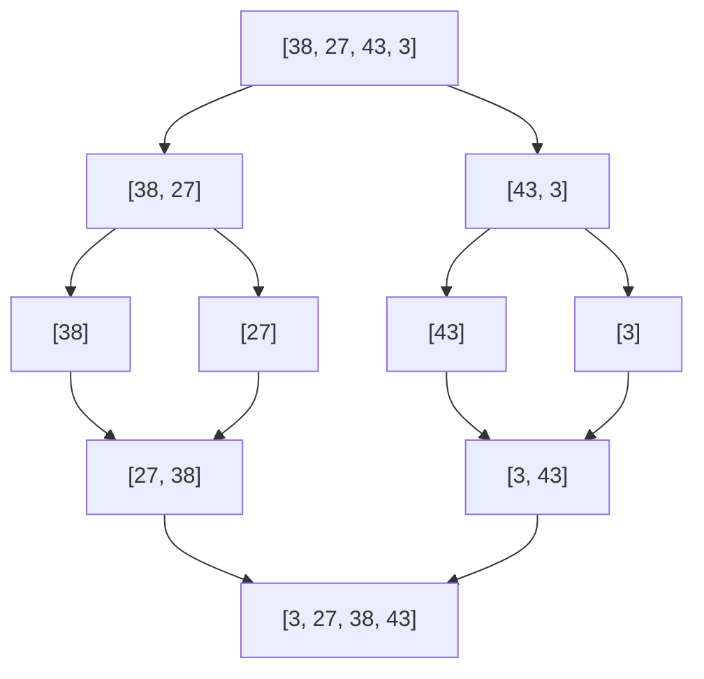

An **algorithm** is a precise sequence of steps that solves a problem. Understanding algorithms means being able to reason about **correctness** (does it always produce the right answer?) and **efficiency** (how does it scale with input size?).

---

## Big O Notation

Big O describes how an algorithm's time or space requirements grow as the input size `n` grows. It expresses the **worst-case upper bound**, ignoring constants and lower-order terms.

### Common Complexities

| Notation | Name | Example | 1 000 input |
|---|---|---|---|
| O(1) | Constant | Hash map lookup, array access by index | 1 op |
| O(log n) | Logarithmic | Binary search, balanced BST operations | ~10 ops |
| O(n) | Linear | Linear search, single array scan | 1 000 ops |
| O(n log n) | Linearithmic | Merge sort, heap sort | ~10 000 ops |
| O(n²) | Quadratic | Bubble sort, nested loops over same array | 1 000 000 ops |
| O(2ⁿ) | Exponential | Brute-force subset enumeration | 2¹⁰⁰⁰ (unusable) |
| O(n!) | Factorial | Brute-force permutations | Unusable for n > 12 |



### How to Calculate Big O

```python
def example(arr):
    # O(1) — constant regardless of array length
    first = arr[0]

    # O(n) — one pass through the array
    for x in arr:
        print(x)

    # O(n²) — nested loops, both proportional to n
    for i in arr:
        for j in arr:
            print(i, j)
```

Rules:
- Drop constants: O(2n) → O(n)
- Drop lower-order terms: O(n² + n) → O(n²)
- For sequential operations, add complexities: O(n) + O(n²) → O(n²)
- For nested operations, multiply: O(n) × O(n) → O(n²)

### Space Complexity

Time is not the only resource. Space complexity measures how much **extra memory** an algorithm uses relative to input size.

```python
# O(1) space — only a few variables, regardless of input size
def sum_list(arr):
    total = 0
    for x in arr:
        total += x
    return total

# O(n) space — creates a new list proportional to input
def doubled(arr):
    return [x * 2 for x in arr]
```

---

## Searching

### Linear Search

Check every element until you find the target. No preconditions needed.

```python
def linear_search(arr, target):
    for i, val in enumerate(arr):
        if val == target:
            return i
    return -1
```

**Complexity:** O(n) time, O(1) space.
**Use when:** array is unsorted, or small (n < ~50).

### Binary Search

Requires a **sorted** array. Eliminate half the remaining search space each step.

```python
def binary_search(arr, target):
    lo, hi = 0, len(arr) - 1
    while lo <= hi:
        mid = (lo + hi) // 2
        if arr[mid] == target:
            return mid
        elif arr[mid] < target:
            lo = mid + 1
        else:
            hi = mid - 1
    return -1
```



**Complexity:** O(log n) time, O(1) space.
**Use when:** array is sorted. Sorting first (O(n log n)) is only worth it if you'll search many times.

---

## Sorting

### Bubble Sort

Repeatedly swap adjacent elements that are out of order. Simple but slow.

```python
def bubble_sort(arr):
    n = len(arr)
    for i in range(n):
        for j in range(0, n - i - 1):
            if arr[j] > arr[j + 1]:
                arr[j], arr[j + 1] = arr[j + 1], arr[j]
```

**Complexity:** O(n²) time. Use only for teaching or tiny arrays.

### Insertion Sort

Build the sorted array one element at a time by inserting each element into its correct position.

```python
def insertion_sort(arr):
    for i in range(1, len(arr)):
        key = arr[i]
        j   = i - 1
        while j >= 0 and arr[j] > key:
            arr[j + 1] = arr[j]
            j -= 1
        arr[j + 1] = key
```

**Complexity:** O(n²) worst case, O(n) best case (already sorted).
**Use when:** nearly-sorted data, or n < ~50 (cache-friendly, low overhead).

### Merge Sort

Divide the array in half recursively, then merge sorted halves. Classic divide-and-conquer.

```python
def merge_sort(arr):
    if len(arr) <= 1:
        return arr
    mid   = len(arr) // 2
    left  = merge_sort(arr[:mid])
    right = merge_sort(arr[mid:])
    return merge(left, right)

def merge(left, right):
    result = []
    i = j  = 0
    while i < len(left) and j < len(right):
        if left[i] <= right[j]:
            result.append(left[i]); i += 1
        else:
            result.append(right[j]); j += 1
    result.extend(left[i:])
    result.extend(right[j:])
    return result
```



**Complexity:** O(n log n) time, O(n) space. **Stable** (equal elements keep original order).

### Quick Sort

Pick a pivot, partition the array so all smaller elements come before it and larger after, then recurse.

```python
def quick_sort(arr, lo=0, hi=None):
    if hi is None:
        hi = len(arr) - 1
    if lo < hi:
        pivot_idx = partition(arr, lo, hi)
        quick_sort(arr, lo, pivot_idx - 1)
        quick_sort(arr, pivot_idx + 1, hi)

def partition(arr, lo, hi):
    pivot = arr[hi]
    i     = lo - 1
    for j in range(lo, hi):
        if arr[j] <= pivot:
            i += 1
            arr[i], arr[j] = arr[j], arr[i]
    arr[i + 1], arr[hi] = arr[hi], arr[i + 1]
    return i + 1
```

**Complexity:** O(n log n) average, O(n²) worst case (already sorted with naive pivot). O(log n) space (call stack). **Not stable**.
**Use when:** in-place sorting is important and average case is acceptable. Most standard library sorts use an optimised variant (Timsort, Introsort).

### Sorting Algorithm Comparison

| Algorithm | Best | Average | Worst | Space | Stable |
|---|---|---|---|---|---|
| Bubble | O(n) | O(n²) | O(n²) | O(1) | Yes |
| Insertion | O(n) | O(n²) | O(n²) | O(1) | Yes |
| Merge | O(n log n) | O(n log n) | O(n log n) | O(n) | Yes |
| Quick | O(n log n) | O(n log n) | O(n²) | O(log n) | No |
| Heap | O(n log n) | O(n log n) | O(n log n) | O(1) | No |
| Timsort (Python/Java default) | O(n) | O(n log n) | O(n log n) | O(n) | Yes |

---

## Recursion

A function that calls itself. Every recursive solution has two parts:
1. **Base case** — the condition that stops the recursion
2. **Recursive case** — the step that moves toward the base case

```python
def factorial(n):
    if n == 0:       # base case
        return 1
    return n * factorial(n - 1)  # recursive case

# Call stack for factorial(4):
# factorial(4) = 4 * factorial(3)
#                    = 3 * factorial(2)
#                         = 2 * factorial(1)
#                              = 1 * factorial(0)
#                                   = 1
```

### Recursion vs Iteration

Recursion is elegant but uses O(depth) stack space. Deep recursion can cause a stack overflow. Many recursive algorithms can be converted to iteration with an explicit stack.

```python
# Recursive DFS — simple, but limited by call stack depth
def dfs_recursive(node, visited):
    if node in visited:
        return
    visited.add(node)
    for neighbour in graph[node]:
        dfs_recursive(neighbour, visited)

# Iterative DFS — same result, explicit stack, no stack overflow risk
def dfs_iterative(start):
    visited = set()
    stack   = [start]
    while stack:
        node = stack.pop()
        if node in visited:
            continue
        visited.add(node)
        stack.extend(graph[node])
```

---

## Dynamic Programming

**Dynamic programming (DP)** solves problems by breaking them into overlapping sub-problems and caching results to avoid repeated work. It applies when a problem has:
1. **Optimal substructure** — optimal solution contains optimal solutions to sub-problems
2. **Overlapping sub-problems** — the same sub-problems are solved multiple times

### Two Approaches

**Top-down (memoisation)** — start from the original problem, recurse, and cache.

```python
from functools import lru_cache

@lru_cache(maxsize=None)
def fib(n):
    if n <= 1:
        return n
    return fib(n - 1) + fib(n - 2)
```

**Bottom-up (tabulation)** — fill a table from the smallest sub-problems up to the full answer.

```python
def fib(n):
    if n <= 1:
        return n
    dp = [0] * (n + 1)
    dp[1] = 1
    for i in range(2, n + 1):
        dp[i] = dp[i-1] + dp[i-2]
    return dp[n]

# Space-optimised — only need the last two values
def fib(n):
    a, b = 0, 1
    for _ in range(n):
        a, b = b, a + b
    return a
```

### Classic DP Problems

| Problem | What to cache | Complexity |
|---|---|---|
| Fibonacci | `fib(n)` | O(n) time, O(n) space (or O(1) optimised) |
| Longest Common Subsequence | `lcs(i, j)` for prefix lengths | O(m×n) |
| 0/1 Knapsack | `knapsack(items_left, capacity)` | O(n×W) |
| Coin Change | `min_coins(amount)` | O(amount × num_coins) |
| Edit Distance | `edit(i, j)` for string prefixes | O(m×n) |

---

## Graph Algorithms

### Dijkstra's Shortest Path

Finds the shortest path from a source vertex to all others in a **weighted graph with non-negative edges**.

```python
import heapq

def dijkstra(graph, start):
    dist = {node: float('inf') for node in graph}
    dist[start] = 0
    pq = [(0, start)]   # (distance, node)

    while pq:
        d, u = heapq.heappop(pq)
        if d > dist[u]:
            continue
        for v, weight in graph[u]:
            if dist[u] + weight < dist[v]:
                dist[v] = dist[u] + weight
                heapq.heappush(pq, (dist[v], v))

    return dist
```

**Complexity:** O((V + E) log V) with a binary heap.
**Limitation:** Does not work with negative edge weights (use Bellman-Ford instead).

### Topological Sort

Produces a linear ordering of vertices in a **Directed Acyclic Graph (DAG)** such that for every edge A → B, A comes before B. Used for build systems, dependency resolution, task scheduling.

```python
from collections import deque

def topological_sort(graph):
    in_degree = {v: 0 for v in graph}
    for v in graph:
        for u in graph[v]:
            in_degree[u] += 1

    queue = deque([v for v in graph if in_degree[v] == 0])
    order = []

    while queue:
        v = queue.popleft()
        order.append(v)
        for u in graph[v]:
            in_degree[u] -= 1
            if in_degree[u] == 0:
                queue.append(u)

    return order if len(order) == len(graph) else []  # [] if cycle detected
```

### Minimum Spanning Tree (MST)

A spanning tree that connects all vertices with the minimum total edge weight.

- **Kruskal's** — sort all edges by weight, greedily add edges that don't form a cycle (use Union-Find)
- **Prim's** — grow the MST from a starting vertex, always adding the cheapest edge to an unvisited vertex

---

## Two Pointers & Sliding Window

High-leverage patterns that reduce nested loops from O(n²) to O(n).

### Two Pointers

```python
# Find pair that sums to target in sorted array
def two_sum_sorted(arr, target):
    lo, hi = 0, len(arr) - 1
    while lo < hi:
        s = arr[lo] + arr[hi]
        if s == target:
            return (lo, hi)
        elif s < target:
            lo += 1
        else:
            hi -= 1
    return None
```

### Sliding Window

```python
# Maximum sum subarray of size k
def max_window_sum(arr, k):
    window = sum(arr[:k])
    best   = window
    for i in range(k, len(arr)):
        window += arr[i] - arr[i - k]
        best = max(best, window)
    return best
```

---

## Algorithm Design Strategies

| Strategy | Idea | Examples |
|---|---|---|
| Brute Force | Try every possibility | Linear search, permutations |
| Divide & Conquer | Split, recurse, combine | Merge sort, binary search |
| Greedy | Always pick locally optimal choice | Dijkstra, Kruskal, activity selection |
| Dynamic Programming | Cache overlapping sub-problems | Fibonacci, knapsack, LCS |
| Backtracking | Try options, undo on dead ends | N-Queens, Sudoku solver |
| Two Pointers | Converge pointers from both ends | Two sum, palindrome check |
| Sliding Window | Move fixed or variable window | Max subarray, longest substring |

---

## Related

- [Data Structures](/programming/data-structures) — the structures algorithms operate on
- [OOP](/programming/oop) — encapsulating algorithms as methods within well-designed classes
- [Testing](/programming/testing) — property-based and edge-case testing of algorithms
