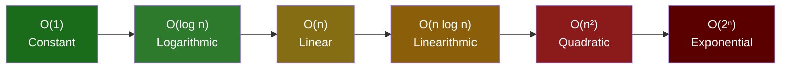
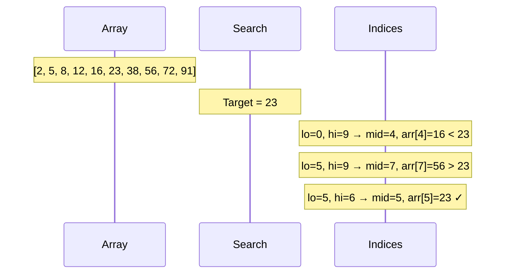
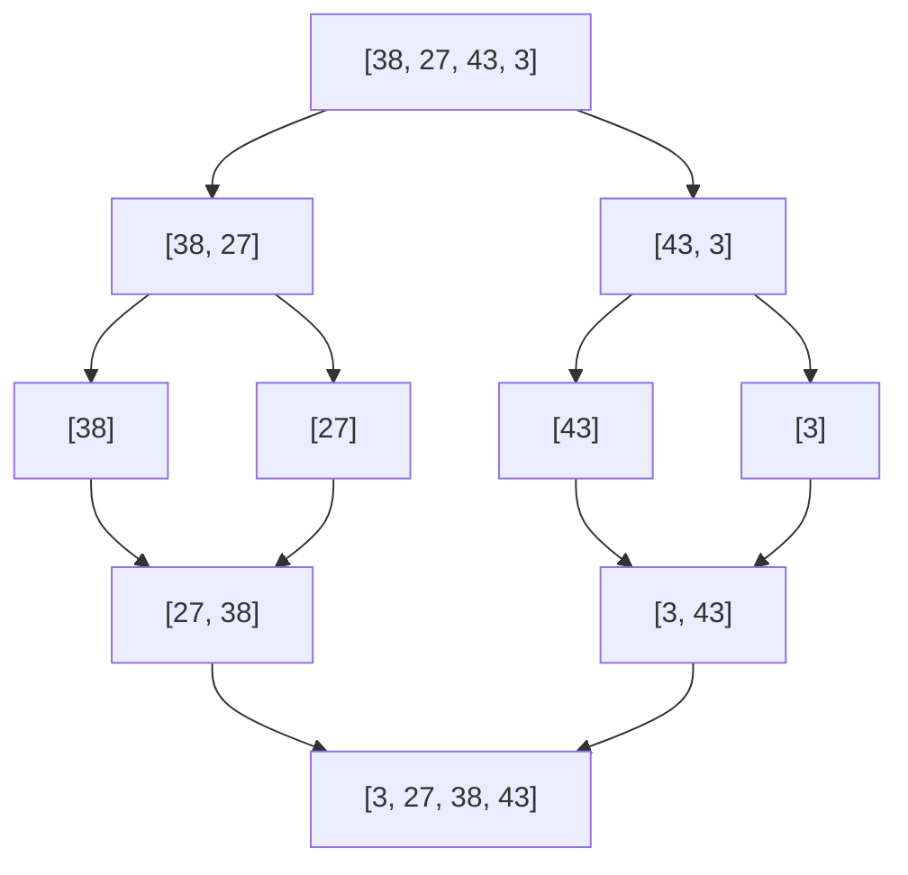

import { Tabs, TabItem } from '@astrojs/starlight/components';
import { Aside } from '@astrojs/starlight/components';

An **algorithm** is a precise sequence of steps that solves a problem. Understanding algorithms means being able to reason about **correctness** (does it always produce the right answer?) and **efficiency** (how does it scale with input size?).

---

## Big O Notation

Big O describes how an algorithm's time or space requirements grow as the input size `n` grows. It expresses the **worst-case upper bound**, ignoring constants and lower-order terms.

### Common Complexities

| Notation | Name | Example | 1 000 input |
|---|---|---|---|
| O(1) | Constant | Hash map lookup, array access by index | 1 op |
| O(log n) | Logarithmic | Binary search, balanced BST operations | ~10 ops |
| O(n) | Linear | Linear search, single array scan | 1 000 ops |
| O(n log n) | Linearithmic | Merge sort, heap sort | ~10 000 ops |
| O(n²) | Quadratic | Bubble sort, nested loops over same array | 1 000 000 ops |
| O(2ⁿ) | Exponential | Brute-force subset enumeration | 2¹⁰⁰⁰ (unusable) |
| O(n!) | Factorial | Brute-force permutations | Unusable for n > 12 |



### How to Calculate Big O

<Tabs>
<TabItem label="Python">
```python
def example(arr):
    # O(1) — constant regardless of array length
    first = arr[0]

    # O(n) — one pass through the array
    for x in arr:
        print(x)

    # O(n²) — nested loops, both proportional to n
    for i in arr:
        for j in arr:
            print(i, j)
```
</TabItem>
<TabItem label="JavaScript">
```javascript
function example(arr) {
    // O(1) — constant regardless of array length
    const first = arr[0];

    // O(n) — one pass through the array
    for (const x of arr) {
        console.log(x);
    }

    // O(n²) — nested loops, both proportional to n
    for (const i of arr) {
        for (const j of arr) {
            console.log(i, j);
        }
    }
}
```
</TabItem>
<TabItem label="C#">
```csharp
void Example(int[] arr) {
    // O(1) — constant regardless of array length
    var first = arr[0];

    // O(n) — one pass through the array
    foreach (var x in arr) {
        Console.WriteLine(x);
    }

    // O(n²) — nested loops, both proportional to n
    foreach (var i in arr) {
        foreach (var j in arr) {
            Console.WriteLine($"{i} {j}");
        }
    }
}
```
</TabItem>
<TabItem label="Java">
```java
void example(int[] arr) {
    // O(1) — constant regardless of array length
    int first = arr[0];

    // O(n) — one pass through the array
    for (int x : arr) {
        System.out.println(x);
    }

    // O(n²) — nested loops, both proportional to n
    for (int i : arr) {
        for (int j : arr) {
            System.out.println(i + " " + j);
        }
    }
}
```
</TabItem>
</Tabs>

Rules:
- Drop constants: O(2n) → O(n)
- Drop lower-order terms: O(n² + n) → O(n²)
- For sequential operations, add complexities: O(n) + O(n²) → O(n²)
- For nested operations, multiply: O(n) × O(n) → O(n²)

### Space Complexity

Time is not the only resource. Space complexity measures how much **extra memory** an algorithm uses relative to input size.

<Tabs>
<TabItem label="Python">
```python
# O(1) space — only a few variables, regardless of input size
def sum_list(arr):
    total = 0
    for x in arr:
        total += x
    return total

# O(n) space — creates a new list proportional to input
def doubled(arr):
    return [x * 2 for x in arr]
```
</TabItem>
<TabItem label="JavaScript">
```javascript
// O(1) space — only a few variables, regardless of input size
function sumList(arr) {
    let total = 0;
    for (const x of arr) {
        total += x;
    }
    return total;
}

// O(n) space — creates a new array proportional to input
function doubled(arr) {
    return arr.map(x => x * 2);
}
```
</TabItem>
<TabItem label="C#">
```csharp
// O(1) space — only a few variables, regardless of input size
int SumList(int[] arr) {
    int total = 0;
    foreach (var x in arr) total += x;
    return total;
}

// O(n) space — creates a new list proportional to input
int[] Doubled(int[] arr) => arr.Select(x => x * 2).ToArray();
```
</TabItem>
<TabItem label="Java">
```java
// O(1) space — only a few variables, regardless of input size
int sumList(int[] arr) {
    int total = 0;
    for (int x : arr) total += x;
    return total;
}

// O(n) space — creates a new array proportional to input
int[] doubled(int[] arr) {
    return Arrays.stream(arr).map(x -> x * 2).toArray();
}
```
</TabItem>
</Tabs>

---

## Searching

### Linear Search

Check every element until you find the target. No preconditions needed.

<Tabs>
<TabItem label="Python">
```python
def linear_search(arr, target):
    for i, val in enumerate(arr):
        if val == target:
            return i
    return -1
```
</TabItem>
<TabItem label="JavaScript">
```javascript
function linearSearch(arr, target) {
    for (let i = 0; i < arr.length; i++) {
        if (arr[i] === target) return i;
    }
    return -1;
}
```
</TabItem>
<TabItem label="C#">
```csharp
int LinearSearch(int[] arr, int target) {
    for (int i = 0; i < arr.Length; i++) {
        if (arr[i] == target) return i;
    }
    return -1;
}
```
</TabItem>
<TabItem label="Java">
```java
int linearSearch(int[] arr, int target) {
    for (int i = 0; i < arr.length; i++) {
        if (arr[i] == target) return i;
    }
    return -1;
}
```
</TabItem>
</Tabs>

**Complexity:** O(n) time, O(1) space.
**Use when:** array is unsorted, or small (n < ~50).

### Binary Search

Requires a **sorted** array. Eliminate half the remaining search space each step.

<Tabs>
<TabItem label="Python">
```python
def binary_search(arr, target):
    lo, hi = 0, len(arr) - 1
    while lo <= hi:
        mid = (lo + hi) // 2
        if arr[mid] == target:
            return mid
        elif arr[mid] < target:
            lo = mid + 1
        else:
            hi = mid - 1
    return -1
```
</TabItem>
<TabItem label="JavaScript">
```javascript
function binarySearch(arr, target) {
    let lo = 0, hi = arr.length - 1;
    while (lo <= hi) {
        const mid = Math.floor((lo + hi) / 2);
        if (arr[mid] === target) return mid;
        else if (arr[mid] < target) lo = mid + 1;
        else hi = mid - 1;
    }
    return -1;
}
```
</TabItem>
<TabItem label="C#">
```csharp
int BinarySearch(int[] arr, int target) {
    int lo = 0, hi = arr.Length - 1;
    while (lo <= hi) {
        int mid = (lo + hi) / 2;
        if (arr[mid] == target) return mid;
        else if (arr[mid] < target) lo = mid + 1;
        else hi = mid - 1;
    }
    return -1;
}
```
</TabItem>
<TabItem label="Java">
```java
int binarySearch(int[] arr, int target) {
    int lo = 0, hi = arr.length - 1;
    while (lo <= hi) {
        int mid = (lo + hi) / 2;
        if (arr[mid] == target) return mid;
        else if (arr[mid] < target) lo = mid + 1;
        else hi = mid - 1;
    }
    return -1;
}
```
</TabItem>
</Tabs>



**Complexity:** O(log n) time, O(1) space.
**Use when:** array is sorted. Sorting first (O(n log n)) is only worth it if you'll search many times.

---

## Sorting

### Bubble Sort

Repeatedly swap adjacent elements that are out of order. Simple but slow.

<Tabs>
<TabItem label="Python">
```python
def bubble_sort(arr):
    n = len(arr)
    for i in range(n):
        for j in range(0, n - i - 1):
            if arr[j] > arr[j + 1]:
                arr[j], arr[j + 1] = arr[j + 1], arr[j]
```
</TabItem>
<TabItem label="JavaScript">
```javascript
function bubbleSort(arr) {
    const n = arr.length;
    for (let i = 0; i < n; i++) {
        for (let j = 0; j < n - i - 1; j++) {
            if (arr[j] > arr[j + 1]) {
                [arr[j], arr[j + 1]] = [arr[j + 1], arr[j]];
            }
        }
    }
}
```
</TabItem>
<TabItem label="C#">
```csharp
void BubbleSort(int[] arr) {
    int n = arr.Length;
    for (int i = 0; i < n; i++) {
        for (int j = 0; j < n - i - 1; j++) {
            if (arr[j] > arr[j + 1]) {
                (arr[j], arr[j + 1]) = (arr[j + 1], arr[j]);
            }
        }
    }
}
```
</TabItem>
<TabItem label="Java">
```java
void bubbleSort(int[] arr) {
    int n = arr.length;
    for (int i = 0; i < n; i++) {
        for (int j = 0; j < n - i - 1; j++) {
            if (arr[j] > arr[j + 1]) {
                int tmp = arr[j]; arr[j] = arr[j + 1]; arr[j + 1] = tmp;
            }
        }
    }
}
```
</TabItem>
</Tabs>

**Complexity:** O(n²) time. Use only for teaching or tiny arrays.

### Insertion Sort

Build the sorted array one element at a time by inserting each element into its correct position.

<Tabs>
<TabItem label="Python">
```python
def insertion_sort(arr):
    for i in range(1, len(arr)):
        key = arr[i]
        j   = i - 1
        while j >= 0 and arr[j] > key:
            arr[j + 1] = arr[j]
            j -= 1
        arr[j + 1] = key
```
</TabItem>
<TabItem label="JavaScript">
```javascript
function insertionSort(arr) {
    for (let i = 1; i < arr.length; i++) {
        const key = arr[i];
        let j = i - 1;
        while (j >= 0 && arr[j] > key) {
            arr[j + 1] = arr[j];
            j--;
        }
        arr[j + 1] = key;
    }
}
```
</TabItem>
<TabItem label="C#">
```csharp
void InsertionSort(int[] arr) {
    for (int i = 1; i < arr.Length; i++) {
        int key = arr[i];
        int j = i - 1;
        while (j >= 0 && arr[j] > key) {
            arr[j + 1] = arr[j];
            j--;
        }
        arr[j + 1] = key;
    }
}
```
</TabItem>
<TabItem label="Java">
```java
void insertionSort(int[] arr) {
    for (int i = 1; i < arr.length; i++) {
        int key = arr[i];
        int j = i - 1;
        while (j >= 0 && arr[j] > key) {
            arr[j + 1] = arr[j];
            j--;
        }
        arr[j + 1] = key;
    }
}
```
</TabItem>
</Tabs>

**Complexity:** O(n²) worst case, O(n) best case (already sorted).
**Use when:** nearly-sorted data, or n < ~50 (cache-friendly, low overhead).

### Merge Sort

Divide the array in half recursively, then merge sorted halves. Classic divide-and-conquer.

<Tabs>
<TabItem label="Python">
```python
def merge_sort(arr):
    if len(arr) <= 1:
        return arr
    mid   = len(arr) // 2
    left  = merge_sort(arr[:mid])
    right = merge_sort(arr[mid:])
    return merge(left, right)

def merge(left, right):
    result = []
    i = j  = 0
    while i < len(left) and j < len(right):
        if left[i] <= right[j]:
            result.append(left[i]); i += 1
        else:
            result.append(right[j]); j += 1
    result.extend(left[i:])
    result.extend(right[j:])
    return result
```
</TabItem>
<TabItem label="JavaScript">
```javascript
function mergeSort(arr) {
    if (arr.length <= 1) return arr;
    const mid = Math.floor(arr.length / 2);
    const left = mergeSort(arr.slice(0, mid));
    const right = mergeSort(arr.slice(mid));
    return merge(left, right);
}

function merge(left, right) {
    const result = [];
    let i = 0, j = 0;
    while (i < left.length && j < right.length) {
        if (left[i] <= right[j]) result.push(left[i++]);
        else result.push(right[j++]);
    }
    return [...result, ...left.slice(i), ...right.slice(j)];
}
```
</TabItem>
<TabItem label="C#">
```csharp
int[] MergeSort(int[] arr) {
    if (arr.Length <= 1) return arr;
    int mid = arr.Length / 2;
    var left  = MergeSort(arr[..mid]);
    var right = MergeSort(arr[mid..]);
    return Merge(left, right);
}

int[] Merge(int[] left, int[] right) {
    var result = new List<int>();
    int i = 0, j = 0;
    while (i < left.Length && j < right.Length) {
        if (left[i] <= right[j]) result.Add(left[i++]);
        else result.Add(right[j++]);
    }
    result.AddRange(left.Skip(i));
    result.AddRange(right.Skip(j));
    return result.ToArray();
}
```
</TabItem>
<TabItem label="Java">
```java
int[] mergeSort(int[] arr) {
    if (arr.length <= 1) return arr;
    int mid = arr.length / 2;
    int[] left  = mergeSort(Arrays.copyOfRange(arr, 0, mid));
    int[] right = mergeSort(Arrays.copyOfRange(arr, mid, arr.length));
    return merge(left, right);
}

int[] merge(int[] left, int[] right) {
    int[] result = new int[left.length + right.length];
    int i = 0, j = 0, k = 0;
    while (i < left.length && j < right.length)
        result[k++] = left[i] <= right[j] ? left[i++] : right[j++];
    while (i < left.length)  result[k++] = left[i++];
    while (j < right.length) result[k++] = right[j++];
    return result;
}
```
</TabItem>
</Tabs>



**Complexity:** O(n log n) time, O(n) space. **Stable** (equal elements keep original order).

### Quick Sort

Pick a pivot, partition the array so all smaller elements come before it and larger after, then recurse.

<Tabs>
<TabItem label="Python">
```python
def quick_sort(arr, lo=0, hi=None):
    if hi is None:
        hi = len(arr) - 1
    if lo < hi:
        pivot_idx = partition(arr, lo, hi)
        quick_sort(arr, lo, pivot_idx - 1)
        quick_sort(arr, pivot_idx + 1, hi)

def partition(arr, lo, hi):
    pivot = arr[hi]
    i     = lo - 1
    for j in range(lo, hi):
        if arr[j] <= pivot:
            i += 1
            arr[i], arr[j] = arr[j], arr[i]
    arr[i + 1], arr[hi] = arr[hi], arr[i + 1]
    return i + 1
```
</TabItem>
<TabItem label="JavaScript">
```javascript
function quickSort(arr, lo = 0, hi = arr.length - 1) {
    if (lo < hi) {
        const pivotIdx = partition(arr, lo, hi);
        quickSort(arr, lo, pivotIdx - 1);
        quickSort(arr, pivotIdx + 1, hi);
    }
}

function partition(arr, lo, hi) {
    const pivot = arr[hi];
    let i = lo - 1;
    for (let j = lo; j < hi; j++) {
        if (arr[j] <= pivot) {
            i++;
            [arr[i], arr[j]] = [arr[j], arr[i]];
        }
    }
    [arr[i + 1], arr[hi]] = [arr[hi], arr[i + 1]];
    return i + 1;
}
```
</TabItem>
<TabItem label="C#">
```csharp
void QuickSort(int[] arr, int lo, int hi) {
    if (lo < hi) {
        int pivotIdx = Partition(arr, lo, hi);
        QuickSort(arr, lo, pivotIdx - 1);
        QuickSort(arr, pivotIdx + 1, hi);
    }
}

int Partition(int[] arr, int lo, int hi) {
    int pivot = arr[hi], i = lo - 1;
    for (int j = lo; j < hi; j++) {
        if (arr[j] <= pivot) {
            i++;
            (arr[i], arr[j]) = (arr[j], arr[i]);
        }
    }
    (arr[i + 1], arr[hi]) = (arr[hi], arr[i + 1]);
    return i + 1;
}
```
</TabItem>
<TabItem label="Java">
```java
void quickSort(int[] arr, int lo, int hi) {
    if (lo < hi) {
        int pivotIdx = partition(arr, lo, hi);
        quickSort(arr, lo, pivotIdx - 1);
        quickSort(arr, pivotIdx + 1, hi);
    }
}

int partition(int[] arr, int lo, int hi) {
    int pivot = arr[hi], i = lo - 1;
    for (int j = lo; j < hi; j++) {
        if (arr[j] <= pivot) {
            i++;
            int tmp = arr[i]; arr[i] = arr[j]; arr[j] = tmp;
        }
    }
    int tmp = arr[i + 1]; arr[i + 1] = arr[hi]; arr[hi] = tmp;
    return i + 1;
}
```
</TabItem>
</Tabs>

**Complexity:** O(n log n) average, O(n²) worst case (already sorted with naive pivot). O(log n) space (call stack). **Not stable**.
**Use when:** in-place sorting is important and average case is acceptable. Most standard library sorts use an optimised variant (Timsort, Introsort).

### Sorting Algorithm Comparison

| Algorithm | Best | Average | Worst | Space | Stable |
|---|---|---|---|---|---|
| Bubble | O(n) | O(n²) | O(n²) | O(1) | Yes |
| Insertion | O(n) | O(n²) | O(n²) | O(1) | Yes |
| Merge | O(n log n) | O(n log n) | O(n log n) | O(n) | Yes |
| Quick | O(n log n) | O(n log n) | O(n²) | O(log n) | No |
| Heap | O(n log n) | O(n log n) | O(n log n) | O(1) | No |
| Timsort (Python/Java default) | O(n) | O(n log n) | O(n log n) | O(n) | Yes |

---

## Recursion

A function that calls itself. Every recursive solution has two parts:
1. **Base case** — the condition that stops the recursion
2. **Recursive case** — the step that moves toward the base case

<Tabs>
<TabItem label="Python">
```python
def factorial(n):
    if n == 0:       # base case
        return 1
    return n * factorial(n - 1)  # recursive case

# Call stack for factorial(4):
# factorial(4) = 4 * factorial(3)
#                    = 3 * factorial(2)
#                         = 2 * factorial(1)
#                              = 1 * factorial(0)
#                                   = 1
```
</TabItem>
<TabItem label="JavaScript">
```javascript
function factorial(n) {
    if (n === 0) return 1;        // base case
    return n * factorial(n - 1); // recursive case
}
```
</TabItem>
<TabItem label="C#">
```csharp
int Factorial(int n) {
    if (n == 0) return 1;          // base case
    return n * Factorial(n - 1);   // recursive case
}
```
</TabItem>
<TabItem label="Java">
```java
int factorial(int n) {
    if (n == 0) return 1;          // base case
    return n * factorial(n - 1);   // recursive case
}
```
</TabItem>
</Tabs>

### Recursion vs Iteration

Recursion is elegant but uses O(depth) stack space. Deep recursion can cause a stack overflow. Many recursive algorithms can be converted to iteration with an explicit stack.

<Tabs>
<TabItem label="Python">
```python
# Recursive DFS — simple, but limited by call stack depth
def dfs_recursive(node, visited):
    if node in visited:
        return
    visited.add(node)
    for neighbour in graph[node]:
        dfs_recursive(neighbour, visited)

# Iterative DFS — same result, explicit stack, no stack overflow risk
def dfs_iterative(start):
    visited = set()
    stack   = [start]
    while stack:
        node = stack.pop()
        if node in visited:
            continue
        visited.add(node)
        stack.extend(graph[node])
```
</TabItem>
<TabItem label="JavaScript">
```javascript
// Recursive DFS
function dfsRecursive(node, visited = new Set()) {
    if (visited.has(node)) return;
    visited.add(node);
    for (const neighbour of graph[node]) {
        dfsRecursive(neighbour, visited);
    }
}

// Iterative DFS
function dfsIterative(start) {
    const visited = new Set();
    const stack = [start];
    while (stack.length) {
        const node = stack.pop();
        if (visited.has(node)) continue;
        visited.add(node);
        stack.push(...graph[node]);
    }
}
```
</TabItem>
<TabItem label="C#">
```csharp
// Recursive DFS
void DfsRecursive(string node, HashSet<string> visited) {
    if (visited.Contains(node)) return;
    visited.Add(node);
    foreach (var neighbour in graph[node])
        DfsRecursive(neighbour, visited);
}

// Iterative DFS
void DfsIterative(string start) {
    var visited = new HashSet<string>();
    var stack   = new Stack<string>();
    stack.Push(start);
    while (stack.Count > 0) {
        var node = stack.Pop();
        if (visited.Contains(node)) continue;
        visited.Add(node);
        foreach (var n in graph[node]) stack.Push(n);
    }
}
```
</TabItem>
<TabItem label="Java">
```java
// Recursive DFS
void dfsRecursive(String node, Set<String> visited) {
    if (visited.contains(node)) return;
    visited.add(node);
    for (String neighbour : graph.get(node))
        dfsRecursive(neighbour, visited);
}

// Iterative DFS
void dfsIterative(String start) {
    Set<String> visited = new HashSet<>();
    Deque<String> stack = new ArrayDeque<>();
    stack.push(start);
    while (!stack.isEmpty()) {
        String node = stack.pop();
        if (visited.contains(node)) continue;
        visited.add(node);
        for (String n : graph.get(node)) stack.push(n);
    }
}
```
</TabItem>
</Tabs>

---

## Dynamic Programming

**Dynamic programming (DP)** solves problems by breaking them into overlapping sub-problems and caching results to avoid repeated work. It applies when a problem has:
1. **Optimal substructure** — optimal solution contains optimal solutions to sub-problems
2. **Overlapping sub-problems** — the same sub-problems are solved multiple times

### Two Approaches

**Top-down (memoisation)** — start from the original problem, recurse, and cache.

<Tabs>
<TabItem label="Python">
```python
from functools import lru_cache

@lru_cache(maxsize=None)
def fib(n):
    if n <= 1:
        return n
    return fib(n - 1) + fib(n - 2)
```
</TabItem>
<TabItem label="JavaScript">
```javascript
const memo = new Map();
function fib(n) {
    if (n <= 1) return n;
    if (memo.has(n)) return memo.get(n);
    const result = fib(n - 1) + fib(n - 2);
    memo.set(n, result);
    return result;
}
```
</TabItem>
<TabItem label="C#">
```csharp
private Dictionary<int, long> _memo = new();

long Fib(int n) {
    if (n <= 1) return n;
    if (_memo.TryGetValue(n, out var cached)) return cached;
    return _memo[n] = Fib(n - 1) + Fib(n - 2);
}
```
</TabItem>
<TabItem label="Java">
```java
private Map<Integer, Long> memo = new HashMap<>();

long fib(int n) {
    if (n <= 1) return n;
    if (memo.containsKey(n)) return memo.get(n);
    long result = fib(n - 1) + fib(n - 2);
    memo.put(n, result);
    return result;
}
```
</TabItem>
</Tabs>

**Bottom-up (tabulation)** — fill a table from the smallest sub-problems up to the full answer.

<Tabs>
<TabItem label="Python">
```python
def fib(n):
    if n <= 1:
        return n
    dp = [0] * (n + 1)
    dp[1] = 1
    for i in range(2, n + 1):
        dp[i] = dp[i-1] + dp[i-2]
    return dp[n]

# Space-optimised — only need the last two values
def fib(n):
    a, b = 0, 1
    for _ in range(n):
        a, b = b, a + b
    return a
```
</TabItem>
<TabItem label="JavaScript">
```javascript
function fib(n) {
    if (n <= 1) return n;
    const dp = new Array(n + 1).fill(0);
    dp[1] = 1;
    for (let i = 2; i <= n; i++) dp[i] = dp[i - 1] + dp[i - 2];
    return dp[n];
}

// Space-optimised
function fibOpt(n) {
    let a = 0, b = 1;
    for (let i = 0; i < n; i++) [a, b] = [b, a + b];
    return a;
}
```
</TabItem>
<TabItem label="C#">
```csharp
long Fib(int n) {
    if (n <= 1) return n;
    long[] dp = new long[n + 1];
    dp[1] = 1;
    for (int i = 2; i <= n; i++) dp[i] = dp[i - 1] + dp[i - 2];
    return dp[n];
}

// Space-optimised
long FibOpt(int n) {
    long a = 0, b = 1;
    for (int i = 0; i < n; i++) (a, b) = (b, a + b);
    return a;
}
```
</TabItem>
<TabItem label="Java">
```java
long fib(int n) {
    if (n <= 1) return n;
    long[] dp = new long[n + 1];
    dp[1] = 1;
    for (int i = 2; i <= n; i++) dp[i] = dp[i - 1] + dp[i - 2];
    return dp[n];
}

// Space-optimised
long fibOpt(int n) {
    long a = 0, b = 1;
    for (int i = 0; i < n; i++) { long tmp = b; b = a + b; a = tmp; }
    return a;
}
```
</TabItem>
</Tabs>

### Classic DP Problems

| Problem | What to cache | Complexity |
|---|---|---|
| Fibonacci | `fib(n)` | O(n) time, O(n) space (or O(1) optimised) |
| Longest Common Subsequence | `lcs(i, j)` for prefix lengths | O(m×n) |
| 0/1 Knapsack | `knapsack(items_left, capacity)` | O(n×W) |
| Coin Change | `min_coins(amount)` | O(amount × num_coins) |
| Edit Distance | `edit(i, j)` for string prefixes | O(m×n) |

---

## Graph Algorithms

### Dijkstra's Shortest Path

Finds the shortest path from a source vertex to all others in a **weighted graph with non-negative edges**.

<Tabs>
<TabItem label="Python">
```python
import heapq

def dijkstra(graph, start):
    dist = {node: float('inf') for node in graph}
    dist[start] = 0
    pq = [(0, start)]   # (distance, node)

    while pq:
        d, u = heapq.heappop(pq)
        if d > dist[u]:
            continue
        for v, weight in graph[u]:
            if dist[u] + weight < dist[v]:
                dist[v] = dist[u] + weight
                heapq.heappush(pq, (dist[v], v))

    return dist
```
</TabItem>
<TabItem label="JavaScript">
```javascript
function dijkstra(graph, start) {
    const dist = Object.fromEntries(Object.keys(graph).map(k => [k, Infinity]));
    dist[start] = 0;
    const pq = [[0, start]];  // [distance, node]

    while (pq.length) {
        pq.sort((a, b) => a[0] - b[0]);
        const [d, u] = pq.shift();
        if (d > dist[u]) continue;
        for (const [v, weight] of graph[u]) {
            if (dist[u] + weight < dist[v]) {
                dist[v] = dist[u] + weight;
                pq.push([dist[v], v]);
            }
        }
    }
    return dist;
}
```
</TabItem>
<TabItem label="C#">
```csharp
Dictionary<string, double> Dijkstra(Dictionary<string, List<(string, double)>> graph, string start) {
    var dist = graph.Keys.ToDictionary(k => k, _ => double.PositiveInfinity);
    dist[start] = 0;
    var pq = new PriorityQueue<string, double>();
    pq.Enqueue(start, 0);

    while (pq.Count > 0) {
        var u = pq.Dequeue();
        foreach (var (v, weight) in graph[u]) {
            if (dist[u] + weight < dist[v]) {
                dist[v] = dist[u] + weight;
                pq.Enqueue(v, dist[v]);
            }
        }
    }
    return dist;
}
```
</TabItem>
<TabItem label="Java">
```java
Map<String, Double> dijkstra(Map<String, List<Map.Entry<String, Double>>> graph, String start) {
    Map<String, Double> dist = new HashMap<>();
    for (String node : graph.keySet()) dist.put(node, Double.MAX_VALUE);
    dist.put(start, 0.0);
    PriorityQueue<Map.Entry<String, Double>> pq =
        new PriorityQueue<>(Map.Entry.comparingByValue());
    pq.add(Map.entry(start, 0.0));

    while (!pq.isEmpty()) {
        var entry = pq.poll();
        String u = entry.getKey(); double d = entry.getValue();
        if (d > dist.get(u)) continue;
        for (var neighbor : graph.get(u)) {
            double newDist = dist.get(u) + neighbor.getValue();
            if (newDist < dist.get(neighbor.getKey())) {
                dist.put(neighbor.getKey(), newDist);
                pq.add(Map.entry(neighbor.getKey(), newDist));
            }
        }
    }
    return dist;
}
```
</TabItem>
</Tabs>

**Complexity:** O((V + E) log V) with a binary heap.
**Limitation:** Does not work with negative edge weights (use Bellman-Ford instead).

### Topological Sort

Produces a linear ordering of vertices in a **Directed Acyclic Graph (DAG)** such that for every edge A → B, A comes before B. Used for build systems, dependency resolution, task scheduling.

<Tabs>
<TabItem label="Python">
```python
from collections import deque

def topological_sort(graph):
    in_degree = {v: 0 for v in graph}
    for v in graph:
        for u in graph[v]:
            in_degree[u] += 1

    queue = deque([v for v in graph if in_degree[v] == 0])
    order = []

    while queue:
        v = queue.popleft()
        order.append(v)
        for u in graph[v]:
            in_degree[u] -= 1
            if in_degree[u] == 0:
                queue.append(u)

    return order if len(order) == len(graph) else []  # [] if cycle detected
```
</TabItem>
<TabItem label="JavaScript">
```javascript
function topologicalSort(graph) {
    const inDegree = Object.fromEntries(Object.keys(graph).map(k => [k, 0]));
    for (const v of Object.keys(graph))
        for (const u of graph[v]) inDegree[u]++;

    const queue = Object.keys(graph).filter(v => inDegree[v] === 0);
    const order = [];

    while (queue.length) {
        const v = queue.shift();
        order.push(v);
        for (const u of graph[v]) {
            if (--inDegree[u] === 0) queue.push(u);
        }
    }
    return order.length === Object.keys(graph).length ? order : [];
}
```
</TabItem>
<TabItem label="C#">
```csharp
List<string> TopologicalSort(Dictionary<string, List<string>> graph) {
    var inDegree = graph.Keys.ToDictionary(k => k, _ => 0);
    foreach (var v in graph.Keys)
        foreach (var u in graph[v]) inDegree[u]++;

    var queue = new Queue<string>(graph.Keys.Where(v => inDegree[v] == 0));
    var order = new List<string>();

    while (queue.Count > 0) {
        var v = queue.Dequeue();
        order.Add(v);
        foreach (var u in graph[v])
            if (--inDegree[u] == 0) queue.Enqueue(u);
    }
    return order.Count == graph.Count ? order : new List<string>();
}
```
</TabItem>
<TabItem label="Java">
```java
List<String> topologicalSort(Map<String, List<String>> graph) {
    Map<String, Integer> inDegree = new HashMap<>();
    for (String v : graph.keySet()) inDegree.put(v, 0);
    for (String v : graph.keySet())
        for (String u : graph.get(v)) inDegree.merge(u, 1, Integer::sum);

    Queue<String> queue = new LinkedList<>();
    for (String v : graph.keySet()) if (inDegree.get(v) == 0) queue.add(v);
    List<String> order = new ArrayList<>();

    while (!queue.isEmpty()) {
        String v = queue.poll();
        order.add(v);
        for (String u : graph.get(v))
            if (inDegree.merge(u, -1, Integer::sum) == 0) queue.add(u);
    }
    return order.size() == graph.size() ? order : Collections.emptyList();
}
```
</TabItem>
</Tabs>

### Minimum Spanning Tree (MST)

A spanning tree that connects all vertices with the minimum total edge weight.

- **Kruskal's** — sort all edges by weight, greedily add edges that don't form a cycle (use Union-Find)
- **Prim's** — grow the MST from a starting vertex, always adding the cheapest edge to an unvisited vertex

---

## Two Pointers & Sliding Window

High-leverage patterns that reduce nested loops from O(n²) to O(n).

### Two Pointers

<Tabs>
<TabItem label="Python">
```python
# Find pair that sums to target in sorted array
def two_sum_sorted(arr, target):
    lo, hi = 0, len(arr) - 1
    while lo < hi:
        s = arr[lo] + arr[hi]
        if s == target:
            return (lo, hi)
        elif s < target:
            lo += 1
        else:
            hi -= 1
    return None
```
</TabItem>
<TabItem label="JavaScript">
```javascript
function twoSumSorted(arr, target) {
    let lo = 0, hi = arr.length - 1;
    while (lo < hi) {
        const s = arr[lo] + arr[hi];
        if (s === target) return [lo, hi];
        else if (s < target) lo++;
        else hi--;
    }
    return null;
}
```
</TabItem>
<TabItem label="C#">
```csharp
(int, int)? TwoSumSorted(int[] arr, int target) {
    int lo = 0, hi = arr.Length - 1;
    while (lo < hi) {
        int s = arr[lo] + arr[hi];
        if (s == target) return (lo, hi);
        else if (s < target) lo++;
        else hi--;
    }
    return null;
}
```
</TabItem>
<TabItem label="Java">
```java
int[] twoSumSorted(int[] arr, int target) {
    int lo = 0, hi = arr.length - 1;
    while (lo < hi) {
        int s = arr[lo] + arr[hi];
        if (s == target) return new int[]{lo, hi};
        else if (s < target) lo++;
        else hi--;
    }
    return null;
}
```
</TabItem>
</Tabs>

### Sliding Window

<Tabs>
<TabItem label="Python">
```python
# Maximum sum subarray of size k
def max_window_sum(arr, k):
    window = sum(arr[:k])
    best   = window
    for i in range(k, len(arr)):
        window += arr[i] - arr[i - k]
        best = max(best, window)
    return best
```
</TabItem>
<TabItem label="JavaScript">
```javascript
function maxWindowSum(arr, k) {
    let window = arr.slice(0, k).reduce((a, b) => a + b, 0);
    let best = window;
    for (let i = k; i < arr.length; i++) {
        window += arr[i] - arr[i - k];
        best = Math.max(best, window);
    }
    return best;
}
```
</TabItem>
<TabItem label="C#">
```csharp
int MaxWindowSum(int[] arr, int k) {
    int window = arr.Take(k).Sum();
    int best = window;
    for (int i = k; i < arr.Length; i++) {
        window += arr[i] - arr[i - k];
        best = Math.Max(best, window);
    }
    return best;
}
```
</TabItem>
<TabItem label="Java">
```java
int maxWindowSum(int[] arr, int k) {
    int window = 0;
    for (int i = 0; i < k; i++) window += arr[i];
    int best = window;
    for (int i = k; i < arr.length; i++) {
        window += arr[i] - arr[i - k];
        best = Math.max(best, window);
    }
    return best;
}
```
</TabItem>
</Tabs>

---

## Algorithm Design Strategies

| Strategy | Idea | Examples |
|---|---|---|
| Brute Force | Try every possibility | Linear search, permutations |
| Divide & Conquer | Split, recurse, combine | Merge sort, binary search |
| Greedy | Always pick locally optimal choice | Dijkstra, Kruskal, activity selection |
| Dynamic Programming | Cache overlapping sub-problems | Fibonacci, knapsack, LCS |
| Backtracking | Try options, undo on dead ends | N-Queens, Sudoku solver |
| Two Pointers | Converge pointers from both ends | Two sum, palindrome check |
| Sliding Window | Move fixed or variable window | Max subarray, longest substring |

---

## Related

- [Data Structures](/programming/data-structures) — the structures algorithms operate on
- [OOP](/programming/oop) — encapsulating algorithms as methods within well-designed classes
- [Testing](/programming/testing) — property-based and edge-case testing of algorithms
