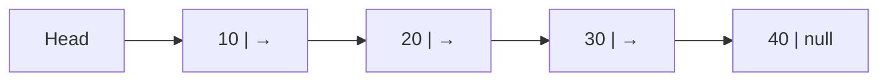
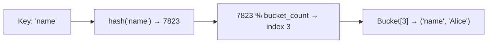
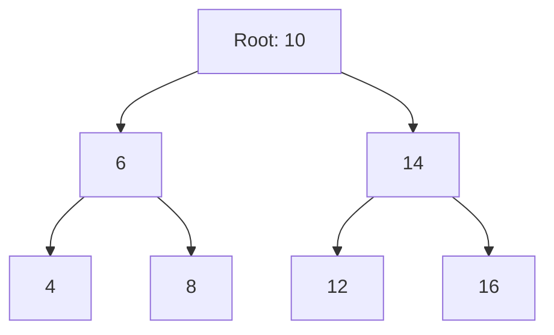
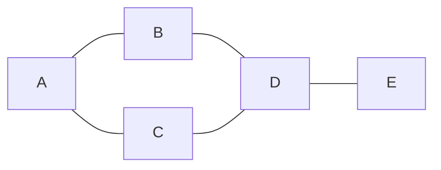

A **data structure** is a way of organising and storing data so that it can be accessed and modified efficiently. Choosing the wrong structure is one of the most common causes of performance problems. This page covers the most important structures, when to use each, and the complexity you should expect.

---

## Complexity at a Glance

| Structure | Access | Search | Insert | Delete | Space |
|---|---|---|---|---|---|
| Array | O(1) | O(n) | O(n) | O(n) | O(n) |
| Linked List | O(n) | O(n) | O(1) | O(1) | O(n) |
| Stack | O(n) | O(n) | O(1) | O(1) | O(n) |
| Queue | O(n) | O(n) | O(1) | O(1) | O(n) |
| Hash Map | N/A | O(1)* | O(1)* | O(1)* | O(n) |
| Binary Search Tree | O(log n)* | O(log n)* | O(log n)* | O(log n)* | O(n) |
| Heap | O(1) (peek) | O(n) | O(log n) | O(log n) | O(n) |

*Average case. Worst case may degrade (hash collision → O(n); unbalanced BST → O(n)).

---

## Array

The simplest structure: a contiguous block of memory holding elements of the same type, accessed by integer index.

```python
nums = [10, 20, 30, 40, 50]
nums[0]      # 10 — O(1) access
nums[-1]     # 50 — last element
nums[1:3]    # [20, 30] — slice
nums.append(60)    # O(1) amortised
nums.insert(2, 99) # O(n) — shifts everything right of index 2
```

```javascript
const nums = [10, 20, 30, 40, 50];
nums[0];         // 10
nums.at(-1);     // 50
nums.push(60);   // O(1) amortised
nums.splice(2, 0, 99);  // O(n) insert
```

### Memory Layout

```
Index:  0    1    2    3    4
Value: [10] [20] [30] [40] [50]
        ↑
        Base address. Each element is base + (index × element_size).
```

**Use when:** you need fast random access by index, or the collection size is fixed.

**Avoid when:** you frequently insert or delete from the middle (every element after the insertion point must shift).

### Dynamic Arrays (Lists)

Python's `list`, JavaScript's `Array`, Java's `ArrayList` are **dynamic arrays** — they start with a fixed internal buffer and double it when full. This makes `append` O(1) *amortised* (occasionally O(n) when resizing), but average insertion at arbitrary positions is still O(n).

---

## Linked List

A sequence of **nodes** where each node holds a value and a pointer to the next node. There is no index — you traverse from head to find any element.



```python
class Node:
    def __init__(self, val):
        self.val  = val
        self.next = None

class LinkedList:
    def __init__(self):
        self.head = None

    def prepend(self, val):       # O(1)
        node      = Node(val)
        node.next = self.head
        self.head = node

    def append(self, val):        # O(n) — must traverse to tail
        node = Node(val)
        if not self.head:
            self.head = node
            return
        cur = self.head
        while cur.next:
            cur = cur.next
        cur.next = node

    def delete(self, val):        # O(n) search + O(1) removal
        if not self.head:
            return
        if self.head.val == val:
            self.head = self.head.next
            return
        cur = self.head
        while cur.next:
            if cur.next.val == val:
                cur.next = cur.next.next
                return
            cur = cur.next
```

### Singly vs Doubly Linked

| | Singly | Doubly |
|---|---|---|
| Pointers per node | `next` | `next` + `prev` |
| Traverse backwards | No | Yes |
| Delete known node | O(n) (find predecessor) | O(1) |
| Memory | Less | More |

**Use when:** you insert/delete frequently at the head or a known position, and don't need random access.

**Avoid when:** you need fast access by index (use array instead).

---

## Stack

A **LIFO** (Last In, First Out) structure. Like a stack of plates — you always add and remove from the top.

```python
stack = []
stack.append("a")   # push
stack.append("b")
stack.append("c")
stack.pop()         # "c" — O(1)
stack[-1]           # "b" — peek without removing
```

### How a Call Stack Works

```
call main()
  call greet("Alice")
    call format_name("Alice")
    ← returns "Alice"      ← pop frame
  ← returns "Hello, Alice" ← pop frame
← returns                  ← pop frame
```

**Use when:**
- Undo/redo functionality
- Parsing expressions (brackets matching)
- DFS graph traversal (explicit stack instead of recursion)
- Function call management (the runtime does this automatically)

---

## Queue

A **FIFO** (First In, First Out) structure. Like a queue at a checkout — first in, first served.

```python
from collections import deque

queue = deque()
queue.append("a")    # enqueue — O(1)
queue.append("b")
queue.append("c")
queue.popleft()      # "a" — dequeue O(1)
```

Using a plain list as a queue (`list.pop(0)`) is O(n) because every element shifts. Always use `deque` for queues in Python.

### Priority Queue / Heap Queue

In a **priority queue**, items are dequeued in priority order, not insertion order. Backed by a **min-heap** (smallest value has highest priority).

```python
import heapq

pq = []
heapq.heappush(pq, (2, "medium task"))
heapq.heappush(pq, (1, "urgent task"))
heapq.heappush(pq, (3, "low task"))

heapq.heappop(pq)   # (1, "urgent task") — always the minimum
```

**Use when:**
- Task scheduling (process highest-priority job first)
- BFS graph traversal
- Dijkstra's shortest-path algorithm
- Producer/consumer pipelines

---

## Hash Map (Dictionary)

A **hash map** stores key-value pairs and gives O(1) average-case lookup, insert, and delete by hashing the key to an array index.

```python
user = {"name": "Alice", "age": 30}
user["name"]         # O(1) lookup
user["email"] = "a@b.com"  # O(1) insert
del user["age"]      # O(1) delete
"name" in user       # O(1) membership test
```

### How Hashing Works



1. The key is passed through a hash function → integer
2. Integer is modulo'd by the number of buckets → array index
3. Value is stored at that index

**Collisions** happen when two keys hash to the same bucket. Common resolutions:
- **Chaining** — each bucket holds a linked list of all colliding entries
- **Open addressing** — probe for the next empty slot

**Use when:** fast lookup by a non-integer key (username → user record, word → count, etc.).

**Avoid when:** you need keys in sorted order (use a BST or sorted list instead).

### Common Patterns

```python
# Frequency count
from collections import Counter
words = ["apple", "banana", "apple", "cherry", "banana", "apple"]
count = Counter(words)
# Counter({'apple': 3, 'banana': 2, 'cherry': 1})

# Group by key
from collections import defaultdict
by_department = defaultdict(list)
for emp in employees:
    by_department[emp.department].append(emp)

# Memoisation (cache expensive function results)
cache = {}
def fib(n):
    if n in cache:
        return cache[n]
    if n <= 1:
        return n
    cache[n] = fib(n-1) + fib(n-2)
    return cache[n]
```

---

## Tree

A tree is a hierarchical structure of **nodes** connected by directed edges, with a single **root** and no cycles. Each node has zero or more **children**; nodes with no children are **leaves**.



### Binary Search Tree (BST)

Every node satisfies: **left child < node < right child**. This ordering makes search O(log n) on a balanced tree.

```python
class BSTNode:
    def __init__(self, val):
        self.val   = val
        self.left  = None
        self.right = None

def insert(root, val):
    if root is None:
        return BSTNode(val)
    if val < root.val:
        root.left  = insert(root.left, val)
    elif val > root.val:
        root.right = insert(root.right, val)
    return root

def search(root, val):
    if root is None or root.val == val:
        return root
    if val < root.val:
        return search(root.left, val)
    return search(root.right, val)
```

**Problem:** An unbalanced BST (e.g. inserting already-sorted values) degrades to O(n) — it becomes a linked list. **Self-balancing BSTs** (AVL, Red-Black) keep the tree height O(log n) through rotations.

### Tree Traversal

| Order | Sequence | Use Case |
|---|---|---|
| In-order (L → N → R) | Sorted output for BST | Print BST values in order |
| Pre-order (N → L → R) | Root before children | Serialise tree structure |
| Post-order (L → R → N) | Children before root | Delete tree, evaluate expressions |
| Level-order (BFS) | Level by level | Shortest path in unweighted tree |

```python
def inorder(node):
    if node:
        inorder(node.left)
        print(node.val)
        inorder(node.right)
```

### Other Tree Types

| Type | Description | Used in |
|---|---|---|
| AVL Tree | Self-balancing BST (height difference ≤ 1) | In-memory sorted maps |
| Red-Black Tree | Self-balancing BST | Java `TreeMap`, Linux kernel |
| B-Tree / B+Tree | Wide branching factor for disk I/O | Databases, filesystems |
| Trie (prefix tree) | Each node is a character | Autocomplete, spell check |
| Heap | Complete binary tree; parent ≤ children | Priority queue |

---

## Graph

A **graph** is a set of **vertices** (nodes) connected by **edges**. Unlike a tree, a graph can have cycles, disconnected components, and bidirectional edges.



### Directed vs Undirected

| | Undirected | Directed (Digraph) |
|---|---|---|
| Edge | A — B (both ways) | A → B (one way) |
| Example | Facebook friendship | Twitter follow, URL link |
| Degree | One count | In-degree + out-degree |

### Weighted vs Unweighted

Edges may carry a **weight** (cost, distance, capacity). Used in shortest-path algorithms.

### Graph Representations

**Adjacency List** — a map from each vertex to its list of neighbours. O(V + E) space. Fast for sparse graphs.

```python
graph = {
    "A": ["B", "C"],
    "B": ["A", "D"],
    "C": ["A", "D"],
    "D": ["B", "C", "E"],
    "E": ["D"],
}
```

**Adjacency Matrix** — a V × V boolean (or weight) matrix. O(V²) space. Fast for dense graphs or checking if an edge exists in O(1).

```python
# 5 vertices: A=0, B=1, C=2, D=3, E=4
matrix = [
    [0, 1, 1, 0, 0],  # A
    [1, 0, 0, 1, 0],  # B
    [1, 0, 0, 1, 0],  # C
    [0, 1, 1, 0, 1],  # D
    [0, 0, 0, 1, 0],  # E
]
```

### BFS vs DFS

```python
from collections import deque

def bfs(graph, start):
    visited = set()
    queue   = deque([start])
    visited.add(start)
    while queue:
        node = queue.popleft()
        print(node)
        for neighbour in graph[node]:
            if neighbour not in visited:
                visited.add(neighbour)
                queue.append(neighbour)

def dfs(graph, node, visited=None):
    if visited is None:
        visited = set()
    visited.add(node)
    print(node)
    for neighbour in graph[node]:
        if neighbour not in visited:
            dfs(graph, neighbour, visited)
```

| | BFS | DFS |
|---|---|---|
| Data structure | Queue | Stack (or recursion) |
| Finds shortest path | Yes (unweighted) | No |
| Memory use | O(V) — wide frontier | O(h) — h = max depth |
| Use cases | Level traversal, shortest path | Topological sort, cycle detection, maze solving |

---

## Choosing the Right Structure

```mermaid
flowchart TD
    Q1{"What do you need?"}
    Q1 -->|Fast lookup by key| HASH["Hash Map"]
    Q1 -->|Ordered / sorted data| BST["BST / Sorted List"]
    Q1 -->|LIFO (undo/call stack)| STACK["Stack"]
    Q1 -->|FIFO (scheduling)| QUEUE["Queue / Deque"]
    Q1 -->|Priority ordering| HEAP["Heap / Priority Queue"]
    Q1 -->|Hierarchical data| TREE["Tree"]
    Q1 -->|Relationships / network| GRAPH["Graph"]
    Q1 -->|Sequential, fast index access| ARRAY["Array"]
    Q1 -->|Frequent head inserts/deletes| LIST["Linked List"]
```

---

## Related

- [Algorithms](/programming/algorithms) — how to efficiently operate on these structures
- [OOP](/programming/oop) — encapsulating structures in classes with behaviour
- [Fundamentals](/programming/fundamentals) — the variable and type system these structures are built from
