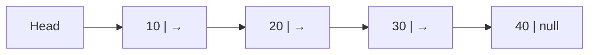
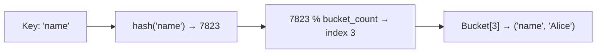
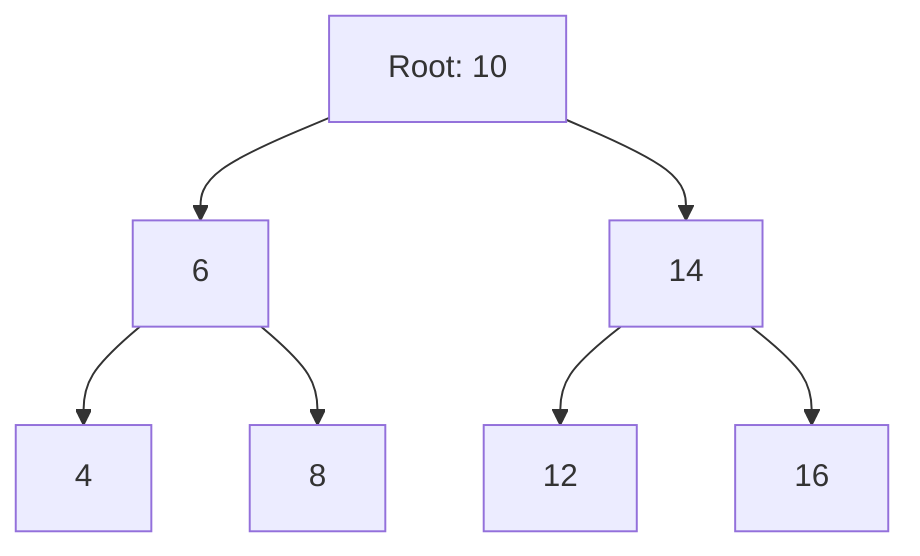
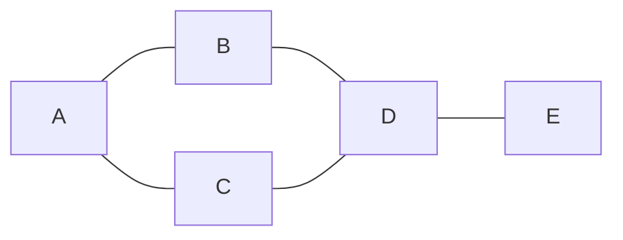

import { Tabs, TabItem } from '@astrojs/starlight/components';
import { Aside } from '@astrojs/starlight/components';

A **data structure** is a way of organising and storing data so that it can be accessed and modified efficiently. Choosing the wrong structure is one of the most common causes of performance problems. This page covers the most important structures, when to use each, and the complexity you should expect.

---

## Complexity at a Glance

| Structure | Access | Search | Insert | Delete | Space |
|---|---|---|---|---|---|
| Array | O(1) | O(n) | O(n) | O(n) | O(n) |
| Linked List | O(n) | O(n) | O(1) | O(1) | O(n) |
| Stack | O(n) | O(n) | O(1) | O(1) | O(n) |
| Queue | O(n) | O(n) | O(1) | O(1) | O(n) |
| Hash Map | N/A | O(1)* | O(1)* | O(1)* | O(n) |
| Binary Search Tree | O(log n)* | O(log n)* | O(log n)* | O(log n)* | O(n) |
| Heap | O(1) (peek) | O(n) | O(log n) | O(log n) | O(n) |

*Average case. Worst case may degrade (hash collision → O(n); unbalanced BST → O(n)).

---

## Array

The simplest structure: a contiguous block of memory holding elements of the same type, accessed by integer index.

<Tabs>
<TabItem label="Python">
```python
nums = [10, 20, 30, 40, 50]
nums[0]      # 10 — O(1) access
nums[-1]     # 50 — last element
nums[1:3]    # [20, 30] — slice
nums.append(60)    # O(1) amortised
nums.insert(2, 99) # O(n) — shifts everything right of index 2
```
</TabItem>
<TabItem label="JavaScript">
```javascript
const nums = [10, 20, 30, 40, 50];
nums[0];         // 10
nums.at(-1);     // 50
nums.push(60);   // O(1) amortised
nums.splice(2, 0, 99);  // O(n) insert
```
</TabItem>
<TabItem label="C#">
```csharp
var nums = new List<int> { 10, 20, 30, 40, 50 };
nums[0];          // 10 — O(1) access
nums[^1];         // 50 — last element
nums.Add(60);     // O(1) amortised
nums.Insert(2, 99); // O(n) — shifts everything right of index 2
```
</TabItem>
<TabItem label="Java">
```java
List<Integer> nums = new ArrayList<>(Arrays.asList(10, 20, 30, 40, 50));
nums.get(0);      // 10 — O(1) access
nums.get(nums.size() - 1);  // 50 — last element
nums.add(60);     // O(1) amortised
nums.add(2, 99);  // O(n) — shifts everything right of index 2
```
</TabItem>
</Tabs>

### Memory Layout

```
Index:  0    1    2    3    4
Value: [10] [20] [30] [40] [50]
        ↑
        Base address. Each element is base + (index × element_size).
```

**Use when:** you need fast random access by index, or the collection size is fixed.

**Avoid when:** you frequently insert or delete from the middle (every element after the insertion point must shift).

### Dynamic Arrays (Lists)

Python's `list`, JavaScript's `Array`, Java's `ArrayList` are **dynamic arrays** — they start with a fixed internal buffer and double it when full. This makes `append` O(1) *amortised* (occasionally O(n) when resizing), but average insertion at arbitrary positions is still O(n).

---

## Linked List

A sequence of **nodes** where each node holds a value and a pointer to the next node. There is no index — you traverse from head to find any element.



<Tabs>
<TabItem label="Python">
```python
class Node:
    def __init__(self, val):
        self.val  = val
        self.next = None

class LinkedList:
    def __init__(self):
        self.head = None

    def prepend(self, val):       # O(1)
        node      = Node(val)
        node.next = self.head
        self.head = node

    def append(self, val):        # O(n) — must traverse to tail
        node = Node(val)
        if not self.head:
            self.head = node
            return
        cur = self.head
        while cur.next:
            cur = cur.next
        cur.next = node

    def delete(self, val):        # O(n) search + O(1) removal
        if not self.head:
            return
        if self.head.val == val:
            self.head = self.head.next
            return
        cur = self.head
        while cur.next:
            if cur.next.val == val:
                cur.next = cur.next.next
                return
            cur = cur.next
```
</TabItem>
<TabItem label="JavaScript">
```javascript
class Node {
    constructor(val) { this.val = val; this.next = null; }
}

class LinkedList {
    constructor() { this.head = null; }

    prepend(val) {           // O(1)
        const node = new Node(val);
        node.next = this.head;
        this.head = node;
    }

    append(val) {            // O(n)
        const node = new Node(val);
        if (!this.head) { this.head = node; return; }
        let cur = this.head;
        while (cur.next) cur = cur.next;
        cur.next = node;
    }

    delete(val) {            // O(n) search + O(1) removal
        if (!this.head) return;
        if (this.head.val === val) { this.head = this.head.next; return; }
        let cur = this.head;
        while (cur.next) {
            if (cur.next.val === val) { cur.next = cur.next.next; return; }
            cur = cur.next;
        }
    }
}
```
</TabItem>
<TabItem label="C#">
```csharp
class Node<T> {
    public T Val; public Node<T> Next;
    public Node(T val) { Val = val; }
}

class LinkedList<T> {
    public Node<T> Head;

    public void Prepend(T val) {   // O(1)
        var node = new Node<T>(val);
        node.Next = Head; Head = node;
    }

    public void Append(T val) {    // O(n)
        var node = new Node<T>(val);
        if (Head == null) { Head = node; return; }
        var cur = Head;
        while (cur.Next != null) cur = cur.Next;
        cur.Next = node;
    }
}
```
</TabItem>
<TabItem label="Java">
```java
class Node<T> {
    T val; Node<T> next;
    Node(T val) { this.val = val; }
}

class LinkedList<T> {
    Node<T> head;

    void prepend(T val) {          // O(1)
        Node<T> node = new Node<>(val);
        node.next = head; head = node;
    }

    void append(T val) {           // O(n)
        Node<T> node = new Node<>(val);
        if (head == null) { head = node; return; }
        Node<T> cur = head;
        while (cur.next != null) cur = cur.next;
        cur.next = node;
    }
}
```
</TabItem>
</Tabs>

### Singly vs Doubly Linked

| | Singly | Doubly |
|---|---|---|
| Pointers per node | `next` | `next` + `prev` |
| Traverse backwards | No | Yes |
| Delete known node | O(n) (find predecessor) | O(1) |
| Memory | Less | More |

**Use when:** you insert/delete frequently at the head or a known position, and don't need random access.

**Avoid when:** you need fast access by index (use array instead).

---

## Stack

A **LIFO** (Last In, First Out) structure. Like a stack of plates — you always add and remove from the top.

<Tabs>
<TabItem label="Python">
```python
stack = []
stack.append("a")   # push
stack.append("b")
stack.append("c")
stack.pop()         # "c" — O(1)
stack[-1]           # "b" — peek without removing
```
</TabItem>
<TabItem label="JavaScript">
```javascript
const stack = [];
stack.push("a");    // push
stack.push("b");
stack.push("c");
stack.pop();        // "c" — O(1)
stack[stack.length - 1];  // "b" — peek
```
</TabItem>
<TabItem label="C#">
```csharp
var stack = new Stack<string>();
stack.Push("a");
stack.Push("b");
stack.Push("c");
stack.Pop();    // "c" — O(1)
stack.Peek();   // "b" — peek without removing
```
</TabItem>
<TabItem label="Java">
```java
Deque<String> stack = new ArrayDeque<>();
stack.push("a");
stack.push("b");
stack.push("c");
stack.pop();    // "c" — O(1)
stack.peek();   // "b" — peek without removing
```
</TabItem>
</Tabs>

### How a Call Stack Works

```
call main()
  call greet("Alice")
    call format_name("Alice")
    ← returns "Alice"      ← pop frame
  ← returns "Hello, Alice" ← pop frame
← returns                  ← pop frame
```

**Use when:**
- Undo/redo functionality
- Parsing expressions (brackets matching)
- DFS graph traversal (explicit stack instead of recursion)
- Function call management (the runtime does this automatically)

---

## Queue

A **FIFO** (First In, First Out) structure. Like a queue at a checkout — first in, first served.

<Tabs>
<TabItem label="Python">
```python
from collections import deque

queue = deque()
queue.append("a")    # enqueue — O(1)
queue.append("b")
queue.append("c")
queue.popleft()      # "a" — dequeue O(1)
```
</TabItem>
<TabItem label="JavaScript">
```javascript
// Use an array as a queue; shift() is O(n) — fine for small queues
const queue = [];
queue.push("a");   // enqueue
queue.push("b");
queue.push("c");
queue.shift();     // "a" — dequeue O(n); use a proper deque for large queues
```
</TabItem>
<TabItem label="C#">
```csharp
var queue = new Queue<string>();
queue.Enqueue("a");  // O(1)
queue.Enqueue("b");
queue.Enqueue("c");
queue.Dequeue();     // "a" — O(1)
queue.Peek();        // "b" — peek without removing
```
</TabItem>
<TabItem label="Java">
```java
Queue<String> queue = new LinkedList<>();
queue.offer("a");   // enqueue O(1)
queue.offer("b");
queue.offer("c");
queue.poll();       // "a" — dequeue O(1)
queue.peek();       // "b" — peek without removing
```
</TabItem>
</Tabs>

<Aside type="caution">
Using a plain list as a queue (`list.pop(0)` in Python) is O(n) because every element shifts. Always use `deque` for queues in Python.
</Aside>

### Priority Queue / Heap Queue

In a **priority queue**, items are dequeued in priority order, not insertion order. Backed by a **min-heap** (smallest value has highest priority).

<Tabs>
<TabItem label="Python">
```python
import heapq

pq = []
heapq.heappush(pq, (2, "medium task"))
heapq.heappush(pq, (1, "urgent task"))
heapq.heappush(pq, (3, "low task"))

heapq.heappop(pq)   # (1, "urgent task") — always the minimum
```
</TabItem>
<TabItem label="JavaScript">
```javascript
// JS has no built-in heap — use a sorted array for small queues
// or a third-party library (e.g. @datastructures-js/priority-queue)
const pq = [
    [2, "medium task"],
    [1, "urgent task"],
    [3, "low task"],
];
pq.sort((a, b) => a[0] - b[0]);
pq.shift();  // [1, "urgent task"]
```
</TabItem>
<TabItem label="C#">
```csharp
var pq = new PriorityQueue<string, int>();
pq.Enqueue("medium task", 2);
pq.Enqueue("urgent task", 1);
pq.Enqueue("low task", 3);

pq.Dequeue();  // "urgent task" — lowest priority number first
```
</TabItem>
<TabItem label="Java">
```java
PriorityQueue<int[]> pq = new PriorityQueue<>(Comparator.comparingInt(a -> a[0]));
pq.offer(new int[]{2, 0}); // 0 = index into a label array
pq.offer(new int[]{1, 1});
pq.offer(new int[]{3, 2});

pq.poll();  // int[]{1, 1} — always the minimum priority
```
</TabItem>
</Tabs>

**Use when:**
- Task scheduling (process highest-priority job first)
- BFS graph traversal
- Dijkstra's shortest-path algorithm
- Producer/consumer pipelines

---

## Hash Map (Dictionary)

A **hash map** stores key-value pairs and gives O(1) average-case lookup, insert, and delete by hashing the key to an array index.

<Tabs>
<TabItem label="Python">
```python
user = {"name": "Alice", "age": 30}
user["name"]         # O(1) lookup
user["email"] = "a@b.com"  # O(1) insert
del user["age"]      # O(1) delete
"name" in user       # O(1) membership test
```
</TabItem>
<TabItem label="JavaScript">
```javascript
const user = { name: "Alice", age: 30 };
user.name;           // O(1) lookup
user.email = "a@b.com"; // O(1) insert
delete user.age;     // O(1) delete
"name" in user;      // O(1) membership test

// Map for non-string keys or ordered insertion
const map = new Map();
map.set("key", "value");
map.get("key");      // "value"
map.has("key");      // true
```
</TabItem>
<TabItem label="C#">
```csharp
var user = new Dictionary<string, object> \{ ["name"] = "Alice", ["age"] = 30 \};
user["name"];            // O(1) lookup
user["email"] = "a@b.com"; // O(1) insert
user.Remove("age");      // O(1) delete
user.ContainsKey("name"); // O(1) membership test
```
</TabItem>
<TabItem label="Java">
```java
Map<String, Object> user = new HashMap<>();
user.put("name", "Alice");
user.put("age", 30);
user.get("name");        // O(1) lookup
user.put("email", "a@b.com"); // O(1) insert
user.remove("age");      // O(1) delete
user.containsKey("name"); // O(1) membership test
```
</TabItem>
</Tabs>

### How Hashing Works



1. The key is passed through a hash function → integer
2. Integer is modulo'd by the number of buckets → array index
3. Value is stored at that index

**Collisions** happen when two keys hash to the same bucket. Common resolutions:
- **Chaining** — each bucket holds a linked list of all colliding entries
- **Open addressing** — probe for the next empty slot

**Use when:** fast lookup by a non-integer key (username → user record, word → count, etc.).

**Avoid when:** you need keys in sorted order (use a BST or sorted list instead).

### Common Patterns

<Tabs>
<TabItem label="Python">
```python
# Frequency count
from collections import Counter
words = ["apple", "banana", "apple", "cherry", "banana", "apple"]
count = Counter(words)
# Counter({'apple': 3, 'banana': 2, 'cherry': 1})

# Group by key
from collections import defaultdict
by_department = defaultdict(list)
for emp in employees:
    by_department[emp.department].append(emp)

# Memoisation (cache expensive function results)
cache = {}
def fib(n):
    if n in cache:
        return cache[n]
    if n <= 1:
        return n
    cache[n] = fib(n-1) + fib(n-2)
    return cache[n]
```
</TabItem>
<TabItem label="JavaScript">
```javascript
// Frequency count
const words = ["apple", "banana", "apple", "cherry", "banana", "apple"];
const count = words.reduce((acc, w) => {
    acc[w] = (acc[w] ?? 0) + 1;
    return acc;
}, {});
// { apple: 3, banana: 2, cherry: 1 }

// Group by key
const byDepartment = employees.reduce((acc, emp) => {
    (acc[emp.department] ??= []).push(emp);
    return acc;
}, {});

// Memoisation
const memo = new Map();
function fib(n) {
    if (n <= 1) return n;
    if (memo.has(n)) return memo.get(n);
    const result = fib(n - 1) + fib(n - 2);
    memo.set(n, result);
    return result;
}
```
</TabItem>
<TabItem label="C#">
```csharp
// Frequency count
var words = new[] { "apple", "banana", "apple", "cherry", "banana", "apple" };
var count = words.GroupBy(w => w).ToDictionary(g => g.Key, g => g.Count());
// { apple: 3, banana: 2, cherry: 1 }

// Group by key
var byDepartment = employees.GroupBy(e => e.Department)
    .ToDictionary(g => g.Key, g => g.ToList());

// Memoisation
var cache = new Dictionary<int, long>();
long Fib(int n) {
    if (n <= 1) return n;
    if (cache.TryGetValue(n, out var v)) return v;
    return cache[n] = Fib(n - 1) + Fib(n - 2);
}
```
</TabItem>
<TabItem label="Java">
```java
// Frequency count
String[] words = {"apple", "banana", "apple", "cherry", "banana", "apple"};
Map<String, Long> count = Arrays.stream(words)
    .collect(Collectors.groupingBy(w -> w, Collectors.counting()));

// Group by key
Map<String, List<Employee>> byDepartment = employees.stream()
    .collect(Collectors.groupingBy(Employee::getDepartment));

// Memoisation
Map<Integer, Long> memo = new HashMap<>();
long fib(int n) {
    if (n <= 1) return n;
    return memo.computeIfAbsent(n, k -> fib(k - 1) + fib(k - 2));
}
```
</TabItem>
</Tabs>

---

## Tree

A tree is a hierarchical structure of **nodes** connected by directed edges, with a single **root** and no cycles. Each node has zero or more **children**; nodes with no children are **leaves**.



### Binary Search Tree (BST)

Every node satisfies: **left child < node < right child**. This ordering makes search O(log n) on a balanced tree.

<Tabs>
<TabItem label="Python">
```python
class BSTNode:
    def __init__(self, val):
        self.val   = val
        self.left  = None
        self.right = None

def insert(root, val):
    if root is None:
        return BSTNode(val)
    if val < root.val:
        root.left  = insert(root.left, val)
    elif val > root.val:
        root.right = insert(root.right, val)
    return root

def search(root, val):
    if root is None or root.val == val:
        return root
    if val < root.val:
        return search(root.left, val)
    return search(root.right, val)
```
</TabItem>
<TabItem label="JavaScript">
```javascript
class BSTNode {
    constructor(val) { this.val = val; this.left = null; this.right = null; }
}

function insert(root, val) {
    if (!root) return new BSTNode(val);
    if (val < root.val) root.left  = insert(root.left, val);
    else if (val > root.val) root.right = insert(root.right, val);
    return root;
}

function search(root, val) {
    if (!root || root.val === val) return root;
    return val < root.val ? search(root.left, val) : search(root.right, val);
}
```
</TabItem>
<TabItem label="C#">
```csharp
class BSTNode {
    public int Val; public BSTNode Left, Right;
    public BSTNode(int val) { Val = val; }
}

BSTNode Insert(BSTNode root, int val) {
    if (root == null) return new BSTNode(val);
    if (val < root.Val) root.Left  = Insert(root.Left, val);
    else if (val > root.Val) root.Right = Insert(root.Right, val);
    return root;
}

BSTNode Search(BSTNode root, int val) {
    if (root == null || root.Val == val) return root;
    return val < root.Val ? Search(root.Left, val) : Search(root.Right, val);
}
```
</TabItem>
<TabItem label="Java">
```java
class BSTNode {
    int val; BSTNode left, right;
    BSTNode(int val) { this.val = val; }
}

BSTNode insert(BSTNode root, int val) {
    if (root == null) return new BSTNode(val);
    if (val < root.val) root.left  = insert(root.left, val);
    else if (val > root.val) root.right = insert(root.right, val);
    return root;
}

BSTNode search(BSTNode root, int val) {
    if (root == null || root.val == val) return root;
    return val < root.val ? search(root.left, val) : search(root.right, val);
}
```
</TabItem>
</Tabs>

**Problem:** An unbalanced BST (e.g. inserting already-sorted values) degrades to O(n) — it becomes a linked list. **Self-balancing BSTs** (AVL, Red-Black) keep the tree height O(log n) through rotations.

### Tree Traversal

| Order | Sequence | Use Case |
|---|---|---|
| In-order (L → N → R) | Sorted output for BST | Print BST values in order |
| Pre-order (N → L → R) | Root before children | Serialise tree structure |
| Post-order (L → R → N) | Children before root | Delete tree, evaluate expressions |
| Level-order (BFS) | Level by level | Shortest path in unweighted tree |

<Tabs>
<TabItem label="Python">
```python
def inorder(node):
    if node:
        inorder(node.left)
        print(node.val)
        inorder(node.right)
```
</TabItem>
<TabItem label="JavaScript">
```javascript
function inorder(node) {
    if (!node) return;
    inorder(node.left);
    console.log(node.val);
    inorder(node.right);
}
```
</TabItem>
<TabItem label="C#">
```csharp
void Inorder(BSTNode node) {
    if (node == null) return;
    Inorder(node.Left);
    Console.WriteLine(node.Val);
    Inorder(node.Right);
}
```
</TabItem>
<TabItem label="Java">
```java
void inorder(BSTNode node) {
    if (node == null) return;
    inorder(node.left);
    System.out.println(node.val);
    inorder(node.right);
}
```
</TabItem>
</Tabs>

### Other Tree Types

| Type | Description | Used in |
|---|---|---|
| AVL Tree | Self-balancing BST (height difference ≤ 1) | In-memory sorted maps |
| Red-Black Tree | Self-balancing BST | Java `TreeMap`, Linux kernel |
| B-Tree / B+Tree | Wide branching factor for disk I/O | Databases, filesystems |
| Trie (prefix tree) | Each node is a character | Autocomplete, spell check |
| Heap | Complete binary tree; parent ≤ children | Priority queue |

---

## Graph

A **graph** is a set of **vertices** (nodes) connected by **edges**. Unlike a tree, a graph can have cycles, disconnected components, and bidirectional edges.



### Directed vs Undirected

| | Undirected | Directed (Digraph) |
|---|---|---|
| Edge | A — B (both ways) | A → B (one way) |
| Example | Facebook friendship | Twitter follow, URL link |
| Degree | One count | In-degree + out-degree |

### Weighted vs Unweighted

Edges may carry a **weight** (cost, distance, capacity). Used in shortest-path algorithms.

### Graph Representations

**Adjacency List** — a map from each vertex to its list of neighbours. O(V + E) space. Fast for sparse graphs.

<Tabs>
<TabItem label="Python">
```python
graph = {
    "A": ["B", "C"],
    "B": ["A", "D"],
    "C": ["A", "D"],
    "D": ["B", "C", "E"],
    "E": ["D"],
}
```
</TabItem>
<TabItem label="JavaScript">
```javascript
const graph = {
    A: ["B", "C"],
    B: ["A", "D"],
    C: ["A", "D"],
    D: ["B", "C", "E"],
    E: ["D"],
};
```
</TabItem>
<TabItem label="C#">
```csharp
var graph = new Dictionary<string, List<string>> {
    ["A"] = new() { "B", "C" },
    ["B"] = new() { "A", "D" },
    ["C"] = new() { "A", "D" },
    ["D"] = new() { "B", "C", "E" },
    ["E"] = new() { "D" },
};
```
</TabItem>
<TabItem label="Java">
```java
Map<String, List<String>> graph = new HashMap<>();
graph.put("A", List.of("B", "C"));
graph.put("B", List.of("A", "D"));
graph.put("C", List.of("A", "D"));
graph.put("D", List.of("B", "C", "E"));
graph.put("E", List.of("D"));
```
</TabItem>
</Tabs>

**Adjacency Matrix** — a V × V boolean (or weight) matrix. O(V²) space. Fast for dense graphs or checking if an edge exists in O(1).

<Tabs>
<TabItem label="Python">
```python
# 5 vertices: A=0, B=1, C=2, D=3, E=4
matrix = [
    [0, 1, 1, 0, 0],  # A
    [1, 0, 0, 1, 0],  # B
    [1, 0, 0, 1, 0],  # C
    [0, 1, 1, 0, 1],  # D
    [0, 0, 0, 1, 0],  # E
]
```
</TabItem>
<TabItem label="JavaScript">
```javascript
// 5 vertices: A=0, B=1, C=2, D=3, E=4
const matrix = [
    [0, 1, 1, 0, 0],  // A
    [1, 0, 0, 1, 0],  // B
    [1, 0, 0, 1, 0],  // C
    [0, 1, 1, 0, 1],  // D
    [0, 0, 0, 1, 0],  // E
];
```
</TabItem>
<TabItem label="C#">
```csharp
// 5 vertices: A=0, B=1, C=2, D=3, E=4
int[,] matrix = {
    { 0, 1, 1, 0, 0 },  // A
    { 1, 0, 0, 1, 0 },  // B
    { 1, 0, 0, 1, 0 },  // C
    { 0, 1, 1, 0, 1 },  // D
    { 0, 0, 0, 1, 0 },  // E
};
```
</TabItem>
<TabItem label="Java">
```java
// 5 vertices: A=0, B=1, C=2, D=3, E=4
int[][] matrix = {
    {0, 1, 1, 0, 0},  // A
    {1, 0, 0, 1, 0},  // B
    {1, 0, 0, 1, 0},  // C
    {0, 1, 1, 0, 1},  // D
    {0, 0, 0, 1, 0},  // E
};
```
</TabItem>
</Tabs>

### BFS vs DFS

<Tabs>
<TabItem label="Python">
```python
from collections import deque

def bfs(graph, start):
    visited = set()
    queue   = deque([start])
    visited.add(start)
    while queue:
        node = queue.popleft()
        print(node)
        for neighbour in graph[node]:
            if neighbour not in visited:
                visited.add(neighbour)
                queue.append(neighbour)

def dfs(graph, node, visited=None):
    if visited is None:
        visited = set()
    visited.add(node)
    print(node)
    for neighbour in graph[node]:
        if neighbour not in visited:
            dfs(graph, neighbour, visited)
```
</TabItem>
<TabItem label="JavaScript">
```javascript
function bfs(graph, start) {
    const visited = new Set([start]);
    const queue = [start];
    while (queue.length) {
        const node = queue.shift();
        console.log(node);
        for (const n of graph[node]) {
            if (!visited.has(n)) { visited.add(n); queue.push(n); }
        }
    }
}

function dfs(graph, node, visited = new Set()) {
    visited.add(node);
    console.log(node);
    for (const n of graph[node]) {
        if (!visited.has(n)) dfs(graph, n, visited);
    }
}
```
</TabItem>
<TabItem label="C#">
```csharp
void Bfs(Dictionary<string, List<string>> graph, string start) {
    var visited = new HashSet<string> { start };
    var queue   = new Queue<string>(new[] { start });
    while (queue.Count > 0) {
        var node = queue.Dequeue();
        Console.WriteLine(node);
        foreach (var n in graph[node])
            if (visited.Add(n)) queue.Enqueue(n);
    }
}

void Dfs(Dictionary<string, List<string>> graph, string node, HashSet<string> visited = null) {
    visited ??= new HashSet<string>();
    visited.Add(node);
    Console.WriteLine(node);
    foreach (var n in graph[node])
        if (!visited.Contains(n)) Dfs(graph, n, visited);
}
```
</TabItem>
<TabItem label="Java">
```java
void bfs(Map<String, List<String>> graph, String start) {
    Set<String> visited = new HashSet<>();
    Queue<String> queue = new LinkedList<>();
    visited.add(start); queue.add(start);
    while (!queue.isEmpty()) {
        String node = queue.poll();
        System.out.println(node);
        for (String n : graph.get(node))
            if (visited.add(n)) queue.add(n);
    }
}

void dfs(Map<String, List<String>> graph, String node, Set<String> visited) {
    visited.add(node);
    System.out.println(node);
    for (String n : graph.get(node))
        if (!visited.contains(n)) dfs(graph, n, visited);
}
```
</TabItem>
</Tabs>

| | BFS | DFS |
|---|---|---|
| Data structure | Queue | Stack (or recursion) |
| Finds shortest path | Yes (unweighted) | No |
| Memory use | O(V) — wide frontier | O(h) — h = max depth |
| Use cases | Level traversal, shortest path | Topological sort, cycle detection, maze solving |

---

## Choosing the Right Structure

```mermaid
flowchart TD
    Q1{"What do you need?"}
    Q1 -->|Fast lookup by key| HASH["Hash Map"]
    Q1 -->|Ordered / sorted data| BST["BST / Sorted List"]
    Q1 -->|LIFO (undo/call stack)| STACK["Stack"]
    Q1 -->|FIFO (scheduling)| QUEUE["Queue / Deque"]
    Q1 -->|Priority ordering| HEAP["Heap / Priority Queue"]
    Q1 -->|Hierarchical data| TREE["Tree"]
    Q1 -->|Relationships / network| GRAPH["Graph"]
    Q1 -->|Sequential, fast index access| ARRAY["Array"]
    Q1 -->|Frequent head inserts/deletes| LIST["Linked List"]
```

---

## Related

- [Algorithms](/programming/algorithms) — how to efficiently operate on these structures
- [OOP](/programming/oop) — encapsulating structures in classes with behaviour
- [Fundamentals](/programming/fundamentals) — the variable and type system these structures are built from
