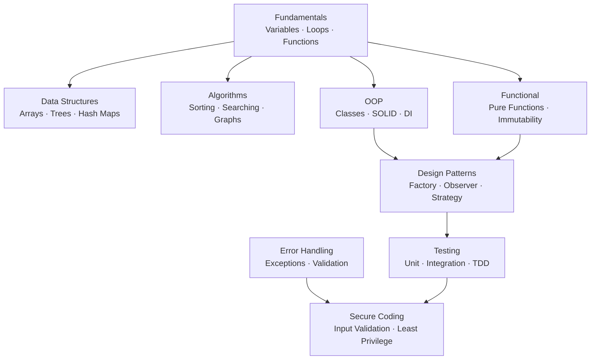

import { Aside, Card, CardGrid } from '@astrojs/starlight/components';

This section covers the foundational concepts behind writing software — from variables and loops through to design patterns, testing strategies, and secure coding practices.

## What's Covered

| Section | Topics |
|---|---|
| [Fundamentals](/programming/fundamentals) | Variables, loops, functions, refactoring |
| [Data Structures](/programming/data-structures) | Arrays, linked lists, trees, graphs, hash maps |
| [Algorithms](/programming/algorithms) | Big O, sorting, searching, graph traversal |
| [Object-Oriented Programming](/programming/oop) | Classes, SOLID, inheritance, dependency injection |
| [Functional Programming](/programming/functional) | Pure functions, immutability, higher-order functions |
| [Design Patterns](/programming/design-patterns) | Creational, structural, and behavioural patterns |
| [Testing](/programming/testing) | Unit tests, integration tests, TDD, mocking |
| [Error Handling](/programming/error-handling) | Exceptions, error types, defensive programming |
| [Secure Coding](/programming/secure-coding) | Input validation, injection prevention, least privilege |

## Concept Map

## Learning Path

| Stage | Topics | Files |
|---|---|---|
| **Core** | Variables, control flow, functions | Fundamentals |
| **Data** | How data is stored and organised | Data Structures → Algorithms |
| **Paradigms** | How to structure programs | OOP → Functional Programming |
| **Architecture** | Recurring solutions to common problems | Design Patterns |
| **Quality** | Verifying and hardening code | Testing → Error Handling → Secure Coding |

## Quick Navigation

| I want to… | Go to |
|---|---|
| Understand variables and scope | [Fundamentals](/programming/fundamentals) |
| Know when to use a hash map vs a tree | [Data Structures](/programming/data-structures) |
| Understand Big O notation | [Algorithms](/programming/algorithms) |
| Apply SOLID principles | [OOP](/programming/oop) |
| Write unit and integration tests | [Testing](/programming/testing) |
| Prevent SQL injection and XSS | [Secure Coding](/programming/secure-coding) |

## Related Sections

- [Security / OWASP Top 10](/security/web/owasp-top-10) — real-world exploits that stem from insecure code
- [Security / Input Validation](/security/api/input-validation) — sanitising data at system boundaries
- [Auth / Implementation](/auth/implementation/auth-in-code) — putting auth concepts into code
