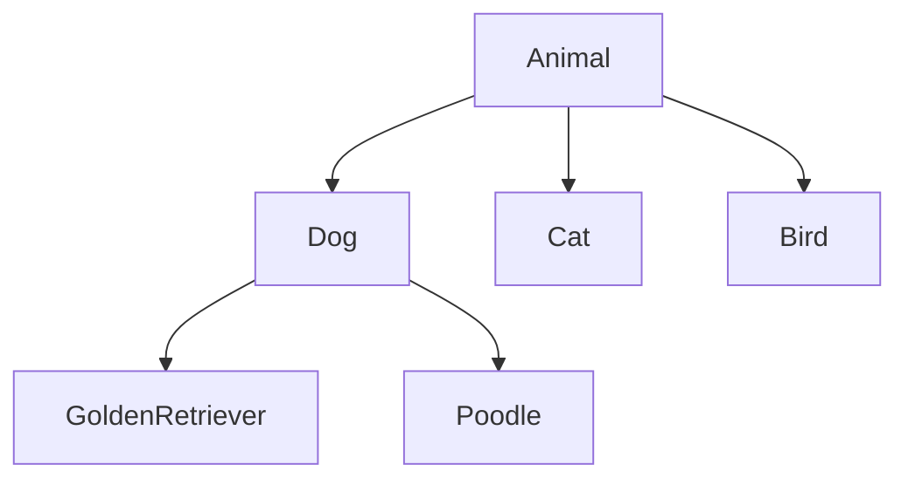
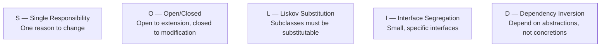

**Object-Oriented Programming (OOP)** organises code around **objects** — data (fields) bundled together with the behaviour that operates on that data (methods). The goal is to model real-world entities in a way that is modular, reusable, and easy to change.

---

## The Four Pillars

### 1. Encapsulation

Bundle data and the methods that operate on it together, and hide internal state from the outside. The outside world interacts through a controlled **public interface**.

```python
class BankAccount:
    def __init__(self, owner: str, balance: float = 0):
        self._owner   = owner
        self._balance = balance   # _prefix = private by convention

    def deposit(self, amount: float) -> None:
        if amount <= 0:
            raise ValueError("Deposit must be positive")
        self._balance += amount

    def withdraw(self, amount: float) -> None:
        if amount > self._balance:
            raise ValueError("Insufficient funds")
        self._balance -= amount

    @property
    def balance(self) -> float:
        return self._balance    # read-only — can't set balance directly

account = BankAccount("Alice", 100)
account.deposit(50)
print(account.balance)   # 150
# account._balance = 9999  # possible in Python, but violates the contract
```

**Why it matters:** Internal implementation can change (e.g. switching from a float to Decimal) without breaking callers. State changes always go through validated methods.

### 2. Inheritance

A **subclass** derives from a **superclass**, inheriting its interface and implementation, then specialises or extends it.

```python
class Animal:
    def __init__(self, name: str):
        self.name = name

    def speak(self) -> str:
        raise NotImplementedError

    def describe(self) -> str:
        return f"{self.name} says: {self.speak()}"

class Dog(Animal):
    def speak(self) -> str:
        return "Woof!"

class Cat(Animal):
    def speak(self) -> str:
        return "Meow!"

animals = [Dog("Rex"), Cat("Whiskers")]
for a in animals:
    print(a.describe())
# Rex says: Woof!
# Whiskers says: Meow!
```

**Inheritance hierarchy:**



**Pitfalls:**
- Deep hierarchies become fragile — a change to the base class can break all subclasses
- Prefer **composition over inheritance** when the relationship is "has a" rather than "is a"

### 3. Polymorphism

The ability to treat objects of different types through a common interface. Code written against the interface works with any conforming class — including classes written in the future.

```python
# All of these are Animals — the caller doesn't need to know which
def make_noise(animals: list[Animal]) -> None:
    for animal in animals:
        print(animal.speak())   # dispatches to the correct subclass at runtime

make_noise([Dog("Rex"), Cat("Whiskers"), Dog("Buddy")])
```

**Two forms:**
- **Runtime (dynamic) polymorphism** — method dispatch determined at runtime (above example)
- **Compile-time (static) polymorphism** — method overloading, generics/templates

### 4. Abstraction

Hide complexity behind a simplified interface. Users don't need to know *how* something works, only *what* it does.

```python
from abc import ABC, abstractmethod

class PaymentProcessor(ABC):
    @abstractmethod
    def charge(self, amount: float, currency: str) -> str:
        """Returns a transaction ID."""
        ...

class StripeProcessor(PaymentProcessor):
    def charge(self, amount: float, currency: str) -> str:
        # stripe SDK calls, error handling, retries...
        return "stripe_txn_abc123"

class PayPalProcessor(PaymentProcessor):
    def charge(self, amount: float, currency: str) -> str:
        # paypal SDK calls...
        return "paypal_txn_xyz789"

def checkout(processor: PaymentProcessor, total: float) -> None:
    txn_id = processor.charge(total, "GBP")
    print(f"Payment complete: {txn_id}")
```

---

## Classes in Detail

### Constructor and Instance Variables

```python
class Point:
    def __init__(self, x: float, y: float):
        self.x = x   # instance variable — unique to each object
        self.y = y

    def distance_to(self, other: "Point") -> float:
        return ((self.x - other.x)**2 + (self.y - other.y)**2) ** 0.5

    def __repr__(self) -> str:
        return f"Point({self.x}, {self.y})"

p1 = Point(0, 0)
p2 = Point(3, 4)
p1.distance_to(p2)   # 5.0
```

### Class Variables vs Instance Variables

```python
class Counter:
    count = 0          # class variable — shared by all instances

    def __init__(self):
        Counter.count += 1
        self.id = Counter.count    # instance variable — unique per object

a = Counter()   # Counter.count = 1
b = Counter()   # Counter.count = 2
print(a.id, b.id)   # 1 2
```

### Static and Class Methods

```python
class Temperature:
    def __init__(self, celsius: float):
        self.celsius = celsius

    @classmethod
    def from_fahrenheit(cls, f: float) -> "Temperature":
        return cls((f - 32) * 5 / 9)   # alternative constructor

    @staticmethod
    def is_freezing(celsius: float) -> bool:
        return celsius <= 0             # utility — no access to self or cls

t = Temperature.from_fahrenheit(212)
Temperature.is_freezing(-5)   # True
```

---

## SOLID Principles

SOLID is five design principles that make object-oriented code easier to maintain, extend, and test.



### S — Single Responsibility Principle

> A class should have one, and only one, reason to change.

Every class should do one thing. When two responsibilities are coupled, a change to one risks breaking the other.

```python
# VIOLATION — one class handles data + validation + persistence + formatting
class User:
    def __init__(self, name, email):
        self.name  = name
        self.email = email

    def validate(self):        # validation responsibility
        if "@" not in self.email:
            raise ValueError("Invalid email")

    def save(self):            # persistence responsibility
        db.insert("users", {"name": self.name, "email": self.email})

    def to_json(self):         # serialisation responsibility
        return json.dumps({"name": self.name, "email": self.email})


# BETTER — each concern has its own home
class User:
    def __init__(self, name: str, email: str):
        self.name  = name
        self.email = email

class UserValidator:
    def validate(self, user: User) -> None:
        if "@" not in user.email:
            raise ValueError("Invalid email")

class UserRepository:
    def save(self, user: User) -> None:
        db.insert("users", {"name": user.name, "email": user.email})

class UserSerializer:
    def to_json(self, user: User) -> str:
        return json.dumps({"name": user.name, "email": user.email})
```

### O — Open/Closed Principle

> Software entities should be open for extension, but closed for modification.

Add new behaviour by adding new code (new classes/functions), not by modifying existing, tested code.

```python
# VIOLATION — adding a new discount type requires modifying this function
def apply_discount(order, discount_type):
    if discount_type == "percentage":
        order.total *= 0.9
    elif discount_type == "fixed":
        order.total -= 10
    # Adding "bogo" means editing this function ← risky

# BETTER — each discount is its own class; adding new types never touches existing code
from abc import ABC, abstractmethod

class Discount(ABC):
    @abstractmethod
    def apply(self, total: float) -> float: ...

class PercentageDiscount(Discount):
    def __init__(self, pct: float): self.pct = pct
    def apply(self, total: float) -> float: return total * (1 - self.pct)

class FixedDiscount(Discount):
    def __init__(self, amount: float): self.amount = amount
    def apply(self, total: float) -> float: return total - self.amount

class BuyOneGetOne(Discount):
    def apply(self, total: float) -> float: return total / 2

def apply_discount(order, discount: Discount) -> None:
    order.total = discount.apply(order.total)
```

### L — Liskov Substitution Principle

> Subtypes must be substitutable for their base types without altering correctness.

If `S` is a subclass of `T`, then objects of type `T` should be replaceable with objects of type `S` without breaking the program. Violated when a subclass weakens preconditions, strengthens postconditions, or raises exceptions the base class doesn't.

```python
# VIOLATION — Square is a Rectangle, but substituting one breaks the contract
class Rectangle:
    def __init__(self, w, h):
        self.width  = w
        self.height = h

    def area(self):
        return self.width * self.height

class Square(Rectangle):
    def __init__(self, side):
        super().__init__(side, side)

    @Rectangle.width.setter
    def width(self, val):        # setting width also changes height — surprise!
        self._width = self._height = val

# Code that worked for Rectangle now produces wrong results for Square
rect = Square(5)
rect.width = 10    # caller expects height to stay 5
rect.area()        # 100, not 50 as expected for a 10×5 "rectangle"

# BETTER — don't force the hierarchy; use separate, independent classes
class Shape(ABC):
    @abstractmethod
    def area(self) -> float: ...

class Rectangle(Shape):
    def __init__(self, w, h): self.w = w; self.h = h
    def area(self): return self.w * self.h

class Square(Shape):
    def __init__(self, side): self.side = side
    def area(self): return self.side ** 2
```

### I — Interface Segregation Principle

> Clients should not be forced to depend on interfaces they do not use.

Split large interfaces into smaller, more specific ones. Implementing classes only fulfil the interfaces that are relevant to them.

```python
# VIOLATION — everything that "reads" must also implement "write" and "delete"
class DataStore(ABC):
    @abstractmethod
    def read(self, key): ...
    @abstractmethod
    def write(self, key, val): ...
    @abstractmethod
    def delete(self, key): ...

class ReadOnlyCache(DataStore):
    def read(self, key): return cache[key]
    def write(self, key, val): raise NotImplementedError  # forced to implement something it can't do
    def delete(self, key):     raise NotImplementedError

# BETTER — split into focused interfaces
class Readable(ABC):
    @abstractmethod
    def read(self, key): ...

class Writable(ABC):
    @abstractmethod
    def write(self, key, val): ...

class Deletable(ABC):
    @abstractmethod
    def delete(self, key): ...

class ReadOnlyCache(Readable):
    def read(self, key): return cache[key]

class FullStore(Readable, Writable, Deletable):
    def read(self, key): ...
    def write(self, key, val): ...
    def delete(self, key): ...
```

### D — Dependency Inversion Principle

> High-level modules should not depend on low-level modules. Both should depend on abstractions.

High-level business logic should not be coupled to concrete implementations (databases, email services, external APIs). Both should depend on an interface.

```python
# VIOLATION — OrderProcessor is tightly coupled to MySQLDatabase
class MySQLDatabase:
    def save_order(self, order): ...

class OrderProcessor:
    def __init__(self):
        self.db = MySQLDatabase()   # hard-coded dependency ← can't test without MySQL

    def process(self, order):
        self.db.save_order(order)

# BETTER — depend on an abstraction; inject the concrete at construction time
class OrderRepository(ABC):
    @abstractmethod
    def save(self, order): ...

class MySQLOrderRepository(OrderRepository):
    def save(self, order): ...   # MySQL implementation

class InMemoryOrderRepository(OrderRepository):
    def __init__(self): self.orders = []
    def save(self, order): self.orders.append(order)  # test double

class OrderProcessor:
    def __init__(self, repo: OrderRepository):
        self.repo = repo   # injected — no hard-coded dependency

    def process(self, order):
        self.repo.save(order)

# Production
processor = OrderProcessor(MySQLOrderRepository())

# Test — no database needed
processor = OrderProcessor(InMemoryOrderRepository())
```

---

## Dependency Injection

**Dependency Injection (DI)** is a technique where an object's dependencies are provided from the outside rather than created internally. It is the mechanism that makes the Dependency Inversion Principle practical.

### The Problem Without DI

```python
class NotificationService:
    def __init__(self):
        self.emailer = SmtpEmailer()   # creates its own dependency
        self.logger  = FileLogger()    # tightly coupled, hard to replace

    def notify(self, user, message):
        self.logger.log(f"Notifying {user.email}")
        self.emailer.send(user.email, message)
```

Problems:
- Cannot test `NotificationService` without sending real emails
- Swapping to a different email provider means editing `NotificationService`
- Cannot parallelise or mock individual pieces

### Constructor Injection

The most common form — dependencies are passed through the constructor.

```python
class NotificationService:
    def __init__(self, emailer: Emailer, logger: Logger):
        self.emailer = emailer
        self.logger  = logger

    def notify(self, user, message):
        self.logger.log(f"Notifying {user.email}")
        self.emailer.send(user.email, message)

# Production
service = NotificationService(SmtpEmailer(), FileLogger())

# Test — fully controllable fakes
class FakeEmailer(Emailer):
    def __init__(self): self.sent = []
    def send(self, to, msg): self.sent.append((to, msg))

class FakeLogger(Logger):
    def log(self, msg): pass

service = NotificationService(FakeEmailer(), FakeLogger())
service.notify(user, "Welcome!")
assert service.emailer.sent == [(user.email, "Welcome!")]
```

### Other Injection Forms

```python
# Method injection — dependency passed per call
def send_report(report, emailer: Emailer):
    emailer.send("cto@company.com", report.render())

# Property injection — set after construction (use sparingly)
service = NotificationService.__new__(NotificationService)
service.emailer = SmtpEmailer()
```

### DI Containers

In large applications, wiring up the entire dependency graph manually is tedious. A **DI container** (or IoC container) does it automatically based on type hints or configuration.

```python
# Python — using dependency-injector library
from dependency_injector import containers, providers

class Container(containers.DeclarativeContainer):
    config    = providers.Configuration()
    logger    = providers.Singleton(FileLogger, path=config.log_path)
    emailer   = providers.Factory(SmtpEmailer, host=config.smtp_host)
    notifier  = providers.Factory(NotificationService, emailer=emailer, logger=logger)

container = Container()
container.config.from_yaml("config.yml")
service = container.notifier()   # all dependencies resolved automatically
```

---

## Composition vs Inheritance

Prefer **composition** ("has a") over inheritance ("is a") when a class needs the behaviour of another class but is not a specialisation of it.

```python
# Inheritance — Employee "is a" Person (fine)
class Person:
    def __init__(self, name): self.name = name

class Employee(Person):
    def __init__(self, name, role):
        super().__init__(name)
        self.role = role

# Composition — Car "has an" Engine, not "is an" Engine (correct)
class Engine:
    def start(self): print("Vroom")
    def stop(self):  print("Off")

class Car:
    def __init__(self):
        self.engine = Engine()   # composed in

    def drive(self):
        self.engine.start()

    def park(self):
        self.engine.stop()
```

Composition is more flexible — you can swap the `Engine` implementation at runtime or in tests without changing `Car`.

---

## Quick Reference

| Concept | One line |
|---|---|
| Encapsulation | Bundle data + behaviour; hide internals |
| Inheritance | Subclass extends or specialises a superclass |
| Polymorphism | Common interface, different runtime behaviour |
| Abstraction | Expose what, hide how |
| SRP | One class, one reason to change |
| OCP | Extend by adding, not by modifying |
| LSP | Subclasses must behave like their base type |
| ISP | Small focused interfaces over one large one |
| DIP | Depend on abstractions, inject concretions |
| DI | Pass dependencies in; don't instantiate them inside |

---

## Related

- [Design Patterns](/programming/design-patterns) — OOP patterns that apply these principles in recurring scenarios
- [Testing](/programming/testing) — DI makes unit testing possible without real infrastructure
- [Functional Programming](/programming/functional) — an alternative paradigm that avoids shared mutable state by design
- [Algorithms](/programming/algorithms) — encapsulating algorithms within well-designed OOP structures
