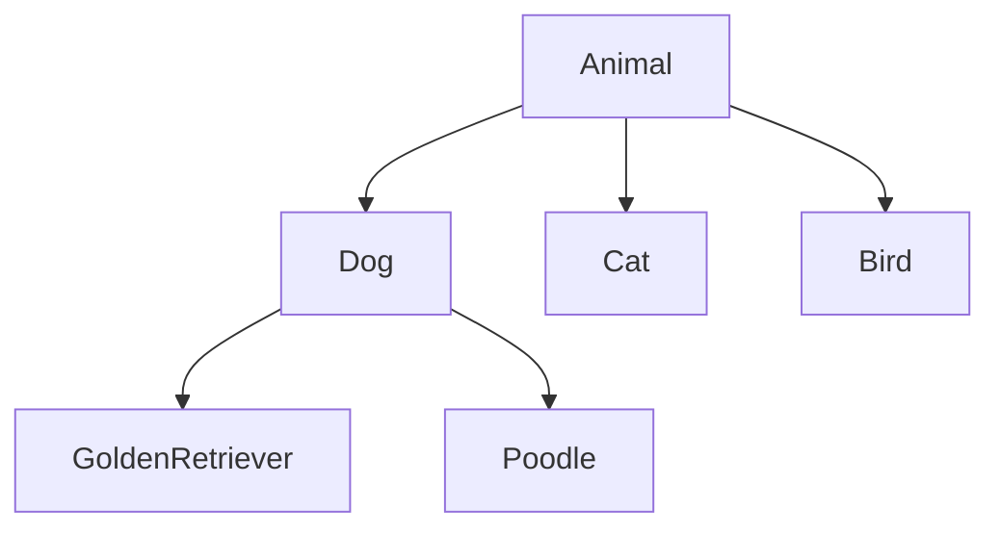
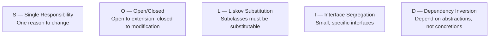

import { Tabs, TabItem } from '@astrojs/starlight/components';
import { Aside, Card, CardGrid, Steps, Badge } from '@astrojs/starlight/components';

**Object-Oriented Programming (OOP)** organises code around **objects** — data (fields) bundled together with the behaviour that operates on that data (methods). The goal is to model real-world entities in a way that is modular, reusable, and easy to change.

---

## The Four Pillars

### 1. Encapsulation

Bundle data and the methods that operate on it together, and hide internal state from the outside. The outside world interacts through a controlled **public interface**.

<Tabs>
<TabItem label="Python">
```python
class BankAccount:
    def __init__(self, owner: str, balance: float = 0):
        self._owner   = owner
        self._balance = balance   # _prefix = private by convention

    def deposit(self, amount: float) -> None:
        if amount <= 0:
            raise ValueError("Deposit must be positive")
        self._balance += amount

    def withdraw(self, amount: float) -> None:
        if amount > self._balance:
            raise ValueError("Insufficient funds")
        self._balance -= amount

    @property
    def balance(self) -> float:
        return self._balance    # read-only — can't set balance directly

account = BankAccount("Alice", 100)
account.deposit(50)
print(account.balance)   # 150
```
</TabItem>
<TabItem label="JavaScript">
```javascript
class BankAccount {
  #owner;     // private field (ES2022)
  #balance;

  constructor(owner, balance = 0) {
    this.#owner   = owner;
    this.#balance = balance;
  }

  deposit(amount) {
    if (amount <= 0) throw new Error("Deposit must be positive");
    this.#balance += amount;
  }

  withdraw(amount) {
    if (amount > this.#balance) throw new Error("Insufficient funds");
    this.#balance -= amount;
  }

  get balance() { return this.#balance; }  // read-only getter
}

const account = new BankAccount("Alice", 100);
account.deposit(50);
console.log(account.balance);  // 150
// account.#balance = 9999;    // SyntaxError — truly private
```
</TabItem>
<TabItem label="C#">
```csharp
public class BankAccount {
    private readonly string _owner;
    private decimal _balance;

    public BankAccount(string owner, decimal balance = 0) {
        _owner   = owner;
        _balance = balance;
    }

    public void Deposit(decimal amount) {
        if (amount <= 0) throw new ArgumentException("Deposit must be positive");
        _balance += amount;
    }

    public void Withdraw(decimal amount) {
        if (amount > _balance) throw new InvalidOperationException("Insufficient funds");
        _balance -= amount;
    }

    public decimal Balance => _balance;  // read-only property
}

var account = new BankAccount("Alice", 100);
account.Deposit(50);
Console.WriteLine(account.Balance);   // 150
```
</TabItem>
<TabItem label="Java">
```java
public class BankAccount {
    private final String owner;
    private double balance;

    public BankAccount(String owner, double balance) {
        this.owner   = owner;
        this.balance = balance;
    }
    public BankAccount(String owner) { this(owner, 0); }

    public void deposit(double amount) {
        if (amount <= 0) throw new IllegalArgumentException("Deposit must be positive");
        balance += amount;
    }

    public void withdraw(double amount) {
        if (amount > balance) throw new IllegalStateException("Insufficient funds");
        balance -= amount;
    }

    public double getBalance() { return balance; }  // read-only getter
}

BankAccount account = new BankAccount("Alice", 100);
account.deposit(50);
System.out.println(account.getBalance());   // 150.0
```
</TabItem>
</Tabs>

**Why it matters:** Internal implementation can change (e.g. switching from a float to Decimal) without breaking callers. State changes always go through validated methods.

### 2. Inheritance

A **subclass** derives from a **superclass**, inheriting its interface and implementation, then specialises or extends it.

<Tabs>
<TabItem label="Python">
```python
class Animal:
    def __init__(self, name: str):
        self.name = name

    def speak(self) -> str:
        raise NotImplementedError

    def describe(self) -> str:
        return f"{self.name} says: {self.speak()}"

class Dog(Animal):
    def speak(self) -> str:
        return "Woof!"

class Cat(Animal):
    def speak(self) -> str:
        return "Meow!"

animals = [Dog("Rex"), Cat("Whiskers")]
for a in animals:
    print(a.describe())
# Rex says: Woof!
# Whiskers says: Meow!
```
</TabItem>
<TabItem label="JavaScript">
```javascript
class Animal {
  constructor(name) { this.name = name; }
  speak() { throw new Error("speak() must be implemented"); }
  describe() { return `${this.name} says: ${this.speak()}`; }
}

class Dog extends Animal {
  speak() { return "Woof!"; }
}

class Cat extends Animal {
  speak() { return "Meow!"; }
}

const animals = [new Dog("Rex"), new Cat("Whiskers")];
for (const a of animals) console.log(a.describe());
// Rex says: Woof!
// Whiskers says: Meow!
```
</TabItem>
<TabItem label="C#">
```csharp
public abstract class Animal {
    public string Name { get; }
    protected Animal(string name) { Name = name; }
    public abstract string Speak();
    public string Describe() => $"{Name} says: {Speak()}";
}

public class Dog : Animal {
    public Dog(string name) : base(name) {}
    public override string Speak() => "Woof!";
}

public class Cat : Animal {
    public Cat(string name) : base(name) {}
    public override string Speak() => "Meow!";
}

Animal[] animals = { new Dog("Rex"), new Cat("Whiskers") };
foreach (var a in animals) Console.WriteLine(a.Describe());
```
</TabItem>
<TabItem label="Java">
```java
public abstract class Animal {
    protected String name;
    public Animal(String name) { this.name = name; }
    public abstract String speak();
    public String describe() { return name + " says: " + speak(); }
}

public class Dog extends Animal {
    public Dog(String name) { super(name); }
    @Override public String speak() { return "Woof!"; }
}

public class Cat extends Animal {
    public Cat(String name) { super(name); }
    @Override public String speak() { return "Meow!"; }
}

List<Animal> animals = List.of(new Dog("Rex"), new Cat("Whiskers"));
for (Animal a : animals) System.out.println(a.describe());
```
</TabItem>
</Tabs>

**Inheritance hierarchy:**



<Aside type="caution">
Deep hierarchies become fragile — a change to the base class can break all subclasses. Prefer **composition over inheritance** when the relationship is "has a" rather than "is a".
</Aside>

### 3. Polymorphism

The ability to treat objects of different types through a common interface. Code written against the interface works with any conforming class — including classes written in the future.

<Tabs>
<TabItem label="Python">
```python
# All of these are Animals — the caller doesn't need to know which
def make_noise(animals: list[Animal]) -> None:
    for animal in animals:
        print(animal.speak())   # dispatches to the correct subclass at runtime

make_noise([Dog("Rex"), Cat("Whiskers"), Dog("Buddy")])
```
</TabItem>
<TabItem label="JavaScript">
```javascript
function makeNoise(animals) {
  for (const animal of animals)
    console.log(animal.speak());  // dispatches to the correct class at runtime
}

makeNoise([new Dog("Rex"), new Cat("Whiskers"), new Dog("Buddy")]);
```
</TabItem>
<TabItem label="C#">
```csharp
static void MakeNoise(IEnumerable<Animal> animals) {
    foreach (var animal in animals)
        Console.WriteLine(animal.Speak());
}

MakeNoise(new Animal[] { new Dog("Rex"), new Cat("Whiskers"), new Dog("Buddy") });
```
</TabItem>
<TabItem label="Java">
```java
static void makeNoise(List<Animal> animals) {
    for (Animal animal : animals)
        System.out.println(animal.speak());
}

makeNoise(List.of(new Dog("Rex"), new Cat("Whiskers"), new Dog("Buddy")));
```
</TabItem>
</Tabs>

**Two forms:**
- **Runtime (dynamic) polymorphism** — method dispatch determined at runtime (above example)
- **Compile-time (static) polymorphism** — method overloading, generics/templates

### 4. Abstraction

Hide complexity behind a simplified interface. Users don't need to know *how* something works, only *what* it does.

<Tabs>
<TabItem label="Python">
```python
from abc import ABC, abstractmethod

class PaymentProcessor(ABC):
    @abstractmethod
    def charge(self, amount: float, currency: str) -> str:
        """Returns a transaction ID."""
        ...

class StripeProcessor(PaymentProcessor):
    def charge(self, amount: float, currency: str) -> str:
        # stripe SDK calls, error handling, retries...
        return "stripe_txn_abc123"

class PayPalProcessor(PaymentProcessor):
    def charge(self, amount: float, currency: str) -> str:
        return "paypal_txn_xyz789"

def checkout(processor: PaymentProcessor, total: float) -> None:
    txn_id = processor.charge(total, "GBP")
    print(f"Payment complete: {txn_id}")
```
</TabItem>
<TabItem label="JavaScript">
```javascript
// JavaScript uses duck typing — simulate abstract with a throwing base class
class PaymentProcessor {
  charge(amount, currency) { throw new Error("charge() must be implemented"); }
}

class StripeProcessor extends PaymentProcessor {
  charge(amount, currency) {
    // Stripe SDK calls, error handling, retries...
    return "stripe_txn_abc123";
  }
}

class PayPalProcessor extends PaymentProcessor {
  charge(amount, currency) { return "paypal_txn_xyz789"; }
}

function checkout(processor, total) {
  const txnId = processor.charge(total, "GBP");
  console.log(`Payment complete: ${txnId}`);
}
```
</TabItem>
<TabItem label="C#">
```csharp
public interface IPaymentProcessor {
    string Charge(decimal amount, string currency);
}

public class StripeProcessor : IPaymentProcessor {
    public string Charge(decimal amount, string currency) {
        // Stripe SDK calls...
        return "stripe_txn_abc123";
    }
}

public class PayPalProcessor : IPaymentProcessor {
    public string Charge(decimal amount, string currency) => "paypal_txn_xyz789";
}

void Checkout(IPaymentProcessor processor, decimal total) {
    var txnId = processor.Charge(total, "GBP");
    Console.WriteLine($"Payment complete: {txnId}");
}
```
</TabItem>
<TabItem label="Java">
```java
public interface PaymentProcessor {
    String charge(double amount, String currency);
}

public class StripeProcessor implements PaymentProcessor {
    @Override
    public String charge(double amount, String currency) {
        // Stripe SDK calls...
        return "stripe_txn_abc123";
    }
}

public class PayPalProcessor implements PaymentProcessor {
    @Override
    public String charge(double amount, String currency) { return "paypal_txn_xyz789"; }
}

void checkout(PaymentProcessor processor, double total) {
    String txnId = processor.charge(total, "GBP");
    System.out.println("Payment complete: " + txnId);
}
```
</TabItem>
</Tabs>

---

## Classes in Detail

### Constructor and Instance Variables

A constructor initialises the object's state when it is created. Instance variables belong to a specific object — each object gets its own copy.

<Tabs>
<TabItem label="Python">
```python
class Point:
    def __init__(self, x: float, y: float):
        self.x = x   # instance variable — unique to each object
        self.y = y

    def distance_to(self, other: "Point") -> float:
        return ((self.x - other.x)**2 + (self.y - other.y)**2) ** 0.5

    def __repr__(self) -> str:
        return f"Point({self.x}, {self.y})"

p1 = Point(0, 0)
p2 = Point(3, 4)
p1.distance_to(p2)   # 5.0
```
</TabItem>
<TabItem label="JavaScript">
```javascript
class Point {
  constructor(x, y) {
    this.x = x;
    this.y = y;
  }

  distanceTo(other) {
    return Math.hypot(this.x - other.x, this.y - other.y);
  }

  toString() { return `Point(${this.x}, ${this.y})`; }
}

const p1 = new Point(0, 0);
const p2 = new Point(3, 4);
p1.distanceTo(p2);  // 5
```
</TabItem>
<TabItem label="C#">
```csharp
public class Point {
    public double X { get; }
    public double Y { get; }

    public Point(double x, double y) { X = x; Y = y; }

    public double DistanceTo(Point other) =>
        Math.Sqrt(Math.Pow(X - other.X, 2) + Math.Pow(Y - other.Y, 2));

    public override string ToString() => $"Point({X}, {Y})";
}

var p1 = new Point(0, 0);
var p2 = new Point(3, 4);
p1.DistanceTo(p2);  // 5.0
```
</TabItem>
<TabItem label="Java">
```java
public class Point {
    public final double x, y;
    public Point(double x, double y) { this.x = x; this.y = y; }

    public double distanceTo(Point other) {
        return Math.hypot(x - other.x, y - other.y);
    }

    @Override public String toString() { return "Point(" + x + ", " + y + ")"; }
}

Point p1 = new Point(0, 0);
Point p2 = new Point(3, 4);
p1.distanceTo(p2);   // 5.0
```
</TabItem>
</Tabs>

### Class Variables vs Instance Variables

Class (static) variables are shared by all instances. Instance variables are unique per object.

<Tabs>
<TabItem label="Python">
```python
class Counter:
    count = 0          # class variable — shared by all instances

    def __init__(self):
        Counter.count += 1
        self.id = Counter.count    # instance variable — unique per object

a = Counter()   # Counter.count = 1
b = Counter()   # Counter.count = 2
print(a.id, b.id)   # 1 2
```
</TabItem>
<TabItem label="JavaScript">
```javascript
class Counter {
  static count = 0;  // class (static) variable — shared by all instances

  constructor() {
    Counter.count++;
    this.id = Counter.count;  // instance variable — unique per object
  }
}

const a = new Counter();  // Counter.count = 1
const b = new Counter();  // Counter.count = 2
console.log(a.id, b.id);  // 1 2
```
</TabItem>
<TabItem label="C#">
```csharp
public class Counter {
    private static int count = 0;  // static field — shared by all instances

    public int Id { get; }

    public Counter() {
        count++;
        Id = count;  // instance variable — unique per object
    }
}

var a = new Counter();  // count = 1
var b = new Counter();  // count = 2
Console.WriteLine($"{a.Id} {b.Id}");  // 1 2
```
</TabItem>
<TabItem label="Java">
```java
public class Counter {
    private static int count = 0;  // class variable — shared by all instances

    public final int id;

    public Counter() { id = ++count; }  // instance variable — unique per object
}

Counter a = new Counter();  // count = 1
Counter b = new Counter();  // count = 2
System.out.println(a.id + " " + b.id);  // 1 2
```
</TabItem>
</Tabs>

### Static and Class Methods

Static methods are utility functions that don't need access to instance state. Class methods (Python) or static factory methods are used to create instances from alternative inputs.

<Tabs>
<TabItem label="Python">
```python
class Temperature:
    def __init__(self, celsius: float):
        self.celsius = celsius

    @classmethod
    def from_fahrenheit(cls, f: float) -> "Temperature":
        return cls((f - 32) * 5 / 9)   # alternative constructor

    @staticmethod
    def is_freezing(celsius: float) -> bool:
        return celsius <= 0             # utility — no access to self or cls

t = Temperature.from_fahrenheit(212)
Temperature.is_freezing(-5)   # True
```
</TabItem>
<TabItem label="JavaScript">
```javascript
class Temperature {
  constructor(celsius) { this.celsius = celsius; }

  static fromFahrenheit(f) {
    return new Temperature((f - 32) * 5 / 9);  // static factory method
  }

  static isFreezing(celsius) { return celsius <= 0; }
}

const t = Temperature.fromFahrenheit(212);
Temperature.isFreezing(-5);  // true
```
</TabItem>
<TabItem label="C#">
```csharp
public class Temperature {
    public double Celsius { get; }
    private Temperature(double celsius) { Celsius = celsius; }

    public static Temperature FromFahrenheit(double f) =>
        new Temperature((f - 32) * 5.0 / 9.0);  // static factory

    public static bool IsFreezing(double celsius) => celsius <= 0;
}

var t = Temperature.FromFahrenheit(212);
Temperature.IsFreezing(-5);  // true
```
</TabItem>
<TabItem label="Java">
```java
public class Temperature {
    private final double celsius;
    private Temperature(double celsius) { this.celsius = celsius; }

    public static Temperature fromFahrenheit(double f) {
        return new Temperature((f - 32) * 5.0 / 9.0);  // static factory
    }

    public static boolean isFreezing(double celsius) { return celsius <= 0; }

    public double getCelsius() { return celsius; }
}

Temperature t = Temperature.fromFahrenheit(212);
Temperature.isFreezing(-5);  // true
```
</TabItem>
</Tabs>

---

## SOLID Principles

SOLID is five design principles that make object-oriented code easier to maintain, extend, and test.



### S — Single Responsibility Principle

> A class should have one, and only one, reason to change.

Every class should do one thing. When two responsibilities are coupled, a change to one risks breaking the other.

<Tabs>
<TabItem label="Python">
```python
# VIOLATION — one class handles data + validation + persistence + formatting
class User:
    def __init__(self, name, email):
        self.name  = name
        self.email = email
    def validate(self):
        if "@" not in self.email:
            raise ValueError("Invalid email")
    def save(self):
        db.insert("users", {"name": self.name, "email": self.email})
    def to_json(self):
        return json.dumps({"name": self.name, "email": self.email})

# BETTER — each concern has its own home
class User:
    def __init__(self, name: str, email: str):
        self.name  = name
        self.email = email

class UserValidator:
    def validate(self, user: User) -> None:
        if "@" not in user.email:
            raise ValueError("Invalid email")

class UserRepository:
    def save(self, user: User) -> None:
        db.insert("users", {"name": user.name, "email": user.email})

class UserSerializer:
    def to_json(self, user: User) -> str:
        return json.dumps({"name": user.name, "email": user.email})
```
</TabItem>
<TabItem label="JavaScript">
```javascript
// VIOLATION — one class handles everything
class User {
  constructor(name, email) { this.name = name; this.email = email; }
  validate() { if (!this.email.includes("@")) throw new Error("Invalid email"); }
  save()     { db.insert("users", { name: this.name, email: this.email }); }
  toJson()   { return JSON.stringify({ name: this.name, email: this.email }); }
}

// BETTER — each concern has its own home
class User { constructor(name, email) { this.name = name; this.email = email; } }

class UserValidator {
  validate(user) { if (!user.email.includes("@")) throw new Error("Invalid email"); }
}
class UserRepository {
  save(user) { db.insert("users", { name: user.name, email: user.email }); }
}
class UserSerializer {
  toJson(user) { return JSON.stringify({ name: user.name, email: user.email }); }
}
```
</TabItem>
<TabItem label="C#">
```csharp
// VIOLATION
public class User {
    public string Name { get; set; }
    public string Email { get; set; }
    public void Validate() { if (!Email.Contains("@")) throw new Exception("Invalid email"); }
    public void Save()     { db.Insert("users", this); }
    public string ToJson() => JsonSerializer.Serialize(this);
}

// BETTER — each concern has its own home
public record User(string Name, string Email);

public class UserValidator {
    public void Validate(User u) {
        if (!u.Email.Contains("@")) throw new ArgumentException("Invalid email");
    }
}
public class UserRepository  { public void Save(User u) => db.Insert("users", u); }
public class UserSerializer  { public string ToJson(User u) => JsonSerializer.Serialize(u); }
```
</TabItem>
<TabItem label="Java">
```java
// VIOLATION
public class User {
    private String name, email;
    public User(String name, String email) { this.name = name; this.email = email; }
    public void validate() { if (!email.contains("@")) throw new IllegalArgumentException(); }
    public void save()     { db.insert("users", Map.of("name", name, "email", email)); }
    public String toJson() { return objectMapper.writeValueAsString(this); }
}

// BETTER — each concern has its own home
public record User(String name, String email) {}

public class UserValidator {
    public void validate(User u) {
        if (!u.email().contains("@")) throw new IllegalArgumentException("Invalid email");
    }
}
public class UserRepository { public void save(User u) { db.insert("users", u); } }
public class UserSerializer { public String toJson(User u) { return objectMapper.writeValueAsString(u); } }
```
</TabItem>
</Tabs>

### O — Open/Closed Principle

> Software entities should be open for extension, but closed for modification.

Add new behaviour by adding new code (new classes/functions), not by modifying existing, tested code.

<Tabs>
<TabItem label="Python">
```python
# VIOLATION — adding a new discount type requires modifying this function
def apply_discount(order, discount_type):
    if discount_type == "percentage":
        order.total *= 0.9
    elif discount_type == "fixed":
        order.total -= 10
    # Adding "bogo" means editing this function ← risky

# BETTER — each discount is its own class; adding new types never touches existing code
from abc import ABC, abstractmethod

class Discount(ABC):
    @abstractmethod
    def apply(self, total: float) -> float: ...

class PercentageDiscount(Discount):
    def __init__(self, pct: float): self.pct = pct
    def apply(self, total: float) -> float: return total * (1 - self.pct)

class FixedDiscount(Discount):
    def __init__(self, amount: float): self.amount = amount
    def apply(self, total: float) -> float: return total - self.amount

class BuyOneGetOne(Discount):
    def apply(self, total: float) -> float: return total / 2

def apply_discount(order, discount: Discount) -> None:
    order.total = discount.apply(order.total)
```
</TabItem>
<TabItem label="JavaScript">
```javascript
// VIOLATION
function applyDiscount(order, discountType) {
  if (discountType === "percentage") order.total *= 0.9;
  else if (discountType === "fixed") order.total -= 10;
}

// BETTER — each discount is its own class
class PercentageDiscount {
  constructor(pct) { this.pct = pct; }
  apply(total) { return total * (1 - this.pct); }
}
class FixedDiscount {
  constructor(amount) { this.amount = amount; }
  apply(total) { return total - this.amount; }
}
class BuyOneGetOne {
  apply(total) { return total / 2; }
}

function applyDiscount(order, discount) {
  order.total = discount.apply(order.total);
}
```
</TabItem>
<TabItem label="C#">
```csharp
// VIOLATION
void ApplyDiscount(Order order, string discountType) {
    if (discountType == "percentage") order.Total *= 0.9m;
    else if (discountType == "fixed") order.Total -= 10m;
}

// BETTER — each discount is its own class
public interface IDiscount { decimal Apply(decimal total); }

public class PercentageDiscount(decimal pct) : IDiscount {
    public decimal Apply(decimal total) => total * (1 - pct);
}
public class FixedDiscount(decimal amount) : IDiscount {
    public decimal Apply(decimal total) => total - amount;
}
public class BuyOneGetOne : IDiscount {
    public decimal Apply(decimal total) => total / 2;
}

void ApplyDiscount(Order order, IDiscount discount) =>
    order.Total = discount.Apply(order.Total);
```
</TabItem>
<TabItem label="Java">
```java
// VIOLATION
void applyDiscount(Order order, String discountType) {
    if ("percentage".equals(discountType)) order.setTotal(order.getTotal() * 0.9);
    else if ("fixed".equals(discountType)) order.setTotal(order.getTotal() - 10);
}

// BETTER — each discount is its own class
public interface Discount { double apply(double total); }

public class PercentageDiscount implements Discount {
    private final double pct;
    public PercentageDiscount(double pct) { this.pct = pct; }
    public double apply(double total) { return total * (1 - pct); }
}
public class FixedDiscount implements Discount {
    private final double amount;
    public FixedDiscount(double amount) { this.amount = amount; }
    public double apply(double total) { return total - amount; }
}
public class BuyOneGetOne implements Discount {
    public double apply(double total) { return total / 2; }
}

void applyDiscount(Order order, Discount discount) {
    order.setTotal(discount.apply(order.getTotal()));
}
```
</TabItem>
</Tabs>

### L — Liskov Substitution Principle

> Subtypes must be substitutable for their base types without altering correctness.

If `S` is a subclass of `T`, objects of type `T` should be replaceable with objects of type `S` without breaking the program. Violated when a subclass weakens preconditions, strengthens postconditions, or raises unexpected exceptions.

<Tabs>
<TabItem label="Python">
```python
# VIOLATION — Square is a Rectangle, but substituting one breaks the contract
class Rectangle:
    def __init__(self, w, h):
        self.width  = w
        self.height = h
    def area(self):
        return self.width * self.height

class Square(Rectangle):
    def __init__(self, side):
        super().__init__(side, side)
    @Rectangle.width.setter
    def width(self, val):
        self._width = self._height = val  # side effect — surprise!

rect = Square(5)
rect.width = 10   # caller expects height to stay 5
rect.area()       # 100, not 50 as expected

# BETTER — don't force the hierarchy; use separate classes with a shared interface
from abc import ABC, abstractmethod

class Shape(ABC):
    @abstractmethod
    def area(self) -> float: ...

class Rectangle(Shape):
    def __init__(self, w, h): self.w = w; self.h = h
    def area(self): return self.w * self.h

class Square(Shape):
    def __init__(self, side): self.side = side
    def area(self): return self.side ** 2
```
</TabItem>
<TabItem label="JavaScript">
```javascript
// VIOLATION
class Rectangle {
  constructor(w, h) { this.w = w; this.h = h; }
  area() { return this.w * this.h; }
}
class Square extends Rectangle {
  set w(val) { this._w = this._h = val; }  // setting w also changes h
  set h(val) { this._w = this._h = val; }
  get w() { return this._w; }
  get h() { return this._h; }
}
const rect = new Square(5);
rect.w = 10;    // also changes h — surprising!
rect.area();    // 100, not 50

// BETTER — separate classes with a shared duck-type interface
class Rectangle { constructor(w, h) { this.w = w; this.h = h; } area() { return this.w * this.h; } }
class Square    { constructor(s) { this.s = s; }               area() { return this.s ** 2; } }
```
</TabItem>
<TabItem label="C#">
```csharp
// VIOLATION
class Rectangle {
    public virtual double Width  { get; set; }
    public virtual double Height { get; set; }
    public double Area() => Width * Height;
}
class Square : Rectangle {
    public override double Width  { set { base.Width = base.Height = value; } }
    public override double Height { set { base.Width = base.Height = value; } }
}
var rect = new Square(); rect.Width = 5;
rect.Width = 10;  // also changes Height — surprising!
rect.Area();      // 100, not 50

// BETTER — use a common interface, not forced inheritance
interface IShape { double Area(); }
class Rectangle : IShape {
    public Rectangle(double w, double h) { W = w; H = h; }
    double W, H;
    public double Area() => W * H;
}
class Square : IShape {
    public Square(double side) { Side = side; }
    double Side;
    public double Area() => Side * Side;
}
```
</TabItem>
<TabItem label="Java">
```java
// VIOLATION
class Rectangle {
    protected double width, height;
    public Rectangle(double w, double h) { width = w; height = h; }
    public void setWidth(double w)  { width = w; }
    public void setHeight(double h) { height = h; }
    public double area() { return width * height; }
}
class Square extends Rectangle {
    public Square(double side) { super(side, side); }
    @Override public void setWidth(double w)  { width = height = w; }  // side effect
    @Override public void setHeight(double h) { width = height = h; }
}

// BETTER — use a common interface
interface Shape { double area(); }
class Rectangle implements Shape {
    Rectangle(double w, double h) { this.w = w; this.h = h; }
    double w, h;
    public double area() { return w * h; }
}
class Square implements Shape {
    Square(double side) { this.side = side; }
    double side;
    public double area() { return side * side; }
}
```
</TabItem>
</Tabs>

### I — Interface Segregation Principle

> Clients should not be forced to depend on interfaces they do not use.

Split large interfaces into smaller, more specific ones. Implementing classes only fulfil the interfaces relevant to them.

<Tabs>
<TabItem label="Python">
```python
# VIOLATION — everything that "reads" must also implement "write" and "delete"
class DataStore(ABC):
    @abstractmethod
    def read(self, key): ...
    @abstractmethod
    def write(self, key, val): ...
    @abstractmethod
    def delete(self, key): ...

class ReadOnlyCache(DataStore):
    def read(self, key): return cache[key]
    def write(self, key, val): raise NotImplementedError   # forced
    def delete(self, key):     raise NotImplementedError   # forced

# BETTER — split into focused interfaces
class Readable(ABC):
    @abstractmethod
    def read(self, key): ...

class Writable(ABC):
    @abstractmethod
    def write(self, key, val): ...

class Deletable(ABC):
    @abstractmethod
    def delete(self, key): ...

class ReadOnlyCache(Readable):
    def read(self, key): return cache[key]

class FullStore(Readable, Writable, Deletable):
    def read(self, key): ...
    def write(self, key, val): ...
    def delete(self, key): ...
```
</TabItem>
<TabItem label="JavaScript">
```javascript
// VIOLATION — ReadOnlyCache must implement write + delete it doesn't support
class DataStore {
  read(key)       { throw new Error("Not implemented"); }
  write(key, val) { throw new Error("Not implemented"); }
  delete(key)     { throw new Error("Not implemented"); }
}
class ReadOnlyCache extends DataStore {
  read(key)       { return cache[key]; }
  write()         { throw new Error("Not supported"); }   // forced
  delete()        { throw new Error("Not supported"); }   // forced
}

// BETTER — each class only exposes what it supports
class ReadOnlyCache {
  read(key) { return cache[key]; }
}
class FullStore {
  read(key)       { /* ... */ }
  write(key, val) { /* ... */ }
  delete(key)     { /* ... */ }
}
```
</TabItem>
<TabItem label="C#">
```csharp
// VIOLATION
interface IDataStore {
    object Read(string key);
    void Write(string key, object val);
    void Delete(string key);
}
class ReadOnlyCache : IDataStore {
    public object Read(string key) => cache[key];
    public void Write(string key, object val) => throw new NotSupportedException();
    public void Delete(string key) => throw new NotSupportedException();
}

// BETTER — split into focused interfaces
interface IReadable  { object Read(string key); }
interface IWritable  { void Write(string key, object val); }
interface IDeletable { void Delete(string key); }

class ReadOnlyCache : IReadable {
    public object Read(string key) => cache[key];
}
class FullStore : IReadable, IWritable, IDeletable {
    public object Read(string key)            { /* ... */ return null; }
    public void   Write(string key, object v) { /* ... */ }
    public void   Delete(string key)          { /* ... */ }
}
```
</TabItem>
<TabItem label="Java">
```java
// VIOLATION
interface DataStore {
    Object read(String key);
    void write(String key, Object val);
    void delete(String key);
}
class ReadOnlyCache implements DataStore {
    public Object read(String key) { return cache.get(key); }
    public void write(String key, Object val) { throw new UnsupportedOperationException(); }
    public void delete(String key)            { throw new UnsupportedOperationException(); }
}

// BETTER — split into focused interfaces
interface Readable  { Object read(String key); }
interface Writable  { void write(String key, Object val); }
interface Deletable { void delete(String key); }

class ReadOnlyCache implements Readable {
    public Object read(String key) { return cache.get(key); }
}
class FullStore implements Readable, Writable, Deletable {
    public Object read(String key)            { /* ... */ return null; }
    public void   write(String key, Object v) { /* ... */ }
    public void   delete(String key)          { /* ... */ }
}
```
</TabItem>
</Tabs>

### D — Dependency Inversion Principle

> High-level modules should not depend on low-level modules. Both should depend on abstractions.

High-level business logic should not be coupled to concrete implementations (databases, email services, external APIs). Both should depend on an interface.

<Tabs>
<TabItem label="Python">
```python
# VIOLATION — OrderProcessor is tightly coupled to MySQLDatabase
class MySQLDatabase:
    def save_order(self, order): ...

class OrderProcessor:
    def __init__(self):
        self.db = MySQLDatabase()   # hard-coded ← can't test without MySQL

    def process(self, order):
        self.db.save_order(order)

# BETTER — depend on an abstraction; inject the concrete at construction time
class OrderRepository(ABC):
    @abstractmethod
    def save(self, order): ...

class MySQLOrderRepository(OrderRepository):
    def save(self, order): ...

class InMemoryOrderRepository(OrderRepository):
    def __init__(self): self.orders = []
    def save(self, order): self.orders.append(order)  # test double

class OrderProcessor:
    def __init__(self, repo: OrderRepository):
        self.repo = repo   # injected — no hard-coded dependency

    def process(self, order):
        self.repo.save(order)

processor = OrderProcessor(MySQLOrderRepository())           # production
processor = OrderProcessor(InMemoryOrderRepository())        # test
```
</TabItem>
<TabItem label="JavaScript">
```javascript
// VIOLATION — hard-coded dependency
class OrderProcessor {
  constructor() { this.db = new MySQLDatabase(); }
  process(order) { this.db.saveOrder(order); }
}

// BETTER — inject any object that has a save() method
class OrderProcessor {
  constructor(repository) { this.repository = repository; }
  process(order) { this.repository.save(order); }
}

const processor = new OrderProcessor(new MySQLOrderRepository());     // production
const testOrders = [];
const processor  = new OrderProcessor({ save: o => testOrders.push(o) });  // test
```
</TabItem>
<TabItem label="C#">
```csharp
// VIOLATION
class OrderProcessor {
    private MySqlDatabase _db = new MySqlDatabase();  // hard-coded
    public void Process(Order order) => _db.SaveOrder(order);
}

// BETTER
interface IOrderRepository { void Save(Order order); }

class MySqlOrderRepository : IOrderRepository {
    public void Save(Order order) { /* MySQL implementation */ }
}
class InMemoryOrderRepository : IOrderRepository {
    public List<Order> Orders { get; } = new();
    public void Save(Order order) => Orders.Add(order);
}

class OrderProcessor {
    private readonly IOrderRepository _repo;
    public OrderProcessor(IOrderRepository repo) { _repo = repo; }
    public void Process(Order order) => _repo.Save(order);
}

var processor = new OrderProcessor(new MySqlOrderRepository());   // production
var repo      = new InMemoryOrderRepository();
var processor = new OrderProcessor(repo);                         // test
```
</TabItem>
<TabItem label="Java">
```java
// VIOLATION
class OrderProcessor {
    private MySQLDatabase db = new MySQLDatabase();  // hard-coded
    public void process(Order order) { db.saveOrder(order); }
}

// BETTER
interface OrderRepository { void save(Order order); }

class MySQLOrderRepository implements OrderRepository {
    public void save(Order order) { /* MySQL implementation */ }
}
class InMemoryOrderRepository implements OrderRepository {
    private final List<Order> orders = new ArrayList<>();
    public void save(Order order) { orders.add(order); }
    public List<Order> getOrders() { return orders; }
}

class OrderProcessor {
    private final OrderRepository repo;
    public OrderProcessor(OrderRepository repo) { this.repo = repo; }
    public void process(Order order) { repo.save(order); }
}

var processor = new OrderProcessor(new MySQLOrderRepository());  // production
var repo      = new InMemoryOrderRepository();
var processor = new OrderProcessor(repo);                        // test
```
</TabItem>
</Tabs>

---

## Dependency Injection

**Dependency Injection (DI)** is a technique where an object's dependencies are provided from the outside rather than created internally. It is the mechanism that makes the Dependency Inversion Principle practical.

### The Problem Without DI

<Tabs>
<TabItem label="Python">
```python
class NotificationService:
    def __init__(self):
        self.emailer = SmtpEmailer()   # creates its own dependency
        self.logger  = FileLogger()    # tightly coupled, hard to replace

    def notify(self, user, message):
        self.logger.log(f"Notifying {user.email}")
        self.emailer.send(user.email, message)
```
</TabItem>
<TabItem label="JavaScript">
```javascript
class NotificationService {
  constructor() {
    this.emailer = new SmtpEmailer();  // hard-coded — can't swap or mock
    this.logger  = new FileLogger();
  }

  notify(user, message) {
    this.logger.log(`Notifying ${user.email}`);
    this.emailer.send(user.email, message);
  }
}
```
</TabItem>
<TabItem label="C#">
```csharp
public class NotificationService {
    private readonly SmtpEmailer _emailer = new SmtpEmailer();  // hard-coded
    private readonly FileLogger  _logger  = new FileLogger();

    public void Notify(User user, string message) {
        _logger.Log($"Notifying {user.Email}");
        _emailer.Send(user.Email, message);
    }
}
```
</TabItem>
<TabItem label="Java">
```java
public class NotificationService {
    private SmtpEmailer emailer = new SmtpEmailer();  // hard-coded
    private FileLogger  logger  = new FileLogger();

    public void notify(User user, String message) {
        logger.log("Notifying " + user.getEmail());
        emailer.send(user.getEmail(), message);
    }
}
```
</TabItem>
</Tabs>

Problems:
- Cannot test `NotificationService` without sending real emails
- Swapping to a different email provider means editing `NotificationService`
- Cannot parallelise or mock individual pieces

### Constructor Injection

The most common form — dependencies are passed through the constructor.

<Tabs>
<TabItem label="Python">
```python
class NotificationService:
    def __init__(self, emailer: Emailer, logger: Logger):
        self.emailer = emailer
        self.logger  = logger

    def notify(self, user, message):
        self.logger.log(f"Notifying {user.email}")
        self.emailer.send(user.email, message)

# Production
service = NotificationService(SmtpEmailer(), FileLogger())

# Test — fully controllable fakes
class FakeEmailer(Emailer):
    def __init__(self): self.sent = []
    def send(self, to, msg): self.sent.append((to, msg))

class FakeLogger(Logger):
    def log(self, msg): pass

service = NotificationService(FakeEmailer(), FakeLogger())
service.notify(user, "Welcome!")
assert service.emailer.sent == [(user.email, "Welcome!")]
```
</TabItem>
<TabItem label="JavaScript">
```javascript
class NotificationService {
  constructor(emailer, logger) {
    this.emailer = emailer;
    this.logger  = logger;
  }

  notify(user, message) {
    this.logger.log(`Notifying ${user.email}`);
    this.emailer.send(user.email, message);
  }
}

// Production
const service = new NotificationService(new SmtpEmailer(), new FileLogger());

// Test — inject fakes
const sent      = [];
const fakeEmailer = { send: (to, msg) => sent.push([to, msg]) };
const fakeLogger  = { log: () => {} };
const testService = new NotificationService(fakeEmailer, fakeLogger);
testService.notify(user, "Welcome!");
console.assert(sent[0][1] === "Welcome!");
```
</TabItem>
<TabItem label="C#">
```csharp
public class NotificationService {
    private readonly IEmailer _emailer;
    private readonly ILogger  _logger;

    public NotificationService(IEmailer emailer, ILogger logger) {
        _emailer = emailer;
        _logger  = logger;
    }

    public void Notify(User user, string message) {
        _logger.Log($"Notifying {user.Email}");
        _emailer.Send(user.Email, message);
    }
}

// Production
var service = new NotificationService(new SmtpEmailer(), new FileLogger());

// Test — inject fakes
var fakeEmailer = new FakeEmailer();
var testService = new NotificationService(fakeEmailer, new NullLogger());
testService.Notify(user, "Welcome!");
Assert.Contains((user.Email, "Welcome!"), fakeEmailer.Sent);
```
</TabItem>
<TabItem label="Java">
```java
public class NotificationService {
    private final Emailer emailer;
    private final Logger  logger;

    public NotificationService(Emailer emailer, Logger logger) {
        this.emailer = emailer;
        this.logger  = logger;
    }

    public void notify(User user, String message) {
        logger.log("Notifying " + user.getEmail());
        emailer.send(user.getEmail(), message);
    }
}

// Production
var service = new NotificationService(new SmtpEmailer(), new FileLogger());

// Test — inject fakes
var fakeEmailer = new FakeEmailer();
var testService = new NotificationService(fakeEmailer, new NoOpLogger());
testService.notify(user, "Welcome!");
assertEquals(List.of(user.getEmail()), fakeEmailer.getRecipients());
```
</TabItem>
</Tabs>

### Other Injection Forms

<Tabs>
<TabItem label="Python">
```python
# Method injection — dependency passed per call
def send_report(report, emailer: Emailer):
    emailer.send("cto@company.com", report.render())

# Property injection — set after construction (use sparingly)
service = NotificationService.__new__(NotificationService)
service.emailer = SmtpEmailer()
```
</TabItem>
<TabItem label="JavaScript">
```javascript
// Method injection — dependency passed per call
function sendReport(report, emailer) {
  emailer.send("cto@company.com", report.render());
}

// Property injection — set after construction (use sparingly)
const service = new NotificationService();
service.emailer = new SmtpEmailer();
```
</TabItem>
<TabItem label="C#">
```csharp
// Method injection — dependency passed per call
void SendReport(Report report, IEmailer emailer) =>
    emailer.Send("cto@company.com", report.Render());

// Property injection — used by some frameworks (use sparingly)
var service = new NotificationService();
service.Emailer = new SmtpEmailer();
```
</TabItem>
<TabItem label="Java">
```java
// Method injection — dependency passed per call
void sendReport(Report report, Emailer emailer) {
    emailer.send("cto@company.com", report.render());
}

// Setter injection — used by Spring when constructor injection isn't possible
@Autowired
public void setEmailer(Emailer emailer) { this.emailer = emailer; }
```
</TabItem>
</Tabs>

### DI Containers

In large applications, wiring up the entire dependency graph manually is tedious. A **DI container** (IoC container) resolves and injects dependencies automatically based on type hints or configuration.

<Tabs>
<TabItem label="Python">
```python
# Using dependency-injector library
from dependency_injector import containers, providers

class Container(containers.DeclarativeContainer):
    config   = providers.Configuration()
    logger   = providers.Singleton(FileLogger, path=config.log_path)
    emailer  = providers.Factory(SmtpEmailer, host=config.smtp_host)
    notifier = providers.Factory(NotificationService, emailer=emailer, logger=logger)

container = Container()
container.config.from_yaml("config.yml")
service = container.notifier()   # all dependencies resolved automatically
```
</TabItem>
<TabItem label="JavaScript">
```javascript
// Using InversifyJS
import { Container, injectable, inject } from "inversify";

@injectable()
class NotificationService {
  constructor(
    @inject("Emailer") emailer,
    @inject("Logger")  logger
  ) {
    this.emailer = emailer;
    this.logger  = logger;
  }
}

const container = new Container();
container.bind("Logger").to(FileLogger).inSingletonScope();
container.bind("Emailer").to(SmtpEmailer);
container.bind("NotificationService").to(NotificationService);

const service = container.get("NotificationService");
```
</TabItem>
<TabItem label="C#">
```csharp
// .NET built-in DI (Microsoft.Extensions.DependencyInjection)
var builder = WebApplication.CreateBuilder(args);

builder.Services.AddSingleton<ILogger, FileLogger>();
builder.Services.AddTransient<IEmailer, SmtpEmailer>();
builder.Services.AddTransient<NotificationService>();

var app = builder.Build();
// NotificationService and its dependencies are resolved automatically
var service = app.Services.GetRequiredService<NotificationService>();
```
</TabItem>
<TabItem label="Java">
```java
// Spring DI container
@Configuration
public class AppConfig {
    @Bean public Logger  logger()  { return new FileLogger(logPath); }
    @Bean public Emailer emailer() { return new SmtpEmailer(smtpHost); }

    @Bean
    public NotificationService notificationService(Emailer emailer, Logger logger) {
        return new NotificationService(emailer, logger);
    }
}

// Or with component scanning:
@Service
public class NotificationService {
    @Autowired private Emailer emailer;
    @Autowired private Logger  logger;
    // Spring injects both automatically
}
```
</TabItem>
</Tabs>

---

## Composition vs Inheritance

Prefer **composition** ("has a") over inheritance ("is a") when a class needs the behaviour of another class but is not a specialisation of it.

<Tabs>
<TabItem label="Python">
```python
# Inheritance — Employee "is a" Person (fine)
class Person:
    def __init__(self, name): self.name = name

class Employee(Person):
    def __init__(self, name, role):
        super().__init__(name)
        self.role = role

# Composition — Car "has an" Engine, not "is an" Engine (correct)
class Engine:
    def start(self): print("Vroom")
    def stop(self):  print("Off")

class Car:
    def __init__(self):
        self.engine = Engine()   # composed in

    def drive(self): self.engine.start()
    def park(self):  self.engine.stop()
```
</TabItem>
<TabItem label="JavaScript">
```javascript
// Inheritance — Employee "is a" Person (fine)
class Person   { constructor(name) { this.name = name; } }
class Employee extends Person {
  constructor(name, role) { super(name); this.role = role; }
}

// Composition — Car "has an" Engine (correct)
class Engine {
  start() { console.log("Vroom"); }
  stop()  { console.log("Off"); }
}
class Car {
  constructor() { this.engine = new Engine(); }  // composed in
  drive() { this.engine.start(); }
  park()  { this.engine.stop();  }
}
```
</TabItem>
<TabItem label="C#">
```csharp
// Inheritance — Employee "is a" Person (fine)
class Person   { public string Name { get; } public Person(string name) { Name = name; } }
class Employee : Person {
    public string Role { get; }
    public Employee(string name, string role) : base(name) { Role = role; }
}

// Composition — Car "has an" Engine (correct)
class Engine { public void Start() => Console.WriteLine("Vroom"); public void Stop() => Console.WriteLine("Off"); }
class Car {
    private readonly Engine _engine = new Engine();  // composed in
    public void Drive() => _engine.Start();
    public void Park()  => _engine.Stop();
}
```
</TabItem>
<TabItem label="Java">
```java
// Inheritance — Employee "is a" Person (fine)
class Person   { protected String name; Person(String name) { this.name = name; } }
class Employee extends Person {
    private String role;
    Employee(String name, String role) { super(name); this.role = role; }
}

// Composition — Car "has an" Engine (correct)
class Engine { void start() { System.out.println("Vroom"); } void stop() { System.out.println("Off"); } }
class Car {
    private final Engine engine = new Engine();  // composed in
    public void drive() { engine.start(); }
    public void park()  { engine.stop();  }
}
```
</TabItem>
</Tabs>

Composition is more flexible — you can swap the `Engine` implementation at runtime or in tests without changing `Car`.

---

## Quick Reference

| Concept | One line |
|---|---|
| Encapsulation | Bundle data + behaviour; hide internals |
| Inheritance | Subclass extends or specialises a superclass |
| Polymorphism | Common interface, different runtime behaviour |
| Abstraction | Expose what, hide how |
| SRP | One class, one reason to change |
| OCP | Extend by adding, not by modifying |
| LSP | Subclasses must behave like their base type |
| ISP | Small focused interfaces over one large one |
| DIP | Depend on abstractions, inject concretions |
| DI | Pass dependencies in; don't instantiate them inside |

---

## Related

- [Design Patterns](/programming/design-patterns) — OOP patterns that apply these principles in recurring scenarios
- [Testing](/programming/testing) — DI makes unit testing possible without real infrastructure
- [Functional Programming](/programming/functional) — an alternative paradigm that avoids shared mutable state by design
- [Algorithms](/programming/algorithms) — encapsulating algorithms within well-designed OOP structures
