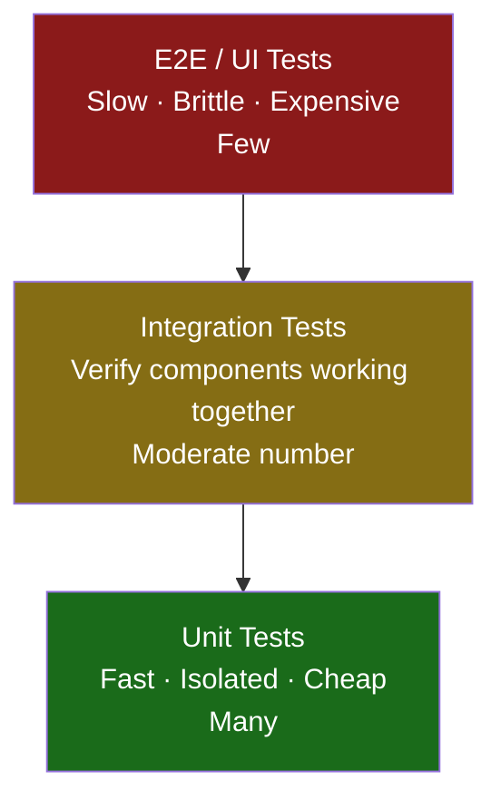

import { Tabs, TabItem } from '@astrojs/starlight/components';
import { Aside, Card, CardGrid, Steps, Badge } from '@astrojs/starlight/components';

Testing is the practice of verifying that code behaves as intended. Good tests catch bugs before production, document expected behaviour, and give you confidence to refactor without fear.

---

## The Testing Pyramid



| Layer | Tests | Speed | Cost | Count |
|---|---|---|---|---|
| Unit | Individual functions / classes | Milliseconds | Low | Many (hundreds) |
| Integration | Multiple components together, real DB/API | Seconds | Medium | Moderate (tens) |
| E2E / UI | Full stack through the browser | Minutes | High | Few (critical paths) |

---

## Unit Testing

A **unit test** verifies a single function, method, or class in isolation. All external dependencies (databases, APIs, file system) are replaced with **test doubles**.

### Anatomy of a Good Test (AAA)

Every test follows Arrange → Act → Assert: set up inputs, call the code under test, then verify the expected outcome.

<Tabs>
<TabItem label="Python">
```python
def test_apply_discount_over_100():
    # Arrange — set up inputs
    order = Order(total=120.00)

    # Act — call the code under test
    apply_discount(order)

    # Assert — verify the expected outcome
    assert order.total == 108.00   # 10% discount applied
```
</TabItem>
<TabItem label="JavaScript">
```javascript
test("applies 10% discount when total is over 100", () => {
    // Arrange
    const order = { total: 120.00 };

    // Act
    const result = applyDiscount(order);

    // Assert
    expect(result.total).toBe(108.00);
});
```
</TabItem>
<TabItem label="C#">
```csharp
[Fact]
public void ApplyDiscount_WhenTotalOver100_AppliesTenPercent()
{
    // Arrange
    var order = new Order { Total = 120.00m };

    // Act
    ApplyDiscount(order);

    // Assert
    Assert.Equal(108.00m, order.Total);
}
```
</TabItem>
<TabItem label="Java">
```java
@Test
void applyDiscount_whenTotalOver100_appliesTenPercent() {
    // Arrange
    Order order = new Order(120.00);

    // Act
    applyDiscount(order);

    // Assert
    assertEquals(108.00, order.getTotal(), 0.001);
}
```
</TabItem>
</Tabs>

### Writing and Running Unit Tests

<Tabs>
<TabItem label="Python">
```python
# src/pricing.py
def calculate_discount(total: float) -> float:
    if total >= 100:
        return total * 0.10
    return 0.0

# tests/test_pricing.py
import pytest
from src.pricing import calculate_discount

def test_no_discount_below_threshold():
    assert calculate_discount(50) == 0.0

def test_discount_at_threshold():
    assert calculate_discount(100) == 10.0

def test_discount_above_threshold():
    assert calculate_discount(200) == 20.0

@pytest.mark.parametrize("total, expected", [
    (0,   0.0),
    (99,  0.0),
    (100, 10.0),
    (150, 15.0),
])
def test_discount_parametrized(total, expected):
    assert calculate_discount(total) == expected
```
</TabItem>
<TabItem label="JavaScript">
```javascript
// src/pricing.js
export function calculateDiscount(total) {
  return total >= 100 ? total * 0.1 : 0;
}

// tests/pricing.test.js
import { calculateDiscount } from "../src/pricing";

describe("calculateDiscount", () => {
  test("returns 0 below threshold", () => {
    expect(calculateDiscount(50)).toBe(0);
  });

  test("applies 10% at and above threshold", () => {
    expect(calculateDiscount(100)).toBe(10);
    expect(calculateDiscount(200)).toBe(20);
  });

  test.each([
    [0, 0], [99, 0], [100, 10], [150, 15],
  ])("calculateDiscount(%d) === %d", (total, expected) => {
    expect(calculateDiscount(total)).toBe(expected);
  });
});
```
</TabItem>
<TabItem label="C#">
```csharp
// src/Pricing.cs
public static class Pricing
{
    public static decimal CalculateDiscount(decimal total) =>
        total >= 100 ? total * 0.10m : 0m;
}

// tests/PricingTests.cs (xUnit)
public class PricingTests
{
    [Fact]
    public void NoDiscountBelowThreshold() =>
        Assert.Equal(0m, Pricing.CalculateDiscount(50));

    [Fact]
    public void DiscountAtThreshold() =>
        Assert.Equal(10m, Pricing.CalculateDiscount(100));

    [Theory]
    [InlineData(0,   0.0)]
    [InlineData(99,  0.0)]
    [InlineData(100, 10.0)]
    [InlineData(150, 15.0)]
    public void ParametrizedDiscount(decimal total, decimal expected) =>
        Assert.Equal(expected, Pricing.CalculateDiscount(total));
}
```
</TabItem>
<TabItem label="Java">
```java
// src/main/java/Pricing.java
public class Pricing {
    public static double calculateDiscount(double total) {
        return total >= 100 ? total * 0.10 : 0.0;
    }
}

// src/test/java/PricingTest.java (JUnit 5)
import org.junit.jupiter.api.*;
import org.junit.jupiter.params.*;
import org.junit.jupiter.params.provider.*;
import static org.junit.jupiter.api.Assertions.*;

class PricingTest {
    @Test
    void noDiscountBelowThreshold() {
        assertEquals(0.0, Pricing.calculateDiscount(50), 0.001);
    }

    @ParameterizedTest
    @CsvSource({ "0, 0", "99, 0", "100, 10", "150, 15" })
    void parametrizedDiscount(double total, double expected) {
        assertEquals(expected, Pricing.calculateDiscount(total), 0.001);
    }
}
```
</TabItem>
</Tabs>

```bash
# Run tests
pytest tests/             # Python
npx jest                  # JavaScript
dotnet test               # C#
./mvnw test               # Java (Maven)
```

---

## Test Doubles

When a unit test needs to isolate the code under test from its real dependencies, you replace those dependencies with **test doubles**.

| Type | Behaviour | Use when |
|---|---|---|
| **Stub** | Returns pre-programmed values | You need a dependency to return specific data |
| **Mock** | Records interactions for verification | You need to assert *how* a dependency was called |
| **Fake** | Working but simplified implementation | You need realistic behaviour without real infrastructure |
| **Spy** | Wraps real object, records calls | You want to observe without fully replacing |

### Mocking Dependencies

<Tabs>
<TabItem label="Python">
```python
from unittest.mock import MagicMock
from src.notification_service import NotificationService

def test_sends_email_on_order():
    # Arrange — create mock dependencies
    mock_emailer = MagicMock()
    mock_logger  = MagicMock()
    service = NotificationService(emailer=mock_emailer, logger=mock_logger)

    # Act
    service.notify(user={"email": "alice@example.com"}, message="Order confirmed")

    # Assert — verify the mock was called correctly
    mock_emailer.send.assert_called_once_with("alice@example.com", "Order confirmed")
    mock_logger.log.assert_called_once()

def test_does_not_send_email_if_user_unsubscribed():
    mock_emailer = MagicMock()
    service = NotificationService(emailer=mock_emailer, logger=MagicMock())

    service.notify(user={"email": "bob@example.com", "unsubscribed": True}, message="...")

    mock_emailer.send.assert_not_called()
```
</TabItem>
<TabItem label="JavaScript">
```javascript
// Auto-mock an ES module
jest.mock("../src/emailer");
import { sendEmail } from "../src/emailer";

test("sends confirmation email after checkout", async () => {
  sendEmail.mockResolvedValue({ success: true });

  await checkout({ items: ["item1"], token: "tok_123" });

  expect(sendEmail).toHaveBeenCalledWith(
    expect.stringContaining("@"),
    expect.stringContaining("confirmed"),
  );
});
```
</TabItem>
<TabItem label="C#">
```csharp
// Using Moq (dotnet add package Moq)
[Fact]
public void Notify_SendsEmailToUser()
{
    // Arrange
    var mockEmailer = new Mock<IEmailer>();
    var mockLogger  = new Mock<ILogger>();
    var service = new NotificationService(mockEmailer.Object, mockLogger.Object);

    // Act
    service.Notify(new User { Email = "alice@example.com" }, "Order confirmed");

    // Assert
    mockEmailer.Verify(e => e.Send("alice@example.com", "Order confirmed"), Times.Once);
}

[Fact]
public void Notify_DoesNotSendEmail_WhenUnsubscribed()
{
    var mockEmailer = new Mock<IEmailer>();
    var service = new NotificationService(mockEmailer.Object, Mock.Of<ILogger>());

    service.Notify(new User { Email = "bob@example.com", Unsubscribed = true }, "...");

    mockEmailer.Verify(e => e.Send(It.IsAny<string>(), It.IsAny<string>()), Times.Never);
}
```
</TabItem>
<TabItem label="Java">
```java
// Using Mockito (testImplementation "org.mockito:mockito-core")
@ExtendWith(MockitoExtension.class)
class NotificationServiceTest {

    @Mock Emailer emailer;
    @Mock Logger  logger;

    @Test
    void notify_sendsEmailToUser() {
        NotificationService service = new NotificationService(emailer, logger);

        service.notify(new User("alice@example.com"), "Order confirmed");

        verify(emailer).send("alice@example.com", "Order confirmed");
        verify(logger).log(any());
    }

    @Test
    void notify_doesNotSendEmail_whenUnsubscribed() {
        NotificationService service = new NotificationService(emailer, logger);
        User user = new User("bob@example.com");
        user.setUnsubscribed(true);

        service.notify(user, "...");

        verify(emailer, never()).send(any(), any());
    }
}
```
</TabItem>
</Tabs>

---

## Integration Testing

Integration tests verify that **multiple components work correctly together**, often against real infrastructure (a test database, a running server).

<Tabs>
<TabItem label="Python">
```python
import pytest
from src.user_repository import UserRepository
from tests.fixtures import test_db   # spins up a test Postgres instance

@pytest.fixture
def repo(test_db):
    return UserRepository(db=test_db)

def test_create_and_fetch_user(repo):
    user_id = repo.create({"name": "Alice", "email": "alice@example.com"})
    user    = repo.find_by_id(user_id)
    assert user["name"]  == "Alice"
    assert user["email"] == "alice@example.com"

def test_email_must_be_unique(repo):
    repo.create({"name": "Alice", "email": "alice@example.com"})
    with pytest.raises(IntegrityError):
        repo.create({"name": "Alice 2", "email": "alice@example.com"})
```
</TabItem>
<TabItem label="JavaScript">
```javascript
// Supertest — HTTP integration test for Express
const request = require("supertest");
const app     = require("../src/app");

describe("GET /users/:id", () => {
  test("returns user for valid ID", async () => {
    const res = await request(app)
      .get("/users/1")
      .set("Authorization", "Bearer test-token");
    expect(res.status).toBe(200);
    expect(res.body.name).toBe("Alice");
  });

  test("returns 401 without token", async () => {
    const res = await request(app).get("/users/1");
    expect(res.status).toBe(401);
  });
});
```
</TabItem>
<TabItem label="C#">
```csharp
// Using WebApplicationFactory (ASP.NET Core integration tests)
public class UserApiTests : IClassFixture<WebApplicationFactory<Program>>
{
    private readonly HttpClient _client;

    public UserApiTests(WebApplicationFactory<Program> factory)
        => _client = factory.CreateClient();

    [Fact]
    public async Task GetUser_ReturnsUser_ForValidId()
    {
        _client.DefaultRequestHeaders.Authorization =
            new AuthenticationHeaderValue("Bearer", "test-token");

        var response = await _client.GetAsync("/users/1");

        response.EnsureSuccessStatusCode();
        var user = await response.Content.ReadFromJsonAsync<User>();
        Assert.Equal("Alice", user?.Name);
    }

    [Fact]
    public async Task GetUser_Returns401_WithoutToken()
    {
        var response = await _client.GetAsync("/users/1");
        Assert.Equal(HttpStatusCode.Unauthorized, response.StatusCode);
    }
}
```
</TabItem>
<TabItem label="Java">
```java
// Spring Boot integration test with @SpringBootTest
@SpringBootTest(webEnvironment = SpringBootTest.WebEnvironment.RANDOM_PORT)
class UserApiTest {

    @Autowired TestRestTemplate restTemplate;

    @Test
    void getUser_returnsUser_forValidId() {
        HttpHeaders headers = new HttpHeaders();
        headers.setBearerAuth("test-token");

        ResponseEntity<User> response = restTemplate.exchange(
            "/users/1", HttpMethod.GET, new HttpEntity<>(headers), User.class);

        assertEquals(HttpStatus.OK, response.getStatusCode());
        assertEquals("Alice", response.getBody().getName());
    }

    @Test
    void getUser_returns401_withoutToken() {
        ResponseEntity<Void> response = restTemplate.getForEntity("/users/1", Void.class);
        assertEquals(HttpStatus.UNAUTHORIZED, response.getStatusCode());
    }
}
```
</TabItem>
</Tabs>

### Test Database Strategies

| Strategy | How | Trade-off |
|---|---|---|
| Real test DB | Spin up a separate Postgres/MySQL instance in CI | Most accurate; slower to set up |
| Docker | `docker-compose up` a clean DB before tests | Reproducible; requires Docker |
| SQLite in-memory | Use a lightweight in-process DB | Fast; may miss DB-specific behaviour |
| Transactions + rollback | Wrap each test in a transaction, roll back after | Fast; keeps DB clean |

---

## Test-Driven Development (TDD)

TDD inverts the normal order: **write the test first**, watch it fail, then write just enough code to make it pass, then refactor.

```
Red → Green → Refactor

Red:     Write a failing test
Green:   Write the minimum code to pass the test
Refactor: Clean up the code without changing behaviour (tests stay green)
```

<Tabs>
<TabItem label="Python">
```python
# 1. RED — write a failing test for a function that doesn't exist yet
def test_password_is_strong():
    assert is_strong_password("Tr0ub4dor&3") is True
    assert is_strong_password("password123") is False
    assert is_strong_password("short")       is False

# 2. GREEN — write the minimum implementation to pass
import re

def is_strong_password(password: str) -> bool:
    checks = [
        len(password) >= 8,
        bool(re.search(r"[A-Z]", password)),
        bool(re.search(r"[0-9]", password)),
        bool(re.search(r"[^A-Za-z0-9]", password)),
    ]
    return all(checks)
```
</TabItem>
<TabItem label="JavaScript">
```javascript
// 1. RED
test("validates strong passwords", () => {
    expect(isStrongPassword("Tr0ub4dor&3")).toBe(true);
    expect(isStrongPassword("password123")).toBe(false);
    expect(isStrongPassword("short")).toBe(false);
});

// 2. GREEN
function isStrongPassword(password) {
    return (
        password.length >= 8 &&
        /[A-Z]/.test(password) &&
        /[0-9]/.test(password) &&
        /[^A-Za-z0-9]/.test(password)
    );
}
```
</TabItem>
<TabItem label="C#">
```csharp
// 1. RED
[Theory]
[InlineData("Tr0ub4dor&3", true)]
[InlineData("password123", false)]
[InlineData("short",       false)]
public void IsStrongPassword_ReturnsExpected(string password, bool expected) =>
    Assert.Equal(expected, PasswordValidator.IsStrong(password));

// 2. GREEN
public static class PasswordValidator
{
    public static bool IsStrong(string password) =>
        password.Length >= 8
        && Regex.IsMatch(password, @"[A-Z]")
        && Regex.IsMatch(password, @"[0-9]")
        && Regex.IsMatch(password, @"[^A-Za-z0-9]");
}
```
</TabItem>
<TabItem label="Java">
```java
// 1. RED
@ParameterizedTest
@CsvSource({
    "Tr0ub4dor&3, true",
    "password123, false",
    "short, false"
})
void isStrongPassword_returnsExpected(String password, boolean expected) {
    assertEquals(expected, PasswordValidator.isStrong(password));
}

// 2. GREEN
public class PasswordValidator {
    public static boolean isStrong(String password) {
        return password.length() >= 8
            && password.chars().anyMatch(Character::isUpperCase)
            && password.chars().anyMatch(Character::isDigit)
            && password.chars().anyMatch(c -> !Character.isLetterOrDigit(c));
    }
}
```
</TabItem>
</Tabs>

**Benefits of TDD:**
- Tests document the intended API before it exists
- Forces you to think about the interface before the implementation
- Prevents over-engineering (you only write what tests require)
- The test suite grows in lock-step with the code

---

## What Makes a Good Test

| Property | Description |
|---|---|
| **Fast** | Runs in milliseconds — slow tests get disabled |
| **Isolated** | Does not depend on other tests or shared state |
| **Repeatable** | Same result every time, on any machine |
| **Self-validating** | Pass/fail is unambiguous — no manual inspection |
| **Focused** | Tests one specific behaviour, not multiple |

### What to Test

- Happy path — does it work for valid, expected input?
- Edge cases — empty input, zero, maximum values, boundary conditions
- Error paths — what happens when dependencies fail or inputs are invalid?
- Contract — does the public interface behave as documented?

### What Not to Test

- Implementation details (private methods, internal state)
- Third-party library behaviour (that's their test suite's job)
- Generated code or boilerplate

---

## Test Coverage

Coverage measures what percentage of your code is executed during tests. It is a useful floor (find untested branches), not a goal (100% coverage does not mean your tests are good).

```bash
# Python
pytest --cov=src --cov-report=term-missing

# JavaScript
npx jest --coverage

# C#
dotnet test /p:CollectCoverage=true

# Java (Maven with JaCoCo)
./mvnw test jacoco:report
```

**Practical guidance:**
- 80% coverage is a reasonable floor for business-critical code
- Focus on covering the branches that matter (error paths, edge cases)
- A test that executes code but makes no assertions provides coverage but no safety

---

## Related

- [OOP](/programming/oop) — dependency injection makes unit testing possible without real infrastructure
- [Functional Programming](/programming/functional) — pure functions are trivially testable; no mocks needed
- [Error Handling](/programming/error-handling) — test error paths, not just the happy path
- [Secure Coding](/programming/secure-coding) — security logic (validation, auth checks) deserves dedicated tests
