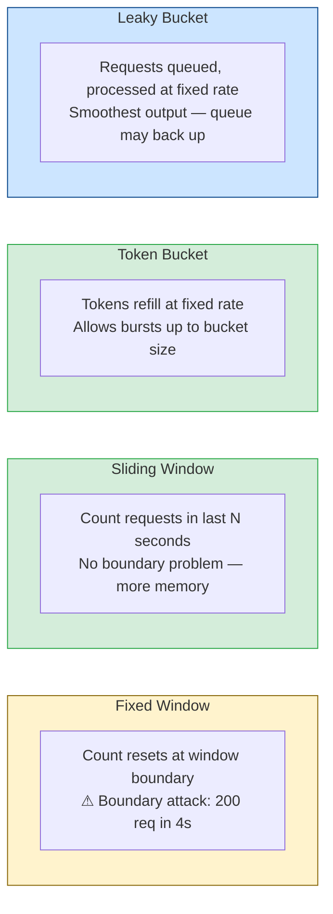
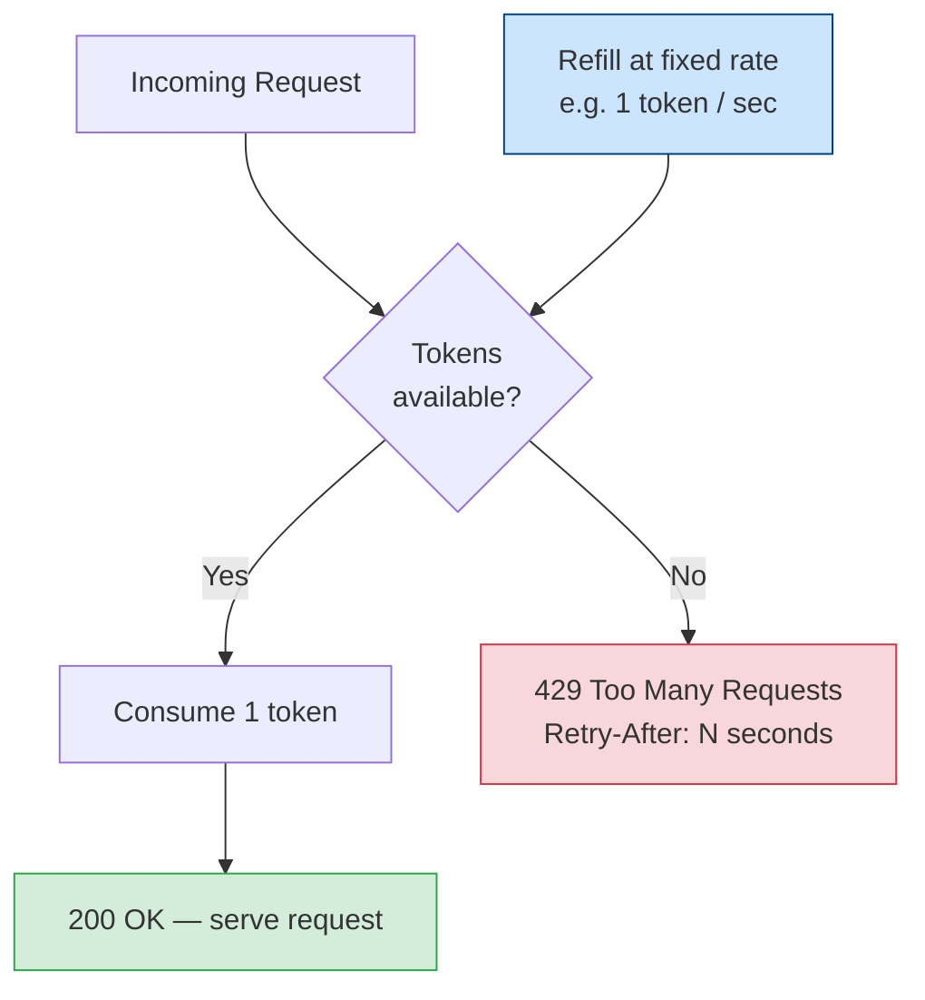

import { Tabs, TabItem } from '@astrojs/starlight/components';
import { Aside } from '@astrojs/starlight/components';

Rate limiting controls how many requests a client can make within a time window. It is a primary defense against brute force attacks, credential stuffing, API scraping, and unintentional denial of service.

## Why Rate Limiting Matters

Without rate limiting:
- Login endpoints can be brute-forced with millions of attempts per hour
- Password reset flows reveal account existence at scale
- API keys can be scraped in minutes instead of months
- A buggy client can DOS your service unintentionally

---

## Algorithms



### Fixed Window

Count requests in a fixed time window (e.g., 100 requests per minute). Simple but suffers from boundary attacks — a client can make 100 requests at 00:59 and 100 more at 01:01, hitting 200 requests in a 2-second window.

```
Window: 12:00:00–12:01:00 → max 100
Window: 12:01:00–12:02:00 → max 100

Attack: 100 requests at 12:00:58 + 100 at 12:01:02 = 200 in 4 seconds ✗
```

### Sliding Window

Tracks the exact timestamps of recent requests. No boundary problem. More memory-intensive but more accurate.

```
At any point in time: count requests in the last 60 seconds
Cannot exceed 100 in any rolling 60-second window
```

### Token Bucket

A bucket holds tokens that replenish at a fixed rate. Each request consumes one token. Allows short bursts while enforcing a sustained average rate.

```
Bucket capacity: 20 tokens (max burst)
Refill rate: 1 token/second

Client sends 20 requests instantly → bucket empty → subsequent requests rejected
After 10 seconds → 10 tokens refilled → 10 more requests allowed
```

Suitable for APIs that need to handle bursty traffic while still protecting sustained load.

### Leaky Bucket

Requests enter a queue (the "bucket") and are processed at a fixed output rate. Excess requests are dropped or queued. Smooths out traffic spikes.

---

## Implementation

### Express (In-Memory)

Good for single-instance applications:

<Tabs>
<TabItem label="JavaScript">
```javascript
import rateLimit from 'express-rate-limit';

// Auth endpoints — very strict
const authLimiter = rateLimit({
  windowMs: 15 * 60 * 1000,  // 15 minutes
  max: 10,                    // 10 requests per window
  standardHeaders: 'draft-7', // RateLimit headers
  legacyHeaders: false,
  message: { error: 'Too many attempts. Try again in 15 minutes.' },
  skipSuccessfulRequests: false,  // count all requests, not just failures
});

// General API — moderate
const apiLimiter = rateLimit({
  windowMs: 60 * 1000,  // 1 minute
  max: 200,
  standardHeaders: 'draft-7',
});

// Expensive operations (report generation, email sending)
const heavyLimiter = rateLimit({
  windowMs: 60 * 60 * 1000,  // 1 hour
  max: 10,
});

app.post('/api/auth/login', authLimiter, loginHandler);
app.post('/api/auth/forgot-password', authLimiter, forgotPasswordHandler);
app.use('/api', apiLimiter);
app.post('/api/reports', heavyLimiter, reportHandler);
```
</TabItem>
<TabItem label="Python">
```python
from slowapi import Limiter
from slowapi.util import get_remote_address
from fastapi import Request

limiter = Limiter(key_func=get_remote_address)

@app.post("/api/auth/login")
@limiter.limit("10/15minutes")
async def login(request: Request, body: LoginRequest):
    ...

@app.get("/api/users")
@limiter.limit("200/minute")
async def list_users(request: Request):
    ...

@app.post("/api/reports")
@limiter.limit("10/hour")
async def generate_report(request: Request):
    ...
```
</TabItem>
<TabItem label="C#">
```csharp
builder.Services.AddRateLimiter(options =>
{
    options.AddFixedWindowLimiter("auth", o =>
    {
        o.Window = TimeSpan.FromMinutes(15);
        o.PermitLimit = 10;
        o.QueueLimit = 0;
    });
    options.AddFixedWindowLimiter("api", o =>
    {
        o.Window = TimeSpan.FromMinutes(1);
        o.PermitLimit = 200;
    });
    options.AddFixedWindowLimiter("heavy", o =>
    {
        o.Window = TimeSpan.FromHours(1);
        o.PermitLimit = 10;
    });
    options.RejectionStatusCode = 429;
});
```
</TabItem>
<TabItem label="Java">
```java
// Bucket4j with Spring Boot
@Bean
public Bucket loginBucket() {
    Bandwidth limit = Bandwidth.classic(10,
        Refill.intervally(10, Duration.ofMinutes(15)));
    return Bucket.builder().addLimit(limit).build();
}

@PostMapping("/api/auth/login")
public ResponseEntity<LoginResponse> login(@RequestBody LoginRequest req,
        HttpServletRequest request) {
    if (!loginBucket.tryConsume(1)) {
        return ResponseEntity.status(429).build();
    }
    // process login
}
```
</TabItem>
</Tabs>

### Redis-Backed (Distributed)

Required for multi-instance deployments — in-memory rate limiting doesn't share state across pods:

```javascript
import rateLimit from 'express-rate-limit';
import { RedisStore } from 'rate-limit-redis';
import { createClient } from 'redis';

const redis = createClient({ url: process.env.REDIS_URL });
await redis.connect();

const limiter = rateLimit({
  windowMs: 15 * 60 * 1000,
  max: 100,
  standardHeaders: 'draft-7',
  store: new RedisStore({
    sendCommand: (...args) => redis.sendCommand(args),
  }),
});
```

### Redis Sliding Window (Lua Script)

Accurate sliding window in Redis — atomic operation prevents race conditions:

```javascript
const SLIDING_WINDOW_SCRIPT = `
  local key = KEYS[1]
  local now = tonumber(ARGV[1])
  local window = tonumber(ARGV[2])
  local limit = tonumber(ARGV[3])

  redis.call('ZREMRANGEBYSCORE', key, 0, now - window)
  local count = redis.call('ZCARD', key)

  if count < limit then
    redis.call('ZADD', key, now, now .. math.random())
    redis.call('EXPIRE', key, math.ceil(window / 1000))
    return 1  -- allowed
  else
    return 0  -- rejected
  end
`;

async function checkRateLimit(key, windowMs, limit) {
  const now = Date.now();
  const result = await redis.eval(SLIDING_WINDOW_SCRIPT, {
    keys: [key],
    arguments: [now.toString(), windowMs.toString(), limit.toString()],
  });
  return result === 1;
}

// Usage
const key = `rl:login:${req.ip}`;
const allowed = await checkRateLimit(key, 15 * 60 * 1000, 10);
if (!allowed) return res.status(429).json({ error: 'Rate limit exceeded' });
```

---

## Token Bucket — Decision Flow



## Keying Strategy

What you use as the rate limit key determines who the limit applies to:

| Key | Protects against | Risk |
|---|---|---|
| IP address | Most attacks | VPNs, NAT, shared IPs |
| User ID | Per-account limits after auth | Doesn't protect pre-auth endpoints |
| IP + User-Agent | Slightly harder to bypass | Still easy to spoof |
| API key | Accurate per-client limiting | Requires auth first |
| Email (on login) | Account-level brute force | Attacker can enumerate existence |

<Aside type="tip">
**Best practice:** Use multiple keys. On a login endpoint, limit by IP *and* by target email address. An attacker distributing across many IPs still hits the per-email limit.
</Aside>

```javascript
const ipKey = `rl:login:ip:${req.ip}`;
const emailKey = `rl:login:email:${req.body.email?.toLowerCase()}`;

const [ipOk, emailOk] = await Promise.all([
  checkRateLimit(ipKey, 15 * 60 * 1000, 20),  // 20 per IP
  checkRateLimit(emailKey, 15 * 60 * 1000, 10), // 10 per email
]);

if (!ipOk || !emailOk) return res.status(429).json({ error: 'Too many attempts' });
```

---

## Response Headers

Include rate limit headers so clients can self-throttle:

```
# Standard headers (RFC 9110 draft)
RateLimit-Policy: 100;w=60
RateLimit-Limit: 100
RateLimit-Remaining: 73
RateLimit-Reset: 1716200400

# On rejection (429)
HTTP/1.1 429 Too Many Requests
Retry-After: 847
```

```javascript
// On 429 response, always include Retry-After
res.status(429)
  .set('Retry-After', String(Math.ceil(resetTime / 1000)))
  .json({ error: 'Rate limit exceeded' });
```

---

## Graduated Response

A graduated response avoids hard lockouts while still increasing friction on repeated abuse:

<Tabs>
<TabItem label="JavaScript">
```javascript
async function loginRateLimit(ip, email) {
  const attempts = await getAttemptCount(ip, email);

  if (attempts < 5) return { allow: true };
  if (attempts < 10) return { allow: true, requireCaptcha: true };
  if (attempts < 20) return { allow: false, lockoutSeconds: 60 };
  return { allow: false, lockoutSeconds: 3600 };
}
```
</TabItem>
<TabItem label="Python">
```python
async def login_rate_limit(ip: str, email: str) -> dict:
    attempts = await get_attempt_count(ip, email)
    if attempts < 5:
        return {"allow": True}
    if attempts < 10:
        return {"allow": True, "require_captcha": True}
    if attempts < 20:
        return {"allow": False, "lockout_seconds": 60}
    return {"allow": False, "lockout_seconds": 3600}
```
</TabItem>
<TabItem label="C#">
```csharp
public async Task<RateLimitResult> LoginRateLimit(string ip, string email)
{
    int attempts = await GetAttemptCount(ip, email);
    return attempts switch
    {
        < 5  => new RateLimitResult { Allow = true },
        < 10 => new RateLimitResult { Allow = true, RequireCaptcha = true },
        < 20 => new RateLimitResult { Allow = false, LockoutSeconds = 60 },
        _    => new RateLimitResult { Allow = false, LockoutSeconds = 3600 },
    };
}
```
</TabItem>
<TabItem label="Java">
```java
public RateLimitResult loginRateLimit(String ip, String email) {
    int attempts = getAttemptCount(ip, email);
    if (attempts < 5) return RateLimitResult.allow();
    if (attempts < 10) return RateLimitResult.allowWithCaptcha();
    if (attempts < 20) return RateLimitResult.deny(60);
    return RateLimitResult.deny(3600);
}
```
</TabItem>
</Tabs>

---

## Limits Reference Table

Suggested limits by endpoint type — adjust based on your traffic patterns:

| Endpoint | Window | Limit | Key |
|---|---|---|---|
| Login | 15 min | 10 | IP + email |
| Register | 1 hour | 5 | IP |
| Password reset request | 1 hour | 3 | IP + email |
| Password reset use | Once | 1 | Token |
| SMS / OTP send | 1 hour | 5 | IP + phone |
| API (authenticated) | 1 min | 200 | User ID |
| API (unauthenticated) | 1 min | 30 | IP |
| File upload | 1 hour | 20 | User ID |
| Report generation | 1 hour | 5 | User ID |
| Webhook receiver | 1 sec | 50 | Source IP |
