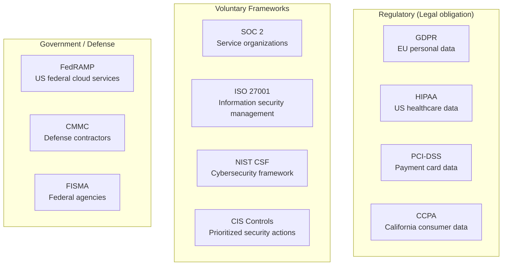

**Compliance** in security means demonstrating that an organization meets defined standards for protecting data and systems. It is often described cynically as a "checkbox exercise" — and it can be. But done correctly, compliance frameworks encode hard-won security lessons from real incidents and provide a structured path toward a defensible security posture.

## Compliance vs Security

The most important distinction in security compliance:

| Property | Compliance | Security |
|----------|-----------|---------|
| **Goal** | Meet defined requirements | Protect against actual threats |
| **Measurement** | Auditors check boxes | Adversaries test reality |
| **Timing** | Periodic assessments | Continuous |
| **Coverage** | Defined scope | Whatever attackers target |

A system can be **fully compliant and still get breached** if the standard doesn't cover the actual attack vector. A system can be **genuinely secure but technically non-compliant** if it uses controls that achieve the same goal through different means.

**Compliance is the floor, not the ceiling.** The target should be security; compliance frameworks are useful scaffolding to get there.

## Why Compliance Exists

Several drivers push organizations toward formal compliance:

**Legal and regulatory requirements:** GDPR, HIPAA, PCI-DSS carry legal penalties for non-compliance. These are not optional — violations result in fines, regulatory action, or loss of operating rights.

**Customer and partner requirements:** Enterprise customers routinely require SOC 2 Type II reports before signing contracts. Payment processors require PCI-DSS compliance. Suppliers to the US government may require FedRAMP or CMMC compliance.

**Insurance:** Cyber insurance underwriters increasingly require evidence of compliance (SOC 2, ISO 27001) as a condition of coverage or for preferential premiums.

**Post-breach liability:** Evidence of compliance can be a legal defense in negligence cases. Demonstrating that reasonable security standards were followed matters to courts and regulators.

**Internal structure:** Compliance frameworks provide structure for organizations building security programs from scratch — a checklist of what needs to exist.

## The Compliance Landscape

## Topics in This Section

| Topic | What you'll learn |
|-------|------------------|
| [Ethics & Security Law](./ethics-and-law) | Security ethics, responsible disclosure, computer crime law, privacy rights |
| [Security Frameworks](./security-frameworks) | SOC 2, ISO 27001, NIST CSF, CIS Controls — what each covers and when to use them |
| [GDPR for Engineers](./gdpr) | Technical requirements of GDPR — data minimization, encryption, breach notification, DPIAs |

## Selecting the Right Framework

Not every organization needs every framework. Selection depends on:

| Question | Determines |
|----------|-----------|
| Do you handle EU personal data? | GDPR (required) |
| Do you handle US healthcare records? | HIPAA (required) |
| Do you process credit card payments? | PCI-DSS (required) |
| Do you sell to enterprise customers? | SOC 2 Type II (strongly expected) |
| Do you sell to the US government? | FedRAMP / CMMC (required) |
| Do you want a global ISO standard? | ISO 27001 |
| Do you need a starting framework with no other requirement? | NIST CSF or CIS Controls |

Multiple frameworks overlap significantly. A NIST CSF implementation satisfies many ISO 27001 controls; a SOC 2 program satisfies much of GDPR's technical requirements.
