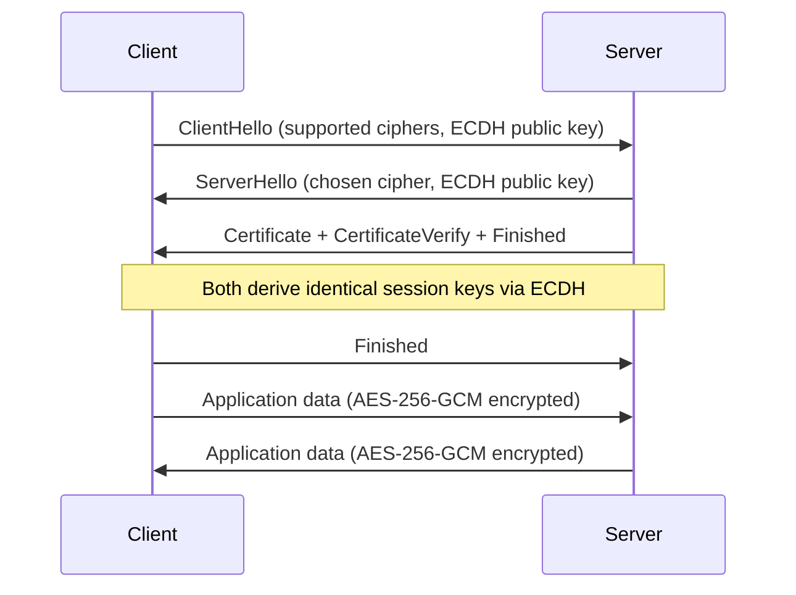

Asymmetric (public-key) cryptography uses a key pair: a public key that anyone can know, and a private key that only the owner keeps secret.


*Public-key encryption: Alice publishes her public key. Bob encrypts with it. Only Alice's private key can decrypt.* The mathematical relationship between the two keys enables two operations:

- **Encryption:** Encrypt with the *public* key → only the *private* key can decrypt
- **Signatures:** Sign with the *private* key → anyone with the *public* key can verify

---

## Key Algorithms

### RSA

RSA security relies on the difficulty of factoring large numbers. Still widely deployed, but being phased out in favor of elliptic curve approaches for new applications.

| Parameter | Recommendation |
|---|---|
| Key size | 2048 bits minimum; **4096 bits** preferred for long-lived keys |
| Encryption padding | **RSA-OAEP** with SHA-256 (PKCS#1 v1.5 is vulnerable — avoid) |
| Signature padding | **RSA-PSS** (PKCS#1 v1.5 signatures are fragile — avoid for new code) |

```javascript
// Node.js — RSA-OAEP encryption
import { generateKeyPairSync, publicEncrypt, privateDecrypt, constants } from 'crypto';

const { publicKey, privateKey } = generateKeyPairSync('rsa', {
  modulusLength: 4096,
  publicKeyEncoding: { type: 'spki', format: 'pem' },
  privateKeyEncoding: { type: 'pkcs8', format: 'pem' },
});

const ciphertext = publicEncrypt(
  { key: publicKey, padding: constants.RSA_PKCS1_OAEP_PADDING, oaepHash: 'sha256' },
  Buffer.from('secret message')
);

const plaintext = privateDecrypt(
  { key: privateKey, padding: constants.RSA_PKCS1_OAEP_PADDING, oaepHash: 'sha256' },
  ciphertext
);
```

**RSA cannot encrypt large data directly.** Maximum plaintext size = key size - overhead (e.g., 4096-bit key with OAEP-SHA256 = 446 bytes max). In practice, RSA encrypts a symmetric key (hybrid encryption), which then encrypts the actual data.

### Elliptic Curve Cryptography (ECC)

ECC provides the same security as RSA with much smaller keys:

| Equivalent security | RSA key size | ECC key size |
|---|---|---|
| 128-bit | 3072 bits | 256 bits |
| 192-bit | 7680 bits | 384 bits |
| 256-bit | 15360 bits | 521 bits |

Smaller keys = faster operations, less bandwidth, less storage.

**Recommended curves:**
- **P-256 (secp256r1):** NIST curve; wide compatibility; suitable for most uses
- **P-384:** Higher security margin
- **X25519:** For key agreement (ECDH); fast, no patent concerns, resistant to implementation mistakes
- **Ed25519:** For signatures; 128-bit security, very fast, small 64-byte signatures

```javascript
// Ed25519 signatures
import { generateKeyPairSync, sign, verify } from 'crypto';

const { publicKey, privateKey } = generateKeyPairSync('ed25519');

const message = Buffer.from('data to sign');
const signature = sign(null, message, privateKey);  // null = no external hashing

const valid = verify(null, message, publicKey, signature);
```

### ECDH Key Agreement

ECDH (Elliptic Curve Diffie-Hellman) allows two parties to establish a shared secret over a public channel without transmitting the secret itself.


*Both sides compute the same shared secret using their private key + the other's public key. The shared secret never crosses the wire.*

```
Alice generates: (a_priv, a_pub)
Bob generates:   (b_priv, b_pub)

Both exchange public keys publicly.

Alice computes: ECDH(a_priv, b_pub) → shared_secret
Bob computes:   ECDH(b_priv, a_pub) → shared_secret

Both arrive at the same shared_secret without it ever crossing the wire.
```

```javascript
import { generateKeyPairSync, diffieHellman } from 'crypto';

const alice = generateKeyPairSync('x25519');
const bob = generateKeyPairSync('x25519');

// Alice and Bob exchange public keys, then:
const aliceSecret = diffieHellman({ privateKey: alice.privateKey, publicKey: bob.publicKey });
const bobSecret   = diffieHellman({ privateKey: bob.privateKey, publicKey: alice.publicKey });

// aliceSecret.equals(bobSecret) === true
```

---

## Digital Signatures

Signatures prove authenticity and integrity. The signer uses their private key; anyone with the public key can verify.

### Sign-Then-Encrypt vs Encrypt-Then-Sign

Order matters for security semantics:

- **Sign-then-encrypt:** Signature is inside the envelope. The recipient can verify the signature only after decryption. Protects against signature stripping attacks when used correctly.
- **Encrypt-then-sign:** Signature covers the ciphertext. Anyone can verify the outer signature (authenticated outer envelope). The recommended pattern for most protocols.

### Certificate-Based Trust

In practice, you need a way to trust that a public key belongs to a specific entity. That is the job of certificates (X.509) and a Public Key Infrastructure (PKI). See [Certificates & PKI](/auth/protocols/certificates-pki).

---

## How TLS Uses Asymmetric Cryptography

TLS uses asymmetric cryptography only for the handshake (key establishment and authentication), then switches to symmetric encryption for the actual data transfer. This is called **hybrid encryption**.


*TLS 1.3 handshake: ECDHE key exchange in the first round-trip, then all data is encrypted with AES-GCM derived from the shared secret.*



**Forward secrecy:** TLS 1.3 mandates ephemeral key exchange (ECDHE) — a new key pair is generated per session. Even if the server's long-term private key is compromised later, past sessions cannot be decrypted.

---

## Key Storage

Private keys must be protected. A leaked private key means an attacker can impersonate you or decrypt all historical messages encrypted to that key.

| Storage option | Use case |
|---|---|
| HSM (Hardware Security Module) | CA private keys, payment processing |
| Cloud KMS (AWS KMS, GCP Cloud KMS) | Application encryption keys, TLS keys at scale |
| Secrets manager (Vault, AWS Secrets Manager) | Application-level keys |
| Encrypted key file (PEM + passphrase) | Developer machines, CI/CD |
| Unprotected PEM file | ✗ Never for production |

```bash
# Encrypt a private key with a passphrase when storing on disk
openssl genrsa -aes256 -out private.pem 4096

# Check if a key file is encrypted (look for DEK-Info header)
head private.pem
```

---

## Common Mistakes

| Mistake | Consequence | Fix |
|---|---|---|
| Using RSA for large data without hybrid encryption | Encryption fails or truncates | Encrypt a symmetric key with RSA, use AES for data |
| PKCS#1 v1.5 padding for RSA encryption | BLEICHENBACHER attack | Use RSA-OAEP |
| Using weak curves (P-192, secp112r1) | Low security margin | Use P-256, P-384, or X25519 |
| Trusting public key without verifying certificate | Impersonation attacks | Validate certificate chain against trusted CA |
| Storing private key in source code or git | Key compromise | Use secrets manager; add `*.pem` to `.gitignore` |
